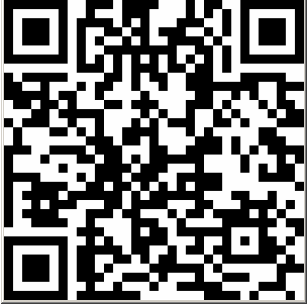

## Flare-On 2020 - #6 codeit
___

### Description: 

*Reverse engineer this little compiled script to figure out what you need to do to make it give you the flag (as a QR code).*

`*7zip password: flare`
___

### Solution:

A quick a look at the binary's string indicates that we have an [AutoIt](https://www.autoitscript.com/site/) script.
Luckily there is an AutoIt decompiler, called [Exe2Aut](http://domoticx.com/autoit3-decompiler-exe2aut/). 
The decompiled script is shown at [codeit_decompiled_original.au3](./codeit_decompiled_original.au3)

Unfortunately, the script is heavily obfuscated. To make things easier I wrote some VIM scripts to do an
in-place deobfuscation:
```
function AutoItDeobfuscator()
    let l:parse_header = 0

    " Rebame globals like:
    "   Global $flavekolca = Number(" 0 "), $flerqqjbmh = Number(" 1 "), 
    " Iterate over each line
    for l:line in range(1, line('$'))      

        while 1 
            let l:var_decl = '\($fl[a-z]\{8}\) = Number(" \([0-9]*\) ")'
            let l:hold_buffers = matchlist(getline(l:line), l:var_decl)

            if len(l:hold_buffers) == 0
                break
            endif

            let l:newname = printf('$const_%d', l:hold_buffers[2])

            execute '% substitute /' . l:hold_buffers[1] . '/' . l:newname . '/g'
        endwhile
    endfor
  
    let l:str_tbl = ['struct;uint bfSize;uint bfReserved;uint bfOffBits;uint biSize;int biWidth;int biHeight;ushort biPlanes;ushort biBitCount;uint biCompression;uint biSizeImage;int biXPelsPerMeter;int biYPelsPerMeter;uint biClrUsed;uint biClrImportant;endstruct;', 'bfSize', 'bfReserved', 'bfOffBits', 'biSize', 'biWidth', 'biHeight', 'biPlanes', 'biBitCount', 'biCompression', 'biSizeImage', 'biXPelsPerMeter', 'biYPelsPerMeter', 'biClrUsed', 'biClrImportant', 'struct;', 'byte[', '];', 'endstruct', '', '.bmp', '\\', '.dll', 'struct;dword;char[1024];endstruct', 'kernel32.dll', 'int', 'GetComputerNameA', 'ptr', 'CodeIt Plus!', 'struct;byte[', '];endstruct', 'struct;byte[54];byte[', 'struct;ptr;ptr;dword;byte[32];endstruct', 'advapi32.dll', 'CryptAcquireContextA', 'dword', 'CryptCreateHash', 'CryptHashData', 'struct*', 'CryptGetHashParam', '0x', '08020', '00010', '66000', '02000', '0000', 'CD4B3', '2C650', 'CF21B', 'DA184', 'D8913', 'E6F92', '0A37A', '4F396', '3736C', '042C4', '59EA0', '7B79E', 'A443F', 'FD189', '8BAE4', '9B115', 'F6CB1', 'E2A7C', '1AB3C', '4C256', '12A51', '9035F', '18FB3', 'B1752', '8B3AE', 'CAF3D', '480E9', '8BF8A', '635DA', 'F974E', '00135', '35D23', '1E4B7', '5B2C3', '8B804', 'C7AE4', 'D266A', '37B36', 'F2C55', '5BF3A', '9EA6A', '58BC8', 'F906C', 'C665E', 'AE2CE', '60F2C', 'DE38F', 'D3026', '9CC4C', 'E5BB0', '90472', 'FF9BD', '26F91', '19B8C', '484FE', '69EB9', '34F43', 'FEEDE', 'DCEBA', '79146', '0819F', 'B21F1', '0F832', 'B2A5D', '4D772', 'DB12C', '3BED9', '47F6F', '706AE', '4411A', '52', 'struct;ptr;ptr;dword;byte[8192];byte[', '];dword;endstruct', 'CryptImportKey', 'CryptDecrypt', 'FLARE', 'ERALF', 'CryptDestroyKey', 'CryptReleaseContext', 'CryptDestroyHash', 'struct;ptr;ptr;dword;byte[16];endstruct', 'struct;dword;dword;dword;dword;dword;byte[128];endstruct', 'GetVersionExA', 'Enter text to encode', 'Can haz code?', '', 'Help', 'About CodeIt Plus!', 'struct;dword;dword;byte[3918];endstruct', 'int:cdecl', 'justGenerateQRSymbol', 'str', 'justConvertQRSymbolToBitmapPixels', 'This program generates QR codes using QR Code Generator (https://www.nayuki.io/page/qr-code-generator-library) developed by Nayuki. ', 'QR Code Generator is available on GitHub (https://github.com/nayuki/QR-Code-generator) and open-sourced under the following permissive MIT License (https://github.com/nayuki/QR-Code-generator#license):', 'Copyright \xc2\xa9 2020 Project Nayuki. (MIT License)', 'https://www.nayuki.io/page/qr-code-generator-library', 'Permission is hereby granted, free of charge, to any person obtaining a copy of this software and associated documentation files (the Software), to deal in the Software without restriction, including without limitation the rights to use, copy, modify, merge, publish, distribute, sublicense, and/or sell copies of the Software, and to permit persons to whom the Software is furnished to do so, subject to the following conditions:', '1. The above copyright notice and this permission notice shall be included in all copies or substantial portions of the Software.', '2. The Software is provided as is, without warranty of any kind, express or implied, including but not limited to the warranties of merchantability, fitness for a particular purpose and noninfringement. In no event shall the authors or copyright holders be liable for any claim, damages or other liability, whether in an action of contract, tort or otherwise, arising from, out of or in connection with the Software or the use or other dealings in the Software.', 'struct;ushort;endstruct', 'struct;byte;byte;byte;endstruct', 'CreateFile', 'uint', 'SetFilePointer', 'long', 'WriteFile', 'struct;dword;endstruct', 'ReadFile', 'CloseHandle', 'DeleteFileA', 'GetFileSize']

    " Rebame globals like:
    "   arehdidxrgk($os[$const_004]), $const_054)
    " Iterate over each line
    for l:line in range(1, line('$'))      

        while 1 
            let l:deobf_func = 'arehdidxrgk($os\[$const_\([0-9]*\)\])'
            let l:hold_buffers = matchlist(getline(l:line), l:deobf_func)

            if len(l:hold_buffers) == 0
                break
            endif

            let l:newname = escape(l:str_tbl[str2nr(l:hold_buffers[1]-1)], '/')
            let l:oldfunc = 'arehdidxrgk($os\[$const_' . l:hold_buffers[1] . '\])'
            execute '% substitute /' . l:oldfunc . '/"' . l:newname . '"/g'
        endwhile
    endfor

    execute '% substitute /$const_\([0-9]*\)/\1/g'
    echo 'AutoID renaming completed.'
endfunction

" Map function to F6
nnoremap #6 :call AutoItDeobfuscator()
```

I also wrote another VIM script to ease variable renaming across the code:
```
function Rename()
	let cursor_loc = getpos('.')
    " Copy te word that cursor points to (move bacwards to the beginning of the word and
    " then to the end). First do a right movement to prevent cases where the cursor is at
    " the first character of the work ('b' will move on the previous word) and
    " then copy the word into register a.
    normal! lb"aye
    
    let old_name = getreg('a')
    let new_name = input("Rename '" . old_name . "' with: ")
  
    execute '% substitute /\<' . old_name . '\>/' . new_name . '/g'

    " Restore cursor (subsitute moves it).
    call setpos('.', cursor_loc)
endfunction

" Map function to F2
nnoremap #2 :call Rename()
```

After that, we get a clean, easy to understand AutoIt script: [codeit_deobfuscated.au3](./codeit_deobfuscated.au3).
The interesting part starts from function `decrypt`:
```vbscript
Func decrypt(ByRef $struct_F)
	Local $computer_name = get_computer_name()
	If $computer_name <> -1 Then
		$computer_name = Binary(StringLower(BinaryToString($computer_name)))
		Local $hash_data = DllStructCreate("struct;byte[" & BinaryLen($computer_name) & "];endstruct")
		DllStructSetData($hash_data, 1, $computer_name)
		fill_hash_data($hash_data)
		Local $struct_A = DllStructCreate("struct;ptr;ptr;dword;byte[32];endstruct")
		DllStructSetData($struct_A, 3, 32)
		Local $fluzytjacb = DllCall("advapi32.dll", "int", "CryptAcquireContextA", "ptr", 
                    DllStructGetPtr($struct_A, 1), "ptr", 0, "ptr", 0, "dword", 24, "dword", 0xF0000000)

		If $fluzytjacb[0] <> 0 Then
			$fluzytjacb = DllCall("advapi32.dll", "int", "CryptCreateHash", "ptr", DllStructGetData($struct_A, 1), "dword", 0x800C, "dword", 0, "dword", 0, "ptr", DllStructGetPtr($struct_A, 2))
			If $fluzytjacb[0] <> 0 Then
				$fluzytjacb = DllCall("advapi32.dll", "int", "CryptHashData", "ptr", DllStructGetData($struct_A, 2), "struct*", $hash_data, "dword", DllStructGetSize($hash_data), "dword", 0)
				If $fluzytjacb[0] <> 0 Then
					$fluzytjacb = DllCall("advapi32.dll", "int", "CryptGetHashParam", "ptr", DllStructGetData($struct_A, 2), "dword", 2, "ptr", DllStructGetPtr($struct_A, 4), "ptr", DllStructGetPtr($struct_A, 3), "dword", 0)
					If $fluzytjacb[0] <> 0 Then
						Local $blob_hdr = Binary("0x" & "08020" & "00010" & "66000" & "02000" & "0000") & 
                            DllStructGetData($struct_A, 4)
						Local $ciphertext = Binary("0x" & "CD4B3" & "2C650" & "CF21B" & "DA184" & "D8913" & "E6F92" & "0A37A" & "4F396" & "3736C" & "042C4" & "59EA0" & "7B79E" & "A443F" & "FD189" & "8BAE4" & "9B115" & "F6CB1" & "E2A7C" & "1AB3C" & "4C256" & "12A51" & "9035F" & "18FB3" & "B1752" & "8B3AE" & "CAF3D" & "480E9" & "8BF8A" & "635DA" & "F974E" & "00135" & "35D23" & "1E4B7" & "5B2C3" & "8B804" & "C7AE4" & "D266A" & "37B36" & "F2C55" & "5BF3A" & "9EA6A" & "58BC8" & "F906C" & "C665E" & "AE2CE" & "60F2C" & "DE38F" & "D3026" & "9CC4C" & "E5BB0" & "90472" & "FF9BD" & "26F91" & "19B8C" & "484FE" & "69EB9" & "34F43" & "FEEDE" & "DCEBA" & "79146" & "0819F" & "B21F1" & "0F832" & "B2A5D" & "4D772" & "DB12C" & "3BED9" & "47F6F" & "706AE" & "4411A" & "52")
						Local $crypt_struct = DllStructCreate("struct;ptr;ptr;dword;byte[8192];byte[" & BinaryLen($blob_hdr) & "];dword;endstruct")
						DllStructSetData($crypt_struct, 3, BinaryLen($ciphertext))
						DllStructSetData($crypt_struct, 4, $ciphertext)
						DllStructSetData($crypt_struct, 5, $blob_hdr)
						DllStructSetData($crypt_struct, 6, BinaryLen($blob_hdr))
						Local $fluzytjacb = DllCall("advapi32.dll", "int", "CryptAcquireContextA", "ptr", DllStructGetPtr($crypt_struct, 1), "ptr", 0, "ptr", 0, "dword", 24, "dword", 4026531840)
						If $fluzytjacb[0] <> 0 Then
							$fluzytjacb = DllCall("advapi32.dll", "int", "CryptImportKey", "ptr", DllStructGetData($crypt_struct, 1), "ptr", DllStructGetPtr($crypt_struct, 5), "dword", DllStructGetData($crypt_struct, 6), "dword", 0, "dword", 0, "ptr", DllStructGetPtr($crypt_struct, 2))
							If $fluzytjacb[0] <> 0 Then
								$fluzytjacb = DllCall("advapi32.dll", "int", "CryptDecrypt", "ptr", DllStructGetData($crypt_struct, 2), "dword", 0, "dword", 1, "dword", 0, "ptr", DllStructGetPtr($crypt_struct, 4), "ptr", DllStructGetPtr($crypt_struct, 3))
								If $fluzytjacb[0] <> 0 Then
									Local $plaintext = BinaryMid(DllStructGetData($crypt_struct, 4), 1, DllStructGetData($crypt_struct, 3))
                                    ; plaintext: 'FLARE????$$$$---....---ERALF'
									$FLARE = Binary("FLARE")
									$ERALF = Binary("ERALF")
									$prefix = BinaryMid($plaintext, 1, BinaryLen($FLARE))
									$suffix = BinaryMid($plaintext, BinaryLen($plaintext) - BinaryLen($ERALF) + 1, BinaryLen($ERALF))
									If $FLARE = $prefix AND $ERALF = $suffix Then
										DllStructSetData($struct_F, 1, BinaryMid($plaintext, 6, 4))
										DllStructSetData($struct_F, 2, BinaryMid($plaintext, 10, 4))
										DllStructSetData($struct_F, 3, BinaryMid($plaintext, 14, BinaryLen($plaintext) - 18))
									EndIf
								EndIf
								DllCall("advapi32.dll", "int", "CryptDestroyKey", "ptr", DllStructGetData($crypt_struct, 2))
							EndIf
							DllCall("advapi32.dll", "int", "CryptReleaseContext", "ptr", DllStructGetData($crypt_struct, 1), "dword", 0)
						EndIf
					EndIf
				EndIf
				DllCall("advapi32.dll", "int", "CryptDestroyHash", "ptr", DllStructGetData($struct_A, 2))
			EndIf
			DllCall("advapi32.dll", "int", "CryptReleaseContext", "ptr", DllStructGetData($struct_A, 1), "dword", 0)
		EndIf
	EndIf
EndFunc
```

This function tries to decrypt a ciphertext. If decrpytion is successfully (plaintext starts with
`FLARE` and ends with `ERALF`, then the plaintext is used as the encoded QR code and is shown to the
user. The ciphertext we want to decrypt is:
```
CD4B32C650CF21BDA184D8913E6F920A37A4F3963736C042C459EA07B79EA443
FFD1898BAE49B115F6CB1E2A7C1AB3C4C25612A519035F18FB3B17528B3AECAF
3D480E98BF8A635DAF974E0013535D231E4B75B2C38B804C7AE4D266A37B36F2
C555BF3A9EA6A58BC8F906CC665EAE2CE60F2CDE38FD30269CC4CE5BB090472F
F9BD26F9119B8C484FE69EB934F43FEEDEDCEBA791460819FB21F10F832B2A5D
4D772DB12C3BED947F6F706AE4411A52
```

Program uses **WinCrypt*** functions to do the decryption. To figure out the exact algorithm,
we look at blob header of the encryption:
```
    Local $blob_hdr = Binary("0x" & "08020" & "00010" & "66000" & "02000" & "0000") & 
```

This is a `PUBLICKEYSTRUC` with the following fields:
```c
    typedef struct _PUBLICKEYSTRUC {
      BYTE   bType;
      BYTE   bVersion;
      WORD   reserved;
      ALG_ID aiKeyAlg;
    } BLOBHEADER, PUBLICKEYSTRUC;
```

The important field here is `aiKeyAlg` which is `0x00006610` or `CALG_AES_256`
(see [here](https://docs.microsoft.com/en-us/windows/win32/seccrypto/alg-id)).

Working in an similar way, we can extract the exact encryption that is being used:
```C
    // Functions from advapi32.dll
    CryptAcquireContextA(prov_ptr, 0, 0, PROV_RSA_AES, CRYPT_VERIFYCONTEXT)
    CryptCreateHash(prov_ptr, CALG_SHA_256, 0, 0, hash_ptr)
    CryptHashData(hash_ptr,  $hash_data, DllStructGetSize($hash_data), 0)
    CryptGetHashParam(hash_ptr, HP_HASHVAL, hash, hash_len, 3), 0)

    CryptAcquireContextA(prov2_ptr, 0, 0, PROV_RSA_AES, CRYPT_VERIFYCONTEXT)
    CryptImportKey(prov2_ptr, blob_hdr, blob_hdr_len, 0, 0, h_key))
    CryptDecrypt(h_key, 0, 1, 0, plain, plain_len)
```

The next important functions is `fill_hash_data` which fills the a buffer, whose
SHA256 hash is used as a decryption key:
```vbscript
Func fill_hash_data(ByRef $hash_array)
	Local $rand_str_1 = include_file(14)        ; read sprite.bmp
	Local $handle = open_file($rand_str_1)
	If $handle <> -1 Then
		Local $filesize = get_file_size($handle)
		If $filesize <> -1 AND DllStructGetSize($hash_array) < $filesize - 54 Then
			Local $struct_D = DllStructCreate("struct;byte[" & $filesize & "];endstruct")
			Local $read_rv = read_file($handle, $struct_D)
			If $read_rv <> -1 Then
				Local $struct_E = DllStructCreate("struct;byte[54];byte[" & $filesize - 54 & "];endstruct", DllStructGetPtr($struct_D))
				Local $ctr = 1 ; 1-based index
				Local $str_2 = ""
                ; for each byte of sprite.bmp
				For $it = 1 To DllStructGetSize($hash_array)
                    ; get the i-th byte B
					Local $val = Number(DllStructGetData($hash_array, 1, $it))
                    ; for each bit (except MSB): B += (X & 1) << j
                    ; 
                    ; P = ?
                    ; P += (bitmap[ctr] & 1) << j
                    ; S += (P >> 1) + (P & 1) << 7) ==> ROL(P, 1)
					For $jj = 6 To 0 Step -1                
						$val += BitShift(BitAND(Number(DllStructGetData($struct_E, 2, $ctr)), 1), -1 * $jj)
						$ctr += 1
					Next
					$str_2 &= Chr(BitShift($val, 1) + BitShift(BitAND($val, 1), -7))
				Next
				DllStructSetData($hash_array, 1, $str_2)
			EndIf
		EndIf
		close_handle($handle)
	EndIf
	delete_file($rand_str_1)
EndFunc
```

This function uses the [sprite.bmp](./sprite.bmp) image and the **computer name** to fill up this
buffer. Our goal is to figure out the computer name (without it we cannot decrypt the ciphertext).
The interesting part is that this bitmap file (we drop the first `54` bytes) is full of `0xFF`
and `0xFE` bytes:
```
00000000  42 4d 64 1b 04 00 00 00  00 00 36 00 00 00 28 00  |BMd.......6...(.|
00000010  00 00 2b 01 00 00 2b 01  00 00 01 00 18 00 00 00  |..+...+.........|
00000020  00 00 2e 1b 04 00 c3 0e  00 00 c3 0e 00 00 00 00  |................|
00000030  00 00 00 00 00 00 ff ff  fe fe fe fe ff ff ff ff  |................|
00000040  fe ff fe ff ff ff ff fe  ff fe fe fe ff ff fe fe  |................|
00000050  fe fe fe ff ff fe fe fe  ff ff ff ff fe ff fe fe  |................|
00000060  ff ff fe fe ff ff fe ff  ff fe fe fe fe ff ff ff  |................|
00000070  fe ff ff ff fe fe ff ff  fe fe fe ff fe ff ff ff  |................|
00000080  fe fe ff fe ff ff ff fe  fe ff fe ff ff ff fe fe  |................|
00000090  ff ff ff ff ff ff ff ff  ff ff ff ff ff ff ff ff  |................|
```
If invoke `fill_hash_data` with a computer name full of NULL bytes, we can recover the computer
name. The rationale behind it, is that we want to find out what value (which depends only on the
bitmap file) is added to each character of the computer name (the inner loop). Doing it so, it
reveals us the computer name!
```
[+] Breaking character at  0: 61 (   'a'). Computer name: a
[+] Breaking character at  1: 75 (   'u'). Computer name: au
[+] Breaking character at  2: 74 (   't'). Computer name: aut
[+] Breaking character at  3: 30 (   '0'). Computer name: aut0
[+] Breaking character at  4: 31 (   '1'). Computer name: aut01
[+] Breaking character at  5: 74 (   't'). Computer name: aut01t
[+] Breaking character at  6: 66 (   'f'). Computer name: aut01tf
[+] Breaking character at  7: 61 (   'a'). Computer name: aut01tfa
[+] Breaking character at  8: 6E (   'n'). Computer name: aut01tfan
[+] Breaking character at  9: 31 (   '1'). Computer name: aut01tfan1
[+] Breaking character at 10: 39 (   '9'). Computer name: aut01tfan19
[+] Breaking character at 11: 39 (   '9'). Computer name: aut01tfan199
[+] Breaking character at 12: 39 (   '9'). Computer name: aut01tfan1999
[+] Breaking character at 13: 7F ('\x7f'). Computer name: aut01tfan1999
[+] Breaking character at 14: 7F ('\x7f'). Computer name: aut01tfan1999
[+] Breaking character at 15: 7F ('\x7f'). Computer name: aut01tfan1999
```

Therefore, the computer name is `aut01tfan1999`. Knowing that, we can move on and decrypt the
ciphertext and recover the encoded QR code:
```
FLARE!\x00\x00\x00\t\x00\x00\x00!\x7f\xee\xd1\xfc\x83\xc4\xa1\nv\xbd\xe2\xd4\xed\xcav\xaa\xdbU\xcaK7(\xff\xac\xe0_UU\x7f\x80\xeb\xb6\x00}Xs|&\x9a\xe4\x9f\x7f\x13\x82)\xb1\xc5\x8e\x8b\x86}()\xba\x93\xa8\xb3\xb8Xy\x14\x0c\x01\xb7p9\xe7\x1d\xf3\xea#\xb6~\x88\x06\xf1\x8eP{\xe8\xce\x87\x97g\xab\x0e\xb0\xf7\xeb\xc7D:\xf6\x18\xaf\x1e7\xda+y\xc2\t\xbf\x01\x8e\xf6#\xfe)\x8f\xd4\n\xfa\xa6\x8d\xd35k\xf4\xabk\xe1\x17x\xd7\xb9\xc8\x91 \x89|8\x7f\x7f\xc0\x8b\x00\x00\x00\x00\x00\x00\x00\x00\x00\x00ERALF\x0b\x0b\x0b\x0b\x0b\x0b\x0b\x0b\x0b\x0b\x0b
```

We drop the padding to get the encoded QR code (`147` bytes, width is `33` and height is `9`:
```
21 7F EE D1 FC 83 C4 A1 0A 76 BD E2 D4 ED CA 76 AA DB 55 CA 4B 37 28 FF AC E0 5F 55 55 7F 80
EB B6 00 7D 58 73 7C 26 9A E4 9F 7F 13 82 29 B1 C5 8E 8B 86 7D 28 29 BA 93 A8 B3 B8 58 79 14
0C 01 B7 70 39 E7 1D F3 EA 23 B6 7E 88 06 F1 8E 50 7B E8 CE 87 97 67 AB 0E B0 F7 EB C7 44 3A
F6 18 AF 1E 37 DA 2B 79 C2 09 BF 01 8E F6 23 FE 29 8F D4 0A FA A6 8D D3 35 6B F4 AB 6B E1 17
78 D7 B9 C8 91 20 89 7C 38 7F 7F C0 8B 00 00 00 00 00 00 00 00 00 00
```

The script that deciphers the code is here: [codeit_crack.py](./codeit_crack.py):


The last step is to somehow convert this code into a QR image. To do this we need to feed it
into `justConvertQRSymbolToBitmapPixels` function from `qr_encoder.dll`:
```vbscript
Func main()
	Local $flokwzamxw = GUICtrlCreateInput("Enter text to encode", -1, 5, 300)
	Local $flkhwwzgne = GUICtrlCreateButton("Can haz code?", -1, 30, 300)
	Local $fluhtsijxf = GUICtrlCreatePic("", -1, 55, 300, 300)
	Local $flxeuaihlc = GUICtrlCreateMenu("Help")
	Local $flxeuaihlcitem = GUICtrlCreateMenuItem("About CodeIt Plus!", $flxeuaihlc)
	Local $flpnltlqhh = include_file(13)
	GUICtrlSetImage($fluhtsijxf, $flpnltlqhh)
	delete_file($flpnltlqhh)
	GUISetState(@SW_SHOW)
	While 1
		Switch GUIGetMsg()
			Case $flkhwwzgne
				Local $input_txt = GUICtrlRead($flokwzamxw)
				If $input_txt Then
					Local $flwxdpsimz = include_file(26)
					Local $struct_I = DllStructCreate("struct;dword;dword;byte[3918];endstruct")
					Local $rv = DllCall($flwxdpsimz, "int:cdecl", "justGenerateQRSymbol", "struct*", $struct_I, "val", $input_txt)
					If $rv[0] <> 0 Then
						decrypt($struct_I)
						Local $flbvokdxkg = mk_bitmap_info_hdr(
                            (DllStructGetData($struct_I, 1) * DllStructGetData($struct_I, 2)), 
                            (DllStructGetData($struct_I, 1) * DllStructGetData($struct_I, 2)),
                            1024)
						$rv = DllCall($flwxdpsimz, "int:cdecl", "justConvertQRSymbolToBitmapPixels", "struct*", $struct_I, "struct*", $flbvokdxkg[1])
```

This function takes 3 parameters: `width`, `height` and `encoded qr code` according to struct definition:
```
Local $struct_I = DllStructCreate("struct;dword;dword;byte[3918];endstruct")
```

But before we write any code let us do something simpler: We just rename the computer
into `aut01tfan1999` and we simply run the code. This approach also works and give us
the flag's QR code:



Finally, we use an online [QR decoder](https://zxing.org/w/decode.jspx) 
which give us the flag: `L00ks_L1k3_Y0u_D1dnt_Run_Aut0_Tim3_0n_Th1s_0ne!@flare-on.com`

___

