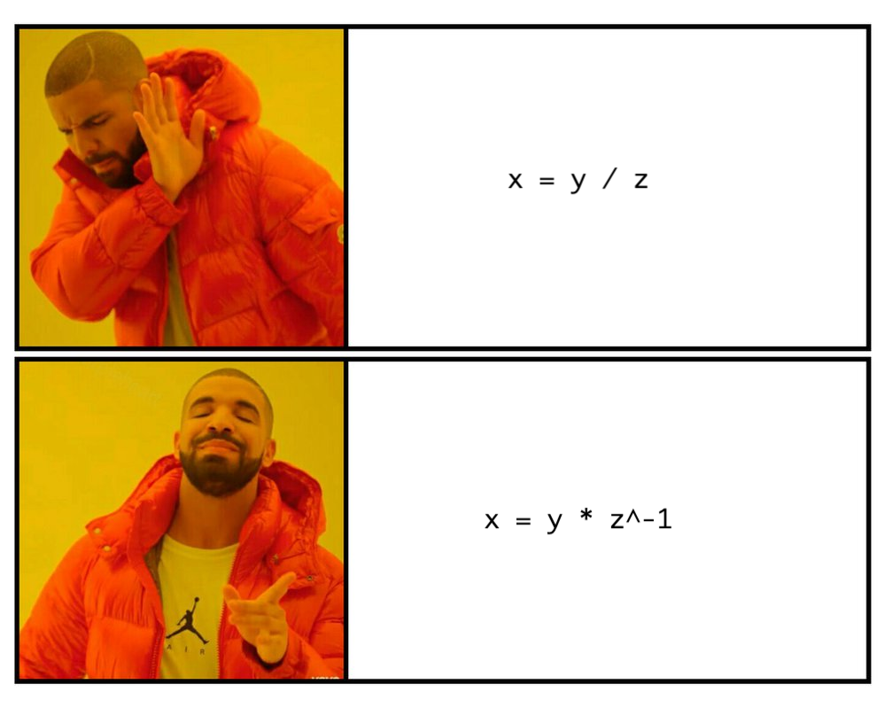

## Flare-On 2020 - #10 break
___

### Description: 

*As a reward for making it this far in Flare-On, we've decided to give you a break. Welcome to the land of sunshine and rainbows!*

`*7zip password: flare`
___

### Solution:

The main program, runs a very simple check:
```C
void __cdecl __noreturn main() {
  puts("welcome to the land of sunshine and rainbows!");
  puts("as a reward for getting this far in FLARE-ON, we've decided to make this one soooper easy");
  putchar(10);
  printf("please enter a password friend :) ");
  buf[read(0, buf, 0xFFu) - 1] = 0;
  if ( strcmp_pw_8048CDB(buf) )
    printf("hooray! the flag is: %s\n", buf);
  else
    printf("sorry, but '%s' is not correct\n", buf);
  exit(0);
}
```

```C
_BOOL4 __cdecl strcmp_pw_8048CDB(char *s1) {
    return strcmp(s1, "sunsh1n3_4nd_r41nb0ws@flare-on.com") == 0;
}
```

However there is a `.ctors` section which contains two constructors. The interesting one is the second:
```C
int init_callback_2_8048FC5() {
  setvbuf(stdout, 0, 2, 0);
  setvbuf(stdin, 0, 2, 0);

  pid = getpid();
  pid_A_main_81A5280 = pid;

  if ( !fork() ) {
    HIDDEN_MAIN_80490C4(pid);
    exit(0);
  }

  prctl('Yama', pid, 0, 0, 0);                  // PR_SET_PTRACER
  nanosleep(requested_time, 0);                 // parent

  v1 = -nice(0xAA);
  return printf("%s", (const char *)v1);
}
```

Process A **forks** (process B) and then child executes `HIDDEN_MAIN_80490C4`. After importing `user_regs_struct`, 
the appropriate `PTRACE_*` and `SIG*`enums and some cleanup, we can get an easy-to-understand decompiled output:
```C
int __cdecl HIDDEN_MAIN_80490C4(__pid_t pid_A) {
  NULL_ptr_28 = 0;
  if ( ptrace_804BAE6(PTRACE_ATTACH, pid_A, 0, 0) == -1 ) {   // attaches to the parent
    /* error */
  } else {
    result = waitpid(pid_A, stat_loc, 0);       // at this point the parent process is on sleep
    if ( result != -1 )
    {
      // Write the word "0x00000B0F" at address of strcmp_pw
      // This will generate an illegal instruction (SIGILL)
      if ( ptrace_804BAE6(PTRACE_POKEDATA, pid_A, (int)strcmp_pw_8048CDB, 0xB0F) == -1 )
        exit(0);

      signal(SIGALRM, (__sighandler_t)alarm_handler);
      pid_B = getpid();
      clone_n_run_804A0B4(pid_B);
      glo_b_loc = glo_B_decr_str_81A52A0;
      glo_B_decr_str_81A52A0[0] = 0;
      ptrace_804BAE6(31, pid_A, 0, 0);          // PTRACE_GETDSBT
      while ( 1 )
      {
        result = waitpid(pid_A, stat_loc, 0);
        if ( result == -1 )
          break;
        stat_loc[1] = stat_loc[0];
        if ( LOBYTE(stat_loc[0]) == 0177 )      // WIFSTOPPED
        {
          stat_loc[2] = stat_loc[0];
          if ( (stat_loc[0] & 0xFF00) >> 8 == SIGSTOP )
            ptrace_804BAE6(31, pid_A, 0, 0);    // PTRACE_GETDSBT
          stat_loc[3] = stat_loc[0];
          if ( (stat_loc[0] & 0xFF00) >> 8 == SIGTRAP )
          {
            ptrace_804BAE6(PTRACE_GETREGS, pid_A, 0, (int)&regs);
            v26 = ptrace_804BAE6(PTRACE_PEEKDATA, pid_A, regs.eip - 1, 0);
            if ( v26 == -1 )
              exit(0);
            if ( (unsigned __int8)v26 == 0xCC ) // check for breakpoints (int 3)
            {
              kill(pid_A, 9);
              exit(0);
            }
            new_eax = 0x1337CAFE * (regs.orig_eax ^ 0xDEADBEEF);
            v32 = -1;
            if ( new_eax == 0xE8135594 )        // syscall: pivot_root
            {
              ptrace_804BAE6(PTRACE_POKEDATA, pid_A, regs.ebx, regs.ecx);
            }
            else if ( new_eax > (int)0xE8135594 )
            {
              if ( new_eax == 0x2499954E )      // syscall: ioctl
              {
                if ( regs.ebx == 0x1337 )
                {
                  buf = decrypt_aes_string(regs.ecx);
                  mem_write_ptrace_804BB2D(pid_A, (int)glo_B_decr_str_81A52A0, (int *)buf, regs.edx);
                  regs.eax = (int)glo_B_decr_str_81A52A0;
                }
                else
                {
                  regs.eax = -1;
                }
                ptrace_804BAE6(PTRACE_SETREGS, pid_A, 0, (int)&regs);
              }
              else if ( new_eax > 0x2499954E )
              {
                switch ( new_eax )
                {
                  case 0x4A51739A:              // syscall: truncate
                    read_mem_ptrace_804BBF8(pid_A, regs.ebx, (int *)&GLO_BUF, 40000);
                    for ( i = 0; i <= 39999 && *(_BYTE *)(i + 0x804C640); ++i )
                    {
                      v14[i] = *(_BYTE *)(i + 0x804C640);
                      if ( v32 == -1 && v14[i] != *(_BYTE *)(i + 0x81A5100) )
                        v32 = i;
                    }
                    v32 = NULL_ptr_28(0xA4F57126, FLAG_81A56C0, v32);
                    regs.eax = v32;
                    ptrace_804BAE6(PTRACE_SETREGS, pid_A, 0, (int)&regs);
                    break;
                  case 0x7E85DB2A:              // syscall: write
                    size = regs.edx;
                    buf = malloc(regs.edx);
                    read_mem_ptrace_804BBF8(pid_A, regs.ecx, (int *)buf, size);
                    write(1, buf, size);
                    regs.eax = size;
                    ptrace_804BAE6(PTRACE_SETREGS, pid_A, 0, (int)&regs);
                    free(buf);
                    break;
                  case 0x3DFC1166:              // syscall: nice
                    buf = decrypt_xor_string_8056281(regs.ebx);
                    v5 = strlen((const char *)buf);
                    mem_write_ptrace_804BB2D(pid_A, (int)glo_B_decr_str_81A52A0, (int *)buf, v5 + 1);
                    free(buf);
                    regs.eax = 0;
                    ptrace_804BAE6(PTRACE_SETREGS, pid_A, 0, (int)&regs);
                    break;
                }
              }
              else if ( new_eax == 0xF7FF4E38 ) // syscall: execve
              {
                buf = malloc(0x12Cu);
                read_mem_ptrace(pid_A, regs.ebx, (int)buf, 300);
                size = strlen((const char *)buf);
                if ( *((_BYTE *)buf + size - 1) == 10 )
                  ptrace_804BAE6(PTRACE_POKEDATA, pid_A, regs.ebx + size - 1, 0);
                free(buf);
              }
              else if ( new_eax == 0x9C7A9D6 )  // syscall: uname
              {
                ptrace_804BAE6(PTRACE_POKEDATA, pid_A, regs.ebx, 0xC6EF3720);
                v6 = NULL_ptr_28(0x7E85DB2Au, (char *)0x1337, 0xCAFE);
                ptrace_804BAE6(PTRACE_POKEDATA, pid_A, regs.ebx + 4, v6);
              }
            }
            else if ( new_eax == 0x9678E7E2 )   // syscall: getpriority
            {
              if ( *glo_b_loc < 0 )
                regs.eax = *glo_b_loc;
              else
                regs.eax = *glo_b_loc + 20;
              ptrace_804BAE6(PTRACE_SETREGS, pid_A, 0, (int)&regs);
              *glo_b_loc = 0;
            }
            else if ( new_eax > (int)0x9678E7E2 )
            {
              if ( new_eax == 0xB82D3C24 )      // syscall: exit
              {
                regs.eip -= 2;
                regs.eax = 1;
                ptrace_804BAE6(PTRACE_SETREGS, pid_A, 0, (int)&regs);
                ptrace_804BAE6(PTRACE_CONT, pid_A, 0, 0);
                exit(0);
              }
              if ( new_eax == 0xC93DE012 )      // syscall: mclockall
              {
                LODWORD(v13) = ptrace_804BAE6(PTRACE_PEEKDATA, pid_A, regs.ebx, 0);
                HIDWORD(v13) = ptrace_804BAE6(PTRACE_PEEKDATA, pid_A, regs.ebx + 4, 0);
                v33 = 0;
                while ( v13 )
                {
                  if ( (v13 & 1) != 0 )
                    v33 = (char *)NULL_ptr_28(0xB82D3C24, v33, HIDWORD(v13));
                  v13 >>= 1;
                }
                regs.eax = (int)v33;
                ptrace_804BAE6(PTRACE_SETREGS, pid_A, 0, (int)&regs);
              }
              else if ( new_eax == 0xAB202240 ) // syscall: chmod
              {
                read_mem_ptrace_804BBF8(pid_A, regs.ebx, v11, 248);
                regs.eax = more_NULL_ptr_calls_804C19C(v11, regs.ecx);
                ptrace_804BAE6(PTRACE_SETREGS, pid_A, 0, (int)&regs);
              }
            }
            else if ( new_eax == 0x83411CE4 )   // syscall: setpriority
            {
              buf = decrypt_aes_string(regs.edx);
              v4 = strlen((const char *)buf);
              mem_write_ptrace_804BB2D(pid_A, (int)glo_B_decr_str_81A52A0, (int *)buf, v4 + 1);
              *glo_b_loc = -(int)glo_B_decr_str_81A52A0;
              free(buf);
              regs.eax = 0;
              ptrace_804BAE6(PTRACE_SETREGS, pid_A, 0, (int)&regs);
            }
            else if ( new_eax == 0x91BDA628 )   // syscall: read
            {
              fgets(FLAG_81A56C0, 255, stdin);
              s = decrypt_aes_string(0xB8);     // "sorry i stole your input :)"
              flaglen_81A57C0 = regs.ecx;
              v3 = strlen(s);
              mem_write_ptrace_804BB2D(pid_A, regs.ecx, (int *)s, v3);
              regs.eax = strlen(s) + 1;
              ptrace_804BAE6(PTRACE_SETREGS, pid_A, 0, (int)&regs);
            }
          }
          stat_loc[4] = stat_loc[0];
          if ( (stat_loc[0] & 0xFF00) >> 8 == SIGILL )
          {
            v7 = strlen(FLAG_81A56C0);
            mem_write_ptrace_804BB2D(pid_A, (int)FLAG_81A56C0, (int *)FLAG_81A56C0, v7);
            ptrace_804BAE6(PTRACE_GETREGS, pid_A, 0, (int)&regs);
            // *arg1 = FLAG (modify buf)
            v21 = regs.esp;
            if ( ptrace_804BAE6(PTRACE_POKEDATA, pid_A, regs.esp + 4, (int)FLAG_81A56C0) == -1 )
              exit(0);
            regs.eip = (int)real_check_flag_8048DCB;
            ptrace_804BAE6(PTRACE_SETREGS, pid_A, 0, (int)&regs);
          }
          stat_loc[5] = stat_loc[0];
          if ( (stat_loc[0] & 0xFF00) >> 8 == SIGSEGV )
          {
            ptrace_804BAE6(PTRACE_GETREGS, pid_A, 0, (int)&regs);
            st_retn = ptrace_804BAE6(PTRACE_PEEKDATA, pid_A, regs.esp, 0);
            st_arg1 = ptrace_804BAE6(PTRACE_PEEKDATA, pid_A, regs.esp + 4, 0);
            st_arg2 = ptrace_804BAE6(PTRACE_PEEKDATA, pid_A, regs.esp + 8, 0);
            st_arg3 = ptrace_804BAE6(PTRACE_PEEKDATA, pid_A, st_arg2, 0) + 1;
            regs.esp += 4;
            if ( st_arg3 > 15 )
            {
              regs.eip = st_retn;
            }
            else
            {
              regs.eip = st_arg1;
              ptrace_804BAE6(PTRACE_POKEDATA, pid_A, st_arg2, st_arg3);
              regs.esp += 16;
            }
            ptrace_804BAE6(PTRACE_SETREGS, pid_A, 0, (int)&regs);
          }
          stat_loc[6] = stat_loc[0];
          if ( (stat_loc[0] & 0xFF00) >> 8 == SIGINT )
          {
            v8 = decrypt_aes_string(0xBC);      // "I HAVE THE CONCH DON'T INTERRUPT ME"
            puts(v8);
          }
          stat_loc[7] = stat_loc[0];
          if ( (stat_loc[0] & 0xFF00) >> 8 == SIGTERM )
          {
            v9 = decrypt_aes_string(0xA3);      // "Like a phoenix, I rise from the ashes"
            puts(v9);
          }
          stat_loc[8] = stat_loc[0];
          if ( (stat_loc[0] & 0xFF00) >> 8 == SIGQUIT )
          {
            v10 = decrypt_aes_string(0xBE);     // "winners never quit"
            puts(v10);
          }
          ptrace_804BAE6(31, pid_A, 0, 0);      // PTRACE_GETDSBT
        }
      }
    }
  }
  return result;
}
```

Function `clone_n_run_804A0B4` forks again (process B forks C):
```C
int __cdecl clone_n_run_804A0B4(__pid_t pid_B) {
  __pid_t v2; // [esp+Ch] [ebp-Ch]

  if ( !fork() ) {
    alarm_main(pid_B);                          // child
    exit(0);
  }

  child_pid = v2;
  prctl('Yama', v2, 0, 0, 0);                   // PR_SET_PTRACER
  return nanosleep(requested_time, 0);
}
```

The third process (C) attaches to the parent:
```C
__pid_t __cdecl 
The third (__pid_t pid_B) {
  MACRO_SIGNAL proc_signal; // [esp+8Ch] [ebp-Ch]

  prctl(4, 0, 0, 0, 0);                         // PR_SET_DUMPABLE (not core dumps)
  signal(SIGINT, (__sighandler_t)1);            // these cause segfaults?
  signal(SIGQUIT, (__sighandler_t)1);
  signal(SIGTERM, (__sighandler_t)1);
  if ( ptrace_804BAE6(PTRACE_ATTACH, pid_B, 0, 0) != -1 )// attach to parent
  {
    while ( 1 )
    {
      result = waitpid(pid_B, &wstatus_2C, 0);  // process changed state
      if ( result == -1 )
        return result;
      wstatus2_28 = wstatus_2C;
      if ( (unsigned __int8)wstatus_2C == 0177 )// WIFSTOPPED
      {
        v6 = wstatus_2C;
        proc_signal = (wstatus_2C & 0xFF00) >> 8;
        qmemcpy(s, "I HAVE THE CONCH DON", 20); // "I HAVE THE CONCH DON'T INTERRUPT ME"
        s[20] = (unsigned __int8)"'";
        strcpy(&s[21], "T INTERRUPT ME");
        if ( proc_signal == SIGSEGV )
        {
          // We have a segmentation fault. Read arguments
          ptrace_804BAE6(PTRACE_GETREGS, pid_B, 0, (int)&usr_regs_70);
          st_retn = ptrace_804BAE6(PTRACE_PEEKDATA, pid_B, usr_regs_70.esp, 0);
          st_arg1 = ptrace_804BAE6(PTRACE_PEEKDATA, pid_B, usr_regs_70.esp + 4, 0);
          st_arg2 = ptrace_804BAE6(PTRACE_PEEKDATA, pid_B, usr_regs_70.esp + 8, 0);
          st_arg3 = ptrace_804BAE6(PTRACE_PEEKDATA, pid_B, usr_regs_70.esp + 12, 0);
          while ( usr_regs_70.eip == -1 )       // eip must be 0
            ;
          // eax = f(arg1, arg2, arg3)
          if ( st_arg1 == 0x44DE7A30 )
          {
            usr_regs_70.eax = st_arg3 ^ st_arg2;
          }
          else if ( st_arg1 > 0x44DE7A30 )
          {
            switch ( st_arg1 )
            {
              case 0x6B4E102C:
                usr_regs_70.eax = st_arg2 + st_arg3;
                break;
              case 0x7E85DB2A:
                usr_regs_70.eax = 0x9E3779B9;
                break;
              case 0x5816452E:
                usr_regs_70.eax = ror_804C163(st_arg2, st_arg3);
                break;
            }
          }
          else
          {
            switch ( st_arg1 )
            {
              case 0xA4F57126:
                usr_regs_70.eax = st_arg3;
                if ( st_arg3 != -1 )
                {
                  read_mem_ptrace_804BBF8(pid_B, st_arg2, (int *)FLAG_81A56C0, 0x3E);
                  if ( strncmp(FLAG_MAIL_81A56F0, "@no-flare.com", 0xDu) )
                    usr_regs_70.eax = -1;
                }
                break;
              case 0xB82D3C24:
                usr_regs_70.eax = st_arg2 + 1;
                break;
              case 0x91BDA628:
                usr_regs_70.eax = (16 * (st_arg2 - 1)) | ((_BYTE)st_arg3 - 1) & 0xF;
                break;
            }
          }
          usr_regs_70.eip = st_retn;            // set registers and return
          usr_regs_70.esp += 4;
          ptrace_804BAE6(PTRACE_SETREGS, pid_B, 0, (int)&usr_regs_70);
          ptrace_804BAE6(PTRACE_CONT, pid_B, 0, 0);
          goto RETURN;
        }
        if ( proc_signal > SIGSEGV )
        {
          if ( proc_signal == SIGALRM )
          {
            ptrace_804BAE6(PTRACE_POKEDATA, pid_B, (int)&alarm_flag_81A526C, 1);// if alarm has triggered, set flag to 1
            return ptrace_804BAE6(PTRACE_CONT, pid_B, 0, proc_signal);
          }
          if ( proc_signal != SIGSTOP )
          {
LABEL_36:
            ptrace_804BAE6(PTRACE_CONT, pid_B, 0, 0);
            goto RETURN;
          }
          ptrace_804BAE6(PTRACE_CONT, pid_B, 0, 19);
        }
        else
        {
          if ( proc_signal != SIGINT )
            goto LABEL_36;
          puts(s);
          ptrace_804BAE6(PTRACE_CONT, pid_B, 0, 0);
        }
      }
RETURN:
      v7 = wstatus_2C;
      result = wstatus_2C & 0177;
      if ( (wstatus_2C & 0177) == 0 )
        return result;
    }
  }
  puts("OOPSIE WOOPSIE!! Uwu We made a mistaky wakey!!!!");
  return kill(pid_B, SIGKILL);
}
```

It is really hard to understand at first what these functions do. Even worse all these `ptrace` calls
make it extremely hard to attach a debugger to the program. Even if you manage to do it, there is the
following anti-debugging check that checks for `int 3` instructions:
```C
if ( (stat_loc[0] & 0xFF00) >> 8 == SIGTRAP ) {
    ptrace_804BAE6(12, pid_A, 0, (int)&regs);
    v26 = ptrace_804BAE6(PTRACE_PEEKDATA, pid_A, regs.eip - 1, 0);

    if ( v26 == -1 )
      exit(0);

    if ( (unsigned __int8)v26 == 0xCC )  // int 3
    {
      kill(pid_A, 9);
      exit(0);
    }
```


#### Understanding the Program

This program clones itself 2 times and creates processes A, B and C. Process C ptraces
process B and process B ptraces process A (the main process).

Everything starts from here (process B):
```C
// Write the word "0x00000B0F" at address of strcmp_pw
// This will generate an illegal instruction (SIGILL)
if ( ptrace_804BAE6(PTRACE_POKEDATA, pid_A, (int)strcmp_pw_8048CDB, 0xB0F) == -1 )
```

While process A sleeps, process B overwrites the first `4` bytes of function `strcmp_pw_8048CDB`
with the DWORD `0x00000B0F`. When process A wakes up, it tries to invoke `strcmp_pw_8048CDB`, 
an illegal instruction exception is raised (`SIGILL`) and the ptracer (process B) receives control:
```C
if ( (stat_loc[0] & 0xFF00) >> 8 == SIGILL ) {
    v7 = strlen(FLAG_81A56C0);
    mem_write_ptrace_804BB2D(pid_A, (int)FLAG_81A56C0, (int *)FLAG_81A56C0, v7);
    ptrace_804BAE6(PTRACE_GETREGS, pid_A, 0, (int)&regs);

    // *arg1 = FLAG (modify buf)
    v21 = regs.esp;
    if ( ptrace_804BAE6(PTRACE_POKEDATA, pid_A, regs.esp + 4, (int)FLAG_81A56C0) == -1 )
      exit(0);
    regs.eip = (int)real_check_flag_8048DCB;
    ptrace_804BAE6(PTRACE_SETREGS, pid_A, 0, (int)&regs);
}
```          

The `eip` register is set to `real_check_flag_8048DCB` and process A continues execution from function
`real_check_flag_8048DCB`:
```C
_BOOL4 __cdecl real_check_flag_8048DCB(char *s) {
  v5 = strlen(s);
  argv[0] = "rm";
  argv[1] = "-rf";
  argv[2] = "--no-preserve-root";
  argv[3] = "/";
  argv[4] = 0;
  execve(s, argv, 0);  
  /* .... */
}  
```

This function starts by making an `execve` system call. However this is a bogus system call. Process B
intercepts and dispatches this system call (Recall that `eax` contains the system call number and `ebx`,
`ecx` and `edx` the first 3 arguments):
```C
if ( (stat_loc[0] & 0xFF00) >> 8 == SIGTRAP ) {
    ptrace_804BAE6(PTRACE_GETREGS, pid_A, 0, (int)&regs);
    /* ... */
    new_eax = 0x1337CAFE * (regs.orig_eax ^ 0xDEADBEEF);
    if ( new_eax == 0xE8135594 )        // syscall: pivot_root
    {
        ptrace_804BAE6(PTRACE_POKEDATA, pid_A, regs.ebx, regs.ecx);
    } else if ( new_eax > (int)0xE8135594 ) {
        if ( new_eax == 0x2499954E )      // syscall: ioctl
        {
            /* ... */
        
        } else if ( new_eax > 0x2499954E ) {
            switch ( new_eax ) {
                case 0x4A51739A:              // syscall: truncate
                    /* ... */
                    break;
                  case 0x7E85DB2A:              // syscall: write
                    /* ... */
                    break;
                  case 0x3DFC1166:              // syscall: nice
                    /* ... */
                    break;
            }
        }
        /* ... */
```

That is, according to the system call number a different if statement is executed that dispatches
the system call.


Besides the system calls, process B raises some intentional NULL pointer dereferences:
```C
    v6 = NULL_ptr_28(0x7E85DB2Au, (char *)0x1337, 0xCAFE);
```

To handle this NULL pointer dereference (`SIGSEGV`), the ptracer of process B (process C) receives control
```C
if ( proc_signal == SIGSEGV ) {
    // We have a segmentation fault. Read arguments
    ptrace_804BAE6(PTRACE_GETREGS, pid_B, 0, (int)&usr_regs_70);
    st_retn = ptrace_804BAE6(PTRACE_PEEKDATA, pid_B, usr_regs_70.esp, 0);
    st_arg1 = ptrace_804BAE6(PTRACE_PEEKDATA, pid_B, usr_regs_70.esp + 4, 0);
    st_arg2 = ptrace_804BAE6(PTRACE_PEEKDATA, pid_B, usr_regs_70.esp + 8, 0);
    st_arg3 = ptrace_804BAE6(PTRACE_PEEKDATA, pid_B, usr_regs_70.esp + 12, 0);
    while ( usr_regs_70.eip == -1 )       // eip must be 0
        ;
    
    // eax = f(arg1, arg2, arg3)
    if ( st_arg1 == 0x44DE7A30 ) {
        usr_regs_70.eax = st_arg3 ^ st_arg2;
    } else if ( st_arg1 > 0x44DE7A30 ) {
        switch ( st_arg1 ) {
            case 0x6B4E102C:
                usr_regs_70.eax = st_arg2 + st_arg3;
                break;
            case 0x7E85DB2A:
                usr_regs_70.eax = 0x9E3779B9;
                break;
            case 0x5816452E:
                usr_regs_70.eax = ror_804C163(st_arg2, st_arg3);
                break;
        }
    }

    /* ... */ 
```

This is quite similar to the system call dispatching of process B. Process C handles the NULL pointer exception
and transfers execution back to process A. However it is possible for process A to generate a NULL pointer dereference.
In that case process B is responsible for handling it:
```C
if ( (stat_loc[0] & 0xFF00) >> 8 == SIGSEGV )
{
    ptrace_804BAE6(PTRACE_GETREGS, pid_A, 0, (int)&regs);
    st_retn = ptrace_804BAE6(PTRACE_PEEKDATA, pid_A, regs.esp, 0);
    st_arg1 = ptrace_804BAE6(PTRACE_PEEKDATA, pid_A, regs.esp + 4, 0);
    st_arg2 = ptrace_804BAE6(PTRACE_PEEKDATA, pid_A, regs.esp + 8, 0);
    st_arg3 = ptrace_804BAE6(PTRACE_PEEKDATA, pid_A, st_arg2, 0) + 1;
    regs.esp += 4;
 
    if ( st_arg3 > 15 )
    {
      regs.eip = st_retn;
    }
    else
    {
      regs.eip = st_arg1;
      ptrace_804BAE6(PTRACE_POKEDATA, pid_A, st_arg2, st_arg3);
      regs.esp += 16;
    }
    ptrace_804BAE6(PTRACE_SETREGS, pid_A, 0, (int)&regs);
}
```

Upon a NULL pointer dereference (`SIGSEGV`) the third parameter of the function is compared against `15`
and execution either continues from the return address (top of the stack) or from the value of the first
parameter. This code constitutes the building block to form a loop!

At this point we have a good understanding of how the `3` processes integrate together. Let's move on.


#### Deobfuscating Constant Strings

There are two functions for decrypting strings The first one is `decrypt_xor_string_8056281`:
```C
void *__cdecl decrypt_xor_string_8056281(int a1) {  
  v3 = (int)*(&string_keys_2_81A51C0 + (a1 ^ 0xAA));
  dest = malloc(*(_DWORD *)(v3 + 4));
  memcpy(dest, (const void *)(v3 + 8), *(_DWORD *)(v3 + 4));
  for ( i = 0; *(_DWORD *)(v3 + 4) > i; ++i )
    *((_BYTE *)dest + i) ^= *(_BYTE *)(v3 + i % 4);
  return dest;
}
```

This function decrypts a strings based on its index. All encrypted strings are in `string_keys_2_81A51C0` array.
Each entry contains:
* 4 bytes for the XOR key
* 4 bytes for the string length
* strlen() bytes for the encrypted string.


The second function for string decryption is `decrypt_aes_string_804C438`:
```C
_BYTE *__cdecl decrypt_aes_string_804C438(int a1) {
  index = a1 ^ 0xAA;
  if ( (index & 1) != 0 ) {
    v6 = strlen((&string_keys_1_81A5140)[index]);
    v7 = malloc(v6 / 2);
    v8 = (&string_keys_1_81A5140)[index];
    for ( i = 0; v6 / 2 > i; ++i )
      v7[i] = MEMORY[0](0x91BDA628, v8[2 * i], v8[2 * i + 1]);
    result = v7;
  } else {
    key = (&string_keys_1_81A5140)[index];
    j_AES128_KeyExpansion_804A372((int)roundkey, (int)key);
    plaintext = malloc(*((_DWORD *)key + 4));
    memcpy(plaintext, key + 20, *((_DWORD *)key + 4));
    for ( j = 0; *((_DWORD *)key + 4) > j; j += 16 )// ECB
      aes_decrypt_804B228((int)roundkey, (int)plaintext + j);
    result = plaintext;
  }
  return result;
}
```

This time the global array is `string_keys_1_81A5140` and the key is 16 bytes. Instead of
an XOR, we do an AES decryption. We write a small IDApython script to dump all strings from the
binary:

AES decrypted strings:
```
    A0: b'/\xd4\x7f\x00\x98\x1c\x9c)?\xce\xbf\xb6\xa1\xd4\xbfk',
    A1: I hear Wolfram Alpha is good at doing things with big numbers.
    A2: b'There are two hard things in computer science: caching, off by one errors, and comparing really big numbers.\x00\x00\x00\x00',
    A3: Like a phoenix, I rise from the ashes
    A4: b'This string has no purpose and is merely here to waste your time.\x00\x00\x00\x00\x00\x00\x00\x00\x00\x00\x00\x00\x00\x00\x00',
    A5: [0xE3, 0x76, 0x69, 0x92, 0xC7, 0x5C, 0xE8, 0xF5, 0x85, 0xC5, 0x4D, 0x11, 0x16, 0xFA, 0xF4, 0xE8, 0x00],
    A6: b'There are many lessons to be learned by studying the Bee Movie.\x00',
    A7: This challenge is so easy it exploits itself.
    A8: b'moc.eralf-on@gn1hs1n1f_n0_st4rgn0c\x00\x00\x00\x00\x00\x00\x00\x00\x00\x00\x00\x00\x00\x00',
    A9: elf_0n_a_sh3lf@on-flare.com
    AA: b'\x00\x00\x00\x00\x00\x00\x00\x00\x00\x00\x00\x00\x00\x00\x00\x00',
    AB: TracerPid: %d
    AC: b'fake_flag@no-flare.com\x00\x00\x00\x00\x00\x00\x00\x00\x00\x00',
    AD: sm0l_bin_b1g_h34rt@no-flare.com
    AE: b'okay_1_sw34r_th1s_1s_th3_r34l_0ne@no-flare.com\x00\x00',
    AF: not_a_fake_flag@no-flare.com
    B2: b'/proc/%d/status\x00',
    B3: ,
    B8: b'sorry i stole your input :)\x00\x00\x00\x00\x00',
    B9: OOPSIE WOOPSIE!! Uwu We made a mistaky wakey!!!!
    BA: b'This string also has no purpose and again, is here merely to waste your time.\x00\x00\x00',
    BB: This string is used to calculate the XXTEA key to decrypt the fourth part of the flag.
    BC: b"I HAVE THE CONCH DON'T INTERRUPT ME\x00\x00\x00\x00\x00\x00\x00\x00\x00\x00\x00\x00\x00",
    BD: iVBORw0KGgoAAAANSUhEUgAAA+cAAAMfCAYAAAC0P6bIAAABRGlDQ1BJQ0MgUH[.....]QeD/A+YrBXwY4pv2AAAAAElFTkSuQmCC
    BE: b'winners never quit\x00\x00\x00\x00\x00\x00\x00\x00\x00\x00\x00\x00\x00\x00',
    BF: TracerPid:
```

XOR decrypted strings:
```
    88: ⠀⠀â [.....] €â €â €â €
    89: NaN
    8A: Wasting your time24
    8B: Wasting your time25
    8E: Error: unable to debug child
    8F: According to all known laws of aviation, there is no way that a bee should be able to fly. [.....] office. FADE OUT: "Bee Movie" - JS REVISIONS 8/13/07 131.
    A0: Wasting your time2
    A1: Wasting your time3
    A2: By reading this string I have successfully stolen around 2 seconds of your life. How does that make you feel?
    A3: Wasting your time1
    A4: Wasting your time6
    A5: Wasting your time7
    A6: Wasting your time4
    A7: Wasting your time5
    A8: Thank you for playing FLARE-ON!
    A9: jhh///sh/bin‰ãh4$ri1ÉQjYáQ‰á1ÒjX̀
    AA: Power on self test failed. This challenge will not work correctly.
    AB: @flare-on.com
    AC: Wow. That was some good key material.
    AD: Please fill out the review sheet for this challenge: https://twitter.com/gf_256/status/1209012768147460096/photo/1
    AE: Look! Some key material is coming up!
    AF: 
    B0: Wasting your time18
    B1: Wasting your time19
    B2: Wasting your time16
    B3: Wasting your time17
    B4: Wasting your time22
    B5: Wasting your time23
    B6: Wasting your time20
    B7: Wasting your time21
    B8: Wasting your time10
    B9: Wasting your time11
    BA: Wasting your time8
    BB: Wasting your time9
    BC: Wasting your time14
    BD: Wasting your time15
    BE: Wasting your time12
    BF: Wasting your time13

```

It is worth to mention the AES string at index `BD` which is the base64 of a PNG image:



For more details please take a look at the deobfuscation script: [break_deobfuscate_strings.py](./break_deobfuscate_strings.py)


#### Mapping System Calls

When process A makes a system call, a `SIGTRAP` is raised and the process B dispatches the system call:
```C
    new_eax  = 0x1337CAFE * (regs.orig_eax ^ 0xDEADBEEF);
```

Here `regs.orig_eax` contains the system call number. Then `new_eax` is compared
against constants such as `E8135594`, `2499954E` and so on. Our goal is to find
all system call numbers (and therefore the actual system calls) from these constants.
To do this we use z3 and a [system call table](https://chromium.googlesource.com/chromiumos/docs/+/master/constants/syscalls.md):
```
E8135594 -> 217 (pivot_root)
2499954E ->  54 (ioctl)
4A51739A ->  92 (truncate)
7E85DB2A ->   4 (write)
3DFC1166 ->  34 (nice)
F7FF4E38 ->  11 (execve)
09C7A9D6 -> 122 (uname)
9678E7E2 ->  96 (getpriority)
B82D3C24 ->   1 (exit)
C93DE012 -> 152 (mlockall)
AB202240 ->  15 (chmod)
83411CE4 ->  97 (setpriority)
91BDA628 ->   3 (read)
```

For more details please take a look at the [break_find_syscalls.py](./break_find_syscalls.py) script.

At this point we can map each system call to the appropriate if statement in the ptracer process:
```C
    new_eax = 0x1337CAFE * (eax ^ 0xDEADBEEF);
          
    // pivot_root
    new_eax == 0xE8135594:  *ebx = ecx 

    // ioctl
    new_eax == 0x2499954E:  if (ebx == 0x1337) {
                                memcpy(glo_B, decrypt_aes_string(ecx), edx);
                                return glo_B;
                            } else {
                                return -1;
                            }

    // truncate
    new_eax == 0x4A51739A:  v32 = -1;
                            memcpy(GLO_BUF, ebx, 40000);
            
                            for (i=0; i<40000 && GLO_BUF[i]; ++i) {
                                if (v32 == -1 && GLO_BUF[i] != GLO_KEY[i])
                                    v32 = i;
                            }
                            
                            return NEXT(0xA4F57126, FLAG, v32);
    // write      
    new_eax == 0x7E85DB2A:  buf = malloc(edx);
                            memcpy(buf, ecx, edx)            
                            write(stdout, buf, size);            
                            free(buf);

    // nice
    new_eax == 0x3DFC1166:  buf = decrypt_xor_string_8056281(ebx);
                            memcpy(glo_B, buf, strlen(buf) + 1);
                            free(buf);
                            return 0;
            
    // execve
    new_eax == 0xF7FF4E38:  buf = malloc(0x12Cu);
                            memcpy(buf, ebx, 300);
                        
                            if (buf[strlen(buf) - 1] == '\n')
                            buf[strlen(buf) - 1] = '\0'
                            free(buf);

    // uname
    new_eax == 0x9C7A9D6:   *ebx = 0xC6EF3720;        
                            *(ebx + 4) = NEXT(0x7E85DB2A, 0x1337, 0xCAFE);  // 0x9E3779B9
    
    // getpriority
    new_eax == 0x9678E7E2:  if (*glo_B < 0) eax = *glo_B;
                            else            eax = *glo_B + 20;
                            *glo_B = 0;
    
    // exit
    new_eax == 0xB82D3C24:  eip -= 2;
                            eax = 1;        
                            exit(0);
    
    // mclockall
    new_eax == 0xC93DE012:  v13_1 = *ebx                // count 1's
                            v13_2 = *(ebx + 4)
                            v33 = 0;
                            while (v13) {
                                if (v13_1 & 1) {
                                    v33 = NEXT(0xB82D3C24, v33, v13_2); // v33++
                                }

                                v13_1 >>= 1;
                            }
                            
                            return v33;
    // chmod  
    new_eax == 0xAB202240:  memcpy(v11, ebx, 248);
                            t_1 =  NEXT(0x6B4E102C, ecx, v11[0x1C]);  // t_1 = ecx + v11[0x1C]
                            t_2 =  NEXT(0x5816452E, t_1, v11[0xA4]);  // t_2 = ror(ecx + v11[0x1C], v11[0xA4])
                            return NEXT(0x44DE7A30, t_2, v11[0x4C]);  // return ror(ecx + v11[0x1C], v11[0xA4]) ^ v11[0x4C]

    // setpriority
    new_eax == 0x83411CE4:  buf = decrypt_aes_string(edx);      
                            memcpy(glo_B, buf, strlen(buf) + 1)    
                            *glo_B = -glo_B;
                            free(buf);
                            return 0;      
    
    // read
    new_eax == 0x91BDA628:  fgets(FLAG, 255, stdin);
                            s = decrypt_aes_string(0xB8);     // "sorry i stole your input :)"
                            flaglen_81A57C0 = ecx;
                            memcpy(ecx, s, strlen(s));
                            return strlen(s) + 1;

```

For instance, when the ptraced process invokes `-nice(0xA5)` it is actually ends up executing the following
code which XOR-decrypts a constant string:
```C
buf = decrypt_xor_string_8056281(ebx);
memcpy(glo_B, buf, strlen(buf) + 1);
free(buf);
```

Also, when a NULL pointer dereference (`SIGSEGV`) occurs in process B, process C dispatches it according
to the value of the first parameter:
```C
    arg1 == 0x44DE7A30: return arg2 ^ arg3;
    arg1 == 0x6B4E102C: return arg2 + arg3;
    arg1 == 0x7E85DB2A: return 0x9E3779B9;
    arg1 == 0x5816452E: return ror(arg2, arg3);
    arg1 == 0xA4F57126: if (arg3 != -1) {        
                            if (strncmp(&arg2[0x30], "@no-flare.com", 0xDu))
                                return -1;
                            }
                        return arg3;
    arg1 == 0xB82D3C24: return arg2 + 1;
    arg1 == 0x91BDA628: return (16 * (arg2 - 1)) | ((arg3 & 0xFF) - 1) & 0xF;
```


#### Breaking the Flag: Part #1

Breaking the first part of the flag is simple:
```C
_BOOL4 __cdecl real_check_flag_8048DCB(char *s)
{
  v5 = strlen(s);
  argv[0] = "rm";
  argv[1] = "-rf";
  argv[2] = "--no-preserve-root";
  argv[3] = "/";
  argv[4] = 0;
  execve(s, argv, 0);                           // rm -rf --no-preserver-root / (fake)
  --v5;
  master_key = -nice(0xA5);                     // key gets a random value
  j_AES128_KeyExpansion_WEAK_804B495((int)roundKey, master_key);
  weak_AES_1_804BABC((int)roundKey, (int)&dword_81A50EC);
  weak_AES_1_804BABC((int)roundKey, (int)&dword_81A50F0);
  weak_AES_1_804BABC((int)roundKey, (int)&dword_81A50F4);
  weak_AES_1_804BABC((int)roundKey, (int)&dword_81A50F8);
  if ( !memcmp(s, &dword_81A50EC, 0x10u) ) {
    memset(&dword_81A50EC, 0, 0x10u);
    result = real_check_flag_part_2_8048F05(s + 0x10);
  } else {
    memset(&dword_81A50EC, 0, 0x10u);
    result = 0;
  }

  return result;
}
```

Function `weak_AES_1_804BABC`, is a "weak" version of AES (with fewer rounds and no `MixColumns` operation).
`execve` system call actually copies the input flag into process address space of process B. The master key for
AES is:
```
    0xE3, 0x76, 0x69, 0x92, 0xC7, 0x5C, 0xE8, 0xF5, 0x85, 0xC5, 0x4D, 0x11, 0x16, 0xFA, 0xF4, 0xE8
```

The four ciphertexts that we want to decrypt are:
```
dword_81A50EC = 0x2F 0xD4 0x7F 0x00
dword_81A50F0 = 0x98 0x1C 0x9C 0x29
dword_81A50F4 = 0x3F 0xCE 0xBF 0xB6
dword_81A50F8 = 0xA1 0xD4 0xBF 0x6B  
```

Decryption here is straightforward. After decryption we get the following plaintexts:
```
w3lc
0mE_
t0_T
h3_l
```

Which gives us the first `16` bytes of the flag: `w3lc0mE_t0_Th3_l`


#### Breaking the Flag: Part #2

If the verification of the first part is successful, program calls `real_check_flag_part_2_8048F05`:
```C
_BOOL4 __cdecl real_check_flag_part_2_8048F05(void *flag_p2) {  
  s = (char *)-nice(0xA4);
  v1 = strlen(s);
  chksum = crc64_checksum_804BFED(0LL, (int)s, v1);
  globuflen = 40000;
  memcpy(&GLO_BUF, flag_p2, 0x20u);
  for ( i = 0; i < globuflen; i += 8 )
    fiestel_network_0804C369((__mode_t *)(&GLO_BUF + i), chksum, SHIDWORD(chksum), v3_out);
  return truncate(&GLO_BUF, 32) == 32;
}
```

As the name suggests, `fiestel_network_0804C369` implements a [Feistel Network](https://en.wikipedia.org/wiki/Feistel_cipher):
```C
unsigned int __cdecl fiestel_network_0804C369(__mode_t *glo_buf, int a2_crc1, int a3_crc2, const char *a4_out) {
  v5[1] = 0;
  round_function_804C217(__PAIR64__(a3_crc2, a2_crc1), 16, (int)a4_out);
  buf_lo = *glo_buf;
  buf_hi = glo_buf[1];
  v5[0] = 0;
LOOP_804C3C4:  
  v8 = buf_hi;
  v9 = buf_lo ^ chmod(a4_out, buf_hi);          // buf_lo ^ ror(buf_hi + out[0x1C], out[0xA4]) ^ out[0x4C])
  buf_lo = buf_hi;
  buf_hi = v9;
  MEMORY[0](&MEMORY[0x804C3C4], v5);            // loop back to LOOP (16 times)
  *glo_buf = buf_hi;
  glo_buf[1] = buf_lo;
}
```

You can see here how the loop is implemented: Function invokes the `MEMORY[0]`, process B receives control
and either returns back to `0x804C3C4` (`LOOP_804C3C4`) or exits the loop.

The round function for Feistel is:
```C
int __cdecl round_function_804C217(unsigned __int64 a1_crc64, int a2_16, int a3_out) {
  crc64 = a1_crc64;
  NULL_ptr = 0;

LOOP_804C257:
  pivot_root(a3_out + 0x1C, a1_crc64);          // a3[0x1C] = LOWORD(a1)
  pivot_root(a3_out + 0x4C, SHIDWORD(a1_crc64));// a3[0x4C] = HIWORD(a1)
  *(_DWORD *)(a3_out + 0xA4) = mlockall((int)&crc64) / 2;// count 1's in crc64 / 2
  lsb = crc64 & 1;
  crc64 >>= 1;
  if ( lsb == 1 ) {
    uname((struct utsname *)&v8);               // v8 = 0x9E3779B9C6EF3720
    crc64 ^= v8;
  }

  NULL_ptr(&MEMORY[0x804C257], &v4);            // loop back to LOOP (16 times)
  return a3_out;
}
```

`chmod` system call performs the following operation:
```C
    ror(ecx + v11[0x1C], v11[0xA4]) ^ v11[0x4C]
```

Finally `truncate` system call compares the output of Feistel Network
with the first `32` bytes (`4` QWORDS) of the global buffer at `0x0804C640`:
```C
memcpy(GLO_BUF, ebx, 40000);

for (i=0; i<40000 && GLO_BUF[i]; ++i) {
    if (v32 == -1 && GLO_BUF[i] != GLO_KEY[i])
        v32 = i;
}

return NEXT(0xA4F57126, FLAG, v32);     // NEXT = NULL pointer dereference
```

Our goal here is to reverse the Feistel Network and decrypt the following ciphertexts:
```
0x7D878AEA0260A064
0x0C2D3F82E47CE96C
0x424F35CFEBB5B78C
0xE07C2820492BAD4F
```

Reversing this Feistel Network is not hard:
```python
# Reverse the Feistel Network for each QWORD
for gloval in [0x7D878AEA0260A064, 0x0C2D3F82E47CE96C, 0x424F35CFEBB5B78C, 0xE07C2820492BAD4F]:
    print '[+] Decrypting: %X' % gloval
   
    buf_lo = gloval >> 32
    buf_hi = gloval & 0xFFFFFFFF

    values = round_function(key)

    # Run Feistel Network on the reverse.
    for i in range(16):
        print '[+] Reversing Feistel Network: %2d: %08X,%08X' % (i, buf_lo, buf_hi)
        a, b, c = values[15 - i]            
        buf_lo, buf_hi = ror((buf_lo + a) & 0xFFFFFFFF, c) ^ b ^ buf_hi, buf_lo
        
    flag_part = itoa(buf_lo) + itoa(buf_hi)
    print '[+] Feistel Output. %2d: %08X,%08X -> %s' % (i, buf_lo, buf_hi, flag_part)

    flag += flag_part
```

The output from each reversed Feistel Network is:
```
7D878AEA0260A064 ---> 4nD_0f_D
0C2D3F82E47CE96C ---> e4th_4nd
424F35CFEBB5B78C ---> _d3strUc
E07C2820492BAD4F ---> t1oN_4nd
```

Which gives us the next `32` bytes of the flag: `4nD_0f_De4th_4nd_d3strUct1oN_4nd`.


**NOTE:** Although it is not clear in the decompiled output, `round_function_804C217` generates
a tuple `(a3[0x1C], a3[0x4C], a3[0xA4])` at each round and returns a **list** of tuples:
  lsb = crc64 & 1;
```Assembly
.text:0804C262 C1 E0 03            shl     eax, 3
.text:0804C265 89 C2               mov     edx, eax
.text:0804C267 C1 E2 05            shl     edx, 5
.text:0804C26A 29 C2               sub     edx, eax
.text:0804C26C 8B 45 AC            mov     eax, [ebp+a3_loc_54]
.text:0804C26F 01 D0               add     eax, edx
.text:0804C271 83 C0 1C            add     eax, 1Ch
.text:0804C274 83 EC 08            sub     esp, 8
.text:0804C277 51                  push    ecx
.text:0804C278 50                  push    eax
.text:0804C279 E8 32 C9 FF+        call    _pivot_root
```


#### Breaking the Flag: Part #3

After the decryption of the first `4` QWORDS of the global buffer (`0x0804C640`), decryption
continues with the remaining bytes of the buffer. This buffer contains some really long, random text:
```
According to all known laws of aviation, there is no way that a bee should be able to fly.
Its wings are too small to get its fat little body off the ground. The bee, of course, flies anyway.
[....]
Barry looks up through the glass and watches this conversation, astounded. Vanessa RIPS Ken’s resume in half and SLIDES ���u
��                                                                                                                                  ��u�
  SVU��d$��E��U��U���?��< r�ʃ���Ȁ� �����j��(������ʃ��1j Y*���
                                                             މ��ڃ���������E��U��^[�SVWU��d$��E��U���3��E��ƃ��р�t��%t�"�E�2ҋM��ыE��_^[�3�3�2��E�2��E��
�E��M���뿋ƃ����<t���-tjX�E����.tjX�E��Հ�0|
                                          ��E���u�!��st/�V��9~���j
Z�����0�ɋ���j
Z�����0�ɋ��둋E���E�E���E��U�S�]�S����'�����dt�*�E���E�E���E��U�WS�]�S�V��
                                                                         �������ut�,�E���E�E���E��U�WS�]�Sj�,���������xt�,�E���E�E���E��U�jWS�]�S�J��������Xt�,�E���E�E���E��U�jWS�]�S����]����E��ыM����N���SVWU��d$�؍E��������}vj�E��t����0��2�3�I���I�<��t����<
|�  ��0��} u����ڃ�A,
�����a,
���;Mr�
       ���0������u�]S�q��_^[�SU���|����u�u�]
                                             Sj-������u�u�]
�}+��}u�-�E��֋M��;�_^[ËE��֋M��)�E��֋��s������E��֋��e����E��֋M����SVWU�����ًÃ��р�t�������_^[�SVWU��d$�E��ڍE��������} vj�E ��t����0��2�3�I���I�р}t,�%��t��3ҋ�j
_����0�3ҋ�j                                                                                                                                                                                                   �����������
Y�����jY�3ɋ��;E r� �����������                                                                                                                                                                              ��           ȉ
                 ����0����}���ȉ��E��Ӌ��u�]S������_^[�SVU��d$����^��I����E��E������E�؍U����S�������^[�SU��؋C��t��[À�t���[Ë�ȃ����C���C�[ËC��v���SU���jX̀�[�SVU��؋��jX��̀�^[�SVU��؋��jX��̀�^[Ë��jX̀��SVWU���j^��~&�      ��;�r�ø�����^[�SVWU�썤$l������U���l���jZ3��H�������U��U�����l������H�����ƃ��<0r�+�ߋE���������,0�<ar�!��$�����������l������������l������t���l�����������������t-��_^[Í�l�����������l����^��l����Ƌ����l������������������SVWU�썤$|����E�����E��׋�������|����Ƌ�����|����E��M���_^[�SVWU������ً����Ƌȃ��ljj Y�Nj��J����ȍ���_^[�SVWU��d$��E��U��ًE���Ӄ3Ƀ�|
                                  �����<9v���,a                                                                 ���v                                       ��������^[�SVU���j ^���t��������
��<Ar��                                                                                                             ��_^[�jZ�3ҋǍ�����0���SVU���3��� |������
       <fv���,A
��<Fv���SU���3ۃ� |��ʍ��j������[�SU���3ۃ� |�����ʍ�����t��jX�[�3��[�SVWU�썤$|�������M���|��������EjZ3�����������jZ3�������|���jZ3�����������3�3�������������|�����|�����S�"�����������������;�t�i�E���c�����������|������������|������C����ƃ�|��x���;�t��_^[Í�|����Nj�����|�����|����U�W��������������|�����|�����S��������������x���;�t1��_^[Í�|����E���w��|�����|����U��u�I�������������|������
                                                                                                    �����|����������ƃ�|��x���;�t���|����Nj����|�����|����U�W��������E���SVWU�썤$�����E�U��M��E������3��� |������������3���_^[Ã� |������ƃ� |���������E��M��s�����븍�\��������E���3��E��E�����E�3��E�ËM���M���Ӌ]��M���ӋʋЍ�\����u�����\�������|�����\���������������������^���SVWU��d$���3��� |�"�����E��Í��8�  ��E��8�����_^[�SVWU��d$�E��U���3�3҃� |�V����E����3������E�ƉE�E����83��������M�E�+���Í�������8��rw���v�
�_^[�jY�3��SVWU��d$��E����M��X�������E�j^3ۃ�|2�4��ˋE������E�����E���M�Q�C����������3���˃��E�;�~�뾋�<0t�����3ɋE�+�;�|���ً���Ɗ��������_^[Ë썤$�����X��4����E���R��E�������j
                                                                                                                                                                       X�U�3�S�����}
X�U�3�S����jX�U�3�j���3��$�����x����0����������%���������������������E�������j@Y�d�����x����E���$���j@Y�I����������E�������j@Y�.�����x����E�������j@Y������x����E���e���j@Y�������x������0jY�E����3�3��-�������������j Y�1�����������������x���������S�(�������������������������m�����x��X�U�3�S�8��jX�U�3�j�&��3�������x�����x����������T����SVU��؋��j�X�΋ù�^[�SVWU��d$��E�����E��E�jY���E�3��E��M�E�;�|�-�E��jX�U���S���������E����E��E����E��NjE�jY����t�����t������t�������t6jX�U���j�H������ȋ���#ȋE����#�E��jI���j ������������j�jX�U���S�$������_^[�%.08x/dev/urandom480022d87d1823880d9e4ef56090b54001d343720dd77cbc5bc5692be948236cc10357c7a53fa2f1ef4a5bf03a2d156039e7a57143000c8d8f45985aea41dd31d036c5d4e7eda23afceffbad4e087a48762840ebb18e3d51e4146f48c04697ebd1cc3447d5a9e1e6adae92faaea8770db1fab16b1568ea13c3715f2aeba9d84
fit under the glass. KEN (wistful) My brochure. There’s a moment of eye contact as she carries Barry to the window. 
```

In the middle of this text there are some binary data which is actually a shellcode. Although it is not clear to
me how execution gets transfered to the shellcode (to be honest I'm not sure if it gets transfered at all), we can
move on with the analysis of the shellcode.
To run this we create a small wrapper around it (see [bignum.c](./bignum.c) for the full code):
```C
#include <stdio.h>
#include <stdint.h>


uint8_t shellcode[] = {
    0x8b, 0xec, 0xff, 0x75, 0x0c, 0xff, 0x75, 0x08, 0xff, 0x75, 0x04, 0xe8, 0xae, 0x0d, 0x00, 0x00,
    0x83, 0xc4, 0x0c, 0x53, 0x56, 0x55, 0x8b, 0xec, 0x8d, 0x64, 0x24, 0xf8, 0x89, 0x45, 0xf8, 0x89,
    0x55, 0xfc, 0x8d, 0x55, 0xf8, 0x80, 0xe1, 0x3f, 0x8a, 0xc1, 0x3c, 0x20, 0x72, 0x19, 0x8b, 0xca,
    /* ..... */
    0x61, 0x38, 0x37, 0x37, 0x30, 0x64, 0x62, 0x31, 0x66, 0x61, 0x62, 0x31, 0x36, 0x62, 0x31, 0x35,
    0x36, 0x38, 0x65, 0x61, 0x31, 0x33, 0x63, 0x33, 0x37, 0x31, 0x35, 0x66, 0x32, 0x61, 0x65, 0x62,
    0x61, 0x39, 0x64, 0x38, 0x34, 0x66, 0x00 
};


int main(int argc, char *argv[]) {
    printf("Starting bignum program ...\n");

    int (*ret)() = (int(*)())shellcode;
    ret();
}
```

This shellcode uses **bignum** arithmetic. After some analysis we can get a meaningful `main()`:
```C
void __cdecl __noreturn MAIN_804CDFE(int a1, int a2, int a3) { 
  base_addr = shellcode;
  pid = MEMORY[0x81A5280];
  ptrace_804D12C(0, MEMORY[0x81A5280], PTRACE_GETREGS, &regs);
  if ( a3 != 32 )
  {
    regs.eax = -1;
    ptrace_804D12C(0, pid, PTRACE_SETREGS, &regs);
    ptrace_804D12C(0, pid, PTRACE_DETACH, 0);
    exit_804C59B(0);
  }
  bn_zero_804C9B2(flag_p3);                     // big num (256 bytes)
  bn_zero_804C9B2(num_rand);
  bn_zero_804C9B2(v11);                         // str2hex -> little endian
  str2hex_804C917(num_A, (int)base_addr + 0x12A6, 64);// d1cc3447d5a9e1e6adae92faaea8770db1fab16b1568ea13c3715f2aeba9d84f
  str2hex_804C917(num_B, (int)base_addr + 0x1224, 64);// c10357c7a53fa2f1ef4a5bf03a2d156039e7a57143000c8d8f45985aea41dd31
  str2hex_804C917(num_C, (int)base_addr + (_DWORD)&MEMORY[0x804DFEF] + 0xF7FB31F4, 64);// 480022d87d1823880d9e4ef56090b54001d343720dd77cbc5bc5692be948236c
  str2hex_804C917(num_D, (int)base_addr + (_DWORD)&MEMORY[0x804DFEF] + 0xF7FB31F4, 64);//  
  str2hex_804C917(num_E, (int)base_addr + 0x1265, 64);// d036c5d4e7eda23afceffbad4e087a48762840ebb18e3d51e4146f48c04697eb
  qmemcpy(flag_p3, (const void *)(a2 + 0x30), 0x18u);
  fd = open_804C56F(0, 0, &MEMORY[0x804DFE2][-134532620 + (_DWORD)base_addr]);// "/dev/urandom"
  read_804C585(0x20u, num_rand, fd);
  bn_modulo_804C89A((int)num_rand, (int)num_A, (int)quot, (int)mod);// a1 / a2 => a3 = mod a4 = quot.
  close_804C561(fd);
  bn_assign_804C6FA((int)num_rand, (int)mod);   // rand %= A
  sub_804CA03((int)num_B, (int)num_rand, (int)num_A, (int)v11);// v11 = A; rand /= 2
  bn_assign_804C6FA((int)num_rand, (int)mod);
  sub_804CA03((int)num_D, (int)num_rand, (int)num_A, (int)v13);// v13 = B; rand /= 2
  bn_mul_804CBB1((int)flag_p3, (int)v11, num_rand);// rand = flag * A
  bn_modulo_804C89A((int)num_rand, (int)num_A, (int)quot, (int)v14);// a1 / a2 => a3 = mod (v14) a4 = quot.
  memset(v17, 0, sizeof(v17));
  sprintf_804CD52((int)v13, (int)v17, 1024);
  memset(v17, 0, sizeof(v17));
  sprintf_804CD52((int)v14, (int)v17, 1024);
  if ( !bn_cmp_804C721((int)num_C, (int)v13) && !bn_cmp_804C721((int)num_E, (int)v14) )
  {
    *(_BYTE *)(a2 + 72) = 0;
    mem_write_ptrace_804D145(pid, MEMORY[0x81A57C0], (void **)a2, (int)&base_addr, 73);
    regs.eax = 32;
    ptrace_804D12C(0, pid, PTRACE_SETREGS, &regs);
    ptrace_804D12C(0, pid, PTRACE_DETACH, 0);
    exit_804C59B(0);
  }
  regs.eax = -1;
  ptrace_804D12C(0, pid, PTRACE_SETREGS, &regs);
  ptrace_804D12C(0, pid, PTRACE_DETACH, 0);
  exit_804C59B(0);
}
```

This code checks the flag as follows: `flag * b == e mod a`. To recover the flag we have to 
find the inverse of `b`:
```Python
flag * b == e mod a 
flag * b * b^-1 == e * b^-1 mod a
flag == e * b^-1 mod a
```

We use Python to do the math:
```C
a    = 0xd1cc3447d5a9e1e6adae92faaea8770db1fab16b1568ea13c3715f2aeba9d84f
b    = 0xc10357c7a53fa2f1ef4a5bf03a2d156039e7a57143000c8d8f45985aea41dd31
b^-1 = 0x7D6990DB0059850D8E02937BE5E2AC7B9DFE6411DE316C1E462762C24D647B5C
e    = 0xd036c5d4e7eda23afceffbad4e087a48762840ebb18e3d51e4146f48c04697eb    
flag = 0x6D6F632E6E6F2D6572616C6640733369707075705F306E5F
```

We decode "flag", which gives us the last `24` bytes of the flag: `_n0_puppi3s@flare-on.com`.


The full script that breaks the flag is here: [break_crack.py](./break_crack.py)

After all, the final flag is `w3lc0mE_t0_Th3_l4nD_0f_De4th_4nd_d3strUct1oN_4nd_n0_puppi3s@flare-on.com`.

___
