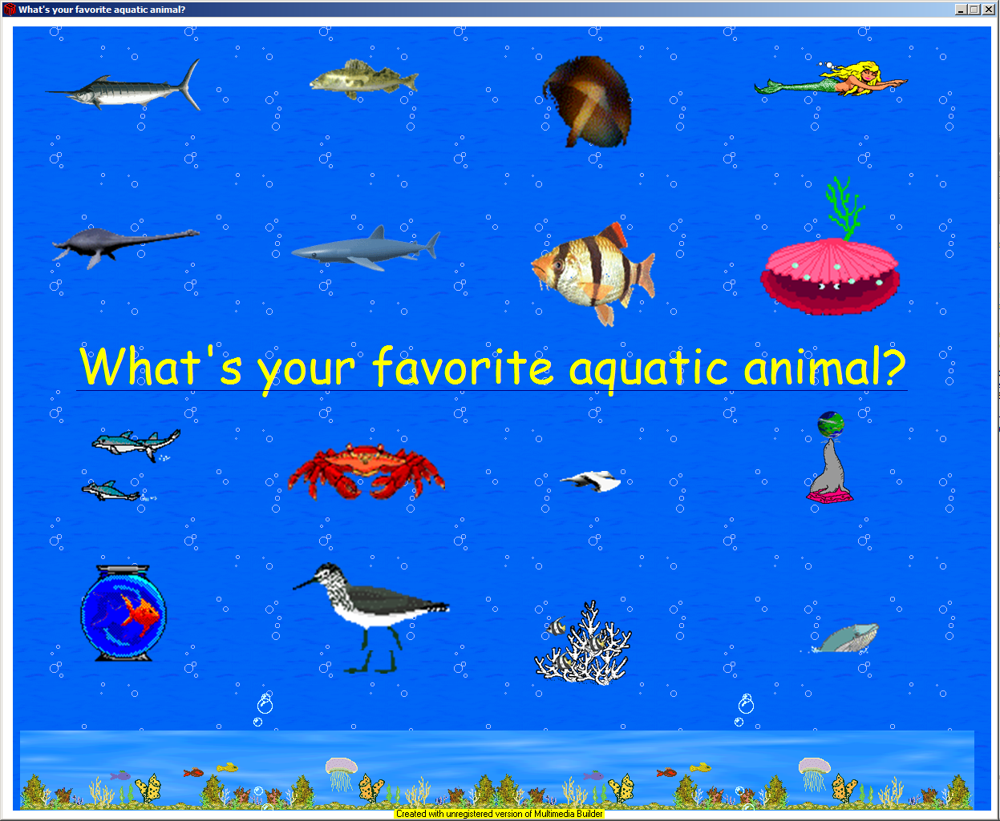
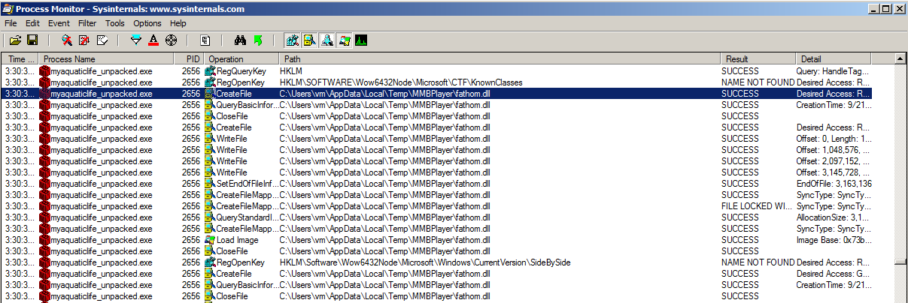
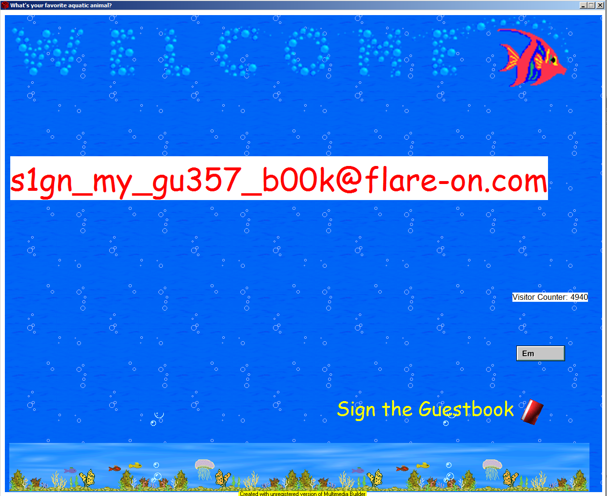

## Flare-On 2021 - #4 myaquaticlife
___

### Description: 

*What would Flare-On do without a healthy amount of nostalgia for the abraisive simplicity of 1990's UI design? Probably do more actual work and less writing fun challenges like this.*

`7-zip password: flare`

___

### Solution:

The binary seems to be packed with UPX. We unpack it:
```
C:\Users\vm\Desktop>reversing\upx-3.96-win32\upx -d  myaquaticlife.exe
                       Ultimate Packer for eXecutables
                          Copyright (C) 1996 - 2020
UPX 3.96w       Markus Oberhumer, Laszlo Molnar & John Reiser   Jan 23rd 2020

        File size         Ratio      Format      Name
   --------------------   ------   -----------   -----------
   3154103 <-   2389687   75.76%    win32/pe     myaquaticlife.exe

Unpacked 1 file.
```

The **myaquaticlife.exe** binary contains a 4x4 grip of 16 different fishes:


If we click on the text, we get the `You chose ..poorly` message. The first task is to
understand what's going on. Since the binary is too big, we use the
[procmon](https://docs.microsoft.com/en-us/sysinternals/downloads/procmon) util from
[SysInternals](https://docs.microsoft.com/en-us/sysinternals/), which gives us a library
call trace. From there we can see that the binary unpacks and loads an unknown [fathom.dll](./fathom.dll)
library:


To quickly locate the interesting code, we search for the `you chose.. poorly` string. This string only
appears in a single function inside [fathom.dll](./fathom.dll):
```C
int __usercall PluginFunc19@<eax>(int a1@<ebp>) {
  v16[0] = a1;
  v16[1] = retaddr;
  str_1 = (char *)glo_str_obj_1;
  *(_OWORD *)v14 = xmmword_74A1F3A0;
  *(_OWORD *)&v14[16] = xmmword_74A1F390;
  if ( !*(_DWORD *)(glo_str_obj_1 - 12) )
    return u_string_write_maybe((ATL::CSimpleStringT<wchar_t,0> *)&glo_str_obj_1, "you chose.. poorly", 0x12);
  str_2 = (char *)glo_str_obj_2;
  if ( !*(_DWORD *)(glo_str_obj_2 - 12) )
    return u_string_write_maybe((ATL::CSimpleStringT<wchar_t,0> *)&glo_str_obj_1, "you chose.. poorly", 0x12);
  if ( *(int *)(glo_str_obj_2 - 4) > 1 )
  {
    sub_747D2560((void **)&glo_str_obj_2, *(_DWORD *)(glo_str_obj_2 - 12));
    str_1 = (char *)glo_str_obj_1;
    str_2 = (char *)glo_str_obj_2;
  }
  if ( *((int *)str_1 - 1) > 1 )
  {
    sub_747D2560((void **)&glo_str_obj_1, *((_DWORD *)str_1 - 3));
    str_1 = (char *)glo_str_obj_1;
  }
  for ( i = 0; i < 31; ++i )
  {
    v14[i] ^= str_1[i % strlen(str_1)];
    v14[i] -= str_2[i % 0x11u];
  }
  hash_in = *(_OWORD *)v14;
  v13 = *(_OWORD *)&v14[16];
  result = u_calc_md5((BYTE *)&hash_in, (char *)hash_out);
  if ( !result )
  {
    v4 = strcmp((const char *)hash_out, "6c5215b12a10e936f8de1e42083ba184");
    if ( v4 )
      v4 = v4 < 0 ? -1 : 1;
    if ( !v4 )                                  // hashes are equal
    {
      /* Print the flag to screen */

      return result;
    }
    return u_string_write_maybe((ATL::CSimpleStringT<wchar_t,0> *)&glo_str_obj_1, "you chose.. poorly", 0x12);
  }
  return result;
}
```

This function uses the `glo_str_obj_1` and `glo_str_obj_2` string objects to calculate an MD5 sum using
the following algorithm:
```C
// Initial hash:
//      96 25 A4 A9 A3 96 9A 90  9F AF E5 38 F9 81 9E 16
//      F9 CB E4 A4 87 8F 8F BA  D2 9D A7 D1 FC A3 A8 00
for ( i = 0; i < 31; ++i ) {
    v14[i] ^= str_1[i % strlen(str_1)];
    v14[i] -= str_2[i % 0x11u];
}
```

Then, it compares the generated hash with `6c5215b12a10e936f8de1e42083ba184` and it matches,
it prints the flag to the app. Otherwise, it prints the `you chose.. poorly` message.

The next challenge, is to locate where these `glo_str_obj_1` and `glo_str_obj_2` get
initialized from. By following the DATA XREFs to those objects, we can see that they get
modified inside `SetFile` function, which is part of the EAT and is invoked by the main binary:
```Assembly
.rdata:74A98DC8 ;
.rdata:74A98DC8 ; Export Address Table for SimplePlugIn.dll
.rdata:74A98DC8 ;
.rdata:74A98DC8 off_74A98DC8    dd rva Copyright, rva Draw, rva GetData, rva GetFile, rva GetInfo
.rdata:74A98DC8                                         ; DATA XREF: .rdata:74A98DBC↑o
.rdata:74A98DC8                 dd rva GetInitString, rva GetString, rva GetType, rva HasIntDlg
.rdata:74A98DC8                 dd rva Interface, rva PluginFunc19, rva SetData, rva SetFile
.rdata:74A98DC8                 dd rva SetInitString, rva SetParentWindow, rva SetInitString_0
.rdata:74A98DC8                 dd rva SetString
.rdata:74A98E0C ;
.rdata:74A98E0C ; Export Names Table for SimplePlugIn.dll
.rdata:74A98E0C ;
.rdata:74A98E0C off_74A98E0C    dd rva aCopyright, rva aDraw, rva aGetdata, rva aGetfile
.rdata:74A98E0C                                         ; DATA XREF: .rdata:74A98DC0↑o
.rdata:74A98E0C                 dd rva aGetinfo, rva aGetinitstring, rva aGetstring, rva aGettype ; "Copyright" ...
.rdata:74A98E0C                 dd rva aHasintdlg, rva aInterface, rva aPluginfunc19, rva aSetdata
.rdata:74A98E0C                 dd rva aSetfile, rva aSetinitstring, rva aSetparentwindo
.rdata:74A98E0C                 dd rva aSetpath, rva aSetstring
```

`SetFile` is invoked every time we click on a fish:
```C
int __usercall SetFile@<eax>(int a1@<esi>, char *a2) {
    /* ... */

    *((_DWORD *)v10 - 3) = v11;
    v10[v11] = 0;
    if ( *((int *)v10 - 1) > 1 )
    {
      sub_747D2560((void **)&v22, *((_DWORD *)v10 - 3));
      v10 = v22;
    }
    v12 = strcmp(v10, "flotsam");
    if ( v12 )                                  // set glo_str_obj_1
      v12 = v12 < 0 ? -1 : 1;
    if ( v12 )
    {
      v16 = strcmp(v10, "jetsam");
      if ( v16 )
        v16 = v16 < 0 ? -1 : 1;
      if ( v16 )                                // set glo_str_obj_2
      {
        v17 = strcmp(v10, "lagan");
        if ( v17 )
          v17 = v17 < 0 ? -1 : 1;
        if ( v17 )
        {
          v18 = strcmp(v10, "derelict");
          if ( v18 )
            v18 = v18 < 0 ? -1 : 1;
          if ( !v18 )
            sub_747D22C0((ATL::CSimpleStringT<wchar_t,0> *)&glo_str_obj_4, String);
        }
        else
        {
          sub_747D22C0((ATL::CSimpleStringT<wchar_t,0> *)&glo_str_obj_3, String);
        }
      }
      else
      {
        sub_747D22C0((ATL::CSimpleStringT<wchar_t,0> *)&glo_str_obj_2, String);
      }
    }
    else
    {
      sub_747D22C0((ATL::CSimpleStringT<wchar_t,0> *)&glo_str_obj_1, String);
    }
  }
  v13 = (volatile signed __int32 *)(v8 - 16);
  if ( _InterlockedDecrement(v13 + 3) <= 0 )
    (*(void (__stdcall **)(volatile signed __int32 *))(**(_DWORD **)v13 + 4))(v13);
  v14 = (volatile signed __int32 *)(v10 - 16);  // _free_base
  result = _InterlockedDecrement(v14 + 3);
  if ( result <= 0 )
    return (*(int (__stdcall **)(volatile signed __int32 *))(**(_DWORD **)v14 + 4))(v14);// _free_base
  return result;
}
```

This function generates a string `name:rand` (we do not know and we do not care how) and then compares
its first part agains a set of constant strings (`flotsam`, `jetsam`, `lagan`, `derelict`). Based on
that it sets the values of `glo_str_obj_1` to `glo_str_obj_4`.
Each time we click a fish, the same string is generated. Since we only have **16** fishes, we set
a breakpoint on `strcmp`, we click on all fishes one by one and we get all possible values value for `v10`:
```
1  ~> derelict:MZZWP
2  ~> lagan:BAJkR
3  ~> flotsam:DFWEyEW
4  ~> flotsam:PXopvM
5  ~> derelict:LDNCVYU
6  ~> derelict:yXQsGB
7  ~> jetsam:newaui
8  ~> lagan:QICMX
9  ~> lagan:rOPFG
10 ~> jetsam:HwdwAZ
11 ~> jetsam:SLdkv
12 ~> derelict:LSZvYSFHW
13 ~> flotsam:BGgsuhn
14 ~> derelict:LSZvYSFHW
15 ~> derelict:RTYXAc
16 ~> lagan:GTXI
```

From here, we only care about the fishes that generate the `floatsam` and `jestsam` strings. However,
we do not know their order, so we have to brute force them. To do that we use the 
[myaquaticlife_crack.py](./myaquaticlife_crack.py) script which finds the correct sequence
`4, 3, 13, 11, 7, 10` that generates the target sum: `6c5215b12a10e936f8de1e42083ba184`.

If we decrypt this sequence, we get the flag: `s1gn_my_gu357_b00k@flare-on.com`


We can also get the flag through the app, if we click on the right fishes:



___

