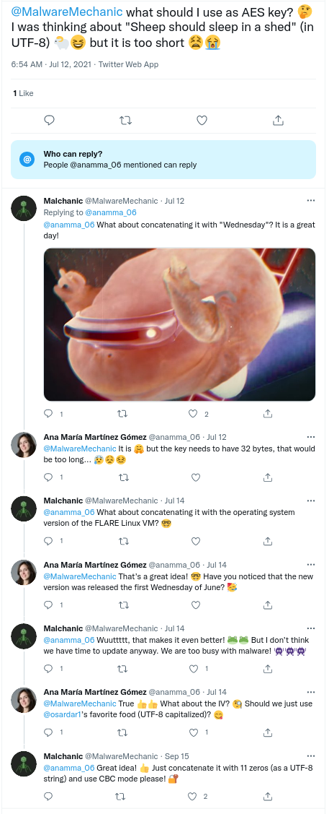

## Flare-On 2021 - #5 FLARE Linux VM
___

### Description: 

*Because of your superior performance throughout the FLARE-ON 8 Challenge, the FLARE team has invited you to their office to hand you a special prize! Ooh – a special prize from FLARE ? What could it be? You are led by a strong bald man with a strange sense of humor into a very nice conference room with very thick LED dimming glass. As you overhear him mumbling about a party and its shopping list you notice a sleek surveillance camera. The door locks shut!*

*Excited, you are now waiting in a conference room with an old and odd looking computer on the table. The door is closed with a digital lock with a full keyboard on it.*

*Now you realise... The prize was a trap! They love escape rooms and have locked you up in the office to make you test out their latest and greatest escape room technology. The only way out is the door – but it locked and it appears you have to enter a special code to get out. You notice the glyph for U+2691 on it. You turn you attention to the Linux computer - it seems to have been infected by some sort of malware that has encrypted everything in the documents directory, including any potential clues.*

*Escape the FLARE Linux VM to get the flag - hopefully it will be enough to find your way out.*


**Hints:**

- You can import "FLARE Linux VM.ovf" with both VMWare and VirtualBox.
- Log in as 'root' using the password 'flare'
- If you use VirtualBox and want to use ssh, you may need to enable port forwarding. The following link explains how to do it: [https://nsrc.org/workshops/2014/btnog/raw-attachment/wiki/Track2Agenda/ex-virtualbox-portforward-ssh.htm](https://nsrc.org/workshops/2014/btnog/raw-attachment/wiki/Track2Agenda/ex-virtualbox-portforward-ssh.htm)

`7zip password: flare`

___


### Solution:


As always, we start by checking the vm history and the local files:
```
192:~ # history | head
    1  2021-06-01 16:38:16 ip a
    2  2021-06-07 14:23:51 zypper refresh
    3  2021-06-07 14:26:32 zypper in --no-confirm openssh
    4  2021-08-26 17:37:45 poweroff
192:~ #
192:~ # ls Documents/
  .daiquiris.txt.broken    iced_coffee.txt.broken      oranges.txt.broken        strawberries.txt.broken
  backberries.txt.broken   instant_noodles.txt.broken  raisins.txt.broken        tacos.txt.broken
  banana_chips.txt.broken  nachos.txt.broken           rasberries.txt.broken     tiramisu.txt.broken
  blue_cheese.txt.broken   natillas.txt.broken         reeses.txt.broken         tomatoes.txt.broken
  donuts.txt.broken        nutella.txt.broken          sausages.txt.broken       udon_noddles.txt.broken
  dumplings.txt.broken     oats.txt.broken             shopping_list.txt.broken  ugali.txt.broken
  ice_cream.txt.broken     omelettes.txt.broken        spaghetti.txt.broken      unagi.txt.broken
192:~ #
192:~ # cat .bashrc
  alias FLARE="echo 'The 13th byte of the password is 0x35'"
192:~ #
192:~ # cat .bash_profile
  export NUMBER1=2
  export NUMBER2=3
  export NUMBER3=37
```

We also search for a for all occurences of `flare-on` in every file:
```
192:/ # grep -r -n flare-on 2> /dev/null
Binary file .snapshots/1/snapshot/usr/bin/dot matches
```

Okay, so we have two binaries (`zypper` and `dot`) and a bunch of encrypted files.
Let's take a look at [zypper](./zypper), which is located under `/usr/bin/zypper`.
Binary is not stripped, so we can easily understand it:
```c
int __cdecl main(int argc, const char **argv, const char **envp) {
  /* ... */
  std::allocator<char>::allocator(&v21, argv, envp);
  HOME = getenv("HOME");
  std::__cxx11::basic_string<char,std::char_traits<char>,std::allocator<char>>::basic_string(v20, HOME, &v21);
  std::allocator<char>::~allocator(&v21);
  Documents = "/Documents";
  std::__cxx11::basic_string<char,std::char_traits<char>,std::allocator<char>>::operator+=(v20, "/Documents");
  v5 = (const char *)std::__cxx11::basic_string<char,std::char_traits<char>,std::allocator<char>>::c_str(v20);
  dirp = opendir(v5);
  if ( dirp ) {
    while ( 1 ) {
      v26 = readdir(dirp);
      if ( !v26 ) break;
      std::allocator<char>::allocator(&v22, Documents, v6);
      std::__cxx11::basic_string<char,std::char_traits<char>,std::allocator<char>>::basic_string(v15, v26->d_name, &v22);
      std::allocator<char>::~allocator(&v22);
      last_of = std::__cxx11::basic_string<char,std::char_traits<char>,std::allocator<char>>::find_last_of(
                  v15,
                  ".",
                  -1LL);
      std::__cxx11::basic_string<char,std::char_traits<char>,std::allocator<char>>::substr(v16, v15, last_of + 1, -1LL);
      v4 = ".";
      if ( !(unsigned __int8)std::operator==<char>(v15, ".") ) {
        v4 = "..";
        if ( !(unsigned __int8)std::operator==<char>(v15, "..") ) {
          v4 = "broken";
          if ( !(unsigned __int8)std::operator==<char>(v16, "broken") ) {
            std::operator+<char>(v23, v20, "/");
            std::operator+<char>(v17, v23, v15);
            std::ifstream::basic_ifstream(v19);
            v9 = std::operator|(8LL, 4LL);
            std::ifstream::open(v19, v17, v9);
            std::ofstream::basic_ofstream(v18);
            v10 = std::operator|(16LL, 4LL);
            std::operator+<char>(v24, v17, ".broken");
            std::ofstream::open(v18, v24, v10);
            v25 = (char *)operator new[](0x400uLL);
            std::istream::read((std::istream *)v19, v25, 1024LL);
            encrypt(v25);
            std::ostream::write((std::ostream *)v18, v25, 1024LL);
            std::ifstream::close(v19);
            std::ofstream::close(v18);
            v11 = (const char *)std::__cxx11::basic_string<char,std::char_traits<char>,std::allocator<char>>::c_str(v17);
            remove(v11);
            v12 = std::operator<<<char>(&std::cout, v15);
            v13 = std::operator<<<std::char_traits<char>>(v12, " is now a secret");
            v4 = (const char *)&std::endl<char,std::char_traits<char>>;
            std::ostream::operator<<(v13, &std::endl<char,std::char_traits<char>>);
            
            /* dtors */
          }
        }
      }
    }
    closedir(dirp);
  }

  return 0;
}
```

This function goes into `Documents` directory and encrypts every file that doesn't have the `.broken`
extension. Let's see how the `encrypt()` function works at `401707h`:
```c
void __fastcall encrypt(char *a1_bufin) {
  /* decls */
  strcpy(key, "A secret is no longer a secret once someone knows it");
  for ( i_0 = 0; i_0 <= 255; ++i_0 )
    S[i_0] = i_0;
  j = 0;
  for ( i = 0; i <= 255; ++i ) {
    j = (S[i] + j + key[i % 52]) % 256;
    swap = S[i];
    S[i] = S[j];
    S[j] = swap;
  }

  i_1 = 0;
  j = 0;
  v7 = 0;
  
  for ( k = 0; k <= 1023; ++k ) {
    i_1 = (i_1 + 1) % 256;
    j = (j + S[i_1]) % 256;
    swap_1 = S[i_1];
    S[i_1] = S[j];
    S[j] = swap_1;
    K = S[(S[j] + S[i_1]) % 256];
    a1_bufin[k] ^= K ^ v7;
    v7 = K;
  }
}
```

This is almost like an RC4, but with a tiny difference: Instead of XORing each byte `B_i` with the
keystream `K_i`, we also XOR it with the previous keystream `K_(i-1)`. We can easily decrypt all
files using the [flare_linux_vm_decryptor.py](./flare_linux_vm_decryptor.py) script.

### Decrypting Files

After decryption we get the following set of files:
```
backberries.txt   banana_chips.txt    blue_cheese.txt
daiquiris.txt     donuts.txt          dumplings.txt
ice_cream.txt     iced_coffee.txt     instant_noodles.txt
nachos.txt        natillas.txt        nutella.txt
oats.txt          omelettes.txt       oranges.txt
raisins.txt       rasberries.txt      reeses.txt
sausages.txt      shopping_list.txt   spaghetti.txt         strawberries.txt
tacos.txt         tiramisu.txt        tomatoes.txt
udon_noddles.txt  ugali.txt           unagi.txt
```

Some of them contain readable plaintext while some others are encrypted with various ciphers.
It's important to notice here that each there are exactly **3** ingredients that start with the same
letter. The only exception is `shopping_list.txt`, which is not an ingredient at all:
```
/
[U]don noodles
[S]trawberries
[R]eese's
/
[B]anana chips
[I]ce Cream
[N]atillas
/
[D]onuts
[O]melettes
[T]acos
```

The acronym here is `/usr/bin/dot`. We keep this in mind. To solve this challenge I was decrypting
the files in a random order. However after I solved it, I noticed that the ingredients start with
the letters `B`, `D`, `I`, `N`, `O`, `R`, `S`, `T` and `U`, which is an anagram of `USR BIN DOT`.
Therefore, the correct order to decrypt the ingredients, is to start first from `U` ingredients,
then decrypt the `S` ingredients and so on.


For more details, please refer to the [flare_linux_vm_crack.py](./flare_linux_vm_crack.py) script.


#### Decrypting "U" Ingredients

**udon_noddles.txt:**
```
"ugali", "unagi" and "udon noodles" are delicious. What a coincidence that all of them start by "u"!
```

**ugali.txt**
```
Ugali with Sausages or Spaghetti is tasty. It doesnât matter if you rotate it left or right, it is still tasty! You should try to come up with a great recipe using CyberChef.
```

**unagi.txt:**
```
The 1st byte of the password is 0x45
```

The `udon_noddles` file give us another hint that we should start wt `U` ingredients. We also know
the first byte of the password. We keep this in mind.

#### Decrypting "S" Ingredients

To decrypt the `S` ingredients we use the hint *"...if you rotate it left or right"*. so we have
encryption with `ROL` or `ROR`. We try both with all possible bit rotations (**1**, **2**, and so
on). The correct decryption is a `ROR` by **7** bits:

**sausages.txt:**
```
The 2st byte of the password is 0x34
```

**spaghetti.txt:**
```
In the FLARE language "spaghetti" is "c3BhZ2hldHRp".
```

**strawberries.txt:**
```
In the FLARE team we like to speak in code. You should learn our language, otherwise you want be able to speak with us when you escape (if you manage to escape!). For example, instead of "strawberries" we say "c3RyYXdiZXJyaWVz".
```

#### Decrypting "R" Ingredients

The `R` ingredients are just base64 encoded strings (we do not even need to use the hint).

**raisins.txt:**
```
VGhlIDNyZCBieXRlIG9mIHRoZSBwYXNzd29yZCBpcy4uIGl0IGlzIGEgam9rZSwgd2UgZG9uJ3QgbGlrZSByYWlzaW5zIQo=

The 3rd byte of the password is.. it is a joke, we don't like raisins!
```

**rasberries.txt:**
```
VGhlIDNyZCBieXRlIG9mIHRoZSBwYXNzd29yZCBpczogMHg1MQo=

The 3rd byte of the password is: 0x51
```

**reeses.txt:**
```
V2UgTE9WRSAiUmVlc2UncyIsIHRoZXkgYXJlIGdyZWF0IGZvciBldmVyeXRoaW5nISBUaGV5IGFyZSBhbWF6aW5nIGluIGljZS1jcmVhbSBhbmQgdGhleSBldmVuIHdvcmsgYXMgYSBrZXkgZm9yIFhPUiBlbmNvZGluZy4K

We LOVE "Reese's", they are great for everything! They are amazing in ice-cream and they even work as a key for XOR encoding.
```

#### Decrypting "B" Ingredients

To decrypt the `B` ingredients we use the hint *"Reese's", ... work as a key for XOR encoding.*.
So the cipher is encrypted using a simple XOR encoding using `Reese's` as a key.

**backberries.txt:**
```
If you are not good in maths, the only thing that can save you is to be a bash expert. Otherwise you will be locked here forever HA HA HA!
```

**banana_chips.txt:**
```
Are you good at maths? We love maths at FLARE! We use this formula a lot to decode bytes: "ENCODED_BYTE + 27 + NUMBER1 * NUMBER2 - NUMBER3"
```

**blue_cheese.txt:**
```
The 4th byte of the password is: 0x35
```

#### Decrypting "I" Ingredients

To decrypt the `I` ingredients we use the custom decryption listed above:
`"ENCODED_BYTE + 27 + NUMBER1 * NUMBER2 - NUMBER3"`. We already know from `.bash_profile`, that
`NUMBER1=2`, `NUMBER2=3` and `NUMBER3=37`.

**ice_cream.txt:**
```
If this challenge is too difficult and you want to give up or just in case you got hungry, what about baking some muffins? Try this recipe:
0 - Cinnamon
1 - Butter 150gr
2 - Lemon 1/2
3 - Eggs 3
4 - Sugar 150gr
5 - Flour 250gr
6 - Milk 30gr
7 - Icing sugar 10gr
8 - Apple 100gr
9 - Raspberries 100gr

Mix 0 to 9 and bake for 30 minutes at 180°C.
```

**iced_coffee.txt:**
```
The only problem with RC4 is that you need a key. The FLARE team normally uses this number: "SREFBE" (as an UTF-8 string). If you have no idea what that means, you should give up and bake some muffins.
```

**instant_noodles.txt:**
```
The 5th byte of the password is: 0xMS
```

#### Decrypting "N" Ingredients

To decrypt the `N` ingredients are encrypted using **RC4**. We would expect the key to be `SREFBE`,
but it is not. The hint says *normally uses this number*, but the key is a string. If we look at
the `ice_cream.txt` above we can see that we have to substitute the letters with numbers. Then we
can get the correct RC4 key: `493513`.

**nachos.txt:**
```
In the FLARE team we really like Felix Delastelle algorithms, specially the one which combines the Polybius square with transposition, and uses fractionation to achieve diffusion.
```

**natillas.txt:**
```
Do you know natillas? In Spain, this term refers to a custard dish made with milk and KEYWORD, similar to other European creams as crème anglaise. In Colombia, the delicacy does not include KEYWORD, and is called natilla.
```

**nutella.txt:**
```
The 6th byte of the password is: 0x36
```

#### Decrypting "D" Ingredients

To decrypt the `D` ingredients we use the hint: *Felix Delastelle*, which is the inventor of the
[Bifid cipher](https://en.wikipedia.org/wiki/Bifid_cipher). The key is the missing ingredient from
natilla, that exist in natillas: **EGGS** (we find it through Google). We use [CyberChef](https://gchq.github.io/CyberChef/)

**daiquiris.txt:**
```
Qac 7ys hcpe xq cyp typxterl xi: 0m66

The 7th byte of the password is: 0x66
```

**donuts.txt:**
```
Din moq agos etcp Ememog Lhobeihz Awttivt ytxtv drwvgoswps?

Did you know that Giovan Battista Bellaso loved microwaves?
```

**dumplings.txt:**
```
Abn lef emadkxp frceqdnhe? Tah gdcktm temyku xxo qo ktyhzn! Zd'k raooua, por uda ztykqh.

Are you missing something? You should search for it better! It's hidden, but not really.
```

#### Decrypting "O" Ingredients

The `O` ingredients are encrypted using Vigenère cipher. To decrypt them we use this
[tool](https://www.boxentriq.com/code-breaking/vigenere-cipher). Key is `microwaves`.

**oats.txt:**
```
Kww jvkugh xatnfk phz JDMZG kswm dr Liqvksn. Tciq bwuk o xuigz an keharzwluvi jhqfa efp pcms crzel owpmsnsvxaav qe Hsioxwd!
pvkdo://trmlfmt.tci/aieeyi_06
jkhls://oaafbgi.qkm/HediitvAaccefuk

You should follow the FLARE team in Twitter. They post a bunch of interesting stuff and have great conversation on Twitter!
https://twitter.com/anamma_06
https://twitter.com/MalwareMechanic
```

**omelettes.txt:**
```
Kww jvkugh xatnfk phz JDMZG kswm dr Liqvksn. Oolwdekjs phzc emg ivh wnbvq mvf ecp lzx qac nvore zzwz qh pcq gzx ltm hcoc.
hoxhe://byzhpem.ggy/ipraia_06
cxlba://vnwptzv.uau/qjondvv1
zfbrj://hsioxwd.kqd/AwlrejqUgtvwndg

You should follow the FLARE team in twitter Otherwise they may get angry and not let you leave even if you get the flag
https://twitter.com/anamma
https://twitter.com/osardar
https://twitter.com/malwaremechanic
```

**oranges.txt:**
```
Fpg 8kv xyoi gr bjv dwsnagdl kj: 0l60

The 8th byte of the password is: 0x60
```


#### Decrypting "T" Ingredients

Finally, the `T` ingredients are encrypted using AES. To find the mode, the IV and the key, we have
to look at the following twitter discussion:



And here:


So we have **AES-CBC** with key `Sheep should sleep in a shed15.2` and IV `PIZZA00000000000`.

**tacos.txt:**
```
Woow! It seems you are very very close to get the flag! Be careful when converting decimal and hexadecimal values to ASCII and hurry up before we run out of tacos!
```

**tiramisu.txt:**
```
The 9th byte of the password is the atomic number of the element moscovium
The 10th byte of the password is the bell number preceding 203
The 12th byte of the password is the largest known number to be the sum of two primes in exactly two different ways
The 14th (and last byte) of the password is the sum of the number of participants from Spain, Singapore and Indonesia that finished the FLARE-ON 7, FLARE-ON 6 or FLARE-ON 5
```

**tomatoes.txt:**
```
It seems you are close to escape... We are preparing the tomatoes to throw at you when you open the door! It is only a joke...
The 11th byte of the password is the number of unique words in /etc/Quijote.txt
The 13th byte of the password is revealed by the FLARE alias
```

### Final Password

If we put everything together get the following:

* The 1st byte of the password is 0x45 ~> `E`
* The 2st byte of the password is 0x34 ~> `4`
* The 3rd byte of the password is 0x51 ~> `Q`
* The 4th byte of the password is 0x35 ~> `5`
* The 5th byte of the password is 0xMS ~> 0x64 ~> `d`
* The 6th byte of the password is 0x36 ~> `6`
* The 7th byte of the password is 0x66 ~> `f`
* The 8th byte of the password is 0x60 ~> (backtick)
* The 9th byte of the password is the atomic number of the element moscovium ~> 0x73 ~> `s`
* The 10th byte of the password is the bell number preceding 203 ~> 52 ~> `4`
* The 11th byte of the password is the number of unique words in `/etc/Quijote.txt` ~> 108 ~> `l`
* The 12th byte of the password is the largest known number to be the sum of two primes in exactly two different ways ~> 68 ~> `D`
* The 13th byte of the password is 0x35 ~> `5`
* The 14th (and last byte) of the password is the sum of the number of participants from Spain, Singapore and Indonesia that finished the FLARE-ON 7, FLARE-ON 6 or FLARE-ON 5 ~> 73 ~> `I`


[FLARE-ON 7](https://www.fireeye.com/blog/threat-research/2020/10/flare-on-7-challenge-solutions.html): `9 + 19 + 0`

[FLARE-ON 6](https://www.mandiant.com/resources/2019-flare-on-challenge-solutions):  `7 + 25 + 2`

[FLARE-ON 5](https://www.mandiant.com/resources/2018-flare-on-challenge-solutions):  `4 + 6 + 1`

Which adds to **73**.


Therefore the final password is:
```
E4Q5d6f`s4lD5I
```

This is obviously not the flag. Remember that we also have the special [dot](./dot) file:
```
ispo@ispo-glaptop:~/ctf/flare-on-2021/05_FLARE_Linux_VM$ ./dot 
  Password: E4Q5d6f`s4lD5I
  Correct password!
  Flag: H4Ck3r_e5c4P3D@flare-on.com
```

If we open [dot](./dot) we can see how the password is transformed into the flag:
```
for ( i = 0; ; ++i ) {
    v6 = i;
    if ( v6 >= std::__cxx11::basic_string<char,std::char_traits<char>,std::allocator<char>>::length(password) )
      break;
    len = std::__cxx11::basic_string<char,std::char_traits<char>,std::allocator<char>>::length(password);
    charat = (_BYTE *)std::__cxx11::basic_string<char,std::char_traits<char>,std::allocator<char>>::operator[](
                        password,
                        len - i - 1);
    std::__cxx11::basic_string<char,std::char_traits<char>,std::allocator<char>>::operator+=(
      flag,
      (unsigned int)(char)(*charat - 1));
}
```

That is, password is reversed and every byte is decremented by **1**.

___
