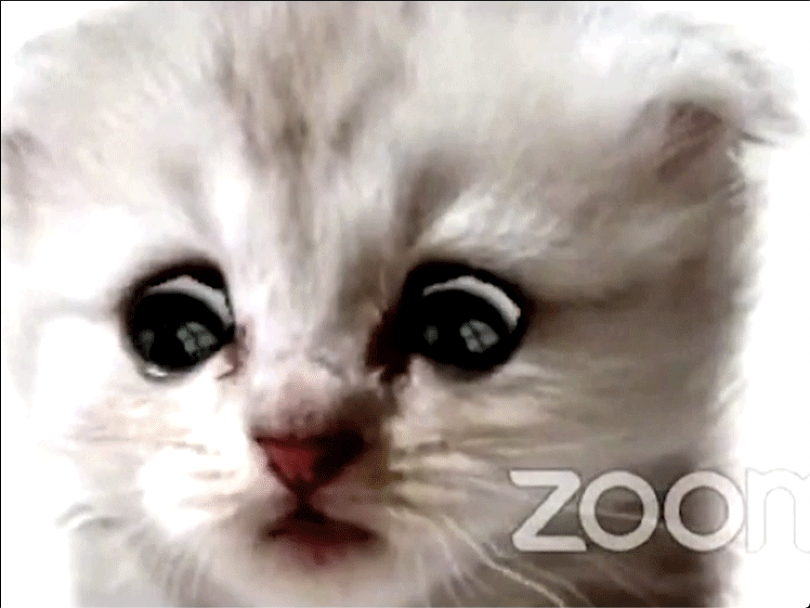

## Flare-On 2021 - #6: PetTheKitty
___

### Description: 

*Hello,*

*Recently we experienced an attack against our super secure MEOW-5000 network. Forensic analysis discovered evidence of the files PurrMachine.exe and PetTheKitty.jpg; however, these files were ultimately unrecoverable. We suspect PurrMachine.exe to be a downloader and do not know what role PetTheKitty.jpg plays (likely a second-stage payload). Our incident responders were able to recover malicious traffic from the infected machine. Please analyze the PCAP file and extract additional artifacts.*

*Looking forward to your analysis, ~Meow*

`7-zip password: flare`

___

### Solution:

The first task is to recover the two files from the first stream. To do that,
we use wireshark. First, the client sends the following request:
```
    ME0W2\x00\x00\x00\x32\x00\x00\x00~meow~ (=^.^=) ~meow~.... can haz MeeooowwwMeme???
```


Then, the client send another request:
```
    ME0W8\x00\x00\x00\x38\x00\x00\x00~meow~ (=^.^=) ~meow~.... can haz MeeeeeooooowwWare?????
```   


After that, a new connection starts and a large of packets is exchanged:


Then server replies with a large set of TCP packets. We "follow the TCP stream" and we extract the
received data into a file. This file is not actually a png image, but a collection of a few files
concatenated together.
Since this file is processed by the **PurrMachine.exe**, it must have a well defined way to "unpack"
files from the jpg image. If we look at the first bytes of the file:
```
ispo@ispo-glaptop:~/ctf/flare-on-2021/06_PetTheKitty$ hexdump -C PetTheKitty.raw | head -n 3
00000000  4d 45 30 57 d0 24 0a 00  d0 24 0a 00 89 50 4e 47  |ME0W.$...$...PNG|
00000010  0d 0a 1a 0a 00 00 00 0d  49 48 44 52 00 00 05 d8  |........IHDR....|
00000020  00 00 04 62 08 06 00 00  00 b7 69 95 af 00 00 0c  |...b......i.....|
```

The protocol here is easy to infer: First, there is the 32-bit magic header `ME0W`.
Then, there are two consequtive **32-bit** words that contain the size of the file that follows
(this redundancy is probably to detect errors). Therefore, the header size is **12** bytes.
In our case, we can see tht the first file has size `A24D0h` bytes and it is a PNG image.
If we move at the offset `C + A24D0 = A24DCh`, we can see the next `ME0W` header:
```
ispo@ispo-glaptop:~/ctf/flare-on-2021/06_PetTheKitty$ hexdump -C PetTheKitty.raw | grep 000a24d0 -A 3
000a24d0  00 00 00 00 00 00 00 00  00 00 00 00 4d 45 30 57  |............ME0W|
000a24e0  b1 29 00 00 b1 29 00 00  50 41 33 30 c0 be 42 02  |.)...)..PA30..B.|
000a24f0  77 a0 d7 01 18 23 80 00  f2 15 21 00 01 98 99 02  |w....#....!.....|
000a2500  a4 40 68 12 45 48 15 82  c5 bb 22 9a 21 02 00 20  |.@h.EH....".!.. |
```

This file has size `29B1h` bytes and it is a `PA30` Windows patch file. Finally, if we move at offset
`C + A24D0 + C + 29B1 = A4E99h` we can reach the end of the file:
```
ispo@ispo-glaptop:~/ctf/flare-on-2021/06_PetTheKitty$ hexdump -C PetTheKitty.raw | grep 000a4e90 -A 3
000a4e90  42 3e 7e 3e 4f bc 58 1f  0a                       |B>~>O.X..|
000a4e99
```

Since we know the offsets, we can easily extract those two files:
```python
data = open('PetTheKitty.raw', 'rb').read()
open('file_1.png', 'wb').write(data[0xC:0xC+0xA24D0])
open('file_2.patch', 'wb').write(data[0xC+0xA24D0+0xC:])
```

Since we only have **2** files in this challenge, the second file ([file_2.patch](./file_2.patch))
must be a patch for the first file ([file_1.png](./file_1.png)):
The [Delta Compression API](https://docs.microsoft.com/en-us/previous-versions/bb417345(v=msdn.10)
can operate on any file (not just on executables). We use
[petthekitty_patch.py](./petthekitty_patch.py) to apply the patch.



### Reversing the DLL

After we apply the patch file to the image we get a DLL file ([stage_1.dll](./stage_1.dll))
as a result. This DLL is essentially a C&C client. First it creates a process called 
`C:\\wiNdOwS\\sYstEm32\\cMd.ExE` and then uses pipes to write commands to it and read the output.
When it receives a command, function `u_recv_n_decrypt_delta_buf` at `1000128Ah` is invoked:
```c
int __usercall u_recv_n_decrypt_delta_buf@<eax>(SOCKET a1_sock@<ecx>, DWORD *a2@<edx>, int a3_len_out) {  
  /* decls */
  if ( recv(a1_sock, buf, 12, 0) != -1 && *(_DWORD *)buf == 'W0EM' ) {
    nread = dwBytes;
    buflen = dwBytes;
    ProcessHeap = GetProcessHeap();
    recv_buf = (char *)HeapAlloc(ProcessHeap, 8u, buflen);
    if ( nread ) {
      i = 0;
      while ( 1 ) {
        bytes_read = recv(a1_sock, &recv_buf[i], nread, 0);
        if ( bytes_read == -1 )
          break;
        i = bytes_read + total_sz;
        total_sz += bytes_read;
        nread -= bytes_read;
        if ( !nread )
          goto RECV_END;
      }
    }
    else
    {
RECV_END:
      if ( u_apply_delta_from_Src(recv_buf, dwBytes, &Src) != 1 )  {
        v17 = Size;
        v9 = GetProcessHeap();
        dst = HeapAlloc(v9, 8u, v17);
        v18 = Size;
        lpStart = Src.lpStart;
        *a2 = (DWORD)dst;
        memcpy(dst, lpStart, v18);
        v11 = Size;
        j = 0;
        *(_DWORD *)a3_len_out = Size;
        if ( v11 )
        {
          do {                                   // decrypt buffer          
            *(_BYTE *)(*a2 + j) ^= aMeoow[j % 5];// meoow
            ++j;
          } while ( j < *(_DWORD *)a3_len_out );
        }
        v4 = 0;
      }
    }
  }
  if ( Src.lpStart )
    DeltaFree(Src.lpStart);
  if ( recv_buf )
  {
    v13 = GetProcessHeap();
    HeapFree(v13, 0, recv_buf);
  }
  return v4;
}
```

Function `u_apply_delta_from_Src` is essentially a wrapper for
[ApplyDeltaB](https://docs.microsoft.com/en-us/windows/win32/devnotes/msdelta-applydeltab). That is,
when the bot receives a command (which is encrypted as a patch file), it applies its delta to the
image file and then uses a simple XOR decryption (key is `meoow`). To send the command output back
to the server, it invokes `u_encrypt_delta_n_send_buf` at `1000111Eh`:
```c
int __usercall u_encrypt_delta_n_send_buf@<eax>(_BYTE *a1_buf@<edx>, SOCKET a2_sock@<ecx>, size_t a3_buflen) {
  /* decls */
  if ( a3_buflen ) {
    do {                                        // encrypt input buffer
      a1_buf[i] ^= aMeoow[i % 5];
      ++i;
    } while ( i < a3_buflen );
    v3 = 1;
  }
  target_len = hSrc * wSrc;
  v16 = hSrc * wSrc;
  ProcessHeap = GetProcessHeap();
  target = HeapAlloc(ProcessHeap, 8u, v16);
  memcpy(target, Src, target_len);              // copy source buffer
  memcpy(target, a1_buf, a3_buflen);            // overwrite the first part of Src
  zero = u_create_delta(target_len, Src, target, target_len, &lpDelta); // CreateDeltaB
  if ( target )
  {
    v9 = GetProcessHeap();
    HeapFree(v9, 0, target);
  }
  if ( zero != 1 )                              // always true
  {
    v17 = lpDelta.uSize + 12;
    v10 = GetProcessHeap();
    me0w_chunk = (me0w_struct *)HeapAlloc(v10, 8u, v17);
    me0w_chunk->data_len = a3_buflen;
    me0w_chunk->magic = 'W0EM';
    me0w_chunk->delta_size = lpDelta.uSize;
    memcpy(&me0w_chunk->data, lpDelta.lpStart, lpDelta.uSize);
    leftover = lpDelta.uSize + 12;
    
    /* send */
  }
  if ( lpDelta.lpStart )
    DeltaFree(lpDelta.lpStart);
  if ( me0w_chunk )
  {
    v14 = GetProcessHeap();
    HeapFree(v14, 0, me0w_chunk);
  }
  return v3;
}
```

So, all we have to do, is to decrypt the second TCP stream ([tcp_stream_2.raw](./tcp_stream_2.raw)
that contains the C&C communication.
We use the [petthekitty_crack.py](./petthekitty_crack.py) script to decrypt the communication (the
communication is located at the bottom of [petthekitty_crack.py](./petthekitty_crack.py)).
The flag is inside **Gotcha.txt**:
```
We're no strangers to love
You know the rules and so do I
A full commitment's what I'm thinking of
You wouldn't get this from any other guy
I just wanna tell you how I'm feeling
Gotta make you understand
Never gonna give you up, never gonna let you down
Never gonna run around and desert you
Never gonna make you cry, never gonna say goodbye
Never gonna tell a lie and hurt you
We've known each other for so long
Your heart's been aching but you're too shy to say it
Inside we both know what's been going on
We know the game and we're gonna play it
And if you ask me how I'm feeling
Don't tell me you're too blind to see
1m_H3rE_Liv3_1m_n0t_a_C4t@flare-on.com
Never gonna give you up, never gonna let you down
Never gonna run around and desert you
Never gonna make you cry, never gonna say goodbye
Never gonna tell a lie and hurt you
Never gonna give you up, never gonna let you down
Never gonna run around and desert you
Never gonna make you cry, never gonna say goodbye
Never gonna tell a lie and hurt you
We've known each other for so long
Your heart's been aching but you're too shy to say it
Inside we both know what's been going on
We know the game and we're gonna play it
I just wanna tell you how I'm feeling
Gotta make you understand
Never gonna give you up, never gonna let you down
Never gonna run around and desert you
Never gonna make you cry, never gonna say goodbye
Never gonna tell a lie and hurt you
Never gonna give you up, never gonna let you down
Never gonna run around and desert you
Never gonna make you cry, never gonna say goodbye
Never gonna tell a lie and hurt you
Never gonna give you up, never gonna let you down
Never gonna run around and desert you
Never gonna make you cry, never gonna say goodbye
Never gonna tell a lie and hurt you
```

So the flag is: `1m_H3rE_Liv3_1m_n0t_a_C4t@flare-on.com`
___
