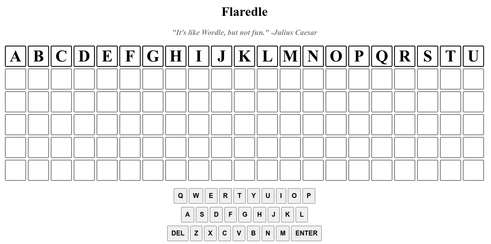
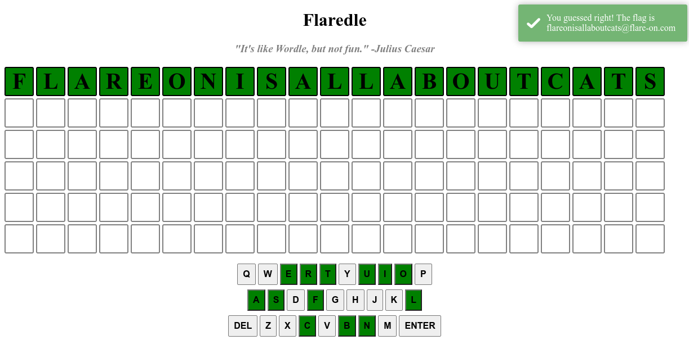

## Flare-On 2022 - #1 Flaredle
___

### Description: 

*Welcome to Flare-On 9!*

*You probably won't win. Maybe you're like us and spent the year playing Wordle. We made our own version that is too hard to beat without cheating.*

*Play it live at: [http://flare-on.com/flaredle/](http://flare-on.com/flaredle/)*

`7-zip password: flare`

___

### Solution:

This challenge is a wordle:



Code consists of **2** javascript files: *words.js* and *script.js*. *words.js* is just
an array with a collection of words:
```javascript
export const WORDS = ['acetylphenylhydrazine',
    'aerobacteriologically',
    'alkylbenzenesulfonate',
    'aminoacetophenetidine',
    /* ..... */
    'undistinguishableness',
    'unstraightforwardness',
    'ureteropyelonephritis',
    'zygomaticoauricularis',
]
````

Let's focus on the most important parts of *script.js*:
```javascript
import { WORDS } from "./words.js";

const NUMBER_OF_GUESSES = 6;
const WORD_LENGTH = 21;
const CORRECT_GUESS = 57;   // <--- IMPORTANT!
/* ... */
let rightGuessString = WORDS[CORRECT_GUESS];

/* ... */

function checkGuess () {
    /* ... */
    let row = document.getElementsByClassName("letter-row")[NUMBER_OF_GUESSES - guessesRemaining]
    let guessString = ''
    let rightGuess = Array.from(rightGuessString)

    for (const val of currentGuess) {
        guessString += val
    }

    if (guessString.length != WORD_LENGTH) {
        toastr.error("Not enough letters!")
        return
    }

    if (!WORDS.includes(guessString)) {
        toastr.error("Word not in list!")
        return
    }

    /* ... */

    if (guessString === rightGuessString) {
        let flag = rightGuessString + '@flare-on.com';
        toastr.options.timeOut = 0;
        toastr.options.onclick = function() {alert(flag);}
        toastr.success('You guessed right! The flag is ' + flag);

        guessesRemaining = 0
        return
    } else {
        /* ... */
    }
}

/* ... */
```

The code is pretty easy to follow. In order to get the flag, we have to type the word at index **57**:
```javascript
export const WORDS = [
    /* ... */
    'flareonisallaboutcats',
    /* ... */
]
````

We type it and we get the flag: `flareonisallaboutcats@flare-on.com`



___
