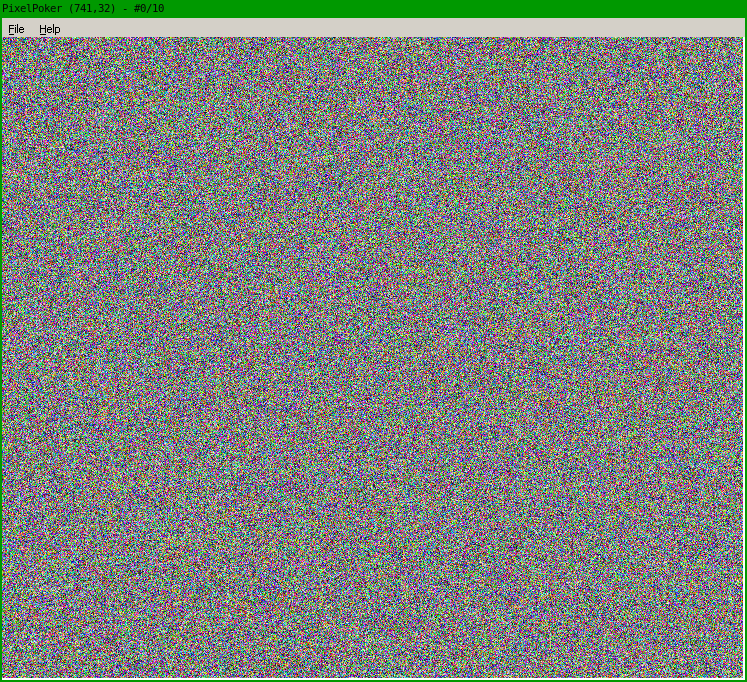
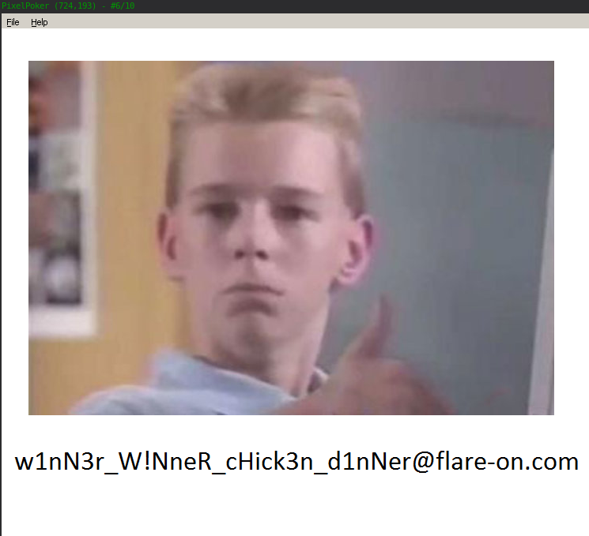

## Flare-On 2022 - #2 Pixel Poker
___

### Description: 

*I said you wouldn't win that last one. I lied. The last challenge was basically a captcha. Now the real work begins. Shall we play another game?*

`7-zip password: flare`

___

### Solution:

We start by looking at the *readme.txt** in the archive:
```
Welcome to PixelPoker ^_^, the pixel game that's sweeping the nation!

Your goal is simple: find the correct pixel and click it

Good luck!
```

As the description says we have to find the correct pixel:



To do that, we have to look at the Window callback at `0x4012C0`:
```c
LRESULT __stdcall u_wnd_callback(HWND hWnd, MACRO_WM Msg, WPARAM wParam, LPARAM lParam) {
  /* ... */

  memset(String, 0, sizeof(String));
  if ( Msg > (unsigned int)WM_COMMAND )
  {
    if ( Msg == WM_MOUSEMOVE )
    {
      _snprintf(String, 0x104u, "PixelPoker (%d,%d) - #%d/%d", (__int16)lParam, SHIWORD(lParam), glo_n_tries, 10);
      SetWindowTextA(hWnd, String);
      return 0;
    }
    if ( Msg != WM_LBUTTONDOWN )
      return DefWindowProcW(hWnd, Msg, wParam, lParam);
    // * * * Click left mouse button * * *
    lparam = (__int16)lParam;
    if ( glo_n_tries == 10 )
    {
      MessageBoxA(0, "Womp womp... :(", "Please play again!", 0);
      DestroyWindow(hWnd);
SHOW_TEXT_N_RETN:
      _snprintf(String, 0x104u, "PixelPoker (%d,%d) - #%d/%d", lparam, SHIWORD(lParam), glo_n_tries, 10);
      SetWindowTextA(hWnd, String);
      DC = GetDC(hWnd);
      BitBlt(DC, 0, 0, glo_cx, glo_cy, hdc, 0, 0, SRCCOPY);
      ReleaseDC(hWnd, DC);
      return 0;
    }
    ++glo_n_tries;
    // lParam has mouse coordinates (low word for x, high word for y)
    cx_ = glo_cx;
    if ( (__int16)lParam == glo_X_mask % glo_cx )
    {
      cy_ = glo_cy;
      if ( SHIWORD(lParam) == glo_Y_mask % glo_cy )
      {
        i = 0;
        if ( (int)glo_cy > 0 ) {
          cx__ = glo_cx;
          do {
            j = 0;
            if ( cx__ > 0 ) {
              do {
                u_check_pixel_n_decrypt(j, i);
                cx__ = glo_cx;
                ++j;
              } while ( j < (int)glo_cx );
              cy_ = glo_cy;
            }
            ++i;
          } while ( i < (int)cy_ );
        }
        lparam = (__int16)lParam;
        goto SHOW_TEXT_N_RETN;
      }
      cx_ = glo_cx;
    }
    else {
      cy_ = glo_cy;
    }

    if ( (__int16)lParam < cx_ && SHIWORD(lParam) < cy_ )
      u_check_pixel_n_decrypt((__int16)lParam, SHIWORD(lParam));
    goto SHOW_TEXT_N_RETN;
  }

  /* ... */

  PostQuitMessage(0);
  return 0;
}
```

If we click the correct pixel, function at `0x4015D0` decrypts the bitmap:
```c
void __cdecl u_check_pixel_n_decrypt(int x, int y) {
  int v3; // ecx
  int y_; // esi
  char decr_key[260]; // [esp+Ch] [ebp-108h] BYREF
  int v6; // [esp+110h] [ebp-4h]
  int xa; // [esp+11Ch] [ebp+8h]

  memset(decr_key, 0, sizeof(decr_key));
  v3 = x % 32;
  v6 = x % 32;
  xa = x / 32;
  if ( ((1 << (y * glo_cx + v3)) & glo_pixel_map[x / 32 + y * glo_cx]) == 0 )// check pixel
  {
    y_ = y;                                     // pixel found
    y = GetPixel(hdc, x, y);
    _snprintf(decr_key, 0x104u, "PixelPoker (%d,%d)", x, y_);
    u_decrypt_rc4((int)&y, 4, decr_key, strlen(decr_key), (char *)&y);// set y
    SetPixel(hdc, x, y_, y & 0xFFFFFF);
    glo_pixel_map[y_ * glo_cx + xa] |= 1 << (y_ * glo_cx + v6);
  }
}
```

### Finding the Correct Pixel

To find the correct pixel we need to know `glo_X_mask` and `glo_Y_mask` which contain
constant values:
```assembly
.data:00412004 glo_X_mask      dd 52414C46h            ; DATA XREF: u_wnd_callback+1B7↑r
.data:00412008 glo_Y_mask      dd 6E4F2D45h            ; DATA XREF: u_wnd_callback+1CC↑r
.data:0041200C                 dd 0
```

We also need to know, `glo_cx` and `glo_cy` which contain the dimensions of the picture,
which are initialized in `0x401040`:
```c
int __cdecl u_create_window(HINSTANCE hInstance, int nCmdShow)
{
  HANDLE ProcessHeap; // eax
  HWND Window; // eax
  HWND v5; // esi
  SIZE_T alloc_size; // [esp-4h] [ebp-18h]
  struct tagRECT Rect; // [esp+4h] [ebp-10h] BYREF

  ::hInstance = hInstance;
  GetObjectW(h, 24, &glo_BITMAP_obj);           // initialize glo_cx, glo_cy
  alloc_size = 4 * glo_cx * glo_cy;

  /* ... */
  ShowWindow(Window, nCmdShow);
  UpdateWindow(v5);
  return 1;
}
```

`GetObjectW` initializes `glo_BITMAP_obj`, which is essentially a `BITMAP` object:
```c
typedef struct tagBITMAP {
  LONG   bmType;
  LONG   bmWidth;
  LONG   bmHeight;
  LONG   bmWidthBytes;
  WORD   bmPlanes;
  WORD   bmBitsPixel;
  LPVOID bmBits;
} BITMAP, *PBITMAP, *NPBITMAP, *LPBITMAP;
```

```assembly
.data:0041327C glo_BITMAP_obj  dd ?                    ; DATA XREF: u_create_window+A↑o
.data:00413280 ; unsigned int glo_cx
.data:00413280 glo_cx          dd ?                    ; DATA XREF: u_create_window+28↑r
.data:00413280                                         ; u_create_window:loc_401092↑r ...
.data:00413284 ; unsigned int glo_cy
.data:00413284 glo_cy          dd ?                    ; DATA XREF: u_create_window+23↑r
.data:00413284                                         ; u_create_window+5A↑r ...
.data:00413288                 dd ?
```

`glo_cx` and `glo_cy` take values of `bmWidth` and `bmHeight` respectively
which are values **741** and **641**:

Therefore, the correct pixel is going to be:
```
(0x52414C46 % 741, 0x6E4F2D45 % 641)
OR
(95, 313)
```

We click it and the image gets decrypted:



So, the flag is: `w1nN3r_W!NneR_cHick3n_d1nNer@flare-on.com`
___
