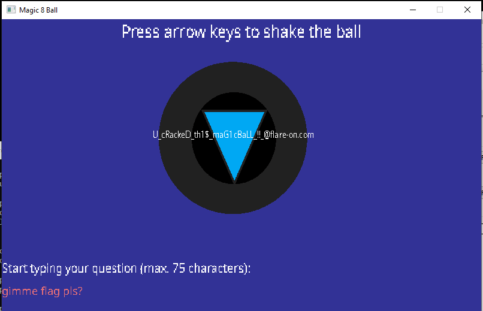

## Flare-On 2022 - #3 Magic 8 Ball
___

### Description: 

*You got a question? Ask the 8 ball!*

`7-zip password: flare`

___

### Solution:

This is a magic 8 ball challenge:


The goal is to make the ball give us the flag. Function `u_select_answer` at `0xE512B0`
contains the possible ball answers:
```c
_DWORD *__thiscall u_select_answer(_DWORD *this) {
  _DWORD *result; // eax

  this[1] = 0;
  result = this;
  this[2] = 0;
  this[3] = "\t\tIt is\n\tcertain";
  this[4] = "\t\tIt is\n\tdecidedly\n\t\t\tso";
  this[5] = "Without a\n\t\tdoubt";
  this[6] = "\t\tYes\n\tdefinitely";
  this[7] = "\tYou may\n\trely on\n\t\t\tit";
  this[8] = "\tAs I see\n\t\tit, yes";
  this[9] = "Most likely";
  this[10] = "\tOutlook\n\t\tgood";
  this[11] = "\n\t\t\tYes";
  this[12] = "Signs point\n\t\tto yes";
  this[13] = "Reply hazy,\n\ttry again";
  this[14] = "Ask again\n\t\tlater";
  this[15] = "Better not\n\ttell you\n\t\tnow";
  this[16] = "\tCannot\t\n\tpredict\n\t\tnow";
  this[17] = "Concentrate\n\tand ask\n\t\tagain";
  this[18] = "Don't count\n\t\ton it";
  this[19] = "My reply is\n\t\t\tno";
  this[20] = "My sources\n\t\t\tsay\n\t\t\tno";
  this[21] = "Outlook not\n\tso good";
  this[22] = "\t\tVery\n\tdoubtful";
  
  /* ... *
}
```

Nothing really exciting here. The important function is `u_shake_ball` at `0xE524E0`:
```c
void __thiscall u_shake_ball(int this) {
  /* ... */
  if ( *(_BYTE *)(this + 345) ) {
    v13 = v5[5];
    v14 = v5;
    if ( v13 >= 0x10 )
      v14 = (_BYTE *)*v5;
    if ( *v14 == 'L' ) {
      v15 = v5;
      if ( v13 >= 0x10 )
        v15 = (_DWORD *)*v5;
      if ( *((_BYTE *)v15 + 1) == 'L' ) {
        v16 = v5;
        if ( v13 >= 0x10 )
          v16 = (_DWORD *)*v5;
        if ( *((_BYTE *)v16 + 2) == 'U' ) {
          v17 = v5;
          if ( v13 >= 0x10 )
            v17 = (_DWORD *)*v5;
          if ( *((_BYTE *)v17 + 3) == 'R' ) {
            v18 = v5;
            if ( v13 >= 0x10 )
              v18 = (_DWORD *)*v5;
            if ( *((_BYTE *)v18 + 4) == 'U' ) {
              v19 = v5;
              if ( v13 >= 0x10 )
                v19 = (_DWORD *)*v5;
              if ( *((_BYTE *)v19 + 5) == 'L' ) {
                v20 = v5;
                if ( v13 >= 0x10 )
                  v20 = (_DWORD *)*v5;
                if ( *((_BYTE *)v20 + 6) == 'D' ) {
                  v21 = v5;
                  if ( v13 >= 0x10 )
                    v21 = (_DWORD *)*v5;
                  if ( *((_BYTE *)v21 + 7) == 'U' ) {
                    v22 = v5;
                    if ( v13 >= 0x10 )
                      v22 = (_DWORD *)*v5;
                    if ( *((_BYTE *)v22 + 8) == 'L' ) {
                      v23 = (const char *)(this + 248);
                      if ( *(_DWORD *)(this + 268) >= 0x10u )
                        v23 = *(const char **)v23;
                      if ( !strncmp(v23, (const char *)(this + 92), 0xFu) )
                      {
                        sub_E51220(v24, v5);
                        u_do_decrypt((void **)this, v24[0], (int)v24[1], (int)v24[2], (int)v24[3], (int)v25, v26);
                      }
                    }
                  }
                }
              }
            }
          }
        }
      }
    }
  }
}
```

If we shake the ball correctly and we type the correct question, then `u_do_decrypt` 
at `0xE51A10` is called. The shake combination (`L`, `R`, `U`, `D`) is passed to the function
to do the decryption:
```c
void __thiscall u_do_decrypt(void **this, _DWORD *Block, int a3, int a4, int a5, int a6, unsigned int a7) {
  /* ... */
  Src[0] = 0;
  v45 = 0;
  *(_DWORD *)cipher = 0x33122A35;
  *(_DWORD *)&cipher[4] = 0xB2645787;
  *(_DWORD *)&cipher[8] = 0x34A6EF00;
  *(_DWORD *)&cipher[12] = 0x3EDEE001;
  *(_DWORD *)&cipher[16] = 0x40EC2101;
  *(_DWORD *)&cipher[20] = 0xB0691D26;
  *(_DWORD *)&cipher[24] = 0x7BB269B0;
  *(_DWORD *)&cipher[28] = 0x6EB2256;
  *(_DWORD *)&cipher[32] = 0xCB5DF2BE;
  *(_DWORD *)&cipher[36] = 0x512B0F79;
  v37 = 85;
  v42 = 0;
  v43 = 15;
  sub_E518F0(Src, &unk_E5426C, 0);
  LOBYTE(v45) = 1;
  for ( i = 0; i < 256; ++i )
    v44[i] = i;
  v8 = a6;
  v9 = 0;
  for ( j = 0; j < 256; ++j )
  {
    if ( v8 <= j % v8 )
      u_invalid_string_position_exc();
    p_Block = &Block;
    v12 = v44[j];
    if ( a7 >= 0x10 )
      p_Block = (_DWORD **)Block;
    v9 = (v12 + *((char *)p_Block + j % v8) + v9) % 256;
    v44[j] = v44[v9];
    v44[v9] = v12;
  }
  v13 = v43;
  v14 = 0;
  v15 = v42;
  v16 = 0;
  v17 = Src[0];
  for ( k = 0; k < 41; ++k )
  {
    v34 = (v16 + 1) % 256;
    v18 = v44[v34];
    v38 = (void *)v18;
    v32 = (v18 + v14) % 256;
    v44[v34] = v44[v32];
    v44[v32] = v18;
    v19 = cipher[k] ^ v44[(unsigned __int8)((_BYTE)v38 + v44[v34])];
    v40 = v19;
    /* ... */
  }
}
```

So, first we have to do the secret shake combination: `LLURULDUL`.

Then we have to type the right question: `gimme flag pls?` (we just set a breakpoint at `strcmp` and
get the value from the parameter). After we do that, magic 8 ball gives us the flag:



The flag is: `U_cRackeD_th1$_maG1cBaLL_!!_@flare-on.com`
___
