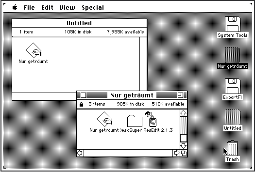

## Flare-On 2022 - #10 Nur geträumt
___

### Description: 

*This challenge is a Macintosh disk image (Disk Copy 4.2 format, for those who need to know) containing a 68K Macintosh program. You must determine the passphrase used to decode the flag contained within the application. Super ResEdit, an augmented version of Apple's ResEdit resource editor which adds a disassembler, is also included on the disk image to help you complete the challenge, though you will likely also need to do some outside research to guess the passphrase. This application can be run on any Macintosh emulator (or any real Macintosh from as far back as a Mac Plus running System 6.0.x up to a G5 running Classic). The setup of the emulation environment is part of the challenge, so few spoilers live here, but if you want to save yourself some headaches, Mini vMac is a pretty good choice that doesn't take much effort to get up and running compared to some other options. This application was written on a Power Macintosh 7300 using CodeWarrior Pro 5, ResEdit, and Resourcerer (my old setup from roughly 1997, still alive!). It was tested on a great many machines and emulators, and validated to run well on Mac OS from 6.0.8 through 10.4.*

*Happy solving! Be curious!*

`7-zip password: flare`
___

### Solution:

The first part of this challenge is to actually get the code to work. After a lot of effort,
I finally managed to run the code. We first download
[Mini vMac](https://www.gryphel.com/c/minivmac/). To run this code, we also need a vrom, so
we also download the
[vmac.vrom](https://sites.google.com/site/minivmacapplicationsv6/disk-images-and-roms) file.
We also need an OS, so we download
[System608](https://sites.google.com/site/minivmacapplicationsv6/systems-os).
Then we rename `vmac.vrom` to `vMac.ROM` and we make sure it resides in the same directory as
`Mini vMac` binary. Then we unzip *System608.zip* and we drag n' drop `System Tools.dsk` to the
emulator. If everything goes well, we should see a minimal GUI in the emulator:


Then we drag n' drop `Nur geträumt.img` to the emulator as well:


We double click at the `Nur geträumt` and we are presented with a password screen:


As we type characters we see that flag value changes:


However, the first **3** characters remain the same, which means that we have some form of
byte-to-byte encryption.

#### Understanding the Binary

Let's now use `RedEdit 2.1.3` to understand what the binary does: 


We select the binary and we open it:


Let's first look at the **CODE**:


After a quick inspection in the code, we find a function called `decodeFlag:`


Which is called from `main`:


Now let's look at the **DATA**:


Finally let's look at the **FLÅG** (notice the difference in `A`) section:


Which is probably the encrypted flag.

#### Extracting the Program to IDA

Reversing the code from `ResEdit` is painful, so I decided to extract the code into
my machine and then loaded it on IDA. To do that we first download
[Blanks](https://www.gryphel.com/c/minivmac/extras/blanks/index.html) that contains empty disk
spaces of various sizes. We unzip it and we select a disk that is large enough
(let's say `008M.zip`). We unzip it, and we get the `008M.dsk` file, which drag n' drop it to the
emulator. We see a new disk with the name "Untitled". We open it, and we drag n' drop the 
`Nur geträumt` binary:




Then we use another script, called
[ExportFl](https://www.gryphel.com/c/minivmac/extras/exportfl/index.html), that exports files
from a disk to the local machine. We select the file and we click `Open`:


If export is successfull, we will see the following message:


Then a directory called `out` is created that contains the export file. However this file is
empty, so we need a workaround. The problem is probably that the file is binary, so I tried to
extract the `README.txt` (from `ExportFl` disk) and it worked. The I tried to copy text and use the
[ClipOut](https://www.gryphel.com/c/minivmac/extras/clipout/index.html) program to export them
the clipboard of the host machine it did not work either, so I tried a simpler approach: I removed everything from `README.txt` and I slowly start copying chunks (up to 512 characters) from the
hexeditor the `README.txt`:


Then I quit `ResEdit` and pasted the code into `README.txt`:


I did this **8**-**9** times to copy all the code and then the `DATA` and `FLÅG` sections.
Finally I used `ExportFl` to get the `README.txt` to local machine:
```
this is a test from ispo!

000000019DCE598F2F3C434F44454267A9A02017670000F2204020502E182C10A9A37000204D91C6600210C0B1CD6DFA41ED002843F57800600210C0B1C96DFA598F2F3C444154414267A9A020572008670000B62F0D2050486800044EBA00B0508F43FAFF9C2B49FB6E224D4EBA0218226DFB6E4EBA0210A9A34EBA0296422DFB73303CA89FA7462F08303CA198A346B1DF670A1B7C0001FB737001A198303CA9F0A7462B48FB6A303CA9F1A7462B48FB66303CA9F4A7462B48FB62303CA9F041FA0268A647303CA9F141FA0324A647303CA9F441FA002EA6474EB9000004884EB9000004D2487A00224A2DFFF76702426742674EB90000071C5C8F42A74EB9FFFFFFF84EBA0384A9F40000000048E71C30594F266F001C7800600000E41E9B1F5B00011F5B00021F5B0003246F0020D5D7161B4883300302400080670E0243007F14DB53434A436CF860E6300302400040670E30030240003F524048C0D5C060D0300302400020670A0243001F52431A1B600E30030240001067100243000F7AFF14C553434A436CF860A630030C4000046264D040303B00064EFB00020060000A001C002C0042588A14FCFFFF14FCFFFF14DB14DB6000FF7A588A14FCFFFF14DB14DB14DB6000FF6A14FCFFA914FCFFF0548A14DB14DB528A14DB6000FF5414FCFFA914FCFFF0528A14DB14DB14DB528A14DB6000FF3C3F3C000FA9C952440C4400036D00FF18204B584F4CDF0C384E752F05594F226F000C1E991F5900011F5900021F5900032A177400604C1219100102400080670CD2011001488048C0D48060281E811F590001100102400040670C3017E548E24048C0D480600E1F5900021F5900032417E58AE282206F0010202F0014D1B0280053854A856EB02049584F2A1F4E752F0A24492F0D2F0A2F084EBAFF802F2DFB6E2F0A2F084EBAFF742F0A2F0A2F084EBAFF6A4FEF0024245F4E752F0A24492F0D44972F0A2F084EBAFF522F2DFB6E44972F0A2F084EBAFF442F0A44972F0A2F084EBAFF384FEF0024245F4E75BBFA002866024E7548E700842A7A001C206DFB6A4A6F000C6604206DFB662F48000A4CDF2100544F4E750000000041FAFFFA208D4E7543F900000028C0FC0010238808F04E753F3C00014EBAFFB4544F48E7E0E055AF0018246F0018202DFB74670A20403F2A00064E90548F50F80A5E598F2F3C434F44453F2A0006A9A020176616202DFB806604700FA9C920403F2A00064E90548F60DA4A380BB267042040A0642057A029205F20502008A05520402F08302A00064EBAFF7E2248D1E800084EBAFEE0205F224DD3E80004302800022208600C337C4EF90000D3A90002508951C8FFF24A2DFB7367047001A198202DFB78670A20403F2A00064E90548F4CDF07074A38012D6702A9FF4E753F3C00004EBAFEEE544F2F0A246F00080C6A4EF90000667A0C6A000200066D7291C8302A00064EBAFF02598F2F3C434F44453F2A0006A9A020176604588F6052204020502248D1E800084EBAFE7620572050224DD3E80004302800022208600C337CA9F0000093A90002508951C8FFF22057A02A205FA0494A2DFB7367047001A198202DFB7C670A20403F2A00064E90548F245F2E9F4E754E752A780904303CA9F4206DFB62A647303CA9F0206DFB6AA647303CA9F1206DFB66A6474E752F0A60142B52FB843F3CFFFF2F2A0008206A00044E905C4F246DFB84200A66E4245F4E754E75206F0004302F000A342F0008671E534212184842343C0007E309D14064040A40102151CAFFF4484251CAFFE64E759263726331365F63636974745F7570646174650000004E56FFFE2F03363CFFFF426EFFFE3F033F2E000C2F2E00084EBAFFA236003F033F3C0002486EFFFE4EBAFF92360030034FEF0010261F4E5E4E758B63726331365F636369747400004E5600002F0A2F03246E00087600161A3F032F0A4EBAFFA25C4F261F245F4E5E4E759063726331365F63636974745F707374720000004E56FFF22F2E000C3F2E0010486EFFFE486EFFF2486EFFF6A98D41EEFFF2226E000822D822D822D832D84E5E4E758D6765744469616C6F674974656D00004E56000048E71C38266E0008246E000C286E0010760078011893603670001012B840630C4A1267047A0160027A003805300452447200320070001032180072003203740014331800B14270003003198208007000101332035243B24065BE2F0C4EBAFF2A584F4CDF1C384E5E4E758A6465636F6465466C61670000004E56FFFC2F2E00083F2E000C42A7486EFFFC42A7A98D2F2EFFFC3F3C000AA95D306E000E93C9A03B22802F2EFFFC4267A95D4E5E4E758D68696C697465436F6E74726F6C00004E56000048E71030266E0008246E0010760130135740670655406702604C202B00020280000000FF5780670E51805580670851805D806718602C34BC00013F3C00083F122F2E000C4EBAFF70504F601C34BC00023F3C00083F122F2E000C4EBAFF5A504F600676006002760010034CDF0C084E5E4E758C68616E646C654576656E74730000004E56FDAA48E71F3878007C014EBA01AE28482D4CFDC83F3C00032F0C486EFDB84EBAFE5841EEFDDC43EEFDB820D920D920D930D93F3C00082F0C486EFDAA4EBAFE3A41EEFDCE43EEFDAA20D920D920D930D92F3C464C81473F3C0080A81F205F2648486DFF684EBAFDDC3D40FDC6200B4FEF00146614486DFF72486DFF91486DFF91486DFF91A98B7801594F2F0BA9A5201F578020531210488148C1B2806718486DFF92486DFF91486DFF91486DFF91A98B7801600000DE204BA0292453700010123E320001600000CC554F3F3CFFFF486EFFF04878003C42A7A860101F720012003D41FDCC554F486EFFF0A97F101F670000A2760141EDFE6843EEFEEE703F22D851C8FFFC486EFFEE2F2EFEEA486EFFF04EBAFE6616004FEF000C6614554F486EFFF0486EFEEA486EFFEEA980101F16004A03675E302EFFEE534067065340674E60502F2EFDDC486EFDEAA990486EFEEE486EFDEA2F0A4EBAFD5E3A002F2EFDCE486EFEEEA98FBA474FEF000C6624486DFFBE486DFFD2486DFF91486DFF91A98B554F3F3C008242A7A987301F600478017C004A046700FF324A06670C554F3F3C008142A7A986301F70004CDF1CF84E5E4E75846D61696E0000004E56FFEE2F0A700141EEFFF0A0903D40FFEE486DFC52A86EA8FEA912A930A9CC42A7A97BA85041EDFBD420B8020C594F3F3C008042A74878FFFFA97C205F24482F0AA873204A245F4E5E4E758A496E697469616C697A65000000

Flag Resource:
2D0C001D1A7F171C4E0211280810480500001A7F2AF61744320FFC1A602C08101C6002194117115A0E1D0E390A042718

DATA:
000000CDFFFFFE688404666C61677F7F7F7AA1093132333435363738391D54686520666C6167207265736F75726365206973206D69207383696E672E41932A54686520666C6167207265736F7572636520612070C86561727320746F206265206D616C666F726D65642E0013596F7520666F756E642074686520666C6167212452656D6F76652074686520756D6C617574206265666F7265207375626D69207484696E672E0003000C0200000000280000000028458109324E809C4E800C570000000000000000019400000000000000024080410E00000003406E838A00000000
```

From here it is easy to export all these into binary using the
[application_gen.py](./application_gen.py) script.


#### Understanding the Cipher

We open [Application.code](./Application.code) into IDA (we set processor architecture to
**Motorola MC68000**). We start from the important parts of `main`:
```assembly
CODE:0860                     DECODE_FLAG:                            ; CODE XREF: main+13C↑j
CODE:0860 2F2E FDDC                   move.l  var_224(a6),-(sp)
CODE:0864 486E FDEA                   pea     password(a6)
CODE:0868 A990                        _GetDialogItemText              ; void GetDialogItemText(Handle item, Str255 text)
CODE:086A 486E FEEE                   pea     out_flag(a6)            ; push
CODE:086E 486E FDEA                   pea     password(a6)            ; push
CODE:0872 2F0A                        move.l  a2,-(sp)
CODE:0874 4EBA FD5E                   jsr     decodeFlag              ; decodeFlag(?, ?, out_flag)
CODE:0878 3A00                        move.w  d0,d5
CODE:087A 2F2E FDCE                   move.l  var_232(a6),-(sp)
CODE:087E 486E FEEE                   pea     out_flag(a6)
CODE:0882 A98F                        _SetDialogItemText              ; void SetDialogItemText(Handle item, ConstStr255Param text);
CODE:0884 BA47                        cmp.w   d7,d5
CODE:0886 4FEF 000C                   lea     $C(sp),sp
CODE:088A 6624                        bne.s   loc_8B0
CODE:088C 486D FFBE                   pea     -$42(a5)                ; *
CODE:0890 486D FFD2                   pea     -$2E(a5)                ; .
CODE:0894 486D FF91                   pea     -$6F(a5)                ; o
CODE:0898 486D FF91                   pea     -$6F(a5)                ; o
CODE:089C A98B                        _ParamText
CODE:089E 554F                        subq.w  #2,sp
CODE:08A0 3F3C 0082                   move.w  #$82,-(sp)
CODE:08A4 42A7                        clr.l   -(sp)
CODE:08A6 A987                        _NoteAlert
CODE:08A8 301F                        move.w  (sp)+,d0
CODE:08AA 6004                        bra.s   loc_8B0
```

And then we move on the `decodeFlag`:
```assembly
CODE:05D4                     ; Attributes: bp-based frame
CODE:05D4
CODE:05D4                     decodeFlag:                             ; CODE XREF: main+158↓p
CODE:05D4
CODE:05D4                     arg_2   =  8
CODE:05D4                     arg_6   =  $C
CODE:05D4                     arg_A   =  $10
CODE:05D4
CODE:05D4 4E56 0000                   link    a6,#0                   ; set stack frame
CODE:05D8 48E7 1C38                   movem.l d3-d5/a2-a4,-(sp)       ; save d3, d4, d5, a2, a3, a4 to stack
CODE:05DC 266E 0008                   movea.l arg_2(a6),a3            ; a3 = arg1 (password)
CODE:05E0 246E 000C                   movea.l arg_6(a6),a2            ; a2 = arg2
CODE:05E4 286E 0010                   movea.l arg_A(a6),a4            ; a4 = arg3
CODE:05E8 7600                        moveq   #0,d3                   ; d3 = 0 = i
CODE:05EA 7801                        moveq   #1,d4                   ; d4 = 1 = j
CODE:05EC 1893                        move.b  (a3),(a4)               ; a4 = a3 (arg3 out = arg1 in)
CODE:05EE 6036                        bra.s   LOOP_END
CODE:05F0                     ; ---------------------------------------------------------------------------
CODE:05F0
CODE:05F0                     MAIN_LOOP:                              ; CODE XREF: decodeFlag+5C↓j
CODE:05F0 7000                        moveq   #0,d0                   ; d0 = 0
CODE:05F2 1012                        move.b  (a2),d0                 ; d0 = arg2 (1 byte)
CODE:05F4 B840                        cmp.w   d0,d4                   ; if j < arg2 then goto BRANCH_A
CODE:05F6 630C                        bls.s   BRANCH_A
CODE:05F8 4A12                        tst.b   (a2)                    ; *arg2 == 0 ?
CODE:05FA 6704                        beq.s   ZERO                    ; d5 = 0
CODE:05FC 7A01                        moveq   #1,d5                   ; d5 = 1
CODE:05FE 6002                        bra.s   NON_ZERO                ; d4 = d5 (0 or 1)
CODE:0600                     ; ---------------------------------------------------------------------------
CODE:0600
CODE:0600                     ZERO:                                   ; CODE XREF: decodeFlag+26↑j
CODE:0600 7A00                        moveq   #0,d5                   ; d5 = 0
CODE:0602
CODE:0602                     NON_ZERO:                               ; CODE XREF: decodeFlag+2A↑j
CODE:0602 3805                        move.w  d5,d4                   ; d4 = d5 (0 or 1)
CODE:0604
CODE:0604                     BRANCH_A:                               ; CODE XREF: decodeFlag+22↑j
CODE:0604 3004                        move.w  d4,d0
CODE:0606 5244                        addq.w  #1,d4                   ; ++j
CODE:0608 7200                        moveq   #0,d1
CODE:060A 3200                        move.w  d0,d1                   ; d1 = d0
CODE:060C 7000                        moveq   #0,d0
CODE:060E 1032 1800                   move.b  (a2,d1.l),d0            ; d0 = arg2[?]
CODE:0612 7200                        moveq   #0,d1                   ; d1 = 0
CODE:0614 3203                        move.w  d3,d1
CODE:0616 7400                        moveq   #0,d2                   ; d2 = 0
CODE:0618 1433 1800                   move.b  (a3,d1.l),d2            ; d2 = password[?]
CODE:061C B142                        eor.w   d0,d2                   ; d2 ^= d0
CODE:061E 7000                        moveq   #0,d0
CODE:0620 3003                        move.w  d3,d0                   ; d0 = d3
CODE:0622 1982 0800                   move.b  d2,(a4,d0.l)            ; arg3[?] = d2
CODE:0626
CODE:0626                     LOOP_END:                               ; CODE XREF: decodeFlag+1A↑j
CODE:0626 7000                        moveq   #0,d0
CODE:0628 1013                        move.b  (a3),d0                 ; d0 = password
CODE:062A 3203                        move.w  d3,d1
CODE:062C 5243                        addq.w  #1,d3                   ; ++i
CODE:062E B240                        cmp.w   d0,d1
CODE:0630 65BE                        bcs.s   MAIN_LOOP               ; d0 = 0
CODE:0632 2F0C                        move.l  a4,-(sp)
CODE:0634 4EBA FF2A                   jsr     crc16_ccitt_pstr        ; return crc16(arg3)
CODE:0638 584F                        addq.w  #4,sp
CODE:063A 4CDF 1C38                   movem.l (sp)+,d3-d5/a2-a4
CODE:063E 4E5E                        unlk    a6                      ; restore stack frame
CODE:0640 4E75                        rts                             ; return
CODE:0640                     ; End of function decodeFlag
```

The code is easy to understand: Program reads the `password` and uses it as a repeated XOR key
to decrypt the flag which is `0x2D` bytes long:
```assembly
FLAG:00000A13 002D                        dc.b $2D ; -                    ; size
FLAG:00000A14 0C00 1D1A 7F17 1C4E+        dc.b $C, 0, $1D, $1A, $7F, $17, $1C, $4E, 2, $11, $28, 8, $10
FLAG:00000A14 0211 2808 1048 0500+        dc.b $48, 5
FLAG:00000A14 001A 7F2A F617 4432+        dcb.b 2,0
FLAG:00000A14 0FFC 1A60 2C08 101C+        dc.b $1A, $7F, $2A, $F6, $17, $44, $32, $F, $FC, $1A, $60, $2C
FLAG:00000A14 6002 1941 1711 5A0E+        dc.b 8, $10, $1C, $60, 2, $19, $41, $17, $11, $5A, $E, $1D, $E
FLAG:00000A14 1D0E 390A 0427 0018         dc.b $39, $A, 4, $27, $18
```

That is, we actually have a [Vigenère cipher](https://en.wikipedia.org/wiki/Vigen%C3%A8re_cipher).


#### Breaking the Cipher

To break the cipher we need to know a part of the plaintext. Here, we know that the flag ends
with `@flare-on.com`. We XOR the last bytes with the ciphertext and we get a partial key:
` du etwas Zei`. Then, we use this key and we try to decrypt other parts of the ciphertext
(hopefully the key is repeated). We actually find that this key decrypts ciphertext at index
**4**: `_singe_ich_ei`.

So far, the flag is: `****_singe_ich_ei***************@flare-on.com` (`*` are characters that
we do not know). Now it is a game of guessing: I googled for `"singe ich ei" "du etwas Zei"`
and I found that these are the lyrics of the
[99 Luftballons](https://genius.com/Nena-99-luftballons-lyrics):
```
Hast du etwas Zeit für mich
Dann singe ich ein Lied für dich
Von neunundneunzig Luftballons, auf ihrem Weg zum Horizont
Denkst du vielleicht grad an mich
Dann singe ich ein Lied für dich
Von neunundneunzig Luftballons
Und, dass so was von so was kommt
Neunundneunzig Luftballons
Auf ihrem Weg zum Horizont
Hielt man für UFOs aus dem All
Darum schickte ein General
'Ne Fliegerstaffel hinterher
Alarm zu geben, wenn's so wär
Dabei war'n dort am Horizont nur neunundneunzig Luftballons
Neunundneunzig Düsenflieger
Jeder war ein grosser Krieger
Hielten sich für Captain Kirk
Das gab ein grosses Feuerwerk
Die Nachbarn haben nichts gerafft
Und fühlten sich gleich angemacht
Dabei schoss man am Horizont auf neunundneunzig Luftballons
```

The key is part of the first lyric `Hast du etwas Zeit für mich` and the flag is part of the
second lyric `Dann singe ich ein Lied für dich`. Let's try the first part as a key
(we use normal `u`):
```python
key = [ord(k) for k in 'Hast du etwas Zeit fur mich']
plain = [a ^ b for a, b in zip(ciphertext, key*2)]
''.join(chr(k) for k in plain)
# 'Dann_singe_ich_ein_L\x83ed_f\x9fr(M{d<\x04w9$cf;}=T\\cp'
```

We got the first part successfully, but the last part is incorrect. This is probably because the
key is longer, so it does not get repeated at the correct place. Let's now use the plaintext to
find the missing parts of the key:
```python 
known_plain = [ord(p) for p in 'Dann_singe_ich_ein_Lied_fur_dich']
key = [a ^ b for a, b in zip(ciphertext, known_plain)]
print('~~~~>', repr(''.join(chr(k) for k in key)))
# Hast du etwas Zeit f\x9fr mi\x89h?Hast
```

We see that the key gets repeated (`Hast`), so we can conclude that the correct key is:
`Hast du etwas Zeit f\x9fr mi\x89h?` (with the German letters), so we use it to get the flag.
For more details, you can refer to the [nur_getraumt_crack.py](./nur_getraumt_crack.py) script.


The flag is: `Dann_singe_ich_ein_Lied_fur_dich@flare-on.com`
___
