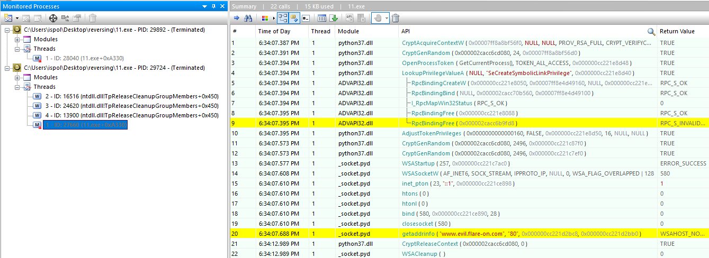
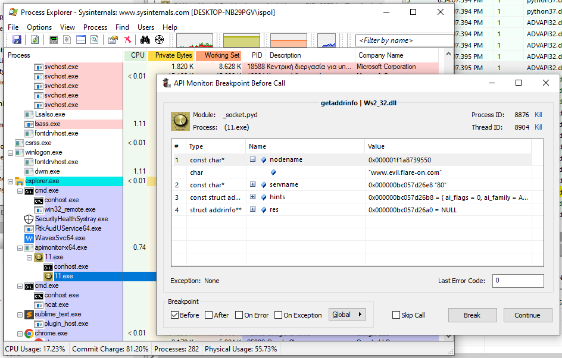
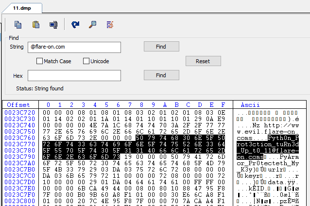

## Flare-On 2022 - #11 The challenge that shall not be named.
___

### Description: 

*Protection, Obfuscation, Restrictions... Oh my!!*

*The good part about this one is that if you fail to solve it I don't need to ship you a prize.*

`7-zip password: flare`
___

### Solution:

In the last challenge we are given a large (`8.8MB`) binary (*11.exe*).
We start by looking at `main` at `0x7FF6E8EB2740` (address can vary it's PIE):
```c
int __fastcall u_actual_main(unsigned int argc, const char **argv) {
  /* ... */
  stderr = _acrt_iob_func(2u);
  setbuf(stderr, 0i64);
  myobj = my_struct_ctor();
  if ( !myobj
    || !u_GetModuleFileNameA(filename)
    || !u_make_pkg_extension(pkg_filename, filename)
    || !u_get_current_dir(curr_dir, filename) )
  {
    return -1;
  }
  v6 = 0;
  meipass2 = u_getenv_n_expand("_MEIPASS2");
  v8 = meipass2 != 0i64;
  if ( meipass2 )
  {
    envval = u_getenv_n_expand("_PYI_ONEDIR_MODE");
    if ( envval )
    {
      envint = (unsigned __int8)*envval - '1';
      if ( *envval == '1' )
        envint = (unsigned __int8)envval[1];
      free(envval);
      u_setenv_to_zero("_PYI_ONEDIR_MODE");
      if ( envint )
        v6 = meipass2 != 0i64;
      LODWORD(v8) = v6;
    }
  }
  u_setenv_to_zero("_MEIPASS2");
  if ( u_init_table_of_contents(myobj, filename, filename) )
    goto TOC_LOAD_OK;
  if ( !u_init_table_of_contents(myobj, pkg_filename, filename) )
  {
    u_log_to_stderr(
      "Cannot open PyInstaller archive from executable (%s) or external archive (%s)\n",
      filename,
      pkg_filename);
    return -1;
  }
  if ( meipass2 )
  {
TOC_LOAD_OK:
    myobj->argc = argc;
    myobj->argv = argv;
    if ( meipass2 )
      goto MEI_VAL_SET;
  }
  else
  {
    v12 = u_wfopen(filename, "rb");
    if ( !v12 )
    {
      v13 = -1;
LABEL_21:
      u_log_to_stderr("Cannot side-load external archive %s (code %d)!\n", pkg_filename, v13);
      return -1;
    }
    Buf2 = 0xE0B0A0B0D49454Di64;
    if ( !u_search_in_file(v12, &Buf2, 8ui64) )
    {
      fclose(v12);
      v13 = 1;
      goto LABEL_21;
    }
    myobj->argc = argc;
    myobj->argv = argv;
  }
  /* ... */
  else
  {
    if ( (unsigned int)sub_7FF6E8EB2310(myobj, otherobj_) )
      return -1;
    v18 = curr_dir;
    if ( myobj->field_3078[0] )
      v18 = myobj->field_3078;
    u_setenv_to_value("_MEIPASS2", v18);
    u_getenv_n_expand("_MEIPASS2");
    if ( (unsigned int)UserMathErrorFunction(myobj) == -1 )
      return -1;
    retv = u_create_process(filename);
    sub_7FF6E8EB49D0((my_struct *)otherobj_);
    u_free_bufs((struc_2 *)&otherobj_);
    if ( myobj->counter == 1 )
      sub_7FF6E8EB5D50(myobj->field_3078);
    u_teardown_my_obj(myobj);
    return retv;
  }
}  
```

It als worth mentioning the `u_create_process` (at the end) that forks itself:
```c
int __fastcall u_create_process(const CHAR *a1) {
  /* ... */
  ExitCode = 0;
  u_ansi_to_unicode(ApplicationName, a1, 4096);
  signal(22, (_crt_signal_t)1);
  signal(2, (_crt_signal_t)1);
  signal(15, (_crt_signal_t)1);
  signal(21, (_crt_signal_t)1);
  ProcessAttributes.nLength = 24;
  ProcessAttributes.lpSecurityDescriptor = 0i64;
  ProcessAttributes.bInheritHandle = 1;
  GetStartupInfoW(&StartupInfo);
  memset(&StartupInfo.lpReserved, 0, 24);
  StartupInfo.dwFlags = 257;
  StartupInfo.wShowWindow = 1;
  v1 = _acrt_iob_func(0);
  v2 = fileno(v1);
  StartupInfo.hStdInput = (HANDLE)get_osfhandle(v2);
  v3 = _acrt_iob_func(1u);
  v4 = fileno(v3);
  StartupInfo.hStdOutput = (HANDLE)get_osfhandle(v4);
  v5 = _acrt_iob_func(2u);
  v6 = fileno(v5);
  StartupInfo.hStdError = (HANDLE)get_osfhandle(v6);
  CommandLineW = GetCommandLineW();
  if ( CreateProcessW(
         ApplicationName,
         CommandLineW,
         &ProcessAttributes,
         0i64,
         1,
         0,
         0i64,
         0i64,
         &StartupInfo,
         &ProcessInformation) )
  {
    WaitForSingleObject(ProcessInformation.hProcess, 0xFFFFFFFF);
    GetExitCodeProcess(ProcessInformation.hProcess, &ExitCode);
    return ExitCode;
  }
  else
  {
    u_log_as_py("CreateProcessW", "Error creating child process!\n");
    return -1;
  }
}
```

From the strings, we can tell that this is a [PyInstaller](https://pyinstaller.org/en/stable/)
executable. We use a [PyInstaller Extractor](https://github.com/extremecoders-re/pyinstxtractor)
to extract its embeeded python files. This creates a directory called `11.exe_extracted` that 
contains a bunch of `.dll` and `.pyc` files. We use an
[Online PyC decompiler](https://www.toolnb.com/tools-lang-en/pyc.html) to decompile `11.pyc`:
```python
# uncompyle6 version 3.5.0
# Python bytecode 3.7 (3394)
# Decompiled from: Python 2.7.5 (default, Nov 16 2020, 22:23:17) 
# [GCC 4.8.5 20150623 (Red Hat 4.8.5-44)]
# Embedded file name: dist\obf\11.py
from pytransform import pyarmor
pyarmor(__name__, __file__, 'PYARMOR\x00\x00\x03\x07\x00B\r\r\n\t0\xe0\x02\x01\x00\x00\x00\x01\x00\x00\x00@\x00\x00\x00a\x02\x00\x00\x0b\x00\x00x\xa7\xf5\x80\x15\x8c\x1f\x90\xbb\x16Xu\x86\x9d\xbb\xbd\x8d\x00\x00\x00\x00\x00\x00\x00\x0054$\xf1\xeb,\nY\xa9\x9b\xa5\xb3\xba\xdc\xd97\xba\x13\x0b\x89 \xd2\x14\xa7\xccH0\x9b)\xd4\x0f\xfb\xe4`\xbd\xcf\xa28\xfc\xf1\x08\x87w\x1a\xfb%+\xc1\xbe\x8b\xc0]8h\x1f\x88\xa6CB>*\xdd\xf6\xec\xf5\xe30\xf9\x856\xfa\xd9P\xc8C\xc1\xbdm\xca&\x81\xa9\xfb\x07HE\x1b\x00\x9e\x00a\x0c\xf2\xd0\x87\x0c<\xf8\xddZf\xf1,\x84\xce\r\x14*s\x11\x82\x88\x8d\xa7\x00k\xd9s\xae\xd3\xfc\x16v\x0f\xb9\xd1\xd3\xd02\xecQ\x9a\xd7aL\xdf\xc1~u\xca\x8a\xd4xk\xde\x030;\xb2Q\xc8$\xddQ\xd3Jj\xd1U\xccV\xd1\x03\xa9\xbf\x9f\xed\xe68n\xac&\xd67\x0c\xfd\xc6^\x0e\xb40\x07\x97|\xab\xadBc<T\x0b d$\x94\xf9\x90Oq\x027\xe4\xf2\xec\xc9\xbc\xfaL7dN\x83\x96X\xab\xf7\x18\xad\xfc\xf7\x992\x87\x1d\xe8p\x97C\xd4D.\x1b;F_ \x91t\tM\x155\x0c\xb9\x9f\xd0W C\x19oz4.\x998\xe7\xa9\x98\xd4\xd2\x9f\x95H\x91\xf2`\x1c\xfa\xa4,\xa9d?day\xc4\xf3\xcb\xc8r\xf7\x97\xd1u\xfe\xec\x91\xc1\xe6V\xa3j\x0f\xb9\xd5\xa1a\xd5\x17\x8b!\xc4{A\xb2t\x85\xfe\x88\xffaO\x05\xc5\xacg\xed;]\xb9\xdd\x7fS\xef\xe4F\xf9"\x0c\xd9\x1a\xb6\x88-Y \xdd\xea\xc9\xf1>:\xbf][\xdf[\x07\xb9\xe2@\xeeq\xf9Ho\xc3\xc4sD\xcd\xcc\x8a\x11tq\xf6;\xe9\x84\x7fb\xe9\xf4t\x80\xe4l)_\xeaQ\x10\x8f^-\xc5\x11\xe7\x84x\xe7-\xb2\x15[5\xb0\xdck\x1awh\r;\x9by\x14\x1a\xe0:\xbd\x904\xa2\xfap[\xe0\x9fn3\x7fk;3n\xf8\xe3%\xc6t\xbf|\x12\x9a\x1b\xe2\xf1C\x10\xbe\xee\xe7.\x98>k\xb9r\xf9\x9cN8\xae\xc0\x8bA\x0f\xbb\x8d\xf4\x04\xb0\x01,\x05\xaa\xc5\r\xce\x91\'\x98\xc6\xd3Y\x1b\xd1U\xd3\xd7d|{I\x18JG\xa63\xd6\'r\xcf!7\x17qd\xb7|\x1f\x7f\x17\xb4\xa8\xb9\xa8\xdaz\x02g\xc7+]F\x10\x18l\x0c\x91g\xd0e\x1f\xe4\xa67\xb2\xba\x9f\xef\xba\xc7[3_\x12C\xe9\xf4s\x87q\xa3\xec\xa0\xcc\x06\xf4\x9f\xe1\xb3\xe6R\x93\xf2\xd57i\xf8\x96\xb3x\xa7uEw\x12D\x8c\xc6XkdfY\xe0J2N\xbf\x85o\x8e\x81|C\xa91#y\xd9u\xf1\xd1BC\xcc}\xe8;?\x12S\x16', 2)
```

Code is protected with PyArmor. We try a
[PyArmor Deobfuscator](https://github.com/u0pattern/PyArmor-Deobfuscator) but it does not work:
```
ispo@localhost:~/flare-on-2022/11_the_challenge_that_shall_not_be_named$ PyArmorDeobfuscator.py

I don't know about Python version '3.10.7' yet.
Python versions 3.9 and greater are not supported.
I don't know about Python version '3.10.7' yet.
Python versions 3.9 and greater are not supported.
I don't know about Python version '3.10.7' yet.
Python versions 3.9 and greater are not supported.
...
```

Since we cannot decompile the code, let's try to dump the program's memory,
hoping we will find some code there. We use 
[API Monitor](http://www.rohitab.com/apimonitor)
to run the binary and hook its calls:



Program forks, and exists immediately. We can see however, that there is a call
to `getaddrinfo` that tries to resolve `www.evil.flare-in.com`. So we set a breakpoint
to `getaddrinfo` and when program freezes, we use Process Explorer to create a full memory dump:



Then we use CFF exploere to search in the memory dump for interesting things.
First we search for the flag (`@flare-on.com`) and surprisingly we get the flag!



So the flag is: `Pyth0n_Prot3ction_tuRn3d_Up_t0_11@flare-on.com`.
___
