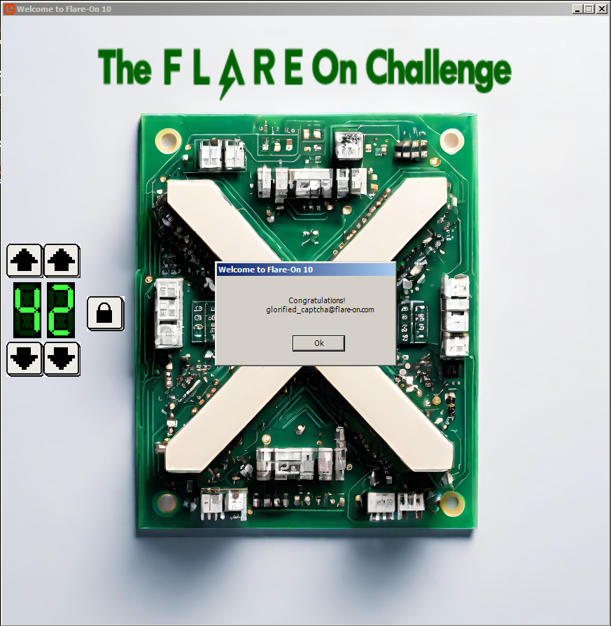

## Flare-On 2023 - #1 X
___

### Description: 

*Welcome to the 10th Annual Flare-On Challenge!*

*Statistically, you probably won’t finish every challenge.*
*Every journey toward excellence starts somewhere though, and yours starts here. Maybe it ends here too.*

*This package contains many files and, I can’t believe i’m saying this, click the one with the “.exe”*
*file extension to launch the program. Maybe focus your “reverse engineering” efforts on that one too.*

`7-zip password: flare`

___

### Solution:

We start by checking the `X.exe` and `X.dll` executables:
```
ispo@ispo-glaptop2:~/ctf/flare-on-challenges/flare-on-2023/01_X/X$ file X.dll 
X.dll: PE32 executable (GUI) Intel 80386 Mono/.Net assembly, for MS Windows, 3 sections
```

We have a .NET application, so we will use [dnSpy](https://github.com/dnSpy/dnSpy). Function
names are not stripped, so it is easy to navigate through the code. There is nothing interesting 
in `X.exe`, so we move on the `X.dll`. We focus on the `_lockButton_Click` function which is
invoked when we click the lock button:
```C#
// monogame1.Game1
// Token: 0x06000023 RID: 35 RVA: 0x000027F0 File Offset: 0x000009F0
private void _lockButton_Click(object sender, EventArgs e)
{
	Game1.<_lockButton_Click>d__14 <_lockButton_Click>d__;
	<_lockButton_Click>d__.<>t__builder = AsyncVoidMethodBuilder.Create();
	<_lockButton_Click>d__.<>4__this = this;
	<_lockButton_Click>d__.<>1__state = -1;
	<_lockButton_Click>d__.<>t__builder.Start<Game1.<_lockButton_Click>d__14>(ref <_lockButton_Click>d__);
}
```

Something doesn't seem right here. I noticed that [dnSpy](https://github.com/dnSpy/dnSpy) hasn't been
updated for **3** years, so after some searching I found out [dnSpyEx](https://github.com/dnSpyEx/dnSpy).
Loading the binary on [dnSpyEx](https://github.com/dnSpyEx/dnSpy), shows the decompiled code correctly:
```C#
// monogame1.Game1
// Token: 0x06000023 RID: 35 RVA: 0x000027F0 File Offset: 0x000009F0
private async void _lockButton_Click(object sender, EventArgs e)
{
	if (this._digitDisplays[0].Value * 10 + this._digitDisplays[1].Value == 42)
	{
		this._backgroundDisplay.State = BackgroundDisplay.BackgroundStates.Success;
		await MessageBox.Show("Welcome to Flare-On 10", "Congratulations!\n glorified_captcha@flare-on.com", new string[] { "Ok" });
	}
	else
	{
		this._backgroundDisplay.State = BackgroundDisplay.BackgroundStates.Failure;
	}
}
```

If we also set the digits to **42**, we can get the flag printed:



So the flag is: `glorified_captcha@flare-on.com`
___

