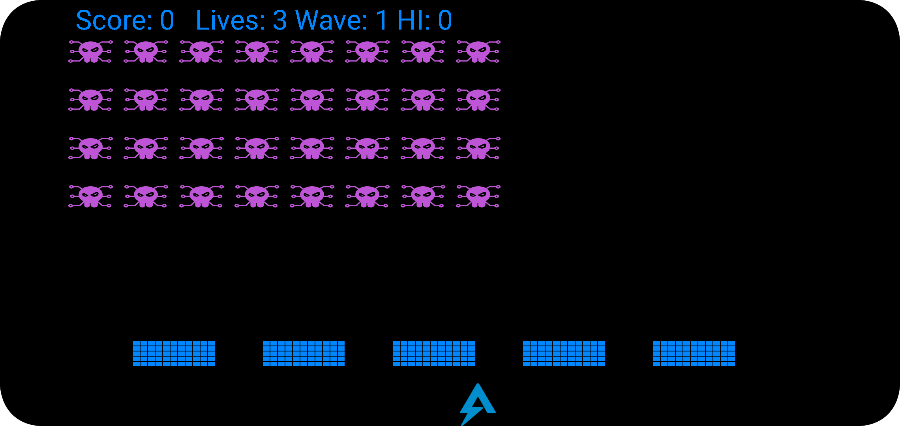
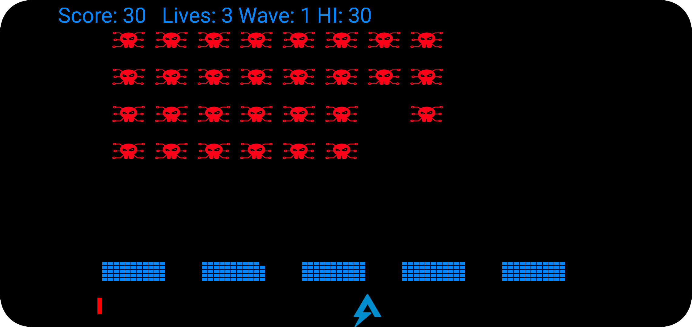

## Flare-On 2023 - #2 It's On Fire
___

### Description: 

*The FLARE team is now enthusiastic about Google products and services but we suspect there*
*is more to this Android game than meets the eye.*

`7-zip password: flare`
___

### Solution:

This is an Android challenge. We install the APK on a test device and we launch it.
It's an old school space invaders game:




We load the APK onto [JEB Pro](https://www.pnfsoftware.com/jeb/). Most of the code is for 
the game itself. However, there's a [Firebase](https://firebase.google.com/) service on
`MessageWorker` class according to `MANIFEST.xml`:
```xml
<service android:enabled="true" android:exported="true" android:name="com.secure.itsonfire.MessageWorker">
    <intent-filter>
        <action android:name="com.google.firebase.MESSAGING_EVENT"/>
        <action android:name="android.intent.action.BOOT_COMPLETED"/>
        <action android:name="android.intent.action.QUICKBOOT_POWERON"/>
        <action android:name="android.intent.action.ACTION_BOOT_COMPLETED"/>
        <action android:name="android.intent.action2.RESTART"/>
        <action android:name="android.intent.action.REBOOT"/>
    </intent-filter>
</service>
```

```java
package com.secure.itsonfire;
/* ... */

public final class MessageWorker extends FirebaseMessagingService {
    /* ... */
    @Override  // com.google.firebase.messaging.FirebaseMessagingService
    public void onMessageReceived(@NotNull RemoteMessage remoteMessage0) {
        Intrinsics.checkNotNullParameter(remoteMessage0, "remoteMessage");
        super.onMessageReceived(remoteMessage0);
        Object object0 = this.getSystemService("activity");
        if(object0 != null) {
            List list0 = ((ActivityManager)object0).getRunningTasks(100);
            Intrinsics.checkNotNullExpressionValue(list0, "runningTasks");
            if((list0.isEmpty() ^ 1) != 0) {
                int v = list0.size();
                for(int v1 = 0; v1 < v; ++v1) {
                    ActivityManager.RunningTaskInfo activityManager$RunningTaskInfo0 = (ActivityManager.RunningTaskInfo)list0.get(v1);
                    ComponentName componentName0 = activityManager$RunningTaskInfo0.topActivity;
                    Intrinsics.checkNotNull(componentName0);
                    if(Intrinsics.areEqual(componentName0.getPackageName(), "com.secure.itsonfire")) {
                        ((ActivityManager)object0).moveTaskToFront(activityManager$RunningTaskInfo0.taskId, 0);
                    }
                }
            }

            String s = (String)remoteMessage0.getData().get("my_custom_key");
            if(s != null) {
                NotificationManager notificationManager0 = (NotificationManager)this.getSystemService("notification");
                NotificationChannel notificationChannel0 = new NotificationChannel("one-channel", "My Channel One", 4);
                notificationChannel0.setDescription("Notification Channel");
                Intrinsics.checkNotNull(notificationManager0);
                notificationManager0.createNotificationChannel(notificationChannel0);
                Builder notificationCompat$Builder0 = new Builder(this, "one-channel");
                notificationCompat$Builder0.setSmallIcon(0x108005B);
                notificationCompat$Builder0.setContentTitle("Notification!");
                notificationCompat$Builder0.setWhen(System.currentTimeMillis());
                notificationCompat$Builder0.setContentText("Best Day of the Week?");
                notificationCompat$Builder0.setAutoCancel(true);
                notificationCompat$Builder0.setFullScreenIntent(c.a.a(this, s), true);
                this.startForeground(2102, notificationCompat$Builder0.build());
            }

            return;
        }

        throw new NullPointerException("null cannot be cast to non-null type android.app.ActivityManager");
    }    @Override  // com.google.firebase.messaging.FirebaseMessagingService
}
```

That is, this App has the capability of receiving external messages.
The interesting method here is `c.a.a` which takes a *"custom key"* (which is the current day)
as an argument, performs a different action based on it and returns a
[PendingIntent](https://developer.android.com/reference/android/app/PendingIntent) that will start
a new activity:
```java
package f;
/* ... */

public final class c {
    /* ... */
    @Nullable
    public final PendingIntent a(@NotNull Context context0, @NotNull String s) {
        String s1;
        Intrinsics.checkNotNullParameter(context0, "context");
        Intrinsics.checkNotNullParameter(s, "param");
        Intent intent0 = new Intent();
        if(Intrinsics.areEqual(s, "monday")) {
            intent0.setAction("android.intent.action.DIAL");
            s1 = "tel:2028675309";
        }
        else {
            if(Intrinsics.areEqual(s, "tuesday")) {
                return PendingIntent.getActivity(context0, 100, b.a.f(context0, 0x7F0D0002), 0xC000000);  // raw:ps
            }

            if(Intrinsics.areEqual(s, "wednesday")) {
                return PendingIntent.getActivity(context0, 100, b.a.f(context0, 0x7F0D0001), 0xC000000);  // raw:iv
            }

            if(Intrinsics.areEqual(s, "thursday")) {
                intent0.setAction("android.intent.action.VIEW");
                s1 = "google.streetview:panoid=gT28ssf0BB2LxZ63JNcL1w&cbp=0,288,0,0,0";
            }
            else if(Intrinsics.areEqual(s, "friday")) {
                intent0.setAction("android.intent.action.VIEW");
                s1 = "twitter://user?screen_name=CraigWeekend";
            }
            else {
                if(!Intrinsics.areEqual(s, "saturday") && !Intrinsics.areEqual(s, "sunday")) {
                    return PendingIntent.getActivity(context0, 100, intent0, 0xC000000);
                }

                intent0.setAction("android.intent.action.VIEW");
                s1 = "https://youtu.be/dsgBpsNPQ50";
            }
        }

        intent0.setData(Uri.parse(s1));
        return PendingIntent.getActivity(context0, 100, intent0, 0xC000000);
    }
}
```

On *Tuesday* and *Wednesday*, method decrypts 2 resources (`raw:ps` and `raw:iv`) using method `b.a.f`:
```java
package f;
/* ... */

public final class b {
    /* ... */
    @NotNull
    public final Intent f(@NotNull Context context0, int v) {
        Intrinsics.checkNotNullParameter(context0, "context");
        Uri uri0 = FileProvider.getUriForFile(context0, "com.secure.itsonfire.provider", this.c(v, context0));
        Intent intent0 = new Intent("android.intent.action.SEND");
        intent0.addFlags(0x8000);
        intent0.addFlags(0x10000000);
        intent0.addFlags(1);
        intent0.setType("image/png");
        intent0.putExtra("android.intent.extra.STREAM", uri0);
        return intent0;
    }
}
```

Method `this.c` (on the same class) decrypts these images using **AES** decryption in **CBC** mode
with **PKCS5** padding. The IV is `abcdefghijklmnop`:
```java
    private final File c(int v, Context context0) {
        Resources resources0 = context0.getResources();
        Intrinsics.checkNotNullExpressionValue(resources0, "context.resources");
        byte[] arr_b = this.e(resources0, v);
        byte[] arr_b1 = this.d(context0).getBytes(Charsets.UTF_8);
        Intrinsics.checkNotNullExpressionValue(arr_b1, "this as java.lang.String).getBytes(charset)");
        SecretKeySpec secretKeySpec0 = new SecretKeySpec(arr_b1, "AES");
        Intrinsics.checkNotNullExpressionValue("AES/CBC/PKCS5Padding", "context.getString(R.string.alg)");
        Intrinsics.checkNotNullExpressionValue("abcdefghijklmnop", "context.getString(\n     …             R.string.iv)");
        byte[] arr_b2 = "abcdefghijklmnop".getBytes(Charsets.UTF_8);
        Intrinsics.checkNotNullExpressionValue(arr_b2, "this as java.lang.String).getBytes(charset)");
        byte[] arr_b3 = this.b("AES/CBC/PKCS5Padding", arr_b, secretKeySpec0, new IvParameterSpec(arr_b2));
        File file0 = new File(context0.getCacheDir(), "playerscore.png");
        FilesKt__FileReadWriteKt.writeBytes(file0, arr_b3);
        return file0;
    }
```

The AES key is computed in `this.d` and is assigned on `arr_b1`. It is computed as follows:
`CRC32('s://fldne') + CRC32('s://fldne')`:
```java
    private final String d(Context context0) {
        Intrinsics.checkNotNullExpressionValue("https://flare-on.com/evilc2server/report_token/report_token.php?token=", "context.getString(R.string.c2)");
        Intrinsics.checkNotNullExpressionValue("wednesday", "context.getString(R.string.w1)");
        Intrinsics.checkNotNullExpressionValue("s://fldne", "StringBuilder().apply(builderAction).toString()");
        byte[] arr_b = "s://fldne".getBytes(Charsets.UTF_8);
        Intrinsics.checkNotNullExpressionValue(arr_b, "this as java.lang.String).getBytes(charset)");
        long v = this.a(arr_b);
        String s = v + v;
        Intrinsics.checkNotNullExpressionValue(s, "StringBuilder().apply(builderAction).toString()");
        return StringsKt___StringsKt.slice(s, new IntRange(0, 15));
    }
```

Since we have everything now, we can decrypt the images:


For more details, please refer to the [its_on_fire_crack.py](./its_on_fire_crack.py) script.

So the flag is: `Y0Ur3_0N_F1r3_K33P_601N6@flare-on.com`
___
