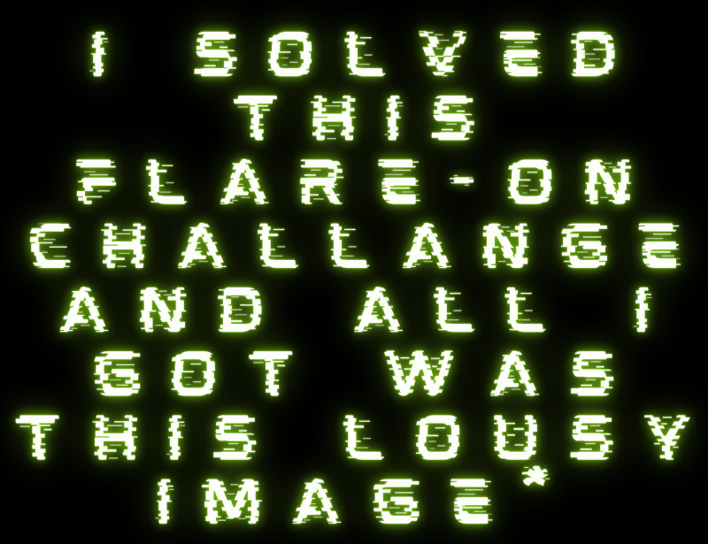

## Flare-On 2023 - #3 My Passion
___

### Description: 

*This is one of those ones that will work under the right circumstances, Steve.*
*May I call you Steve? Before you take to twitter complaining about a broken challenge,*
*think about how you can be the change you want to see in the world, Steve.*

`7-zip password: flare`
___

### Solution:

This was a weird challenge. The goal was to give a "correct" input (there can be many valid ones) to
cause the program to give you the flag. It consists of multiple (**8**) "stages" where each stage
validates a different part of the input.


#### Breaking the 1st Stage

Let's start from main:
```c
int __fastcall main(int argc, const char **argv, const char **envp) {
  /* ... */
  if ( argc != 2 )
    return 0;
  inp = argv[1];
  inp_6 = inp[6];                               // 0x40 = '@' = PAGE_EXECUTE_READWRITE
  if ( *inp != '0' )                            // inp[0] = '0'
    u_logoff_windows();
  inp_ = argv[1];
  if ( inp_[2] + 4 * inp_[1] != 0x127 ) {       // 4*inp[1] + inp[2] = 0x127 
    u_logoff_windows();
    return 0;
  }
  DWORD1(v13) = 'zpiz';
  WORD4(v13) = 'a';
  v14 = aAzbqcedtexfhgo; // AZBQCEDTEXFHGOHLIMJFKKLDMVNNOUPBQWRYSGTIUPVAWCXJYRZS
  inp_5_is_R = inp_[5] == 'R';                  // inp[5] == 'R'
  *v15 = '\xCA\xFE\0\0\xCB]';
  *&v12 = 0xE685500000000i64;
  *(&v12 + 1) = inp_6 | 0x4000000000i64;
  strcpy(&v13, "R% ");
  BYTE2(v16) = inp_5_is_R;
  *(&v16 + 3) = 'if';
  BYTE5(v16) = 'n';
  HIWORD(v16) = 0;
  LOWORD(v16) = '_';
  *&v15[8] = v12;
  *&v15[24] = v13;
  unknown_buf[0] = *v15;
  unknown_buf[1] = *&v15[16];
  unknown_buf[2] = _mm_unpacklo_pd(*&v15[32], aAzbqcedtexfhgo);
  v18 = v16;
  if ( !inp_5_is_R )
    return 0;
  hidden_func = VirtualAlloc(0i64, 0x99ui64, 0x3000u, inp_6);// MEM_COMMIT | MEM_RESERVE
  if ( hidden_func ) {
    memset(&buffer, 0, sizeof(buffer));
    TickCount = GetTickCount();
    inp__ = argv[1];
    buffer.tickCount = TickCount;
    inp_7 = 0;
    v21 = 0;
    inp_7 = *(inp__ + 7);
    LOBYTE(v21) = inp__[11];
    *hidden_func = *u_hidden_func;
    hidden_func[1] = *(&loc_14001EA0D + 3);
    hidden_func[2] = *(&loc_14001EA1F + 1);
    hidden_func[3] = loc_14001EA30;
    hidden_func[4] = loc_14001EA40;
    hidden_func[5] = *(&loc_14001EA4F + 1);
    hidden_func[6] = loc_14001EA60;
    hidden_func[7] = *(&loc_14001EA6E + 2);
    hidden_func[8] = *(&loc_14001EA7E + 2);
    *(hidden_func + 0x12) = loc_14001EA90;
    *(hidden_func + 0x98) = locret_14001EA98;
    *(hidden_func + 0x41) = argv[1][12];        // INPUT!
    (hidden_func)(&inp_7);
```

First of all, `inp[0] = '0'`, `4*inp[1] + inp[2] = 0x127` and `inp[5] == 'R'`. Then `inp[6]` is the
`flProtect` parameter of 
[VirtualAlloc](https://learn.microsoft.com/en-us/windows/win32/api/memoryapi/nf-memoryapi-virtualalloc).
The allocated memory must have `W+X` permissions in order to execute the `hidden_func`, so
`flProtect` needs to be `PAGE_EXECUTE_READWRITE`, which is `0x40` or `@`. Finally `inp[12]` must be
a valid shellcode byte. This fairly easy if we look at the code:
```assembly
debug031:01540030 C6 45 F0 16        mov     [rbp+var_10], 16h
debug031:01540034 C6 45 F1 17        mov     [rbp+var_10+1], 17h
debug031:01540038 C6 45 F2 3B        mov     [rbp+var_10+2], 3Bh ; ';'
debug031:0154003C C6 45 F3 17        mov     [rbp+var_10+3], 17h
debug031:01540040 C6 ?? F4 56        ???
```
It is easy to infer that the missing byte is `0x45` or `E`.

The `hidden_func` which has just created, is now invoked with the `&inp[7]` as an argument. Let's
see the function (we clean it up and adjust the variable types first):
```c
bool __fastcall u_hidden_func_0(const char *a1_inp7) {
  __int64 v1; // rbx
  char *cipher_ptr; // r10
  char *cipher_ptr_; // r11
  int i; // r9d
  unsigned int idx; // kr00_4
  char key; // al
  char cipher[6]; // [rsp+0h] [rbp-10h] BYREF
  char ten[8]; // [rsp+28h] [rbp+18h] BYREF

  strcpy(ten, "ten");
  cipher_ptr = cipher;
  cipher_ptr_ = cipher;
  i = 0;
  *&cipher[4] = 0;
  cipher[0] = 0x16;
  cipher[1] = 0x17;
  cipher[2] = 0x3B;
  cipher[3] = 0x17;
  cipher[4] = 0x56;

  do {
    idx = i++;
    key = *cipher_ptr++;
    *cipher_ptr_++ = ten[idx % 3] ^ key;
  } while ( i < 5 );
  return strcmp(cipher, a1_inp7) == 0;
}
```

Function computes (dynamically) the string `brUc3` on `cipher` array and compares it with the
function argument, which is `inp[7:12]`. That is, the next **5** characters from the input must be
`brUc3`. **However, the function result is not being checked!**

We quickly compute all valid character pairs for `inp[1]` and `inp[2]`:
```python
# Finding all solutions for: 4*inp[1] + inp[2] = 0x127
pairz = [f'{chr(i)}{chr(j)}'
            for i in range(0x21, 0x7f)
                for j in range(0x21, 0x7f)   
                    if 4*i + j == 0x127]
print(pairz)
```

```
  '+{', ',w', '-s', '.o', '/k', '0g', '1c', '2_',
  '3[', '4W', '5S', '6O', '7K', '8G', '9C', ':?',
  ';;', '<7', '=3', '>/', '?+', "@'", 'A#'
```

We randomly select the `0g` pair, so our input so far is: `00g..R@brUc3E`,
where `.` represents an unknown character.

Going back to `main`, function initializes a `buffer` object that contains the `inp` and various
functions and then invokes `u_process_buffer` to check the second stage of the input:
```c    
    strcpy_s(buffer.flag_inp, 0x100ui64, argv[1]);
    buffer.unknown_buf = unknown_buf;
    buffer.GetTickCount = GetTickCount;
    buffer.GetProcAddress = GetProcAddress;
    buffer.LoadLibraryW = LoadLibraryW;
    buffer.GetModuleFileNameW = GetModuleFileNameW;
    buffer.CreateFileW = CreateFileW;
    buffer.ReadFile = ReadFile;
    buffer.WriteFile = WriteFile;
    buffer.Sleep = Sleep;
    buffer.ExitProcess = ExitProcess;
    buffer.VirtualAlloc = VirtualAlloc;
    buffer.free = free;
    buffer.GetStdHandle = GetStdHandle;
    buffer.strtol = strtol;
    buffer.strlen = u_strlen;
    buffer.get_nth_path = u_get_first_n_paths;
    buffer.crypt_hash_data = u_crypt_hash_data;
    buffer.crypt_decrypt = u_crypt_decrypt;
    buffer.write_to_html_n_display = u_write_to_html_n_display;
    buffer.fourth_stage = u_4th_stage;
    u_process_buffer(&buffer);
  }
  return DWORD2(unknown_buf[0]);
}
```

#### Breaking the 2nd Stage

The second stage takes place at `0x1400013E0`:
```c
int __fastcall u_process_buffer(my_struct *buffer) {
  /* ... */
  inp = strdup(buffer->flag_inp);
  slash_idx = strchr(inp, '/');                 // 1st slash index
  first_slash = slash_idx;
  p_ExitProcess = &buffer->ExitProcess;
  if ( !slash_idx )
  {
    (*p_ExitProcess)(2i64);
    slash_idx = first_slash;
  }
  first_slash = slash_idx + 1;
  second_slash = strchr(slash_idx + 2, '/');    // 2nd slash index
  if ( !second_slash )
    (*p_ExitProcess)(2i64);
  *second_slash = 0;
  // address of the 1st invalid character goes back to `first_slash`
  // (o/w is NULL and program crashes)
  // that is, input should be /1234string/
  secret_num = strtol(first_slash, &first_slash, 10);
```

Function finds the first and the second slashes (`/`) in the input and extracts what's between them.
Then it converts it to an integer using `strtol`. However the `entrptr` of `strtol` is not NULL, so
`&first_slash`, will contain the address of the first invalid character. That is, we need to have
a string after the number, otherwise program will crash. Let's move on:
```c  
  (buffer->GetModuleFileNameW)(0i64, module_filename, 260i64);
  wat = 0i64;
  *wcsrchr(module_filename, '\\') = 0;          // drop file name (keep current directory)
  virt_alloc = (buffer->LoadLibraryW)(L"user32.dll");
  if ( !virt_alloc )
    (*p_ExitProcess)(2i64);
  first_slash_ = first_slash;
  len_1 = -1i64;
  if ( first_slash )
  {
    v9 = MultiByteToWideChar(65001u, 0, first_slash, -1, 0i64, 0);
    cchWideChar = v9;
    if ( v9 )
    {00g..R@brUc3E
      lpWideCharStr = j__malloc_base(2i64 * v9);
      wat = lpWideCharStr;
      if ( lpWideCharStr )
      {
        if ( MultiByteToWideChar(65001u, 0, first_slash_, -1, lpWideCharStr, cchWideChar) )
          goto LABEL_13;
        free(wat);
      }
      wat = 0i64;
    }
  }
LABEL_13:
  strcpy(v36, "wsprintfW");
  wsprintfW = (buffer->GetProcAddress)(virt_alloc, v36);
  if ( !wsprintfW )
    (*p_ExitProcess)(2i64);
  fmt[0] = 's\0%';
  fmt[1] = '%\0\\';
  fmt[2] = 's';
  wsprintfW(buffer->filename, fmt, module_filename, wat);// %s\%s
  file_hdl = (buffer->CreateFileW)(buffer->filename, 0x40000000i64, 1i64); // GENERIC_WRITE
  if ( file_hdl == -1i64 )
    (*p_ExitProcess)(2i64);
```

The above code invokes `GetModuleFileNameW` to get the full path of the current executable
(e.g., `Z:\home\ispo\...\03_mypassion\mypassion.exe`), it strips the filename (`mypassion.exe`)
from it and appends the string after the number to the file. Then it creates that file and
if it is not possible program terminates. For instance if input is `/1234foo.bin/`, program tries
to create file `Z:\home\ispo\...\03_mypassion\foo.bin`. Let's move on:
```c
  secret_num_ = secret_num;
  j = 0;
  do {
    ndigits = j++;
    secret_num_ /= 10;
  } while ( secret_num_ );
  v17 = ndigits;
  secret_str = j__malloc_base(ndigits + 2);
  secret_str_ = secret_str;
  if ( secret_str ) {
    if ( secret_num ) {
      v20 = &secret_str[v17];
      do {
        *v20-- = secret_num % 10 + '0';
        secret_num /= 10;
      } while ( secret_num );
    }
    ext_key = 0;
    secret_str[j] = 0;
    do
      ++len_1;
    while ( secret_str[len_1] );
    // Double number: 1234 becomes: 0x11223344 (in hex)
    //               12345 becomes: 0x22334455 (in hex)
    for ( i = 0i64; i < len_1; ext_key = (nxt - 0x30) | (16 * ((nxt - 0x30) | (16 * ext_key))) )
      nxt = secret_str_[i++];
  } else {
    ext_key = 0;
  }
```

This code snippet converts `secret_num` (i.e., the number from the input) back to string and then
creates a special 32-bit number by repeating each digit twice. That is `1234` becomes `0x11223344`.
Let's move on:
```c  
  glo_file_contents = ext_key;
  glo_tick_count = GetTickCount();
  GetLocalTime(&SystemTime);
  len = 0xAA0i64;
  incr = glo_const_31 + LOBYTE(SystemTime.wDay);
  v26 = _mm_cvtsi32_si128((glo_const_31 + LOBYTE(SystemTime.wDay)));
  buf = glo_big_encr_buf;
  v28 = _mm_unpacklo_epi8(v26, v26);
  row_key = _mm_shuffle_epi32(_mm_unpacklo_epi16(v28, v28), 0);// make an OWORD with `incr` bytes
  do {                                           // add `incr` to every byte
    buf_row = _mm_loadu_si128(buf - 1);
    buf += 64;
    *(buf - 5) = _mm_add_epi8(buf_row, row_key);// add `incr` to every byte
    *(buf - 4) = _mm_add_epi8(_mm_loadu_si128(buf - 4), row_key);
    *(buf - 3) = _mm_add_epi8(row_key, _mm_loadu_si128(buf - 3));
    *(buf - 2) = _mm_add_epi8(row_key, _mm_loadu_si128(buf - 2));
    --len;
  } while ( len );
  v31 = glo_incr_buf;
  v32 = 55i64;
  do {
    *v31++ += incr;
    --v32;
  } while ( v32 );
  // write 2A888 bytes
  (buffer->WriteFile)(file_hdl, &glo_file_contents, 0x2A888i64, &lpNumberOfBytesWritten, 0i64);
  CloseHandle(file_hdl);
  free(inp);
```

This code, decrypts `glo_big_encr_buf` located at `0x14001EBF0` (`E5`, `46`, `61`, `7B`, `4C`,
`33`, `2A`) by adding `incr` to every byte. `incr` is `31 + wDay`, where `wDay` is the current date
of the month (between **1** and **31**). The key is very small so we can brute force it, however we
do not know yet how this is being used. After this, the contents of `glo_file_contents` (which are
`0x2A888` bytes are written to that file):
```assembly
.data:000000014001EB90 glo_file_contents dd 0DAAADB0Dh         ; DATA XREF: u_process_buffer:loc_1400016B0↑w
.data:000000014001EB90                                         ; u_process_buffer+39E↑o
.data:000000014001EB94                 db  1Ah
.data:000000014001EB95 aMjNm4SmiHm     db '+<Mj+NM4+SMi+HM'
.data:000000014001EBA4                 db  1Ah
.data:000000014001EBA5                 db 27 dup(0)
.data:000000014001EBC0 glo_const_31    dd 31                   ; DATA XREF: u_process_buffer+2FB↑r
.data:000000014001EBC4 glo_tick_count  dd 0                    ; DATA XREF: u_process_buffer+2E3↑w
.data:000000014001EBC8                 dd 92A7A888h
.data:000000014001EBCC                 dd 0
.data:000000014001EBD0 ; struct _SYSTEMTIME SystemTime
.data:000000014001EBD0 SystemTime      dw 0                    ; wYear
.data:000000014001EBD0                                         ; DATA XREF: u_process_buffer+2DC↑o
.data:000000014001EBD0                                         ; u_process_buffer+2EF↑r
.data:000000014001EBD2                 dw 0                    ; wMonth
.data:000000014001EBD4                 dw 0                    ; wDayOfWeek
.data:000000014001EBD6                 dw 2                    ; wDay
.data:000000014001EBD8                 dw 0                    ; wHour
.data:000000014001EBDA                 dw 0                    ; wMinute
.data:000000014001EBDC                 dw 0                    ; wSecond
.data:000000014001EBDE                 dw 0                    ; wMilliseconds
.data:000000014001EBE0                 dq 5DD489FD4145B717h
.data:000000014001EBE8                 dq 0C7E4486595A2D156h
.data:000000014001EBF0 glo_big_encr_buf db 0E5h, 46h, 61h, 7Bh, 4Ch, 33h, 2Ah, 47h, 0EFh, 0CDh
.data:000000014001EBF0                                         ; DATA XREF: u_process_buffer+308↑o
```

```
Encrypted file format:

[0:4] = double number from flag: 0x11223344
[4:0x30] = const
[0x30:0x34] = 31
[0x34:0x38] = tick count
[38h:40h] =  88 a8 a7 92 00 00 00 00
[40h:50h] = SystemTime
[50h:60h] = 39 d9 67 63 1f ab f6 7f  78 f3 c4 b7 87 6a 06 e9 ?
[60h:2a850h] = encr_buf
[2a850h:2a888h] = incr_buf
```

The first **4** bytes contain the `secret_num` (e.g., `0x11223344`).

Finally the next stage of the code is being decrypted from `glo_encrypted_buf` located at
`0x14001EAE0` (`D7`, `C0`, `A8`, `23`, `63`, `43`, `B2`) and executed:
```c
  strcpy(turnitup, "turnitup");
  (buffer->crypt_hash_data)(turnitup);
  (buffer->crypt_decrypt)(glo_encrypted_buf, 176i64);
  virt_alloc = (buffer->VirtualAlloc)(0i64, 0xB0i64, 0x3000i64, 0x40i64);
  if ( !virt_alloc )
    (*p_ExitProcess)(*(buffer->unknown_buf + 8));
  virt_alloc_ = virt_alloc;
  *virt_alloc = *glo_encrypted_buf;
  virt_alloc_[1] = *&glo_encrypted_buf[16];
  virt_alloc_[2] = *&glo_encrypted_buf[32];
  virt_alloc_[3] = *&glo_encrypted_buf[48];
  virt_alloc_[4] = *&glo_encrypted_buf[64];
  virt_alloc_[5] = *&glo_encrypted_buf[80];
  virt_alloc_[6] = *&glo_encrypted_buf[96];
  virt_alloc_[7] = *&glo_encrypted_buf[112];
  virt_alloc_[8] = *&glo_encrypted_buf[128];
  virt_alloc_[9] = *&glo_encrypted_buf[144];
  virt_alloc_[10] = *&glo_encrypted_buf[160];
  virt_alloc(buffer);
}
```

#### Breaking the 3rd Stage

The 3rd stage is very small:
```c
void __fastcall u_hidden_func_2(my_struct *buffer) {
  __int64 num_str; // rax
  __int64 num_str_; // rsi
  int len; // edi
  __int64 after_num; // [rsp+30h] [rbp+8h] BYREF

  *(buffer->unknown_buf + 8) = 3;
  // get everything after 3rd slash
  num_str = (buffer->get_nth_path)(buffer, *(buffer->unknown_buf + 8));
  after_num = 0i64;
  num_str_ = num_str;
  // first read the `len` of what follows in base 4
  // then read `len` characters
  len = (buffer->strtol)(num_str, &after_num, 4i64);// base 4!
  if ( (buffer->strlen)(after_num, 32i64) == len )
    (buffer->Sleep)((1000 * len));
  else
    (buffer->ExitProcess)(*(buffer->unknown_buf + 8));
  (buffer->free)(num_str_);
  (buffer->fourth_stage)(buffer);
}
```

Code gets the input after the third slash (`/`) and reads a number in **base 4** which is the
number of the characters to read after. That is, if the number is **2** then it reads **2**
characters from the input. For example: `/2ab/`, or `/10abcd/`. Then it moves on the fourth stage.
Please note that we can have many valid solutions here.

So far our input is: `00g..R@brUc3E/1234foo.txt/10abcd/`.

#### Breaking the 4th Stage

```c
void __fastcall u_4th_stage(my_struct *buffer) {
  /* ... */
  v2 = buffer;
  v3 = buffer;
  *(buffer->unknown_buf + 8) = 4;
  v4 = *(buffer->unknown_buf + 8);
  if ( v4 == 1 ) {
    if ( buffer->flag_inp[0] == '/' ) {
      do
        v3 = (v3 + 1);
      while ( v3->flag_inp[0] == '/' );
    }
    v2 = v3;
  }
  v5 = v3->flag_inp[0];
  v6 = 0;
  for ( i = 0; v5; v3 = (v3 + 1) ) {
    if ( v5 == '/' ) {
      if ( ++i == v4 )
        break;
      for ( ; v3->flag_inp[1] == '/'; v3 = (v3 + 1) )
        ;
      v2 = &v3->flag_inp[1];
    }
    v5 = v3->flag_inp[1];
  }
  if ( i >= v4 ) {
    v9 = v3 - v2;
    v10 = j__malloc_base(v9 + 1);
    v8 = v10;
    if ( v10 ) {
      strncpy_s(v10, v9 + 1, v2->flag_inp, v9);
      v8[v9] = 0;
    } else {
      v8 = 0i64;
    }
  } else {
    v8 = 0i64;
  }
  unknown_buf = buffer->unknown_buf;
  lpMultiByteStr = v8;
  before_pizza = *v8;
  // pizza!
  if ( *(unknown_buf + 31) != v8[3]             // z (zipza)
    || *(unknown_buf + 29) != v8[2]             // i
    || *(unknown_buf + 32) != v8[5]             // a
    || *(unknown_buf + 30) != v8[1]             // p
    || *(unknown_buf + 28) != v8[4] ) {         // z
      (buffer->ExitProcess)(*(unknown_buf + 8));
      v8 = lpMultiByteStr;
  }
```

All this code, extract the next part of the input (between third and fourth `/`) and checks if the
word after the second character is `pizza` (the first character of the input is not being checked).
Hence, our input so far is: `00g..R@brUc3E/1234foo.txt/10abcd/.pizza`. Let's move on:
```c
  strcpy_s(&buffer->filename_pr_ost[7] + 4, 0x20ui64, v8);
  v13 = buffer->flag_inp[0];
  v14 = buffer;
  v15 = buffer;
  v16 = 0;
  if ( !buffer->flag_inp[0] )
    goto LABEL_33;
  do {
    if ( v13 == '/' )
    {
      if ( ++v16 == 2 )
        goto LABEL_31;
      for ( ; v15->flag_inp[1] == '/'; v15 = (v15 + 1) )
        ;
      v14 = &v15->flag_inp[1];
    }
    v13 = v15->flag_inp[1];
    v15 = (v15 + 1);
  }
  while ( v13 );
  if ( v16 < 2 )
    goto LABEL_33;
LABEL_31:
  v17 = v15 - v14;
  v18 = j__malloc_base(v17 + 1);
  v19 = v18;
  if ( v18 ) {
    strncpy_s(v18, v17 + 1, v14->flag_inp, v17); // get 1337ispo again
    v19[v17] = 0;
  } else {
LABEL_33:
    v19 = 0i64;
  }
  lpMultiByteStr = v19;
  strcpy_s(&buffer->field_3E4, 0x20ui64, v19);  // get 1st part `1337ispo`
  strtol(lpMultiByteStr, &lpMultiByteStr, 10);
  v20 = lpMultiByteStr;
  if ( !lpMultiByteStr )
    goto LABEL_39;
  v21 = MultiByteToWideChar(0xFDE9u, 0, lpMultiByteStr, -1, 0i64, 0);
  cchWideChar = v21;
  if ( !v21 )
    goto LABEL_39;
  lpWideCharStr = j__malloc_base(2i64 * v21);
  v24 = lpWideCharStr;
  if ( !lpWideCharStr )
    goto LABEL_39;
  if ( !MultiByteToWideChar(0xFDE9u, 0, v20, -1, lpWideCharStr, cchWideChar) ) {
    free(v24);
LABEL_39:
    v24 = 0i64;
  }
  (buffer->GetModuleFileNameW)(0i64, Str, 260i64);
  *wcsrchr(Str, 0x5Cu) = 0;
  file_hdl = (buffer->CreateFileW)(buffer->filename, 0x80000000i64, 1i64);// GENERIC_READ
  memset(encr_file_contents, 0, sizeof(encr_file_contents));
  if ( !(buffer->ReadFile)(file_hdl, encr_file_contents, 0x2A888i64, &v46, 0i64) || v46 != 174216 )
    (buffer->ExitProcess)(*(buffer->unknown_buf + 8));
  if ( *encr_file_contents != 0x11333377 )      // number must be 1337
    (buffer->ExitProcess)(*(buffer->unknown_buf + 8));
  v26 = *&encr_file_contents[4];
  for ( j = &encr_file_contents[8]; ; ++j ) {    // pr.ost (unicode)
    v28 = v26 >> (8 * (v6 % 4));                 // decrypt: +<Mj+NM4+SMi+HM
    v29 = v28 == *j;
    *j ^= v28;
    if ( v29 && !*(j - 1) )
      break;
    ++v6;
  }
  v30 = &encr_file_contents[8];
  v31 = v24 - &encr_file_contents[8];
  do {                                          // filename must be pr.ost
    v32 = *&v30[v31];
    chk = *v30 - v32;
    if ( chk )
      break;
    v30 += 2;
  } while ( v32 );
  if ( chk )
    (buffer->ExitProcess)(*(buffer->unknown_buf + 8));
  if ( (buffer->GetTickCount)() <= *&encr_file_contents[52] + 8000 )// ANTI DEBUG
    (buffer->ExitProcess)(*(buffer->unknown_buf + 8));
```

Function reads the contents from the file that created previously and checks if the first **4**
bytes are `77 33 33 11`, which is the value of `secret_num`. Then it checks if the file name is
`pr.ost`. Given that our input now becomes: `00g..R@brUc3E/1337pr.ost/10abcd/.pizza`.

```c
  v34 = _mm_cvtsi32_si128(before_pizza);
  v35 = &encr_file_contents[0x60];
  v36 = _mm_unpacklo_epi8(v34, v34);
  v37 = 0xAA0i64;
  v38 = _mm_shuffle_epi32(_mm_unpacklo_epi16(v36, v36), 0);
  // substract before_pizza from every byte on big_buf
  do {
    v39 = _mm_loadu_si128(v35 - 1);
    v35 += 64;
    *(v35 - 5) = _mm_sub_epi8(v39, v38);
    *(v35 - 4) = _mm_sub_epi8(_mm_loadu_si128(v35 - 4), v38);
    *(v35 - 3) = _mm_sub_epi8(_mm_loadu_si128(v35 - 3), v38);
    *(v35 - 2) = _mm_sub_epi8(_mm_loadu_si128(v35 - 2), v38);
    --v37;
  } while ( v37 );
  v40 = &encr_file_contents[0x2A850];
  v41 = '7';
  do {                                          // incr_buf
    *v40++ -= before_pizza;
    --v41;
  } while ( v41 );
  buffer->expected_CRC32_92A7A888 = *&encr_file_contents[0x38];
  buffer->buflen_2A837 = 0x2A837i64;
  CurrentProcess = GetCurrentProcess();
  encr_big_buf = VirtualAllocEx(CurrentProcess, 0i64, 0x2A837ui64, 0x3000u, 4u);
  buffer->decrypted_big_buf_from_file = encr_big_buf;
  memmove(encr_big_buf, &encr_file_contents[0x50], 0x2A837ui64);
  CloseHandle(file_hdl);
  u_5th_stage(buffer);
}
```

`before_pizza` is the first character of the input before the word `pizza`. This character is
subtracted from every byte of `glo_big_encr_buf`, which located at the offset `0x60` in the file.
However, the number we add on every byte of `glo_big_encr_buf` depends on the current day. That is,
our input is different on every day! For instance on the `2nd` day of a month, we add the value
`31 + 2 = 33`, so we `before_pizza = 33 = 0x21 = '!'`.

#### Breaking the 5th Stage

Fifth stage is more complicated:
```c
void __fastcall u_5th_stage(my_struct *buffer) {CompletedPr
  /* ... */
  *(buffer->unknown_buf + 8) = 5;             // What stage we're in :)
  get_nth_path = u_decrypt_func_get_nth_path();
  v17 = 0;
  *nxt_part = 0i64;
  v12 = 0i64;
  v13 = 0i64;
  v14 = 0i64;
  v15 = 0i64;
  v16 = 0i64;
  get_nth_path(buffer, 5i64, nxt_part);         // 0ISPOLEET10AB
  // debug035:00000000015A006C 74 EB

  // 74 EB gives a je which should be correct
  func = u_decrypt_func_unknown(nxt_part);
```


Function extracts the next stage from the input (between `/`) and decrypts a function in
`u_decrypt_func_unknown`. This function uses input bytes
`0`, `1`, `2`, `3`, `4` and `11` as part of the function:
```c
_OWORD *__fastcall u_decrypt_func_unknown(_BYTE *nxt_part) {
  /* ... */
  v3[8] = nxt_part[1];                          // v3 is at offset 0x10 from the result
  v3[9] = nxt_part[11];
  v3[0x19] = nxt_part[4];
  v3[0x5C] = nxt_part[2];
  v3[0x7A] = nxt_part[3];
  v3[0x82] = *nxt_part;
  *&v2 = 0x7C894808245C8948i64;
  *(&v2 + 1) = 0x4C10245489481824i64;
  *v3 = 0xB86374C98548C18Bui64;
  *&v3[10] = 0x4859750139660000i64;
  /* ... */
  v3[143] = 0xEB;
  result = VirtualAlloc(0i64, 0xA1ui64, 0x3000u, 0x40u);
  *result = v2;
  /* ... */
  *(result + 160) = 0xDB;
  return result;
}
```

Going back to `u_5th_stage`, function builds another shellcode using input bytes
`5`, `6`, `7`, `8`, `9` and `12`:
```c  
  v7[54] = nxt_part[9];
  HIBYTE(v10) = nxt_part[6];
  v7[24] = nxt_part[5];
  v7[0] = nxt_part[12];
  LOBYTE(v9) = nxt_part[7];
  *&v7[25] = 0x10788366;
  v7[29] = nxt_part[8];
  *&v7[37] = 0x83662775;
  WORD5(v9) = 29952;
  *&v7[41] = 3192;
  v7[43] = 51;
  *(&v8 + 5) = 0x74C1856645E88366i64;
  *&v7[13] = 542214984;
  *(&v9 + 13) = -16333;
  *&v7[55] = 2168;
  v7[57] = 108;
  *&v7[17] = 283804488;
  BYTE12(v9) = -72;
  LOWORD(v10) = -29880;
  BYTE2(v10) = 66;
  *(&v9 + 2) = 0x307A834810EA8348i64;
  *&v7[46] = 0x6607744C0A788366i64;
  *&v7[30] = -2090455435;
  *&v7[21] = -29880;
  v7[23] = 66;
  *&v7[1] = 621054792;
  *&v7[5] = 0x18488B4800000060i64;
  LODWORD(v8) = 16768953;
  BYTE4(v8) = 0;
  HIWORD(v8) = -29880;
  BYTE1(v9) = 16;
  *&v7[34] = 3704;
  v7[36] = 50;
  *&v7[58] = -1223749003;
  BYTE13(v8) = 18;
  *&v7[44] = 8309;
  HIBYTE(v9) = -61;
  *&v7[62] = 2112;
  if ( nxt_part[0] != nxt_part[10] )
    (buffer->ExitProcess)(*(buffer->unknown_buf + 8));
```

The input must have **13** bytes and the **first** and the **11th** bytes from the input must be
the same. After it builds the shellcode, program executes it and moves on to the next stage:
```c  
  hidden_func = VirtualAlloc(0i64, 0x65ui64, 0x3000u, 0x40u);
  *hidden_func = *v7;
  hidden_func[1] = *&v7[16];
  hidden_func[2] = *&v7[32];
  hidden_func[3] = *&v7[48];
  hidden_func[4] = v8;
  hidden_func[5] = v9;
  *(hidden_func + 24) = v10;
  *(hidden_func + 100) = -61;
  v5 = (hidden_func)();
  if ( v5 ) {
    buffer->module_hdl_maybe = v5;
    beep = func(v5, "Beep");                    // GetProcAddress? yes!
    if ( beep )
      beep(750i64, 300i64);
    buffer->GetProcAddress_ = func;
  } else {
    (buffer->ExitProcess)(*(buffer->unknown_buf + 8));
  }
  strcpy_s(buffer->nxt_part_5, 0x20ui64, nxt_part);
  u_6th_stage(buffer);
}
```

Just by looking at how `func` is being used, we can infer that it is `GetProcAddress`. We can
also infer that `hidden_func` is `GetModuleHandle` for `KERNEL32.dll`.
Knowing that, we can craft our input to make sure these functions are being executed properly.

However, **there is no need to do that. We can simply patch the code to move on directly to
`u_6th_stage` since this part of the input does not affect the flag computation.** However it is 
interesting to see how we can fix the shellcode. Since we know what the shellcode does (It's
`GetModuleHandle`), we can fix the instructions accordingly:
```assembly
; First byte must be 0x65, to get the current PEB
debug036:015B0000 65 48 8B 04 25 mov     rax, gs:60h
debug036:015B0000 60 00 00 00
debug036:015B0009 48 8B 48 18    mov     rcx, [rax+18h]
debug036:015B000D 48 8B 51 20    mov     rdx, [rcx+20h]
debug036:015B0011 48 83 EA 10    sub     rdx, 10h
debug036:015B0015
debug036:015B0015                LOOP:                                   ; CODE XREF: debug036:015B005B↓j
; This must be 0x60 to access the module name (e.g., ntdll.dll)
debug036:015B0015 48 8B 42 60    mov     rax, [rdx+60h]
; Then we check module name (it should be: _ _ _ _ _ L 3 2 . ~> Only KERNEL32.DLL matches) 
; This should be 0x2e to match the dot after the name
debug036:015B0019 66 83 78 10 2E cmp     word ptr [rax+10h], 2Eh ; '.'
debug036:015B001E 75 2E          jnz     short MODULE_NOT_FOUND
debug036:015B0020 66 83 78 0E 32 cmp     word ptr [rax+0Eh], 32h ; '2'
debug036:015B0025 75 27          jnz     short MODULE_NOT_FOUND
debug036:015B0027 66 83 78 0C 33 cmp     word ptr [rax+0Ch], 33h ; '3'
debug036:015B002C 75 20          jnz     short MODULE_NOT_FOUND
debug036:015B002E 66 83 78 0A 4C cmp     word ptr [rax+0Ah], 4Ch ; 'L'
debug036:015B0033 74 07          jz      short YES_MODULE_FOUND
; I'm not sure about this. 0x6B = 'k' is the only one that makes sense :\
debug036:015B0035 66 6B 78 08 6C imul    di, [rax+8], 6Ch ; 'l'
debug036:015B003A 75 12          jnz     short MODULE_NOT_FOUND
debug036:015B003C
debug036:015B003C                YES_MODULE_FOUND:                       ; CODE XREF: debug036:015B0033↑j
debug036:015B003C 0F B7 40 08    movzx   eax, word ptr [rax+8]
debug036:015B0040 B9 DF FF 00 00 mov     ecx, 0FFDFh
debug036:015B0045 66 83 E8 45    sub     ax, 45h ; 'E'
debug036:015B0049 66 85 C1       test    cx, ax
debug036:015B004C 74 12          jz      short RETURN
debug036:015B004E
debug036:015B004E                MODULE_NOT_FOUND:                       ; CODE XREF: debug036:015B001E↑j
debug036:015B004E                                                        ; debug036:015B0025↑j ...
; Move on to the next module in the list.
; This must be 0x52 to get the next pointer
debug036:015B004E 48 8B 52 10    mov     rdx, [rdx+10h]
debug036:015B0052 48 83 EA 10    sub     rdx, 10h
debug036:015B0056 48 83 7A 30 00 cmp     qword ptr [rdx+30h], 0
debug036:015B005B 75 B8          jnz     short LOOP
debug036:015B005D 33 C0          xor     eax, eax
debug036:015B005F C3             retn
debug036:015B0060
debug036:015B0060                RETURN:                                ; CODE XREF: debug036:015B004C↑j
; This is 0x30 to return the base address of the module.
debug036:015B0060 48 8B 42 30    mov     rax, [rdx+30h]
debug036:015B0064 C3             retn
```

After we find all bytes, we can map them back to input:
```
      v7[0] = nxt_part[12];             ~> Byte 0     ~> 0x65 e
      v7[24] = nxt_part[5];             ~> Byte 0x18  ~> 0x60 `
      HIBYTE(v10) = nxt_part[6];        ~> Byte 0x63  ~> 0x30 0
      v7[29] = nxt_part[8];             ~> Byte 0x1D  ~> 0x2e .
      v7[54] = nxt_part[9];             ~> Byte 0x36  ~> 0x6b k
      LOBYTE(v9) = nxt_part[7];         ~> Byte 0x50  ~> 0x52 R
```

Given that, our input should be:
```
00g..R@brUc3E/1337pr.ost/10abcd/!pizza/0....`0R.k0.e/
```


The next function is `GetProcAddress`. To get some help, we look an
[online implementation](https://github.com/arbiter34/GetProcAddress/blob/master/GetProcAddress/GetProcAddress.cpp):
```c
//Lookup Ordinal
unsigned short NameOrdinal = ((unsigned short*)(dllBaseAddr + pExportDir->AddressOfNameOrdinals))[i];
//Use Ordinal to Lookup Function Address and Calculate Absolute
unsigned int addr = ((unsigned int*)(dllBaseAddr + pExportDir->AddressOfFunctions))[NameOrdinal];
```

```assembly
debug035:015A0000 48 89 5C 24 08 mov     [rsp+8], rbx
debug035:015A0005 48 89 7C 24 18 mov     [rsp+18h], rdi
debug035:015A000A 48 89 54 24 10 mov     [rsp+10h], rdx
debug035:015A000F 4C 8B C1       mov     r8, rcx
debug035:015A0012 48 85 C9       test    rcx, rcx
debug035:015A0015 74 63          jz      short ERROR
; This should be 'MZ' so inp[1] = 0x4D = 'M' amd inp[11] = 0x50 = 'Z'
debug035:015A0017 B8 4D 5A 00 00 mov     eax, 5A4Dh
debug035:015A001C 66 39 01       cmp     [rcx], ax
debug035:015A001F 75 59          jnz     short ERROR
debug035:015A0021 48 63 41 3C    movsxd  rax, dword ptr [rcx+3Ch]
; This should be 'PE' so inp[4] = 0x45 = 'E'
debug035:015A0025 81 3C 08 50 45 cmp     dword ptr [rax+rcx], 4550h
debug035:015A0025 00 00
debug035:015A002C 75 4C          jnz     short ERROR
debug035:015A002E 44 8B 8C 08 88 mov     r9d, [rax+rcx+88h]
debug035:015A002E 00 00 00
debug035:015A0036 4C 03 C9       add     r9, rcx
debug035:015A0039 45 8B 59 20    mov     r11d, [r9+20h]
debug035:015A003D 4C 03 D9       add     r11, rcx
debug035:015A0040 33 C9          xor     ecx, ecx
debug035:015A0042 41 39 49 18    cmp     [r9+18h], ecx
debug035:015A0046 76 32          jbe     short ERROR
debug035:015A0048
debug035:015A0048                LOOP:                                   ; CODE XREF: debug035:015A0078↓j
debug035:015A0048 41 8B 04 8B    mov     eax, [r11+rcx*4]
debug035:015A004C 48 8B 5C 24 10 mov     rbx, [rsp+10h]
debug035:015A0051 49 03 C0       add     rax, r8
debug035:015A0054 48 2B D8       sub     rbx, rax
debug035:015A0057 8B F9          mov     edi, ecx
debug035:015A0059 0F B6 10       movzx   edx, byte ptr [rax]
debug035:015A005C 44 0F B6 14 18 movzx   r10d, byte ptr [rax+rbx]
debug035:015A0061 41 2B D2       sub     edx, r10d
debug035:015A0064 75 08          jnz     short SKIP
debug035:015A0066 48 FF C0       inc     rax
debug035:015A0069 45 85 D2       test    r10d, r10d
; inp[2] = 0x75 = 'u' (it has to be jcc since it's between test instructions)
debug035:015A006C 75 EB          jnz     short loc_15A0059
debug035:015A006E
debug035:015A006E                SKIP:                                   ; CODE XREF: debug035:015A0064↑j
debug035:015A006E 85 D2          test    edx, edx
debug035:015A0070 74 15          jz      short ORDINAL_FOUND
debug035:015A0072 FF C1          inc     ecx
debug035:015A0074 41 3B 49 18    cmp     ecx, [r9+18h]
debug035:015A0078 72 CE          jb      short LOOP
debug035:015A007A
debug035:015A007A                ERROR:                                  ; CODE XREF: debug035:015A0015↑j
debug035:015A007A                                                        ; debug035:015A001F↑j ...
debug035:015A007A 33 C0          xor     eax, eax
debug035:015A007C
debug035:015A007C                RETURN:                                 ; CODE XREF: debug035:015A009F↓j
debug035:015A007C 48 8B 5C 24 08 mov     rbx, [rsp+8]
debug035:015A0081 48 8B 7C 24 18 mov     rdi, [rsp+18h]
debug035:015A0086 C3             retn
debug035:015A0087
debug035:015A0087                ORDINAL_FOUND:                          ; CODE XREF: debug035:015A0070↑j
; Get the ordinal:
; unsigned short NameOrdinal = ((unsigned short*)(dllBaseAddr + pExportDir->AddressOfNameOrdinals))[i];
; this should be 0x24 = '$' = inp[3]
xdebug035:015A0087 41 8B 49 24    mov     ecx, [r9+24h]
debug035:015A008B 49 03 C8       add     rcx, r8
debug035:015A008E 0F B7 14 79    movzx   edx, word ptr [rcx+rdi*2]
; Get the address:
; unsigned int addr = ((unsigned int*)(dllBaseAddr + pExportDir->AddressOfFunctions))[NameOrdinal];
; We must use r9+0x1C so, input must be 0x41 = 'A' = inp[0]
debug035:015A0092 41 8B 49 1C    mov     ecx, [r9+1Ch]
debug035:015A0096 49 03 C8       add     rcx, r8
debug035:015A0099 8B 04 91       mov     eax, [rcx+rdx*4]
debug035:015A009C 49 03 C0       add     rax, r8
debug035:015A009F EB DB          jmp     short RETURN
```

We also know the offsets:
```
  v3[8] = nxt_part[1];                          // v3 is at offset 0x10 from the result
  v3[9] = nxt_part[11];
  v3[0x19] = nxt_part[4];
  v3[0x5C] = nxt_part[2];
  v3[0x7A] = nxt_part[3];
  v3[0x82] = *nxt_part;
```

So, we can craft our input:
```
00g..R@brUc3E/1337pr.ost/10abcd/!pizza/AMu$E`0R.kAZe/
```

To ease our work, we craft a mini-script that prints all possible disassembly listings for a given
byte and we look which one makes the "most sense": 
```python
hidden_func = [
    0x00, 0xEB, 0x85, 0xD2, 0x74, 0x15, 0xFF, 0xC1, 0x41, 0x3B, 0x49, 0x18, 0x72, 0xCE, 0x33, 0xC0
]

def try_disasm(shellcode, base=0x15B0000):
    """Tries to disassemble a shellcode."""    
    md = capstone.Cs(capstone.CS_ARCH_X86, capstone.CS_MODE_64)
    md.detail = True

    asm = []
    for insn in md.disasm(bytes(shellcode), base):
        asm.append(f'{insn.address:08X} {insn.mnemonic} {insn.op_str}')
   
    return '\n' + ';\n'.join(asm)

for i in range(0x20, 0x7f):        
    hidden_func[0x0] = i
    disasm = try_disasm(hidden_func[:])
    print('~>', repr(chr(i)), hex(i), disasm)   
```

#### Breaking the 6th Stage

The sixth stage is simpler. It takes the next part from the input, dynamically computes the string
`RUECKWAERTSINGENIEURWESEN`, it does a special XOR with the input and finally compares the XORed
input with that string:
```c
__int64 __fastcall u_6th_stage(my_struct *buffer) {
  /* ... */
  LODWORD(v2) = u_get_first_n_paths(buffer->flag_inp, 6);
  v3 = v2;
  strcpy_s(buffer->nxt_part_6, 0x20ui64, v2);
  v4 = -1i64;
  ii = -1i64;
  v6 = *(buffer->unknown_buf + 40);
  do                                            // strlen(inp)
    ++ii;
  while ( v3[ii] );
  v7 = ii;
  if ( ii > 0 ) {                               // build string RUECKWAERTSINGENIEURWESEN
    v8 = 0i64;
    do {
      v9 = &Buf1 + v8;
      v10 = (v6 + 1);
      v11 = 0i64;
      v12 = *(&Buf1 + v8 + v3 - &Buf1);
      while ( *v10 != v12 ) {
        ++v11;
        v10 += 2;
        if ( v11 >= 0x1A )
          goto LABEL_10;
      }
      v12 = *(v6 + 2 * v11);
LABEL_10:
      ++v8;
      *v9 = v12;
    } while ( v8 < v7 );
  }

  *(&Buf1 + v7) = 0;
  prev = 0;
  v27[0] = 0x52;
  i = 0i64;
  v27[1] = 7;
  v27[2] = 0x42;
  v27[3] = 1;
  v27[4] = 0x4A;
  v27[5] = 0x1D;
  v27[6] = 0x5C;
  v27[7] = 0x19;
  v27[8] = 0x4B;
  v27[9] = 0x1F;
  v27[10] = 0x4C;
  v27[11] = 5;
  v27[12] = 0x4B;
  v27[13] = 0xC;
  v27[14] = 0x49;
  v27[15] = 7;
  v27[16] = 0x4E;
  v27[17] = 0xB;
  v27[18] = 0x5E;
  v27[19] = 0xC;
  v27[20] = 0x5B;
  v27[21] = 0x1E;
  v27[22] = 0x4D;
  v27[23] = 8;
  v27[24] = 0x46;
  do {                                          // decrypt RUECKWAERTSINGENIEURWESEN
    v15 = prev ^ v27[i];
    prev = v27[i];
    expected[i++] = v15;
  } while ( i < 0x19 );
  v16 = v31;
  v17 = v32;

  *buffer->nxt_part_7_RC4_key = Buf1;
  *&buffer->nxt_part_7_RC4_key[16] = v16;
  buffer->nxt_part_7_RC4_key[24] = v17;
  if ( !memcmp(&Buf1, expected, 0x19ui64) ) {
    v18 = (buffer->GetStdHandle)(0xFFFFFFF5i64);
    if ( v18 == -1 )
      (buffer->ExitProcess)(*(buffer->unknown_buf + 8));
    module_hdl_maybe = buffer->module_hdl_maybe;
    strcpy(v28, "WriteConsoleA");
    WriteConsoleA = (buffer->GetProcAddress_)(module_hdl_maybe, v28);
    v33 = 10;
    v21 = WriteConsoleA;
    if ( !WriteConsoleA(v18, &Buf1, 26i64) )
      (buffer->ExitProcess)(*(buffer->unknown_buf + 8));
    buffer->WriteConsoleA = v21;
  }

  do
    ++v4;
  while ( *(&Buf1 + v4) );
  if ( v4 > 0i64 ) {                            // copy
    v22 = v3;
    v23 = v4;
    do {
      v24 = v22[&Buf1 - v3];
      v25 = 0i64;
      while ( *(v6 + 2 * v25) != v24 ) {
        if ( ++v25 >= 26 )
          goto LABEL_27;
      }
      v24 = *(v6 + 2 * v25 + 1);
LABEL_27:
      *v22++ = v24;
      --v23;
    } while ( v23 );
  }
  v3[v4] = 0;
  return u_7th_stage(buffer);
}
```

If everything is good that string is printed to the console and the program moves on the seventh
stage. The correct input here is `YPXEKCZXYIGMNOXNMXPYCXGXN` (please check the crack script on how
we compute this), so our total input becomes:
```
00g..R@brUc3E/1337pr.ost/10abcd/!pizza/AMu$E`0R.kAZe/YPXEKCZXYIGMNOXNMXPYCXGXN
```

#### Breaking the 7th Stage

The seventh stage is fairly straightforward:
```c
__int64 __fastcall u_7th_stage(my_struct *a1) {
  /* ... */
  nblks = 7i64;
  *(a1->unknown_buf + 8) = 7;
  v3 = (a1->get_nth_path)(a1, *(a1->unknown_buf + 8));
  v4 = a1->filename_pr_ost[3];
  BYTE1(v16) = a1->flag_inp[7];
  HIBYTE(v16) = a1->flag_inp[10];
  LOBYTE(v16) = a1->filename_pr_ost[3];
  BYTE2(v16) = '5';
  if ( v16 != *v3                               // 'ob5cUr3'
    || (HIBYTE(v18) = a1->filename_pr_ost[1], LOBYTE(v18) = a1->flag_inp[9], v18 != *(v3 + 4))
    || a1->flag_inp[11] != *(v3 + 6) )          // 'last character from stage 1: 'brUc3'
  {
    (a1->ExitProcess)(*(a1->unknown_buf + 8));
  }
  decrypted_big_buf_from_file = a1->decrypted_big_buf_from_file;
  a1_key[0] = a1->nxt_part_7_RC4_key[0];        // REVERSEENGINEER
  a1_key[1] = a1->nxt_part_7_RC4_key[2];
  a1_key[2] = a1->nxt_part_7_RC4_key[5] - 1;
  a1_key[3] = a1->nxt_part_7_RC4_key[7];
  a1_key[4] = a1->nxt_part_7_RC4_key[8];
  a1_key[5] = a1->nxt_part_7_RC4_key[10];
  a1_key[6] = a1->nxt_part_7_RC4_key[14];
  a1_key[7] = a1->nxt_part_7_RC4_key[17];
  a1_key[8] = a1->nxt_part_7_RC4_key[12];
  a1_key[9] = a1->nxt_part_7_RC4_key[13];
  a1_key[10] = a1->nxt_part_7_RC4_key[11];
  a1_key[11] = a1->nxt_part_7_RC4_key[15];
  a1_key[12] = a1->nxt_part_7_RC4_key[21];
  a1_key[13] = a1->nxt_part_7_RC4_key[23];
  a1_key[14] = a1->nxt_part_7_RC4_key[19];
  u_double_rc4(a1_key, v4, decrypted_big_buf_from_file, decrypted_big_buf_from_file, a1->buflen_2A837);
  const_2A837 = a1->buflen_2A837;
  v7 = -1;
  for ( i = a1->decrypted_big_buf_from_file; const_2A837; --const_2A837 )// do crc32
  {
    v9 = *i++;
    v7 = glo_crc32_tbl[(v7 ^ v9)] ^ (v7 >> 8);
  }
  v10 = ~v7;
  if ( a1->expected_CRC32_92A7A888 != v10 )     // EXPECTED CRC32: 88 A8 A7 92
    (a1->ExitProcess)(*(a1->unknown_buf + 8), v10, const_2A837, i);
  a1->do_CRC32 = u_do_crc32;
```

It first extracts the next part from the input and then crafts a string from the previous inputs
and compares it with the current input, which should be `ob5cUre` (which is not correct as we will
see). Then it performs a **double RC4 decryption** using `REVERSEENGINEER` as a key to decrypt the
contents of the `pr.ost` file. To verify that decryption was correct it computes the **CRC32**
which should be `0x92A7A888`. The decrypted file is an **html** file that contains the following
image:




If everything goes well, program decrypts and drops the eighth (and finally the last) stage.
The decryption algorithm is **AES** in **CBC** mode, with key `ob5cUr3` and iv `capture_the_flag`:
```c  
  (a1->crypt_hash_data)(v3, v10, const_2A837, i);// key is ob5cUr3
  v11 = glo_final_buf;
  (a1->crypt_decrypt)(glo_final_buf, 960i64);
  final_alloc = (a1->VirtualAlloc)(0i64, 960i64, 12288i64, 64i64);
  if ( !final_alloc )
    (a1->ExitProcess)(*(a1->unknown_buf + 8));
  v12 = final_alloc;
  do
  {
    v12 += 8;
    v13 = *v11;
    v11 += 128;
    *(v12 - 8) = v13;
    *(v12 - 7) = *(v11 - 7);
    *(v12 - 6) = *(v11 - 6);
    *(v12 - 5) = *(v11 - 5);
    *(v12 - 4) = *(v11 - 4);
    *(v12 - 3) = *(v11 - 3);
    *(v12 - 2) = *(v11 - 2);
    *(v12 - 1) = *(v11 - 1);
    --nblks;
  }
  while ( nblks );
  *v12 = *v11;
  v12[1] = *(v11 + 1);
  v12[2] = *(v11 + 2);
  v12[3] = *(v11 + 3);
  return final_alloc(a1);
}
```

The decryption key here is `ob5cUr3`, so we can update our input:
```
00g..R@brUc3E/1337pr.ost/10abcd/!pizza/AMu$E`0R.kAZe/YPXEKCZXYIGMNOXNMXPYCXGXN/ob5cUr3
```

#### Breaking the 8th Stage

The last stage of this challenge contains a custom encryption (it's probably a known one that I
don't know about :P). It first takes the last part from the input (which must be `/fin/`) and then
computes the flag:
```c
__int64 __fastcall sub_15C0000(my_struct *a1) {
  /* ... */
  *(a1->unknown_buf + 8) = 8;
  v2 = (a1->get_nth_path)(a1, *(a1->unknown_buf + 8));
  unknown_buf = a1->unknown_buf;
  v4 = v2;
  if ( __PAIR64__(v2[1], *v2) != __PAIR64__(*(unknown_buf + 52), *(unknown_buf + 51)) || v2[2] != *(unknown_buf + 53) )
    (a1->ExitProcess)(*(unknown_buf + 8));
  v5 = (a1->get_nth_path)(a1, (*(a1->unknown_buf + 8) - 1));
  A = 0xC6EF3720;
  v7 = v5;
  B = 0xC6EF3720;
  C = 0xAEFCF63E;
  D = 0xD5C5DD5A;
  E = 0xC6EF3720i64;
  v24[0] = *v5;
  v24[1] = a1->nxt_part_6[14];
  v24[2] = v4[1];
  v24[3] = a1->nxt_part_6[10];
  v12 = v5[6];
  v24[7] = a1->filename_pr_ost[4];
  v24[9] = a1->nxt_part_5[1];
  v24[11] = a1->nxt_part_6[6];
  LOBYTE(v5) = a1->nxt_part_6[9];
  v24[4] = v12;
  v13 = a1->nxt_part_6[24];
  v24[12] = v5;
  LOBYTE(v5) = v4[2];
  v24[5] = v13;
  v14 = a1->field_3F8[46];
  v24[13] = v5;
  LOBYTE(v5) = a1->nxt_part_6[22];
  v24[6] = v14;
  v15 = a1->nxt_part_5[0];
  v25 = v5;
  v24[8] = v15;
  v24[10] = v15;
  do {
    v16 = (C ^ B) + *&v24[4 * ((E >> 11) & 3)] + ((16 * C) ^ (C >> 5));
    B += 1640531527;
    D -= v16;
    E = B;
    C -= (D ^ B) + *&v24[4 * (B & 3)] + ((16 * D) ^ (D >> 5));
  } while ( B );
  v34 = C;
  v17 = -1422855038;
  v18 = -1101777045;
  v35 = D;
  v19 = 0xC6EF3720i64;
  do {
    v20 = (v17 ^ A) + *&v24[4 * ((v19 >> 11) & 3)] + ((16 * v17) ^ (v17 >> 5));
    A += 1640531527;
    v18 -= v20;
    v19 = A;
    v17 -= (v18 ^ A) + *&v24[4 * (A & 3)] + ((16 * v18) ^ (v18 >> 5));
  } while ( A );
  v21 = a1->unknown_buf;
  flag[0] = a1->flag_inp[7];
  flag[1] = a1->flag_inp[0];
  flag[2] = a1->flag_inp[19];
  v27 = 0i64;
  v28 = 0i64;
  v29 = 0i64;
  v30 = 0i64;
  v31 = 0;
  v32 = 0;
  flag[3] = v4[2];
  flag[4] = *(v21 + 48);
  flag[5] = a1->flag_inp[23];
  flag[6] = a1->nxt_part_5[6];
  flag[7] = 95;
  flag[8] = v7[2];
  flag[9] = 116;
  flag[10] = v7[5];
  flag[11] = a1->nxt_part_5[2];
  flag[12] = a1->nxt_part_6[5] + 32;
  flag[13] = a1->flag_inp[17];
  flag[14] = *(v21 + 48);
  *&flag[15] = v34;
  *&flag[19] = v35;
  flag[21] = BYTE2(v35);
  *&flag[22] = v17;
  *&flag[26] = v18;
  flag[28] = BYTE2(v18);
  if ( (a1->do_CRC32)(flag, 29i64) != 0x59B1D2F1 )
    (a1->ExitProcess)(*(a1->unknown_buf + 8));
  v33 = 0;
  result = (a1->write_to_html_n_display)(a1, &v33);
  if ( result ) {
    LOWORD(v27) = v33;
    BYTE2(v27) = BYTE2(v33);
    BYTE3(v27) = 10;
    v23 = (a1->GetStdHandle)(4294967285i64);
    if ( v23 == -1 )
      (a1->ExitProcess)(*(a1->unknown_buf + 8));
    result = (a1->WriteConsoleA)(v23, flag, 64i64);
    if ( result )
      return (a1->ExitProcess)(*(a1->unknown_buf + 8));
  }
  return result;
}
```

If decryption goes well, program displays the **html** file that previously decrypted and prints
the flag to the console. So, we can simply let the program run with the following input and get
the flag:
```
00g..R@brUc3E/1337pr.ost/10abcd/!pizza/AMu$E`0R.kAZe/YPXEKCZXYIGMNOXNMXPYCXGXN/ob5cUr3/fin/
```

(*Please note that the first character (`!`) of the `!pizza` part is different every day*)

For more details, please refer to the [mypassion_crack.py](./mypassion_crack.py) script.

So the flag is: `b0rn_t0_5truc7_b4by@flare-on.com`
___
