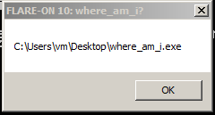

## Flare-On 2023 - #5 Where Am I?
___

### Description: 

*I wish we had more easy challenges for you this year for you to rack up your personal high score.*
*It wouldn’t help you improve but it would feel great and that is what is most important.*

`7-zip password: flare`
___

### Solution:

We run a program and after a few seconds, we get a message box showing the current path of the
executable:



This is a very large binary. To figure out where to start, we simply run the program on the 
debugger and after a few seconds (before it shows the message box) we pause the execution.
We are now inside a shellcode. From there we can move backwards and find where everything starts.

So everything starts from `u_run_shellcode` at `00448650h`:
```c
char *__usercall u_run_shellcode@<eax>(char *ebp0@<ebp>, char *edi0@<edi>, int a3, int a4, unsigned int a5) {
  /* ... */
  result = u_load_shellcode_from_resource((char **)&v12, v15);
  if ( v12 ) {
    if ( v15[0] ) {
      key1 = u_get_0x4003F4();
      key2 = u_get_0x4003F0();
      u_decrypt_shellcode(v12, v12, v15[0], *key1, *key2);
      return (char *)v12();
    }
  }
  return result;
}
```

```ceax
char *__cdecl u_load_shellcode_from_resource(char **a1, char **a2) {
  /* ... */
  result = (char *)u_get_ImageBaseAddress();
  v4 = *((_WORD *)result + 496);
  if ( v4 ) {
    hResInfo = FindResourceA(0, (LPCSTR)v4, (LPCSTR)2);
    dwSize = SizeofResource(0, hResInfo);
    hResData = LoadResource(0, hResInfo);
    v8 = LockResource(hResData);
    result = (char *)VirtualAlloc(0, dwSize, 0x3000u, 0x40u);
    v7 = result;
    v6 = result;
    if ( result )
    {
      u_DROP_SHELLCODE((int)result, (int)v8, dwSize);
      *a1 = v7;
      result = (char *)((char *)v6 + dwSize - v7);
      *a2 = result;
    }
  }
  return result;
}
```

```c
char *__cdecl u_DROP_SHELLCODE(char *a1, char *a2, int a3) {
  int i; // [esp+0h] [ebp-4h]

  for ( i = 0; i < a3; ++i )
    a1[i] = a2[i];
  return a1;
}
```

```c
void __cdecl u_decrypt_shellcode(
        char *a1_in,
        char *a2_out,
        unsigned int a3,
        unsigned int a4_key1,
        unsigned int a5_key2) {
  /* ... */
  ProcessHeap = GetProcessHeap();
  rc4_S = HeapAlloc(ProcessHeap, 8u, 0x100u);
  procHeap = GetProcessHeap();
  key = HeapAlloc(procHeap, 8u, 0x100u);
  if ( rc4_S && key ) {
    for ( i = 0; i < 0x100; ++i ) {
      rc4_S[i] = 0;
      key[i] = 0;
    }
    // RC4 init
    for ( j = 0; j < 0x100; ++j )
      rc4_S[j] = j;
    for ( k = 0; k < 0x100; ++k )
      key[k] = 0;
    for ( m = 0; m < 4; ++m ) {
      key[m] = a4_key1 % 0x100;
      a4_key1 >>= 8;
    }
    for ( n = 0; n < 4; ++n ) {
      key[n + 4] = a5_key2 % 0x100;
      a5_key2 >>= 8;
    }
    // RC4 key sched
    jj = 0;
    for ( ii = 0; ii < 0x100; ++ii ) {
      jj = (key[ii] + jj + rc4_S[ii]) % 0x100;
      tmp = rc4_S[ii];
      rc4_S[ii] = rc4_S[jj];
      rc4_S[jj] = tmp;
    }
    jjj = 0;
    iii = 0;
    // RC4 decrypt
    for ( cnt = 0; cnt < a3; ++cnt ) {
      iii = (iii + 1) % 0x100;
      jjj = (jjj + rc4_S[iii]) % 0x100;
      tmp_ = rc4_S[iii];
      rc4_S[iii] = rc4_S[jjj];
      rc4_S[jjj] = tmp_;
      a2_out[cnt] = rc4_S[(rc4_S[jjj] + rc4_S[iii]) % 0x100] ^ a1_in[cnt];
    }
    procHeap_ = GetProcessHeap();
    HeapFree(procHeap_, 8u, rc4_S);
    procHeap__ = GetProcessHeap();
    HeapFree(procHeap__, 8u, key);
  }
}
```

The shellcode is decrypted using RC4. The key comes from the addresses `4003F4h` and `4003F0h` :
```
where_am_i.exe:004003F0                 dd 6012ADDAh
where_am_i.exe:004003F4                 dd 1E8FC667h
```

We can now decrypt the shellcode.

#### Deobfuscating the Shellcode(s)

Unfortunately the shellcode is obfuscated. It contains bogus jump instructions between the
regular instructions:
```assembly
seg000:00000000 ; Segment type: Pure code
seg000:00000000 seg000  segment byte public 'CODE' use32
seg000:00000000         assume cs:seg000
seg000:00000000         assume es:nothing, ss:nothing, ds:nothing, fs:nothing, gs:nothing
seg000:00000000         push    ebp
seg000:00000001         jmp     loc_B0
seg000:00000006 ; ---------------------------------------------------------------------------
seg000:00000006 ; START OF FUNCTION CHUNK FOR sub_230
seg000:00000006
seg000:00000006 loc_6:                                  ; CODE XREF: sub_230:loc_45FA↓j
seg000:00000006         mov     esi, 0F0283778h
seg000:0000000B         sub     esi, 7AD43373h
seg000:00000011         jmp     loc_6C2C
seg000:00000011 ; END OF FUNCTION CHUNK FOR sub_230
seg000:00000016 ; ---------------------------------------------------------------------------
seg000:00000016         jmp     loc_B0
seg000:0000001B ; ---------------------------------------------------------------------------
seg000:0000001B ; START OF FUNCTION CHUNK FOR sub_29C5
seg000:0000001B
seg000:0000001B loc_1B:                                 ; CODE XREF: sub_29C5-1A57↓j
seg000:0000001B         pop     ecx
seg000:0000001C         jmp     loc_AA
seg000:0000001C ; END OF FUNCTION CHUNK FOR sub_29C5
seg000:00000021 ; ---------------------------------------------------------------------------
seg000:00000021 ; START OF FUNCTION CHUNK FOR sub_26C1
seg000:00000021
seg000:00000021 loc_21:                                 ; CODE XREF: sub_26C1+3C5E↓j
seg000:00000021         xor     edx, 0BED550B5h
seg000:00000027         mov     [ebp+var_4D], dl
seg000:0000002A         pop     edx
seg000:0000002B         push    ecx
seg000:0000002B ; END OF FUNCTION CHUNK FOR sub_26C1
seg000:0000002B ; ---------------------------------------------------------------------------
seg000:0000002C         dd 6BD3E1B9h
seg000:00000030 dword_30 dd 82F181C7h                   ; DATA XREF: sub_26C1+9F↓r
seg000:00000034 ; ---------------------------------------------------------------------------
seg000:00000034         movsd
seg000:00000035         push    0FFFFFFA7h
seg000:00000037         jmp     short loc_77
seg000:00000039 ; ---------------------------------------------------------------------------
seg000:00000039 ; START OF FUNCTION CHUNK FOR sub_3F90
```

The shellcode is fairly large, so we have to deobfuscate it first. The idea is to use
[Capstone](https://www.capstone-engine.org/) to ignore all jump instructions and reconstruct the
original code into a new buffer. The caveats here are the offsets in `call` instructions and the
`jmp` instructions from loops (so we cannot omit them). Please refer to the
[where_am_i_shellcode_deobf.py](./where_am_i_shellcode_deobf.py) script for more details on how
we exactly do the deobfuscation.

**NOTE:** To make debugging possible we can patch the deobfuscated shellcode back to the main
executable (`where_am_i.exe`) on IDA using the following script:
```py
buf = open('shellcode_deobf.bin', 'rb').read();
for i, b in enumerate(buf):
    ida_bytes.patch_byte(0x02550000 + i, b)
```

#### Reversing Stage #1 Shellcode

After we deobfuscate the shellcode, reversing becomes easy. Let's load the `shellcode_deobf.bin`
onto IDA:
```c
int u_shellcode_entry_point() {
  /* ... */
  MEMORY[0x460210](0x8007);                     // SetErrorMode
  sub_2A6();
  size = 0;
  resource = 0;
  // CE 4B A4 C5 1B D7 27 02  ED D6 BD 76 97 B1 29 26
  u_load_resource_into_mem(&resource, &size);
  if ( !resource || !size )
    return 0;
  key1 = (int *)u_get_ptr_0x4003F8();           // *0x004003F8 = 0x46EF9AC2
  key2 = (int *)u_get_ptr_0x4003FC();           // *0x004003FC = 0xBAADBEEF
  u_decrypt_resource_with_rc6((char *)resource, (char *)resource, (int)size, *key1, *key2);
  u_drop_n_run_shellcode_stage_2(resource, size);
  return 0;
}
```

```c
void __cdecl u_load_resource_into_mem(int **a1_resdata, int **a2_size) {
  /* ... */

  LOWORD(v2) = *(_WORD *)(u_get_ImageBaseAddress() + 1000);// VirtualAlloc (return 0x00400000)
  if ( (_WORD)v2 ) {
    resource = MEMORY[0x4603D8](v2, 0, (unsigned __int16)v2, 2);//  FindResourceA (2= RT_BITMAP)
    res_size = (int *)MEMORY[0x4603E4](0, resource);// SizeofResource
    v3 = MEMORY[0x4603DC](0, resource);         // LoadResource
    res_data = (char *)MEMORY[0x4603E0](v3);    // LockResource
    img_base_ = (char *)MEMORY[0x46023C](0, res_size, 0x3000, 64);
    if ( img_base_ ) {
      u_memcpy(img_base_, res_data, (int)res_size);
      *a1_resdata = (int *)img_base_;
      *a2_size = res_size;
    }
  }
}
```

```c
void __cdecl u_decrypt_resource_with_rc6(char *a1_out, char *a2_in, int a3_len, int a4_key1, int a5_key2) {
  /* ... */i
  proc_heap = (void *)MEMORY[0x478370](v5, 8);  // GetProcessHeap
  buf_1 = (_DWORD *)MEMORY[0x46021C](proc_heap, 144, buf);//  HeapAlloc
  if ( buf_1 )
  {
    // https://github.com/stamparm/cryptospecs/blob/master/symmetrical/sources/rc6.c
    u_rc6_set_key(a4_key1, buf_1);              // key: BAADBEEF
    u_rc6_decrypt((int)a1_out, a3_len, buf_1);
    proc_heap2 = MEMORY[0x478370](v7, 8);       // GetProcessHeap
    MEMORY[0x460218](proc_heap2, v9, buf_1);    // HeapFree
  }
}
```

```c
int __cdecl u_rc6_set_key(unsigned int a1, _DWORD *a2) {
  /* .. */
  v10 = (a1 << 24) | ((_WORD)a1 << 8) & 0x100 | (a1 >> 8) & 0x10 | HIBYTE(a1);
  *a2 = 0xB7E15163;
  for ( i = 1; i < 0x24; ++i )
    a2[i] = a2[i - 1] - 0x61C88647;
  v7 = 0;
  v6 = 0;
  v9 = 0;
  for ( j = 1; ; ++j ) {
    result = j;
    if ( j > 108 )
      break;
    _5_lsbits = u_get_5_lsbits(3);
    a2[v9] = u_rol(v7 + v6 + a2[v9], _5_lsbits);
    v6 = a2[v9];
    v4 = u_get_5_lsbits(v7 + v6);
    v10 = u_rol(v7 + v6 + v10, v4);
    v7 = v10;
    v9 = (v9 + 1) % 0x24;
  }
  return result;
}
```

```c
void __cdecl u_drop_n_run_shellcode_stage_2(char *a1_buf, int a2_size) {
  /* ... */
  MEMORY[0x46022C](1000);                       // Sleep
  v23 = *a1_buf;
  one = a1_buf[21];
  v25 = a1_buf + 1;
  if ( MEMORY[0x478374](0x1F0001, 0, a1_buf + 1) )// OpenMutexA
    MEMORY[0x460230](0);                        // ExitProcess

  for ( i = 0; i < one; ++i ) {
    v14 = *(_DWORD *)&a1_buf[8 * i + 22];
    size = *(_DWORD *)&a1_buf[8 * i + 26];
    u_memset(v13, 0, 0x44);
    *(_DWORD *)v13 = 0x44;
    v15 = 0;
    ctr = 30;
    do {
      --ctr;
      u_get_explorer_path((int)explorer_path, i == 0);
      v15 = MEMORY[0x478378](0, explorer_path, 0, 0, 0, 4, 0, 0, v13, &hProcess);// CreateProcessA
    } while ( !v15 && ctr > 0 );
    foreign_mem = MEMORY[0x47837C](hProcess, 0, a2_size, 0x3000, 64);// VirtualAllocEx
    if ( !foreign_mem )
      break;
    v17 = 0;
    if ( !MEMORY[0x478380](hProcess, foreign_mem, &a1_buf[v14], size, 0) )// WriteProcessMemory
      break;
    v20 = MEMORY[0x478384](foreign_mem, v19, 0);// QueueUserAPC
    MEMORY[0x478388](v2, v19);                  // ResumeThread
    if ( !i ) {
      // Z:\home\ispo\ctf\flare-on-challenges\flare-on-2023\05_where_am_i\where_am_i.exe
      MEMORY[0x460398](0, v4, 260);             // GetModuleFileNameA
      v7 = &a1_buf[8 * one + 22];
      C0000000 = 0xC0000000;
      MEMORY[0x4783C4](v5, 1);                  // InitializeSecurityDescriptor
      MEMORY[0x4783C8](v5, 1, 0, 1);            // SetSecurityDescriptorDacl
      v6[0] = 12;
      v6[1] = v5;
      v6[2] = 1;
      MEMORY[0x46022C](1000 * v23);             // Sleep
      ctr = 30;
      while ( 1 ) {
        --ctr;
        // \\.\pipe\whereami
        v9 = MEMORY[0x4601F0](v7, C0000000, 0, v6, 3, 0, 0);// pipe
        if ( v9 != -1 )
          break;
        MEMORY[0x46022C](1000);                 // Sleep
      }
      MEMORY[0x4602F8](v9, v4, 259, &v3, 0);    // WriteFile
      MEMORY[0x460340](v9);                     // CloseHandle
    }
    if ( i == one - 1 )
      MEMORY[0x460230](0);                      // ExitProcess
  }
}
```

```c
void __cdecl u_get_explorer_path(int a1_out, int a2) {
  /* ... */
  if ( a2 ) {
    strcpy(v5, "Explorer.exe");
    u_strcpy((char *)a1_out, v5);
  } else {
    strcpy(iexplore_1, "C:\\Program Files (x86)\\Internet Explorer\\iexplore.exe");
    strcpy(iexplore_2, "C:\\Program Files\\Internet Explorer\\iexplore.exe");
    if ( MEMORY[0x4783A8](v2, iexplore_1) == 1 )// PathFileExistsA
      u_strcpy((char *)a1_out, iexplore_1);
    else
      u_strcpy((char *)a1_out, iexplore_2);
  }
}
```

Like the previous challenge, the purpose of this shellcode is to decrypt and run the next shellcode.
The shellcode is encrypted using RC6 and the key is `0xBAADBEEF`. The decrypted shellcode is
injected onto the explorer process (`Explorer.exe` or `iexplore.exe`).


#### Reversing Stage #2 Shellcode

This shellcode is fairly small. However the decompiled code is not good, so we have to reverse the
assembly:
```assembly
seg000:00000000 sub_0   proc near
seg000:00000000
seg000:00000000 var_4   = dword ptr -4
seg000:00000000
seg000:00000000         push    ebp
seg000:00000001         mov     ebp, esp
seg000:00000003         push    ecx
seg000:00000004         push    ebx
seg000:00000005         push    esi                     ; b
seg000:00000006         push    edi                     ; a
seg000:00000007         call    u_get_ret_addr          ; 0x02550397
seg000:0000000C         mov     esi, eax
seg000:0000000E         mov     eax, 84A12A4Ch
seg000:00000013         xor     eax, 0B4659D3Bh
seg000:00000019         add     eax, 2BF3F3CEh
seg000:0000001F         add     eax, 0F91751FDh
seg000:00000025         sub     eax, 33B03B8Dh
seg000:0000002B         add     eax, 927B580Ch
seg000:00000031         add     eax, 0C79FB52Ch
seg000:00000037         xor     eax, 7C3A8ADEh          ; 0xD2A3FB95
seg000:0000003D
seg000:0000003D SEARCH_LOOP:                            ; CODE XREF: sub_0+77↓j
seg000:0000003D         push    ecx
seg000:0000003E         mov     ecx, 9856C7F8h
seg000:00000043         add     ecx, 47A1C639h
seg000:00000049         xor     ecx, 3A3C759h
seg000:0000004F         sub     ecx, 0A4F86065h
seg000:00000055         add     ecx, 557B1361h
seg000:0000005B         add     ecx, 0C78D6B60h
seg000:00000061         sub     ecx, 81C76C2Fh          ; 0x4433
seg000:00000067         cmp     [esi], ecx
seg000:00000069         pop     ecx
seg000:0000006A         jnz     short loc_76
seg000:0000006C         cmp     [esi+8], ax
seg000:00000070         jz      PATTERN_FOUND           ; ebx = pattern
seg000:00000076
seg000:00000076 loc_76:                                 ; CODE XREF: sub_0+6A↑j
seg000:00000076                                         ; sub_0+80↓j
seg000:00000076         inc     esi
seg000:00000077         jmp     SEARCH_LOOP
seg000:00000077 ; ---------------------------------------------------------------------------
seg000:0000007C         align 10h
seg000:00000080         jmp     loc_76
seg000:00000080 ; ---------------------------------------------------------------------------
seg000:00000085         db 4 dup(90h)
seg000:00000089 ; ---------------------------------------------------------------------------
seg000:00000089
seg000:00000089 PATTERN_FOUND:                          ; CODE XREF: sub_0+70↑j
seg000:00000089         mov     ebx, esi                ; ebx = pattern
seg000:0000008B         lea     ecx, [esi+10h]          ; ecx = pattern + 0x10
seg000:0000008E         push    ebx
seg000:0000008F         mov     edx, 0D1EC9E80h
seg000:00000094         add     edx, 70F52934h
seg000:0000009A         sub     edx, 0E999BA8Fh
seg000:000000A0         add     edx, 57024836h
seg000:000000A6         sub     edx, 0ADF949F8h
seg000:000000AC         add     edx, 0FDAEF4A5h         ; 8
seg000:000000B2 key = [0x95, 0xFB, 0xA3, 0xD2, 0xEF, 0x76, 0x42, 0xD9, 0x33, 0x44, 0x48, 0x83, 0xBE, 0x22, 0x13, 0x37]
seg000:000000B2 [(c ^ (key[i & 0xF] + 0x30 + i)) & 0xff for i, c in enumerate([0x07, 0x66, 0xd4, 0x05, 0x11, 0xa3, 0x78, 0x10])]
seg000:000000B2
seg000:000000B2         call    sub_29A
seg000:000000B7         push    eax
seg000:000000B8         mov     eax, 7923E95Ah
seg000:000000BD         add     eax, 59D0929Fh
seg000:000000C3         add     eax, 36824F8Eh
seg000:000000C9         sub     eax, 3D48F6C0h
seg000:000000CF         xor     eax, 0F1CE94DDh
seg000:000000D5         sub     eax, 484549BCh
seg000:000000DB         sub     eax, 224F09AFh
seg000:000000E1         xor     eax, 3FDBA0CBh
seg000:000000E7         sub     eax, 0A2A3B8BBh
seg000:000000ED         xor     eax, 0E0A53868h
seg000:000000F3         xor     eax, 0B4816C2Fh
seg000:000000F9         add     eax, 4D4FD727h
seg000:000000FF         xor     eax, 253B7CCBh
seg000:00000105         add     eax, 0DDF38643h
seg000:0000010B         xor     eax, 2C4C05FBh
seg000:00000111         xor     eax, 2477DEFCh
seg000:00000117         sub     eax, 0EF020CC5h
seg000:0000011D         add     eax, 0C75B59B2h
seg000:00000123         xor     eax, 0F54618EBh
seg000:00000129         add     eax, 0F63B1918h
seg000:0000012F         mov     edx, [esi+eax]          ; 0x14ac2
seg000:00000132         pop     eax
seg000:00000133         push    ebx
seg000:00000134         mov     ebx, 56E4AB93h
seg000:00000139         xor     ebx, 0E70B6720h
seg000:0000013F         add     ebx, 82650449h
seg000:00000145         xor     ebx, 0D40F77BFh
seg000:0000014B         sub     ebx, 7F240203h
seg000:00000151         add     ebx, 1DE8F859h
seg000:00000157         sub     ebx, 87668734h
seg000:0000015D         sub     ebx, 439EADA0h
seg000:00000163         xor     ebx, 0B41B68D1h
seg000:00000169         mov     edi, [esi+ebx]          ; 0x832
seg000:0000016C         pop     ebx
seg000:0000016D         push    ecx
seg000:0000016E         mov     ecx, 0AF305700h
seg000:00000173         sub     ecx, 0A700D1FBh
seg000:00000179         xor     ecx, 0C58E0B47h
seg000:0000017F         sub     ecx, 0BCE133A7h
seg000:00000185         sub     ecx, 529C92C0h
seg000:0000018B         add     ecx, 7CFE823Eh
seg000:00000191         add     ecx, 1F151B14h
seg000:00000197         add     ecx, 0A106797Bh
seg000:0000019D         add     ecx, 510EA79Eh
seg000:000001A3         add     ecx, 3A542149h
seg000:000001A9         sub     ecx, 86A0A777h
seg000:000001AF         add     esi, ecx                ; esi = pattern + 0x18
seg000:000001B1         pop     ecx
seg000:000001B2         push    ebx
seg000:000001B3         mov     ecx, esi
seg000:000001B5         call    sub_29A
seg000:000001BA         add     esp, 8
seg000:000001BD         add     edi, esi
seg000:000001BF         push    ecx
seg000:000001C0         mov     ecx, 0D24F8C0Eh
seg000:000001C5         sub     ecx, 30F3A312h
seg000:000001CB         xor     ecx, 0AC8092Fh
seg000:000001D1         sub     ecx, 839A48DBh
seg000:000001D7         sub     ecx, 0DA88181Fh
seg000:000001DD         xor     ecx, 0BA435704h
seg000:000001E3         add     ecx, 0D2C9BE54h
seg000:000001E9         xor     ecx, 5C06ACDEh
seg000:000001EF         xor     ecx, 5A097B2Fh
seg000:000001F5         xor     ecx, 5E3B14Ah
seg000:000001FB         sub     ecx, 5D775CDBh
seg000:00000201         xor     ecx, 4FF00E7Fh
seg000:00000207         add     ecx, 7073B7DFh
seg000:0000020D         sub     ecx, 0B904086Bh
seg000:00000213         xor     ecx, 6872028Dh
seg000:00000219         sub     ecx, 0B2AB4FCDh
seg000:0000021F         mov     [ecx+ebp], edi
seg000:00000222         pop     ecx
seg000:00000223         call    [ebp+var_4]
seg000:00000226         pop     edi
seg000:00000227         pop     esi
seg000:00000228         pop     ebx
seg000:00000229         mov     esp, ebp
seg000:0000022B         pop     ebp
seg000:0000022C         retn
seg000:0000022C sub_0   endp
seg000:0000022C
```

```assembly
seg000:00000241 u_get_ret_addr proc near                ; CODE XREF: sub_0+7↑p
seg000:00000241
seg000:00000241 a       = dword ptr  8
seg000:00000241 b       = dword ptr  0Ch
seg000:00000241
seg000:00000241         push    ebp
seg000:00000242         mov     ebp, esp
seg000:00000244         push    edx
seg000:00000245         mov     edx, 0D3BCE1C5h
seg000:0000024A         xor     edx, 7BB08C5Eh
seg000:00000250         xor     edx, 49E0F31Fh
seg000:00000256         add     edx, 94C56F6Dh
seg000:0000025C         xor     edx, 6545DD6Bh
seg000:00000262         add     edx, 44ED020Bh
seg000:00000268         xor     edx, 0E775DBE1h
seg000:0000026E         xor     edx, 73ED93A2h
seg000:00000274         xor     edx, 0FAA616D1h
seg000:0000027A         xor     edx, 36DA8C33h          ; 4
seg000:00000280         mov     eax, [edx+ebp]          ; ebp + 4 = retn
seg000:00000283         pop     edx
seg000:00000284         pop     ebp
seg000:00000285         retn
seg000:00000285 u_get_ret_addr endp
```

```assembly
seg000:0000029A sub_29A proc near                       ; CODE XREF: sub_0+B2↑p
seg000:0000029A                                         ; sub_0+1B5↑p
seg000:0000029A
seg000:0000029A ; FUNCTION CHUNK AT seg000:000006A9 SIZE 00005957 BYTES
seg000:0000029A
seg000:0000029A         push    ebp
seg000:0000029B         mov     ebp, esp
seg000:0000029D         push    ecx
seg000:0000029E         push    ebx
seg000:0000029F         mov     eax, ecx
seg000:000002A1         mov     ebx, edx
seg000:000002A3         xor     ecx, ecx                ; i = 0
seg000:000002A5         push    edi
seg000:000002A6         mov     edi, 0D90816ABh
seg000:000002AB         xor     edi, 4812B8FDh
seg000:000002B1         add     edi, 9870C54Bh
seg000:000002B7         sub     edi, 295532DFh
seg000:000002BD         xor     edi, 0F5FAC98Dh
seg000:000002C3         add     edi, 8B737556h
seg000:000002C9         add     edi, 81E36C91h
seg000:000002CF         sub     edi, 0BEE13F66h
seg000:000002D5         xor     edi, 16C54B2Eh
seg000:000002DB         add     edi, 7591D582h
seg000:000002E1         sub     edi, 232AF8A3h
seg000:000002E7         sub     edi, 1B66653Fh
seg000:000002ED         sub     edi, 19BA82CEh
seg000:000002F3         add     edi, 30E41CA0h
seg000:000002F9         sub     edi, 5000B6FBh
seg000:000002FF         sub     edi, 0A2447B0Eh
seg000:00000305         sub     edi, 35C3BE7Ah
seg000:0000030B         sub     edi, 78A881F1h          ; edi = -4
seg000:00000311         mov     [edi+ebp], eax
seg000:00000314         pop     edi
seg000:00000315         test    ebx, ebx                ; i
seg000:00000317         jle     RETURN
seg000:0000031D         push    esi
seg000:0000031E         push    edi
seg000:0000031F
seg000:0000031F loc_31F:                                ; CODE XREF: sub_29A+230↓j
seg000:0000031F                                         ; seg000:000004E4↓j
seg000:0000031F         mov     esi, ecx                ; esi = i
seg000:00000321         lea     edi, [ecx+eax]          ; edi = (pattern+16)[i] (start from 0x02550665)
seg000:00000324         push    ecx
seg000:00000325         mov     ecx, 0DD327637h
seg000:0000032A         add     ecx, 3261E048h
seg000:00000330         add     ecx, 1D8C3988h
seg000:00000336         sub     ecx, 0F131E869h
seg000:0000033C         xor     ecx, 0DAD3D770h
seg000:00000342         sub     ecx, 9B32E4C6h
seg000:00000348         sub     ecx, 0E493A9C8h
seg000:0000034E         xor     ecx, 2DB44755h
seg000:00000354         add     ecx, 0A672D256h
seg000:0000035A         xor     ecx, 24F0C4F8h
seg000:00000360         add     ecx, 962B60F3h
seg000:00000366         sub     ecx, 0EDF11457h         ; 0x8000000F
seg000:0000036C         and     esi, ecx                ; esi = i & 0xF
seg000:0000036E         pop     ecx
seg000:0000036F         jns     loc_6A9
seg000:00000375         dec     esi
seg000:00000376         push    edi
seg000:00000377         mov     edi, 0DD72B78Bh
seg000:0000037C         sub     edi, 68A0617Fh
seg000:00000382         xor     edi, 8EEE2D55h
seg000:00000388         add     edi, 181A65A7h
seg000:0000038E         add     edi, 85A9CAE4h
seg000:00000394         add     edi, 67BC61FBh
seg000:0000039A         xor     edi, 1755ECA4h
seg000:000003A0         add     edi, 3F52F498h
seg000:000003A6         sub     edi, 0C60E3937h
seg000:000003AC         xor     edi, 2D929E91h
seg000:000003B2         xor     edi, 59095C0Eh
seg000:000003B8         add     edi, 9E0B0402h
seg000:000003BE         add     edi, 0CCD2B1DBh
seg000:000003C4         sub     edi, 81941430h
seg000:000003CA         or      esi, edi
seg000:000003CC         pop     edi
seg000:000003CD         inc     esi
seg000:000003CE         mov     eax, 0A74FA2DFh
seg000:000003D3         xor     eax, 42C7ADDFh
seg000:000003D9         sub     eax, 853D38F8h
seg000:000003DF         xor     eax, 0D4955E20h
seg000:000003E5         sub     eax, 92CF0E5Ah
seg000:000003EB         add     eax, 0AB350D12h
seg000:000003F1         xor     eax, 0D8CA3840h
seg000:000003F7         add     eax, 54F9BED2h
seg000:000003FD         add     eax, 57AD2B71h
seg000:00000403         xor     eax, 5AE82CC9h
seg000:00000409         xor     eax, 0FEB8E24Dh
seg000:0000040F         imul    ecx
seg000:00000411         sar     edx, 2
seg000:00000414         mov     eax, edx
seg000:00000416         shr     eax, 1Fh
seg000:00000419         add     eax, edx
seg000:0000041B         mov     dl, al
seg000:0000041D         shl     al, 2
seg000:00000420         add     dl, al
seg000:00000422         push    esi
seg000:00000423         mov     esi, 0FED24D87h
seg000:00000428         sub     esi, 6912C918h
seg000:0000042E         add     esi, 534BEE20h
seg000:00000434         xor     esi, 16FE1695h
seg000:0000043A         xor     esi, 1112D8BAh
seg000:00000440         sub     esi, 0D22608DEh
seg000:00000446         xor     esi, 1CC1B3CAh
seg000:0000044C         mov     eax, [esi+ebp]
seg000:0000044F         pop     esi
seg000:00000450         add     dl, dl
seg000:00000452         mov     al, [esi+eax]           ; al = pattern[i]
seg000:00000455         sub     al, dl
seg000:00000457         add     al, 30h ; '0'
seg000:00000459         add     al, cl
seg000:0000045B         inc     ecx
seg000:0000045C         xor     [edi], al               ; edi = (pattern[i] ^ 0x30 + i) ^ pattern[i]
seg000:0000045E         push    edx
seg000:0000045F         mov     edx, 722F7A12h
seg000:00000464         xor     edx, 53462BFCh
seg000:0000046A         xor     edx, 0F7386E6Eh
seg000:00000470         xor     edx, 3EED0440h
seg000:00000476         sub     edx, 0F9584A4Dh
seg000:0000047C         xor     edx, 1CA96C06h
seg000:00000482         xor     edx, 0D772A18Eh
seg000:00000488         xor     edx, 8174E277h
seg000:0000048E         add     edx, 967AC14Ch
seg000:00000494         sub     edx, 0A332E120h
seg000:0000049A         xor     edx, 5256023Eh
seg000:000004A0         sub     edx, 5619D8CEh
seg000:000004A6         sub     edx, 0CB249633h
seg000:000004AC         xor     edx, 0C94CB2CDh
seg000:000004B2         add     edx, 9211C27Fh
seg000:000004B8         sub     edx, 7D424E44h
seg000:000004BE         add     edx, 87E78C79h
seg000:000004C4         mov     eax, [edx+ebp]
seg000:000004C7         pop     edx
seg000:000004C8         cmp     ecx, ebx
seg000:000004CA         jl      loc_31F                 ; esi = i
seg000:000004D0         pop     edi
seg000:000004D1         pop     esi
seg000:000004D2
seg000:000004D2 RETURN:                                 ; CODE XREF: sub_29A+7D↑j
seg000:000004D2                                         ; seg000:000004DB↓j
seg000:000004D2         pop     ebx
seg000:000004D3         mov     esp, ebp
seg000:000004D5         pop     ebp
seg000:000004D6         retn
seg000:000004D6 sub_29A endp
```

This shellcode searches for the patterns `0xD2A3FB95` and `0x4433` in memory.
We find them at `0x02550680`. The contents between them are `95 FB A3 D2 EF 76 42 D9 33 44`.
This is our key (including the patterns). The decryption algorithm is shown below:
```python
key = [0x95, 0xFB, 0xA3, 0xD2, 0xEF, 0x76, 0x42, 0xD9, 0x33, 0x44, 0x48, 0x83, 0xBE, 0x22, 0x13, 0x37]
[(c ^ (key[i & 0xF] + 0x30 + i)) & 0xff for i, c in enumerate([0x07, 0x66, 0xd4, 0x05, 0x11, 0xa3, 0x78, 0x10])]
```

Debugging the second shellcode is more tricky because it is executed inside `explorer.exe`.
To run the shellcode, we set a breakpoint in `WriteProcessMemory` at (`0x02551613`):
```assembly
debug042:02551611        pop     edi
debug042:02551612        push    eax
debug042:02551613        call    ds:WriteProcessMemory  ; <~ bp
debug042:02551619        push    edi
```

At this point, the shellcode buffer is located `0x02560031` (it hasn't been written to the foreign
process address space yet). Therefore we can patch `EIP` and make it point to `0x02560031`. Please
note that *we should not debug the deobfuscated stage #2 shellcode* because it searches in memory
for a specific pattern (to get the key) and the offsets are different.

We set a breakpoint at `0x0256053E` and we let the code decrypt the next shellcode:
```assemby
debug043:0256053E        mov     [ecx+ebp], edi
debug043:02560541        pop     ecx
debug043:02560542        call    dword ptr [ebp-4]  ; <~ call stage #3
```

After the decryption, execution is transferred to the next (and final) shellcode, which starts from
address `0x02560ED0` (or offset `+170` in `shellcode_stage3.bin`).

#### Reversing Stage #3 Shellcode

The last shellcode is fairly large, so we need to do some tricks to locate the interesting code.
If we debug the code we see some interesting strings:
```assembly
debug044:02592C7F         db 0FFh
debug044:02592C80 aPipeWhereami db '\\.\pipe\\whereami',0 ; DATA XREF: sub_2581000+8B↑o
debug044:02592C93         db    0
debug044:02592C94 aFlareOn10Where db 'FLARE-ON 10: where_am_i?',0
debug044:02592C94                                         ; DATA XREF: sub_2581000+D0↑o
debug044:02592C94                                         ; sub_2581000+142↑o
debug044:02592CAD         db    0
debug044:02592CAE         db    0
debug044:02592CAF         db    0
debug044:02592CB0 aFlare  db 'flare',0                    ; DATA XREF: sub_2581000+EC↑o
debug044:02592CB6         db    0
debug044:02592CB7         db    0
debug044:02592CB8 aCUsersPublic db 'C:\Users\Public\',0   ; DATA XREF: sub_2581000+11D↑o
debug044:02592CC9         db    0
debug044:02592CCA         db    0
debug044:02592CCB         db    0
debug044:02592CCC aHeardThereSRc6 db 'Heard there',27h,'s RC6 somewhere, is that true?',0
```

We set some hardware breakpoints on them and we quickly end up on `sub_2581000` which displays
the `MessageBox`:
```c
int __stdcall sub_2581000(void *a1, int a2, _DWORD *a3) {
  /* ... */
  v11 = 0;
  u_memset(&v12, 0, 0x64u);
  v10 = 100;
  if ( a2 == 1 ) {
    off_25962E4 = a1;
    v4 = glo_LocalAlloc(0x40u, 0xA00u);
    NamedPipeA = glo_CreateNamedPipeA(aPipeWhereami, 3, 0, 1, 2560, 2560, -1, 0);
    if ( glo_ConnectNamedPipe(NamedPipeA, 0) )
      glo_ReadFile(NamedPipeA, v4, 260, &v11, 0);
    glo_DisconnectNamedPipe(NamedPipeA);
    glo_CloseHandle(NamedPipeA);
    v6 = glo_MessageBoxA;
    glo_MessageBoxA(0, v4, aFlareOn10Where, 0);
    if ( glo_GetUserNameA(&v12, &v10) ) {
      v7 = strcmp(v12.m128i_i8, aFlare);
      if ( v7 )
        v7 = v7 < 0 ? -1 : 1;
      if ( !v7 && u_strstr(v4, aCUsersPublic) && *(off_25962E4 + 1020) == 0xBAADBEEF )
        v6(0, aHeardThereSRc6, aFlareOn10Where, 0);
    }
    glo_LocalFree(v4);
    glo_ExitProcess(0);
  }
  if ( a2 == 6 && a3 )
    *a3 = off_25962E4;
  return 1;
}
```

Besides displaying the classic `MessageBox`, program reads data from a named pipe
`\\.\pipe\\whereami` and checks if it is the current user is `flare`. Then it also checks if the
received data contain the `C:\Users\Public\` and if the address `off_25962E4 + 1020` which is
`a1 + 0x3FC`, which is `0x2580000 + 0x3FC = 0x25803FC` starts with `BAADBEEF`. If all these happen,
it shows another `MessageBox` with the string `Heard there's RC6 somewhere, is that true?`.

We have to follow the hints here. We have an encrypted buffer at `0x25803FC` surrounded with
`BAADBEEF` (stored in [encrypted_buffer.bin](./encrypted_buffer.bin) file):
```
025803F0  00 00 00 00 00 00 00 00  00 00 00 00 EF BE AD BA  ............ﾭ  .
02580400  4E 18 E0 C2 38 04 32 E1  D4 DD 90 90 DA B1 4A C0  N.....2.....ڱ J.
02580410  D6 5F 3A EB 6F 5F 9F DC  FD 25 37 3D 5B 43 11 88  ..:......%7=[C..
02580420  FB 50 68 CF EE CC 98 B3  7F 1B AA 19 D0 61 AF 8E  .Ph.............
02580430  82 E6 C5 B1 F1 29 8F 5C  77 DE 6E 5F F1 25 2B 70  ........w.._....
.......
02580640  E7 C6 38 6D F1 E0 96 90  17 B7 48 C6 DC 58 DA 91  ...m......H..Xڑ 
02580650  90 4A 72 FD 71 CC 21 1D  D9 F1 F6 83 67 50 B2 61  .Jr.q..........a
02580660  78 3D 01 42 F9 6F D8 D0  82 C8 1A 48 4E 01 53 B3  x=.B.o.....HN.S.
02580670  41 0E 0F C2 88 3E 0B 27  6C 34 59 BD F0 CA DB 1D  A....>.'l4Y.....
02580680  EF BE AD BA 00 00 00 00  00 00 00 00 00 00 00 00  ﾭ  .............
```

We also have the string `Heard there's RC6 somewhere, is that true?`. Recall that the second
shellcode was also encrypted with **RC6** and the key was also `BAADBEEF`. The obvious thing is to
decrypt the buffer using **RC6** and the `BAADBEEF` key.

However, we don't really have to implement the decryption algorithm, since **RC6** implementation
is already in the binary. We just go back to the **stage #1 shellcode** and we set a breakpoint
at `u_decrypt_resource_with_rc6`:
```assembly
debug042:0255021E        mov     edx, [ebx+ebp]
debug042:02550221        pop     ebx
debug042:02550222        push    edx
debug042:02550223        call    sub_2550A46    ; <~ bp
```

Then we use `ida_bytes.patch_byte` to replace the encrypted shellcode with the encrypted buffer:
```py
buf = open('encrypted_buffer.bin', 'rb').read();
for i, b in enumerate(buf[:4]):
    ida_bytes.patch_byte(0x02550000 + i, b)
```

And finally, we continue execution. If everything goes well, we will get the flag:
```assembly
debug045:02560000        db 'Where am I? I',27h,'m lost in cyber,',0Dh,0Ah
debug045:02560020        db 'A place where bits and bytes conspire,',0Dh,0Ah
debug045:02560048        db 'To take me on a journey far,',0Dh,0Ah
debug045:02560066        db 'From where I am to where you are.',0Dh,0Ah
debug045:02560089        db 0Dh,0Ah
debug045:0256008B        db 'The world is vast and full of wonder,',0Dh,0Ah
debug045:025600B2        db 'But here I am, just lost in thunder,',0Dh,0Ah
debug045:025600D8        db 'Of data streams and endless code,',0Dh,0Ah
debug045:025600FB        db 'A place where ones and zeroes explode.',0Dh,0Ah
debug045:02560123        db 0Dh,0Ah
debug045:02560125        db 'But still I search, for what I seek,',0Dh,0Ah
debug045:0256014B        db 'A place where answers come to meet,',0Dh,0Ah
debug045:02560170        db 'My questions deep and full of thought,',0Dh,0Ah
debug045:02560198        db 'A place where knowledge can be sought.',0Dh,0Ah
debug045:025601C0        db 0Dh,0Ah
debug045:025601C2        db 'And then I see, a light so bright,',0Dh,0Ah
debug045:025601E6        db 'It shines so true, it',27h,'s quite a sight,',0Dh,0Ah
debug045:0256020E        db 'Oh my FLARE, there you are, WheR3_4m_I_fr0m_0TF@flare-on.com',0Dh
debug045:0256024B        db 0Ah
debug045:0256024C        db 'My guiding star, my shining star.',0Dh,0Ah,0
```

So, the flag is: `WheR3_4m_I_fr0m_0TF@flare-on.com`
___
