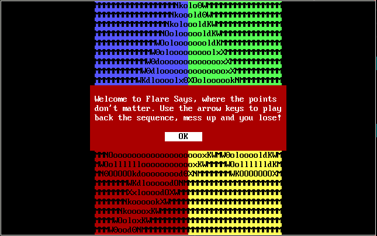
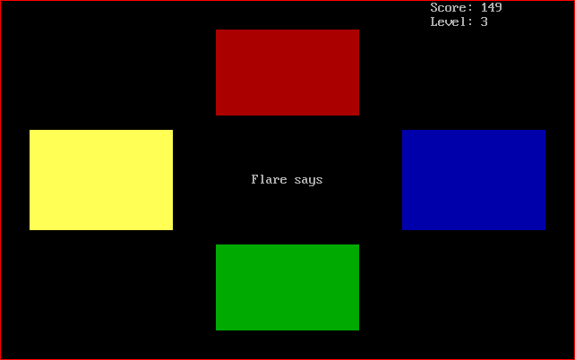
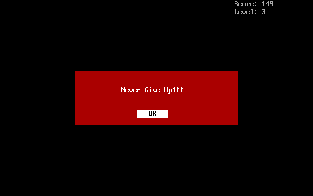
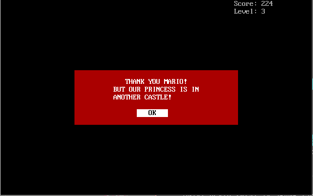
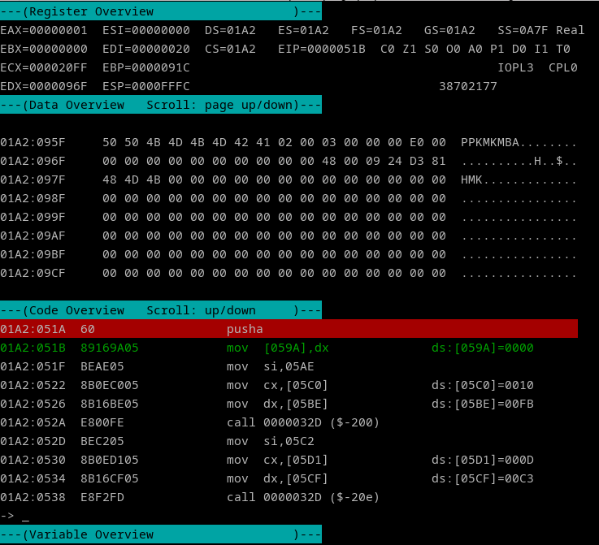

## Flare-On 2023 - #6 FlareSay
___

### Description: 

*You’re doing great champ! This challenge is a modern (and retro) take on the classic game*
*Simon Says. The cool thing about this one though is it will make you give up, and maybe take*
*that sales job after all. It’s better for everybody that way.*

`7-zip password: flare`
___

### Solution:

This was a very interesting challenge. We are given a "hybrid" binary that can run both in normal
and in DOS mode. 

#### Reversing in PE mode

We first open the executable in IDA and try to analyze it as a Windows PE binary. There is a lot
of extra code that cannot be disassembled. Furthermore, there is no `start` function, so we load
the executable on [CFF Explorer](https://ntcore.com/?page_id=388) and we check the
`AddressOfEntryPoint` which is `0x8F40`, so we start from there:
```c
void __stdcall u_entry_point() {
  /* ... */
  // get a buffer using relative addressing
  empty_buf = u_get_relative_buf(1i64);
  chksum = 0;
  empty_buf_ = empty_buf;
  ptr = (empty_buf + 2);
  i = 4i64;
  do {
    b1 = *(ptr - 2);
    b2 = *(ptr - 1);
    ptr += 4;
    v7 = (b1 + __ROL4__(chksum, 7)) ^ chksum;
    v8 = (b2 + __ROL4__(v7, 7)) ^ v7;
    v9 = (*(ptr - 4) + __ROL4__(v8, 7)) ^ v8;
    chksum = (*(ptr - 3) + __ROL4__(v9, 7)) ^ v9;
    --i;
  } while ( i );
  if ( chksum == 0x31D9F5FF ) {
    ciphertext_len = u_get_ciphertext_size_0x54();
    ciphertext = u_get_relative_buf(2i64);
    u_salsa20_decrypt(empty_buf_, ciphertext, ciphertext_len);
    cipher = u_get_relative_buf(2i64);
    Winning = u_get_relative_buf(3i64);
    u_string_ctor(str_1, Winning);
    u_string_ctor(str_2, cipher);
    v16[2] = 48i64;
    v16[0] = str_2;
    v16[1] = str_1;
    v16[3] = 0xFFFFFFFFi64;
    (DO_SYSCALL)(0x50000018i64, 4i64, 3i64, v16, 0, &v17);
  }
}
```

This function uses relative addressing to get a buffer (with index **#1**). Then it computes the
checksum of it and if it is `0x31D9F5FF`, it uses it as a key to decrypt the buffer at index **#2**
using a modified `Salsa20` algorithm and display the message contained in buffer with index **#3**.

Buffers are obtained using relative addressing:
```c
__int64 __fastcall u_get_relative_buf(__int64 a1) {
  switch ( a1 ) {
    case 1i64:
      u_far_return();
      JUMPOUT(0x408E85i64);
    case 2i64:
      u_far_return();
      JUMPOUT(0x408EA0i64);
    case 3i64:
      u_far_return();
      JUMPOUT(0x408EF9i64);
  }
  return 0i64;
}
```

```assembly
HEADER:0000000000408E6A ; __int64 u_far_return()
HEADER:0000000000408E6A u_far_return proc near                  ; CODE XREF: u_get_relative_buf:loc_408E80↓p
HEADER:0000000000408E6A                                         ; u_get_relative_buf:loc_408E9B↓p ...
HEADER:0000000000408E6A         pop     rax
HEADER:0000000000408E6B         retn
HEADER:0000000000408E6B u_far_return endp ; sp-analysis failed
```

```assembly
HEADER:0000000000408E80 loc_408E80:                             ; CODE XREF: u_get_relative_buf+4↑j
HEADER:0000000000408E80         call    u_far_return
HEADER:0000000000408E80 ; ---------------------------------------------------------------------------
HEADER:0000000000408E85 loc_408E85 db 0,0,0,0,0,0,0,0,0,0,0,0,0,0,0,0
HEADER:0000000000408E95
......
HEADER:0000000000408E9B loc_408E9B:                             ; CODE XREF: u_get_relative_buf+A↑j
HEADER:0000000000408E9B         call    u_far_return
HEADER:0000000000408E9B ; ---------------------------------------------------------------------------
HEADER:0000000000408EA0         db 39h, 29h, 0CFh, 6Dh, 0A8h, 0E0h, 1Ch, 0EBh, 0AAh, 6Eh, 0B3h
HEADER:0000000000408EAB         db 0A4h, 0E1h, 0BCh, 72h, 98h, 14h, 9Ch, 59h, 49h, 7Fh, 0F3h, 0BAh
HEADER:0000000000408EB7         db 0DCh, 8Fh, 0D8h, 79h, 0C1h, 2Eh, 0Eh, 0DFh, 2Ah, 0F8h, 0C5h
HEADER:0000000000408EC2         db 0CEh, 25h, 0D0h, 0EFh, 10h, 1, 0Bh, 0CAh, 0A6h, 0F2h, 79h, 1
HEADER:0000000000408ECE         db 9Ah, 98h, 7Eh, 71h, 0FEh, 1Fh, 0A8h, 0A6h, 9Dh, 0C9h, 7Bh, 0A3h
HEADER:0000000000408EDA         db 1Dh, 0BDh, 17h, 0B3h, 0Ah, 88h, 0E5h, 0DFh, 21h, 78h, 29h, 6Bh
HEADER:0000000000408EE6         db 83h, 52h, 8Eh, 0BDh, 0E9h, 0B2h, 7Ch, 0EEh, 5, 52h, 8Eh, 9
HEADER:0000000000408EF2         db 63h, 0D9h
HEADER:0000000000408EF4 ; ---------------------------------------------------------------------------
HEADER:0000000000408EF4
HEADER:0000000000408EF4 loc_408EF4:                             ; CODE XREF: u_get_relative_buf+10↑j
HEADER:0000000000408EF4         call    u_far_return
HEADER:0000000000408EF4 ; ---------------------------------------------------------------------------
HEADER:0000000000408EF9 aW      db 'W',0
HEADER:0000000000408EFB aI      db 'i',0
HEADER:0000000000408EFD aN      db 'n',0
HEADER:0000000000408EFF aN_0    db 'n',0
HEADER:0000000000408F01 aI_0    db 'i',0
HEADER:0000000000408F03 aN_1    db 'n',0
HEADER:0000000000408F05 aG      db 'g',0
HEADER:0000000000408F07         db    0
HEADER:0000000000408F08         db    0
```

Interestingly, buffer **#1** (which contains the key is empty). Buffer **#2** contains the encrypted
flag and buffer **#3** is the goodboy message.

Finally we have the -modified- [Salsa20](https://en.wikipedia.org/wiki/Salsa20) decryption.
Instead of using the constant words `expand 32-byte k`. it uses the words `flare-norocks!!!`
(`n` and `o` are flipped, so that should be a typo). Please also note the anti-debugging check:
The values of `key1_rol`, `key2_rol` and `key3_rol` are different depending on whether the program
is being debugged or not:
```c
void __fastcall u_salsa20_decrypt(int *a1_key, _BYTE *a2_cipher, unsigned int a3_len) {
  int BeingDebugged; // r9d
  unsigned int i; // ebx
  int key3_rol; // r13d
  __int64 blk_id; // rdi
  int key1; // [rsp+20h] [rbp-79h]
  int key1_rol; // [rsp+24h] [rbp-75h]
  int key2_rol; // [rsp+28h] [rbp-71h]
  int init_state[16]; // [rsp+30h] [rbp-69h] BYREF
  char key_stream_[32]; // [rsp+70h] [rbp-29h] BYREF
  char key_stream[32]; // [rsp+90h] [rbp-9h] BYREF

  BeingDebugged = NtCurrentPeb()->BeingDebugged;
  i = 0;
  key1 = *a1_key;
  memset(key_stream_, 0, sizeof(key_stream_));
  // 1 << (1 << 1) = 4
  key1_rol = __ROL4__(
               key1,
               (NtCurrentPeb()->BeingDebugged + 1) << ((BeingDebugged + 1) << (NtCurrentPeb()->BeingDebugged + 1)));// 4
  // 1 << ((1 << 1) + 1)) = 8
  key2_rol = __ROL4__(
               a1_key[1],
               (NtCurrentPeb()->BeingDebugged + 1) << (((NtCurrentPeb()->BeingDebugged + 1) << (NtCurrentPeb()->BeingDebugged
                                                                                              + 1))
                                                     + NtCurrentPeb()->BeingDebugged
                                                     + 1));
  //  (1 << (1 << 1)) * ((1 << 1) + 1)) = 4 * 3 = 12 = 0xC
  key3_rol = __ROL4__(
               a1_key[2],
               ((NtCurrentPeb()->BeingDebugged + 1) << ((NtCurrentPeb()->BeingDebugged + 1) << (NtCurrentPeb()->BeingDebugged
                                                                                              + 1)))
             * (((NtCurrentPeb()->BeingDebugged + 1) << (NtCurrentPeb()->BeingDebugged + 1))
              + NtCurrentPeb()->BeingDebugged
              + 1));
  if ( a3_len ) {                               // should be 0x54
    do {
      blk_id = i & 0x8000001F;
      if ( (i & 0x8000001F) == 0 )  {           // if we run out of key stream, generate more
        init_state[0] = 'ralf';                 // salsa 20 initial state
        init_state[1] = key1;
        init_state[3] = i ^ key1;               // flip 1 bit (i is multiple of 0x20)
        init_state[6] = key1_rol;
        init_state[11] = key2_rol;
        init_state[2] = ~key1;
        init_state[5] = 'on-e';
        init_state[10] = 'kcor';
        init_state[12] = key3_rol;
        init_state[4] = i ^ key1_rol;
        init_state[15] = '!!!s';
        init_state[7] = ~key1_rol;
        init_state[8] = ~key2_rol;
        init_state[9] = i ^ key2_rol;           // flip 1 bit
        init_state[13] = ~key3_rol;
        init_state[14] = i ^ key3_rol;          // flip 1 bit
        memset(key_stream, 0, sizeof(key_stream));
        u_salsa20_block(key_stream, init_state);
        *key_stream_ = *key_stream;
        *&key_stream_[16] = *&key_stream[16];
      }
      ++i;
      *a2_cipher++ ^= key_stream_[blk_id];
    } while ( i < a3_len );
  }
}
```

Everything is good so far, however the only problem is that the key is initialized to `0` and
nowhere in the program this key is modified. Hence, we have to look at the DOS side of the
binary.

#### Reversing in DOS mode

To run the program in DOS mode we use [DosBox](https://www.dosbox.com/). It shows the Flare-On
logo and then starts a game, where the four boxes are clicked in a random sequence and you have
to repeat it correctly:





If you press an incorrect box, you will get the badboy message:



Unfortunately IDA pro does not support decompilation of the 16-bit code, so we have to do all the
work in assembly :$ Execution starts from address `0`:

```assembly
seg000:0000         public start
seg000:0000 start   proc near
seg000:0000         call    u_entry_point
seg000:0003         retn
seg000:0003 start   endp
seg000:0003
seg000:0004 aThisProgramCan db '!This program cannot be run in DOS mode.',0Dh,0Dh,0Ah,'$'
seg000:0030
seg000:0030 u_entry_point proc near                 ; CODE XREF: start↑p
seg000:0030         mov     ax, seg seg006
seg000:0033         mov     ss, ax
seg000:0035         mov     sp, 20h ; ' '
seg000:0038         mov     ax, seg seg000
seg000:003B         mov     ds, ax
seg000:003D         assume ds:seg000
seg000:003D         mov     es, ax
seg000:003F         assume es:seg000
seg000:003F         mov     fs, ax
seg000:0041         assume fs:seg000
seg000:0041         mov     gs, ax
seg000:0043         assume gs:seg000
seg000:0043         mov     bl, 0
seg000:0045         mov     ax, 1003h
seg000:0048         int     10h                     ; - VIDEO - TOGGLE INTENSITY/BLINKING BIT (Jr, PS, TANDY 1000, EGA, VGA)
seg000:0048                                         ; BL = 00h enable background intensity
seg000:0048                                         ; = 01h enable blink
seg000:004A         mov     ch, 20h ; ' '
seg000:004C         mov     ah, 1
seg000:004E         mov     al, 3
seg000:0050         int     10h                     ; - VIDEO - SET CURSOR CHARACTERISTICS
seg000:0050                                         ; CH bits 0-4 = start line for cursor in character cell
seg000:0050                                         ; bits 5-6 = blink attribute
seg000:0050                                         ; CL bits 0-4 = end line for cursor in character cell
seg000:0052         call    u_scroll_page_up
seg000:0055         call    sub_108AE
seg000:0058         call    u_game_loop
seg000:005B         call    u_scroll_page_up
seg000:005E         xor     dx, dx
seg000:0060         call    u_set_cursor_pos
seg000:0063         mov     ax, 4C00h
seg000:0066         int     21h                     ; DOS - 2+ - QUIT WITH EXIT CODE (EXIT)
seg000:0066 u_entry_point endp                      ; AL = exit code
```

All the work takes place inside `u_game_loop`:
```assembly
seg000:0411 u_game_loop proc near                   ; CODE XREF: u_entry_point+28↑p
seg000:0411         pusha
seg000:0412         call    u_decrypt_strings
seg000:0415
seg000:0415 GAME_LOOP:                              ; CODE XREF: u_game_loop+1B↓j
seg000:0415                                         ; u_game_loop+25↓j
seg000:0415         call    u_decrement_important
seg000:0418         call    u_display_score_n_level ; reversed
seg000:041B         call    u_generate_next_key_for_buf
seg000:041E         call    u_check_keystroke_sequence
seg000:0421         call    sub_105E1
seg000:0424         cmp     ax, 0
seg000:0427         jz      short BAD_BOY
seg000:0429         cmp     ax, 2
seg000:042C         jz      short GAME_LOOP
seg000:042E         inc     glo_arrow_seq_idx
seg000:0432         dec     glo_levels_left
seg000:0436         jnz     short GAME_LOOP
seg000:0438         dec     glo_arrow_seq_idx
seg000:043C         call    u_scroll_page_up
seg000:043F         call    u_display_score_n_level
seg000:0442         mov     dx, 96Fh                ; buffer at 0x96F
seg000:0445         call    u_x86_code_w_salsa20
seg000:0448         mov     si, 4B8h
seg000:044B         mov     cx, glo_encr_len_I
seg000:044F         mov     dx, glo_encr_key_I
seg000:0453         call    u_str_decrypt_xor       ; '            THANK YOU MARIO!'
seg000:0456         mov     si, 4D9h
seg000:0459         mov     cx, glo_encr_len_K
seg000:045D         mov     dx, glo_encr_key_K
seg000:0461         call    u_str_decrypt_xor       ; '         BUT OUR PRINCESS IS IN'
seg000:0464         mov     si, 4FDh
seg000:0467         mov     cx, glo_encr_len_L
seg000:046B         mov     dx, glo_encr_key_L
seg000:046F         call    u_str_decrypt_xor       ; '         ANOTHER CASTLE!'
seg000:0472         mov     ax, 4B8h
seg000:0475         mov     bx, 4D9h
seg000:0478         mov     cx, 4FDh
seg000:047B         xor     dx, dx
seg000:047D         inc     dx
seg000:047E         call    u_write_chars_to_cursor
seg000:0481         mov     dx, seg seg004
seg000:0484         mov     ax, 0
seg000:0487         call    sub_101FC
seg000:048A         popa
seg000:048B         retn
seg000:048C
seg000:048C BAD_BOY:                                ; CODE XREF: u_game_loop+16↑j
seg000:048C         call    u_scroll_page_up
seg000:048F         call    u_display_score_n_level
seg000:0492         mov     si, 0A1Dh
seg000:0495         mov     cx, glo_encr_len_C
seg000:0499         mov     dx, glo_encr_key_C
seg000:049D         call    u_str_decrypt_xor       ; '           Never Give Up!!!'
seg000:04A0         xor     ax, ax
seg000:04A2         mov     bx, 0A1Dh
seg000:04A5         xor     cx, cx
seg000:04A7         xor     dx, dx
seg000:04A9         inc     dx
seg000:04AA         call    u_write_chars_to_cursor
seg000:04AD         mov     dx, seg seg003
seg000:04B0         mov     ax, 0
seg000:04B3         call    sub_101FC
seg000:04B6         popa
seg000:04B7         retn
seg000:04B7 u_game_loop endp
```

First things first, all strings are encrypted using a single byte XOR. Function `u_str_decrypt_xor`
takes **3** arguments (`si`:the encrypted string, `cx`:the string length and `dx`: the decryption
key):
```assembly
seg000:032D u_str_decrypt_xor proc near             ; CODE XREF: u_decrypt_strings+12↓p
seg000:032D                                         ; u_decrypt_strings+20↓p ...
seg000:032D         pusha
seg000:032E         cmp     cx, bx
seg000:0330         jz      short loc_10340
seg000:0332
seg000:0332 loc_10332:                              ; CODE XREF: u_str_decrypt_xor+11↓j
seg000:0332         cmp     byte ptr [si], 0
seg000:0335         jz      short loc_1033D
seg000:0337         cmp     [si], dl
seg000:0339         jz      short loc_1033D
seg000:033B         xor     [si], dl
seg000:033D
seg000:033D loc_1033D:                              ; CODE XREF: u_str_decrypt_xor+8↑j
seg000:033D                                         ; u_str_decrypt_xor+C↑j
seg000:033D         inc     si
seg000:033E         loop    loc_10332
seg000:0340
seg000:0340 loc_10340:                              ; CODE XREF: u_str_decrypt_xor+3↑j
seg000:0340         popa
seg000:0341         retn
seg000:0341 u_str_decrypt_xor endp
```

The encrypted string, the key and the string length are all globals. Here're a few:
```assembly
seg000:04B8 glo_encr_str_I db 0Ch dup(94h), 0E0h, 0FCh, 0F5h, 0FAh, 0FFh, 94h, 0EDh, 0FBh ; '            THANK YOU MARIO!'
seg000:04CC         db 0E1h, 94h, 0F9h, 0F5h, 0E6h, 0FDh, 0FBh, 95h, 0
seg000:04D5 glo_encr_key_I dw 0B4h                  ; DATA XREF: u_game_loop+3E↑r
seg000:04D7 glo_encr_len_I dw 1Dh                   ; DATA XREF: u_game_loop+3A↑r
seg000:04D9 glo_encr_str_K db 9 dup(0D1h), 0B3h, 0A4h, 0A5h, 0D1h, 0BEh, 0A4h, 0A3h, 0D1h ; '         BUT OUR PRINCESS IS IN'
seg000:04EA         db 0A1h, 0A3h, 0B8h, 0BFh, 0B2h, 0B4h, 2 dup(0A2h), 0D1h, 0B8h
seg000:04F4         db 0A2h, 0D1h, 0B8h, 0BFh, 0
seg000:04F9 glo_encr_key_K dw 0F1h                  ; DATA XREF: u_game_loop+4C↑r
seg000:04FB glo_encr_len_K dw 20h                   ; DATA XREF: u_game_loop+48↑r
seg000:04FD glo_encr_str_L db 9 dup(86h), 0E7h, 0E8h, 0E9h, 0F2h, 0EEh, 0E3h, 0F4h, 86h, 0E5h ; '         ANOTHER CASTLE!'
seg000:050F         db 0E7h, 0F5h, 0F2h, 0EAh, 0E3h, 87h, 0
seg000:0516 glo_encr_key_L dw 0A6h                  ; DATA XREF: u_game_loop+5A↑r
seg000:0518 glo_encr_len_L dw 19h                   ; DATA XREF: u_game_loop+56↑r
seg000:051A
```

The code does a lot of things to simulate the game, however we will focus only on what it is
important for the flag. Let's look at `u_generate_next_key_for_buf` that generates a pseudo-random
number and based on that it adds the next arrow key to the buffer (a very useful resource is the
[How to detect arrow keys in 16-bit DOS code](https://stackoverflow.com/questions/16939449/how-to-detect-arrow-keys-in-16-bit-dos-code)):
```assembly
seg000:0641 u_generate_next_key_for_buf proc near   ; CODE XREF: u_game_loop+A↑p
seg000:0641         pusha
seg000:0642         mov     ax, 0
seg000:0645         mov     bx, 3
seg000:0648         call    u_find_next_rand_num
seg000:064B         mov     bx, glo_arrow_seq_idx
seg000:064F         dec     bx
seg000:0650         cmp     cx, 0
seg000:0653         jz      short UP
seg000:0655         cmp     cx, 1
seg000:0658         jz      short DOWN
seg000:065A         cmp     cx, 2
seg000:065D         jz      short LEFT
seg000:065F 0x97F = glo_arrow_seq
seg000:065F         mov     byte ptr [bx+97Fh], 4Dh ; 'M' ; right
seg000:0664         jmp     short END
seg000:0666
seg000:0666 LEFT:                                   ; CODE XREF: u_generate_next_key_for_buf+1C↑j
seg000:0666         mov     byte ptr [bx+97Fh], 4Bh ; 'K'
seg000:066B         jmp     short END
seg000:066D
seg000:066D UP:                                     ; CODE XREF: u_generate_next_key_for_buf+12↑j
seg000:066D         mov     byte ptr [bx+97Fh], 48h ; 'H'
seg000:0672         jmp     short END
seg000:0674
seg000:0674 DOWN:                                   ; CODE XREF: u_generate_next_key_for_buf+17↑j
seg000:0674         mov     byte ptr [bx+97Fh], 50h ; 'P'
seg000:0679
seg000:0679 END:                                    ; CODE XREF: u_generate_next_key_for_buf+23↑j
seg000:0679                                         ; u_generate_next_key_for_buf+2A↑j ...
seg000:0679         popa
seg000:067A         retn
seg000:067A u_generate_next_key_for_buf endp
```

The next pseudo-random number is computed using a
[Linear Congruential Generator (LCG)](https://en.wikipedia.org/wiki/Linear_congruential_generator):
```assembly
seg000:0098 u_random_seed dw 0                      ; DATA XREF: u_init_random_seed↑w
seg000:0098                                         ; u_do_LCG+1↓r .`
seg000:009A u_find_next_rand_num proc near          ; CODE XREF: u_generate_next_key_for_buf+7↓p
seg000:009A         push    dx
seg000:009B         push    bx                      ; bx = 3 (max)
seg000:009C         push    ax                      ; ax = 0 (min)
seg000:009D         sub     bx, ax                  ; bx = range
seg000:009F         call    u_do_LCG                ; eax = rnd
seg000:00A2         mov     dx, bx
seg000:00A4         add     dx, 1                   ; dx = range + 1
seg000:00A7         mul     dx                      ; dx = ax * dx (high 16 bits)
seg000:00A9         mov     cx, dx                  ; cx = (rnd * (range + 1)) >> 16
seg000:00AB         pop     ax
seg000:00AC         pop     bx
seg000:00AD         pop     dx
seg000:00AE         add     cx, ax                  ; cx += min (0)
seg000:00B0         retn
seg000:00B0 u_find_next_rand_num endp
seg000:00B1
seg000:00B1 u_do_LCG proc near                      ; CODE XREF: u_find_next_rand_num+5↑p
seg000:00B1         push    dx
seg000:00B2         mov     ax, u_random_seed:0549
seg000:0549 SEARCH_LOOP:                            ; CODE XREF: u_x86_code_w_salsa20+4C↓j
seg000:0549         mov     bx, glo_file_hdl
seg000:054D         mov     cx, 10h
seg000:0550         lea     dx, glo_read_buf
seg000:0554         mov     ah, 3Fh
seg000:0556         int     21h                     ; DOS - 2+ - READ FROM FILE WITH HANDLE
seg000:0556                                         ; BX = file handle, CX = number of bytes to read
seg000:0556                                         ; DS:DX -> buffer
seg000:0558         jb      short RETURN
seg000:055A         lea     si, glo_CC_array        ; 0xcc ?
seg000:055E         mov     di, dx
seg000:0560         mov     cx, 10h
seg000:0563         cld
seg000:0564         repe cmpsb                      ; search for the 0xCC array
seg000:0566         jnz     short SEARCH_LOOP
seg000:0568         mov     bx, glo_file_hdl
seg000:056C         xor     cx, cx
seg000:056E         mov     dx, 5                   ; move +5
seg000:0571         mov     al, 1
seg000:0573         mov     ah, 42h
seg000:0575         int     21h                     ; DOS - 2+ - MOVE FILE READ/WRITE POINTER (LSEEK)
seg000:0575                                         ; AL = method: offset from present location
seg000:0577         jb      short RETURN
seg000:0579         mov     bx, glo_file_hdl        ; write salsa20 key!
seg000:057D         mov     cx, 10h
seg000:0580         mov     dx, glo_write_buf
seg000:0584         mov     ah, 40h
seg000:0586         int     21h                     ; DOS - 2+ - WRITE TO FILE WITH HANDLE
seg000:0586                                         ; BX = file handle, CX = number of bytes to write, DS:DX -> buffer
seg000:0588         jb      short RETURN
seg000:058A         cmp     ax, cx
seg000:058C         jnz     short RETURN
seg000:058E         mov     bx, glo_file_hdl
seg000:0592         mov     ah, 3Eh
seg000:0594         int     21h                     ; DOS - 2+ - CLOSE A FILE WITH HANDLE
seg000:0594                                         ; BX = file handle
seg000:0596         jb      short $+2
seg000:0598
seg000:0598 RETURN:                                 ; CODE XREF: u_x86_code_w_salsa20+2A↑j
seg000:0598                                         ; u_x86_code_w_salsa20+3E↑j ...
seg000:0598         popa
seg000:0599         retn
seg000:0599 u_x86_code_w_salsa20 endp
seg000:00B5         mov     dx, 23167
seg000:00B8         mul     dx                      ; rnd * 23167
seg000:00BA         add     ax, 12409               ; rnd * 23167 + 12409
seg000:00BD         adc     dx, 0
seg000:00C0         mov     u_random_seed, ax       ; rnd = (rnd * 2316 + 12409) % 65536
seg000:00C3         pop     dx
seg000:00C4         retn
seg000:00C4 u_do_LCG endp
```

The `u_random_seed` is initialized in `u_init_random_seed`:
```assembly
seg000:0094
seg000:0094 u_init_random_seed proc near            ; CODE XREF: sub_108C3:loc_1094D↓p
seg000:0094         mov     u_random_seed, ax
seg000:0097         retn                            ; before patch: A3 98 00
seg000:0097 u_init_random_seed endp
```

Let's backtrack the execution flow of this function:
```assembly
seg000:08C3 sub_108C3 proc near                     ; CODE XREF: sub_108AE+10↑p
seg000:08C3         pusha
seg000:08C4         mov     di, 953h
seg000:08C7         xor     cx, cx
seg000:08C9         mov     al, 0
seg000:08CB         out     70h, al                 ; CMOS Memory/RTC Index Register:
seg000:08CB                                         ; RTC Seconds
seg000:08CD         in      al, 71h                 ; CMOS Memory/RTC Data Register
seg000:08CF         mov     byte_10952, al
seg000:08D2
......
seg000:094D
seg000:094D loc_1094D:                              ; CODE XREF: sub_108C3+76↑j
seg000:094D         call    u_init_random_seed
seg000:0950         popa
seg000:0951         retn
seg000:0951 sub_108C3 endp
```

```assembly
seg000:08AE sub_108AE proc near                     ; CODE XREF: u_entry_point+25↑p
seg000:08AE         pusha
seg000:08AF         mov     dx, seg seg005
seg000:08B2         mov     ax, 0
seg000:08B5         call    sub_10206
seg000:08B8         call    sub_1086F
seg000:08BB         call    sub_10856
seg000:08BE         call    sub_108C3
seg000:08C1         popa
seg000:08C2         retn
seg000:08C2 sub_108AE endp

; sub_108AE is called by the entry point
```

Therefore, if we patch the `u_random_seed` with a specific value, we can predict the arrow sequence.

Let's now see how we can win the game. If we go back to the `u_game_loop`, we can see that the
`glo_levels_left` -which is initialized to `0x80`- is decremented on every iteration:
```assembly
seg000:0415 GAME_LOOP:                              ; CODE XREF: u_game_loop+1B↓j
seg000:0415                                         ; u_game_loop+25↓j
seg000:0415         call    u_decrement_important
seg000:0418         call    u_display_score_n_level ; reversed
seg000:041B         call    u_generate_next_key_for_buf
seg000:041E         call    u_check_keystroke_sequence
seg000:0421         call    sub_105E1
seg000:0424         cmp     ax, 0
seg000:0427         jz      short BAD_BOY
seg000:0429         cmp     ax, 2
seg000:042C         jz      short GAME_LOOP
seg000:042E         inc     glo_arrow_seq_idx
seg000:0432         dec     glo_levels_left         ; <~ this has to become 0
seg000:0436         jnz     short GAME_LOOP
; Goodboy message
```

Therefore, if we simply patch the original value of `glo_levels_left` to something small
(e.g., **3**`), we can easily win the game:



However, that's not what we actually want. We go back to better understand the program.


If we win the game, function `u_game_loop` invokes `u_x86_code_w_salsa20` which does something
very interesting:
```assembly
seg000:051A u_x86_code_w_salsa20 proc near          ; CODE XREF: u_game_loop+34↑p
seg000:051A         pusha
seg000:051B         mov     glo_write_buf, dx
seg000:051F         mov     si, 5AEh                ; 0x5AE = 0xCC buf
seg000:0522         mov     cx, glo_CC_array_len
seg000:0526         mov     dx, glo_CC_array_key
seg000:052A         call    u_str_decrypt_xor       ; decrypt CC array
seg000:052D         mov     si, 5C2h
seg000:0530         mov     cx, glo_encr_len_J
seg000:0534         mov     dx, glo_encr_key_J
seg000:0538         call    u_str_decrypt_xor       ; flaresay.exe
seg000:053B         mov     al, 2
seg000:053D         mov     dx, 5C2h
seg000:0540         mov     ah, 3Dh
seg000:0542         int     21h                     ; DOS - 2+ - OPEN DISK FILE WITH HANDLE
seg000:0542                                         ; DS:DX -> ASCIZ filename
seg000:0542                                         ; AL = access mode
seg000:0542                                         ; 2 - read & write
seg000:0544         jb      short RETURN
seg000:0546         mov     glo_file_hdl, ax
seg000:0549
seg000:0549 SEARCH_LOOP:                            ; CODE XREF: u_x86_code_w_salsa20+4C↓j
seg000:0549         mov     bx, glo_file_hdl
seg000:054D         mov     cx, 10h
seg000:0550         lea     dx, glo_read_buf
seg000:0554         mov     ah, 3Fh
seg000:0556         int     21h                     ; DOS - 2+ - READ FROM FILE WITH HANDLE
seg000:0556                                         ; BX = file handle, CX = number of bytes to read
seg000:0556                                         ; DS:DX -> buffer
seg000:0558         jb      short RETURN
seg000:055A         lea     si, glo_CC_array        ; 0xcc ?
seg000:055E         mov     di, dx
seg000:0560         mov     cx, 10h
seg000:0563         cld
seg000:0564         repe cmpsb                      ; search for the 0xCC array
seg000:0566         jnz     short SEARCH_LOOP
seg000:0568         mov     bx, glo_file_hdl
seg000:056C         xor     cx, cx
seg000:056E         mov     dx, 5                   ; move +5
seg000:0571         mov     al, 1
seg000:0573         mov     ah, 42h
seg000:0575         int     21h                     ; DOS - 2+ - MOVE FILE READ/WRITE POINTER (LSEEK)
seg000:0575                                         ; AL = method: offset from present location
seg000:0577         jb      short RETURN
seg000:0579         mov     bx, glo_file_hdl        ; write salsa20 key!
seg000:057D         mov     cx, 10h
seg000:0580         mov     dx, glo_write_buf
seg000:0584         mov     ah, 40h
seg000:0586         int     21h                     ; DOS - 2+ - WRITE TO FILE WITH HANDLE
seg000:0586                                         ; BX = file handle, CX = number of bytes to write, DS:DX -> buffer
seg000:0588         jb      short RETURN
seg000:058A         cmp     ax, cx
seg000:058C         jnz     short RETURN
seg000:058E         mov     bx, glo_file_hdl
seg000:0592         mov     ah, 3Eh
seg000:0594         int     21h                     ; DOS - 2+ - CLOSE A FILE WITH HANDLE
seg000:0594                                         ; BX = file handle
seg000:0596         jb      short $+2
seg000:0598
seg000:0598 RETURN:                                 ; CODE XREF: u_x86_code_w_salsa20+2A↑j
seg000:0598                                         ; u_x86_code_w_salsa20+3E↑j ...
seg000:0598         popa
seg000:0599         retn
seg000:0599 u_x86_code_w_salsa20 endp
```

Yes, this function opens itself (`flaresay.exe`) and searches for a sequence of **16** `CC` bytes.
Once it finds them it goes to offset `+5` and writes the contents of the `glo_write_buf` which is
initialized with the `dx` parameter, which is the buffer at `96Fh`. We open the binary again in PE
mode and we search for the `CC` sequence:
```assembly
HEADER:0000000000408E70 CC         int     3                       ; Trap to Debugger
HEADER:0000000000408E71 CC         int     3                       ; Trap to Debugger
HEADER:0000000000408E72 CC         int     3                       ; Trap to Debugger
HEADER:0000000000408E73 CC         int     3                       ; Trap to Debugger
HEADER:0000000000408E74 CC         int     3                       ; Trap to Debugger
HEADER:0000000000408E75 CC         int     3                       ; Trap to Debugger
HEADER:0000000000408E76 CC         int     3                       ; Trap to Debugger
HEADER:0000000000408E77 CC         int     3                       ; Trap to Debugger
HEADER:0000000000408E78 CC         int     3                       ; Trap to Debugger
HEADER:0000000000408E79 CC         int     3                       ; Trap to Debugger
HEADER:0000000000408E7A CC         int     3                       ; Trap to Debugger
HEADER:0000000000408E7B CC         int     3                       ; Trap to Debugger
HEADER:0000000000408E7C CC         int     3                       ; Trap to Debugger
HEADER:0000000000408E7D CC         int     3                       ; Trap to Debugger
HEADER:0000000000408E7E CC         int     3                       ; Trap to Debugger
HEADER:0000000000408E7F CC         int     3                       ; Trap to Debugger
HEADER:0000000000408E80    ; START OF FUNCTION CHUNK FOR u_get_relative_buf
HEADER:0000000000408E80
HEADER:0000000000408E80    loc_408E80:                             ; CODE XREF: u_get_relative_buf+4↑j
HEADER:0000000000408Eu_x86_code_w_salsa2080 E8         call    u_far_return
HEADER:0000000000408E80 E5 ; END OF FUNCTION CHUNK FOR u_get_relative_buf
HEADER:0000000000408E80 FF
HEADER:0000000000408E80 FF
HEADER:0000000000408E80 FF
HEADER:0000000000408E80
HEADER:0000000000408E85 00 loc_408E85 db 0,0,0,0,0,0,0,0,0,0,0,0,0,0,0,0
```

That is, `u_x86_code_w_salsa20` writes the `Salsa20` key to the binary!
Therefore **we need to figure out what is stored in the buffer at `96Fh`**.
Let's go back to `sub_105E1` which is called in `u_game_loop`:
```assembly
seg000:05E1 sub_105E1 proc near                     ; CODE XREF: u_game_loop+10↑p
seg000:05E1         pusha
seg000:05E2         xor     bx, bx                  ; bx = i = 0
seg000:05E4         xor     dx, dx                  ; dx = j = 0
seg000:05E6         mov     cx, glo_arrow_seq_idx   ; c = current level
seg000:05EA         mov     glo_curr_score, 0
seg000:05F0
seg000:05F0 LOOP:                                   ; CODE XREF: sub_105E1+28↓j
seg000:05F0         mov     dl, [bx+97Fh]           ; glo_arrow_seq
seg000:05F4         call    u_get_keystroke
seg000:05F7         call    u_process_keystroke
seg000:05FA         cmp     al, 72h ; 'r'
seg000:05FC         jz      short RETURN_2_CONTINUE
seg000:05FE         cmp     ah, dl
seg000:0600         jnz     short RETURN_0_BADBOY
seg000:0602         add     glo_curr_score, dx      ; compute total score
seg000:0606         inc     bx                      ; ++i
seg000:0607         cmp     cx, bx
seg000:0609         jnz     short LOOP              ; glo_arrow_seq
seg000:060B         mov     dx, glo_curr_score
seg000:060F         mov     glo_score, dx
seg000:0613         mov     ax, 96Fh
seg000:0616         mov     bx, dx
seg000:0618         call    u_COMPUTE_SALSA20_KEY
seg000:061B         push    cx
seg000:061C         mov     di, 96Fh                ; IMPORTANT BUFFER!
seg000:061F         mov     si, ax                  ; source operand is from ax
seg000:0621         mov     cx, 8
seg000:0624         rep movsw
seg000:0626         pop     cx
seg000:0627         popa
seg000:0628         mov     eax, 1
seg000:062E         retn
seg000:062F
seg000:062F RETURN_0_BADBOY:                        ; CODE XREF: sub_105E1+1F↑j
seg000:062F         popa
seg000:0630         xor     eax, eax
seg000:0633         retn
seg000:0634
seg000:0634 RETURN_2_CONTINUE:                      ; CODE XREF: sub_105E1+1B↑j
seg000:0634         call    sub_1068E
seg000:0637         popa
seg000:0638         mov     eax, 2
seg000:063E         retn
seg000:063E sub_105E1 endp
```

Each arrow in the sequence, adds a different value to the `glo_curr_score`. More specifically, for
every arrow key pressed, it adds its ASCII value to the total score:
```
  Right ~> 'M' = 0x4D
  Left  ~> 'K' = 0x4B
  Up    ~> 'H' = 0x48
  Down  ~> 'P' = 0x50
```

However, the most important function is `u_COMPUTE_SALSA20_KEY` which computes an **128-bit** number
from the arrow sequence (a combination of the letters `H`, `P`, `K` and `M`):
```assembly
seg000:017E u_COMPUTE_SALSA20_KEY proc near         ; CODE XREF: sub_105E1+37↓p
seg000:017E         pusha
seg000:017F         push    ax                      ; ax = 0x96F (key)
seg000:0180         push    ax
seg000:0181         mov     dx, 6                   ; exponent = 6
seg000:0184         call    u_oword_2_pow
seg000:0187         mov     di, 1BAh                ; 0xFA = x * 2^6
seg000:018A         mov     si, ax
seg000:018C         mov     cx, 8
seg000:018F         rep movsw                       ; result1 = x * 2^6
seg000:0191         pop     ax                      ; ax = key
seg000:0192         mov     dx, 10h
seg000:0195         call    u_oword_2_pow           ; ax = x * 2^16
seg000:0198         mov     dx, 1BAh                ; dx = result1
seg000:019B         call    u_oword_add
seg000:019E         push    ax                      ; ax = 0x134 = x*2^6 + x*2^16
seg000:019F         mov     si, 1CAh
seg000:01A2         add     si, 0Eh
seg000:01A5         mov     [si], bx                ; bx = ax = total score
seg000:01A7         mov     ax, 1CAh                ; result2 = 0x134
seg000:01AA         pop     dx                      ; dx = ax = x*2^6 + x*2^16
seg000:01AB         call    u_oword_add
seg000:01AE         pop     dx                      ; ax = x*2^6 + x*2^16 + 0x134; dx = key ?
seg000:01AF         call    u_oword_sub
seg000:01B2         mov     glo_result_3, ax        ; key is here!
seg000:01B5         popa
seg000:01B6         mov     ax, glo_result_3
seg000:01B9         retn
seg000:01B9 u_COMPUTE_SALSA20_KEY endp
```

Functions `u_oword_2_pow`, `u_oword_add` and `u_oword_sub` are power module, addition and
subtraction on **128** bit numbers:
```assembly
seg000:010A u_oword_add proc near                   ; CODE XREF: u_COMPUTE_SALSA20_KEY+1D↓p
seg000:010A                                         ; u_COMPUTE_SALSA20_KEY+2D↓p
seg000:010A         pusha
seg000:010B         mov     di, ax
seg000:010D         add     di, 0Eh                 ; di = bufA + 0xe
seg000:0110         mov     si, dx
seg000:0112         add     si, 0Eh                 ; si = bufB + 0xe
seg000:0115         mov     bx, 134h
seg000:0118         add     bx, 0Eh                 ; bx = bufC + 0xe
seg000:011B         clc
seg000:011C         mov     cx, 8
seg000:011F
seg000:011F LOOP:                                   ; CODE XREF: u_oword_add+23↓j
seg000:011F         mov     ax, [di]
seg000:0121         mov     dx, [si]
seg000:0123         adc     ax, dx
seg000:0125         mov     [bx], ax                ; bufC[i] = bufA[i] + bufB[i]
seg000:0127         dec     si
seg000:0128         dec     si
seg000:0129         dec     di
seg000:012A         dec     di
seg000:012B         dec     bx
seg000:012C         dec     bx
seg000:012D         loop    LOOP
seg000:012F         popa
seg000:0130         mov     ax, 134h
seg000:0133         retn
seg000:0133 u_oword_add endp
```

```assembly
seg000:0144 u_oword_sub proc near                   ; CODE XREF: u_COMPUTE_SALSA20_KEY+31↓p
seg000:0144         pusha
seg000:0145         mov     di, ax
seg000:0147         add     di, 0Eh                 ; di = bufA + 0xe
seg000:014A         mov     si, dx
seg000:014C         add     si, 0Eh                 ; si = bufB + 0xe
seg000:014F         mov     bx, 16Eh
seg000:0152         add     bx, 0Eh                 ; bx = bufC = 0xe
seg000:0155         clc
seg000:0156         mov     cx, 8
seg000:0159
seg000:0159 LOOP:                                   ; CODE XREF: u_oword_sub+23↓j
seg000:0159         mov     ax, [di]
seg000:015B         mov     dx, [si]
seg000:015D         sbb     ax, dx
seg000:015F         mov     [bx], ax                ; bufC[i] = bufA[i] - bufB[i]
seg000:0161         dec     si
seg000:0162         dec     si
seg000:0163         dec     di
seg000:0164         dec     di
seg000:0165         dec     bx
seg000:0166         dec     bx
seg000:0167         loop    LOOP
seg000:0169         popa
seg000:016A         mov     ax, 16Eh
seg000:016D         retn
seg000:016D u_oword_sub endp
```

```assembly
seg000:00C5
seg000:00C5 u_oword_2_pow proc near                 ; CODE XREF: u_COMPUTE_SALSA20_KEY+6↓p
seg000:00C5                                         ; u_COMPUTE_SALSA20_KEY+17↓p
seg000:00C5         pusha
seg000:00C6         mov     si, ax                  ; ax = bufA
seg000:00C8         mov     di, 0FAh                ; di = 0xFA = bufB = out
seg000:00CB
seg000:00CB OUTER_LOOP:                             ; CODE XREF: u_oword_2_pow+2E↓j
seg000:00CB         mov     ax, [si]
seg000:00CD         shl     ax, 1
seg000:00CF         mov     [di], ax                ; bufB[i] = bufA[i] << 1
seg000:00D1         inc     si
seg000:00D2         inc     si
seg000:00D3         inc     di                      ; i += 2
seg000:00D4         inc     di
seg000:00D5         mov     cx, 7
seg000:00D8
seg000:00D8 INNER_LOOP:                             ; CODE XREF: u_oword_2_pow+23↓j
seg000:00D8         mov     ax, [si]
seg000:00DA         shl     ax, 1
seg000:00DC         jnb     short loc_100E2         ; bufB[i] = bufA[i] << 1
seg000:00DE         add     word ptr [di-2], 1      ; carry
seg000:00E2
seg000:00E2 loc_100E2:                              ; CODE XREF: u_oword_2_pow+17↑j
seg000:00E2         mov     [di], ax                ; bufB[i] = bufA[i] << 1
seg000:00E4         inc     si
seg000:00E5         inc     si
seg000:00E6         inc     di
seg000:00E7         inc     di
seg000:00E8         loop    INNER_LOOP
seg000:00EA         mov     si, 0FAh
seg000:00ED         mov     di, 0FAh
seg000:00F0         dec     dx                      ; dx = multiplier
seg000:00F1         test    dx, dx
seg000:00F3         jnz     short OUTER_LOOP
seg000:00F5         popa
seg000:00F6         mov     ax, 0FAh
seg000:00F9         retn
seg000:00F9 u_oword_2_pow endp
```

More specifically, the `Salsa20` key -which is the `bignum` below- is computed based on the current
`score` which is basically the **sum of all ASCII codes of the arrow sequence**:
```python
bignum = (bignum * 2**6 + bignum * 2**16 + score - bignum)
bignum &= 0xFFFFFFFFFFFFFFFFFFFFFFFFFFFFFFFF
```

We can also verify these numbers on the **DosBox Debugger**:




#### Breaking the Salsa20 Key

At this point we know everything. To get the `Salsa20` key for the executable in the PE mode, we
have to win the game (pass **128** levels) and use the **128** letter arrow sequence to generate
an **128-bit** number, which is our key.

However, which sequence is the correct one? Recall that program initializes a **16-bit**
`u_random_seed`, and based on that it uses a
[Linear Congruential Generator (LCG)](https://en.wikipedia.org/wiki/Linear_congruential_generator)
to generate the arrow sequence.

Therefore, there are only **65536** different sequences that the program can generate. Given that,
we can do a brute force: For every possible seed, we generate an arrow sequence which is **128**
long and we compute the `bignum`. Then we check if the checksum of the `bignum` is `0x31D9F5FF`.
If it is, we have found the correct key.

We let our script run and after a while we find that the correct seed is `3082`, which gives the
following sequence:
```
  KPKMPHPMMHMMPMPKHMHKKMKKHKPPMKMPPKPHMPHHKPKHHPHMMHMMPHPMMMMKKMKK
  HMHKKKKPPKPPMKMPPPKHHPHHKPKMHHPMMHMMPHPKHMHKKMKKHKHPMKMPPKPPMPHH
```

This sequence gives the following `bignum`:
```
  2B 4F 9D F2 E6 85 93 B8 12 D0 C1 C6 4C 4B 8B 30
```

#### Getting the Flag

At this point we have the correct key (`2B 4F 9D F2 E6 85 93 B8 12 D0 C1 C6 4C 4B 8B 30`), so we 
can go back to the binary (in PE mode) and patch it at buffer **#1** (`0x408E85`), run the
program (we have to be careful and bypass the anti-debugging checks inside `u_salsa20_decrypt`)
and get the flag:
```
0000000000408EA0  48 00 61 00 24 00 68 00  74 00 61 00 67 00 5F 00  H.a.$.h.t.a.g._.
0000000000408EB0  6E 00 30 00 5F 00 72 00  63 00 34 00 5F 00 61 00  n.0._.r.c.4._.a.
0000000000408EC0  4E 00 64 00 5F 00 54 00  68 00 33 00 6E 00 5F 00  N.d._.T.h.3.n._.
0000000000408ED0  73 00 30 00 6D 00 65 00  40 00 66 00 6C 00 61 00  s.0.m.e.@.f.l.a.
0000000000408EE0  72 00 65 00 2D 00 6F 00  6E 00 2E 00 63 00 6F 00  r.e.-.o.n...c.o.
0000000000408EF0  6D 00 00 00 E8 71 FF FF  FF 57 00 69 00 6E 00 6E  m........W.i.n.n
0000000000408F00  00 69 00 6E 00 67 00 00  00 CC CC CC CC CC CC CC  .i.n.g..........
```

For more details, please refer to the [flaresay_crack.py](./flaresay_crack.py) script.

So, the flag is: `Ha$htag_n0_rc4_aNd_Th3n_s0me@flare-on.com`
___
