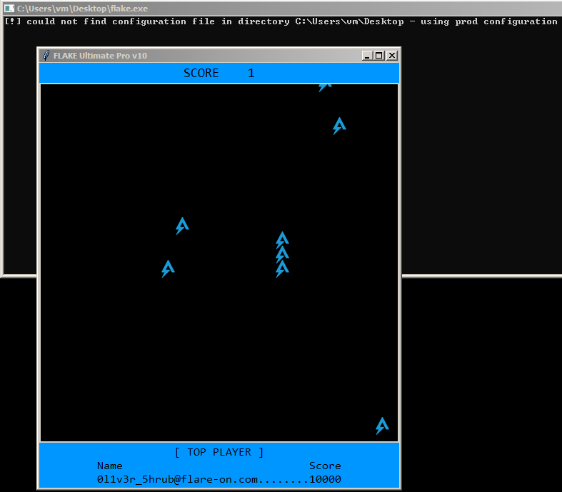
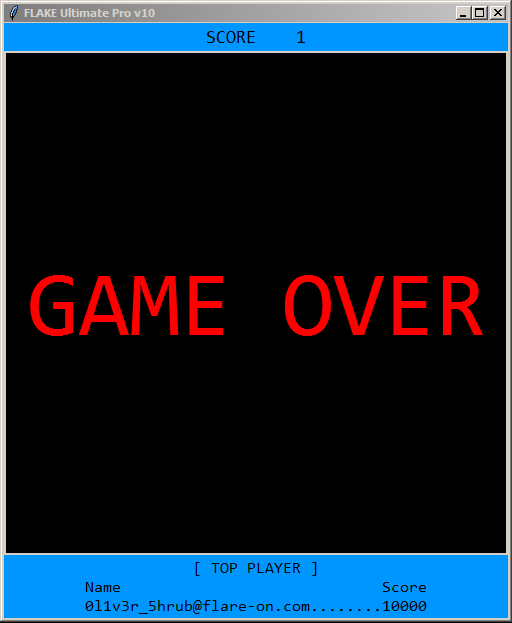
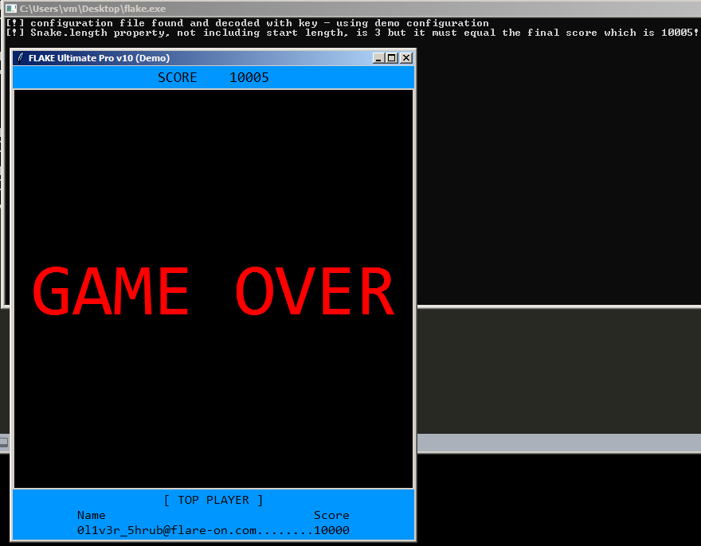

## Flare-On 2023 - #7 flake
___

### Description: 

*Subject: need your help...*

*Oliver Shrub, Gardens Department Head, keeps bragging about his high score for this rip off Snake*
*game called Flake. I'm pretty sure he found a way to cheat the game because there is no way it's*
*possible to score 10,000 points...I mean the game ships with a sketchy TXT file so there must be*
*something fishy going on here.*

*Can you look at the game and let me know how I can beat Oliver's high score?*

*Best,*

*Nox Shadows Department Head*

`7-zip password: flare`
___

### Solution:

This challenge was quite similar to the
[The challenge that shall not be named](https://github.com/ispoleet/flare-on-challenges/tree/master/flare-on-2022/11_the_challenge_that_shall_not_be_named)
from last year's Flare-On. This challenge is a snake game:



If you hit a wall or the snake itself, you will lose:




The goal here is to beat the score of `0l1v3r_5hrub@flare-on.com` which is `10000`.
We load the binary, which is fairly large. Inside `main` there is an interesting statement:
```c
SetEnvironmentVariableA("NUITKA_ONEFILE_PARENT", (LPCSTR)Value);
```

After some online searching we find that [Nuitka](https://github.com/Nuitka/Nuitka), is Python
compiler for producing `.exe` files from Python code. Compared to
[PyInstaller](https://pyinstaller.org/en/stable/) which simply packs all python files together
and unpacks them at runtime, [Nuitka](https://github.com/Nuitka/Nuitka) translates Python code into
C and then compiles the result into a native executable.Therefore a straightforward reversing is
hard so we need to find a side channel.

Let's go back to `main`:
```c
int __fastcall main(int argc, const char **argv, const char **envp) {
  /* ... */
  if ( !u_resolve_env_vars(&tmp_file, L"%TEMP%\\onefile_%PID%_%TIME%", 4096i64) )
    u_abort(L"%TEMP%\\onefile_%PID%_%TIME%");
  if ( !SetConsoleCtrlHandler((PHANDLER_ROUTINE)HandlerRoutine, 1) )
    u_abort_0("Error, failed to register signal handler.");
  ResourceA = FindResourceA(0i64, (LPCSTR)0x1B, (LPCSTR)0xA);
  Resource = LoadResource(0i64, ResourceA);
  glo_resource = (__int64)LockResource(Resource);
  v5 = *(unsigned __int16 *)glo_resource;
  v6 = *(unsigned __int8 *)(glo_resource + 2);
  hdr[0] = *(_WORD *)glo_resource;
  glo_resource_data = glo_resource + 3;
  if ( hdr[0] != 'AK' || (_BYTE)v6 != 'Y' )
    u_abort_invalid_header(v5, v6);
  qword_14002E5B0 = 0i64;
  qword_140034DD0 = j__malloc_base(0x20000ui64);
  /* ... */
  CurrentProcessId = GetCurrentProcessId();
  swprintf((wchar_t *const)Value, 0x80ui64, "%d", CurrentProcessId);
  SetEnvironmentVariableA("NUITKA_ONEFILE_PARENT", (LPCSTR)Value);
  StartupInfo.cb = 104;
  memset(&StartupInfo.cb + 1, 0, 100);
  CommandLineW = GetCommandLineW();
  if ( !CreateProcessW(
          &ApplicationName,
          CommandLineW,
          0i64,
          0i64,
          0,
          0x20u,
          0i64,
          0i64,
          &StartupInfo,
          &ProcessInformation) ) {
    LastError = GetLastError();
    sub_14000A980(v30, LastError);
  }
  /* ... */

```

There is a resource which is dropped under `%TEMP%\\onefile_%PID%_%TIME%` (e.g.,
`onefile_2928_133416806753208300`) directory, that contains a large number of files:
```
api-ms-win-core-console-l1-1-0.dll             api-ms-win-core-synch-l1-2-0.dll       _decimal.pyd
api-ms-win-core-datetime-l1-1-0.dll            api-ms-win-core-sysinfo-l1-1-0.dll     flake.exe*
api-ms-win-core-debug-l1-1-0.dll               api-ms-win-core-timezone-l1-1-0.dll    flake.exe.i64
api-ms-win-core-errorhandling-l1-1-0.dll       api-ms-win-core-util-l1-1-0.dll        flare.png
api-ms-win-core-file-l1-1-0.dll                api-ms-win-crt-conio-l1-1-0.dll        libffi-7.dll
api-ms-win-core-file-l1-2-0.dll                api-ms-win-crt-convert-l1-1-0.dll      _lzma.pyd
api-ms-win-core-file-l2-1-0.dll                api-ms-win-crt-environment-l1-1-0.dll  PIL/
api-ms-win-core-handle-l1-1-0.dll              api-ms-win-crt-filesystem-l1-1-0.dll   python38.dll
api-ms-win-core-heap-l1-1-0.dll                api-ms-win-crt-heap-l1-1-0.dll         reshacker_setup.exe
api-ms-win-core-interlocked-l1-1-0.dll         api-ms-win-crt-locale-l1-1-0.dll       select.pyd
api-ms-win-core-libraryloader-l1-1-0.dll       api-ms-win-crt-math-l1-1-0.dll         _socket.pyd
api-ms-win-core-localization-l1-2-0.dll        api-ms-win-crt-process-l1-1-0.dll      tcl/
api-ms-win-core-memory-l1-1-0.dll              api-ms-win-crt-runtime-l1-1-0.dll      tcl8/
api-ms-win-core-namedpipe-l1-1-0.dll           api-ms-win-crt-stdio-l1-1-0.dll        tcl86t.dll
api-ms-win-core-processenvironment-l1-1-0.dll  api-ms-win-crt-string-l1-1-0.dll       tk/
api-ms-win-core-processthreads-l1-1-0.dll      api-ms-win-crt-time-l1-1-0.dll         tk86t.dll
api-ms-win-core-processthreads-l1-1-1.dll      api-ms-win-crt-utility-l1-1-0.dll      _tkinter.pyd
api-ms-win-core-profile-l1-1-0.dll             _bz2.pyd                               ucrtbase.dll
api-ms-win-core-rtlsupport-l1-1-0.dll          Crypto/                                unicodedata.pyd
api-ms-win-core-string-l1-1-0.dll              _ctypes.pyd                            vcruntime140.dll
api-ms-win-core-synch-l1-1-0.dll               d3m0_c0nf.txt
```

There is another `flake.exe` here which is different from the original (dropper) `flake.exe`. Let's 
look into that. Inside this binary there are some interesting strings:
```
u[!] bad configuration file - using prod configuration
u[!] configuration file found and decoded with key - using demo configuration
nnnu[!] could not find configuration file in directory 
u - using prod configuration
uXOR-encode d3m0_c0nf.txt with 0x22,0x11,0x91,0xff (I think Nuikta strips Python docstrings during compilation so no worries about this comment making its way into the wrong hands)
```

Along with the executable we are also given a `demo_conf.txt` file:
```
WTOh3Rgz17NjWtTfd33llk9w5ZoCQeOQAmegzwI51ZpPfrjdDjOg3Rgkvd0QM6vPDjOi3Rgj7A==
```

If you also look back at the very first image you can see a terminal that shows the following
message:
```
[!] could not find configuration file in directory C:\Users\vm\Desktop - using prod configuration
```

Let's decrypt this config file:
```python
import base64
conf = base64.b64decode('WTOh3Rgz17NjWtTfd33llk9w5ZoCQeOQAmegzwI51ZpPfrjdDjOg3Rgkvd0QM6vPDjOi3Rgj7A==')
''.join(chr(c ^ [0x22,0x11,0x91,0xff][i % 4]) for i, c in enumerate(conf))


'{"0":"FLAKE Ultimate Pro v10 (Demo)","1":5,"2":0,"3":2}'
```

Let's play a little bit with the parameters and create a new config called `d3m0_c0nf.txt`
```py
import base64
open('d3m0_c0nf.txt', 'wb').write(
  base64.b64encode(
    bytearray(
      [ord(c) ^ [0x22,0x11,0x91,0xff][i % 4] for i, c in 
        enumerate('{"0":"FLAKE Ultimate Pro v10 (Demo)","1":2,"2":10,"3":2000}')]
    )
  )
)
```

We can easily infer the meaning of parameters:
```
  "0" is the game title
  "1" is the number of dots to eat
  "2" is the initial score (0)
  "3" is the score increment (2)
```

The first attempt is to start from a very high initial score (or a set a very high increment).
Unfortunately, this does not work:



However, there is an interesting message on the terminal:
```
[!] configuration file found and decoded with key - using demo configuration
[!] Snake.length property, not including start length, is 3 but it must equal the final score which is 10005!
```

So we need something else. `Snake.length` property needs to match with the final score.
By playing a little bit with the parameters we can make program to crash.
If we set config to: `'{"0":"FLAKE Ultimate Pro v10 (Demo)","1":10,"2":10,"3":2e500}'`
program throws an exception:
```
ispo@ispo-glaptop2:~/ctf/flare-on-challenges/flare-on-2023/07_flake$ wine flake.exe 
[!] configuration file found and decoded with key - using demo configuration
Exception in Tkinter callback
Traceback (most recent call last):
  File "C:\users\ispo\Temp\ONEF~GDJ\tkinter\__init__.py", line 1892, in __call__
  File "C:\users\ispo\Temp\ONEF~GDJ\tkinter\__init__.py", line 814, in callit
  File "C:\users\ispo\Temp\ONEF~GDJ\flake.py", line 213, in next_turn
  File "C:\users\ispo\Temp\ONEF~GDJ\flag.py", line 241, in shame
OverflowError: cannot convert float infinity to integer
```

So, there is a `shame` function inside `flag.py` and a `next_turn` function inside `flake.py`.
Since we now know some things about the binary, we can use
[PyInjector](https://github.com/call-042PE/PyInjector), and 
[ProcessHacker](https://processhacker.sourceforge.io/) to inject some python code into the binary.
Let's start with a small script to print all objects in the `flag` and the `flake` modules:
```python
print('[+] Injected code runs!')

import sys
import flag

for name in dir(flag):
    print(f'[+] flag module name: {name}')

print(f'[+] Current Module: {sys.modules[__name__]}')

for name in dir(sys.modules[__name__]):
    print(f'[+] flake module name: {name}')

```

We suspend the program before we loose and we inject the `PyInjector-x64.dll` into the process. If
everything goes well, we will see the following on the terminal
```
[!] configuration file found and decoded with key - using demo configuration
[+] Injected code runs!
[+] flag module name: ARC4
[+] flag module name: __builtins__
[+] flag module name: __cached__
[+] flag module name: __compiled__
[+] flag module name: __doc__
[+] flag module name: __file__
[+] flag module name: __loader__
[+] flag module name: __name__
[+] flag module name: __package__
[+] flag module name: __spec__
[+] flag module name: check_snake_length
[+] flag module name: get_flag
[+] flag module name: shame
[+] Current Module: <module '__main__' from 'C:\\Users\\vm\\AppData\\Local\\Temp\\ONEFIL~2\\flake.py'>
[+] flake module name: ACTIVE
[+] flake module name: ALL
[+] flake module name: ANCHOR
[+] flake module name: ARC
[+] flake module name: ARC4
[+] flake module name: BASELINE
[+] flake module name: BEVEL
[+] flake module name: BOTH
[+] flake module name: BOTTOM
[+] flake module name: BROWSE
[+] flake module name: BUTT
[+] flake module name: BaseWidget
[+] flake module name: BitmapImage
[+] flake module name: BooleanVar
[+] flake module name: Button
[+] flake module name: CASCADE
[+] flake module name: CENTER
[+] flake module name: CHAR
[+] flake module name: CHECKBUTTON
[+] flake module name: CHORD
[+] flake module name: COMMAND
[+] flake module name: CURRENT
[+] flake module name: CallWrapper
[+] flake module name: Canvas
[+] flake module name: Checkbutton
[+] flake module name: Config
[+] flake module name: DISABLED
[+] flake module name: DOTBOX
[+] flake module name: Direction
[+] flake module name: DoubleVar
[+] flake module name: E
[+] flake module name: END
[+] flake module name: EW
[+] flake module name: EXCEPTION
[+] flake module name: EXTENDED
[+] flake module name: Entry
[+] flake module name: Event
[+] flake module name: EventType
[+] flake module name: FALSE
[+] flake module name: FIRST
[+] flake module name: FLAT
[+] flake module name: Food
[+] flake module name: Frame
[+] flake module name: GROOVE
[+] flake module name: Grid
[+] flake module name: HIDDEN
[+] flake module name: HORIZONTAL
[+] flake module name: INSERT
[+] flake module name: INSIDE
[+] flake module name: Image
[+] flake module name: ImageTk
[+] flake module name: IntVar
[+] flake module name: LAST
[+] flake module name: LEFT
[+] flake module name: Label
[+] flake module name: LabelFrame
[+] flake module name: Listbox
[+] flake module name: MITER
[+] flake module name: MOVETO
[+] flake module name: MULTIPLE
[+] flake module name: Menu
[+] flake module name: Menubutton
[+] flake module name: Message
[+] flake module name: Misc
[+] flake module name: N
[+] flake module name: NE
[+] flake module name: NO
[+] flake module name: NONE
[+] flake module name: NORMAL
[+] flake module name: NS
[+] flake module name: NSEW
[+] flake module name: NUMERIC
[+] flake module name: NW
[+] flake module name: NoDefaultRoot
[+] flake module name: OFF
[+] flake module name: ON
[+] flake module name: OUTSIDE
[+] flake module name: OptionMenu
[+] flake module name: PAGES
[+] flake module name: PIESLICE
[+] flake module name: PROJECTING
[+] flake module name: Pack
[+] flake module name: PanedWindow
[+] flake module name: PhotoImage
[+] flake module name: Place
[+] flake module name: RADIOBUTTON
[+] flake module name: RAISED
[+] flake module name: READABLE
[+] flake module name: RIDGE
[+] flake module name: RIGHT
[+] flake module name: ROUND
[+] flake module name: Radiobutton
[+] flake module name: S
[+] flake module name: SCROLL
[+] flake module name: SE
[+] flake module name: SEL
[+] flake module name: SEL_FIRST
[+] flake module name: SEL_LAST
[+] flake module name: SEPARATOR
[+] flake module name: SINGLE
[+] flake module name: SOLID
[+] flake module name: SUNKEN
[+] flake module name: SW
[+] flake module name: Scale
[+] flake module name: Scrollbar
[+] flake module name: Snake
[+] flake module name: Spinbox
[+] flake module name: Square
[+] flake module name: StringVar
[+] flake module name: TOP
[+] flake module name: TRUE
[+] flake module name: Tcl
[+] flake module name: TclError
[+] flake module name: TclVersion
[+] flake module name: Text
[+] flake module name: Tk
[+] flake module name: TkVersion
[+] flake module name: Toplevel
[+] flake module name: UNDERLINE
[+] flake module name: UNITS
[+] flake module name: VERTICAL
[+] flake module name: Variable
[+] flake module name: W
[+] flake module name: WORD
[+] flake module name: WRITABLE
[+] flake module name: Widget
[+] flake module name: Wm
[+] flake module name: X
[+] flake module name: XView
[+] flake module name: Y
[+] flake module name: YES
[+] flake module name: YView
[+] flake module name: __annotations__
[+] flake module name: __builtins__
[+] flake module name: __cached__
[+] flake module name: __compiled__
[+] flake module name: __doc__
[+] flake module name: __file__
[+] flake module name: __loader__
[+] flake module name: __name__
[+] flake module name: __package__
[+] flake module name: __spec__
[+] flake module name: base64
[+] flake module name: btn_submit_clicked
[+] flake module name: canvas
[+] flake module name: change_direction
[+] flake module name: check_collisions
[+] flake module name: check_snake_length
[+] flake module name: constants
[+] flake module name: data
[+] flake module name: dataclass
[+] flake module name: enum
[+] flake module name: file
[+] flake module name: flag
[+] flake module name: food
[+] flake module name: game_over
[+] flake module name: game_win
[+] flake module name: get_flag
[+] flake module name: getboolean
[+] flake module name: getdouble
[+] flake module name: getint
[+] flake module name: image_names
[+] flake module name: image_types
[+] flake module name: img_flare
[+] flake module name: img_flare_down
[+] flake module name: img_flare_left
[+] flake module name: img_flare_right
[+] flake module name: img_flare_up
[+] flake module name: inspect
[+] flake module name: json
[+] flake module name: lbl_player_score
[+] flake module name: lbl_top_player
[+] flake module name: mainloop
[+] flake module name: name
[+] flake module name: next_turn
[+] flake module name: obj
[+] flake module name: open_new_top_player_window
[+] flake module name: os
[+] flake module name: random
[+] flake module name: re
[+] flake module name: read_config
[+] flake module name: scale_window
[+] flake module name: score
[+] flake module name: shame
[+] flake module name: snake
[+] flake module name: strval_email
[+] flake module name: sys
[+] flake module name: wantobjects
[+] flake module name: wndw_root
[+] flake module name: xk
```

Okay, there are many interesting things here. `flag` module has the `check_snake_length`,
`get_flag` and `shame` functions, while the current module (`flake`) has the `flag` and `snake`
modules and the `open_new_top_player_window` objects.  The first attempt is to fix the 
`Snake.length` value mismatch. We first modify the config to start from score `9999`:
```
  {"0":"FLAKE Ultimate Pro v10 (Demo)","1":10,"2":9999,"3":2}')])))
```

Then we inject the following code to set snake length to `10007`:
```py
print(f'[+] Current Snake.length: {Snake.length}')
Snake.length = 10007
print(f'[+] New Snake.length: {Snake.length}')
```

Then we resume execution and we eat a few foods and until the score becomes `10007`. Then we die
and we get the flag:


An alternative way is to simply invoke `get_flag`. We call it without any arguments and we get
the following error:
```
TypeError: get_flag() missing 1 required positional argument: 'xk'
```

However, `xk` is a public object in `flake` module. So let's try again:
```python
print(f'[+] xk type: {type(xk)}')
print(f'[+] xk: {xk}')
print(f'[+] Flag: {flag.get_flag(xk)}')
```

Yup, this also gives us the flag:
```
[+] xk type: <class 'bytes'>
[+] xk: b'\x1b\xba\x8c\x1b'
[+] Flag: n0Pe_N0t_T0dAy_Nu1TkA@flare-on.com
```

So the flag is: `n0Pe_N0t_T0dAy_Nu1TkA@flare-on.com`
___
