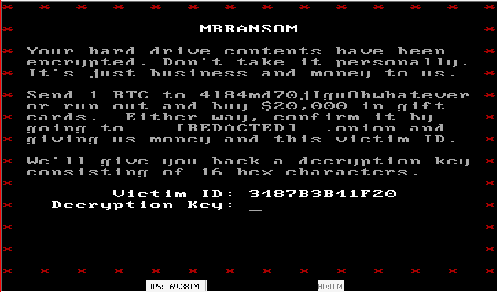
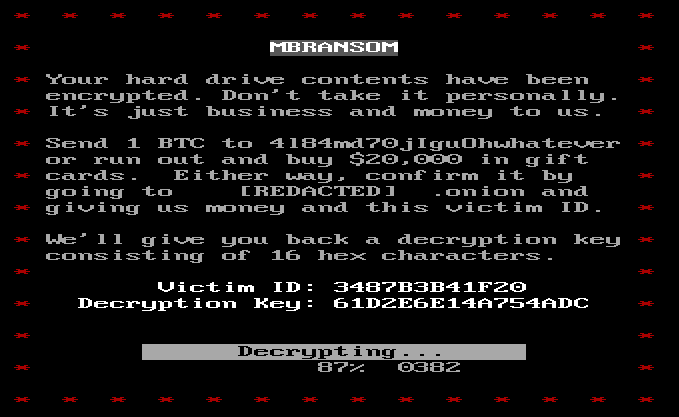
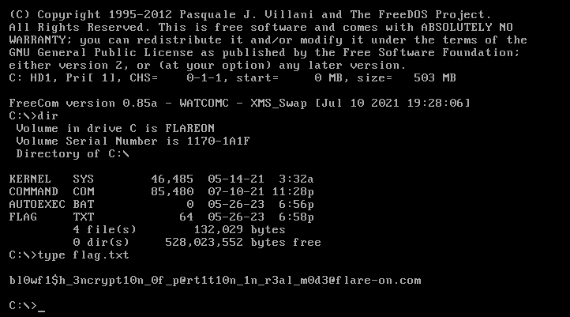

## Flare-On 2023 - #9 mbransom
___

### Description: 

*You’re doing so great! Go out and celebrate.*
*Take a day off kid, you’ve earned it.*
*Watch your scoreboard position fall like the sand through the hourglass.*
*Avoid this VM and feel the joy the outside world has to offer.*
*Or crush this one and earn even more internet points, those will come in handy.*

`7-zip password: flare`
___

### Solution:

Let's start with the `hda.img` file, which is a `DOS/MBR boot sector` file:
```
ispo@ispo-glaptop2:~/ctf/flare-on-challenges/flare-on-2023/09_mbransom$ file hda.img
hda.img: DOS/MBR boot sector; partition 1 : ID=0x6, active 0x81, start-CHS (0x0,1,1), end-CHS (0x3ff,15,63), startsector 63, 1032129 sectors
```

We use `Bochs` emulator to run it:
```
wine ~/.wine/drive_c/Program\ Files/Bochs-2.7/bochs.exe -n "ata0-master: type=disk, path=hda.img" "boot: disk"
```

The goal here is to enter the correct key:



The first challenge is to get the code that is being executed. There is a very interesting
[write-up](https://ctftime.org/writeup/31391) for a similar challenge, so we will use `qemu` 
instead:
```
qemu-system-i386 -drive file=hda.img,format=raw -s -S
```

We also added the `-s -S` options so we can attach `gdb`:
```
gdb -ex 'target remote localhost:1234'
    -ex 'set architecture i8086'
    -ex 'set disassembly-flavor intel'
    -ex 'break *0x7c00'
    -ex 'continue'
```

Inside `gdb` we can dump the memory which we know is **64KB**:
```
dump binary memory result.bin 0x0000 0xffff
```

#### Reversing the MBR

The entry point of the DOS/MBR is `0x7c00` as we can see
[here](https://stackoverflow.com/questions/28811811/how-to-use-gdb-in-16-bit-mode):
```
break *0x7c00: the first instruction will not be your boot sector,
               but rather 0x0000fff0 which does the BIOS setup, see also.
               So we use this to start from where the boot sector gets loaded to.
```

Now we can open the code on IDA pro. Let's start from the entry point:
```assembly
seg000:7C05 u_entry_point proc near                 ; CODE XREF: seg000:CLONE_OF_7C00↑J
seg000:7C05                                         ; seg000:ENTRY_POINT_7C00↑J
seg000:7C05         sti
seg000:7C06 for i in range(256): ida_bytes.patch_byte(0x600 + i, ida_bytes.get_byte(0x7C00 + i))
seg000:7C06         cld
seg000:7C07         xor     ax, ax
seg000:7C09         mov     ds, ax
seg000:7C0B         mov     es, ax
seg000:7C0D         mov     bx, 7C00h               ; copy 256 bytes from 0x7C00 to 0x600
seg000:7C10         mov     si, bx                  ; then continue execution from 0x61D
seg000:7C12         mov     di, 600h                ; which is 0x7C1D
seg000:7C15         mov     cx, 100h
seg000:7C18         rep movsw
seg000:7C1A         jmp     u_decrypt_payload_rc4   ; for i in range(256): ida_bytes.patch_byte(0x600 + i, ida_bytes.get_byte(0x7C00 + i))
seg000:7C1A u_entry_point endp
```

Interestingly, we have a self modifying code:
```assembly
seg000:061D u_decrypt_payload_rc4 proc near         ; CODE XREF: u_entry_point+15↓j
seg000:061D         mov     si, 7BEh
seg000:0620
seg000:0620 loc_620:                                ; CODE XREF: u_decrypt_payload_rc4+F↓j
seg000:0620         test    byte ptr [si], 80h
seg000:0623         jnz     short loc_633
seg000:0625         add     si, 10h
seg000:0628         cmp     si, 7EEh
seg000:062C         jbe     short loc_620
seg000:062E         mov     si, 6FFh                ; 'No active partition'
seg000:0631         jmp     short ERROR
seg000:0633 ; ---------------------------------------------------------------------------
seg000:0633
seg000:0633 loc_633:                                ; CODE XREF: u_decrypt_payload_rc4+6↑j
seg000:0633         test    byte ptr [si], 1
seg000:0636         jnz     short loc_655
seg000:0638         mov     ax, 201h
seg000:063B         mov     dh, [si+1]
seg000:063E         mov     cx, [si+2]
seg000:0641         int     13h                     ; DISK - READ SECTORS INTO MEMORY
seg000:0641                                         ; AL = number of sectors to read, CH = track, CL = sector
seg000:0641                                         ; DH = head, DL = drive, ES:BX -> buffer to fill
seg000:0641                                         ; Return: CF set on error, AH = status, AL = number of sectors read
seg000:0643         jb      short loc_647
seg000:0645         jmp     bx
seg000:0647 ; ---------------------------------------------------------------------------
seg000:0647
seg000:0647 loc_647:                                ; CODE XREF: u_decrypt_payload_rc4+26↑j
seg000:0647         mov     si, 713h
seg000:064A
seg000:064A ERROR:                                  ; CODE XREF: u_decrypt_payload_rc4+14↑j
seg000:064A                                         ; u_decrypt_payload_rc4+52↓j ...
seg000:064A         mov     ah, 0Eh
seg000:064C
seg000:064C loc_64C:                                ; CODE XREF: u_decrypt_payload_rc4+36↓j
seg000:064C         lodsb
seg000:064D         test    al, al
seg000:064F
seg000:064F loc_64F:                                ; CODE XREF: u_decrypt_payload_rc4:loc_64F↓j
seg000:064F         jz      short loc_64F
seg000:0651         int     10h                     ; - VIDEO - WRITE CHARACTER AND ADVANCE CURSOR (TTY WRITE)
seg000:0651                                         ; AL = character, BH = display page (alpha modes)
seg000:0651                                         ; BL = foreground color (graphics modes)
seg000:0653         jmp     short loc_64C
seg000:0655 ; ---------------------------------------------------------------------------
seg000:0655
seg000:0655 loc_655:                                ; CODE XREF: u_decrypt_payload_rc4+19↑j
seg000:0655         cli
seg000:0656         mov     ss, ax
seg000:0658         mov     sp, 0FFFEh
seg000:065B         sti
seg000:065C         mov     ds:word_802, dx
seg000:0660         mov     ds:word_800, si
seg000:0664         mov     ah, 8
seg000:0666         xor     di, di
seg000:0668         int     13h                     ; DISK - DISK - GET CURRENT DRIVE PARAMETERS (XT,AT,XT286,CONV,PS)
seg000:0668                                         ; DL = drive number
seg000:0668                                         ; Return: CF set on error, AH = status code, BL = drive type
seg000:0668                                         ; DL = number of consecutive drives
seg000:0668                                         ; DH = maximum value for head number, ES:DI -> drive parameter
seg000:066A         jnb     short loc_671
seg000:066C         mov     si, 713h                ; 'Disk error'
seg000:066F         jmp     short ERROR
seg000:0671 ; ---------------------------------------------------------------------------
seg000:0671
seg000:0671 loc_671:                                ; CODE XREF: u_decrypt_payload_rc4+4D↑j
seg000:0671         xor     ax, ax
seg000:0673         mov     es, ax
seg000:0675         mov     al, 2
seg000:0677         xchg    ax, cx
seg000:0678         and     al, 3Fh
seg000:067A         dec     ax
seg000:067B         mov     di, ax
seg000:067D         mov     ah, cl
seg000:067F         cwd
seg000:0680         mov     dl, byte ptr ds:word_802 ; load payload stage2
seg000:0684         mov     bx, 1000h
seg000:0687         int     13h                     ; DISK -
seg000:0689         jnb     short loc_690
seg000:068B         mov     si, 713h                ; 'Disk error'
seg000:068E         jmp     short ERROR
seg000:0690 ; ---------------------------------------------------------------------------
seg000:0690
seg000:0690 loc_690:                                ; CODE XREF: u_decrypt_payload_rc4+6C↑j
seg000:0690         cbw
seg000:0691         test    ax, ax
seg000:0693         jnz     short loc_698
seg000:0695         mov     ax, di
seg000:0697         cbw
seg000:0698
seg000:0698 loc_698:                                ; CODE XREF: u_decrypt_payload_rc4+76↑j
seg000:0698         xchg    ah, al
seg000:069A         shl     ax, 1
seg000:069C         xchg    ax, cx
seg000:069D         mov     ax, 100h
seg000:06A0         mov     dx, 202h
seg000:06A3         mov     bx, 804h
seg000:06A6         mov     di, bx
seg000:06A8 Add decrypted payload on disk
seg000:06A8
seg000:06A8 from Crypto.Cipher import ARC4
seg000:06A8 buf = open('payload_stage2.bin', 'rb').read()
seg000:06A8 cipher = ARC4.new(b'Obfuscation12345')
seg000:06A8 decr = cipher.decrypt(buf)
seg000:06A8 for i, d in enumerate(decr): ida_bytes.patch_byte(0x1000 + i, d)
seg000:06A8
seg000:06A8
seg000:06A8 RC4_INIT_S:                             ; CODE XREF: u_decrypt_payload_rc4+8E↓j
seg000:06A8         stosw
seg000:06A9         add     ax, dx                  ; ax = next 2 numbers (0x0706). Add 0x202 to get the next 2 (0x0908)
seg000:06AB         jnb     short RC4_INIT_S
seg000:06AD         cwd
seg000:06AE         mov     di, bx
seg000:06B0         jmp     short loc_6B7           ; RC4 key: 'Obfuscation12345'
seg000:06B2 ; ---------------------------------------------------------------------------
seg000:06B2
seg000:06B2 RC4_KEYSCHED:                           ; CODE XREF: u_decrypt_payload_rc4+9D↓j
seg000:06B2                                         ; u_decrypt_payload_rc4+B4↓j
seg000:06B2         lodsb
seg000:06B3         test    al, al
seg000:06B5         jnz     short loc_6BC
seg000:06B7
seg000:06B7 loc_6B7:                                ; CODE XREF: u_decrypt_payload_rc4+93↑j
seg000:06B7         mov     si, 71Eh                ; RC4 key: 'Obfuscation12345'
seg000:06BA         jmp     short RC4_KEYSCHED
seg000:06BC ; ---------------------------------------------------------------------------
seg000:06BC
seg000:06BC loc_6BC:                                ; CODE XREF: u_decrypt_payload_rc4+98↑j
seg000:06BC         add     dl, al
seg000:06BE         mov     al, dh
seg000:06C0         xlat
seg000:06C1         add     dl, al
seg000:06C3         xor     bx, bx
seg000:06C5         mov     bl, dl
seg000:06C7         xchg    al, [bx+di]
seg000:06C9         mov     bl, dh
seg000:06CB         mov     [bx+di], al
seg000:06CD         mov     bx, di
seg000:06CF         inc     dh
seg000:06D1         jnz     short RC4_KEYSCHED
seg000:06D3         mov     si, 1000h
seg000:06D6         cwd
seg000:06D7
seg000:06D7 RC4_DECRYPT:                            ; CODE XREF: u_decrypt_payload_rc4+D5↓j
seg000:06D7         inc     dh
seg000:06D9         mov     al, dh
seg000:06DB         xlat
seg000:06DC         add     dl, al
seg000:06DE         xor     bx, bx
seg000:06E0         mov     bl, dl
seg000:06E2         mov     ah, al
seg000:06E4         xchg    al, [bx+di]
seg000:06E6         mov     bl, dh
seg000:06E8         mov     [bx+di], al
seg000:06EA         mov     bx, di
seg000:06EC         add     al, ah
seg000:06EE         xlat
seg000:06EF         xor     [si], al
seg000:06F1         inc     si
seg000:06F2         loop    RC4_DECRYPT
seg000:06F4         mov     si, ds:word_800
seg000:06F8         mov     dx, ds:word_802
seg000:06FC         jmp     payload_stage2
seg000:06FC ; ---------------------------------------------------------------------------
seg000:06FF aNoActivePartit_0 db 'No active partition',0
seg000:0713 aDiskError_0 db 'Disk error',0
seg000:071E aObfuscation123_0 db 'Obfuscation12345',0
```

The code is encrypted using RC4. The decryption key is `Obfuscation12345`. We dump the encrypted
code into `payload_stage2.bin`, we decrypt it and we patch it back to IDA:
```python
# Relocate code first.
for i in range(512):
    ida_bytes.patch_byte(0x600 + i, ida_bytes.get_byte(0x7C00 + i))

# Decryhpt Stage #2
from Crypto.Cipher import ARC4

buf = open('payload_stage2.bin', 'rb').read()
cipher = ARC4.new(b'Obfuscation12345')
decr = cipher.decrypt(buf)
for i, d in enumerate(decr):
    ida_bytes.patch_byte(0x1000 + i, d)
```

#### Reversing Decrypted Payload

Now we move on to the next stage of the payload:
```assembly
seg000:1000 payload_stage2 proc near                ; CODE XREF: u_decrypt_payload_rc4+DF↑j
seg000:1000         sti
seg000:1001         cld
seg000:1002         mov     ax, cs
seg000:1004         mov     ds, ax
seg000:1006         mov     es, ax
seg000:1008         cli
seg000:1009         mov     ss, ax
seg000:100B         mov     sp, 0FFFEh
seg000:100E         sti
seg000:100F         xor     dh, dh
seg000:1011         push    dx
seg000:1012         push    si
seg000:1013         mov     ax, 1
seg000:1016         int     10h                     ; - VIDEO - SET VIDEO MODE
seg000:1016                                         ; AL = mode
seg000:1018         mov     ax, 1003h
seg000:101B         mov     bl, 1
seg000:101D         int     10h                     ; - VIDEO - TOGGLE INTENSITY/BLINKING BIT (Jr, PS, TANDY 1000, EGA, VGA)
seg000:101D                                         ; BL = 00h enable background intensity
seg000:101D                                         ; = 01h enable blink
seg000:101F         call    u_display_ransom_screen
seg000:1022         mov     ah, 2
seg000:1024         xor     bx, bx
seg000:1026         mov     dx, 1214h
seg000:1029         int     10h                     ; - VIDEO - SET CURSOR POSITION
seg000:1029                                         ; DH,DL = row, column (0,0 = upper left)
seg000:1029                                         ; BH = page number
seg000:102B         call    u_long_delay
seg000:102E         call    u_main_loop_enter_key
seg000:1031         pop     si                      ; if we reach this point, we're success!
seg000:1032         pop     dx
seg000:1033         push    dx
seg000:1034         call    u_do_decrypt
seg000:1037         jnb     short SKIP_SPINLOCK
seg000:1039
seg000:1039 SPINLOCK:                               ; CODE XREF: payload_stage2:SPINLOCK↓j
seg000:1039         jmp     short SPINLOCK
seg000:103B ; ---------------------------------------------------------------------------
seg000:103B
seg000:103B SKIP_SPINLOCK:                          ; CODE XREF: payload_stage2+37↑j
seg000:103B         pop     dx
seg000:103C         call    sub_14D7
seg000:103F         mov     si, 1973h               ; 'Hit enter to reboot'
seg000:1042         call    u_display_message
seg000:1045
seg000:1045 LOOP_1:                                 ; CODE XREF: payload_stage2+50↓j
seg000:1045         xor     ah, ah
seg000:1047         int     16h                     ; KEYBOARD - READ CHAR FROM BUFFER, WAIT IF EMPTY
seg000:1047                                         ; Return: AH = scan code, AL = character
seg000:1049         cmp     al, 0Dh
seg000:104B         jz      short FINITO
seg000:104D         call    u_delay_too_maybe
seg000:1050         jmp     short LOOP_1
seg000:1052 ; ---------------------------------------------------------------------------
seg000:1052
seg000:1052 FINITO:                                 ; CODE XREF: payload_stage2+4B↑j
seg000:1052         cli
seg000:1053         jmp     far ptr 0FFFFh:0
seg000:1053 payload_stage2 endp
```


The `u_main_loop_enter_key` is the main loop that processes the input:
```assembly
seg000:11BE u_main_loop_enter_key proc near         ; CODE XREF: payload_stage2+2E↑p
seg000:11BE         mov     ah, 2
seg000:11C0         xor     bx, bx
seg000:11C2         mov     dx, 1214h
seg000:11C5         int     10h                     ; - VIDEO - SET CURSOR POSITION
seg000:11C5                                         ; DH,DL = row, column (0,0 = upper left)
seg000:11C5                                         ; BH = page number
seg000:11C7         mov     di, 2A4Ch
seg000:11CA
seg000:11CA MAIN_LOOP:                              ; CODE XREF: u_main_loop_enter_key+96↓j
seg000:11CA                                         ; u_main_loop_enter_key+BA↓j
seg000:11CA         xor     si, si
seg000:11CC         xor     ah, ah
seg000:11CE         int     16h                     ; KEYBOARD - READ CHAR FROM BUFFER, WAIT IF EMPTY
seg000:11CE                                         ; Return: AH = scan code, AL = character
seg000:11D0         cmp     al, 8                   ; 8 = backspace
seg000:11D2         jnz     short NOT_BACKSPACE     ; D = enter
seg000:11D4         cmp     di, 2A4Ch               ; backspace pressed
seg000:11D8         jz      short CHARACTER_PROBLEM
seg000:11DA         dec     di
seg000:11DB         dec     dx
seg000:11DC         mov     ah, 2
seg000:11DE         xor     bx, bx
seg000:11E0         call    u_display_character
seg000:11E3         mov     ax, 920h
seg000:11E6         mov     bx, 7
seg000:11E9
seg000:11E9 loc_11E9:
seg000:11E9         mov     cx, 1
seg000:11EC         call    u_display_character     ; delete previous character
seg000:11EF         jmp     short READ_MORE_CHARS
seg000:11F1 ; ---------------------------------------------------------------------------
seg000:11F1
seg000:11F1 NOT_BACKSPACE:                          ; CODE XREF: u_main_loop_enter_key+14↑j
seg000:11F1         cmp     al, 0Dh                 ; D = enter
seg000:11F3         jnz     short NOT_ENTER         ; 'Invalid Character'
seg000:11F5         cmp     di, 2A5Ch               ; enter pressed (check if we have 16 digits)
seg000:11F9         jnz     short TOO_FEW_CHARS     ; 'Too Few Characters'
seg000:11FB         push    dx
seg000:11FC         call    u_verify_key            ; ax returns address of error message or NULL
seg000:11FF         pop     dx
seg000:1200         test    ax, ax
seg000:1202         jnz     short DISPLAY_ERROR
seg000:1204         retn
seg000:1205 ; ---------------------------------------------------------------------------
seg000:1205
seg000:1205 DISPLAY_ERROR:                          ; CODE XREF: u_main_loop_enter_key+44↑j
seg000:1205         mov     si, ax
seg000:1207         jmp     short CHARACTER_PROBLEM
seg000:1209 ; ---------------------------------------------------------------------------
seg000:1209
seg000:1209 TOO_FEW_CHARS:                          ; CODE XREF: u_main_loop_enter_key+3B↑j
seg000:1209         mov     si, 18B3h               ; 'Too Few Characters'
seg000:120C         jmp     short CHARACTER_PROBLEM
seg000:120E ; ---------------------------------------------------------------------------
seg000:120E
seg000:120E NOT_ENTER:                              ; CODE XREF: u_main_loop_enter_key+35↑j
seg000:120E         mov     si, 189Bh               ; 'Invalid Character'
seg000:1211         cmp     di, 2A5Ch
seg000:1215         jnz     short loc_121C
seg000:1217         mov     si, 18CBh               ; 'Hit Enter to confirm key'
seg000:121A         jmp     short CHARACTER_PROBLEM
seg000:121C ; ---------------------------------------------------------------------------
seg000:121C
seg000:121C loc_121C:                               ; CODE XREF: u_main_loop_enter_key+57↑j
seg000:121C         mov     bx, ax
seg000:121E
seg000:121E loc_121E:
seg000:121E         sub     al, 30h ; '0'
seg000:1220         jb      short CHARACTER_PROBLEM ; character is < '0'
seg000:1222         cmp     al, 9
seg000:1224         ja      short NOT_A_DIGIT
seg000:1226         jmp     short STORE_DIGIT
seg000:1228 ; ---------------------------------------------------------------------------
seg000:1228
seg000:1228 NOT_A_DIGIT:                            ; CODE XREF: u_main_loop_enter_key+66↑j
seg000:1228         sub     al, 11h
seg000:122A         jb      short CHARACTER_PROBLEM
seg000:122C
seg000:122C loc_122C:
seg000:122C         cmp     al, 5
seg000:122E         ja      short NOT_HEX_DIGIT
seg000:1230         jmp     short HEX_DIGIT
seg000:1232 ; ---------------------------------------------------------------------------
seg000:1232
seg000:1232 NOT_HEX_DIGIT:                          ; CODE XREF: u_main_loop_enter_key+70↑j
seg000:1232         sub     al, 20h ; ' '
seg000:1234         jb      short CHARACTER_PROBLEM
seg000:1236         cmp     al, 5
seg000:1238         ja      short CHARACTER_PROBLEM
seg000:123A         and     bl, 0DFh
seg000:123D         jmp     short HEX_DIGIT
seg000:123F ; ---------------------------------------------------------------------------
seg000:123F
seg000:123F CHARACTER_PROBLEM:                      ; CODE XREF: u_main_loop_enter_key+1A↑j
seg000:123F                                         ; u_main_loop_enter_key+49↑j ...
seg000:123F         push    dx
seg000:1240         call    u_delay_too_maybe
seg000:1243         pop     dx
seg000:1244
seg000:1244 loc_1244:                               ; CODE XREF: u_main_loop_enter_key+D6↓j
seg000:1244         test    si, si
seg000:1246         jz      short READ_MORE_CHARS
seg000:1248         push    dx
seg000:1249
seg000:1249 loc_1249:
seg000:1249         call    u_display_message
seg000:124C         pop     dx
seg000:124D         mov     ah, 2
seg000:124F         xor     bx, bx
seg000:1251         call    u_display_character
seg000:1254         jmp     MAIN_LOOP
seg000:1257 ; ---------------------------------------------------------------------------
seg000:1257
seg000:1257 READ_MORE_CHARS:                        ; CODE XREF: u_main_loop_enter_key+31↑j
seg000:1257                                         ; u_main_loop_enter_key+88↑j ...
seg000:1257         mov     si, dx
seg000:1259         mov     dx, 1508h
seg000:125C         mov     ah, 2
seg000:125E         xor     bx, bx
seg000:1260         call    u_display_character     ; move cursor down
seg000:1263         mov     ax, 920h
seg000:1266         mov     bx, 7
seg000:1269         mov     cx, 18h
seg000:126C         call    u_display_character
seg000:126F         mov     dx, si
seg000:1271         mov     ah, 2
seg000:1273         xor     bx, bx
seg000:1275         call    u_display_character
seg000:1278         jmp     MAIN_LOOP
seg000:127B ; ---------------------------------------------------------------------------
seg000:127B
seg000:127B HEX_DIGIT:                              ; CODE XREF: u_main_loop_enter_key+72↑j
seg000:127B                                         ; u_main_loop_enter_key+7F↑j
seg000:127B         add     al, 0Ah
seg000:127D
seg000:127D STORE_DIGIT:                            ; CODE XREF: u_main_loop_enter_key+68↑j
seg000:127D         stosb
seg000:127E         xchg    ax, bx
seg000:127F         mov     ah, 9
seg000:1281         mov     bx, 0Fh
seg000:1284
seg000:1284 loc_1284:
seg000:1284         mov     cx, 1
seg000:1287
seg000:1287 loc_1287:
seg000:1287         call    u_display_character
seg000:128A         inc     dx
seg000:128B         cmp     di, 2A5Ch               ; key is 16 characters
seg000:128F         jnz     short READ_MORE_CHARS
seg000:1291         mov     si, 18CBh               ; 'Hit Enter to confirm key'
seg000:1294         jmp     short loc_1244
seg000:1294 u_main_loop_enter_key endp
```

Once we enter enough valid characters, program calls `u_verify_key`:
```assembly
seg000:1296 u_verify_key proc near                  ; CODE XREF: u_main_loop_enter_key+3E↑p
seg000:1296         push    si
seg000:1297         push    di
seg000:1298         sub     sp, 8
seg000:129B         mov     si, 2A4Ch               ; key (1 char per byte)
seg000:129E         mov     di, 2A5Ch
seg000:12A1         mov     cx, 804h
seg000:12A4
seg000:12A4 CONVERT_TO_BYTES:                       ; CODE XREF: u_verify_key+16↓j
seg000:12A4         lodsw                           ; '01 03 03 07' becomes '13 37'
seg000:12A5         shl     al, cl
seg000:12A7         or      al, ah
seg000:12A9         stosb
seg000:12AA         dec     ch
seg000:12AC         jnz     short CONVERT_TO_BYTES  ; '01 03 03 07' becomes '13 37'
seg000:12AE         mov     si, 2A5Ch               ; key (2 chars per byte)
seg000:12B1         mov     di, 19FCh               ; target key
seg000:12B4         dec     cx                      ; cx = 3
seg000:12B5
seg000:12B5 VERIFY_KEY:                             ; CODE XREF: u_verify_key+29↓j
seg000:12B5         lodsw                           ; verify 12/16 characters
seg000:12B6         xor     ax, [di]
seg000:12B8         inc     di
seg000:12B9         inc     di
seg000:12BA         cmp     ax, 5555h
seg000:12BD         jnz     short INVALID_KEY       ; ' Invalid Key'
seg000:12BF         loop    VERIFY_KEY              ; verify 12/16 characters
seg000:12C1         mov     si, 2A5Ch
seg000:12C4         mov     di, 2A64h
seg000:12C7         mov     cl, 4
seg000:12C9
seg000:12C9 LOOP_3:                                 ; CODE XREF: u_verify_key+3B↓j
seg000:12C9         lodsw
seg000:12CA         stosw                           ; di += 2
seg000:12CB         xor     ax, 5555h
seg000:12CE         mov     [di+6], ax              ; store ax 8 bytes after
seg000:12D1         loop    LOOP_3
seg000:12D3         mov     ax, 10h                 ; arg2: 16 = key length
seg000:12D6         push    ax
seg000:12D7         mov     ax, 2A64h
seg000:12DA         push    ax                      ; arg1 0x2a64 = blowfish key
seg000:12DB         call    u_blowfish_key_sched
seg000:12DE         mov     si, 19EBh               ; 'Test Str'
seg000:12E1         mov     di, sp
seg000:12E3         movsw
seg000:12E4         movsw
seg000:12E5         movsw
seg000:12E6         movsw
seg000:12E7         mov     bx, sp                  ; bx = 'Test Str'
seg000:12E9         mov     ax, 1573h               ; 0x1573 = callback = u_blowfish_encrypt
seg000:12EC         call    u_callback_with_inv_endianess
seg000:12EF         mov     si, 19F4h               ; expected
seg000:12F2         mov     di, sp
seg000:12F4         mov     cx, 4
seg000:12F7         repe cmpsw
seg000:12F9         jz      short GOOD_KEY
seg000:12FB         mov     ax, 18FBh               ; 'Incorrect Key'
seg000:12FE         jmp     short RETURN
seg000:1300 ; ---------------------------------------------------------------------------
seg000:1300
seg000:1300 GOOD_KEY:                               ; CODE XREF: u_verify_key+63↑j
seg000:1300         xor     ax, ax
seg000:1302         jmp     short RETURN
seg000:1304 ; ---------------------------------------------------------------------------
seg000:1304
seg000:1304 INVALID_KEY:                            ; CODE XREF: u_verify_key+27↑j
seg000:1304         mov     ax, 18E3h               ; ' Invalid Key'
seg000:1307
seg000:1307 RETURN:                                 ; CODE XREF: u_verify_key+68↑j
seg000:1307                                         ; u_verify_key+6C↑j
seg000:1307         add     sp, 8
seg000:130A         pop     di
seg000:130B         pop     si
seg000:130C         retn
seg000:130C u_verify_key endp ; sp-analysis failed
```

```assembly
seg000:19EB glo_test_str db 'T', 'e', 's', 't', ' ', 'S', 't', 'r'
seg000:19F3         db  90h
seg000:19F4 glo_encrypted_test_str db 2Eh, 21h, 57h, 82h, 3Eh, 0A9h, 6Ch, 6Eh
seg000:19FC glo_xor_key dw 8734h, 0B4B3h, 201Fh, 9090h
seg000:1A04 glo_new_buf db 88h, 6Ah, 3Fh, 24h, 0D3h, 8, 0A3h, 85h, 2Eh, 8Ah, 19h, 13h
seg000:1A10         db 44h, 73h, 70h, 3, 22h, 38h, 9, 0A4h, 0D0h, 31h, 9Fh, 29h, 98h
```

Function starts by verifying the first **12**characters of the decryption key, using a simple XOR
algorithm. We can easily reverse that:
```python
decr = [x ^ 0x5555 for x in (0x8734, 0x0B4B3, 0x201F)]
key = ''
for d in decr:
     key += hex(((d & 0xFF) >> 4 ) & 0xF)[2:] + hex((d & 0xFF) & 0xF)[2:]
     key += hex(((d >> 8) >> 4) & 0xF)[2:] + hex((d >> 8) & 0xF)[2:] 

key = key.upper()
```

Therefore, the first **12** characters of the decryption key are: `61D2E6E14A75`.

The last **4** characters are being checked using
[BlowFish](https://en.wikipedia.org/wiki/Blowfish_(cipher)). More specifically, program generates
the BlowFish key as follows:
```
    decr_key + victim_id + decr_key[12:] ^ 0x5555
```

To verify the key, it encrypts the `Test Str` string checks if the ciphertext is
`2E 21 57 82 3E A9 6C 6E`. Since we are only missing **4** hex digits, we can easily brute-force
them:

```python
from Crypto.Cipher import Blowfish

for i in range(256):
    for j in range(256):    
        key = bytearray([
            0x61, 0xD2, 0xE6, 0xE1, 0x4A, 0x75, i, j,
            0x34, 0x87, 0xB3, 0xB4, 0x1F, 0x20, i ^ 0x55, j ^ 0x55]
        )
        
        cipher = Blowfish.new(key, Blowfish.MODE_ECB)
        plaintext = b'Test Str'
        ciphertext = cipher.encrypt(plaintext)

        if ' '.join(f'{x:02X}' for x in ciphertext) == '2E 21 57 82 3E A9 6C 6E':
            print(f'[+] Key Found: 61D2E6E14A75{i:02X}{j:02X}')
            break
# [+] Key Found: 61D2E6E14A754ADC
```

After a few seconds, we get the correct decryption key: `61D2E6E14A754ADC`. We type it in
and decryption starts:



After the decryption is completed, we can open the flag file:



So the flag is: `bl0wf1$h_3ncrypt10n_0f_p@rt1t10n_1n_r3al_m0d3@flare-on.com`
___
