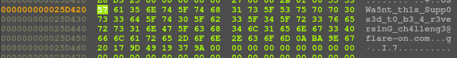

## Flare-On 2023 - #11 Over The Rainbow
___

### Description: 

*I’m told this one is easy if you are really good.*
*Based on your solve times so far Google Bard predicts your performance will be: “1 out of 5 stars.*
*I’d give it 0 stars if I could. Food arrived over an hour late, covered in oil.*
*I wouldn’t feed it to my dog”*


`7-zip password: flare`
___

### Solution:

This was an easy challenge. Let's run the program first:
```
ispo@ispo-glaptop2:~/ctf/flare-on-challenges/flare-on-2023/11_over_the_rainbow$ wine FLAREON_2023.exe 
usage: Z:\home\ispo\ctf\flare-on-challenges\flare-on-2023\11_over_the_rainbow\FLAREON_2023.exe [path]
```

Program needs to take a directory as argument. We create directory `foo` and we place some files
with the `.3ncrypt_m3` extension. Then we program as `wine FLAREON_2023.exe foo`. For every file
with the `.3ncrypt_m3` extension, program encrypts it and change its extension to `.d3crypt_m3`.

The `main` function simple creates **2** threads:
```c
int __fastcall main(int argc, const char **argv, const char **envp) {
  /* ... */
  if ( argc != 2 ) {
    v4 = sub_140082E50(&qword_140212720, "usage: ");
    v5 = sub_1400831E0(v4, *argv);
    v6 = sub_140082E50(v5, " [path]");
    *&v24._Id = *(*(v6 + *(*v6 + 4i64) + 64) + 8i64);
    (*(**&v24._Id + 8i64))();
    v7 = std::use_facet<std::ctype<char>>(&v24);
    LOBYTE(v8) = 10;
    v9 = (*(*v7 + 96i64))(v7, v8);
    if ( *&v24._Id ) {
      v10 = (*(**&v24._Id + 16i64))(*&v24._Id);
      if ( v10 )
        (**v10)(v10, 1i64);
    }
    sub_140084490(v6, v9);
    sub_1400824E0(v6);
    return 0;
  }  
  v12 = operator new(128i64, argv, envp);
  v25 = v12;
  /* ... */
  thread1_obj = operator new(24i64, v16, v17);
  v24._Hnd = thread1_obj;
  *thread1_obj = 0i64;
  thread1_obj[2] = 0i64;
  v19 = argv[1];
  thread1_obj[1] = v12;
  *thread1_obj = &glo_thread1_obj;
  thread1_obj[2] = v19;
  thread2_obj = operator new(16i64, v19, v20);
  v24._Hnd = thread2_obj;
  *thread2_obj = 0i64;
  *thread2_obj = &glo_thread2_obj;
  thread2_obj[1] = v12;
  u_create_thread(thread1_obj, &v26, v22);
  u_create_thread(thread2_obj, &v27, v23);
  /* ... */
  if ( Thrd_join(&v24, 0i64) )
    std::_Throw_Cpp_error(2i64);
  v27 = 0i64;
  if ( v26._Id )
    terminate();
  return 0;
}
```

Let's look at the first thread located at `0x14007FD20` that searches (recursively) for files
with the `.3ncrypt_m3` extension and forwards them to the other thread:
```c
_BYTE *__fastcall u_thread_routine_1(__int64 a1, __int64 a2, __int64 a3) {
  /* ... */
  v3 = a1;
  path = *(a1 + 16);                            // foo.3ncrypt_m3
  *&v66[0] = path;
  len = -1i64;
  do                                            // len
    ++len;
  while ( *(path + 2 * len) );
  *(&v66[0] + 1) = len;
  v62[0] = v66[0];
  sub_140085250(v60, v62, a3);                  // alloc
  v6 = 128;
  v65 = 0i64;
  v7 = (sub_1400829A0)(&v65, v60);              // walk over directory
  if ( v7 )
    std::filesystem::_Throw_fs_error("recursive_directory_iterator::recursive_directory_iterator", v7, v60);
  /* ... */
  while ( 1 ) {
    v10 = *&v66[0];
    if ( !*&v66[0] )
      break;
    sub_14007E380(*&v66[0], &v50);
    v12 = v51;
    if ( v51 && ((v50 - 1) & 0xFFFFFFF7) != 0 )
      std::filesystem::_Throw_fs_error("directory_entry::status", v51, v10 + 32);
    if ( v50 != 2 )
      goto LABEL_52;
    *&v57 = ".3ncrypt_m3";                      // check file extension
    *(&v57 + 1) = 11i64;
    _std_fs_code_page();
    v62[1] = v57;
    (sub_14007D0D0)(Src);
    v13 = v6 | 0xD;
    v14 = (v10 + 32);
    if ( *(v10 + 56) >= 8ui64 )
      v14 = *(v10 + 32);
    v15 = &v14[*(v10 + 48)];
    root_name_end = std::filesystem::_Find_root_name_end(v14, v15);
    if ( root_name_end != v17 ) {
      do {
        if ( *root_name_end != '\\' && *root_name_end != '/' )
          break;
        ++root_name_end;
      } while ( root_name_end != v17 );
      if ( root_name_end != v17 ) {
        do {
          v18 = v15 - 1;
          v19 = *(v15 - 1);
          if ( v19 == 92 )
            break;
          if ( v19 == 47 )
            break;
          --v15;
        } while ( root_name_end != v18 );
      }
    }
    /* ... */
    if ( !std::filesystem::path::compare(v53, v64) ) {
      if ( (*(v10 + 28) & 8) != 0 ) {
        v24 = *(v10 + 8);
      } else {
        v25 = (v10 + 32);
        if ( *(v10 + 56) >= 8ui64 )
          v25 = *(v10 + 32);
        stats = _std_fs_get_stats(v25);
        if ( stats )
          std::filesystem::_Throw_fs_error("directory_entry::file_size", stats, v10 + 32);
        v24 = v67;
      }
      if ( v24 <= 0x1000 ) {
        v27 = 1;
        goto LABEL_53;
      }
    }
    /* ... */
    v42 = sub_14007E840(v66);
    if ( v42 )
      std::filesystem::_Throw_fs_error(v43, v42);
  }
  /* ... */
  result = *(v3 + 8);
  *result = 1;
  return result;
}
```

The second thread which is located at `0x14007EE60` does the actual encryption:
```c
void __fastcall u_thread_routine_2(__int64 a1) {
  /* ... */  
  v1 = a1;
  v2 = 0;
  ii = 0;
  pubkey = data;
  do                                            // decrypt public key
    *pubkey++ ^= 45 * ii++ + 123;
  while ( ii < 0x1C3 );
  addr_of_1025 = u_get_addr_of_1025();
  v6 = BIO_new_0(addr_of_1025);
  v7 = v6;
  v8 = -1i64;
  do
    ++v8;
  while ( data[v8] );
  BIO_read_0_0(v6, data, v8);
  r = PEM_read_bio_CMS_19(v7, 0i64, 0i64, 0i64);
  BIO_free_0(v7);
  while ( 1 ) {
    v72 = 0i64;
    v9 = *(v1 + 8);
    v10 = (v9 + 8);
    v11 = Mtx_lock((v9 + 8));
    if ( v11 )
      std::_Throw_C_error(v11);
    if ( *(v9 + 120) ) {
      v14 = *(*(v9 + 96) + 8 * (*(v9 + 112) & (*(v9 + 104) - 1i64)));
      v15 = v14[1];
      if ( v15 )
        _InterlockedIncrement((v15 + 8));
      v13 = *v14;
      v63 = v14[1];
      v16 = *(*(*(v9 + 96) + 8 * (*(v9 + 112) & (*(v9 + 104) - 1i64))) + 8i64);
      /* ... */
      if ( (*(v9 + 120))-- == 1i64 )
        *(v9 + 112) = 0i64;
      else
        ++*(v9 + 112);
      *&v72 = v13;
      v12 = v63;
      *(&v72 + 1) = v63;
      v2 |= 1u;
      v60 = v2;
      Mtx_unlock(v10);
      v1 = a1;
    } else {
      v72 = 0i64;
      v2 |= 1u;
      v60 = v2;
      Mtx_unlock((v9 + 8));
      v12 = _mm_srli_si128(0i64, 8).m128i_u64[0];
      v63 = v12;
      v13 = 0i64;
    }
    if ( !v13 )
      break;
    if ( (*(v13 + 28) & 8) != 0 ) {
      filesize = *(v13 + 8);
    } else {
      v19 = (v13 + 32);
      if ( *(v13 + 56) >= 8ui64 )
        v19 = *(v13 + 32);
      stats = _std_fs_get_stats(v19);
      if ( stats )
        std::filesystem::_Throw_fs_error("directory_entry::file_size", stats, v13 + 32);
      filesize = v78[35];
    }
    v21 = filesize + 1;
    if ( filesize == -1i64 )
      v21 = -1i64;
    file_contents = j__malloc_base(v21);
    v23 = filesize + 256;
    if ( filesize >= 0xFFFFFFFFFFFFFF00ui64 )
      v23 = -1i64;
    v24 = j__malloc_base(v23);
    encr_file = v24;
    if ( file_contents && v24 ) {
      memset(file_contents, 0, filesize + 1);
      memset(v78, 0, 0x110ui64);
      sub_140082B20(v78, (v13 + 32));
      sub_1400814D0(v78, file_contents, filesize);
      if ( !sub_140082220(&v78[2]) )
      {
        v26 = *(v78[0] + 4);
        v27 = 6;
        if ( *(&v78[9] + v26) )
          v27 = 2;
        v28 = (*(&v78[2] + v26) | v27) & 0x17;
        *(&v78[2] + v26) = v28;
        v29 = v28 & *(&v78[2] + v26 + 4);
        if ( v29 ) {
          if ( (v29 & 4) != 0 ) {
            v56 = "ios_base::badbit set";
          } else {
            v56 = "ios_base::failbit set";
            if ( (v29 & 2) == 0 )
              v56 = "ios_base::eofbit set";
          }
          error_code = std::make_error_code(v68, 1i64);
          sub_14007CD80(pExceptionObject, v56, error_code);
          CxxThrowException(pExceptionObject, &_TI5_AVfailure_ios_base_std__);
        }
      }
      RAND_bytes(rand_bytes, 48);
      qmemcpy(salsa20_const, "expand 32-byte k", sizeof(salsa20_const));// Salsa20/ChaCha
      memset(rsa_cipher, 0, sizeof(rsa_cipher));
      RAND_bytes(&rsa_cipher[168], 24);
      *&rsa_cipher[192] = *rand_bytes;
      *&rsa_cipher[208] = *&rand_bytes[16];
      *&rsa_cipher[224] = *&rand_bytes[32];
      *&rsa_cipher[240] = *salsa20_const;
      // RSA encrypt and skip the first &filesize bytes
      u_rsa_ossl_public_encrypt(256i64, rsa_cipher, &encr_file[filesize], r);
      for ( i = 0i64; i < filesize; ++i ) {
        if ( (i & 0x3F) == 0 )
          u_modified_salsa20_keygen(a1, rand_bytes, salsa20_blk);// generate block
        encr_file[i] = *(file_contents + i) ^ salsa20_blk[i & 0x3F] ^ rsa_cipher[i + 168 + -24 * (i / 24)];
      }
      sub_14007DA30(v73, (v13 + 32), v30);
      v33 = _std_fs_code_page(v32);
      v65[0] = ".d3crypt_m3";           
      v65[1] = 11i64;
      /* ... */
      sub_1400816E0(v77, encr_file, filesize + 256);
      if ( !sub_140082220(&v77[1]) ) {
        v35 = *(v77[0] + 4);
        v36 = 6;
        if ( *(&v77[9] + v35) )
          v36 = 2;
        /* ... */
      }
      v39 = v13 + 32;
      if ( *(v13 + 56) >= 8ui64 )
        v39 = *(v13 + 32);
      v40 = _std_fs_remove(v39) >> 32;
      if ( v40 )
        std::filesystem::_Throw_fs_error("remove", v40, v13 + 32);
      free(encr_file);
      free(file_contents);
      /* ... */
    } else {
      /* ... */
    }
  }
  /* ... */
  RSA_free_0(r);
}
```

Initially, program decrypts a public key using a simple XOR encryption. The encrypted key is located
at `0x14020F9B0`:
```
.data:000000014020F9B0 data    db 56h, 85h, 0F8h, 2Fh, 2, 1Eh, 0CCh, 0F1h, 0AAh, 5Eh, 1Dh, 3Ah
.data:000000014020F9B0                                         ; DATA XREF: u_thread_routine_2+50↑o
.data:000000014020F9BC         db 0C2h, 86h, 0BDh, 57h, 8, 58h, 0EEh, 97h, 0A6h, 1, 74h, 0ABh
.data:000000014020F9C8         db 9Eh, 0CDh, 7, 77h, 2Eh, 0DDh, 83h, 0A7h, 5Fh, 9, 3Bh, 0E0h
.....
.data:000000014020FB63         db 0A2h, 4Ah, 0Eh, 35h, 0EFh, 90h, 20h, 66h, 1Fh, 0DEh, 99h, 0CCh
.data:000000014020FB6F         db 23h, 16h, 45h, 95h, 5 dup(0)
```

After the decryption we can get the (RSA) public key.
```
-----BEGIN PUBLIC KEY-----
MIIBIDANBgkqhkiG9w0BAQEFAAOCAQ0AMIIBCAKCAQEAycMwco9oCHr8YKEz5Jud
PeSfD/mZXF4S5cZcEYl7xxjj5NJy1aWM5GN1WyxjRn8NCfk8Mctn/jGICa9/yLLI
xyGrVHzk22Pb3/9dmwbIV5n97mkPkMR5xtC546P2blXWMCnOWgLvhMaq3F4iQWgw
JMxl11ZCr+C6vnbymmd86xWb5IuzJl69K9UZoq9+A2zC5kAcN1VXYagcPR0opFbD
i5G1WQNb/wE92gQ5BTuelvSyePcZ6Tnmd9BYvG6YAFr/IwgUpJerNLf6kCtmbRgN
6E4k6Q91PXnbC3IXrLXEb00apWvuVz8tR6Qzfd0eK5Z+3HA4/usJDex0ktlNlom7
YQIBAw==
-----END PUBLIC KEY-----
```

The program generates a **48** byte random buffer which is assigned to the init state of a modified
[Salsa20](https://en.wikipedia.org/wiki/Salsa20) encryption. Program also generates another
**24** byte random buffer that is XORed along with [Salsa20](https://en.wikipedia.org/wiki/Salsa20)
block and the file contents:
```c
for ( i = 0i64; i < filesize; ++i ) {
  if ( (i & 0x3F) == 0 )
    u_modified_salsa20_keygen(a1, rand_bytes, salsa20_blk);// generate new block

  encr_file[i] = file_contents[i] ^ salsa20_blk[i & 0x3F] ^ rand_buf[i + -24 * (i / 24)];
}
```

After the encryption, program uses the RSA public key to encrypt the following data:
```python
  '\x00'*168 + rand_bytes_24 + rand_bytes_48 + 'expand 32-byte k'      
```

The `.d3crypt_m3` file contains the RSA ciphertext in the first **256** bytes and after that is the
encrypted file using [Salsa20](https://en.wikipedia.org/wiki/Salsa20).

#### Breaking RSA Ciphertext

Our goal is to decrypt the `very_important_file.d3crypt_m3` file. The problem is that we do not
have the RSA private key to decrypt the first message and get the random buffers. Let's see the
`n` and `e` parameters from the public key:
```python
from Crypto.PublicKey import RSA

pubkey = '''\
-----BEGIN PUBLIC KEY-----
MIIBIDANBgkqhkiG9w0BAQEFAAOCAQ0AMIIBCAKCAQEAycMwco9oCHr8YKEz5Jud
PeSfD/mZXF4S5cZcEYl7xxjj5NJy1aWM5GN1WyxjRn8NCfk8Mctn/jGICa9/yLLI
xyGrVHzk22Pb3/9dmwbIV5n97mkPkMR5xtC546P2blXWMCnOWgLvhMaq3F4iQWgw
JMxl11ZCr+C6vnbymmd86xWb5IuzJl69K9UZoq9+A2zC5kAcN1VXYagcPR0opFbD
i5G1WQNb/wE92gQ5BTuelvSyePcZ6Tnmd9BYvG6YAFr/IwgUpJerNLf6kCtmbRgN
6E4k6Q91PXnbC3IXrLXEb00apWvuVz8tR6Qzfd0eK5Z+3HA4/usJDex0ktlNlom7
YQIBAw==
-----END PUBLIC KEY-----
'''

public_key = RSA.importKey(pubkey)
n = public_key.n
e = public_key.e
```

```
n = 25470150703730072315086034936055649836295236884601534304156993296936285040601301375939610442634162257314189499275100972455566398455602026574433195970815202585090501432569441133857842325042217925159448570072586058996240505604332536419689764920477213974406475165093073579216369638057129512420088827606714396031123135244463251843168817519429473193827165432916372277360150211932008151288302906204095482949720169306181114320172114379252171541724857670073249548632622866650173757036971232388781059615489960396402755953330835572369467647829965472365925514887194394952977362957692659807638830075891677256168792219800752995169

e = 3
```

The exponent `e` is **3**, which is a little bit suspicious. Furthermore, we know part of the
original message (the first **168** bytes are NULL and the last **16** bytes are
`expand 32-byte k`). This means we can apply the
[Coppersmith Attack](https://github.com/ashutosh1206/Crypton/tree/master/RSA-encryption/Attack-Coppersmith)
to recover the message without knowning the private key `d`. We execute the attack and after a few
seconds we recover the random buffers from the ciphertext:
```
rand2 = [
      0x06, 0xF7, 0x76, 0x8F, 0xF2, 0xB9, 0x63, 0xF3, 0x56, 0xFC, 0x25, 0xB3,
      0x44, 0x3F, 0x7B, 0x72, 0x9F, 0x68, 0xBC, 0xBD, 0xD6, 0x5F, 0x22, 0xDE,
]

rand1 = [
      0x68, 0x5C, 0x3C, 0xB5, 0xC8, 0xA2, 0x69, 0x72, 0x24, 0x36, 0x85, 0x30,
      0xE2, 0x64, 0xFD, 0x38, 0x8D, 0xC9, 0x62, 0xF5, 0xD7, 0x37, 0xCB, 0x87,
      0x3E, 0x24, 0xF3, 0x97, 0x09, 0xD2, 0x94, 0x22, 0x4A, 0x52, 0x68, 0xC3,
      0x51, 0x2D, 0xDB, 0x6B, 0x3E, 0x54, 0x41, 0x9B, 0x41, 0xC8, 0x10, 0xCF,
]
```

Once we know the random buffers, we can generate the [Salsa20](https://en.wikipedia.org/wiki/Salsa20)
key stream, decrypt the original message and get the flag. 

However, instead of writing a script that does the decryption there is a faster way to get the
flag, without implementing the modified [Salsa20](https://en.wikipedia.org/wiki/Salsa20)
in our script. We debug the program and set a breakpoint when there is a file encryption takes place
(we have to make sure that the file we encrypt is larger that the `very_important_file.d3crypt_m3`).
The first thing we do is to set breakpoints at `0x14007F198`, `0x14007F1EB`, `0x14007F24E`
and `0x14007F2B3` and patch the code according to the comments:
```assembly
.text:000000014007F186
.text:000000014007F186 loc_14007F186:                          ; CODE XREF: u_thread_routine_2+2E2↑j
.text:000000014007F186         mov     edx, 30h ; '0'          ; num
.text:000000014007F18B         lea     rcx, [rsp+568h+rand_bytes] ; buf
.text:000000014007F193 ; rand1 = [
.text:000000014007F193 ;         0x68, 0x5C, 0x3C, 0xB5, 0xC8, 0xA2, 0x69, 0x72, 0x24, 0x36, 0x85, 0x30,
.text:000000014007F193 ;         0xE2, 0x64, 0xFD, 0x38, 0x8D, 0xC9, 0x62, 0xF5, 0xD7, 0x37, 0xCB, 0x87,
.text:000000014007F193 ;         0x3E, 0x24, 0xF3, 0x97, 0x09, 0xD2, 0x94, 0x22, 0x4A, 0x52, 0x68, 0xC3,
.text:000000014007F193 ;         0x51, 0x2D, 0xDB, 0x6B, 0x3E, 0x54, 0x41, 0x9B, 0x41, 0xC8, 0x10, 0xCF,
.text:000000014007F193 ; ]
.text:000000014007F193 ; for i, r in enumerate(rand1): ida_bytes.patch_byte(0x183FC00 + i, r)
.text:000000014007F193         call    RAND_bytes
.text:000000014007F198         mov     dword ptr [rsp+568h+salsa20_const], 'apxe' ; PATCH rand1
.text:000000014007F1A3         mov     dword ptr [rsp+568h+salsa20_const+4], '3 dn'
.text:000000014007F1AE         mov     dword ptr [rsp+568h+salsa20_const+8], 'yb-2'
.text:000000014007F1B9         mov     dword ptr [rsp+568h+salsa20_const+0Ch], 'k et'
.text:000000014007F1C4         xor     edx, edx                ; Val
.text:000000014007F1C6         mov     r8d, 100h               ; Size
.text:000000014007F1CC         lea     rcx, [rsp+568h+rsa_cipher] ; void *
.text:000000014007F1D4         call    memset
.text:000000014007F1D9         mov     edx, 18h                ; num
.text:000000014007F1DE         lea     rcx, [rsp+568h+rsa_cipher+0A8h] ; buf
.text:000000014007F1E6 ; rand2 = [
.text:000000014007F1E6 ;         0x06, 0xF7, 0x76, 0x8F, 0xF2, 0xB9, 0x63, 0xF3, 0x56, 0xFC, 0x25, 0xB3,
.text:000000014007F1E6 ;         0x44, 0x3F, 0x7B, 0x72, 0x9F, 0x68, 0xBC, 0xBD, 0xD6, 0x5F, 0x22, 0xDE,
.text:000000014007F1E6 ; ]
.text:000000014007F1E6 for i, r in enumerate(rand2): ida_bytes.patch_byte(0x183FD28 + i, r)
.text:000000014007F1E6         call    RAND_bytes              ; PATCH rand2
.text:000000014007F1EB         movaps  xmm0, xmmword ptr [rsp+568h+rand_bytes]
.text:000000014007F1F3         movaps  xmmword ptr [rsp+568h+rsa_cipher+0C0h], xmm0
.text:000000014007F1FB         movaps  xmm1, xmmword ptr [rsp+568h+rand_bytes+10h]
.text:000000014007F203         movaps  xmmword ptr [rsp+568h+rsa_cipher+0D0h], xmm1
.text:000000014007F20B         movaps  xmm0, xmmword ptr [rsp+568h+rand_bytes+20h]
.text:000000014007F213         movaps  xmmword ptr [rsp+568h+rsa_cipher+0E0h], xmm0
.text:000000014007F21B         movaps  xmm1, xmmword ptr [rsp+568h+salsa20_const]
.text:000000014007F223         movaps  xmmword ptr [rsp+568h+rsa_cipher+0F0h], xmm1
.text:000000014007F22B         lea     r8, [rsi+r15]
.text:000000014007F22F         mov     [rsp+568h+var_548], 3
.text:000000014007F237         mov     r9, [rsp+568h+r]
.text:000000014007F23C         lea     rdx, [rsp+568h+rsa_cipher]
.text:000000014007F244         mov     ecx, 100h
.text:000000014007F249         call    u_rsa_ossl_public_encrypt
.text:000000014007F24E         xor     ebx, ebx                ; PATCH msg
.text:000000014007F250 ; msg = [
.text:000000014007F250 ;      0x3D, 0x77, 0xB3, 0x5D, 0xAD, 0xDB, 0xF4, 0xF9, 0xCB, 0x95, 0xA2, 0x0D,
.text:000000014007F250 ;     0x0B, 0xA0, 0x05, 0x5E, 0x03, 0xAA, 0xD1, 0xED, 0x96, 0xAA, 0x9B, 0xA6,
.text:000000014007F250 ;     0x7A, 0x5D, 0x1D, 0x14, 0x10, 0x6A, 0x2F, 0x7E, 0xA5, 0xC0, 0x61, 0x33,
.text:000000014007F250 ;     0x18, 0xD5, 0x19, 0x71, 0xA6, 0xA7, 0x59, 0xE9, 0x04, 0x33, 0xF5, 0x57,
.text:000000014007F250 ;     0x75, 0x57, 0xBC, 0x16, 0x1A, 0xB7, 0x7C, 0x85, 0xC7, 0x28, 0x91, 0x76,
.text:000000014007F250 ;     0x59
.text:000000014007F250 ; ]
.text:000000014007F250 ; for i, m in enumerate(msg):  ida_bytes.patch_byte(0x25DE90 + i, m)
.text:000000014007F250
.text:000000014007F250 ENCRYPT_LOOP:                           ; CODE XREF: u_thread_routine_2+451↓j
.text:000000014007F250         cmp     rbx, rsi
.text:000000014007F253         jnb     short loc_14007F2B3     ; AT THIS POINT WE HAVE THE FLAG at r15
.text:000000014007F255         mov     rdi, rbx
.text:000000014007F258         and     edi, 3Fh
.text:000000014007F25B         jnz     short loc_14007F277
.text:000000014007F25D         lea     r8, [rsp+568h+salsa20_blk]
.text:000000014007F265         lea     rdx, [rsp+568h+rand_bytes]
.text:000000014007F26D         mov     rcx, [rsp+568h+var_530]
.text:000000014007F272         call    u_modified_salsa20_keygen
.text:000000014007F277
.text:000000014007F277 loc_14007F277:                          ; CODE XREF: u_thread_routine_2+3FB↑j
.text:000000014007F277         mov     rax, 0AAAAAAAAAAAAAAABh
.text:000000014007F281         mul     rbx
.text:000000014007F284         shr     rdx, 4
.text:000000014007F288         lea     rax, [rdx+rdx*2]
.text:000000014007F28C         shl     rax, 3
.text:000000014007F290         lea     rcx, [rsp+568h+rsa_cipher+0A8h]
.text:000000014007F298         sub     rcx, rax
.text:000000014007F29B         movzx   eax, byte ptr [rcx+rbx]
.text:000000014007F29F         xor     al, [rsp+rdi+568h+salsa20_blk]
.text:000000014007F2A6         xor     al, [rbx+r12]
.text:000000014007F2AA         mov     [rbx+r15], al
.text:000000014007F2AE         inc     rbx
.text:000000014007F2B1         jmp     short ENCRYPT_LOOP
.text:000000014007F2B3 ; ---------------------------------------------------------------------------
.text:000000014007F2B3
.text:000000014007F2B3 loc_14007F2B3:                          ; CODE XREF: u_thread_routine_2+3F3↑j
.text:000000014007F2B3         lea     rdx, [r14+20h]          ; AT THIS POINT WE HAVE THE FLAG at r15
.text:000000014007F2B7         lea     rcx, [rsp+568h+var_450]
.text:000000014007F2BF         call    sub_14007DA30
.text:000000014007F2C4         nop
.text:000000014007F2C4 ;   } // starts at 14007F12D
```

At the end of the execution, at `0x14007F2B3` the flag will be located at the address pointed by 
`r15`:



The reason we can do this, is becuase the encryption (the double XOR) is symmetric, so if we pass
the encrypted data to the algorithm, we will get back the decrypted data.

For more details, please refer to the [over_the_rainbow_crack.sage](./over_the_rainbow_crack.sage)
script.

So the flag is: `Wa5nt_th1s_Supp0s3d_t0_b3_4_r3vers1nG_ch4l1eng3@flare-on.com`
___
