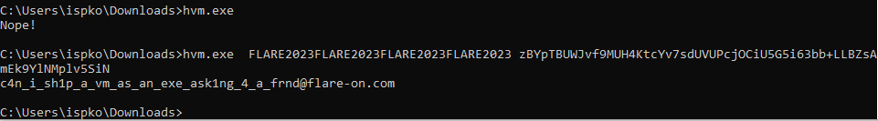

## Flare-On 2023 - #12 HVM
___

### Description: 

*This is the second smallest challenge this year! If only that mattered.*

`7-zip password: flare`
___

### Solution:

This was an Hyper-V challenge based on the
[Windows Hypervisor Platform API](https://learn.microsoft.com/en-us/virtualization/api/hypervisor-platform/hypervisor-platform). The main binary (`hvm.exe`) is a wrapper for running code in a virtual
environment:
```c
int __fastcall main(int argc, const char **argv, const char **envp) {
  unsigned int v4; // eax
  WHV_MAP_GPA_RANGE_FLAGS Flags; // eax
  WHV_PARTITION_HANDLE Partition; // [rsp+38h] [rbp-190h] BYREF
  void *buf; // [rsp+40h] [rbp-188h] BYREF
  int i; // [rsp+48h] [rbp-180h]
  int argv_2_len; // [rsp+4Ch] [rbp-17Ch]
  int argv_1_len; // [rsp+50h] [rbp-178h]
  int keep_running; // [rsp+54h] [rbp-174h]
  int ExitReason; // [rsp+58h] [rbp-170h]
  int ret_val; // [rsp+5Ch] [rbp-16Ch]
  void *argv_1; // [rsp+60h] [rbp-168h]
  void *argv_2; // [rsp+68h] [rbp-160h]
  virt_regs virt_regs; // [rsp+70h] [rbp-158h] BYREF
  int ExitContext[56]; // [rsp+90h] [rbp-138h] BYREF
  char key[48]; // [rsp+170h] [rbp-58h] BYREF

  if ( u_WHvGetCapability() ) {
    if ( argc == 3 ) {
      argv_1_len = strlen(argv[1]);
      argv_2_len = strlen(argv[2]);
      if ( argv_1_len > 8 && argv_1_len < 48 ) {
        if ( argv_2_len > 24 && argv_2_len < 65 ) {
          if ( argv_2_len % 4 ) {
            printf("Nope!\n");
            return -1;
          }
          // "A partition is essentially your virtual-machine"
          else if ( WHvCreatePartition(&Partition) >= 0 ) {
            if ( WHvSetPartitionProperty(Partition, WHvPartitionPropertyCodeProcessorCount, &glo_const_1, 4u) >= 0 ) {
              if ( WHvSetupPartition(Partition) >= 0 ) {
                buf = VirtualAlloc(0i64, SizeInBytes, 0x1000u, 4u);
                if ( buf ) {
                  u_memset(buf, SizeInBytes);
                  v4 = u_logic_or(1u, 2);
                  Flags = u_logic_or(v4, 4);
                  // Creating a mapping for a range in the GPA space of a partition sets a region in the caller’s process as the backing memory for that range. The operation replaces any previous mappings for the specified GPA pages.
                  if ( WHvMapGpaRange(Partition, buf, 0i64, SizeInBytes, Flags) >= 0 ) {
                    if ( WHvCreateVirtualProcessor(Partition, 0, 0) >= 0 ) {
                      if ( u_set_virtual_processor_regs(Partition) >= 0 ) {
                        u_get_resource_data(&buf);
                        argv_1 = buf + SizeInBytes - 1024;
                        memmove(argv_1, argv[1], argv_1_len);
                        argv_2 = buf + SizeInBytes - 512;
                        memmove(argv_2, argv[2], argv_2_len);
                        memset(ExitContext, 0, sizeof(ExitContext));
                        keep_running = 1;
                        ret_val = 0;
                        while ( keep_running ) {
                          if ( WHvRunVirtualProcessor(Partition, 0, ExitContext, 0xE0u) >= 0 ) {
                            ExitReason = ExitContext[0];
                            if ( ExitContext[0] == 2 ) { // WHvRunVpExitReasonX64IoPortAccess = 2
                              // Some of the RC4 encrypt's decrypt code and some others re-encrypt it
                              // RIP = buffer to decrypt
                              // R8 = next RC4 key
                              // R9 = size of buffer to decrypt
                              u_get_virt_processor_regs(Partition, &virt_regs);
                              if ( (ExitContext[17] & 1) != 0 )
                                // start from RIP - 16 - $SIZE
                                // 16 = mov R8 $key; mov R9; $size pattern
                                u_encrypt_with_rc4(// Encrypt again
                                  buf,
                                  virt_regs._rip - 16 - virt_regs._r9,
                                  virt_regs._r9,
                                  virt_regs._r8);
                              else
                                u_encrypt_with_rc4(buf, virt_regs._rip + 2, virt_regs._r9, virt_regs._r8);
                              u_incr_virt_rip_by_2(Partition);
                            } else if ( ExitReason == 8 )// WHvRunVpExitReasonX64Halt = 8
                              ret_val = u_get_vm_rax(Partition);// this is VM result
                              keep_running = 0;
                            } else {
                              keep_running = 0;
                            }
                          }
                        }
                        WHvDeleteVirtualProcessor(Partition, 0);
                        VirtualFree(buf, 0i64, 0x8000u);
                        WHvDeletePartition(Partition);
                        if ( ret_val == 0x1337 ) {
                          qmemcpy(key, glo_xor_key, 0x2Aui64);
                          for ( i = 0; i < 0x29; ++i )
                            printf("%c", argv[2][i] ^ key[i]);
                          printf("@flare-on.com\n");
                        } else {
                          printf("Nope!\n");
                        }
                        return 0;
                      } else {
                        printf("[-] Cannot setup registers\n");
                        VirtualFree(buf, 0i64, 0x8000u);
                        WHvDeletePartition(Partition);
                        return -1;
                      }
                    } else {
                      printf("[-] Cannot create virtual processor\n");
                      VirtualFree(buf, 0i64, 0x8000u);
                      WHvDeletePartition(Partition);
                      return -1;
                    }
                  } else {
                    printf("[-] Cannot map memory\n");
                    VirtualFree(buf, 0i64, 0x8000u);
                    WHvDeletePartition(Partition);
                    return -1;
                  }
                } else {
                  printf("[-] Cannot allocate memory\n");
                  WHvDeletePartition(Partition);
                  return -1;
                }
              } else {
                printf("[-] Cannot setup partition\n");
                WHvDeletePartition(Partition);
                return -1;
              }
            } else {
              printf("[-] Cannot set processor count\n");
              WHvDeletePartition(Partition);
              return -1;
            }
          } else {
            printf("[-] Cannot create partition\n");
            return -1;
          }
        } else {
          printf("Nope!\n");
          return -1;
        }
      } else {
        printf("Nope!\n");
        return -1;
      }
    } else {
      printf("Nope!\n");
      return -1;
    }
  } else {
    printf("[-] OS/CPU feature not enabled\n");
    return -1;
  }
}
```

The program creates a **virtual environment** (it starts from scratch; it even creates a new disk
partition!) and executes native code inside it using
[WHvRunVirtualProcessor](https://learn.microsoft.com/en-us/virtualization/api/hypervisor-platform/funcs/whvrunvirtualprocessor).
Initially, it loads the code from the resource and also writes `argv[1]` and `argv[2]` in memory:
```c
void __fastcall u_get_resource_data(void **a1) {
  const void *v1; // rdx
  DWORD Size; // [rsp+20h] [rbp-38h]
  HMODULE hModule; // [rsp+28h] [rbp-30h]
  HRSRC hResInfo; // [rsp+30h] [rbp-28h]
  HGLOBAL hResData; // [rsp+38h] [rbp-20h]

  hModule = GetModuleHandleA(0i64);
  hResInfo = FindResourceA(hModule, 0x85, 0x100);
  hResData = LoadResource(hModule, hResInfo);
  Size = SizeofResource(hModule, hResInfo);
  v1 = LockResource(hResData);
  memmove(*a1, v1, Size);
}
```

Then it initializes the registers:
```c
__int64 __fastcall u_set_virtual_processor_regs(void *a1_partition) {
  HRESULT v2; // [rsp+30h] [rbp-48h]
  WHV_REGISTER_NAME RegisterNames[3]; // [rsp+34h] [rbp-44h] BYREF
  WHV_REGISTER_VALUE RegisterValues; // [rsp+40h] [rbp-38h] BYREF
  __int64 v5[2]; // [rsp+50h] [rbp-28h] BYREF

  // Initialize all 18 registers to 0
  // .data:00007FF64E6EF000 RegisterNames dd WHvX64RegisterRax      ; DATA XREF: u_set_virtual_processor_regs+33↑o
  // .data:00007FF64E6EF004         dd WHvX64RegisterRcx
  // .data:00007FF64E6EF008         dd WHvX64RegisterRdx
  // .data:00007FF64E6EF00C         dd WHvX64RegisterRbx
  // .data:00007FF64E6EF010         dd WHvX64RegisterRsp
  // .data:00007FF64E6EF014         dd WHvX64RegisterRbp
  // .data:00007FF64E6EF018         dd WHvX64RegisterRsi
  // .data:00007FF64E6EF01C         dd WHvX64RegisterRdi
  // .data:00007FF64E6EF020         dd WHvX64RegisterR8
  // .data:00007FF64E6EF024         dd WHvX64RegisterR9
  // .data:00007FF64E6EF028         dd WHvX64RegisterR10
  // .data:00007FF64E6EF02C         dd WHvX64RegisterR11
  // .data:00007FF64E6EF030         dd WHvX64RegisterR12
  // .data:00007FF64E6EF034         dd WHvX64RegisterR13
  // .data:00007FF64E6EF038         dd WHvX64RegisterR14
  // .data:00007FF64E6EF03C         dd WHvX64RegisterR15
  // .data:00007FF64E6EF040         dd WHvX64RegisterRip
  // .data:00007FF64E6EF044         dd WHvX64RegisterRflags
  v2 = WHvSetVirtualProcessorRegisters(a1_partition, 0, &::RegisterNames, 18u, &::RegisterValues);
  if ( v2 < 0 )
    return v2;
  memset(&RegisterValues, 0, sizeof(RegisterValues));
  RegisterValues.Reg128.Low64 = 0i64;
  RegisterValues.Reg128.Dword[2] = -1;
  RegisterValues.FpControlStatus.LastFpCs = 51;
  RegisterValues.FpControlStatus.Reserved2 = RegisterValues.FpControlStatus.Reserved2 & 0xF00 | 0xA09B;
  memset(v5, 0, sizeof(v5));
  v5[0] = 4096i64;
  LODWORD(v5[1]) = 4096;
  RegisterNames[0] = WHvX64RegisterCs;
  return WHvSetVirtualProcessorRegisters(a1_partition, 0, RegisterNames, 1u, &RegisterValues);
}
```

When the execution stops, program checks the `ExitContext[0]` to see why the program got stopped.
If this value is `WHvRunVpExitReasonX64IoPortAccess` (**2**) it means that the emulated program
stopped due to an I/O operation. In that case program invokes `u_get_virt_processor_regs` to get
the values of the `RIP`, `R8` and `R9` registers:
```c
void __fastcall u_get_virt_processor_regs(void *a1, UINT64 *a2) {
  WHV_REGISTER_NAME RegisterNames[4]; // [rsp+30h] [rbp-58h] BYREF
  WHV_REGISTER_VALUE RegisterValues; // [rsp+40h] [rbp-48h] BYREF
  UINT64 v4; // [rsp+50h] [rbp-38h]
  UINT64 v5; // [rsp+60h] [rbp-28h]

  RegisterNames[0] = WHvX64RegisterRip;
  RegisterNames[1] = WHvX64RegisterR8;
  RegisterNames[2] = WHvX64RegisterR9;
  WHvGetVirtualProcessorRegisters(a1, 0, RegisterNames, 3u, &RegisterValues);
  *a2 = RegisterValues.Reg128.Low64;
  a2[1] = v4;
  a2[2] = v5;
}
```

The based on their values it invokes `u_encrypt_with_rc4` to perform an
[RC4](https://en.wikipedia.org/wiki/RC4) decryption on a part of the virtual code (`buf`):
```c
void u_encrypt_with_rc4(char *a1_buf, __int64 a2_addr, unsigned int a3_size, ...) {
  char S[272]; // [rsp+20h] [rbp-128h] BYREF
  va_list key; // [rsp+168h] [rbp+20h] BYREF

  va_start(key, a3_size);
  u_rc4_key_sched(key, 8, S);
  u_rc4_encrypt(&a1_buf[a2_addr], a3_size, S);
}
```

More specifically it starts from the address `RIP + 2` and decrypts `R9` bytes using an **8**
byte key located in `R8`:
```c
u_encrypt_with_rc4(buf, virt_regs._rip + 2, virt_regs._r9, virt_regs._r8);
```

However, it is also possible to **re-encrypt** a function, as there is another call to
`u_encrypt_with_rc4` that starts from `RIP - 16 - R9` and decrypts `R9` bytes:
```c
u_encrypt_with_rc4(buf,
                   virt_regs._rip - 16 - virt_regs._r9,
                   virt_regs._r9,
                   virt_regs._r8);
```

This trick prevents use from just dumping the emulated code.

After the decryption, program increments the `RIP` by **2** and continues execution:
```c
HRESULT __fastcall u_incr_virt_rip_by_2(void *a1_partition) {
  WHV_REGISTER_NAME RegisterNames[4]; // [rsp+30h] [rbp-38h] BYREF
  WHV_REGISTER_VALUE RegisterValues; // [rsp+40h] [rbp-28h] BYREF

  RegisterNames[0] = WHvX64RegisterRip;
  WHvGetVirtualProcessorRegisters(a1_partition, 0, RegisterNames, 1u, &RegisterValues);
  RegisterValues.Reg128.Low64 += 2i64;
  return WHvSetVirtualProcessorRegisters(a1_partition, 0, RegisterNames, 1u, &RegisterValues);
}
```

This process continues until the `ExitContext[0]` becomes `WHvRunVpExitReasonX64Halt` (**8**).
When this happens program reads the return value (in `RAX`) from the emulated program and breaks
the loop:
```c
__int64 __fastcall u_get_vm_rax(void *a1_partition) {
  WHV_REGISTER_NAME RegisterNames[4]; // [rsp+30h] [rbp-38h] BYREF
  WHV_REGISTER_VALUE RegisterValues; // [rsp+40h] [rbp-28h] BYREF

  RegisterNames[0] = WHvX64RegisterRax;
  WHvGetVirtualProcessorRegisters(a1_partition, 0, RegisterNames, 1u, &RegisterValues);
  return RegisterValues.Reg128.Dword[0];
}
```

If the return value is `0x1337` program uses `argv[2]` to XOR the following buffer at `glo_xor_key`,
which is basically the flag:
```
  0x19, 0x76, 0x37, 0x2F, 0x3D, 0x1D, 0x26, 0x3F, 0x7B, 0x06, 0x39, 0x58, 0x12, 0x23, 0x25, 0x6B,
  0x2A, 0x07, 0x3C, 0x38, 0x18, 0x68, 0x16, 0x1C, 0x30, 0x09, 0x34, 0x23, 0x08, 0x5B, 0x21, 0x24,
  0x36, 0x61, 0x6A, 0x26, 0x6A, 0x0F, 0x44, 0x5D, 0x06
```

```c
    if ( ret_val == 0x1337 ){
        qmemcpy(key, glo_xor_key, 0x2Aui64);
        for ( i = 0; i < 0x29; ++i )
            printf("%c", argv[2][i] ^ key[i]);
        printf("@flare-on.com\n");
    }
```


#### Deobfuscating the Emulated Program

We extract the resource from the program into [resource.bin](./resource.bin) and we load it onto
IDA pro. Everything starts from `0xBC4`:
```cassembly
seg000:0000000000000BC4 u_entry_point proc near
seg000:0000000000000BC4         push    rbp
seg000:0000000000000BC5         mov     rbp, rsp
seg000:0000000000000BC8         sub     rsp, 90h
seg000:0000000000000BCF         mov     esi, 0FE00h
seg000:0000000000000BD4         mov     edi, 0FC00h
seg000:0000000000000BD9         call    u_decrypt_next_10
seg000:0000000000000BDE         leave
seg000:0000000000000BDF         mov     r8, 1ACF57FBE20BB050h
seg000:0000000000000BE9         mov     r9d, 1Bh
seg000:0000000000000BEF         out     3, al                             ; DMA controller, 8237A-5.
seg000:0000000000000BEF                                                   ; channel 1 base address and word count
seg000:0000000000000BF1         retn
seg000:0000000000000BF1 u_entry_point endp
seg000:0000000000000BF1
```

Function `u_decrypt_next_10` does something very interesting:
```assembly
seg000:0000000000000B3F u_decrypt_next_10 proc near                       ; CODE XREF: u_entry_point+15↓p
seg000:0000000000000B3F         mov     r8, 899409BA9B3B8017h
seg000:0000000000000B49         mov     r9d, 4Eh ; 'N'
seg000:0000000000000B4F         in      al, 3                             ; DMA controller, 8237A-5.
seg000:0000000000000B4F u_decrypt_next_10 endp                            ; channel 1 current word count

seg000:0000000000000B51         db 8Dh, 0DBh, 0A9h, 74h, 6Dh, 37h, 0A6h, 33h, 82h, 91h, 32h, 0FFh
seg000:0000000000000B5D         db 0FEh, 0Eh, 59h, 0DAh, 46h, 0C5h, 0B9h, 0A3h, 0Fh, 17h, 79h
seg000:0000000000000B68         db 51h, 0BAh, 9Ch, 0CAh, 0C8h, 0F1h, 0DCh, 5Bh, 0C4h, 68h, 0B2h
seg000:0000000000000B73         db 63h, 9Bh, 0C6h, 0E5h, 0F4h, 4Ch, 78h, 10h, 25h, 14h, 85h, 75h
seg000:0000000000000B7F         db 0AFh, 1Dh, 9Dh, 0B5h, 68h, 18h, 7Fh, 55h, 0ABh, 26h, 7Ah, 0C7h
seg000:0000000000000B8B         db 0E4h, 43h, 52h, 72h, 1Fh, 35h, 53h, 0F9h, 74h, 0F2h, 0FDh, 78h
seg000:0000000000000B97         db 0F1h, 0CEh, 0A4h, 7Eh, 9, 80h, 74h, 61h0

seg000:0000000000000B9F         mov     r8, 899409BA9B3B8017h
seg000:0000000000000BA9         mov     r9d, 4Eh ; 'N'
seg000:0000000000000BAF         out     3, al                   ; DMA controller, 8237A-5.
```

It initializes `R8` with the RC4 key, the `R9` with size of encrypted buffer (`0x4E`) and then
runs an `in` instruction. The code in `0xB51` is obviously encrypted. When the `in` instruction
is executed, VM returns with an exit code `WHvRunVpExitReasonX64IoPortAccess`, original program
decrypts the code after the `in` (starting in `RIP + 2`). After that in `0xB9F` you can see there
is the same code. After we decrypt this code we get a meaningful assembly:
```assembly
seg000:0000000000000B51 ; __int64 __fastcall u_main(__int64 a1, __int64 a2)
seg000:0000000000000B51 u_main  proc near
seg000:0000000000000B51
seg000:0000000000000B51 _arg2_  = qword ptr -20h
seg000:0000000000000B51 _arg1_  = qword ptr -18h
seg000:0000000000000B51 var_8   = dword ptr -8
seg000:0000000000000B51 var_4   = dword ptr -4
seg000:0000000000000B51
seg000:0000000000000B51         push    rbp
seg000:0000000000000B52         mov     rbp, rsp
seg000:0000000000000B55         sub     rsp, 20h
seg000:0000000000000B59         mov     [rbp+_arg1_], rdi
seg000:0000000000000B5D         mov     [rbp+_arg2_], rsi
seg000:0000000000000B61         mov     rax, [rbp+_arg1_]
seg000:0000000000000B65         mov     rdi, rax
seg000:0000000000000B68         call    u_decrypt_next_8                  ; var_4 = u_92A(arg1)
seg000:0000000000000B6D         mov     [rbp+var_4], eax
seg000:0000000000000B70         mov     rdx, [rbp+_arg2_]
seg000:0000000000000B74         mov     rax, [rbp+_arg1_]
seg000:0000000000000B78         mov     rsi, rdx
seg000:0000000000000B7B         mov     rdi, rax
seg000:0000000000000B7E         call    u_decrypt_next_9                  ; var_8 = u_A74(arg1, arg2)
seg000:0000000000000B83         mov     [rbp+var_8], eax
seg000:0000000000000B86         cmp     [rbp+var_4], 24h ; '$'            ; var_4 == 0x24
seg000:0000000000000B8A         jnz     short loc_B99
seg000:0000000000000B8C         cmp     [rbp+var_8], 1                    ; var_8 == 1
seg000:0000000000000B90         jnz     short loc_B99
seg000:0000000000000B92         mov     eax, 1337h
seg000:0000000000000B97         jmp     short locret_B9E
seg000:0000000000000B99 ; ---------------------------------------------------------------------------
seg000:0000000000000B99
seg000:0000000000000B99 loc_B99:                                          ; CODE XREF: u_main+39↑j
seg000:0000000000000B99                                                   ; u_main+3F↑j
seg000:0000000000000B99         mov     eax, 0
seg000:0000000000000B9E
seg000:0000000000000B9E locret_B9E:                                       ; CODE XREF: u_main+46↑j
seg000:0000000000000B9E         leave
seg000:0000000000000B9F         mov     r8, 899409BA9B3B8017h
seg000:0000000000000BA9         mov     r9d, 4Eh ; 'N'
seg000:0000000000000BAF         out     3, al                             ; DMA controller, 8237A-5.
seg000:0000000000000BAF                                                   ; channel 1 base address and word count
seg000:0000000000000BB1         retn
seg000:0000000000000BB1 u_main  endp
```

At this point we understand how the program works. It executes a single function until it hits
the `mov r8, $KEY; mov r9, $LEN; in/out` instruction pattern. Then execution returns back to the
original program, it decrypts the code that follows and then execution resumes from `RIP + 2`.

Since we know all the keys and the sizes of the encrypted functions we can decrypt all of them in
advance using the [hvm_decrypt_virt_code.py](./hvm_decrypt_virt_code.py) script: 
```python
    decrypt_code(0x00B9, 0x6DDCB037965C7F34, 0x305)
    decrypt_code(0x03E3, 0xDD0B0F81680FD682, 0x2b)
    decrypt_code(0x0433, 0xB7C5680B4414A725, 0x69)
    decrypt_code(0x04c1, 0x395EE00667D5D2A6, 0x10d)
    decrypt_code(0x05F3, 0xD3A5541BC79F6DF3, 0x23B)
    decrypt_code(0x0853, 0x5329EFAA8087EA73, 0x2D)
    decrypt_code(0x08A5, 0xE40CC96CA6B628F0, 0x60)
    decrypt_code(0x092A, 0x81AE1AF7D4C34557, 0x125)
    decrypt_code(0x0A74, 0xE7D8AD8771E63F39, 0xB8)
    decrypt_code(0x0B51, 0x899409BA9B3B8017, 0x4E)
    decrypt_code(0x0BC4, 0x1ACF57FBE20BB050, 0x1B)
```

#### Reversing the Emulated Code

Once we decrypt all functions, we can easily reverse the code. We also add all this code into a
huge shellcode and we create [run_payload.c](./run_payload.c), so we can easily debug the emulated
code (that is, we do not have to run it inside the VM). We also need to change calling convention
from `__fastcall` to `__cdecl` to make decompiled code better.

Our goal is to figure out the values of `argv[1]` and `argv[2]`. Let's start from `main`:
```c
__int64 __fastcall u_main(__int64 a1, __int64 a2) {
  /* ... */
  u_decrypt_next_8(a1);                         // 0x92A ~> u_verify_str_arg1
  v5 = u_decrypt_next_9(v2, _arg2_);            // 0xA74
  if ( *(_QWORD *)&v5 == 0x2400000001i64 )
    result = 0x1337i64;
  else
    result = 0i64;
  __outbyte(3u, result);
  return result;
}
```

Please note that a call to `u_decrypt_next_8` slides to the function which is underneath (under
normal condition `u_decrypt_next_8` decrypts the function below):
```assembly
seg000:0000000000000918         mov     r8, 81AE1AF7D4C34557h
seg000:0000000000000922         mov     r9d, 125h
seg000:0000000000000928         in      al, 3                             ; DMA controller, 8237A-5.
seg000:0000000000000928 u_decrypt_next_8 endp                             ; channel 1 current word count
seg000:000000000000092A
seg000:000000000000092A ; __int64 __fastcall u_verify_str_arg1()
seg000:000000000000092A u_verify_str_arg1 proc near
seg000:000000000000092A
seg000:000000000000092A _arg1_  = qword ptr -88h
seg000:000000000000092A var_80  = qword ptr -80h
seg000:000000000000092A var_78  = qword ptr -78h
seg000:000000000000092A var_70  = qword ptr -70h
seg000:000000000000092A str2    = byte ptr -68h
seg000:000000000000092A len     = byte ptr -40h
seg000:000000000000092A i       = dword ptr -8
seg000:000000000000092A idx     = dword ptr -4
seg000:000000000000092A
seg000:000000000000092A         push    rbp
seg000:000000000000092B         mov     rbp, rsp
......
```

The first function `u_verify_str_arg1` at `0x92A`:
```c
__int64 __fastcall u_verify_str_arg1() {
  /* ... */
  strcpy(str1, "*#37([@AF+ .  _YB@3!-=7W][C59,>*@U_Zpsumloremips");
  strcpy(str2, "loremipsumloremipsumloremipsumloremipsumloremips");
  len = u_decrypt_next_6();                     // 0x853 ~> u_strlen(_arg1_)
  idx = 0;
  for ( i = 0; i < len; ++i ) {
    // DECOMPILE ERROR: +8 doesn't exist in asm
    if ( (*((_BYTE *)str2 + i + 8) ^ *(_BYTE *)(i + _arg1_)) == str1[i] )
      ++idx;
  }
  result = idx;
  __outbyte(3u, idx);
  return result;
}
```

First things first, `u_decrypt_next_6` is simply `strlen`:
```c
__int64 __fastcall u_strlen() {
  /* ... */
  for ( i = 0; *(_BYTE *)((int)i + arg1); ++i )
    ;
  result = i;
  __outbyte(3u, i);
  return result;
}
```

Going back, function generates a strings and compares with `argv[1]`. The first `0x24` (**36**)
characters need to match. Let's recover the string:
```python
''.join(
    chr(a^b) for a, b in zip(
        b'*#37([@AF+ .  _YB@3!-=7W][C59,>*@U_Zpsumloremips',
        b"loremipsumloremipsumloremipsumloremipsumloremips"
    )
)

# 'FLARE2023FLARE2023FLARE2023FLARE2023\x00\x00\x00\x00\x00\x00\x00\x00\x00\x00\x00\x00'
```
 
Great. So `argv[1]` must be `FLARE2023FLARE2023FLARE2023FLARE2023`.

The second check in `u_main` is to make `u_decrypt_next_9` (or `sub_A74`) to return `true`:
```c
// This must return 1 (true)
_BOOL8 sub_A74() {
  /* ... */
  // buf = base64.decode(arg2) + arg1
  memset(&buf[16], 0, 33);                      // the whole buf is 0 (WRONG DECOMPILE)
  len = (unsigned int)u_decrypt_next_6();       // 0x853 ~> u_strlen(arg2)
  // buf contains base64 decoded arg2
  decoded_len = u_decrypt_next_5(len, (__int64)buf);// 0x5F3 ~> u_base64_decode_maybe
  if ( (decoded_len & 7) != 0 ) {               // must be a multiple of 8
    result = 0i64;
  } else {
    u_decrypt_next_4(decoded_len, *_arg1_);     // 0x4C1 ~> u_custom_encrypt
    result = (unsigned int)u_decrypt_next_7((__int64)buf, 48i64) != 0;// 0x8A5 ~> u_memcmp
  }
  __outbyte(3u, result);
  return result;
}
```

Then we have `argv[2]` passed to `u_decrypt_next_5`, which slides to `u_base64_decode_maybe`:
```c
__int64 __fastcall u_base64_decode_maybe(__int64 a1, char *a2) {
  /* ,,, */
  // base64 ??
  real_sz = 3 * (arg2_len / 4);
  if ( *(_BYTE *)(arg2_len - 1i64 + arg1_buf) == '=' )// drop last == 
    --real_sz;
  if ( *(_BYTE *)(arg2_len - 2i64 + arg1_buf) == '=' )
    --real_sz;
  i = 0;
  v20 = 0;
  while ( i < arg2_len ) {
    if ( *(_BYTE *)(i + arg1_buf) == '=' ) {
      v22 = i + 1;
      v4 = 0;
    } else {
      v5 = i;
      v22 = i + 1;
      v4 = glo_char_map[*(char *)(v5 + arg1_buf)];
    }
    v19 = v4;
    if ( *(_BYTE *)(v22 + arg1_buf) == '=' )  {
      ia = v22 + 1;
      v6 = 0;
    } else {
      v7 = v22;
      ia = v22 + 1;
      v6 = glo_char_map[*(char *)(v7 + arg1_buf)];
    }
    /* ... */
  }
  result = (unsigned int)real_sz;
  __outbyte(3u, real_sz);
  return result;
}
```

We can easily understand that this is [Base64](https://en.wikipedia.org/wiki/Base64) decode function
from the `real_sz = 3 * (arg2_len / 4);` size computation, the checks with `=` and the
`glo_char_map` that contains values in the range `0 ~ 3F`:
```assembly
seg000:0000000000000BF2 glo_char_map db '@@@@@@@@@@@@@@@@@@@@@@@@@@@@@@@@@@@@@@@@@@@>@@@?456789:;<=@@@@@@@'
seg000:0000000000000BF2                                                   ; DATA XREF: u_base64_decode_maybe+AB↑o
seg000:0000000000000BF2                                                   ; u_base64_decode_maybe+F6↑o ...
seg000:0000000000000C33         db 0,1,2,3,4,5,6,7,8,9,0Ah
seg000:0000000000000C3E         db 0Bh,0Ch,0Dh,0Eh,0Fh,10h,11h,12h,13h,14h,15h,16h,17h,18h,19h,'@@@@@'
seg000:0000000000000C52         db '@',1Ah,1Bh,1Ch,1Dh,1Eh,1Fh,' !"#$%&',27h,'()*+,-./0123@@@@@@@@@@@'
seg000:0000000000000C78         db '@@@@@@@@@@@@@@@@@@@@@@@@@@@@@@@@@@@@@@@@@@@@@@@@@@@@@@@@@@@@@@@@@'
seg000:0000000000000CB9         db '@@@@@@@@@@@@@@@@@@@@@@@@@@@@@@@@@@@@@@@@@@@@@@@@@@@@@@@@@'
```

We can also verify that this function is indeed base64 decode if we debug the `run_payload` program.

Moving on, if the length of the decoded buffer is a multiple of **8**, we move into
`u_decrypt_next_4` which is `u_custom_encrypt` using the base64 decoded `argv[2]`:
```c
void __stdcall u_custom_encrypt(__int64 a1, int arg3) {
  /* ... */
  memset(keystream, 0, 64);
  for ( i = 0; i <= 15; ++i )                   // init the whole state with the same dword
    init_state[i] = arg3;                       // arg1[0] = "FLAR"
  u_decrypt_next_1((char *)a1, (char *)init_state);// 0xB9 ~> salsa20 blk
  arg2_buflen = _arg2_ / 8;
  arg1_buf = _arg1_;
  for ( j = 0; j < arg2_buflen; j += 2 )
    // decrypt(&buf[i*8], &buf[(i + 1)*8], salsa20_blk)
    u_decrypt_next_3(8i64 * j + arg1_buf, (__int64)keystream);// 0x433 ~> u_feistel
  __outbyte(3u, j);
}
```

We start with a modified [Salsa20](https://en.wikipedia.org/wiki/Salsa20) key stream in
`u_decrypt_next_1`. All **16** blocks of the initial state are set to `FLAR`:
```c
void __stdcall u_salsa20_blk(char *a, char *b) {
  /* ... */
  arg2 = _arg2_;
  for ( i = 0; i <= 15; ++i ) {
    tmp2 = i;
    buf[i] = *(_DWORD *)(4i64 * i + _arg2_);
  }
  for ( i = 0; i <= 19; i += 2 ) {
    buf[4] ^= __ROL4__(buf[0] + buf[12], 7);
    buf[8] ^= __ROL4__(buf[4] + buf[0], 9);
    buf[12] ^= __ROL4__(buf[8] + buf[4], 13);
    buf[0] ^= __ROR4__(buf[12] + buf[8], 14);
    buf[9] ^= __ROL4__(buf[5] + buf[1], 7);
    buf[13] ^= __ROL4__(buf[9] + buf[5], 9);
    buf[1] ^= __ROL4__(buf[13] + buf[9], 13);
    buf[5] ^= __ROR4__(buf[1] + buf[13], 14);
    buf[14] ^= __ROL4__(buf[10] + buf[6], 7);
    buf[2] ^= __ROL4__(buf[14] + buf[10], 9);
    buf[6] ^= __ROL4__(buf[2] + buf[14], 13);
    buf[10] ^= __ROR4__(buf[6] + buf[2], 14);
    buf[3] ^= __ROL4__(buf[15] + buf[11], 7);
    buf[7] ^= __ROL4__(buf[3] + buf[15], 9);
    buf[11] ^= __ROL4__(buf[7] + buf[3], 13);
    buf[15] ^= __ROR4__(buf[11] + buf[7], 14);
    buf[1] ^= __ROL4__(buf[0] + buf[3], 7);
    buf[2] ^= __ROL4__(buf[1] + buf[0], 9);
    buf[3] ^= __ROL4__(buf[2] + buf[1], 13);
    buf[0] ^= __ROR4__(buf[3] + buf[2], 14);
    buf[6] ^= __ROL4__(buf[5] + buf[4], 7);
    buf[7] ^= __ROL4__(buf[6] + buf[5], 9);
    buf[4] ^= __ROL4__(buf[7] + buf[6], 13);
    buf[5] ^= __ROR4__(buf[4] + buf[7], 14);
    buf[11] ^= __ROL4__(buf[10] + buf[9], 7);
    buf[8] ^= __ROL4__(buf[11] + buf[10], 9);
    buf[9] ^= __ROL4__(buf[8] + buf[11], 13);
    buf[10] ^= __ROR4__(buf[9] + buf[8], 14);
    buf[12] ^= __ROL4__(buf[15] + buf[14], 7);
    buf[13] ^= __ROL4__(buf[12] + buf[15], 9);
    buf[14] ^= __ROL4__(buf[13] + buf[12], 13);
    tmp1 = __ROR4__(buf[14] + buf[13], 14);
    tmp2 = tmp1 ^ LOBYTE(buf[15]);
    buf[15] ^= tmp1;
  }
  for ( i = 0; i <= 15; ++i ){
    idx = 4i64 * i;
    tmp2 = idx + _arg1_;
    *(_DWORD *)(idx + _arg1_) = buf[idx / 4] + *(_DWORD *)(idx + arg2);
  }
  __outbyte(3u, tmp2);
}
```

Once we generate the key stream, we perform a double XOR inside `u_decrypt_next_3` which is
essentially an **8** round [Feistel Network](https://en.wikipedia.org/wiki/Feistel_cipher):
```c
// Called as: decrypt(&buf[i*8], &buf[(i + 1)*8], salsa20_blk)
// 
// arg1: &buf[i*8]
// arg2: &buf[(i + 1)*8]
// arg3: keystream
// 
// tmp = arg1
// *arg1 ^= arg1 ^ arg3[8 * i]
// *arg2 = tmp
// 
// Do it on QWORDs
void __fastcall u_feistel(__int64 a1, __int64 arg3) {
  /* ... */
  _arg3_ = arg3;
  for ( j = 7; j >= 0; --j ) {
    // arg1 ^ arg3[8 * i]
    // buf[(i + 1)*8] ^ salsa20_blk[8*j]
    v3 = u_decrypt_next_2((unsigned int)j, _arg3_);// 0x3E3 ~> u_xor
    *_arg1_ ^= v3;
    v2 = (unsigned __int8)_arg2_;
    *_arg2_ = tmp;
  }
  __outbyte(3u, v2);
}
```

Finally, the `u_decrypt_next_2` is just a XOR:
```c
void __fastcall u_xor(__int64 a1, _BYTE *arg3) {
  /* ... */
  __outbyte(3u, arg1 ^ arg3[8 * arg2]);
}
```

After the encryption is complete, we return back to `sub_A74`, where we call `u_decrypt_next_7`
(which slides down to `u_memcmp`) to compare the result with the original buffer (i.e., `argv[1]`):
```c
_BOOL8 __fastcall u_memcmp(__int64 a1, int a2) {
  /* ... */
  n_correct = 0;
  for ( i = 0; i < a2; ++i ) {
    if ( *(_BYTE *)(i + arg1) == *(_BYTE *)(i + arg2) )
      ++n_correct;
  }
  result = n_correct == a2;
  __outbyte(3u, result);
  return result;
}
```

If this function returns **0**, then `sub_A74` will return **1**:
```c
_BOOL8 sub_A74() {
  /* ... */
  {
    result = (unsigned int)u_decrypt_next_7((__int64)buf, 48i64) != 0;// 0x8A5 ~> u_memcmp
  }
  __outbyte(3u, result);
  return result;
}
```

This in turn, will cause `u_main` to return `0x1337` and we will get the flag:
```c
__int64 __fastcall u_main(__int64 a1, __int64 a2) {
  /* ... */
  u_decrypt_next_8(a1);                         // 0x92A ~> u_verify_str_arg1
  v5 = u_decrypt_next_9(v2, _arg2_);            // 0xA74
  if ( *(_QWORD *)&v5 == 0x2400000001i64 )
    result = 0x1337i64;
  else
    result = 0i64;
  __outbyte(3u, result);
  return result;
}
```

#### Cracking the Emulated Code

Let's recap the algorithm: `argv[1]` must be `FLARE2023FLARE2023FLARE2023FLARE2023`.
Then `argv[2]` gets Base64 decoded and goes through an **8** round
[Feistel Network](https://en.wikipedia.org/wiki/Feistel_cipher). The round function `F`
is XOR with the key stream of a modified [Salsa20](https://en.wikipedia.org/wiki/Salsa20),
where the initial state is all initialized to `FLAR`. If the result matches with `argv[1]`
function returns `true`.

If everything goes well and the VM returns `0x1337`, then `argv[2]` is XORed with the following
buffer:
```
  0x19, 0x76, 0x37, 0x2F, 0x3D, 0x1D, 0x26, 0x3F, 0x7B, 0x06, 0x39, 0x58, 0x12, 0x23, 0x25, 0x6B,
  0x2A, 0x07, 0x3C, 0x38, 0x18, 0x68, 0x16, 0x1C, 0x30, 0x09, 0x34, 0x23, 0x08, 0x5B, 0x21, 0x24,
  0x36, 0x61, 0x6A, 0x26, 0x6A, 0x0F, 0x44, 0x5D, 0x06
```

So all we have to do is to initialize our buffer to `FLARE2023FLARE2023FLARE2023FLARE2023`,
and run the [Feistel Network](https://en.wikipedia.org/wiki/Feistel_cipher) backwards. The
modified [Salsa20](https://en.wikipedia.org/wiki/Salsa20) part remains the same. After that,
we get the following buffer:
```
  CC 16 29 4C 15 16 26 F7 FD 31 41 F8 2A D7 18 BF
  BB 1D 51 55 0F 72 33 82 89 4E 46 E6 2E B7 6D BF
  8B 2C 16 6C 02 61 24 F5 89 4D 32 99 6F E5 28 8D
```

We encode it using Base64 and we get:
```
zBYpTBUWJvf9MUH4KtcYv7sdUVUPcjOCiU5G5i63bb+LLBZsAmEk9YlNMplv5SiN
```

Which is also the correct value for `argv[2]`.

We try these values and we get the flag:



For more details, please refer to the [hvm_crack.py](./hvm_crack.py) script.

So the flag is: `c4n_i_sh1p_a_vm_as_an_exe_ask1ng_4_a_frnd@flare-on.com`
___
