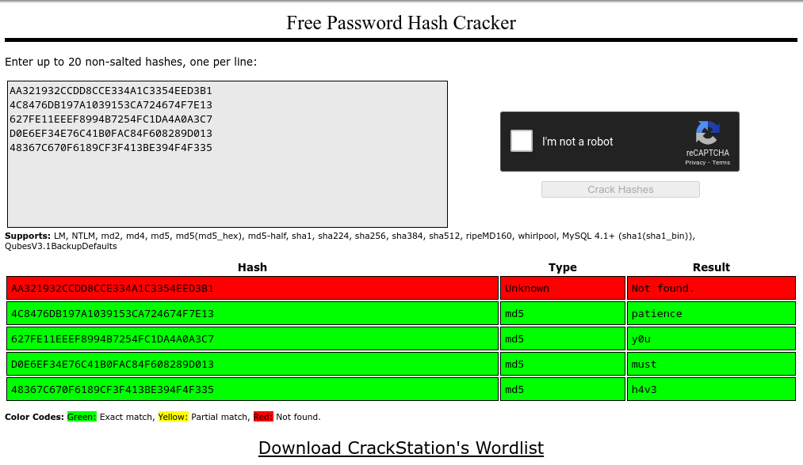
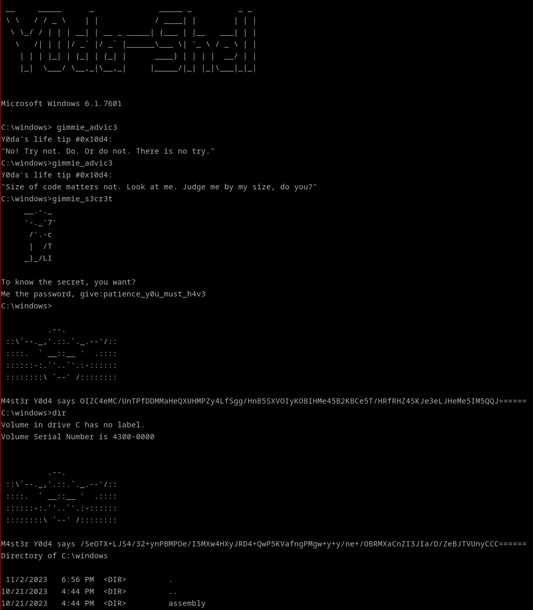
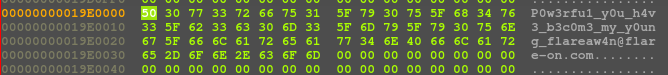
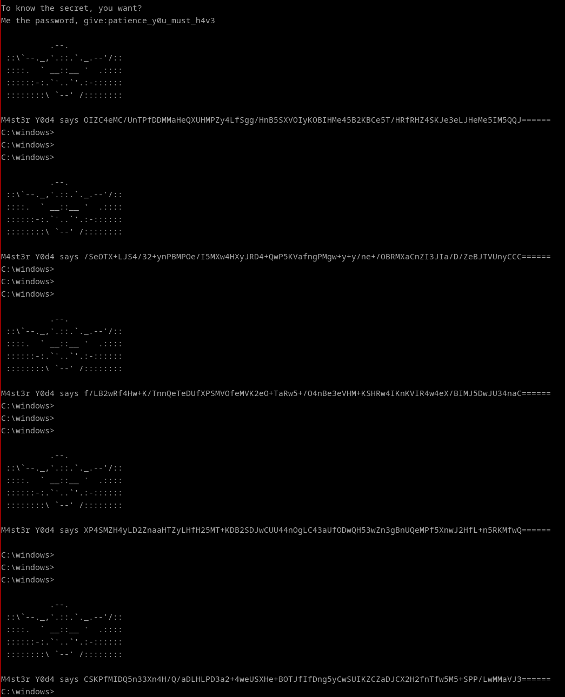

## Flare-On 2023 - #13 y0da
___

### Description: 

*So close to the end you can almost taste it.*
*Keep going champ, complete this challenge and take your place as one of the Reverse Engineers of All-Time.*

`7-zip password: flare`
___

### Solution:

The binary in this challenge has the same obfuscation with bogus `jumps` as in the
[Where Am I?](https://github.com/ispoleet/flare-on-challenges/tree/master/flare-on-2023/05_where_am_i)
challenge:
```assembly
.text:0000000180032701                     public start
.text:0000000180032701             start   proc near                       ; CODE XREF: .text:000000018003081A↑j
.text:0000000180032701 48 83 EC 28         sub     rsp, 28h
.text:0000000180032705 E9 98 0F FE         jmp     loc_1800136A2
.text:0000000180032705 FF          start   endp
.text:0000000180032705
.....
.text:00000001800136A2             loc_1800136A2:                          ; CODE XREF: start+4↓j
.text:00000001800136A2 E8 98 4E FF         call    sub_18000853F
.text:00000001800136A2 FF
.text:00000001800136A7 E9 1D 0A 02         jmp     loc_1800340C9
.text:00000001800136A7 00
.....
.text:000000018000853F 56                  push    rsi
.text:0000000180008540 E9 73 1B 05         jmp     loc_18005A0B8
.....
```

Therefore, our first goal is to deobfuscate the binary. We will reuse the same script as we did for
challenge #5, however we have to make a few changes to support the new code. The most important
change is to add a special case for `CreateThread`; When a new thread is spawned, we need to add
the thread routine to the queue so it can be analyzed later on. When we encounter an instruction
like this:
```assembly
.text:1800153AA     lea r8, [rip + 0x33edb]
```

We need to extract the target address (which is the thread routine), and the replace a `mov`
instruction, so we can easily set a new value to `R8`:
```assembly
.text:1800153AA     mov r8, 0x11223344
```

There are only **2** threads spawned, so this step is straightforward. We let our script running
and we get a nice, clean, deobfuscated binary [y0da_deobf.exe](./y0da_deobf.exe).

For more details, please refer to the [y0da_deobf.py](./y0da_deobf.py) script.


#### Reversing the Deobfuscated Code

Everything starts from `u_y0da_shell` at `0x18000104C`, which is invoked from `j_y0da_shell`,
which is invoked from `start_0`:
```assembly
.text:0000000180001000 start_0 proc near                       ; CODE XREF: start↓j
.text:0000000180001000                                         ; DATA XREF: .rdata:000000018006B6E0↓o
.text:0000000180001000         sub     rsp, 28h
.text:0000000180001004         call    j_y0da_shell
.text:0000000180001009         add     rsp, 28h
.text:000000018000100D         retn
.text:000000018000100D start_0 endp
```

```c
void __stdcall u_y0da_shell() {
  /* ... */
  v36 = 0;
  strcpy(ws2_32_dll, "ws2_32.dll");
  strcpy(user32_dll, "user32.dll");
  strcpy(SYSTEMROOT, "SYSTEMROOT");
  strcpy(
    yoda_logo,
    "                   ____                  \r\n"
    "                _.' :  `._               \r\n"
    "            .-.'`.  ;   .'`.-.           \r\n"
    "   __      / : ___\\ ;  /___ ; \\      __  \r\n"
    " ,'_ \"\"--.:__;\".-.\";: :\".-.\":__;.--\"\" _`,\r\n"
    " :' `.t\"\"--.. '<@.`;_  ',@>` ..--\"\"j.' `;\r\n"
    "      `:-.._J '-.-'L__ `-- ' L_..-;'     \r\n"
    "        \"-.__ ;  .-\"  \"-.  : __.-\"       \r\n"
    "            L ' /.------.\\ ' J           \r\n"
    "             \"-.   \"--\"   .-\"            \r\n"
    "            __.l\"-:_JL_;-\";.__           \r\n"
    "         .-j/'.;  ;\"\"\"\"  / .'\\\"-.        \r\n"
    "       .' /:`. \"-.:     .-\" .';  `.      \r\n"
    "    .-\"  / ;  \"-. \"-..-\" .-\"  :    \"-.   \r\n"
    " .+\"-.  : :      \"-.__.-\"      ;-._   \\  \r\n"
    " ; \\  `.; ;                    : : \"+. ; \r\n"
    " :  ;   ; ;                    : ;  : \\: \r\n"
    " ;  :   ; :                    ;:   ;  : \r\n"
    ": \\  ;  :  ;                  : ;  /  :: \r\n"
    ";  ; :   ; :                  ;   :   ;: \r\n"
    ":  :  ;  :  ;                : :  ;  : ; \r\n"
    ";\\    :   ; :                ; ;     ; ; \r\n"
    ": `.\"-;   :  ;              :  ;    /  ; \r\n"
    " ;    -:   ; :              ;  : .-\"   : \r\n"
    " :\\     \\  :  ;            : \\.-\"      : \r\n"
    "  ;`.    \\  ; :            ;.'_..--  / ; \r\n"
    "  :  \"-.  \"-:  ;          :/.\"      .'  :\r\n"
    "   \\         \\ :          ;/  __        :\r\n"
    "    \\       .-`.\\        /t-\"\"  \":-+.   :\r\n"
    "     `.  .-\"    `l    __/ /`. :  ; ; \\  ;\r\n"
    "       \\   .-\" .-\"-.-\"  .' .'j \\  /   ;/ \r\n"
    "        \\ / .-\"   /.     .'.' ;_:'    ;  \r\n"
    "         :-\"\"-.`./-.'     /    `.___.'   \r\n"
    "               \\ `t  ._  /            \r\n"
    "                \"-.t-._:'                \r\n"
    "\r\n"
    " __     _____      _              _____ _          _ _ \r\n"
    " \\ \\   / / _ \\    | |            / ____| |        | | |\r\n"
    "  \\ \\_/ / | | | __| | __ _ _____| (___ | |__   ___| | |\r\n"
    "   \\   /| | | |/ _` |/ _` |______\\___ \\| '_ \\ / _ \\ | |\r\n"
    "    | | | |_| | (_| | (_| |      ____) | | | |  __/ | |\r\n"
    "    |_|  \\___/ \\__,_|\\__,_|     |_____/|_| |_|\\___|_|_|\r\n"
    "                                                       \r\n"
    "                                                       \r\n");
  *&yoda_logo[2000] = 0i64;
  *&yoda_logo[2008] = 0i64;
  ws2_32_baseaddr = u_call_dll_func(ws2_32_dll, v0, v1, v2);// LoadLibraryA("ws2_32.dll")
  user32_baseaddr = u_call_dll_func(&v33, v3, v4, v5);// LoadLibraryA("user32.dll")
  if ( v37 && user32_baseaddr )
  {
    // Stack frame gets fucked up, but nvm
    *&yoda_logo[16] = u_call_dll_func(0i64, 0x58, 0x1000, 4);// VirtualAlloc
    if ( !*&yoda_logo[16] )
      u_abort(0i64);
    u_memset(*&yoda_logo[16], 0, 88i64);
    u_set_ptr(4308, (*&yoda_logo[16] + 76i64));
    buf1 = u_call_dll_func(0i64, 0x4000, 0x1000, 4);// VirtualAlloc
    *(*&yoda_logo[48] + 48i64) = buf1;
    if ( !*(*&yoda_logo[48] + 48i64) )
      u_abort(*&yoda_logo[48]);
    buf2 = u_call_dll_func(0i64, 0x4000, 0x1000, 4);// VirtualAlloc
    *(*&yoda_logo[80] + 56i64) = buf2;
    if ( !*(*&yoda_logo[80] + 56i64) )
      u_abort(*&yoda_logo[80]);
    buf3 = u_call_dll_func(0i64, 0x1000, 0x1000, 4);// VirtualAlloc
    *(*&yoda_logo[112] + 80i64) = buf3;
    if ( !*(*&yoda_logo[112] + 80i64) )
      u_abort(*&yoda_logo[112]);
    u_memset(*(*&yoda_logo[112] + 80i64), 0, 4096i64);
    LOWORD(v9) = 0x202;
    if ( u_call_dll_func(v9, &v63, v10, v11) )  // WSAStartup
      u_abort(*&yoda_logo[144]);
    u_memset(&v39, 0, 24i64);
    v39 = 24;
    v41 = 1;
    v40 = 0i64;
    if ( !u_call_dll_func((*&yoda_logo[144] + 24i64), (*&yoda_logo[144] + 40i64), &v39, 0i64) )// CreatePipe
      u_abort(*&yoda_logo[176]);
    u_memset(&v42, 0, 24i64);
    v42 = 24;
    v44 = 1;
    v43 = 0i64;
    if ( !u_call_dll_func((*&yoda_logo[176] + 16i64), (*&yoda_logo[176] + 32i64), &v42, 0i64) )// CreatePipe
      u_abort(*&yoda_logo[208]);
    u_memset(v46, 0, 104i64);
    u_memset(v45, 0, 24i64);
    v13 = u_call_dll_func(2, 1, 6, v12);        // socket
    **&yoda_logo[240] = v13;
    if ( **&yoda_logo[240] == -1i64 )
      u_abort(*&yoda_logo[240]);
    v47[0] = 2;
    v48 = 0;                                    // 0.0.0.0
    v47[1] = 0x3905;                            // big endian: 0x0539 = 1337
    *&yoda_logo[280] = u_call_dll_func(**&yoda_logo[240], v47, 0x10, v14);// bind
    if ( *&yoda_logo[280] )
      u_abort(*&yoda_logo[272]);
    u_print_flare_msg_DONT_DECOMPILE();
    u_call_dll_func(**&yoda_logo[272], 0x7FFFFFFF, v15, v16);// listen
    cli_sock = u_call_dll_func(**&yoda_logo[304], 0i64, 0i64, v17);// accept
    *(*&yoda_logo[336] + 8i64) = cli_sock;
    if ( *(*&yoda_logo[336] + 8i64) == -1i64 )
      u_abort(*&yoda_logo[336]);
    u_memset(v62, 0, 260i64);
    u_memset(v56, 0, 260i64);
    // GetEnvironmentVariableA("ComSpec") ~> C:\windows\system32\cmd.exe
    *&yoda_logo[376] = u_call_dll_func(&yoda_logo[352], v62, 0x104, v19);
    if ( !*&yoda_logo[376] )
      u_abort(*&yoda_logo[368]);
    // GetEnvironmentVariableA("SYSTEMROOT") ~> C:\windows
    *&yoda_logo[408] = u_call_dll_func(&yoda_logo[424], v59, 0x104, v20);
    if ( !*&yoda_logo[408] )
      u_abort(*&yoda_logo[400]);
    LODWORD(v55) = 104;
    v57 = 257;
    LOWORD(v58) = 0;
    v59[0] = *(*&yoda_logo[400] + 16i64);
    v60 = *(*&yoda_logo[400] + 40i64);
    v59[1] = v60;
    CreateProcess = u_get_CreateProcessA_addr();
    CreateThread = u_get_CreateThread_addr(v22, v21, v23, v24);
    if ( !CreateProcess || !CreateThread )
      u_abort(*&yoda_logo[400]);
    *&yoda_logo[360] = 0;
    *&yoda_logo[352] = 1;
    // Spawn C:\windows\system32\cmd.exe
    if ( CreateProcess(0i64, v64, 0i64, 0i64, *&yoda_logo[352], *&yoda_logo[360], 0i64, v61, &v55, &v51) )
    {
      *&yoda_logo[472] = 0;
      *&yoda_logo[412] = 0;
      while ( *&yoda_logo[412] < 1961 )         // send yoda logo
      {
        *&yoda_logo[472] = u_call_send(
                             *(*&yoda_logo[400] + 8i64),
                             &yoda_logo[*&yoda_logo[412] + 480],
                             (1961 - *&yoda_logo[412]),
                             0i64);
        if ( *&yoda_logo[472] <= 0 )
          u_abort(*&yoda_logo[400]);
        *&yoda_logo[412] += *&yoda_logo[472];
      }
      threadA = CreateThread(0i64, 0i64, u_thread_routine_A, *&yoda_logo[400], 0, 0i64);
      threadB = CreateThread(0i64, 0i64, u_thread_routine_B, *&yoda_logo[400], 0, 0i64);
      if ( !threadA || !threadB )
        u_abort(*&yoda_logo[400]);
      HIDWORD(v54) = u_call_dll_func(v51, 0xFFFFFFFFi64, v28, v29);// WaitForSingleObject
    }
    if ( threadA )
      u_call_dll_func(threadA, v25, v26, v27);
    if ( v55 )
      u_call_dll_func(v55, v25, v26, v27);
    u_abort(*&yoda_logo[496]);
  }
}
```

Calls to Dll functions are also obfuscated using the `u_call_dll_func` method. However, we can
easily infer each call by setting a breakpoint at `0x180005901`, just right before the jump to
the DLL:
```asm
.text:0000000180005901 loc_180005901:                          ; CODE XREF: u_call_dll_func+12C↑j
.text:0000000180005901         jmp     rax
```

Function displays a yoda ASCII art and waits for an incoming connection at `0.0.0.0:1337`. Once it
recives a new connection, it creates **2** pipes (using 
[CreatePipe](https://learn.microsoft.com/en-us/windows/win32/api/namedpipeapi/nf-namedpipeapi-createpipe))
and spawns a windows shell (so it can repeatedly forward BATCH commands to it).
It also spawns **2** threads:
```C
  // Spawn C:\windows\system32\cmd.exe
  if ( CreateProcess(0i64, v64, 0i64, 0i64, *&yoda_logo[352], *&yoda_logo[360], 0i64, v61, &v55, &v51) ) {
    *&yoda_logo[472] = 0;
    *&yoda_logo[412] = 0;
    while ( *&yoda_logo[412] < 1961 ) {       /* send yoda logo */
      *&yoda_logo[472] = u_call_send(
                           *(*&yoda_logo[400] + 8i64),
                           &yoda_logo[*&yoda_logo[412] + 480],
                           (1961 - *&yoda_logo[412]),
                           0i64);
      if ( *&yoda_logo[472] <= 0 )
        u_abort(*&yoda_logo[400]);
      *&yoda_logo[412] += *&yoda_logo[472];
    }
    threadA = CreateThread(0i64, 0i64, u_thread_routine_A, *&yoda_logo[400], 0, 0i64);
    threadB = CreateThread(0i64, 0i64, u_thread_routine_B, *&yoda_logo[400], 0, 0i64);
    if ( !threadA || !threadB )
      u_abort(*&yoda_logo[400]);
    HIDWORD(v54) = u_call_dll_func(v51, 0xFFFFFFFFi64, v28, v29);// WaitForSingleObject
  }
```

#### Reversing Second Thread

We start with the second thread which is simpler:
```c
// positive sp value has been detected, the output may be wrong!
void __fastcall __noreturn u_thread_routine_B(void *a1, void *a2, void *a3, void *a4) {
  /* ... */
  a1_ = a1;
  strcpy(advic3, "gimmie_advic3");
  strcpy(s3cr3t, "gimmie_s3cr3t");
  v7 = u_get_WriteFile_addr(a1, a2, a3, a4);
  v8 = 0;
  if ( !v7 )
    u_abort(a1_);
  s3cr3t[1] = u_call_dll_func(0i64, 0x4000, 0x1000, 4);// VirtualAlloc
  if ( !s3cr3t[1] )
    u_abort(v13);
  while ( 1 ){
    u_memset(s3cr3t[1], 0, 0x4000i64);
    u_memset(v13[6], 0, 0x4000i64);
    nbytes = u_recv(v13[1], v13[6], 0x4000, 0i64);
    if ( !nbytes )
      u_abort(v13);
    u_memcpy(s3cr3t[1], v13[6], 0x4000i64);
    u_remove_char(s3cr3t[1], advic3[1]);
    u_remove_char(s3cr3t[1], SBYTE1(advic3[1]));
    u_remove_char(s3cr3t[1], SBYTE2(advic3[1]));
    if ( u_strcmp(s3cr3t[1], v6) ) {            // gimmie_advic3 ?
      if ( u_strcmp(s3cr3t[1], &v8) ) {         // gimmie_s3cr3t ?
        v9 = (a1_)(v13[4], v13[6], nbytes, s3cr3t, 0i64, advic3[0]);
        if ( !v9 || !LODWORD(s3cr3t[0]) )
          u_abort(v13);
      } else {
        u_give_password();
        v9 = (a1_)(v13[4], &advic3[1] + 4, 2i64, s3cr3t, 0i64);// WriteFile
      }
    } else {
      u_give_advice(v13, &v12);
      v9 = (a1_)(v13[4], &advic3[1] + 4, 2i64, s3cr3t, 0i64);
    }
  }
}
```

This thread is responsible for handling two commands: `gimmie_advic3` and `gimmie_s3cr3t`.
The first command invokes `u_give_advice` that displays a random advice:
```c
void __fastcall u_give_advice(_BYTE *a1, _BYTE *a2) {
  /* ... */
  strcpy(adv1, "\"No! Try not. Do. Or do not. There is no try.\"");
  strcpy(adv2, "\"Size of code matters not. Look at me. Judge me by my size, do you?\"");
  strcpy(adv3, "\"A Jedi uses the Force for knowledge and defense, never for attack.\"");
  strcpy(adv4, "\"A Jedi's strength flows from their knowledge of assembly.\"");
  strcpy(adv5, "\"Fear of malware is the path to the dark side.\"");
  strcpy(adv6, "\"Obfuscation leads to anger. Anger leads to hate. Hate leads to suffering.\"");
  strcpy(adv7, "\"Packers, crypters, shellcode. The dark side are they.\"");
  strcpy(adv8, "\"Train yourself to let go of the decompiler you are afraid to lose.\"");
  strcpy(adv9, "\"The greatest teacher failure is.\"");
  strcpy(adv10, "\"Truly wonderful the mind of a reverse engineer is.\"");
  strcpy(v16, "\"If no mistake you have made, losing you are. A different game you should play.\"");
  strcpy(v6, "\"Won this job in a raffle I did, think you?\"");
  v17 = 0;
  strcpy(v3, "Y0da's life tip #0x%x:\n%s\n");
  v21 = u_call_dll_func(0i64, 0x1000, 0x1000, 4);// ReadFile
  /* ... */
  while ( *&v3[20] < v20 ) {
    v18 = u_call_send(v26[1], &v21[*&v3[20]], (v20 + 1 - *&v3[20]), 0i64);
    if ( !v18 )
      u_abort(v26);
    *&v3[20] += v18;
  }
  /* ... */
 }
```

The second command invokes `u_give_password` which asks for a password:
```c
void __stdcall u_give_password() {
  /* ... */

  v9 = 0;
  strcpy(promt, "'.-c\n      |  /T\n     _)_/LI\n \nTo know the secret, you want? \nMe the password, give:");
  strcpy(
    badboy,
    "\n"
    "         _.-'~~~~~~`-._\n"
    "        /      ||      \\\n"
    "       /       ||       \\\n"
    "      |        ||        |\n"
    "      | _______||_______ |\n"
    "      |/ ----- \\/ ----- \\|\n"
    "     /  (     )  (     )  \\\n"
    "    / \\  ----- () -----  / \\\n"
    "   /   \\      /||\\      /   \\\n"
    "  /     \\    /||||\\    /     \\\n"
    " /       \\  /||||||\\  /       \\\n"
    "/_        \\o========o/        _\\\n"
    "  `--...__|`-._  _.-'|__...--'\n"
    "          |    `'    |\n"
    "\t\t  \n"
    "\t\t  NO.\n");
  v10 = u_call_dll_func(0i64, 0x4000, 0x1000, 4);// VirtualAlloc
  for ( i = 0; i < 0x75; i += v3 ) {             // send banner
    v3 = u_call_send(v12[1], &promt[117 * i], (117 - i), 0i64);
    if ( !v3 )
      u_abort(v12);
  }
  if ( !u_recv(v12[1], v12[6], 0x4000, 0i64) )
    u_abort(v12);
  u_memcpy(v10, v12[6], 0x4000i64);
  u_remove_char(v10, ' ');
  u_remove_char(v10, '\r');
  u_remove_char(v10, '\n');
  if ( !u_verify_password_decrypt_fake_img(v10, v12, v0, v1) ) {
    for ( j = 0; j < 0x198; j += v4 ) {          // send badboy
      v4 = u_call_send(v12[1], &badboy[408 * j + 32], (408 - j), 0i64);
      if ( !v4 )
        u_abort(v12);
    }
  }
  if ( v10 )
    u_call_dll_func(v10, 0i64, 0x8000, v2);     // VirtualFree
}
```

The password is verified in `u_verify_password_decrypt_fake_img`:
```c
__int64 __fastcall u_verify_password_decrypt_fake_img(char *rcx0, __int64 a2, __int64 a3, __int64 a4) {
  /* ... */
  // Password must be: patience_y0u_must_h4v3
  if ( !u_check_password_with_md5(rcx0, a2, a3, a4, 0xE0FFD8FFi64) )
    return 0i64;
  if ( !*(a2 + 64) )
  {
    *(a2 + 64) = u_load_M4ST3R_Y0D4_resource(v9 + 4, v4, v5, v6, v9[0]);
    if ( !*(a2 + 64) )
      return 0i64;
  }
  v8 = u_strlen(rcx0);
  u_do_rc4(rcx0, v8, *(a2 + 64), SHIDWORD(v9[0]));
  if ( u_memcmp(*(a2 + 64), v9, 4i64) )     // Check if it is valid JFIF:  FF D8 FF E0
    return 0i64;
  *(a2 + 72) = HIDWORD(v9[0]);
  return 1i64;
}
```

Function calls `u_check_password_with_md5` to verify the password, and if it is correct, it loads
the resource `Y0D4/M4ST3R` ([M4ST3R_Y0D4.resource.bin](./M4ST3R_Y0D4.resource.bin)):
```c
__int64 __fastcall u_load_M4ST3R_Y0D4_resource(__int64 a1, __int64 a2, __int64 a3, __int64 a4, _DWORD *a5) {
  /* ... */
  strcpy(y0d4, "Y0D4");                         // resource path
  strcpy(m4st3r, "M4ST3R");
  v13 = 0i64;
  v11 = 0i64;
  mz_addr = u_search_for_MZ_header();
  if ( !mz_addr )
    return 0i64;
  v12 = u_FindResourceA(mz_addr, y0d4, m4st3r);
  if ( !v12 )
    return 0i64;
  v7 = u_SizeofResource(mz_addr, v12);
  if ( !v7 )
    return 0i64;
  resource = u_LoadResource(mz_addr, v12);
  resource_ = resource;
  if ( !resource )
    return 0i64;
  v13 = u_LockResource(resource_);
  if ( v13 )
  {
    resource_copy = u_call_dll_func(0i64, v7, 4096i64, 64i64);// VirtualAlloc
    if ( !resource_copy )
      return 0i64;
    u_memcpy(resource_copy, a1, v11);
    *a5 = v11;
  }
  return resource_copy;
}
```

This resource is obviously encrypted, so it uses the (correct) password to decrypt it with
[RC4](https://en.wikipedia.org/wiki/RC4):
```c
void __fastcall u_do_rc4(__int64 a1, int a2, char *a3, int a4) {
  char a1_S[264]; // [rsp+20h] [rbp-108h] BYREF

  u_rc4_key_sched(a1, a2, a1_S);
  u_rc4_crypt(a1_S, a3, a4, a3);
}
```

Finally it uses `u_memcmp` to verify that the resource has decrypted correctly (we check if the
first **4** bytes are `FF D8 FF E0`).

The last part is the `u_check_password_with_md5` that does the actual password verification:
```c
__int64 __fastcall u_check_password_with_md5(char *a1, __int64 rdx0, __int64 a3, __int64 a4, _BYTE *a2) {
  /* ... */
  v16 = a1;
  v11 = 0i64;
  v10 = 0;
  buf[0] = 0x15;
  buf[1] = 0x3C;
  buf[2] = 0xA7;
  buf[3] = 0x24;
  buf[4] = 0x67;
  buf[5] = 0x4F;
  buf[6] = 0x7E;
  buf[7] = 0x13;
  buf[8] = 0x62;
  buf[9] = 0x7F;
  buf[10] = 0xE1;
  buf[11] = 0x1E;
  buf[12] = 0xEE;
  buf[13] = 0xF8;
  buf[14] = 0x99;
  buf[15] = 0x4B;
  buf[16] = 0x72;
  buf[17] = 0x54;
  buf[18] = 0xFC;
  buf[19] = 0x1D;
  buf[20] = 0xA4;
  buf[21] = 0xA0;
  buf[22] = 0xA3;
  buf[23] = 0xC7;
  buf[24] = 0xD0;
  buf[25] = 0xE6;
  buf[26] = 0xEF;
  buf[27] = 0x34;
  buf[28] = 0xE7;
  buf[29] = 0x6C;
  buf[30] = 0x41;
  buf[31] = 0xB0;
  buf[32] = 0xFA;
  buf[33] = 0xC8;
  buf[34] = 0x4F;
  buf[35] = 0x60;
  buf[36] = 0x82;
  buf[37] = 0x89;
  buf[38] = 0xD0;
  buf[39] = 0x13;
  buf[40] = 0x48;
  buf[41] = 0x36;
  buf[42] = 0x7C;
  buf[43] = 0x67;
  buf[44] = 0xF;
  buf[45] = 0x61;
  buf[46] = 0x89;
  buf[47] = 0xCF;
  buf[48] = 0x3F;
  buf[49] = 0x41;
  buf[50] = 0x3B;
  buf[51] = 0xE3;
  buf[52] = 0x94;
  buf[53] = 0xF4;
  buf[54] = 0xF3;
  buf[55] = 0x35;
  if ( !a1 )
    return 0i64;
  v6 = u_strlen(v16);
  alloc = u_call_dll_func(0i64, v6, 0x1000, 4); // VirtualAlloc
  if ( !alloc )
    return 0i64;
  v7 = u_strlen(a2);
  u_memcpy(alloc, a2, v7);
  u_memset(v15, 0, 16i64);
  u_do_md5(alloc, v15);
  if ( !u_memcmp(v15, &buf[8], 16i64) )         // AA321932CCDD8CCE334A1C3354EED3B1
    v13 = 1;
  str = u_strtok(alloc, buf, &v16);             // "_"
  do {
    u_do_md5(str, v15);
    if ( !*&buf[4] && u_memcmp(v15, &buf[24], 16i64) )// 4C8476DB197A1039153CA724674F7E13 = patience
      break;
    if ( *&buf[4] == 1 && u_memcmp(v15, &buf[40], 16i64) )// 627FE11EEEF8994B7254FC1DA4A0A3C7 = y0u
      break;
    if ( *&buf[4] == 2 && u_memcmp(v15, &buf[56], 16i64) )// D0E6EF34E76C41B0FAC84F608289D013 = must
      break;
    if ( *&buf[4] == 3 && u_memcmp(v15, &v11, 16i64) )// 48367C670F6189CF3F413BE394F4F335 = h4v3
      break;
    str = u_strtok(0i64, buf, &v16);
    ++*&buf[4];
    if ( !str )
      break;
  } while ( *&buf[4] < 4 );
  if ( alloc )
    u_call_dll_func(alloc, 0i64, 0x8000, v8);   // VirtualFree
  HIDWORD(v16) = *&buf[36] == 4 && v16;
  return HIDWORD(v16);
}
```

Function checks if the MD5 digest of the password is `AA321932CCDD8CCE334A1C3354EED3B1`. If it is
not, it uses `u_strtok` to split the password into tokens using the `_` separator. Then it checks
the MD4 digest of each token. Tokens are simple words, so we use
[CrackStation](https://crackstation.net/) to crack their hashes:



The password is `patience_y0u_must_h4v3`. We type it in and then we start receiving some "random"
messages from `M4st3r Y0d4` which originate from the first thread:



We also decrypt the image, however the flag is not there:


#### Reversing First Thread

The first thread is the one that sends the commands for execution through the pipe to the `cmd.exe`
and reads back the command output:
```c
__int64 __fastcall u_thread_routine_A(__int64 (__fastcall *rcx0)(_QWORD, _QWORD, _QWORD, _QWORD, __int64 *)) {
  /* ... */
  PeekNamedPipe_1 = rcx0;
  PeekNamedPipe = u_get_PeekNamedPipe_addr();
  ReadFile = u_ReadFile();
  strcpy(
    yoda,
    "          .--.           \n"
    " ::\\`--._,'.::.`._.--'/::\n"
    " ::::.  ` __::__ '  .::::\n"
    " ::::::-:.`'..`'.:-::::::\n"
    " ::::::::\\ `--' /::::::::\n"
    "\n"
    "M4st3r Y0d4 says ");
  v7 = 0i64;
  master_yoda_says = u_call_dll_func(0i64, 0x4000, 0x1000, 4);// ReadFile
  if ( !master_yoda_says )
    u_abort(v15);
  if ( !PeekNamedPipe_1 || !ReadFile_ )
    u_abort(v15);
  while ( 1 ) {
    u_memset(*(v15 + 56), 0, 0x4000i64);
    do
      *&yoda[16] = PeekNamedPipe_1(*(v15 + 24), 0i64, 0i64, 0i64, &yoda[8]);
    while ( *&yoda[16] && !*&yoda[8] );
    if ( !*&yoda[16] )
      break;
    if ( *&yoda[8] ) {
      *&yoda[8] = 0;
      // read CMD output (response)
      *&yoda[16] = ReadFile_(*(v15 + 24), *(v15 + 56), 0x4000i64, &yoda[8]);
      if ( !*&yoda[16] || !*&yoda[8] )
        u_abort(v15);
      LODWORD(v11) = v11 + 1;
      if ( *(v15 + 64) )  {
        if ( !u_memcmp(*(v15 + 64), &yoda[20], 4i64) && !(v11 % 3) ) {// compare JFIF header (FF D8 FF E0)
          u_memset(master_yoda_says, 0, 0x4000i64);
          u_encr_y0da_response();
          u_strcat(master_yoda_says, yoda);
          u_strcat(master_yoda_says, &yoda[32]);
          u_strcat(master_yoda_says, *(v15 + 80));
          u_strcat(master_yoda_says, yoda);     // newline
          HIDWORD(v11) = u_strlen(*(v15 + 80)) + 151;
          /* ... */
        }
      }
      /* ... */
    }
  }
  return 0i64;
}
```

Where it gets interesting is if the resource is already decrypted (i.e., the user has entered
the correct password).Then it calls `u_encr_y0da_response` to  generate an encrypted string:
```c
void __fastcall u_encr_y0da_response() {
  /* ... */
  u_set_rcx_to_arg();
  v1 = alloca(v0);
  v3[0] = 0xFF;
  v3[1] = 0xD8;
  v3[2] = 0xFF;
  v3[3] = 0xE0;
  v3[4] = 0xFF;
  v3[5] = 0xE1;
  v3[6] = 0xAA;
  v3[7] = 0x3B;
  v3[8] = 0xFF;
  v3[9] = 0xE2;
  v3[10] = 0xA1;
  v3[11] = 0xC5;
  if ( *(v20 + 64) ) {
    if ( !u_memcmp(*(v20 + 64), v3, 4i64) ) {    // cmp JFIF header FF D8 FF E0
      if ( u_call_dll_func(0i64, 0x1000, 0x1000, 4) ) {// VirtualAlloc
        if ( u_call_dll_func(0i64, 0x1000, 0x1000, 4) ) {// VirtualAlloc
          ii = u_call_dll_func(0i64, 0x1000, 0x1000, 4);// VirtualAlloc
          if ( ii ) {
            buf4_big_jfif = u_call_dll_func(0i64, 0x1000, 0x1000, 0x40);// VirtualAlloc
            if ( buf4_big_jfif ) {
              u_memset(buf1, 0, 4096i64);
              u_memset(buf2, 0, 4096i64);
              u_memset(buf3_small_jfif, 0, 4096i64);
              u_memset(buf4_big_jfif, 0, 4096i64);
              //   0x7F, 0x2B, 0xD8, 0xF5, 0xC3, 0x44, 0x6D, 0xB7, 0x75, 0x95, 
              //   0x89, 0xA7, 0xB9, 0xC3, 0x2C, 0x3F, 0x9E, 0x91, 0xB8, 0xDC, 
              //   0x6E, 0x55, 0xA7, 0x51, 0xE6, 0x2C, 0x59, 0xBC, 0x9C, 0x12, 
              //   0x98, 0x06, 0x8B, 0xA0, 0x50, 0x79, 0x18, 0xAA, 0x29, 0x4E, 
              //   0x84, 0x96, 0x5F, 0xA6, 0x37, 0x9F, 0xED, 0x9A, 0x33, 0x3C, 
              //   0xED, 0x34, 0x2D, 0x63, 0x7F, 0x6C, 0x5A
              middle_buf = u_search_for_patterns_in_jfif(*(v21 + 64), *(v21 + 72), &v7);// find between FF E1 AA 3B and FF E2 A1 C5
              if ( middle_buf ) {
                u_memcpy(buf3_small_jfif, middle_buf + 4, 57i64);
                v16 = u_search_for_patterns_in_jfif(*(v21 + 64), *(v21 + 72), &v8);
                if ( v16 )
                {
                  // 05 AC 00 00 00 C3 05 E4  00 00 00 C3 05 E8 00 00
                  // 00 C3 83 C0 5A C3 83 C0  60 C3 83 C0 70 C3 83 C0
                  // 7B C3 05 8F 00 00 00 C3  05 96 00 00 00 C3 03 45
                  // 24 C3 48 83 C5 38 C3 39  45 24 C3 FF C0 C3 88 04
                  // 0A C3 89 55 10 C3 4C 89  45 18 C3 88 45 20 C3 89
                  // 45 24 C3 48 89 4D 08 C3  C7 45 24 00 00 00 00 C3
                  // 8B 45 24 C3 8B 45 48 C3  8B 4D 24 C3 48 8B 4D 40
                  // C3 48 8B 55 40 C3 48 8B  55 50 C3 0F B6 04 01 C3
                  // 0F B6 45 20 C3 0F B6 0C  0A C3 0F B6 4D 20 C3 F7
                  // D8 C3 F7 D0 C3 0B C1 C3  D1 F8 C3 C1 F8 02 C3 C1
                  // F8 03 C3 C1 F8 05 C3 C1  F8 06 C3 C1 F8 07 C3 D1
                  // E1 C3 C1 E1 02 C3 C1 E1  03 C3 C1 E1 05 C3 C1 E1
                  // 06 C3 C1 E1 07 C3 2D B1  00 00 00 C3 2D B2 00 00
                  // 00 C3 2D C3 00 00 00 C3  2D C5 00 00 00 C3 2D DC
                  // 00 00 00 C3 2D F3 00 00  00 C3 2D FF 00 00 00 C3
                  // 83 E8 18 C3 83 E8 1A C3  83 E8 1E C3 83 E8 28 C3
                  // 83 E8 36 C3 83 E8 04 C3  83 E8 49 C3 83 E8 56 C3
                  // 83 E8 58 C3 2D 81 00 00  00 C3 2D 90 00 00 00 C3
                  // 2D 9A 00 00 00 C3 2B 45  24 C3 48 83 ED 38 C3 35
                  // A3 00 00 00 C3 35 B6 00  00 00 C3 35 BF 00 00 00
                  // C3 35 C2 00 00 00 C3 35  C9 00 00 00 C3 35 CB 00
                  // 00 00 C3 83 F0 0D C3 35  E1 00 00 00 C3 35 EB 00
                  // 00 00 C3 83 F0 16 C3 83  F0 20 C3 83 F0 22 C3 83
                  // F0 25 C3 83 F0 40 C3 83  F0 78 C3 83 F0 7C C3 35
                  // 8F 00 00 00 C3 33 45 24  C3 33 C0 C3 33 C1 C3 FF
                  // C1 C3 8B C9 C3 81 E1 FF  00 00 00 C3 8B 55 24 C3
                  // 83 C2 02 C3 8B D2 C3 4C  8B 45 50 C3 41 0F B6 14
                  // 10 C3 D1 FA C3 81 E2 FF  00 00 00 C3 23 CA C3 83
                  // C1 03 C3 00 00 00 00 00  00 00 00 00 00 00 00 00
                  u_memcpy(buf4_big_jfif, v16 + 4, 451i64);
                  LODWORD(nxt_prng) = u_lcg_nxt_num((v21 + 76));// Init value: 0xD410
                  qmemcpy(lcg_buf, u_gen_buf_from_lcg(&v19, nxt_prng), 0x9C4ui64);
                  qmemcpy(lcg_buf_, lcg_buf, 0x9C4ui64);
                  LODWORD(ii) = 0;
                  while ( ii < 60 ) {
                    num = u_select_num_n_shuffle(lcg_buf_);
                    buf1[ii] = HIBYTE(num);     // buf1 values depend on LCG value
                    buf1[ii + 1] = BYTE2(num);
                    buf1[ii + 2] = BYTE1(num);
                    buf1[ii + 3] = num;
                    LODWORD(ii) = ii + 4;
                  }
                  // ZERO OUT buf1 (r8 = 0x19D0000) and 
                  // u_do_rop will return the flag! on buf3 (rcx = 0x19E0000)
                  u_do_rop(buf3_small_jfif, 57i64, buf1, buf4_big_jfif);
                  u_encode_rop_result(buf3_small_jfif, 0x38ui64, *(v21 + 80));
                  if ( buf2 )
                    u_call_dll_func(buf2, 0i64, 0x8000, v2);// VirtualFree
                  if ( nxt_prng )
                    u_call_dll_func(nxt_prng, 0i64, 0x8000, v2);// VirtualFree
                  if ( lcg_buf[2] )
                    u_call_dll_func(lcg_buf[2], 0i64, 0x8000, v2);// VirtualFree
                  if ( lcg_buf[7] )
                    u_call_dll_func(lcg_buf[7], 0i64, 0x8000, v2);// VirtualFree
                }
              }
            }
          }
        }
      }
    }
  }
}
```

Program checks first if the resource has been decrypted correctly (i.e., start with the JFIF header 
pattern `FF D8 FF E0`). If so, it searches inside for the pattern `FF E1 AA 3B` and the pattern
`FF E2 A1 C5` and gets everything between as a special buffer `bufA`. It repeats the same process
for another buffer `buf4_big_jfif`, however this is not used anywhere.

After that it uses an 
[Linear Congruential Generator (LCG)](https://en.wikipedia.org/wiki/Linear_congruential_generator)
to generate a pseudo-random number:
```c
__int64 __fastcall u_lcg_nxt_num(unsigned int *a1) {
  *a1 = (1103515245 * *a1 + 12345) & 0x7FFFFFFF;
  return *a1;
}
```

The seed is initialized to `0x10D4`. **The master yoda responses are derived just from that number.**

The program generates a pseudo random buffer of `624` integers, just by using the random seed.
We call this buffer `lcg_buf`:
```c
int *__fastcall u_gen_buf_from_lcg(int *a1_out, int a2_lcg_num) {
  int v3[634]; // [rsp+20h] [rbp-9E8h] BYREF

  u_shuffle(v3, a2_lcg_num);
  qmemcpy(a1_out, v3, 0x9C4ui64);
  return a1_out;
}
```

```c
void __fastcall u_shuffle(_DWORD *a1_buf, int a2_lcg_num) {
  *a1_buf = a2_lcg_num;
  for ( a1_buf[624] = 1; a1_buf[624] < 624; ++a1_buf[624] )
    a1_buf[a1_buf[624]] = a1_buf[624] + 0x6C078965 * ((a1_buf[a1_buf[624] - 1] >> 30) ^ a1_buf[a1_buf[624] - 1]);
}
```

After program, generates that buffer `lcg_buf`, it does another round of encryption to generate
buffer `buf1` using `u_select_num_n_shuffle`:
```c
while ( ii < 60 ) {
  num = u_select_num_n_shuffle(lcg_buf_);
  buf1[ii] = HIBYTE(num);     // buf1 values depend on LCG value
  buf1[ii + 1] = BYTE2(num);
  buf1[ii + 2] = BYTE1(num);
  buf1[ii + 3] = num;
  LODWORD(ii) = ii + 4;
}
```

```c
int __fastcall u_select_num_n_shuffle(_DWORD *a1) {
  /* ... */
  v8[0] = 0;
  v8[1] = 0x9908B0DF;
  if ( a1[624] >= 0x270u )
  {
    if ( a1[624] >= 0x271u )
      u_shuffle(a1, 4357);
    for ( i = 0; i < 227; ++i )
    {
      v2 = a1[i + 1] & 0x7FFFFFFF | a1[i] & 0x80000000;
      a1[i] = v8[v2 & 1] ^ (v2 >> 1) ^ a1[i + 397];
    }
    while ( i < 623 )
    {
      v5 = a1[i + 1] & 0x7FFFFFFF | a1[i] & 0x80000000;
      a1[i] = v8[v5 & 1] ^ (v5 >> 1) ^ a1[i - 227];
      ++i;
    }
    v6 = *a1 & 0x7FFFFFFF | a1[623] & 0x80000000;
    a1[623] = v8[v6 & 1] ^ (v6 >> 1) ^ a1[396];
    a1[624] = 0;
  }
  v3 = a1[a1[624]++];
  v4 = (((v3 >> 11) ^ v3) << 7) & 0x9D2C5680 ^ (v3 >> 11) ^ v3;
  return (((v4 << 15) & 0xEFC60000 ^ v4) >> 18) ^ (v4 << 15) & 0xEFC60000 ^ v4;
}
```

At this point program has generated a `0x39` byte random buffer `buf1`.

After that there is a very interesting function `u_do_rop` at `0x1800115A8`:
```c
__int64 __fastcall u_do_rop(__int64 a1, __int64 a2, __int64 a3, __int64 a4) {
  /* ... */
  v6 = a2;
  for ( i = 0; ; ++i ) {
    result = v6;
    if ( i >= v6 )
      break;
    u_rop(a4, a2, a3, a4);
  }
  return result;
}
```

This function is a wrapper for `u_rop` which prepares a ROP chain:
```assembly
.text:00000001800118DB ; void __fastcall u_rop(__int64, __int64, __int64, __int64)
.text:00000001800118DB u_rop   proc near                       ; CODE XREF: u_do_rop+37↑p
.text:00000001800118DB         mov     rbp, rsp
.text:00000001800118DE         add     rbp, 8
.text:00000001800118E2         mov     rsi, r9
.text:00000001800118E5         add     rsi, 3Eh ; '>'
.text:00000001800118E9         push    rsi
.text:00000001800118EA         mov     rsi, r9
.text:00000001800118ED         add     rsi, 71h ; 'q'
.text:00000001800118F1         push    rsi
.text:00000001800118F2         mov     rsi, r9
.text:00000001800118F5         add     rsi, 68h ; 'h'
.text:00000001800118F9         push    rsi
.text:00000001800118FA         mov     rsi, r9
.text:00000001800118FD         add     rsi, 18Ch
.text:0000000180011904         push    rsi
.text:0000000180011905         mov     rsi, r9
.text:0000000180011908         add     rsi, 195h
.text:000000018001190F         push    rsi
.text:0000000180011910         mov     rsi, r9
.text:0000000180011913         add     rsi, 0B2h
.text:000000018001191A         push    rsi
.text:000000018001191B         mov     rsi, r9
.text:000000018001191E         add     rsi, 85h
.text:0000000180011925         push    rsi
.text:0000000180011926         mov     rsi, r9
.text:0000000180011929         add     rsi, 76h ; 'v'
.text:000000018001192D         push    rsi
.....
.text:0000000180012E5D         add     rsi, 7Bh ; '{'
.text:0000000180012E61         push    rsi
.text:0000000180012E62         mov     rsi, r9
.text:0000000180012E65         add     rsi, 6Ch ; 'l'
.text:0000000180012E69         push    rsi
.text:0000000180012E6A         mov     rsi, r9
.text:0000000180012E6D         add     rsi, 60h ; '`'
.text:0000000180012E71         push    rsi
.text:0000000180012E72         retn
.text:0000000180012E72 u_rop   endp ; sp-analysis failed
```

The first part of the ROP chain is shown below:
```assembly
debug046:00000000019F0060         mov     eax, [rbp+24h]
debug046:00000000019F0063         retn

debug046:00000000019F006C         mov     rcx, [rbp+40h]
debug046:00000000019F0070         retn

debug046:00000000019F007B         movzx   eax, byte ptr [rcx+rax]
debug046:00000000019F007F         retn

debug046:00000000019F004B         mov     [rbp+20h], al
debug046:00000000019F004E         retn

.....
```

This `u_rop` function decrypts a single character from `bufA`. We will see later how it does that.
Once `bufA` is decrypted, program invokes `u_encode_rop_result` to produce this strange master yoda
string:
```c
void __fastcall u_encode_rop_result(char *a1_buf, unsigned __int64 a2_buflen, char *a3_out) {
  /* ... */
  i = 0i64;
  j = 0i64;
  while ( i < a2_buflen ) {
    v3 = u_min(a2_buflen - i, 5ui64);
    sub_180012EDD(&a1_buf[i], v3, &a3_out[j]);
    i += 5i64;
    j += 8i64;
  }
}
```

```c
void __fastcall sub_180012EDD(char *a1, int a2, __int64 a3) {
  /* ... */
  for ( i = 0; i < 8; ++i ) {
    v5 = u_5_mult_a1_div_8(i);
    v6 = u_3_minus_5_mult_a1_mod_8(i);
    if ( v5 >= a2 ) {
      u_fill_in_with_equal(&a3[i], 8 - i);
      return;
    }
    v3 = u_num_shift(a1[v5], v6);
    if ( v6 < 0 && v5 < a2 - 1 )
      v3 |= u_num_shift(a1[v5 + 1], v6 + 8);
    a3[i] = u_custom_decrypt_1(v3);
  }
}
```

```c
__int64 __fastcall u_custom_decrypt_1(char a1) {
  /* ... */
  v5[0] = 103;
  v5[1] = -107;
  v5[2] = -56;
  v5[3] = -115;
  v5[4] = -111;
  v5[5] = 49;
  v5[6] = -61;
  qmemcpy(v6, "!~J:MVU", 7);
  v6[7] = 127;
  v6[8] = 88;
  v6[9] = 93;
  v6[10] = 45;
  v6[11] = -73;
  v6[12] = -51;
  v6[13] = 37;
  v6[14] = -1;
  v6[15] = 38;
  v6[16] = 100;
  v6[17] = 109;
  v6[18] = -67;
  v6[19] = -52;
  v6[20] = -35;
  v6[21] = 58;
  v6[22] = 80;
  v6[23] = -58;
  v6[24] = -100;
  v6[25] = -69;
  v6[26] = -7;
  for ( i = 0; i < 0x22ui64; ++i ) {
    v2 = i + (i ^ v5[i]);
    v3 = ((8 * v2) | (v2 >> 5)) - 107;
    v5[i] = (i ^ -(((-(~(~((((32 * v3) | (v3 >> 3)) - i) ^ 0xC3) - i) ^ 0xA9) - 60) ^ 0x1C) + 73)) - 30;
  }
  return v5[a1 & 0x1F];
}
```

#### Reversing the ROP chain

Okay, the only part missing here is the ROP chain. Since the ROP chain is large we need to
connect the code and decompile it. First we set a breakpoint at `0x180012E72` right before the
ROP chain is launched:
```assembly
.text:0000000180012E69         push    rsi
.text:0000000180012E6A         mov     rsi, r9
.text:0000000180012E6D         add     rsi, 60h ; '`'
.text:0000000180012E71         push    rsi
.text:0000000180012E72         retn
.text:0000000180012E72 u_rop   endp ; sp-analysis failed
.text:0000000180012E72
```

Then we use the [y0da_dump_rop_chain.py](./y0da_dump_rop_chain.py) script to extract the ROP
instructions into a buffer `rop_prog`:
```python
rop_start = idc.get_reg_value('rsp')
# .text:00000001800115E4         mov     eax, [rsp+38h+var_14]
rop_end   = 0x167DED8
print(f'[+] ROP start in stack: {rop_start:08X}')
print(f'[+] ROP end   in stack: {rop_end:08X}')

rop_prog = b''
for stack_addr in range(rop_start, rop_end, 8):
  insn_addr = ida_bytes.get_qword(stack_addr)
  asm = idc.generate_disasm_line(insn_addr, flags=GENDSM_FORCE_CODE)

  insn = idaapi.insn_t()
  length = idaapi.decode_insn(insn, insn_addr)
  print(f'[+] ROP instruction at: {insn_addr:08X}: {asm} ({length} bytes)')

  rop_prog += ida_bytes.get_bytes(insn_addr, length)

rop_prog += '\xC3'  # finish with a return instruction, so IDA will know where the function ends

for i, p in enumerate(rop_prog):
  ida_bytes.patch_byte(0x19F0000 + i, p)
```

After we run the script all ROP instructions are together at `0x19F0000`, so we can decompile the
function:
```c
__int64 __fastcall u_fixed_rop_shellcode() {
  __int64 v0; // rbp
  __int64 v1; // r8
  __int64 result; // rax

  // (v0 + 36) = i
  // (v0 + 64) = 0x19E0000 = buf that we are going to decrypt
  // (v0 + 32) = tmp 
  // (v0 + 80) = 0x19D0000 = buf2 = generated buf from `u_select_num_n_shuffle`

  *(v0 + 32) = *(*(v0 + 64) + *(v0 + 36));
  *(v0 + 32) = (32 * *(v0 + 32)) | (*(v0 + 32) >> 3);
  *(v0 + 32) -= 84;
  *(v0 + 32) ^= *(v0 + 36);
  *(v0 + 32) -= 4;
  *(v0 + 32) ^= *(v0 + 36);
  *(v0 + 32) = ~*(v0 + 32);
  *(v0 + 32) -= *(v0 + 36);
  *(v0 + 32) = (32 * *(v0 + 32)) | (*(v0 + 32) >> 3);
  *(v0 + 32) += *(v0 + 36);
  *(v0 + 32) = (*(v0 + 32) << 6) | (*(v0 + 32) >> 2);
  *(v0 + 32) = ~*(v0 + 32);
  *(v0 + 32) = (4 * *(v0 + 32)) | (*(v0 + 32) >> 6);
  *(v0 + 32) += *(v0 + 36);
  *(v0 + 32) = ~*(v0 + 32);
  *(v0 + 32) ^= 0xDu;
  *(v0 + 32) = -*(v0 + 32);
  *(v0 + 32) += 123;
  *(v0 + 32) ^= 0xBFu;
  *(v0 + 32) += 61;
  *(v0 + 32) ^= *(v0 + 36);
  *(v0 + 32) += 96;
  *(v0 + 32) = (8 * *(v0 + 32)) | (*(v0 + 32) >> 5);
  *(v0 + 32) += *(v0 + 36);
  *(v0 + 32) = ~*(v0 + 32);
  *(v0 + 32) -= 24;
  *(v0 + 32) ^= *(v0 + 36);
  *(v0 + 32) -= *(v0 + 36);
  *(v0 + 32) ^= *(v0 + 36);
  *(v0 + 32) += 13;
  *(v0 + 32) ^= *(v0 + 36);
  *(v0 + 32) = (*(v0 + 32) << 6) | (*(v0 + 32) >> 2);
  *(v0 + 32) ^= *(v0 + 36);
  *(v0 + 32) = -*(v0 + 32);
  *(v0 + 32) += 59;
  *(v0 + 32) = ~*(v0 + 32);
  *(v0 + 32) = (2 * *(v0 + 32)) | (*(v0 + 32) >> 7);
  ++*(v0 + 32);
  *(v0 + 32) = (2 * *(v0 + 32)) | (*(v0 + 32) >> 7);
  *(v0 + 32) -= *(v0 + 36);
  *(v0 + 32) ^= 0x8Fu;
  *(v0 + 32) += 112;
  *(v0 + 32) = ~*(v0 + 32);
  *(v0 + 32) -= 54;
  *(v0 + 32) = (*(v0 + 32) << 6) | (*(v0 + 32) >> 2);
  *(v0 + 32) = ~*(v0 + 32);
  *(v0 + 32) -= 24;
  *(v0 + 32) = -*(v0 + 32);
  *(v0 + 32) -= 86;
  *(v0 + 32) ^= *(v0 + 36);
  *(v0 + 32) = (4 * *(v0 + 32)) | (*(v0 + 32) >> 6);
  *(v0 + 32) ^= *(v0 + 36);
  *(v0 + 32) += *(v0 + 36);
  *(v0 + 32) = ~*(v0 + 32);
  *(v0 + 32) = (8 * *(v0 + 32)) | (*(v0 + 32) >> 5);
  *(v0 + 32) ^= 0x40u;
  *(v0 + 32) += 102;
  *(v0 + 32) = ~*(v0 + 32);
  *(v0 + 32) += *(v0 + 36);
  *(v0 + 32) ^= 0x16u;
  *(v0 + 32) += 127;
  *(v0 + 32) = ~*(v0 + 32);
  *(v0 + 32) ^= *(v0 + 36);
  *(v0 + 32) += 78;
  *(v0 + 32) = (*(v0 + 32) << 6) | (*(v0 + 32) >> 2);
  *(v0 + 32) = -*(v0 + 32);
  *(v0 + 32) += 112;
  *(v0 + 32) = ~*(v0 + 32);
  *(v0 + 32) -= 40;
  *(v0 + 32) = -*(v0 + 32);
  *(v0 + 32) -= *(v0 + 36);
  *(v0 + 32) = -*(v0 + 32);
  *(v0 + 32) = (*(v0 + 32) << 6) | (*(v0 + 32) >> 2);
  *(v0 + 32) += 36;
  *(v0 + 32) = (2 * *(v0 + 32)) | (*(v0 + 32) >> 7);
  *(v0 + 32) ^= 0x7Cu;
  *(v0 + 32) = (*(v0 + 32) << 6) | (*(v0 + 32) >> 2);
  *(v0 + 32) = -*(v0 + 32);
  *(v0 + 32) -= 106;
  *(v0 + 32) ^= 0xA3u;
  *(v0 + 32) = ~*(v0 + 32);
  *(v0 + 32) -= *(v0 + 36);
  *(v0 + 32) = (4 * *(v0 + 32)) | (*(v0 + 32) >> 6);
  *(v0 + 32) ^= 0xCBu;
  *(v0 + 32) = ~*(v0 + 32);
  *(v0 + 32) -= 26;
  *(v0 + 32) ^= 0xB6u;
  *(v0 + 32) = ~*(v0 + 32);
  *(v0 + 32) = -*(v0 + 32);
  *(v0 + 32) += 79;
  *(v0 + 32) = ~*(v0 + 32);
  *(v0 + 32) = -*(v0 + 32);
  *(v0 + 32) = ~*(v0 + 32);
  *(v0 + 32) = -*(v0 + 32);
  *(v0 + 32) ^= 0xE1u;
  *(v0 + 32) -= 113;
  *(v0 + 32) = (*(v0 + 32) << 7) | (*(v0 + 32) >> 1);
  *(v0 + 32) += 90;
  *(v0 + 32) = -*(v0 + 32);
  *(v0 + 32) += *(v0 + 36);
  *(v0 + 32) ^= 0x78u;
  *(v0 + 32) = -*(v0 + 32);
  *(v0 + 32) ^= 0xEBu;
  *(v0 + 32) = ~*(v0 + 32);
  *(v0 + 32) ^= *(v0 + 36);
  *(v0 + 32) += *(v0 + 36);
  *(v0 + 32) ^= *(v0 + 36);
  *(v0 + 32) = -*(v0 + 32);
  *(v0 + 32) ^= 0x25u;
  *(v0 + 32) = (2 * *(v0 + 32)) | (*(v0 + 32) >> 7);
  *(v0 + 32) += *(v0 + 36);
  *(v0 + 32) ^= 0xC9u;
  *(v0 + 32) -= *(v0 + 36);
  *(v0 + 32) ^= *(v0 + 36);
  *(v0 + 32) += *(v0 + 36);
  *(v0 + 32) = (32 * *(v0 + 32)) | (*(v0 + 32) >> 3);
  *(v0 + 32) = -*(v0 + 32);
  *(v0 + 32) ^= *(v0 + 36);
  *(v0 + 32) -= 73;
  *(v0 + 32) = ~*(v0 + 32);
  *(v0 + 32) -= 30;
  *(v0 + 32) ^= *(v0 + 36);
  *(v0 + 32) = -*(v0 + 32);
  *(v0 + 32) += *(v0 + 36);
  *(v0 + 32) = (8 * *(v0 + 32)) | (*(v0 + 32) >> 5);
  *(v0 + 32) ^= 0x20u;
  *(v0 + 32) -= *(v0 + 36);
  *(v0 + 32) ^= 0x22u;
  *(v0 + 32) -= 88;
  *(v0 + 32) = -*(v0 + 32);
  *(v0 + 32) ^= *(v0 + 36);
  *(v0 + 32) -= *(v0 + 36);
  *(v0 + 32) = (4 * *(v0 + 32)) | (*(v0 + 32) >> 6);
  *(v0 + 32) = -*(v0 + 32);
  *(v0 + 32) -= *(v0 + 36);
  *(v0 + 32) = ~*(v0 + 32);
  *(v0 + 32) -= 28;
  *(v0 + 32) = ~*(v0 + 32);
  *(v0 + 32) ^= *(v0 + 36);
  *(v0 + 32) -= *(v0 + 36);
  *(v0 + 32) = ~*(v0 + 32);
  *(v0 + 32) += *(v0 + 36);
  *(v0 + 32) ^= *(v0 + 36);
  *(v0 + 32) = ~*(v0 + 32);
  *(v0 + 32) ^= 0xC2u;
  *(v0 + 32) -= *(v0 + 36);
  *(v0 + 32) = ~*(v0 + 32);
  *(v0 + 32) += *(v0 + 36);
  *(v0 + 32) = ~*(v0 + 32);
  *(v0 + 32) = -*(v0 + 32);
  *(v0 + 32) = (2 * *(v0 + 32)) | (*(v0 + 32) >> 7);
  v1 = *(v0 + 80);
  result = (4 * *(v1 + (*(v0 + 36) + 3))) ^ (*(v1 + (*(v0 + 36) + 2)) >> 1) & (2 * *(v1 + (*(v0 + 36) + 1))) ^ *(v1 + *(v0 + 36)) ^ *(v0 + 32);
  *(*(v0 + 64) + *(v0 + 36)) = (4 * *(v1 + (*(v0 + 36) + 3))) ^ (*(v1 + (*(v0 + 36) + 2)) >> 1) & (2
                                                                                                 * *(v1 + (*(v0 + 36) + 1))) ^ *(v1 + *(v0 + 36)) ^ *(v0 + 32);
  return result;
}
```

Let's rewrite it in python:
```python
def rop(i, buf, buf2):
    # (v0 + 36) = i
    # (v0 + 64) = 0x19E0000 = buf that we are going to decrypt
    # (v0 + 32) = tmp 
    # (v0 + 80) = 0x19D0000 = buf2 = generated buf from `u_select_num_n_shuffle`
    tmp = buf[i]                   ; tmp &= 0xFF
    tmp = (32 * tmp) | (tmp >> 3)  ; tmp &= 0xFF
    tmp -= 84                      ; tmp &= 0xFF
    tmp ^= i                       ; tmp &= 0xFF
    tmp -= 4                       ; tmp &= 0xFF
    tmp ^= i                       ; tmp &= 0xFF
    tmp = tmp ^ 0xFF #~tmp         ; tmp &= 0xFF
    tmp -= i                       ; tmp &= 0xFF
    tmp = (32 * tmp) | (tmp >> 3)  ; tmp &= 0xFF
    tmp += i                       ; tmp &= 0xFF
    tmp = (tmp << 6) | (tmp >> 2)  ; tmp &= 0xFF
    tmp = tmp ^ 0xFF #~tmp         ; tmp &= 0xFF
    tmp = (4 * tmp) | (tmp >> 6)   ; tmp &= 0xFF
    tmp += i                       ; tmp &= 0xFF
    tmp = tmp ^ 0xFF #~tmp         ; tmp &= 0xFF
    tmp ^= 0xD                     ; tmp &= 0xFF
    tmp = -tmp                     ; tmp &= 0xFF
    tmp += 123                     ; tmp &= 0xFF
    tmp ^= 0xBF                    ; tmp &= 0xFF
    tmp += 61                      ; tmp &= 0xFF
    tmp ^= i                       ; tmp &= 0xFF
    tmp += 96                      ; tmp &= 0xFF
    tmp = (8 * tmp) | (tmp >> 5)   ; tmp &= 0xFF
    tmp += i                       ; tmp &= 0xFF
    tmp = tmp ^ 0xFF #~tmp         ; tmp &= 0xFF
    tmp -= 24                      ; tmp &= 0xFF
    tmp ^= i                       ; tmp &= 0xFF
    tmp -= i                       ; tmp &= 0xFF
    tmp ^= i                       ; tmp &= 0xFF
    tmp += 13                      ; tmp &= 0xFF
    tmp ^= i                       ; tmp &= 0xFF
    tmp = (tmp << 6) | (tmp >> 2)  ; tmp &= 0xFF
    tmp ^= i                       ; tmp &= 0xFF
    tmp = -tmp                     ; tmp &= 0xFF
    tmp += 59                      ; tmp &= 0xFF
    tmp = tmp ^ 0xFF #~tmp         ; tmp &= 0xFF
    tmp = (2 * tmp) | (tmp >> 7)   ; tmp &= 0xFF
    tmp += 1                       ; tmp &= 0xFF
    tmp = (2 * tmp) | (tmp >> 7)   ; tmp &= 0xFF
    tmp -= i                       ; tmp &= 0xFF
    tmp ^= 0x8F                    ; tmp &= 0xFF
    tmp += 112                     ; tmp &= 0xFF
    tmp = tmp ^ 0xFF #~tmp         ; tmp &= 0xFF
    tmp -= 54                      ; tmp &= 0xFF
    tmp = (tmp << 6) | (tmp >> 2)  ; tmp &= 0xFF
    tmp = tmp ^ 0xFF #~tmp         ; tmp &= 0xFF
    tmp -= 24                      ; tmp &= 0xFF
    tmp = -tmp                     ; tmp &= 0xFF
    tmp -= 86                      ; tmp &= 0xFF
    tmp ^= i                       ; tmp &= 0xFF
    tmp = (4 * tmp) | (tmp >> 6)   ; tmp &= 0xFF
    tmp ^= i                       ; tmp &= 0xFF
    tmp += i                       ; tmp &= 0xFF
    tmp = tmp ^ 0xFF #~tmp         ; tmp &= 0xFF
    tmp = (8 * tmp) | (tmp >> 5)   ; tmp &= 0xFF
    tmp ^= 0x40                    ; tmp &= 0xFF
    tmp += 102                     ; tmp &= 0xFF
    tmp = tmp ^ 0xFF #~tmp         ; tmp &= 0xFF
    tmp += i                       ; tmp &= 0xFF
    tmp ^= 0x16                    ; tmp &= 0xFF
    tmp += 127                     ; tmp &= 0xFF
    tmp = tmp ^ 0xFF #~tmp         ; tmp &= 0xFF
    tmp ^= i                       ; tmp &= 0xFF
    tmp += 78                      ; tmp &= 0xFF
    tmp = (tmp << 6) | (tmp >> 2)  ; tmp &= 0xFF
    tmp = -tmp                     ; tmp &= 0xFF
    tmp += 112                     ; tmp &= 0xFF
    tmp = tmp ^ 0xFF #~tmp         ; tmp &= 0xFF
    tmp -= 40                      ; tmp &= 0xFF
    tmp = -tmp                     ; tmp &= 0xFF
    tmp -= i                       ; tmp &= 0xFF
    tmp = -tmp                     ; tmp &= 0xFF
    tmp = (tmp << 6) | (tmp >> 2)  ; tmp &= 0xFF
    tmp += 36                      ; tmp &= 0xFF
    tmp = (2 * tmp) | (tmp >> 7)   ; tmp &= 0xFF
    tmp ^= 0x7C                    ; tmp &= 0xFF
    tmp = (tmp << 6) | (tmp >> 2)  ; tmp &= 0xFF
    tmp = -tmp                     ; tmp &= 0xFF
    tmp -= 106                     ; tmp &= 0xFF
    tmp ^= 0xA3                    ; tmp &= 0xFF
    tmp = tmp ^ 0xFF #~tmp         ; tmp &= 0xFF
    tmp -= i                       ; tmp &= 0xFF
    tmp = (4 * tmp) | (tmp >> 6)   ; tmp &= 0xFF
    tmp ^= 0xCB                    ; tmp &= 0xFF
    tmp =tmp ^ 0xFF #~tmp          ; tmp &= 0xFF
    tmp -= 26                      ; tmp &= 0xFF
    tmp ^= 0xB6                    ; tmp &= 0xFF
    tmp = tmp ^ 0xFF #~tmp         ; tmp &= 0xFF
    tmp = -tmp                     ; tmp &= 0xFF
    tmp += 79                      ; tmp &= 0xFF
    tmp = tmp ^ 0xFF #~tmp         ; tmp &= 0xFF
    tmp = -tmp                     ; tmp &= 0xFF
    tmp = tmp ^ 0xFF #~tmp         ; tmp &= 0xFF
    tmp = -tmp                     ; tmp &= 0xFF
    tmp ^= 0xE1                    ; tmp &= 0xFF
    tmp -= 113                     ; tmp &= 0xFF
    tmp = (tmp << 7) | (tmp >> 1)  ; tmp &= 0xFF
    tmp += 90                      ; tmp &= 0xFF
    tmp = -tmp                     ; tmp &= 0xFF
    tmp += i                       ; tmp &= 0xFF
    tmp ^= 0x78                    ; tmp &= 0xFF
    tmp = -tmp                     ; tmp &= 0xFF
    tmp ^= 0xEB                    ; tmp &= 0xFF
    tmp = tmp ^ 0xFF #~tmp         ; tmp &= 0xFF
    tmp ^= i                       ; tmp &= 0xFF
    tmp += i                       ; tmp &= 0xFF
    tmp ^= i                       ; tmp &= 0xFF
    tmp = -tmp                     ; tmp &= 0xFF
    tmp ^= 0x25                    ; tmp &= 0xFF
    tmp = (2 * tmp) | (tmp >> 7)   ; tmp &= 0xFF
    tmp += i                       ; tmp &= 0xFF
    tmp ^= 0xC9                    ; tmp &= 0xFF
    tmp -= i                       ; tmp &= 0xFF
    tmp ^= i                       ; tmp &= 0xFF
    tmp += i                       ; tmp &= 0xFF
    tmp = (32 * tmp) | (tmp >> 3)  ; tmp &= 0xFF
    tmp = -tmp                     ; tmp &= 0xFF
    tmp ^= i                       ; tmp &= 0xFF
    tmp -= 73                      ; tmp &= 0xFF
    tmp = tmp ^ 0xFF #~tmp         ; tmp &= 0xFF
    tmp -= 30                      ; tmp &= 0xFF
    tmp ^= i                       ; tmp &= 0xFF
    tmp = -tmp                     ; tmp &= 0xFF
    tmp += i                       ; tmp &= 0xFF
    tmp = (8 * tmp) | (tmp >> 5)   ; tmp &= 0xFF
    tmp ^= 0x20                    ; tmp &= 0xFF
    tmp -= i                       ; tmp &= 0xFF
    tmp ^= 0x22                    ; tmp &= 0xFF
    tmp -= 88                      ; tmp &= 0xFF
    tmp = -tmp                     ; tmp &= 0xFF
    tmp ^= i                       ; tmp &= 0xFF
    tmp -= i                       ; tmp &= 0xFF
    tmp = (4 * tmp) | (tmp >> 6)   ; tmp &= 0xFF
    tmp = -tmp                     ; tmp &= 0xFF
    tmp -= i                       ; tmp &= 0xFF
    tmp = tmp ^ 0xFF #~tmp         ; tmp &= 0xFF
    tmp -= 28                      ; tmp &= 0xFF
    tmp = tmp ^ 0xFF #~tmp         ; tmp &= 0xFF
    tmp ^= i                       ; tmp &= 0xFF
    tmp -= i                       ; tmp &= 0xFF
    tmp = tmp ^ 0xFF #~tmp         ; tmp &= 0xFF
    tmp += i                       ; tmp &= 0xFF
    tmp ^= i                       ; tmp &= 0xFF
    tmp = tmp ^ 0xFF #~tmp         ; tmp &= 0xFF
    tmp ^= 0xC2                    ; tmp &= 0xFF
    tmp -= i                       ; tmp &= 0xFF
    tmp = tmp ^ 0xFF #~tmp         ; tmp &= 0xFF
    tmp += i                       ; tmp &= 0xFF
    tmp = tmp ^ 0xFF # ~tmp        ; tmp &= 0xFF
    tmp = -tmp                     ; tmp &= 0xFF
    tmp = (2 * tmp) | (tmp >> 7)   ; tmp &= 0xFF
    tmp &= 0xFF
    # v1 = buf2 #*(v0 + 80);

    # buf[i] = (4 * buf2[i + 3]) ^ (buf2[i + 2] >> 1) & (2 * buf2[i + 1]) ^ buf2[i] ^ tmp
    retv = (4 * buf2[i + 3]) ^ (buf2[i + 2] >> 1) & (2 * buf2[i + 1]) ^ buf2[i] ^ tmp
    retv &= 0xFF
    return retv, tmp
```

This function uses a temporary variable `*(v0 + 32)` to decrypt `bufA[i]`. After the decryption
it XORs it with `buf1`, which is the generated buffer from `u_select_num_n_shuffle`. The result
is written back to `bufA[i]`.

If we check the value of `tmp` (or `*(v0 + 32)`) at the end, we will see it contains the flag!
Therefore, if we zero out `buf1` (so `retv = tmp`), when `bufA[i]` is decrypted it contains the
flag:




Our [y0da_crack.py](./y0da_crack.py) script contains the full algorithm, that generates master
yoda responses from the LCG value:
```
[+] LCG: 0x5D1FF27D ~> M4st3r Y0d4 says OIZC4eMC/UnTPfDDMMaHeQXUHMPZy4LfSgg/HnB5SXVOIyKOBIHMe45B2KBCe5T/HRfRHZ4SKJe3eLJHeMe5IM5QQJ======
[+] LCG: 0x2C2A8572 ~> M4st3r Y0d4 says /SeOTX+LJS4/32+ynPBMPOe/I5MXw4HXyJRD4+QwP5KVafngPMgw+y+y/ne+/OBRMXaCnZI3JIa/D/ZeBJTVUnyCCC======
[+] LCG: 0x6AEFBDC3 ~> M4st3r Y0d4 says f/LB2wRf4Hw+K/TnnQeTeDUfXPSMVOfeMVK2eO+TaRw5+/O4nBe3eVHM+KSHRw4IKnKVIR4w4eX/BIMJ5DwJU34naC======
[+] LCG: 0x5BB76640 ~> M4st3r Y0d4 says XP4SMZH4yLD2ZnaaHTZyLHfH25MT+KDB2SDJwCUU44nOgLC43aUfODwQH53wZn3gBnUQeMPf5XnwJ2HfL+n5RKMfwQ======
[+] LCG: 0x43BE3979 ~> M4st3r Y0d4 says CSKPfMIDQ5n33Xn4H/Q/aDLHLPD3a2+4weUSXHe+BOTJfIfDng5yCwSUIKZCZaDJCX2H2fnTfw5M5+SPP/LwMMaVJ3======
[+] LCG: 0x7A1786BE ~> M4st3r Y0d4 says M2wgLBRT54aUXSQMOfTBJeQVyawwRH5gQwLyC/MaD4nUIBg+SUXOMDMwUVRfC53Og4MKQ5UyUZJ4QSVC2yU4Cny+TC======
[+] LCG: 0x1C06731F ~> M4st3r Y0d4 says B+TwnaLX3HIXLyV4yMn/TDCZQ/JffI3eeTynCQUXRXOe5/na2VCa5VyJLDgyMRnMPTfU+5n4MD4UP3LH4VZfnPVnnQ======
[+] LCG: 0x4ECCA66C ~> M4st3r Y0d4 says LORMB/fR35ySLgnTgwn22/CIfB52ZRaO4KKTIZOXT34R3MSZQ+JKHM2M3DZHDeS3XO2yOSXOM44CXfDCIVLgJPPn4Q======
[+] LCG: 0x0B5FF435 ~> M4st3r Y0d4 says 35/3PfXa/KVTJXJafgSP2ZP2K34aHeZ3XOR2nZSKJeILO/UgeSTZKaHHOQfnaRM2nMyfVR2U5gHHUOJDRVPOUQa2UC======
[+] LCG: 0x6A4150CA ~> M4st3r Y0d4 says XnnDIPf+UQnBKUR2XfK+CBMLQJ2HByQ3US4LeBKD2V//n2H4nyH+R4fXnILgVa3Hn/y/SHPZHnHeSHLOe+aMaZOTUf======
```

We can verify that responses match:



For more details, please refer to the [y0da_crack.py](./y0da_crack.py) script.

So the flag is: `P0w3rfu1_y0u_h4v3_b3c0m3_my_y0ung_flareaw4n@flare-on.com`
___

