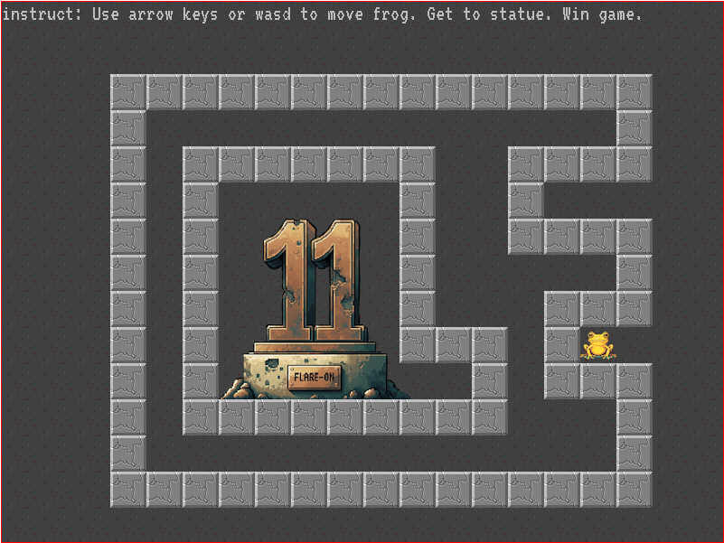

## Flare-On 2024 - #1 frog
___

### Description: 

*Welcome to Flare-On 11!*
*Download this 7zip package, unzip it with the password 'flare', and read the README.txt file for launching instructions.*
*It is written in PyGame so it may be runnable under many architectures, but also includes a pyinstaller created EXE file for easy execution on Windows.*

*Your mission is get the frog to the "11" statue, and the game will display the flag.*
*Enter the flag on this page to advance to the next stage.*
*All flags in this event are formatted as email addresses ending with the @flare-on.com domain.*

`7-zip password: flare`
___

### Solution:

As per instructions we have a simple game:



We cannot go to the statue as it is surrounded by blocks. We check how `frog.py` works and we focus
on the most important parts:
```python
victory_tile = pygame.Vector2(10, 10)

# .....

def GenerateFlagText(x, y):
    key = x + y*20
    encoded = "\xa5\xb7\xbe\xb1\xbd\xbf\xb7\x8d\xa6\xbd\x8d\xe3\xe3\x92\xb4\xbe\xb3\xa0\xb7\xff\xbd\xbc\xfc\xb1\xbd\xbf"
    return ''.join([chr(ord(c) ^ key) for c in encoded])

def main():
    # .....
        if not victory_mode:
            # are they on the victory tile? if so do victory
            if player.x == victory_tile.x and player.y == victory_tile.y:
                victory_mode = True
                flag_text = GenerateFlagText(player.x, player.y)
                flag_text_surface = flagfont.render(flag_text, False, pygame.Color('black'))
                print("%s" % flag_text)
    # .....
```

So, all we have to do is to call `GenerateFlagText` with `x = 10` and `y = 10`


```python
In [1]: def GenerateFlagText(x, y):
   ...:     key = x + y*20
   ...:     encoded = "\xa5\xb7\xbe\xb1\xbd\xbf\xb7\x8d\xa6\xbd\x8d\xe3\xe3\x92\xb4\xbe\xb3\xa0\xb7\xff\xbd\xbc\xfc\xb1\xbd\xbf"
   ...:     return ''.join([chr(ord(c) ^ key) for c in encoded])
   ...: 

In [2]: print(GenerateFlagText(10, 10))
welcome_to_11@flare-on.com
```

Another way to get flag is to remove a few blocks so the frog can reach the statue:
```python
def BuildBlocks():
    blockset = [
        Block(3, 2, False),
        Block(4, 2, False),
        Block(5, 2, False),
        Block(6, 2, False),
        Block(7, 2, False),
        Block(8, 2, False),
        Block(9, 2, False),
        #Block(10, 2, False),
        Block(11, 2, False),
        Block(12, 2, False),
        Block(13, 2, False),
        Block(14, 2, False),
        Block(15, 2, False),
        Block(16, 2, False),
        Block(17, 2, False),
        Block(3, 3, False),
        Block(17, 3, False),
        Block(3, 4, False),
        Block(5, 4, False),
        Block(6, 4, False),
        Block(7, 4, False),
        Block(8, 4, False),
        Block(9, 4, False),
        #Block(10, 4, False),
        Block(11, 4, False),
        Block(14, 4, False),
        Block(15, 4, True),
        Block(16, 4, False),
```


So the flag is: `welcome_to_11@flare-on.com`
___
