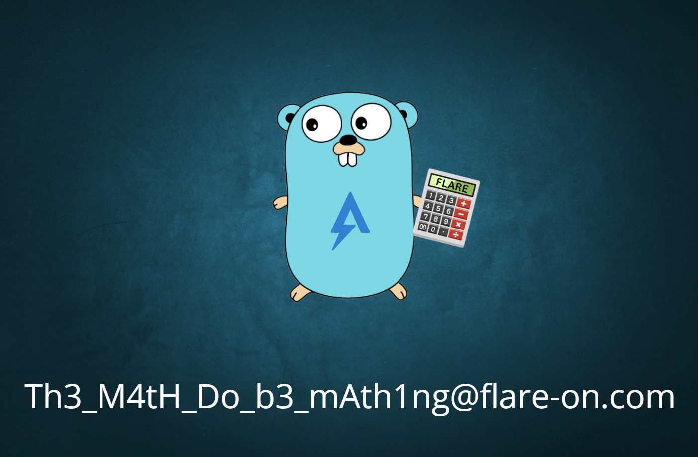

## Flare-On 2024 - #2 checksum
___

### Description: 

*We recently came across a silly executable that appears benign. It just asks us to do some math...*
*From the strings found in the sample, we suspect there are more to the sample than what we are seeing.*
*Please investigate and let us know what you find!*

`7-zip password: flare`
___

### Solution:

For the second challenge we are given a golang binary which is not stripped. Let's start from `main`
and focus on the most important parts:
```c
// main.main
// local variable allocation has failed, the output may be wrong!
void __fastcall main_main() {
  /* ... */
  rand_sums = math_rand_v2__ptr_Rand_uint64n(math_rand_v2_globalRand, 5);
  exp_sum = runtime_newobject(&RTYPE_int);
  for ( i = 0LL; ; i = i_ + 1 ) {
    v5 = rand_sums + 3;
    if ( i >= rand_sums + 3 )
      break;
    i_ = i;
    num_a = math_rand_v2__ptr_Rand_uint64n(math_rand_v2_globalRand, 10000);
    num_b = math_rand_v2__ptr_Rand_uint64n(math_rand_v2_globalRand, 10000);
    /* ... */
    v137 = num_a + num_b;
    fmt_Fprintf(&go_itab__os_File_io_Writer, os_Stdout, "Check sum: %d + %d = ", 21, v153, 2, 2);
    *v152 = &RTYPE__ptr_int;
    *&v152[2] = exp_sum;
    v17 = *&os_Stdin;
    fmt_Fscanf(
      &go_itab__os_File_io_Reader,
      os_Stdin,
      "%d\n",
      3,
      v152,
      1,
      1,
      v18,
      v19);
    v0 = 21;
    v25 = u_fatal(v17, v20, "Not a valid answer...", 21, v152, v21, v22, v23, v24);
    if ( *exp_sum != num_a + num_b ){
      runtime_printlock(v25);
      v27 = runtime_printstring(
              "Try again! ;)\n",
              14,
              v26,
              21,
              v152);
      runtime_printunlock(v27);
      return;
    }
    runtime_printlock(v25);
    v4 = runtime_printstring("Good math!!!\n------------------------------\n", 44, v3, 21, v152);
    runtime_printunlock(v4);
  }

  /* ... */
  fmt_Fscanf(
    &go_itab__os_File_io_Reader,
    os_Stdin,
    "%s\n",
    3,
    checksum,
    1,
    1);
  u_fatal(v32, v35, "Fail to read checksum input...", 30, checksum, v36, v37, v38, v39);
  ptr = p_string->ptr;
  chksum_str = runtime_stringtoslicebyte( v128, p_string->ptr, p_string->len, 30, checksum);
  v130 = v45;
  chksum_hex_dec = encoding_hex_Decode(chksum_str, ptr, v45, chksum_str, ptr);
  if ( chksum_hex_dec > v130 )
    runtime_panicSliceAcap(chksum_hex_dec, ptr, chksum_hex_dec);
  hex_dec = chksum_hex_dec;
  u_fatal(ptr, v50, "Not a valid checksum...", 23, ptr, v51, v52, v53, v54);
  v59 = runtime_makeslice(&RTYPE_uint8, 24, 24, 23, ptr, v55, v56, v57, v58);
  hex_dec_ = hex_dec;
  v65 = chksum_str;
  for ( j = 0LL; hex_dec_ > j; ++j ) {
    v60 = v65->key[j];
    if ( j == 24 )                              // use 24 bytes from checksum
      break;
    if ( j >= 0x18 )
      runtime_panicIndex(j, 24LL, 24LL, 23LL);
    *(v59 + j) = v60;
  }
  v146.cap = v59;
  if ( hex_dec_ == 0x20 ) {
    p_chacha20poly1305_xchacha20poly1305 = runtime_newobject(&RTYPE_chacha20poly1305_xchacha20poly1305);
    if ( p_chacha20poly1305_xchacha20poly1305 != chksum_str ) {
      v144 = p_chacha20poly1305_xchacha20poly1305;
      runtime_memmove(p_chacha20poly1305_xchacha20poly1305, chksum_str, 32LL, 23LL, v65);
      p_chacha20poly1305_xchacha20poly1305 = v144;
    }
    v67 = go_itab__golang_org_x_crypto_chacha20poly1305_xchacha20poly1305_crypto_cipher_AEAD;
    v68 = 0LL;
    v69 = p_chacha20poly1305_xchacha20poly1305;
    LODWORD(v70) = 0;
  } else {
    v149[1] = 32LL;
    v149[0] = "chacha20poly1305: bad key length";
    v67 = 0LL;
    v68 = go_itab__errors_errorString_error;
    v69 = 0LL;
    v70 = v149;
  }
  /* ... */
  u_fatal(0LL, cap, "Maybe it's time to analyze the binary! ;)", 41, cap, v74, v75, v76, v77);
  *v141.h = v1;
  (loc_463086)(&rand_sums);
  crypto_sha256__ptr_digest_Reset(&v141);
  v157.ptr = v146.ptr;
  v157.len = a4;
  v157.cap = a5;
  crypto_sha256__ptr_digest_Write(&v141, v157);
  v157.ptr = 0LL;
  v157.len = 0LL;
  v78 = 0LL;
  v157 = crypto_sha256__ptr_digest_Sum(&v141, *(&v78 - 2));
  v133 = v157.ptr;
  v145 = v79;
  v137 = 2 * v157.ptr;
  v84 = runtime_makeslice(&RTYPE_uint8, 2 * LODWORD(v157.ptr), 2 * LODWORD(v157.ptr), 0, cap, v80, v81, v82, v83);
  v88 = v133;
  v89 = v137;
  v90 = v145;
  v91 = 0LL;
  v92 = 0LL;
  while ( v88 > v91 ) {                         // convert hex to string (E3 B0 ~> "e3b0")
    v93 = *(v90 + v91);
    v86 = "0123456789abcdef";
    v94 = a0123456789abcd[v93 >> 4];
    if ( v92 >= v89 )
      runtime_panicIndex(v92, v92, v89, v94);
    *(v84 + v92) = v94;
    v78 = v92 + 1;
    v85 = a0123456789abcd[v93 & 0xF];
    if ( v89 <= v92 + 1 )
      runtime_panicIndex(v92 + 1, v92, v89, v78);
    *(v92 + v84 + 1) = v85;
    ++v91;
    v92 += 2LL;
  }
  len = v84;
  v96 = runtime_slicebytetostring(&v127, v84, v89, v78, v89, v90, v85, v86, v87, v121, v124, v126);
  if ( len == p_string->len ) {
    len = p_string->ptr;
    if ( runtime_memequal(v96, p_string->ptr) ) { // compare original input with sha256???
      len = p_string->len;
      result = main_a(p_string->ptr, len, p_string);
    } else {
      result = 0;
    }
  } else {
    result = 0;
  }

  if ( !result ) {
    *v148 = &RTYPE_string;
    *&v148[2] = &off_4EDAC0;
    len = *&os_Stdout;
    LODWORD(v78) = 1;
    LODWORD(v89) = 1;
    fmt_Fprintln(&go_itab__os_File_io_Writer, os_Stdout, v148, 1, 1);
  }

  v146.len = os_UserCacheDir();
  *v136 = len;
  u_fatal(v102, v78, "Fail to get path...", 19, v89, v103, v104, v105, v106);
  v107 = v146.len;
  v111 = runtime_concatstring2(0, v146.len, v136[0], "\\REAL_FLAREON_FLAG.JPG", 22, v108, v109, v110);
  v112 = a5;
  v113 = os_WriteFile(v111, v107, v146.ptr, a4, a5);
  u_fatal(v113, v107, "Fail to write file...", 21, v112, v114, v115, v116, v117);
  *v147 = &RTYPE_string;
  *&v147[2] = &off_4EDAD0;
  fmt_Fprintln(&go_itab__os_File_io_Writer, os_Stdout, v147, 1, 1);
}
```

The first part of the program is irrelevant to the flag; Program chooses a random number `n` between
**0** and **4** and generates `3 + n` "sums" `a + b` to calculate. If we give the correct answer to
all of them, program asks for a "checksum". This checksum must be a hex number. Program uses **24**
bytes of this checksum to derive a key for a **ChaCha20-Poly1305** encryption, since the following
symbol is not stripped:
```
go_itab__golang_org_x_crypto_chacha20poly1305_xchacha20poly1305_crypto_cipher_AEAD
```
To better understand how this encryption works we check the
[xchacha20poly1305.go](https://tip.golang.org/src/vendor/golang.org/x/crypto/chacha20poly1305/xchacha20poly1305.go)
and we look at the following articles:

* [Cipher Suites & AEAD - ChaCha20-Poly1305 Example](https://dev.to/jaypmedia/cipher-suites-aead-chacha20-poly1305-example-1i6)
* [File encryption using XChaha20-Poly1305 in Golang](https://www.rahulpandit.com/post/file-encryption-using-xchaha20-poly1305-in-golang/)

After the decryption, program calculates the **SHA256** checksum of the plaintext and compares it
with our "checksum" input. If they match program writes the (decrypted) plaintext to 
`%APPDATA%\\REAL_FLAREON_FLAG.JPG` and exits. That is, program asks for the **SHA256** checksum
of an image and if it is correct it decrypts that image.

There also is another function that is called if the **SHA256** checksums match:
```c
result = main_a(p_string->ptr, len, p_string);
```

Let's have a look at it:
```c
__int64 __golang main_a(_BYTE *a1, __int64 a2, __int64 a3) {
  /* ... */
  for ( i = 0LL; a2 > i; ++i ) {
    v3 = v4;
    v12 = v10;
    v13 = i - 11 * (((i * 0x5D1745D1745D1746LL) >> 64) >> 2);
    v14 = v10[i];                               // input[i]
    if ( v13 >= 0xB )
      runtime_panicIndex(v13, i, 11LL, v12);
    v5 = "FlareOn2024";
    v6 = aTrueeeppfilepi[v13 + 3060];
    *(v3 + i) = v6 ^ v14;                       // xor with "FlareOn2024"
    v4 = v3;
    v10 = v12;
  }
  v15 = v4;
  v16 = encoding_base64__ptr_Encoding_EncodeToString(runtime_bss, v4, a2, a2, v3, v5, v6, v7, v8, v18, v19, v20);
  if ( v15 == 88 )
    return runtime_memequal(
             v16,
             "cQoFRQErX1YAVw1zVQdFUSxfAQNRBXUNAxBSe15QCVRVJ1pQEwd/WFBUAlElCFBFUnlaB1ULByRdBEFdfVtWVA==");
  else
    return 0LL;
}
```

This function takes the "checksum" we give as input, encrypts it with the key `FlareOn2024` and
encodes the result with base64. If the result is
`cQoFRQErX1YAVw1zVQdFUSxfAQNRBXUNAxBSe15QCVRVJ1pQEwd/WFBUAlElCFBFUnlaB1ULByRdBEFdfVtWVA==` then
function returns **1** and propagates this result as the return value of the `main`.

Given that we can easily find the expected "checksum" input:
```python
import base64

a = 'cQoFRQErX1YAVw1zVQdFUSxfAQNRBXUNAxBSe15QCVRVJ1pQEwd/WFBUAlElCFBFUnlaB1ULByRdBEFdfVtWVA=='
b = base64.b64decode(a)
c = ''.join(chr(x ^ y) for x,y in zip(b, b'FlareOn2024'*16))
print(c)
```

We run the above commands and we get the correct checksum:
`7fd7dd1d0e959f74c133c13abb740b9faa61ab06bd0ecd177645e93b1e3825dd`. We try it out:


The flag is located under `C:\Users\ispo\AppData\Local\REAL_FLAREON_FLAG.JPG`:



So the flag is: `Th3_M4tH_Do_b3_mAth1ng@flare-on.com`
___
