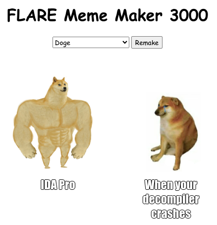
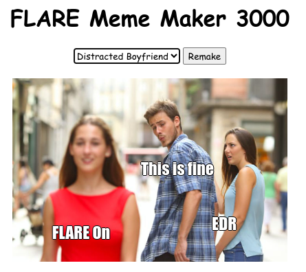
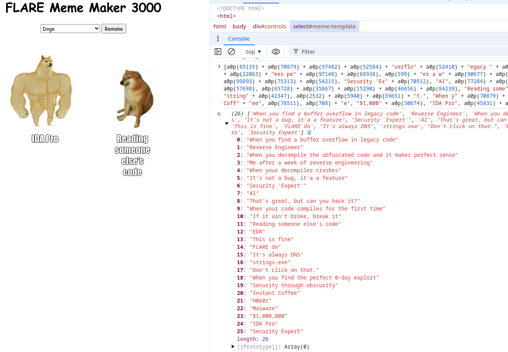
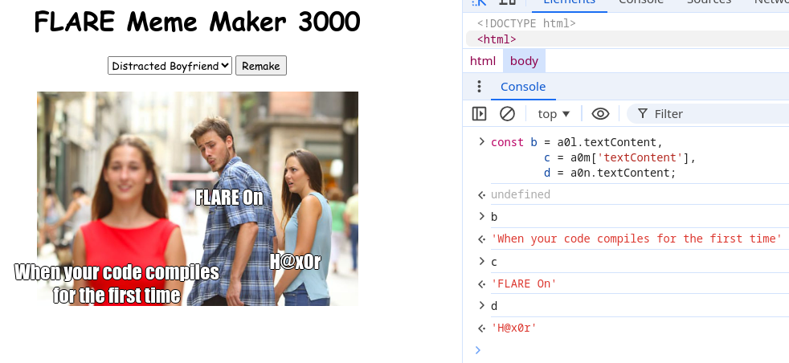
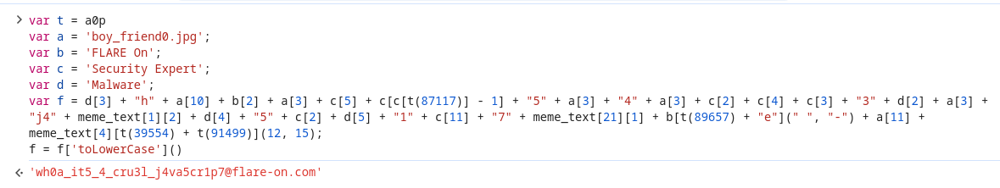

## Flare-On 2024 - #4 Meme Maker 3000
___

### Description: 

*You've made it very far, I'm proud of you even if noone else is.*
*You've earned yourself a break with some nice HTML and JavaScript before we get into challenges that may require you to be very good at computers.*

`7-zip password: flare`
___

### Solution:

The fourth challenge is a javascript program that generates memes:






We open `mememaker3000.html`:
```html
<!DOCTYPE html>
<html>
<head>
    <title>FLARE Meme Maker 3000</title>
    <style>
        h1 {
            font-family: cursive;
            text-align: center;
        }

        #controls {
            text-align: center;
        }

        #remake, #meme-template {
            font-family: cursive;
        }

        #meme-container {
            position: relative;
            width: 400px;
            margin: 20px auto;
        }

        #meme-image {
            width: 100%;
            display: block;
        }

        .caption {
            font-family: "Impact";
            color: white;
            text-shadow: -1px 0 black, 0 1px black, 1px 0 black, 0 -1px black;
            font-size: 24px;
            text-align: center;
            position: absolute;
            /* width: 80%; /* Adjust width as needed */
            padding: 10px;
            background-color: rgba(0, 0, 0, 0);
        }

        #caption1 { top: 10px; left: 50%; transform: translateX(-50%); }
        #caption2 { bottom: 10px; left: 50%; transform: translateX(-50%); }
        #caption2 { bottom: 10px; left: 50%; transform: translateX(-50%); }
    </style>
</head>
<body>
    <h1>FLARE Meme Maker 3000</h1>

    <div id="controls">
        <select id="meme-template">
            <option value="doge1.png">Doge</option>
            <option value="draw.jpg">Draw 25</option>
            <option value="drake.jpg">Drake</option>
            <option value="two_buttons.jpg">Two Buttons</option>
            <option value="boy_friend0.jpg">Distracted Boyfriend</option>
            <option value="success.jpg">Success</option>
            <option value="disaster.jpg">Disaster</option>
            <option value="aliens.jpg">Aliens</option>
        </select>
        <button id="remake">Remake</button>
    </div>

    <div id="meme-container">
        
        <div id="caption1" class="caption" contenteditable></div>
        <div id="caption2" class="caption" contenteditable></div>
        <div id="caption3" class="caption" contenteditable></div>
    </div>

    <script>
        const a0p=a0b;(function(a,b){const o=a0b,c=a();while(!![]){ 
        /* ....... [OBFUSCATED CODE] ....... */
        a0n[a0p(0xc784)+a0p(0x17372)+a0p(0x17e2f)](a0p(0xb6f5),()=>{a0k();});
    </script>
</body>
</html>
```

The javascript is (obviously) obfuscated so we use [deobfuscate.io](https://deobfuscate.io/) to
remove some layers of obfuscation (see [mememaker_deobf.js](./mememaker_deobf.js)). Then we continue
the deobfuscation. We start **evaluating** various expressions and **replacing** them with their
results. For example:




We continue this until we end up with [mememaker_clean.js](./mememaker_clean.js), which is easy to
understand. The most important function is `a0k`:
```js
function a0k() {
  const t = a0p, a = a0g['alt'].split("/")['pop']();
  // a = meme image e.g., 'disaster.jpg'
  if (a !== Object['keys'](a0e)[5]) // a must be `boy_friend0.jpg`
    return;

  // These are the 3 texts from the meme, e.g.,
  //    b = 'When your code compiles for the first time'
  //    c = 'FLARE On'
  //    d = 'H@x0r'
  const b = a0l.textContent,
        c = a0m['textContent'],
        d = a0n.textContent;
  
  // The texts must be:
  if (meme_text['indexOf'](b) == 14 &&                             // 'FLARE On'
      meme_text['indexOf'](c) == meme_text['length'] - 1 /*25*/ && // 'Security Expert'
      meme_text['indexOf'](d) == 22) {                             // 'Malware'
    
    // Wait for long enough ....
    var e = (new Date)['getTime']();  
    while ((new Date)['getTime']() < e + 3e3) {}
    // Just evaluate this and get the flag.
    var f = d[3] + "h" + a[10] + b[2] + a[3] + c[5] + c[c[t(87117)] - 1] + "5" + a[3] + "4" + a[3] + c[2] + c[4] + c[3] + "3" + d[2] + a[3] + "j4" + meme_text[1][2] + d[4] + "5" + c[2] + d[5] + "1" + c[11] + "7" + meme_text[21][1] + b[t(89657) + "e"](" ", "-") + a[11] + meme_text[4][t(39554) + t(91499)](12, 15);
    f = f['toLowerCase'](),
        // alert(atob('Q29uZ3JhdHVsYXRpb25zISBIZXJlIHlvdSBnbzog') + f);        
        alert('Congratulations! Here you go: ' + f);
    }
  }

```

The values of `b`, `c` and `d` contain the meme texts:




To get the flag (in `f`), we set the correct values to `a`, `b`, `c` and `d`:



So the flag is: `wh0a_it5_4_cru3l_j4va5cr1p7@flare-on.com`

> NOTE: There is an easter egg in `fish.jpg` image which is a binary (see [fish](./fish))
> and is intended to waste our time :)

___
