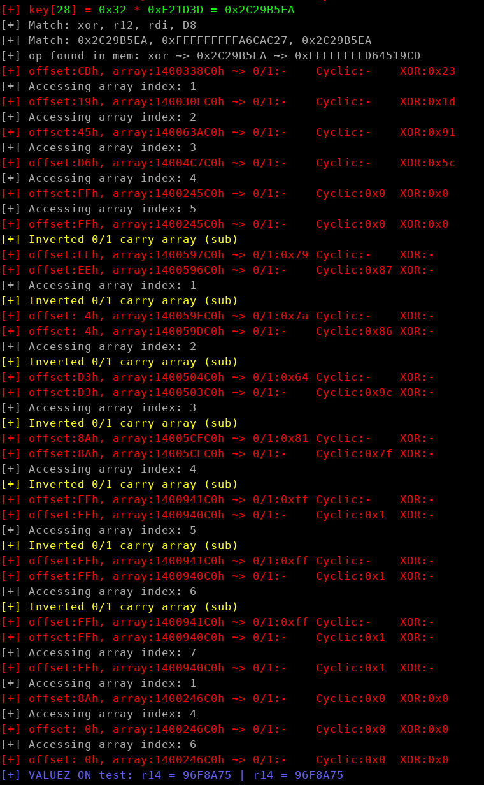
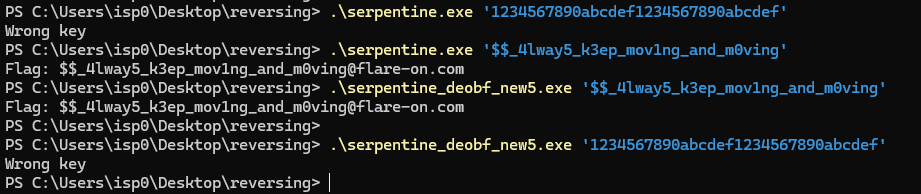

## Flare-On 2024 - #9 serpentine
___

### Description: 

*A good career for you would be a sort of cyber Indiana Jones.*
*Imagine a lone figure, a digital explorer, ventures into the depths of the bit forest, a sprawling, tangled expanse of code and data.*
*The air crackles with unseen energy, and the path ahead twists and turns like a serpent's coil.*
*At the heart of this forest lies the serpent's sanctum, a fortress of encrypted secrets.*
*Your mission is to infiltrate the sanctum, navigate its defenses, and retrieve the hidden flag.*
*Sounds way cooler than sitting at your desk typing things nobody cares about into a keyboard.*

`7zip archive password: flare`
___

### Solution:


This was the hardest challenge for this year. Let's start from `main():`
```c
int __fastcall main(int argc, const char **argv, const char **envp) {
  SetUnhandledExceptionFilter(TopLevelExceptionFilter);
  if ( argc == 2 ) {
    if ( strlen(argv[1]) == 32 ) {
      strcpy(Destination, argv[1]);
      (lpAddress)(Destination);
      return 0;
    } else {
      puts("Invalid key length.");
      return 1;
    }
  } else {
    printf("%s <key>\n", *argv);
    return 1;
  }
}
```

Program checks if the key is **32** bytes and calls the function pointer at `lpAddress`. 
`serpentine.exe` executes code from `TlsCallback` to initialize the shellcode:
```c
void __fastcall TlsCallback_0(__int64 a1, int a2) {
  if ( a2 == 1 ) {
    lpAddress = VirtualAlloc(0LL, 0x800000uLL, 0x3000u, 0x40u);
    if ( !lpAddress ) {
      puts("Unable to allocate memory.");
      exit(1);
    }
    memcpy(lpAddress, &glo_shellcode, 0x800000uLL);
  } else if ( !a2 && !VirtualFree(lpAddress, 0LL, 0x8000u) )
  {
    puts("Unable to free memory.");
    exit(1);
  }
}
```

However, the first intruction is a `hlt`:
```assembly
.data:0000000140097AF0 glo_shellcode:                          ; DATA XREF: TlsCallback_0+60↑o
.data:0000000140097AF0                 hlt
```

There are also some interesting functions without any XREFs:
```c
void __noreturn u_print_flag() {
  printf("Flag: %s@flare-on.com\n", Destination);
  exit(0);
}

void __noreturn u_wrong_key() {
  printf("Wrong key\n");
  exit(1);
}
```

Program invokes more initialization routines before even the Tls Callback. Let's see an interesting
one:
```c
__int64 sub_140001270() {
  /* ... */
  v2 = qword_1408A3310[1345];
  v4 = *(*(v2 + 60) + v2 + 136);
  for ( i = 0; i < *(v4 + v2 + 20); ++i )
  {
    v3 = (*(*(v4 + v2 + 32) + v2 + 4LL * i) + v2);
    if ( *v3 == 'R' && v3[3] == 'I' && v3[10] == 'F' && v3[18] == 'T' && v3[23] == 'C' )// RtlInstallFunctionTableCallback
    {
      glo_RtlInstallFunctionTableCallback_addr = *(*(v4 + v2 + 28) + v2 + 4LL * *(*(v4 + v2 + 36) + v2 + 2LL * i)) + v2;
      return 0LL;
    }
  }
  return 0LL;
}
```

This function searches for the function `RtlInstallFunctionTableCallback()` in `ntdll.dll`.
Then function at `0x140001430` calls it:
```c
__int64 u_call_RtlInstallFunctionTableCallback() {
  void (__fastcall *v1)(__int64, _QWORD, __int64, _QWORD, _QWORD, _QWORD); // [rsp+30h] [rbp-28h]

  v1 = *(&unk_14089B910 + 3901);
  if ( v1 )
    v1(*(&unk_140898970 + 1518) | 3LL, *(&unk_140898970 + 1518), 0x2E4D26LL, qword_140022000[1206], 0LL, 0LL);
  return 0LL;
}
```

We go to main, execute the shellcode and after the first `hlt` execution is transferred to the 
exception handler:
```c
// typedef PRUNTIME_FUNCTION (CALLBACK *PGET_RUNTIME_FUNCTION_CALLBACK)(ULONG_PTR ControlPc, PVOID Context);
// 
// typedef struct _IMAGE_RUNTIME_FUNCTION_ENTRY {
//   DWORD BeginAddress;
//   DWORD EndAddress;
//   union {
//     DWORD UnwindInfoAddress;
//     DWORD UnwindData;
//   } DUMMYUNIONNAME;
// } RUNTIME_FUNCTION, *PRUNTIME_FUNCTION, _IMAGE_RUNTIME_FUNCTION_ENTRY, *_PIMAGE_RUNTIME_FUNCTION_ENTRY;
RUNTIME_FUNCTION *__fastcall u_handler_IMPORTANT(ULONG_PTR ControlPc, PVOID Context)
{
  RUNTIME_FUNCTION *buf; // [rsp+28h] [rbp-20h]

  buf = operator new(0xCuLL);
  buf->FunctionStart = (ControlPc - *(&unk_140898970 + 0x5EE));// ControlPc - lpAddress
  buf->FunctionEnd = buf->FunctionStart + 1;
  buf->UnwindInfo = buf->FunctionEnd + *(ControlPc + 1) + 1;
  buf->UnwindInfo = (buf->UnwindInfo + ((buf->UnwindInfo & 1) != 0));
  return buf;
}
```

Okay we have some weird form of exception handling obfuscation. Let's read some very useful
resources:
* [Structured Exception Handling Functions](https://github.com/MicrosoftDocs/win32/blob/docs/desktop-src/Debug/structured-exception-handling-functions.md)
* [Windows Data Structures and Callbacks, Part 1](https://modexp.wordpress.com/2020/08/06/windows-data-structures-and-callbacks-part-1/)
* [x64 exception handling](https://learn.microsoft.com/en-us/cpp/build/exception-handling-x64)
* [x64 Deep Dive](https://codemachine.com/articles/x64_deep_dive.html)
* [RtlInstallFunctionTableCallback](https://learn.microsoft.com/en-us/windows/win32/api/winnt/nf-winnt-rtlinstallfunctiontablecallback)


After we read these we can go back to our shellcode and restructure it:
```assembly
Stack[00000588]:06630000              hlt
Stack[00000588]:06630001              db  46h ; F                     ; offset of UnwindInfo
.....
Stack[00000588]:06630046              db  57h ; W
Stack[00000588]:06630047              db 0EEh
Stack[00000588]:06630048 UnwindInfo_0 db 9                            ; Version
Stack[00000588]:06630049              db 0                            ; SizeOfProlog
Stack[00000588]:0663004A              db 0                            ; CountOfCodes
Stack[00000588]:0663004B              db 0                            ; FrameRegister
Stack[00000588]:0663004C              dd 98h                          ; FunctionStartAddress
.....
Stack[00000588]:06630098              call    near ptr unk_6914D27
Stack[00000588]:0663009D              jg      short loc_663006E
Stack[00000588]:0663009F              and     eax, 5341ABC6h
Stack[00000588]:066300A4              push    73775436h
Stack[00000588]:066300A9              push    68A04C43h
Stack[00000588]:066300AE              push    12917FF9h
Stack[00000588]:066300B3              call    near ptr unk_6914D96
Stack[00000588]:066300B8              mov     ebp, 0E81D7427h
Stack[00000588]:066300BD              db      3Eh, 2Eh
Stack[00000588]:066300BD              add     [rdi+3EB80D02h], dl
Stack[00000588]:066300C6              retnq   4932h
```

Shellcode start with a `hlt`, then there is an offset that tells us where is the `UnwindInfo`
object and after that we have a special handler. When we reach the handler we have a call to
`unk_6914D27` and then some obfuscated code. Let's deobfuscate it:
```assembly
Stack[000007F0]:06690098 E8 8A 4C 2E 00        call    u_set_r11_to_10ADD7F49
Stack[000007F0]:06690098                   ; ---------------------------------------------------------------------------
Stack[000007F0]:0669009D 7F CF 25 C6 AB        db 7Fh, 0CFh, 25h, 0C6h, 0ABh
Stack[000007F0]:066900A2                   ; ---------------------------------------------------------------------------
Stack[000007F0]:066900A2 41 53                 push    r11
Stack[000007F0]:066900A4 68 36 54 77 73        push    73775436h
Stack[000007F0]:066900A9 68 43 4C A0 68        push    68A04C43h
Stack[000007F0]:066900AE 68 F9 7F 91 12        push    12917FF9h
Stack[000007F0]:066900B3 E8 DE 4C 2E 00        call    u_add_35AC399F_to_rsp_18
Stack[000007F0]:066900B3                   ; ---------------------------------------------------------------------------
Stack[000007F0]:066900B8 BD 27 74 1D           db 0BDh, 27h, 74h, 1Dh
Stack[000007F0]:066900BC                   ; ---------------------------------------------------------------------------
Stack[000007F0]:066900BC E8 3E 4D 2E 00        call    jmp_to_nxt_hlt
```

Let's check what `u_set_r11_to_10ADD7F49` does:
```assembly
Stack[000007F0]:06974D26 4B                byte_6974D26 db 4Bh                     ; DATA XREF: Stack[000007F0]:06974D35↓r
Stack[000007F0]:06974D27                   u_set_r11_to_10ADD7F49:                 ; CODE XREF: Stack[000007F0]:06690098↑p
Stack[000007F0]:06974D27 8F 05 33 00 00 00     pop     qword ptr cs:loc_6974D5E+2  ; patched insn filled with ret addr
Stack[000007F0]:06974D2D 50                    push    rax                         ; backup rax
Stack[000007F0]:06974D2E 48 C7 C0 00 00 00 00  mov     rax, 0
Stack[000007F0]:06974D35 8A 25 EB FF FF FF     mov     ah, cs:byte_6974D26
Stack[000007F0]:06974D3B 67 8D 80 49 70 49 7F  lea     eax, [eax+7F497049h]
Stack[000007F0]:06974D42 89 05 01 00 00 00     mov     dword ptr cs:loc_6974D49, eax ; decrypt single insn
Stack[000007F0]:06974D48 58                    pop     rax                         ; restore rax
Stack[000007F0]:06974D49
Stack[000007F0]:06974D49                   loc_6974D49:                            ; DATA XREF: Stack[000007F0]:06974D42↑w
Stack[000007F0]:06974D49                                                           ; Stack[000007F0]:06974D53↓w
Stack[000007F0]:06974D49 49 BB 49 7F DD 0A     mov     r11, 10ADD7F49h             ; real insn
Stack[000007F0]:06974D49 01 00 00 00
Stack[000007F0]:06974D53 C7 05 EC FF FF FF     mov     dword ptr cs:loc_6974D49, 676742DDh ; re-encrypt insn
Stack[000007F0]:06974D53 DD 42 67 67
Stack[000007F0]:06974D5D 50                    push    rax                         ; backup rax again
Stack[000007F0]:06974D5E
Stack[000007F0]:06974D5E                   loc_6974D5E:                            ; DATA XREF: Stack[000007F0]:u_set_r11↑w
Stack[000007F0]:06974D5E 48 B8 9D 00 69 06     mov     rax, 669009Dh               ; patched insn filled with ret addr
Stack[000007F0]:06974D5E 00 00 00 00
Stack[000007F0]:06974D68 48 8D 40 05           lea     rax, [rax+5]                ; skip 5 bytes after ret addr
Stack[000007F0]:06974D6C 48 87 04 24           xchg    rax, [rsp]                  ; restore rax and put ret addr on stack
Stack[000007F0]:06974D70 C3                    retn                                ; jump there
```

Interesting... Function decrypts a single instruction, executes it and immediately reencrypts it.
Let's check the other functions:
```assembly
Stack[000007F0]:06974D96
Stack[000007F0]:06974D96                   u_add_35AC399F_to_rsp_18:               ; CODE XREF: Stack[000007F0]:066900B3↑p
Stack[000007F0]:06974D96 8F 05 32 00 00 00     pop     qword ptr cs:loc_6974DCC+2  ; patch
Stack[000007F0]:06974D9C 50                    push    rax
Stack[000007F0]:06974D9D 48 C7 C0 00 00 00     mov     rax, 0
Stack[000007F0]:06974D9D 00
Stack[000007F0]:06974DA4 8A 25 B6 FF FF FF     mov     ah, byte ptr cs:loc_6974D5E+2 ; use 0x9D patched previously (which is relative offset)
Stack[000007F0]:06974DAA 67 8D 80 48 E4 43     lea     eax, [eax+2443E448h]
Stack[000007F0]:06974DAA 24
Stack[000007F0]:06974DB1 89 05 01 00 00 00     mov     dword ptr cs:loc_6974DB8, eax ; real insn
Stack[000007F0]:06974DB7 58                    pop     rax
Stack[000007F0]:06974DB8
Stack[000007F0]:06974DB8                   loc_6974DB8:                            ; DATA XREF: Stack[000007F0]:06974DB1↑w
Stack[000007F0]:06974DB8                                                           ; Stack[000007F0]:06974DC1↓w
Stack[000007F0]:06974DB8 48 81 44 24 18 9F     add     qword ptr [rsp+18h], 35AC399Fh ; real insn
Stack[000007F0]:06974DB8 39 AC 35
Stack[000007F0]:06974DC1 C7 05 ED FF FF FF     mov     dword ptr cs:loc_6974DB8, 62CF7984h ; real insn
Stack[000007F0]:06974DC1 84 79 CF 62
Stack[000007F0]:06974DCB 50                    push    rax
Stack[000007F0]:06974DCC
Stack[000007F0]:06974DCC                   loc_6974DCC:                            ; DATA XREF: Stack[000007F0]:u_add_to_rsp_18↑w
Stack[000007F0]:06974DCC 48 B8 B8 00 69 06     mov     rax, 66900B8h               ; patch
Stack[000007F0]:06974DCC 00 00 00 00
Stack[000007F0]:06974DD6 48 8D 40 04           lea     rax, [rax+4]
Stack[000007F0]:06974DDA 48 87 04 24           xchg    rax, [rsp]
Stack[000007F0]:06974DDE C3                    retn
```

```assembly
Stack[000007F0]:06974DFF
Stack[000007F0]:06974DFF                   jmp_to_nxt_hlt:                         ; CODE XREF: Stack[000007F0]:066900BC↑p
Stack[000007F0]:06974DFF 8F 05 2E 00 00 00     pop     qword ptr cs:loc_6974E31+2
Stack[000007F0]:06974E05 50                    push    rax
Stack[000007F0]:06974E06 48 C7 C0 00 00 00     mov     rax, 0
Stack[000007F0]:06974E06 00
Stack[000007F0]:06974E0D 8A 25 BB FF FF FF     mov     ah, byte ptr cs:loc_6974DCC+2 ; patch
Stack[000007F0]:06974E13 67 8D 80 E9 29 B2     lea     eax, [eax-2E4DD617h]
Stack[000007F0]:06974E13 D1
Stack[000007F0]:06974E1A 89 05 01 00 00 00     mov     dword ptr cs:loc_6974E21, eax
Stack[000007F0]:06974E20 58                    pop     rax
Stack[000007F0]:06974E21
Stack[000007F0]:06974E21                   loc_6974E21:                            ; DATA XREF: Stack[000007F0]:06974E1A↑w
Stack[000007F0]:06974E21 E9 E1 B2 D1 FF        jmp     next_hlt
Stack[000007F0]:06974E26 C7 05 F1 FF FF FF…    db 0C7h, 5, 0F1h, 0FFh, 0FFh, 0FFh, 0B2h, 3Fh, 0FCh, 0Bh, 50h
Stack[000007F0]:06974E31
Stack[000007F0]:06974E31                   loc_6974E31:                            ; DATA XREF: Stack[000007F0]:jmp_to_nxt_hlt↑w
Stack[000007F0]:06974E31 48 B8 C1 00 69 06     mov     rax, 66900C1h
Stack[000007F0]:06974E31 00 00 00 00
Stack[000007F0]:06974E3B 48 8D 40 00           lea     rax, [rax+0]
Stack[000007F0]:06974E3F 48 87 04 24           xchg    rax, [rsp]
Stack[000007F0]:06974E43 C3                    retn
```

The value `0x10ADD7F49 + 0x35AC399F = 0x14089B8E8` is the `Destination`, which is where the key
is stored. Let's keep that in mind.

The last function takes a jump to another `hlt` instruction. And then we have the same story:
```assembly
Stack[00000588]:06630107                 hlt
Stack[00000588]:06630108                 db  3Dh ; offset of UnwindInfo
.....
Stack[00000588]:06630146 UnwindInfo_1    db 9                    ; Version
Stack[00000588]:06630147                 db 0                    ; SizeOfProlog
Stack[00000588]:06630148                 db 5                    ; CountOfCodes
Stack[00000588]:06630149                 db 0                    ; FrameRegister
Stack[00000588]:0663014A                 dw 0A00h                ; UnwindCodesArray[0]
Stack[00000588]:0663014C                 dw 1100h                ; UnwindCodesArray[1]
Stack[00000588]:0663014E                 dw 4                    ; UnwindCodesArray[2]
Stack[00000588]:06630150                 dw 0                    ; UnwindCodesArray[3]
Stack[00000588]:06630152                 dw 0D000h               ; UnwindCodesArray[4]
Stack[00000588]:06630154                 dw 0DD9Ch               ; Padding b/c len is odd
Stack[00000588]:06630156                 dd 1A7h                 ; FunctionStartAddress
.....
Stack[00000588]:066301A7                 mov     rbp, [r9+28h]   ; rbp = CONTEXT
Stack[00000588]:066301AB                 call    near ptr unk_6914E6A
Stack[00000588]:066301B0                 mov     r14b, 48h ; 'H'
Stack[00000588]:066301B3                 movzx   edi, bh
Stack[00000588]:066301B6                 call    near ptr unk_6914ED0
Stack[00000588]:066301BB                 and     al, [rcx-2Eh]
Stack[00000588]:066301BE                 xchg    ah, [rdx+439F0C57h]
Stack[00000588]:066301C4                 out     dx, al
```

Let's deobfuscate this code again:
```assembly
Stack[000007F0]:066901A7 49 8B 69 28           mov     rbp, [r9+28h]         ; get CONTEXT
Stack[000007F0]:066901AB E8 BA 4C 2E 00        call    load_rbp_0E_to_rdi
Stack[000007F0]:066901AB                   ; ---------------------------------------------------------------------------
Stack[000007F0]:066901B0 4F B6                 db 4Fh, 0B6h
Stack[000007F0]:066901B2                   ; ---------------------------------------------------------------------------
Stack[000007F0]:066901B2 48 0F B6 FF           movzx   rdi, dil
Stack[000007F0]:066901B6 E8 15 4D 2E 00        call    next_hlt_2
```

We continue to the third `hlt`:
```assembly
Stack[000007F0]:06974E6A                   load_rbp_0E_to_rdi:                  ; CODE XREF: Stack[000007F0]:066901AB↑p
Stack[000007F0]:06974E6A 8F 05 30 00 00 00     pop     qword ptr cs:loc_6974E9E+2
Stack[000007F0]:06974E70 50                    push    rax
Stack[000007F0]:06974E71 48 C7 C0 00 00 00     mov     rax, 0
Stack[000007F0]:06974E71 00
Stack[000007F0]:06974E78 8A 25 B5 FF FF FF     mov     ah, byte ptr cs:loc_6974E31+2 ; use previous offset
Stack[000007F0]:06974E7E 67 8D 80 48 CA BC     lea     eax, [eax-1F4335B8h]
Stack[000007F0]:06974E7E E0
Stack[000007F0]:06974E85 89 05 01 00 00 00     mov     dword ptr cs:loc_6974E8C, eax
Stack[000007F0]:06974E8B 58                    pop     rax
Stack[000007F0]:06974E8C
Stack[000007F0]:06974E8C                   loc_6974E8C:                            ; DATA XREF: Stack[000007F0]:06974E85↑w
Stack[000007F0]:06974E8C                                                           ; Stack[000007F0]:06974E93↓w
Stack[000007F0]:06974E8C 48 8B BD E0 00 00     mov     rdi, [rbp+0E0h]             ; real insn (rdi = r14 from CONTEXT)
Stack[000007F0]:06974E8C 00
Stack[000007F0]:06974E93 C7 05 EF FF FF FF     mov     dword ptr cs:loc_6974E8C, 0D6279BCEh
Stack[000007F0]:06974E93 CE 9B 27 D6
Stack[000007F0]:06974E9D 50                    push    rax
Stack[000007F0]:06974E9E
Stack[000007F0]:06974E9E                   loc_6974E9E:                            ; DATA XREF: Stack[000007F0]:loc_6974E6A↑w
Stack[000007F0]:06974E9E                                                           ; Stack[000007F0]:06974EDE↓r
Stack[000007F0]:06974E9E 48 B8 B0 01 69 06     mov     rax, 66901B0h
Stack[000007F0]:06974E9E 00 00 00 00
Stack[000007F0]:06974EA8 48 8D 40 02           lea     rax, [rax+2]
Stack[000007F0]:06974EAC 48 87 04 24           xchg    rax, [rsp]
Stack[000007F0]:06974EB0 C3                    retn
```

The interesting part here is the instruction `mov rdi, [rbp+0E0h]`, which accesses `r14` from
the `CONTEXT` object (when an exception is thrown, all registers are stored in a `CONTEXT` object).

```assembly
Stack[000007F0]:06974ED0                   next_hlt_2:                            ; CODE XREF: Stack[000007F0]:066901B6↑p
Stack[000007F0]:06974ED0 8F 05 2E 00 00 00     pop     cs:qword_6974F04
Stack[000007F0]:06974ED6 50                    push    rax
Stack[000007F0]:06974ED7 48 C7 C0 00 00 00     mov     rax, 0
Stack[000007F0]:06974ED7 00
Stack[000007F0]:06974EDE 8A 25 BC FF FF FF     mov     ah, byte ptr cs:loc_6974E9E+2
Stack[000007F0]:06974EE4 67 8D 80 E9 63 B2     lea     eax, [eax-2E4D9C17h]
Stack[000007F0]:06974EE4 D1
Stack[000007F0]:06974EEB 89 05 01 00 00 00     mov     dword ptr cs:loc_6974EF2, eax
Stack[000007F0]:06974EF1 58                    pop     rax
Stack[000007F0]:06974EF2
Stack[000007F0]:06974EF2                   loc_6974EF2:                            ; DATA XREF: Stack[000007F0]:06974EEB↑w
Stack[000007F0]:06974EF2 E9 13 B3 D1 FF        jmp     u_next_hlt_2
```

At this point, `rdi` contains `key[4:12]`!!! There is something more that is going on here.
Let's set a hardware breakpoint at `key[4]` to see where it's being read:
```assembly
ntdll.dll:00007FF8560F1520     mov     rcx, [r9]
ntdll.dll:00007FF8560F1523     mov     rax, [rsp+0B8h+var_70]
```

At this point `r8 = &UnwindInfo`, `r9 = CountOfCodes + 1`. We endup inside `ntdll.dll` in a special
function called `RtlpUnwindPrologue()`. This function is also open sourced:
[RtlpUnwindPrologue](https://github.com/wisny101/Windows-Server-2003-Source/blob/master/base/ntos/rtl/amd64/exdsptch.c#L868).

**And yes,there is a mini VM! These `UnwindCodesArray` elements are actually our VM opcodes...***

The VM opcodes can be found
[here](https://github.com/wisny101/Windows-Server-2003-Source/blob/master/base/published/ntamd64.w#L833):
```c
//
// Define AMD64 exception handling structures and function prototypes.
//
// Define unwind operation codes.
//
typedef enum _UNWIND_OP_CODES {
    UWOP_PUSH_NONVOL = 0,
    UWOP_ALLOC_LARGE, 		// 1
    UWOP_ALLOC_SMALL, 		// 2
    UWOP_SET_FPREG, 		// 3
    UWOP_SAVE_NONVOL, 		// 4
    UWOP_SAVE_NONVOL_FAR, 	// 5
    UWOP_SAVE_XMM, 			// 6
    UWOP_SAVE_XMM_FAR,		// 7
    UWOP_SAVE_XMM128, 		// 8
    UWOP_SAVE_XMM128_FAR, 	// 9
    UWOP_PUSH_MACHFRAME		// 10
} UNWIND_OP_CODES, *PUNWIND_OP_CODES;

//
// Define unwind code structure.
//
typedef union _UNWIND_CODE {
    struct {
        UCHAR CodeOffset;
        UCHAR UnwindOp : 4;
        UCHAR OpInfo : 4;
    };

    USHORT FrameOffset;
} UNWIND_CODE, *PUNWIND_CODE;
```

And the prototype of `RtlpUnwindPrologue`:
```c
PRUNTIME_FUNCTION
RtlpUnwindPrologue (
    ULONG64 ImageBase,
    ULONG64 ControlPc,
    ULONG64 FrameBase,
    PRUNTIME_FUNCTION FunctionEntry,
    PCONTEXT ContextRecord,
    PKNONVOLATILE_CONTEXT_POINTERS ContextPointers OPTIONAL
)

PRUNTIME_FUNCTION __fastcall RtlpUnwindPrologue(
	ULONG64 ImageBase, ULONG64 ControlPc, ULONG64 FrameBase, 
	_DWORD *FunctionEntry, CONTEXT* ContextRecord, KNONVOLATILE_CONTEXT_POINTERS* ContextPointers)
```

The VM is simple and we can easily emulate it.

It is also very important to write down the register offsets in the `CONTEXT` so we know which
register is being accessed:
```
; Basic CONTEXT offsets:
00000078 Rax dq ?
00000080 Rcx dq ? 
00000088 Rdx dq ?
00000090 Rbx dq ?
00000098 Rsp dq ? 
000000A0 Rbp dq ?
000000A8 Rsi dq ?
000000B0 Rdi dq ?
000000B8 R8  dq ?
000000C0 R9  dq ?
000000C8 R10 dq ?
000000D0 R11 dq ?
000000D8 R12 dq ?
000000E0 R13 dq ?
000000E8 R14 dq ?
000000F0 R15 dq ?
000000F8 Rip dq ? 
```

___

### Deobfuscating the Code

Clearly, it is very hard to analyze this code as it is, as there instructions that are decrypted at
runtime, VM code which is executed inside `RtlpUnwindPrologue`, code inside the exception handlers
and plenty of `hlt` instructions that cause more exceptions.

We need to write a script that executes (or emulates) the code and **extracts the "useful"
instructions** as execution goes. We choose **IDAPython** to debug the binary (*although I
doubt if this was the best approach*). We set **2** breakpoints:

1. At 0x1400010B0 (`u_handler_IMPORTANT`)
2. Inside `ntdll_RtlFindCharInUnicodeString` just before the exception handler is executed
   (address varies each time):

```assembly        
ntdll.dll:00007FFD66FD5170 sub_7FFD66FD5170 proc near:
ntdll.dll:00007FFD66FD5170        sub     rsp, 28h
ntdll.dll:00007FFD66FD5174        mov     [rsp+20h], r9 ; r9 = _DISPATCHER_CONTEXT
ntdll.dll:00007FFD66FD5179        mov     rax, [r9+30h]
ntdll.dll:00007FFD66FD517D        call    rax           ; BREAKPOINT HERE
ntdll.dll:00007FFD66FD517F        nop
ntdll.dll:00007FFD66FD5180        add     rsp, 28h
ntdll.dll:00007FFD66FD5184        retn
```

Then we run the script, which does the following:
* Extracts the encrypted instructions.
* Simulates the context switching just as the exception handling process does it.
* Emulates the `UNWIND_INFO` struct executed inside `RtlpUnwindPrologue` VM and generates
    assembly instructions for it.
* Extracts the "useful" instructions from the exception handlers (handlers have `call` instructions
    that decrypt an instruction and also return to a forward point in the handler (so we have
    garbage bytes in between) and have jumps to `hlt` instructions).

> NOTE: There were many little nuances that I had to care of in order to make this huge generated
> shellcode run properly.

After doing all these it generates a nice, deobfuscated (well it is still obfuscated) assembly
listing without any exceptions. The new assembly is patched into `serpentine_deobf.exe`.

Please refer to [serpentine_extract_code.py](./serpentine_extract_code.py) for more details.
Script takes about **~1:30** hours to run and generates the new binary `serpentine_deobf_new5.exe`
and the raw shellcode `sc5.bin`.
___


### Understanding the Deobfuscated Code


The deobfuscated code is about **~85000** lines of code and looks like this:
```assembly
.data:0000000140097AF0         jmp     short START             ; rax = lpAddress
.data:0000000140097AF2 ; ---------------------------------------------------------------------------
.data:0000000140097AF2
.data:0000000140097AF2 SAVE_CTX:
.data:0000000140097AF2         mov     r9, 14089B910h
.data:0000000140097AFC         mov     [r9], rax
.data:0000000140097AFF         mov     [r9+8], rcx
.data:0000000140097B03         mov     [r9+10h], rdx
.data:0000000140097B07         mov     [r9+18h], rbx
.data:0000000140097B0B         mov     [r9+20h], rsp
.data:0000000140097B0F         add     qword ptr [r9+20h], 8
.data:0000000140097B14         mov     [r9+28h], rbp
.data:0000000140097B18         mov     [r9+30h], rsi
.data:0000000140097B1C         mov     [r9+38h], rdi
.data:0000000140097B20         mov     [r9+40h], r8
.data:0000000140097B24         mov     [r9+50h], r10
.data:0000000140097B28         mov     [r9+58h], r11
.data:0000000140097B2C         mov     [r9+60h], r12
.data:0000000140097B30         mov     [r9+68h], r13
.data:0000000140097B34         mov     [r9+70h], r14
.data:0000000140097B38         mov     [r9+78h], r15
.data:0000000140097B3C         stmxcsr dword ptr [r9+80h]
.data:0000000140097B44         sub     r9, 78h ; 'x'
.data:0000000140097B48         retn
.data:0000000140097B49 ; ---------------------------------------------------------------------------
.data:0000000140097B49
.data:0000000140097B49 START:                                  ; CODE XREF: sub_140097AF0↑j
.data:0000000140097B49         mov     rax, 14089B8E0h         ; rax = lpAddress
.data:0000000140097B53         add     byte ptr [rax], 2       ; lpAddress points to `jmp`; make it point to save_ctx
.data:0000000140097B56         and     rsp, 0FFFFFFFFFFFFFFF0h ; adjust RSP to avoid crash in printf()
.data:0000000140097B5A         mov     rax, 14089B8E0h         ; rax = lpAddress = &save_ctx
.data:0000000140097B64         call    qword ptr [rax]         ; call save_ctx
.data:0000000140097B66         mov     r11, 10ADD7F49h
.data:0000000140097B70         push    r11
.data:0000000140097B72         push    73775436h
.data:0000000140097B77         push    68A04C43h
.data:0000000140097B7C         push    12917FF9h
.data:0000000140097B81         add     [rsp+20h+var_8], 35AC399Fh
.data:0000000140097B8A         mov     rax, 14089B8E0h
.data:0000000140097B94         call    qword ptr [rax]         ; call save_ctx
.data:0000000140097B96         mov     rax, [r9+98h]
.data:0000000140097B9D         add     rax, 18h
.data:0000000140097BA1         mov     rax, [rax]
.data:0000000140097BA4         mov     [r9+98h], rax
.data:0000000140097BAB         add     qword ptr [r9+98h], 4   ; r9 + 0x98 = rsp from context
.data:0000000140097BB3         mov     rax, [r9+98h]
.data:0000000140097BBA         mov     rax, [rax]
.data:0000000140097BBD         mov     [r9+0E0h], rax          ; r9 + 0xe0 = r13 from context
.data:0000000140097BC4         add     qword ptr [r9+98h], 8
.data:0000000140097BCC         mov     rbp, 14089B898h
.data:0000000140097BD6         mov     rdi, [rbp+0E0h]
.data:0000000140097BDD         movzx   rdi, dil
.data:0000000140097BE1         mov     rax, 14089B8E0h
.data:0000000140097BEB         call    qword ptr [rax]
.data:0000000140097BED         mov     r8, 14089B898h
.data:0000000140097BF7         mov     rax, [r8+0B0h]          ; r8 + 0xb0 = context.rdi
.data:0000000140097BFE         mov     r10, 0FFFFFFFFB93774A7h
.data:0000000140097C05         add     r10, 47B805E5h
.data:0000000140097C0C         push    r10
.data:0000000140097C0E         mul     [rsp+28h+var_28]
.data:0000000140097C12         mov     rbp, rax

[..... TRUNCATED FOR BREVITY .....]

.data:000000014009E6BA         movzx   r15, r13b
.data:000000014009E6BE         shl     r15, 30h
.data:000000014009E6C2         or      r12, r15
.data:000000014009E6C5         mov     rax, 14089B8E0h
.data:000000014009E6CF         call    qword ptr [rax]
.data:000000014009E6D1         mov     rbx, 14089B898h
.data:000000014009E6DB         mov     r14, [rbx+0D8h]
.data:000000014009E6E2         mov     r15, 10BF5D1A1h
.data:000000014009E6EC         add     r15, 340A404Fh          ; 0x10BF5D1A1 + 0x340A404F = 0x1400011f0 = u_wrong_key
.data:000000014009E6F3         test    r14, r14                ; r14 must be 0
.data:000000014009E6F6         lea     r12, NEXT_ITER
.data:000000014009E6FD         cmovnz  r12, r15                ; either go to badboy or to next iteration
.data:000000014009E701         jmp     r12

.data:000000014009E704 ; ---------------------------------------------------------------------------
.data:000000014009E704 NEXT_ITER:                              ; DATA XREF: sub_140097AF0+6C06↑o
.data:000000014009E704         nop
.data:000000014009E705         mov     rax, 14089B8E0h
.data:000000014009E70F         call    qword ptr [rax]
.data:000000014009E711         mov     r15, 1005A8F28h
.data:000000014009E71B         add     r15, 402F29C0h


[..... TRUNCATED FOR BREVITY .....]


.data:000000014016AF0E         call    qword ptr [rax]
.data:000000014016AF10         mov     rdi, 14089B898h
.data:000000014016AF1A         mov     rbx, [rdi+0D8h]         ; rdi + 0xD8 = context.r12
.data:000000014016AF21         mov     rbp, 10B42CB03h
.data:000000014016AF2B         add     rbp, 34BD46EDh          ; 0x10B42CB03 + 0x34BD46ED = 0x1400011f0 = u_wrong_key
.data:000000014016AF32         test    rbx, rbx
.data:000000014016AF35         lea     r13, GOODBOY
.data:000000014016AF3C         cmovnz  r13, rbp
.data:000000014016AF40         jmp     r13
.data:000000014016AF43 ; ---------------------------------------------------------------------------
.data:000000014016AF43 GOODBOY:                                ; DATA XREF: .data:000000014016AF35↑o
.data:000000014016AF43         nop
.data:000000014016AF44         mov     rax, 14089B8E0h
.data:000000014016AF4E         call    qword ptr [rax]
.data:000000014016AF50         mov     rbx, 11358E48Dh
.data:000000014016AF5A         add     rbx, 2CA72D23h          ; 0x11358E48D + 0x2CA72D23 = 0x1400011b0 = u_print_flag
.data:000000014016AF61         jmp     rbx
.data:000000014016AF63 ; ---------------------------------------------------------------------------
.data:000000014016AF63         nop

```

Instructions are keep repeating so we can assume we have an unrolled loop. To solve this, it is
very important to start finding the patterns.

Let's start with the `cmovnz`. We have **32** of them, so we can infer there is an unrolled loop
with **32** iterations. At the end of each iteration, the value of a register is checked if it is
zero (with `test`) and if not, program jumps to the badboy function at `0x1400011f0` which prints
the `Wrong key` message. Otherwise program advances to the next iteration. In the last iteration
(as you can see above), program jumps to the goodboy function `0x1400011b0` and prints the flag
(`Flag: %s@flare-on.com`).

Then let's try to understand what's going on in each iteration (my comments highlight the most
important parts):
```assembly
.data:0000000140097B49 START:                                            ; CODE XREF: .data:REAL_CODE↑j
.data:0000000140097B49         mov     rax, 14089B8E0h
.data:0000000140097B53         add     byte ptr [rax], 2                 ; make lpAddress point to +2 (save_ctx func)
.data:0000000140097B56         and     rsp, 0FFFFFFFFFFFFFFF0h           ; adjust RSP to avoid crash in printf()
.data:0000000140097B5A         mov     rax, 14089B8E0h
.data:0000000140097B64         call    qword ptr [rax]                   ; save_ctx
.data:0000000140097B66         mov     r11, 10ADD7F49h
.data:0000000140097B70         push    r11
.data:0000000140097B72         push    73775436h
.data:0000000140097B77         push    68A04C43h
.data:0000000140097B7C         push    12917FF9h
.data:0000000140097B81         add     qword ptr [rsp+18h], 35AC399Fh
.data:0000000140097B8A         mov     rax, 14089B8E0h
.data:0000000140097B94         call    qword ptr [rax]
.data:0000000140097B96         mov     rax, [r9+98h]
.data:0000000140097B9D         add     rax, 18h
.data:0000000140097BA1         mov     rax, [rax]                        ; rax = Destination = key
.data:0000000140097BA4         mov     [r9+98h], rax
.data:0000000140097BAB         add     qword ptr [r9+98h], 4
.data:0000000140097BB3         mov     rax, [r9+98h]                     ; rax = &Destination[4]
.data:0000000140097BBA         mov     rax, [rax]                        ; rax = key[4:12]
.data:0000000140097BBD         mov     [r9+0E0h], rax
.data:0000000140097BC4         add     qword ptr [r9+98h], 8
.data:0000000140097BCC         mov     rbp, 14089B898h
.data:0000000140097BD6         mov     rdi, [rbp+0E0h]
.data:0000000140097BDD         movzx   rdi, dil                          ; rdi = key[4]
.data:0000000140097BE1         mov     rax, 14089B8E0h
.data:0000000140097BEB         call    qword ptr [rax]
.data:0000000140097BED         mov     r8, 14089B898h
.data:0000000140097BF7         mov     rax, [r8+0B0h]
.data:0000000140097BFE         mov     r10, 0FFFFFFFFB93774A7h
.data:0000000140097C05         add     r10, 47B805E5h                    ; r10 = 0xEF7A8C
.data:0000000140097C0C         push    r10
.data:0000000140097C0E         mul     qword ptr [rsp]                   ; key[4] * 0xEF7A8C
.data:0000000140097C12         mov     rbp, rax                          ; rbp = key[4] * 0xEF7A8C = (0x47186190)
.data:0000000140097C15         mov     rax, 14089B8E0h
.data:0000000140097C1F         call    qword ptr [rax]
.data:0000000140097C21         mov     rdx, 14089B898h
.data:0000000140097C2B         mov     r15, [rdx+0A0h]
.data:0000000140097C32         push    r15
.data:0000000140097C34         mov     r12, rsp
.data:0000000140097C37         mov     rsi, [rdx+0A0h]
.data:0000000140097C3E         mov     rax, 14089B8E0h
.data:0000000140097C48         call    qword ptr [rax]
.data:0000000140097C4A         mov     r10, 14089B898h
.data:0000000140097C54         mov     r9, [r10+0D8h]
.data:0000000140097C5B         mov     rbp, [r10+0A8h]
.data:0000000140097C62         push    r9
.data:0000000140097C64         push    58AE3544h
.data:0000000140097C69         push    7EE52FE1h
.data:0000000140097C6E         push    649B0936h
.data:0000000140097C73         mov     rax, 14089B8E0h
.data:0000000140097C7D         call    qword ptr [rax]
.data:0000000140097C7F         mov     rax, [r9+98h]
.data:0000000140097C86         add     rax, 18h
.data:0000000140097C8A         mov     rax, [rax]
.data:0000000140097C8D         mov     [r9+98h], rax
.data:0000000140097C94         mov     rax, [r9+98h]
.data:0000000140097C9B         mov     rax, [rax]                        ; rax = key[4] * 0xEF7A8C = (0x47186190)
.data:0000000140097C9E         mov     [r9+78h], rax
.data:0000000140097CA2         add     qword ptr [r9+98h], 8
.data:0000000140097CAA         mov     rdi, 14089B898h
.data:0000000140097CB4         mov     rbx, [rdi+78h]
.data:0000000140097CB8         mov     r15, [rdi+0A0h]
.data:0000000140097CBF         movzx   rbx, bl                           ; rbx = (key[4] * 0xEF7A8C) & 0xFF = t0
.data:0000000140097CC3         mov     rax, 14089B8E0h
.data:0000000140097CCD         call    qword ptr [rax]
.data:0000000140097CCF         mov     r15, 14089B898h
.data:0000000140097CD9         ldmxcsr dword ptr [r15+90h]
.data:0000000140097CE1         mov     r14, 0D4431F4Bh
.data:0000000140097CEB         add     r14, 6BC64375h                    ; r14 = 0x1400962C0
.data:0000000140097CF2         mov     r14, [r14+468h]                   ; r14 = *(0x1400962C0 + 0x468) = 0x1400621C0
.data:0000000140097CF2                                                   ;     = array with 0x73 zeros and 0x8d ones
.data:0000000140097CF9         add     r14, [r15+90h]                    ; r14 = 0x1400621C0 + t0
.data:0000000140097D00         mov     sil, [r14]
.data:0000000140097D03         movzx   rsi, sil
.data:0000000140097D07         shl     rsi, 8                            ; rsi = 0x1400621C0[t0] << 8
.data:0000000140097D0B         add     [r15+0F0h], rsi
.data:0000000140097D12         mov     rax, 14089B898h
.data:0000000140097D1C         mov     r13, [rax+0F0h]                   ; r13 = key[4] * 0xEF7A8C + (0x1400621C0[t0] << 8) = 0x47186290
.data:0000000140097D23         mov     rbx, 133E82BE3h
.data:0000000140097D2D         add     rbx, 0C212EDDh                    ; rbx = 0x140095AC0
.data:0000000140097D34         mov     rax, 14089B8E0h
.data:0000000140097D3E         call    qword ptr [rax]
.data:0000000140097D40         mov     rax, [r9+90h]
.data:0000000140097D47         mov     [r9+98h], rax
.data:0000000140097D4E         sub     qword ptr [r9+98h], 0
.data:0000000140097D56         add     qword ptr [r9+98h], 468h          ; 0x140095AC0 + 0x468 = 0x140095F28
.data:0000000140097D61         mov     rax, [r9+98h]
.data:0000000140097D68         mov     rax, [rax]                        ; rax = *(0x140095AC0 + 0x468) = 0x1400620C0
.data:0000000140097D68                                                   ;     = Cyclic array starting from 0x8D
.data:0000000140097D6B         mov     [r9+0F0h], rax
.data:0000000140097D72         add     qword ptr [r9+98h], 8
.data:0000000140097D7A         mov     rdx, 14089B898h
.data:0000000140097D84         mov     r13, [rdx+0F0h]
.data:0000000140097D8B         mov     rdi, [rdx+0E0h]
.data:0000000140097D92         mov     rax, 14089B8E0h
.data:0000000140097D9C         call    qword ptr [rax]
.data:0000000140097D9E         mov     rbx, 14089B898h
.data:0000000140097DA8         mov     rdi, [rbx+0B0h]
.data:0000000140097DAF         mov     r11d, [r9+0F8h]                   ; r11 = t0
.data:0000000140097DB6         add     r11, [rbx+0E0h]                   ; r11 = 0x1400620C0 + t0
.data:0000000140097DBD         mov     bpl, [r11]                        ; bpl = 0x1400620C0[t0] = (0x1D)
.data:0000000140097DBD                                                   ; rbp = (key[4] * 0xEF7A8C + (0x1400621C0[t0] << 8)) & 0xFFFFFF00 | 0x1400620C0[t0]
.data:0000000140097DBD                                                   ;     = (0x4718611D) = A
.data:0000000140097DC0         mov     dil, bpl                          ; rdi = (key[4] * 0xEF7A8C) & 0xFFFFFF00 | 0x1400620C0[t0]
.data:0000000140097DC0                                                   ;     = (0x4718621D) = B
.data:0000000140097DC3         mov     rax, 14089B8E0h
.data:0000000140097DCD         call    qword ptr [rax]
.data:0000000140097DCF         mov     rsi, 14089B898h
.data:0000000140097DD9         mov     rdi, [rsi+0B0h]
.data:0000000140097DE0         push    rdi
.data:0000000140097DE1         mov     rdi, rsp
.data:0000000140097DE4         mov     r12, [rsi+0B0h]
.data:0000000140097DEB         mov     rax, 14089B8E0h
.data:0000000140097DF5         call    qword ptr [rax]
.data:0000000140097DF7         mov     r13, 14089B898h
.data:0000000140097E01         mov     rdi, [r13+0B0h]
.data:0000000140097E08         mov     r15, [r13+0D8h]
.data:0000000140097E0F         push    rdi
.data:0000000140097E10         push    7A055875h
.data:0000000140097E15         push    17A8586Bh
.data:0000000140097E1A         push    782D1F90h
.data:0000000140097E1F         mov     rax, 14089B8E0h
.data:0000000140097E29         call    qword ptr [rax]
.data:0000000140097E2B         mov     rax, [r9+98h]
.data:0000000140097E32         add     rax, 18h
.data:0000000140097E36         mov     rax, [rax]
.data:0000000140097E39         mov     [r9+98h], rax                     ; rax = points to 0x4718621D
.data:0000000140097E40         add     qword ptr [r9+98h], 1
.data:0000000140097E48         mov     rax, [r9+98h]
.data:0000000140097E4F         mov     rax, [rax]                        ; rax = 0x3600000000471862
.data:0000000140097E52         mov     [r9+0D0h], rax
.data:0000000140097E59         add     qword ptr [r9+98h], 8
.data:0000000140097E61         mov     rdi, 14089B898h
.data:0000000140097E6B         mov     rbx, [rdi+0D0h]
.data:0000000140097E72         mov     rdi, [rdi+0F0h]
.data:0000000140097E79         movzx   rbx, bl                           ; rbx = (B >> 8) & 0xFF = (0x62)
.data:0000000140097E7D         mov     rax, 14089B8E0h
.data:0000000140097E87         call    qword ptr [rax]
.data:0000000140097E89         mov     r14, 14089B898h
.data:0000000140097E93         ldmxcsr dword ptr [r14+90h]
.data:0000000140097E9B         mov     rsi, 11126EBFFh
.data:0000000140097EA5         add     rsi, 2EE276C1h                    ; rsi = 0x1400962C0
.data:0000000140097EAC         mov     rsi, [rsi+2E8h]                   ; rsi = *(0x1400962C0 + 0x2e8) = 0x14004D1C0
.data:0000000140097EAC                                                   ;     = array with 0xa3 zeros and 0x5d ones
.data:0000000140097EB3         add     rsi, [r14+90h]                    ; rsi = 0x14004D1C0 + ((B >> 8) & 0xFF) = 0x14004D222
.data:0000000140097EBA         mov     bpl, [rsi]
.data:0000000140097EBD         movzx   rbp, bpl
.data:0000000140097EC1         shl     rbp, 10h                          ; rbp = 0x14004D1C0[(B >> 8) & 0xFF] << 16
.data:0000000140097EC1                                                   ;     = PATCH ME TO 1
.data:0000000140097EC5         add     [r14+0B0h], rbp
.data:0000000140097ECC         mov     rcx, 14089B898h
.data:0000000140097ED6         mov     r14, [rcx+0B0h]                   ; r14 = B + (0x14004D1C0[(B >> 8) & 0xFF] << 16) = C
.data:0000000140097EDD         mov     rbp, 0E7D5EE55h
.data:0000000140097EE7         add     rbp, 58336C6Bh                    ; rbp = 0x140095AC0
.data:0000000140097EEE         mov     rax, 14089B8E0h
.data:0000000140097EF8         call    qword ptr [rax]
.data:0000000140097EFA         mov     rax, [r9+0A0h]
.data:0000000140097F01         mov     [r9+98h], rax
.data:0000000140097F08         sub     qword ptr [r9+98h], 0
.data:0000000140097F10         add     qword ptr [r9+98h], 2E8h
.data:0000000140097F1B         mov     rax, [r9+98h]
.data:0000000140097F22         mov     rax, [rax]                        ; rax = *(0x140095AC0 + 0x2e8) = 0x14004D0C0
.data:0000000140097F22                                                   ;     = Cyclic array starting from 0x5D
.data:0000000140097F25         mov     [r9+0A0h], rax
.data:0000000140097F2C         add     qword ptr [r9+98h], 8
.data:0000000140097F34         mov     r9, 14089B898h
.data:0000000140097F3E         mov     r13, [r9+0A0h]
.data:0000000140097F45         mov     r15, [r9+0E8h]
.data:0000000140097F4C         mov     rax, 14089B8E0h
.data:0000000140097F56         call    qword ptr [rax]
.data:0000000140097F58         mov     r13, 14089B898h
.data:0000000140097F62         mov     rbp, [r13+0F0h]
.data:0000000140097F69         mov     eax, [r9+0F8h]
.data:0000000140097F70         add     rax, [r13+0E0h]
.data:0000000140097F77         mov     r15b, [rax]                       ; r15b = 0x14004D0C0[(B >> 8) & 0xFF]
.data:0000000140097F7A         mov     r14, 0FFh
.data:0000000140097F81         shl     r14, 8
.data:0000000140097F85         not     r14
.data:0000000140097F88         and     rbp, r14                          ; rbp = C & 0xFFFF00FF
.data:0000000140097F8B         movzx   r14, r15b                         ; r14 = 0x14004D0C0[(B >> 8) & 0xFF] = (0xBF)
.data:0000000140097F8F         shl     r14, 8
.data:0000000140097F93         or      rbp, r14                          ; rbp = C & 0xFFFF00FF | (0x14004D0C0[(B >> 8) & 0xFF]) << 8
.data:0000000140097F93                                                   ;     = (0x4719BF1D)
.data:0000000140097F96         mov     rax, 14089B8E0h
.data:0000000140097FA0         call    qword ptr [rax]
.data:0000000140097FA2         mov     rbp, 14089B898h
.data:0000000140097FAC         mov     r8, [rbp+0A0h]
.data:0000000140097FB3         push    r8
.data:0000000140097FB5         mov     r14, rsp
.data:0000000140097FB8         mov     r12, [rbp+0A0h]
.data:0000000140097FBF         mov     rax, 14089B8E0h
.data:0000000140097FC9         call    qword ptr [rax]
.data:0000000140097FCB         mov     rax, [r9+0E8h]
.data:0000000140097FD2         mov     [r9+98h], rax
.data:0000000140097FD9         sub     qword ptr [r9+98h], 0
.data:0000000140097FE1         add     qword ptr [r9+98h], 2             ; rsp ~> +2 of 0x4719BF1D
.data:0000000140097FE9         mov     rax, [r9+98h]
.data:0000000140097FF0         mov     rax, [rax]                        ; rax = 0x1F90000000004719
.data:0000000140097FF3         mov     [r9+80h], rax
.data:0000000140097FFA         add     qword ptr [r9+98h], 8
.data:0000000140098002         mov     rsi, 14089B898h
.data:000000014009800C         mov     r15, [rsi+80h]
.data:0000000140098013         mov     rdi, [rsi+0D8h]
.data:000000014009801A         movzx   r15, r15b                         ; r15 = B >> 16 = (0x19 of 0x4719BF1D)
.data:000000014009801E         mov     rax, 14089B8E0h
.data:0000000140098028         call    qword ptr [rax]
.data:000000014009802A         mov     r15, 14089B898h
.data:0000000140098034         ldmxcsr dword ptr [r15+0F0h]
.data:000000014009803C         mov     rbp, 0FFE2EA7Ch
.data:0000000140098046         add     rbp, 40267844h                    ; rbp = 0x1400962C0
.data:000000014009804D         mov     rbp, [rbp+430h]                   ; rbp = 0x1400962C0 + 0x430 = 0x14005F0C0
.data:000000014009804D                                                   ;     = array with 0x7a zeros and 0x86 ones
.data:0000000140098054         add     rbp, [r15+0F0h]
.data:000000014009805B         mov     cl, [rbp+0]
.data:000000014009805E         movzx   rcx, cl                           ; rcx = 0x14005F0C0[(B >> 16) & 0xFF]
.data:000000014009805E                                                   ;     = PATCH ME TO 1
.data:0000000140098062         shl     rcx, 18h                          ; rcx = 0x14005F0C0[(B >> 16) & 0xFF] << 24
.data:0000000140098066         add     [r15+0B0h], rcx
.data:000000014009806D         mov     r9, 14089B898h
.data:0000000140098077         mov     rbx, [r9+0B0h]
.data:000000014009807E         mov     r14, 10E284137h
.data:0000000140098088         add     r14, 31E11989h                    ; r14 = 0x140095AC0
.data:000000014009808F         mov     rax, 14089B8E0h
.data:0000000140098099         call    qword ptr [rax]
.data:000000014009809B         mov     rax, [r9+0E8h]
.data:00000001400980A2         mov     [r9+98h], rax
.data:00000001400980A9         sub     qword ptr [r9+98h], 0
.data:00000001400980B1         add     qword ptr [r9+98h], 430h
.data:00000001400980BC         mov     rax, [r9+98h]
.data:00000001400980C3         mov     rax, [rax]                        ; rax = *(0x140095AC0 + 0x430) = 0x14005EFC0
.data:00000001400980C3                                                   ;     = Cyclic array starting from 0x86
.data:00000001400980C6         mov     [r9+0B0h], rax
.data:00000001400980CD         add     qword ptr [r9+98h], 8
.data:00000001400980D5         mov     rsi, 14089B898h
.data:00000001400980DF         mov     r13, [rsi+0B0h]
.data:00000001400980E6         mov     rbp, [rsi+90h]
.data:00000001400980ED         mov     rax, 14089B8E0h
.data:00000001400980F7         call    qword ptr [rax]
.data:00000001400980F9         mov     rsi, 14089B898h
.data:0000000140098103         mov     rbp, [rsi+0A0h]
.data:000000014009810A         mov     r10d, [r9+0F8h]
.data:0000000140098111         add     r10, [rsi+0E0h]
.data:0000000140098118         mov     r12b, [r10]                       ; r12b = 0x14005EFC0[(B >> 16) & 0xFF] = (0x9F)
.data:000000014009811B         mov     rbx, 0FFh
.data:0000000140098122         shl     rbx, 10h
.data:0000000140098126         not     rbx
.data:0000000140098129         and     rbp, rbx
.data:000000014009812C         movzx   rbx, r12b
.data:0000000140098130         shl     rbx, 10h
.data:0000000140098134         or      rbp, rbx                          ; replace byte #3: 0x4819BF1D ~> 0x489FBF1D
.data:0000000140098137         mov     rax, 14089B8E0h
.data:0000000140098141         call    qword ptr [rax]
.data:0000000140098143         mov     rdi, 14089B898h
.data:000000014009814D         mov     rbp, [rdi+0A0h]
.data:0000000140098154         push    rbp
.data:0000000140098155         mov     r13, rsp
.data:0000000140098158         mov     rdi, [rdi+0A0h]
.data:000000014009815F         mov     rax, 14089B8E0h
.data:0000000140098169         call    qword ptr [rax]
.data:000000014009816B         mov     rdx, 14089B898h
.data:0000000140098175         mov     rbx, [rdx+0E0h]
.data:000000014009817C         mov     r14, [rdx+0B0h]
.data:0000000140098183         push    rbx
.data:0000000140098184         push    72801F50h
.data:0000000140098189         push    5D09280Ah
.data:000000014009818E         push    25A65468h
.data:0000000140098193         push    755B0605h
.data:0000000140098198         mov     rax, 14089B8E0h
.data:00000001400981A2         call    qword ptr [rax]
.data:00000001400981A4         mov     rax, [r9+98h]
.data:00000001400981AB         add     rax, 20h ; ' '
.data:00000001400981AF         mov     rax, [rax]
.data:00000001400981B2         mov     [r9+98h], rax
.data:00000001400981B9         add     qword ptr [r9+98h], 3             ; rsp ~> +3 of 0x489FBF1D
.data:00000001400981C1         mov     rax, [r9+98h]
.data:00000001400981C8         mov     rax, [rax]                        ; rax = 0x19BF1D0000000048
.data:00000001400981CB         mov     [r9+0D8h], rax
.data:00000001400981D2         add     qword ptr [r9+98h], 8
.data:00000001400981DA         mov     r10, 14089B898h
.data:00000001400981E4         mov     rbp, [r10+0D8h]
.data:00000001400981EB         mov     r12, [r10+0E8h]
.data:00000001400981F2         movzx   rbp, bpl                          ; rbp = B >> 24 = (0x42 of 0x479FBF1D)
.data:00000001400981F6         mov     rax, 14089B8E0h
.data:0000000140098200         call    qword ptr [rax]
.data:0000000140098202         mov     rdx, 14089B898h
.data:000000014009820C         ldmxcsr dword ptr [rdx+0A0h]
.data:0000000140098213         mov     r11, 0CACA37F7h
.data:000000014009821D         add     r11, 753F2AC9h                    ; r11 = 0x1400962C0
.data:0000000140098224         mov     r11, [r11+4E8h]                   ; r11 = *(0x1400962C0 + 0x4e8) = 0x1400691C0
.data:0000000140098224                                                   ;     = array with 0x63 zeros and 0x9d ones
.data:000000014009822B         add     r11, [rdx+0A0h]
.data:0000000140098232         mov     dil, [r11]                        ; PATCH ME TO 1
.data:0000000140098235         movzx   rdi, dil
.data:0000000140098239         shl     rdi, 20h
.data:000000014009823D         add     [rdx+0D8h], rdi
.data:0000000140098244         mov     rdi, 119814B1Ah
.data:000000014009824E         push    rdi
.data:000000014009824F         push    10D66E12h
.data:0000000140098254         push    0CC8228Eh
.data:0000000140098259         push    636107A5h
.data:000000014009825E         push    3E021931h
.data:0000000140098263         add     qword ptr [rsp+20h], 26880FA6h    ; 0x119814B1A + 0x26880FA6 = 0x140095ac0
.data:000000014009826C         mov     rax, 14089B898h
.data:0000000140098276         mov     r15, [rax+0D8h]                   ; r15 = 0x1479EBF1D
.data:000000014009827D         mov     rax, 14089B8E0h
.data:0000000140098287         call    qword ptr [rax]
.data:0000000140098289         mov     rax, [r9+98h]
.data:0000000140098290         add     rax, 20h ; ' '
.data:0000000140098294         mov     rax, [rax]
.data:0000000140098297         mov     [r9+98h], rax                     ; rax = 0x140095AC0
.data:000000014009829E         add     qword ptr [r9+98h], 4E8h
.data:00000001400982A9         mov     rax, [r9+98h]
.data:00000001400982B0         mov     rax, [rax]                        ; rax = *(0x140095AC0 + 0x4E8) = 0x1400690C0
.data:00000001400982B0                                                   ;     = Cyclic array starting from 0x9D
.data:00000001400982B3         mov     [r9+0C0h], rax
.data:00000001400982BA         add     qword ptr [r9+98h], 8
.data:00000001400982C2         mov     rdx, 14089B898h
.data:00000001400982CC         mov     rdi, [rdx+0C0h]
.data:00000001400982D3         mov     rbx, [rdx+0F0h]                   ; rbx = (0x479EBF1D)
.data:00000001400982DA         mov     rax, 14089B8E0h
.data:00000001400982E4         call    qword ptr [rax]
.data:00000001400982E6         mov     r8, 14089B898h
.data:00000001400982F0         mov     r15, [r8+90h]                     ; r15 = 0x1489FBF1D
.data:00000001400982F7         mov     ecx, [r9+0F8h]                    ; rcx = byte #4 of 0x1489FBF1D = (0x48)
.data:00000001400982FE         add     rcx, [r8+0B0h]
.data:0000000140098305         mov     r8b, [rcx]                        ; r8b = 0x1400690C0[B >> 24] = (0xE4)
.data:0000000140098308         mov     r12, 0FFh
.data:000000014009830F         shl     r12, 18h
.data:0000000140098313         not     r12
.data:0000000140098316         and     r15, r12
.data:0000000140098319         movzx   r12, r8b
.data:000000014009831D         shl     r12, 18h
.data:0000000140098321         or      r15, r12                          ; replace byte #4: 0x1489EBF1D ~> 0x1E49EBF1D
.data:0000000140098324         mov     rax, 14089B8E0h
.data:000000014009832E         call    qword ptr [rax]
.data:0000000140098330         mov     r8, 14089B898h
.data:000000014009833A         mov     rsi, [r8+0F0h]
.data:0000000140098341         push    rsi
.data:0000000140098342         mov     r14, rsp
.data:0000000140098345         mov     r15, [r8+0F0h]
.data:000000014009834C         mov     rax, 14089B8E0h
.data:0000000140098356         call    qword ptr [rax]
.data:0000000140098358         mov     r13, 14089B898h
.data:0000000140098362         mov     rcx, [r13+0E8h]
.data:0000000140098369         mov     rdi, [r13+0F0h]
.data:0000000140098370         push    rcx
.data:0000000140098371         push    2DA4599Dh
.data:0000000140098376         push    14955DFDh
.data:000000014009837B         push    5477311h
.data:0000000140098380         mov     rax, 14089B8E0h
.data:000000014009838A         call    qword ptr [rax]
.data:000000014009838C         mov     rax, [r9+98h]
.data:0000000140098393         add     rax, 18h
.data:0000000140098397         mov     rax, [rax]
.data:000000014009839A         mov     [r9+98h], rax
.data:00000001400983A1         add     qword ptr [r9+98h], 4             ; byte #5
.data:00000001400983A9         mov     rax, [r9+98h]
.data:00000001400983B0         mov     rax, [rax]                        ; rax = 0x3E02193100000001
.data:00000001400983B3         mov     [r9+88h], rax
.data:00000001400983BA         add     qword ptr [r9+98h], 8
.data:00000001400983C2         mov     rax, 14089B898h
.data:00000001400983CC         mov     r13, [rax+88h]
.data:00000001400983D3         mov     rsi, [rax+0B0h]
.data:00000001400983DA         movzx   r13, r13b
.data:00000001400983DE         mov     rax, 14089B8E0h
.data:00000001400983E8         call    qword ptr [rax]
.data:00000001400983EA         mov     rbp, 14089B898h
.data:00000001400983F4         ldmxcsr dword ptr [rbp+0E0h]
.data:00000001400983FB         mov     rsi, 0FC120B3Fh
.data:0000000140098405         add     rsi, 43F75781h                    ; rsi = 0x1400962C0
.data:000000014009840C         mov     rsi, [rsi]                        ; rsi = *0x1400962C0 = 0x140898770
.data:000000014009840C                                                   ;     = array full of zeros
.data:000000014009840F         add     rsi, [rbp+0E0h]
.data:0000000140098416         mov     bl, [rsi]
.data:0000000140098418         movzx   rbx, bl
.data:000000014009841C         shl     rbx, 28h
.data:0000000140098420         add     [rbp+0A8h], rbx
.data:0000000140098427         mov     rcx, 14089B898h
.data:0000000140098431         mov     r15, [rcx+0A8h]
.data:0000000140098438         mov     rsi, 0C40449EEh
.data:0000000140098442         add     rsi, 7C0510D2h
.data:0000000140098449         mov     rax, 14089B8E0h
.data:0000000140098453         call    qword ptr [rax]
.data:0000000140098455         mov     rax, [r9+0A8h]
.data:000000014009845C         mov     [r9+98h], rax
.data:0000000140098463         sub     qword ptr [r9+98h], 0
.data:000000014009846B         mov     rax, [r9+98h]
.data:0000000140098472         mov     rax, [rax]                        ; rax = 0x1400247C0
.data:0000000140098472                                                   ;     = Cyclic array starting from 0x00
.data:0000000140098475         mov     [r9+0C8h], rax
.data:000000014009847C         add     qword ptr [r9+98h], 8
.data:0000000140098484         mov     r12, 14089B898h
.data:000000014009848E         mov     r13, [r12+0C8h]
.data:0000000140098496         mov     rsi, [r12+0F0h]
.data:000000014009849E         mov     rax, 14089B8E0h
.data:00000001400984A8         call    qword ptr [rax]
.data:00000001400984AA         mov     r8, 14089B898h
.data:00000001400984B4         mov     r13, [r8+0A8h]
.data:00000001400984BB         mov     r14d, [r9+0F8h]
.data:00000001400984C2         add     r14, [r8+0E0h]
.data:00000001400984C9         mov     r12b, [r14]
.data:00000001400984CC         mov     rcx, 0FFh
.data:00000001400984D3         shl     rcx, 20h
.data:00000001400984D7         not     rcx
.data:00000001400984DA         and     r13, rcx
.data:00000001400984DD         movzx   rcx, r12b
.data:00000001400984E1         shl     rcx, 20h
.data:00000001400984E5         or      r13, rcx                          ; r13 = 0x1E49EBF1D (no change)
.data:00000001400984E8         mov     rax, 14089B8E0h
.data:00000001400984F2         call    qword ptr [rax]
.data:00000001400984F4         mov     r13, 14089B898h
.data:00000001400984FE         mov     r8, [r13+0E0h]
.data:0000000140098505         push    r8
.data:0000000140098507         mov     rbx, rsp
.data:000000014009850A         mov     r13, [r13+0E0h]
.data:0000000140098511         mov     rax, 14089B8E0h
.data:000000014009851B         call    qword ptr [rax]
.data:000000014009851D         mov     r10, 14089B898h
.data:0000000140098527         mov     r8, [r10+90h]
.data:000000014009852E         mov     rsi, [r10+0E0h]
.data:0000000140098535         push    r8
.data:0000000140098537         push    0A166A36h
.data:000000014009853C         push    187D4F51h
.data:0000000140098541         push    37141C0Ch
.data:0000000140098546         mov     rax, 14089B8E0h
.data:0000000140098550         call    qword ptr [rax]
.data:0000000140098552         mov     rax, [r9+98h]
.data:0000000140098559         add     rax, 18h
.data:000000014009855D         mov     rax, [rax]
.data:0000000140098560         mov     [r9+98h], rax
.data:0000000140098567         add     qword ptr [r9+98h], 6
.data:000000014009856F         mov     rax, [r9+98h]
.data:0000000140098576         mov     rax, [rax]                        ; rax = 0x0000054773110000 (byte #6)
.data:0000000140098579         mov     [r9+0B8h], rax
.data:0000000140098580         add     qword ptr [r9+98h], 8
.data:0000000140098588         mov     rax, 14089B898h
.data:0000000140098592         mov     r15, [rax+0B8h]
.data:0000000140098599         mov     rsi, [rax+0A8h]
.data:00000001400985A0         movzx   r15, r15b
.data:00000001400985A4         mov     rax, 14089B8E0h
.data:00000001400985AE         call    qword ptr [rax]
.data:00000001400985B0         mov     rdi, 14089B898h
.data:00000001400985BA         ldmxcsr dword ptr [rdi+0F0h]
.data:00000001400985C1         mov     rax, 13D2109C5h
.data:00000001400985CB         add     rax, 2E858FBh
.data:00000001400985D1         mov     rax, [rax]
.data:00000001400985D4         add     rax, [rdi+0F0h]
.data:00000001400985DB         mov     r10b, [rax]
.data:00000001400985DE         movzx   r10, r10b
.data:00000001400985E2         shl     r10, 38h
.data:00000001400985E6         add     [rdi+0A8h], r10
.data:00000001400985ED         mov     r8, 12F63E30Bh
.data:00000001400985F7         push    r8
.data:00000001400985F9         push    733B102Dh
.data:00000001400985FE         push    4ED1230Eh
.data:0000000140098603         push    22730741h
.data:0000000140098608         push    791941B5h
.data:000000014009860D         add     qword ptr [rsp+20h], 10A577B5h
.data:0000000140098616         mov     rsi, 14089B898h
.data:0000000140098620         mov     r14, [rsi+0A8h]
.data:0000000140098627         mov     rax, 14089B8E0h
.data:0000000140098631         call    qword ptr [rax]
.data:0000000140098633         mov     rax, [r9+98h]
.data:000000014009863A         add     rax, 20h ; ' '
.data:000000014009863E         mov     rax, [rax]
.data:0000000140098641         mov     [r9+98h], rax
.data:0000000140098648         mov     rax, [r9+98h]
.data:000000014009864F         mov     rax, [rax]
.data:0000000140098652         mov     [r9+80h], rax
.data:0000000140098659         add     qword ptr [r9+98h], 8
.data:0000000140098661         mov     rbx, 14089B898h
.data:000000014009866B         mov     rdi, [rbx+80h]
.data:0000000140098672         mov     r13, [rbx+0E8h]
.data:0000000140098679         mov     rax, 14089B8E0h
.data:0000000140098683         call    qword ptr [rax]
.data:0000000140098685         mov     r8, 14089B898h
.data:000000014009868F         mov     r15, [r8+0E0h]
.data:0000000140098696         mov     ecx, [r9+0F8h]
.data:000000014009869D         add     rcx, [r8+0B0h]
.data:00000001400986A4         mov     r14b, [rcx]
.data:00000001400986A7         mov     rbp, 0FFh
.data:00000001400986AE         shl     rbp, 30h
.data:00000001400986B2         not     rbp
.data:00000001400986B5         and     r15, rbp
.data:00000001400986B8         movzx   rbp, r14b
.data:00000001400986BC         shl     rbp, 30h
.data:00000001400986C0         or      r15, rbp                          ; r15 = 0xE49EBF1D (byte #7)
.data:00000001400986C3         mov     rax, 14089B8E0h
.data:00000001400986CD         call    qword ptr [rax]
.data:00000001400986CF         mov     r10, 14089B898h
.data:00000001400986D9         mov     r12, [r10+0F0h]
.data:00000001400986E0         mov     r14, 129F4A1D2h
.data:00000001400986EA         add     r14, 16951716h                    ; r14 = 0x014089B8E8 = Destination!
.data:00000001400986F1         mov     rax, 14089B8E0h
.data:00000001400986FB         call    qword ptr [rax]
.data:00000001400986FD         mov     rax, [r9+0E8h]
.data:0000000140098704         mov     [r9+98h], rax
.data:000000014009870B         sub     qword ptr [r9+98h], 0
.data:0000000140098713         add     qword ptr [r9+98h], 18h           ; +24 of Destination
.data:000000014009871B         mov     rax, [r9+98h]                     ; rax = Destination +0x18
.data:0000000140098722         mov     rax, [rax]                        ; rax = key[24:32]
.data:0000000140098725         mov     [r9+0B0h], rax
.data:000000014009872C         add     qword ptr [r9+98h], 8
.data:0000000140098734         mov     rsi, 14089B898h
.data:000000014009873E         mov     rbp, [rsi+0B0h]
.data:0000000140098745         mov     r12, [rsi+0D8h]
.data:000000014009874C         movzx   rbp, bpl
.data:0000000140098750         mov     rax, 14089B8E0h
.data:000000014009875A         call    qword ptr [rax]
.data:000000014009875C         mov     rdi, 14089B898h
.data:0000000140098766         mov     rax, [rdi+0A0h]
.data:000000014009876D         mov     r12, 0FFFFFFFF9A647E17h
.data:0000000140098774         add     r12, 65E13725h
.data:000000014009877B         push    r12
.data:000000014009877D         mov     rbp, [rdi+0D8h]
.data:0000000140098784         mul     qword ptr [rsp]                   ; key[24] * 0x45B53C = 0x14F7830C
.data:0000000140098788         mov     rdi, rax
.data:000000014009878B         mov     rax, 14089B8E0h
.data:0000000140098795         call    qword ptr [rax]
.data:0000000140098797         mov     rsi, 14089B898h
.data:00000001400987A1         mov     rdi, [rsi+0A0h]
.data:00000001400987A8         sub     rdi, [rsi+0B0h]                   ; rdi = prev_result (0xE49EBF1D) - 0x14F7830 = 0xCFA73C11
.data:00000001400987A8                                                   ;     = this is sub or xor or add
.data:00000001400987AF         mov     rax, 14089B8E0h
.data:00000001400987B9         call    qword ptr [rax]
```

That's a lot of code but let's look at it step by step. The `mul` instructions are very important.
It is also very important to observe that **7** instructions after the `mul` there is and `add`,
`sub` or `xor` instruction.

Program selects a character from the key and multiplies it with a constant: `key[4] * 0xEF7A8C`.
Then it breaks the result (e.g., `0x47186190`) into bytes (e.g., `90 61 18 47`) and uses each
byte as an index some very strange tables and gets a result back which converts back to a
DWORD. In the next iteration, program selects a different character from the key and multiplies it
with another constant (e.g., `key[24] * 0x45B53C`). Then it either **adds, subtracts or XORs**
the previously computed DWORD with this result and repeats the same process: It breaks down the
result into bytes and uses them as indices to these strange tables.

Let's see the structure of these tables:

* **0/1 table:** A table that the first `n` elements **0** and the rest `256-n` elements **1**
* **1/0 table:** A table that the first `n` elements **1** and the rest `256-n` elements **0**
* **cyclic table:** A table that starts from value `n` and increments until `255`. Then it rewinds
    to **0** and continues. That is, the `i`-th element of a cyclic table has the value:
    `(n + i) % 256`.
* **xor table:** A table that contains `256` unique values starting from `n`. If we look carefully
    this table, we will notice that the `i`-th element has the value: `(n ^ i) % 256`.


The last type of table (**xor table**) reveals the purpose of these tables: **They are used to make
operations in a very inefficient way**. For example, if the program wants to make an operation:
```
key[4] * 0xEF7A8C = 0x47186190 ^ 0xAABBCCDD
```

It will do it as follows: First it will take `90` and find the **XOR table** that starts with `AA`
and get the result: `xor_table_AA[0x90] = 0x3a`. Then it will repeat the same process for the other
bytes (`61 18 47`).

The XOR case is the the easiest one. The program can also do additions and subtractions in this
way. However, there is a problem: We cannot add numbers byte-by-byte correctly as we did with
XOR because **we can have carries**. And this is where these **0/1** and **1/0** tables come into
play. These are actually **carry tables**. We can see that the carry table is **always** accessed
right before the **cyclic** table and it can modify the next byte before it is being used as an
index to this table. Obviously, XOR tables do not need an access to the carry table.

Bingo! We finally understand what's going on! What we need to do now is to determine which constant
(and which operation of course) is actually used by the tables. This is hard to do in IDA, as we
need more control of which memory is being accessed. For this part we will use **unicorn**. We
write a script that highlights the accesses to these special tables and determines exactly the
type of the table.

This script is called [serpentine_crack.py](./serpentine_crack.py).

Let's start with the first example:
```
[+] Accessing array index: 4
[+] key[4] = 0x45 * 0xEF7A8C = 0x408C07BC
[+] Normal 0/1 carry array (add)
[+] offset:BCh, array:1400621C0h ~> 0/1:0x73 Cyclic:-    XOR:-
[+] offset:BCh, array:1400620C0h ~> 0/1:-    Cyclic:0x8d XOR:-
[+] Accessing array index: 1
[+] Normal 0/1 carry array (add)
[+] offset: 8h, array:14004D1C0h ~> 0/1:0xa3 Cyclic:-    XOR:-
[+] offset: 8h, array:14004D0C0h ~> 0/1:-    Cyclic:0x5d XOR:-
[+] Accessing array index: 2
[+] Normal 0/1 carry array (add)
[+] offset:8Ch, array:14005F0C0h ~> 0/1:0x7a Cyclic:-    XOR:-
[+] offset:8Ch, array:14005EFC0h ~> 0/1:-    Cyclic:0x86 XOR:-
[+] Accessing array index: 3
[+] Normal 0/1 carry array (add)
[+] offset:41h, array:1400691C0h ~> 0/1:0x63 Cyclic:-    XOR:-
[+] offset:41h, array:1400690C0h ~> 0/1:-    Cyclic:0x9d XOR:-
[+] Accessing array index: 4
[+] offset: 0h, array:140898770h ~> 0/1:0x0  Cyclic:-    XOR:-
[+] offset: 0h, array:1400247C0h ~> 0/1:-    Cyclic:0x0  XOR:0x0
[+] Accessing array index: 6
[+] offset: 0h, array:140898770h ~> 0/1:0x0  Cyclic:-    XOR:-
[+] offset: 0h, array:1400247C0h ~> 0/1:-    Cyclic:0x0  XOR:0x0
[+] key[24] = 0x59 * 0x45B53C = 0x183C01DC
```

As you can see we access a **0/1 array with 0x73 zeros and then after a cyclic array starting
from 0x8d**. We repeat this process **6** times. Because **we access a 0/1 array we have an
addition**. So, **we use the values from the cyclic table: 0x9d865dd8**. Therefore the first
operation is:
```
    (key[4] * 0xEF7A8C) + 0x9d865d8d
```

> NOTE: Please note that the number of the **1**s in the 0/1 (carry) array
> **is the complement of the cyclic (addition) array**: `0x73 + 0x8d = 0x100`,
> `0xa3 + 0x5d = 0x100`, and so on. 

Let's move on:
```
[+] key[24] = 0x59 * 0x45B53C = 0x183C01DC
[+] Match: sub, rdi, rsi, B0
[+] Match: 0x183C01DC, 0xDE126549, 0x183C01DC
[+] op found in mem: sub ~> 0x183C01DC ~> 0xC5D6636D
[+] Normal 0/1 carry array (add)
[+] offset:6Dh, array:14004A7C0h ~> 0/1:0xa9 Cyclic:-    XOR:-
[+] offset:6Dh, array:14004A6C0h ~> 0/1:-    Cyclic:0x57 XOR:-
[+] Accessing array index: 1
[+] Normal 0/1 carry array (add)
[+] offset:63h, array:14008C8C0h ~> 0/1:0x12 Cyclic:-    XOR:-
[+] offset:63h, array:14008C7C0h ~> 0/1:-    Cyclic:0xee XOR:-
[+] Accessing array index: 2
[+] Normal 0/1 carry array (add)
[+] offset:D7h, array:140075CC0h ~> 0/1:0x46 Cyclic:-    XOR:-
[+] offset:D7h, array:140075BC0h ~> 0/1:-    Cyclic:0xba XOR:-
[+] Accessing array index: 3
[+] Normal 0/1 carry array (add)
[+] offset:C6h, array:14002EEC0h ~> 0/1:0xe8 Cyclic:-    XOR:-
[+] offset:C6h, array:14002EDC0h ~> 0/1:-    Cyclic:0x18 XOR:-
[+] Accessing array index: 4
[+] offset: 0h, array:140898770h ~> 0/1:0x0  Cyclic:-    XOR:-
[+] offset: 0h, array:1400247C0h ~> 0/1:-    Cyclic:0x0  XOR:0x0
[+] Accessing array index: 5
[+] offset: 0h, array:140898770h ~> 0/1:0x0  Cyclic:-    XOR:-
[+] offset: 0h, array:1400247C0h ~> 0/1:-    Cyclic:0x0  XOR:0x0
[+] key[0] = 0x41 * 0xE4CF8B = 0x3A18B24B
```

The second line shows a `sub` instruction: `[+] Match: sub, rdi, rsi, B0`, so the previous result
is subtracted from the current multiplication (`key[24] * 0x45B53C`). We also access 0/1 arrays,
so we have another addition: **0x18baee57**. Thus the operation is:
```
tmp1 = (key[4] * 0xEF7A8C) + 0x9d865d8d
(tmp1 - key[24] * 0x45B53C) + 0x18baee57)
```

Let's move on to the third computation:
```
[+] key[0] = 0x41 * 0xE4CF8B = 0x3A18B24B
[+] Match: sub, rdi, rsi, F0
[+] Match: 0x3A18B24B, 0xDE9151C4, 0x3A18B24B
[+] op found in mem: sub ~> 0x3A18B24B ~> 0xA4789F79
[+] Inverted 0/1 carry array (sub)
[+] offset:79h, array:140085AC0h ~> 0/1:0xde Cyclic:-    XOR:-
[+] offset:79h, array:1400859C0h ~> 0/1:-    Cyclic:0x22 XOR:-
[+] Accessing array index: 1
[+] Inverted 0/1 carry array (sub)
[+] offset:9Eh, array:1400765C0h ~> 0/1:0xbb Cyclic:-    XOR:-
[+] offset:9Eh, array:1400764C0h ~> 0/1:-    Cyclic:0x45 XOR:-
[+] Accessing array index: 2
[+] Inverted 0/1 carry array (sub)
[+] offset:77h, array:1400401C0h ~> 0/1:0x3f Cyclic:-    XOR:-
[+] offset:77h, array:1400400C0h ~> 0/1:-    Cyclic:0xc1 XOR:-
[+] Accessing array index: 3
[+] Inverted 0/1 carry array (sub)
[+] offset:A4h, array:140063FC0h ~> 0/1:0x91 Cyclic:-    XOR:-
[+] offset:A4h, array:140063EC0h ~> 0/1:-    Cyclic:0x6f XOR:-
[+] Accessing array index: 5
[+] offset: 0h, array:140898870h ~> 0/1:0x0  Cyclic:-    XOR:-
[+] offset: 0h, array:1400248C0h ~> 0/1:-    Cyclic:0x0  XOR:0x0
[+] Accessing array index: 6
[+] offset: 0h, array:140898870h ~> 0/1:0x0  Cyclic:-    XOR:-
[+] offset: 0h, array:1400248C0h ~> 0/1:-    Cyclic:0x0  XOR:0x0
[+] key[8] = 0x49 * 0xF5C990 = 0x46167A10
[+] Match: sub, rsi, rdx, A0
[+] Match: 0x46167A10, 0x1338E39B, 0x46167A10
[+] op found in mem: sub ~> 0x46167A10 ~> 0xFFFFFFFFCD22698B
```

The second line is again a `sub` so we also subtract the result. But this time, we access an 
**1/0 array** which means we have a **subtraction**. In subtraction we use the inverse number,
so **we read the values from the 0/1 array: 0x913fbbde**. Thus, the new operation is:
```
tmp1 = (key[4] * 0xEF7A8C) + 0x9d865d8d
tmp2 = (tmp1 - key[24] * 0x45B53C) + 0x18baee57)

(tmp2 - key[0] * 0xE4CF8B) - 0x913fbbde)
```

We continue this process until the end. We have **8** such operations as we have an unrolled loop.
However the last operation is more interesting (we show it as an colored image:



The second line is `xor, r12, rdi, D8` so the previous result is XORed with the new multiplication.
Next we access **6** XOR tables. As you may notice **there is no access to any carry tables**. The
number that we XOR the result is **0x5c911d23**. But right after there is another computation with
a subtraction (we can see it from the `Inverted 0/1 carry array (sub)`) with the number:
**0xffffff81647a79**. The **last operation always had an additional subtraction**. So the final 
operation is:
```
...
tmp8 = (tmp7 ^ (key[28] * 0xE21D3D)) ^ 0x5c911d23 - 0xffffff81647a79
```

After this, there is the final check with `test` that checks if the result is **0** and if it is not
we go to the badboy message:
```
.data:000000014009E6F3         test    r14, r14                ; r14 must be 0
```

The last equation can be rewritten as:
```
tmp8 = (tmp7 ^ (key[28] * 0xE21D3D)) ^ 0x5c911d23;

if (tmp8 != 0xffffff81647a79) goto badboy;
```

Now let's write down all the **8** equations:
```
tmp1 = (key[4] * 0xEF7A8C) + 0x9d865d8d)
tmp2 = (tmp1 - key[24]  * 0x45B53C) + 0x18baee57)
tmp3 = (tmp2 - key[0]   * 0xE4CF8B) - 0x913fbbde)
tmp4 = (tmp3 - key[8]   * 0xF5C990) + 0x6bfaa656)
tmp5 = (tmp4 ^ (key[20] * 0x733178)) ^ 0x61e3db3b)
tmp6 = (tmp5 ^ (key[16] * 0x9A17B8)) - 0xca2804b1)
tmp7 = (tmp6 ^ (key[12] * 0x773850)) ^ 0x5a6f68be)
tmp8 = (tmp7 ^ (key[28] * 0xE21D3D)) ^ 0x5c911d23)

if (tmp8 != 0xffffff81647a79) goto badboy;
```

We need to find an assignment for the above keys that satisfies the equation. If you observe,
we access key indices, **0, 4, 8, 12, 16, 20, 24, 28**.

We repeat the same process for the next round. But this time we access indices
**1, 5, 9, 13, 17, 21, 25, 29**. In the **fifth** round we access indices
**0, 4, 8, 12, 16, 20, 24, 28**  again, so we have another set of equations. At the end of the
**32** rounds we will have **8** equations with **8** unknown variables for key indices
**0, 4, 8, 12, 16, 20, 24, 28**, so we can feed it to **z3** and get a solution:
```
'$   l   5   e   o   g   d   v   '
```

We repeat this exact same process for the equations of the other key indices to get **8** more 
bytes from the flag:
````
'$   l   5   e   o   g   d   v   '
' $   w   _   p   v   _   _   i  '
'  _   a   k   _   1   a   m   n '
'   4   y   3   m   n@  n   0   g'
````

The [serpentine_eq_solver.py](./serpentine_eq_solver.py) script solves all the equations to
get the flag.

So the flag is: `$$_4lway5_k3ep_mov1ng_and_m0ving@flare-on.com`

We verify the flag to see if it is correct (also in the `serpentine_deobf_new5.exe`):


___
