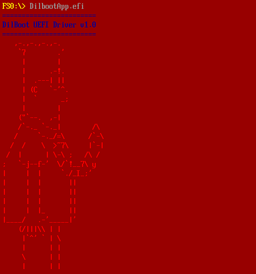
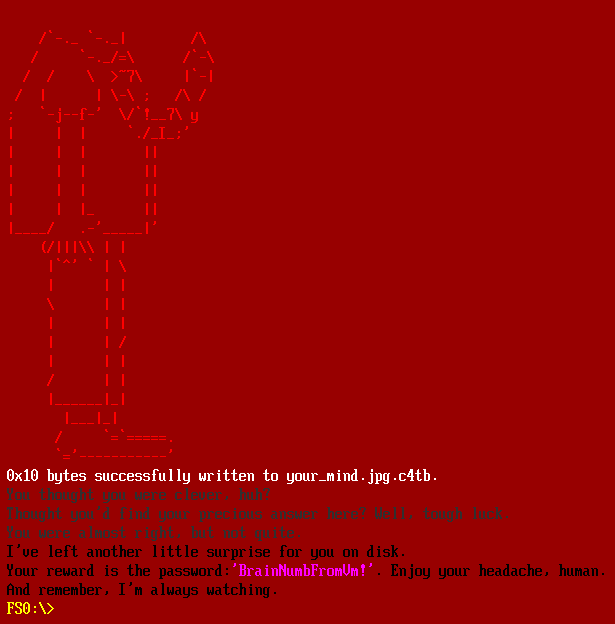

## Flare-On 2024 - #10 Catbert Ransomware
___

### Description: 

*A dire situation has arisen, yet again, at FLARE HQ.*
*One of our employees has fallen victim to a ransomware attack, and the culprit is none other than the notorious Catbert, our malevolent HR manager.*
*Catbert has encrypted the employee's disk, leaving behind a cryptic message and a seemingly innocent decryption utility.*
*However, this utility is not as straightforward as it seems.*
*It's deeply embedded within the firmware and requires a keen eye and technical prowess to extract.*
*The employee's most valuable files are at stake, and time is of the essence.*
*Please, help us out one.... last... time.*

`7-zip password: flare`
___

### Solution:

First of all, we run the BIOS in qemu:
```
	qemu-system-x86_64 -drive file=disk.img,format=raw -m 4096 -bios bios.bin
```

During the bootloading phase we see a cat in the background:


And then the ransom message is loaded:


Based on the challenge decryption (*leaving behind [...] a seemingly innocent decryption utility*)
we search the available commands on the system and we find `decrypt_file`:


Let's see how it works:


Now we mount the disk and we try to decrypt an image:


Our goal is now clear: We have to reverse engineer the `decrypt_file` utility from `bios.bin`
and decrypt the **3** images (`catmeme1.jpg.c4tb`, `catmeme2.jpg.c4tb`, `catmeme3.jpg.c4tb`).
___


### Locating decrypt_file

We load `bios.bin` on IDA. The binary is stripped but it contains debug strings, for example:
```
c:\\users\\dilbert\\edk2\\Build\\Ovmf3264\\DEBUG_VS2019\\IA32\\OvmfPkg\\Sec\\SecMain\\DEBUG\\AutoGen.c
```

Using those strings, we can search online for the source code and determine which function we 
are analyzing. For example, consider the function at `FFFCDA9Ch`:
```c
int __fastcall u_DecompressMemFvs(_DWORD *a1) {
  /* ... */
  v12 = 0;
  v2 = sub_FFFCD9BB(2, &v16);
  if ( v2 < 0 ) {
    sub_FFFCE815(0x80000000, "Unable to find GUID defined section\n");
    return v2;
  }
  v2 = sub_FFFCEECA(&v15, v11);
  if ( v2 < 0 ) {
    sub_FFFCE815(0x80000000, "Unable to GetInfo for GUIDed section\n");
    return v2;
  }
  v14 = 10485760;
  v4 = (-v13 & 0xFFFFF) + v13 + 10485760;
  sub_FFFCE815(
    0x400000,
    "%a: OutputBuffer@%p+0x%x ScratchBuffer@%p+0x%x PcdOvmfDecompressionScratchEnd=0x%x\n",
    1.139238901970816e-305,
    (const void *)v13,
    v4,
    v15,
    27328512,
    v10);

  /* ... */
}
```

Just by searching online for these strings we can infer that this function is `DecompressMemFvs`.
We follow this approach to identify other functions such as `StrLen`:
```c
unsigned __int64 __fastcall u_StrLen(__int64 a1, __int64 a2, __int64 a3, _WORD *a4) {
  /* ... */

  v4 = a4;
  if ( !a4 ) {
    v5 = &off_BDD01FA8;
    v6 = 36LL;
    goto LABEL_5;
  }
  if ( (a4 & 1) != 0 ) {
    v5 = &off_BDD03710;
    v6 = 37LL;
LABEL_5:
    u_DebugAssert(a1, 0LL, v6, "c:\\users\\dilbert\\edk2\\MdePkg\\Library\\BaseLib\\String.c", v5);
  }
  v7 = 0LL;
  while ( *v4 ) {
    if ( v7 >= 0xF4240 )
      u_DebugAssert(
        v7,
        0LL,
        45LL,
        "c:\\users\\dilbert\\edk2\\MdePkg\\Library\\BaseLib\\String.c",
        "Length < _gPcd_FixedAtBuild_PcdMaximumUnicodeStringLength");
    ++v4;
    ++v7;
  }
  return v7;
}
```

Execution starts (as **16-bit**) from address `FFF0h`:
```assembly
BIOS_F:FFF0 start           proc near
BIOS_F:FFF0                 nop
BIOS_F:FFF1                 nop
BIOS_F:FFF2                 jmp     loc_FFF50
BIOS_F:FFF2 start           endp
```

Then execution continues using jumps:
```assembly
BIOS_F:FF50 loc_FFF50:                              ; CODE XREF: start+2↓j
BIOS_F:FF50                 mov     di, 5042h
BIOS_F:FF53                 jmp     short loc_FFF5A
BIOS_F:FF55
BIOS_F:FF55 loc_FFF55:                              ; CODE XREF: BIOS_F:loc_FFF5A↓j
BIOS_F:FF55                 mov     esp, eax
BIOS_F:FF58                 jmp     short loc_FFF5C
BIOS_F:FF5A
BIOS_F:FF5A loc_FFF5A:                              ; CODE XREF: BIOS_F:FF53↑j
BIOS_F:FF5A                 jmp     short loc_FFF55
BIOS_F:FF5C
BIOS_F:FF5C loc_FFF5C:                              ; CODE XREF: BIOS_F:FF58↑j
BIOS_F:FF5C                 jmp     loc_FFED0
```

The rest of the code is not important. Execution continues and loads EFI modules and at some point
it switches from **16-bit** to **64-bit**. We search in `bios.bin` for any information about
`decrypt_file` but we do not find anything. Therefore there is extra code which is unpacked and
loaded. So we follow a dynamic approach: First we run the BIOS in qemu and we attach a debugger
to it (`-s -S` options):
```
	qemu-system-x86_64 -s -S -drive file=disk.img,format=raw -m 4096 -bios bios.bin
```

But the debugger does not show any instructions! That's because of this problem:
[QEMU gdb does not show instructions of firmware](https://stackoverflow.com/questions/62513643/qemu-gdb-does-not-show-instructions-of-firmware)
However, that's not a problem as we can still step through the instructions. So, we let the program
run for long enough until the ransom message is loaded. Then we stop the execution and we search
in memory for various strings from the ransom message. And we find them:
```
MEMORY:0000000000EE4354 aAttentionPunyH:
MEMORY:0000000000EE4354                 text "UTF-16LE", 'Attention, Puny Human!',0Dh,0Ah,0
MEMORY:0000000000EE4386                 db 0, 0, 0, 0, 0, 0, 0, 0, 0, 0, 0, 0, 0, 0
MEMORY:0000000000EE4394 aYourFilesHaveB:
MEMORY:0000000000EE4394                 text "UTF-16LE", 'Your files have been encrypted by yours truly, Catb'
MEMORY:0000000000EE43FA                 text "UTF-16LE", 'ert, the HR Director',0Dh,0Ah,0
MEMORY:0000000000EE4428                 db 0, 0, 0, 0, 0, 0, 0, 0, 0, 0, 0, 0
MEMORY:0000000000EE4434 aAndSupremeFeli:
MEMORY:0000000000EE4434                 text "UTF-16LE", '(and Supreme Feline Overlord).',0Dh,0Ah,0
MEMORY:0000000000EE4476                 dw 0
MEMORY:0000000000EE4478                 text "UTF-16LE", 0Dh,0Ah,0
MEMORY:0000000000EE447E                 db 0, 0, 0, 0, 0, 0
MEMORY:0000000000EE4484 aDonTPanicYet:
MEMORY:0000000000EE4484                 text "UTF-16LE", 'Don',27h,'t Panic (Yet)',0Dh,0Ah,0
MEMORY:0000000000EE44AC                 db 0, 0, 0, 0, 0, 0, 0, 0
MEMORY:0000000000EE44B4 aYourPreciousDa:
MEMORY:0000000000EE44B4                 text "UTF-16LE", 'Your precious data is safe... for now. But if you w'
MEMORY:0000000000EE451A                 text "UTF-16LE", 'ant to see those ',0Dh,0Ah,0
MEMORY:0000000000EE4542                 db 0, 0
MEMORY:0000000000EE4544 aSpreadsheetsAn:
MEMORY:0000000000EE4544                 text "UTF-16LE", 'spreadsheets and cat memes again, you',27h,'ll need'
MEMORY:0000000000EE459E                 text "UTF-16LE", ' to meet my demands.',0Dh,0Ah,0
MEMORY:0000000000EE45CC aTheRansom:
MEMORY:0000000000EE45CC                 text "UTF-16LE", 'The Ransom',0Dh,0Ah,0
MEMORY:0000000000EE45E6                 db 0, 0, 0, 0, 0, 0, 0, 0, 0, 0, 0, 0, 0, 0
MEMORY:0000000000EE45F4 aIRequireAMount:
MEMORY:0000000000EE45F4                 text "UTF-16LE", 'I require a mountain of tuna, a lifetime supply of '
MEMORY:0000000000EE465A                 text "UTF-16LE", 'scratching posts, ',0Dh,0Ah,0
MEMORY:0000000000EE4684 aAndTheImmediat:
MEMORY:0000000000EE4684                 text "UTF-16LE", 'and the immediate resignation of the Pointy-Haired '
MEMORY:0000000000EE46EA                 text "UTF-16LE", 'Boss. ',0Dh,0Ah,0
```

Then we continue searching for the `Nope.` string from the `decrypt_file`. We find all the strings
of the utility:
```
MEMORY:0000000000EED3BA                 db    0
MEMORY:0000000000EED3BB                 db    0
MEMORY:0000000000EED3BC aYay:
MEMORY:0000000000EED3BC                 text "UTF-16LE", '   Yay!',0Dh,0Ah,0
MEMORY:0000000000EED3D0                 db 0, 0, 0, 0
MEMORY:0000000000EED3D4                 text "UTF-16LE", ' |\__/,|   (`\',0Dh,0Ah,0
MEMORY:0000000000EED3F6                 db 0, 0, 0, 0, 0, 0
MEMORY:0000000000EED3FC                 text "UTF-16LE", ' |_ _  |.--.) )',0Dh,0Ah,0
MEMORY:0000000000EED420                 db 0, 0, 0, 0
MEMORY:0000000000EED424 aT:
MEMORY:0000000000EED424                 text "UTF-16LE", ' ( T   )     /',0Dh,0Ah,0
MEMORY:0000000000EED446                 db 0, 0, 0, 0, 0, 0
MEMORY:0000000000EED44C                 text "UTF-16LE", '(((^_(((/(((_/',0Dh,0Ah,0
MEMORY:0000000000EED46E                 db 0, 0, 0, 0, 0, 0
MEMORY:0000000000EED474 aNope:
MEMORY:0000000000EED474                 text "UTF-16LE", '     Nope.',0Dh,0Ah,0
MEMORY:0000000000EED48E                 db 0, 0
MEMORY:0000000000EED490 aP_0:
MEMORY:0000000000EED490                 text "UTF-16LE", '-p',0
MEMORY:0000000000EED496                 db 0, 0, 0, 0, 0, 0
MEMORY:0000000000EED49C aFileSNotFound:
MEMORY:0000000000EED49C                 text "UTF-16LE", 'File %s not found',0Dh,0Ah,0
MEMORY:0000000000EED4C4 aSuccessfullyRe:
MEMORY:0000000000EED4C4                 text "UTF-16LE", 'Successfully read %d bytes from %s',0Dh,0Ah,0
MEMORY:0000000000EED50E                 db 0, 0, 0, 0, 0, 0
MEMORY:0000000000EED514 aOhYouThoughtYo:
MEMORY:0000000000EED514                 text "UTF-16LE", 'Oh, you thought you could just waltz in here and de'
MEMORY:0000000000EED57A                 text "UTF-16LE", 'crypt ANY file, did you?',0Dh,0Ah,0
MEMORY:0000000000EED5B0                 db 0, 0, 0, 0
MEMORY:0000000000EED5B4 aNewsflashOnlyC:
MEMORY:0000000000EED5B4                 text "UTF-16LE", 'Newsflash: Only .c4tb encrypted JPEGs are worthy of'
MEMORY:0000000000EED61A                 text "UTF-16LE", ' my decryption powers.',0Dh,0Ah,0
MEMORY:0000000000EED64C aC4tb:
MEMORY:0000000000EED64C                 text "UTF-16LE", '.c4tb',0
MEMORY:0000000000EED658                 db 0, 0, 0, 0, 0, 0, 0, 0, 0, 0, 0, 0
MEMORY:0000000000EED664 aIsThatWhatYouT:
MEMORY:0000000000EED664                 text "UTF-16LE", 'is that what you think you',27h,'re doing? Trying t'
MEMORY:0000000000EED6BE                 text "UTF-16LE", 'o crack something?',0Dh,0Ah,0
MEMORY:0000000000EED6E8                 db 0, 0, 0, 0, 0, 0, 0, 0, 0, 0, 0, 0
MEMORY:0000000000EED6F4 aWellLetMeTellY:
MEMORY:0000000000EED6F4                 text "UTF-16LE", 'Well, let me tell you, you',27h,'re wasting your ti'
MEMORY:0000000000EED74E                 text "UTF-16LE", 'me.',0Dh,0Ah,0
MEMORY:0000000000EED75A                 db 0, 0, 0, 0, 0, 0, 0, 0, 0, 0
MEMORY:0000000000EED764 a0xXBytesSucces:
MEMORY:0000000000EED764                 text "UTF-16LE", '0x%x bytes successfully written to %s.',0Dh,0Ah,0
MEMORY:0000000000EED7B6                 db 0, 0, 0, 0, 0, 0, 0, 0, 0, 0, 0, 0, 0, 0
MEMORY:0000000000EED7C4 aOhYouThinkYouR:
MEMORY:0000000000EED7C4                 text "UTF-16LE", 'Oh, you think you',27h,'re so smart, huh? Decryptin'
MEMORY:0000000000EED81E                 text "UTF-16LE", 'g JPEGs? Big deal.',0Dh,0Ah,0
MEMORY:0000000000EED848                 db 0, 0, 0, 0, 0, 0, 0, 0, 0, 0, 0, 0
MEMORY:0000000000EED854 aAsASpecialFavo:
MEMORY:0000000000EED854                 text "UTF-16LE", 'As a special favor, I',27h,'ll let you enjoy the th'
MEMORY:0000000000EED8AE                 text "UTF-16LE", 'rill of watching me',0Dh,0Ah,0
MEMORY:0000000000EED8DA                 db 0, 0, 0, 0, 0, 0, 0, 0, 0, 0
MEMORY:0000000000EED8E4 aDecryptTheUefi:
MEMORY:0000000000EED8E4                 text "UTF-16LE", 'decrypt the UEFI driver. Consider yourself lucky.',0Dh
MEMORY:0000000000EED948                 text "UTF-16LE", 0Ah,0
MEMORY:0000000000EED94C aDilbootappEfiE:
MEMORY:0000000000EED94C                 text "UTF-16LE", 'DilbootApp.efi.enc',0
MEMORY:0000000000EED972                 dw 0
MEMORY:0000000000EED974 aHaveYouDeleted:
MEMORY:0000000000EED974                 text "UTF-16LE", 'Have you deleted Dilboot.efi.enc?',0Dh,0Ah,0
MEMORY:0000000000EED9BC                 db 0, 0, 0, 0, 0, 0, 0, 0
MEMORY:0000000000EED9C4 aWellNowISurely:
MEMORY:0000000000EED9C4                 text "UTF-16LE", 'Well now I surely know you are wasting your time.',0Dh
MEMORY:0000000000EEDA28                 text "UTF-16LE", 0Ah,0
MEMORY:0000000000EEDA2C                 db 0, 0, 0, 0, 0, 0, 0, 0
MEMORY:0000000000EEDA34 aSuccessfullyRe_0:
MEMORY:0000000000EEDA34                 text "UTF-16LE", 'Successfully read %d bytes from DilbootApp.efi.enc',0Dh
MEMORY:0000000000EEDA9A                 text "UTF-16LE", 0Ah,0
MEMORY:0000000000EEDA9E                 db 0, 0, 0, 0, 0, 0
MEMORY:0000000000EEDAA4 aDilbootappEfi:
MEMORY:0000000000EEDAA4                 text "UTF-16LE", 'DilbootApp.efi',0
MEMORY:0000000000EEDAC2                 dw 0
MEMORY:0000000000EEDAC4 a0xXBytesSucces_0:
MEMORY:0000000000EEDAC4                 text "UTF-16LE", '0x%x bytes successfully written to Dilboot.efi.',0Dh
MEMORY:0000000000EEDB24                 text "UTF-16LE", 0Ah,0
MEMORY:0000000000EEDB28                 db 0, 0, 0, 0, 0, 0, 0, 0, 0, 0, 0, 0
MEMORY:0000000000EEDB34 aYouVeMadeItThi:
MEMORY:0000000000EEDB34                 text "UTF-16LE", 'you',27h,'ve made it this far, have you? Pat yourse'
MEMORY:0000000000EEDB8E                 text "UTF-16LE", 'lf on the back.',0Dh,0Ah,0
MEMORY:0000000000EEDBB2                 dw 0
MEMORY:0000000000EEDBB4 aWantToKnowWhat:
MEMORY:0000000000EEDBB4                 text "UTF-16LE", 'Want to know what real fun is? Go ahead, run the .e'
MEMORY:0000000000EEDC1A                 text "UTF-16LE", 'fi file.',0Dh,0Ah,0
MEMORY:0000000000EEDC30                 db 0, 0, 0, 0
MEMORY:0000000000EEDC34 aJustDonTSayIDi:
MEMORY:0000000000EEDC34                 text "UTF-16LE", 'Just don',27h,'t say I didn',27h,'t warn you.',0Dh,0Ah
MEMORY:0000000000EEDC7A                 text "UTF-16LE", 0
```

We set a hardware breakpoint on the `Nope.` message and we run the `decrypt_file` hoping we will
hit it. But unfortunately the program runs without triggering any breakpoints. This is because 
the `Nope.` message appears several times in memory. So we have to set many breakpoints. We locate
the first message and then we **search backwards** for the string `     Nope.`.  We find **7-8**
nope messages and we set breakpoints to each of them. Then we rerun the program and we land in
the following function:
```c
unsigned __int64 __fastcall sub_BDCAA2BC(__int64 a1, __int64 a2, __int64 a3, _WORD *a4) {
  /* ... */
  v4 = a4;
  if ( !a4 ){
    v5 = &off_BDD01FA8;
    v6 = 36LL;
    goto LABEL_5;
  }
  if ( (a4 & 1) != 0 ) {
    v5 = &off_BDD03710;
    v6 = 37LL;
LABEL_5:
    sub_BDCABFD4(a1, 0LL, v6, "c:\\users\\dilbert\\edk2\\MdePkg\\Library\\BaseLib\\String.c", v5);
  }
  v7 = 0LL;
  while ( *v4 ) {
    if ( v7 >= 0xF4240 )
      sub_BDCABFD4(
        v7,
        0LL,
        45LL,
        "c:\\users\\dilbert\\edk2\\MdePkg\\Library\\BaseLib\\String.c",
        "Length < _gPcd_FixedAtBuild_PcdMaximumUnicodeStringLength");
    ++v4;
    ++v7;
  }
  return v7;
}
```

We continue execution and we find the function that prints the nope message:
```c
__int64 __fastcall u_NOPE_MSG(__int64 a1, __int64 a2) {
  /* ... */

  (*(qword_BF5EB018[8] + 40LL))(a1, a2, 76LL, qword_BF5EB018[8]);
  u_print_to_console(a1, a2, 0xFFFFFFFFLL, -1, L" |\\__/,|   (`\\\r\n", v2, v9, v15, v21, v27);
  u_print_to_console(a1, a2, 0xFFFFFFFFLL, -1, L" |_ _  |.--.) )\r\n", v3, v10, v16, v22, v28);
  u_print_to_console(a1, a2, 0xFFFFFFFFLL, -1, L" ( T   )     /\r\n", v4, v11, v17, v23, v29);
  u_print_to_console(a1, a2, 0xFFFFFFFFLL, -1, L"(((^_(((/(((_/\r\n", v5, v12, v18, v24, v30);
  u_print_to_console(a1, a2, 0xFFFFFFFFLL, -1, L"\r\n", v6, v13, v19, v25, v31);
  (*(qword_BF5EB018[8] + 40LL))(a1, a2, 78LL, qword_BF5EB018[8]);
  u_print_to_console(a1, a2, 0xFFFFFFFFLL, -1, L"     Nope.\r\n", v7, v14, v20, v26, v32);
  return (*(qword_BF5EB018[8] + 40LL))(a1, a2, 71LL, qword_BF5EB018[8]);
}
```

The only XREF of this function points to the main function of `decrypt_file` located at `BDCCABC4h`.

I'm also assuming there's a better way to locate these functions.

### Reversing decrypt_file

The decompiled code of `decrypt_file` is not very good so we work directly with assembly:
```assembly
MEMORY:00000000BDCCABC4 u_DECRYPT_FILE_MAIN proc near           ; DATA XREF: MEMORY:00000000BDF66DB8↓o
MEMORY:00000000BDCCABC4
MEMORY:00000000BDCCABC4 var_50          = qword ptr -50h
MEMORY:00000000BDCCABC4 var_30          = qword ptr -30h
MEMORY:00000000BDCCABC4 var_28          = qword ptr -28h
MEMORY:00000000BDCCABC4 var_20          = qword ptr -20h
MEMORY:00000000BDCCABC4 var_18          = qword ptr -18h
MEMORY:00000000BDCCABC4 var_10          = qword ptr -10h
MEMORY:00000000BDCCABC4 var_8           = qword ptr -8
MEMORY:00000000BDCCABC4 arg_0           = qword ptr  40h
MEMORY:00000000BDCCABC4 arg_8           = qword ptr  48h
MEMORY:00000000BDCCABC4 arg_10          = qword ptr  50h
MEMORY:00000000BDCCABC4 arg_18          = qword ptr  58h
MEMORY:00000000BDCCABC4
MEMORY:00000000BDCCABC4                 mov     [rsp-38h+arg_0], rbx
MEMORY:00000000BDCCABC9                 push    rbp
MEMORY:00000000BDCCABCA                 push    rsi
MEMORY:00000000BDCCABCB                 push    rdi
MEMORY:00000000BDCCABCC                 push    r12
MEMORY:00000000BDCCABCE                 push    r13
MEMORY:00000000BDCCABD0                 push    r14
MEMORY:00000000BDCCABD2                 push    r15
MEMORY:00000000BDCCABD4                 mov     rbp, rsp
MEMORY:00000000BDCCABD7                 sub     rsp, 50h
MEMORY:00000000BDCCABDB                 call    sub_BDCADFE4
MEMORY:00000000BDCCABE0                 xor     r12d, r12d
MEMORY:00000000BDCCABE3                 test    rax, rax
MEMORY:00000000BDCCABE6                 js      loc_BDCCB5C4
MEMORY:00000000BDCCABEC                 call    near ptr sub_BDCB4FA4
MEMORY:00000000BDCCABF1                 test    rax, rax
MEMORY:00000000BDCCABF4                 js      loc_BDCCB5C4
MEMORY:00000000BDCCABFA                 lea     r8, [rbp+arg_18]
MEMORY:00000000BDCCABFE                 mov     byte ptr [rsp+48h+var_28], r12b
MEMORY:00000000BDCCAC03                 lea     rdx, [rbp+var_10]
MEMORY:00000000BDCCAC07                 lea     rcx, asc_BDD0A550 ; "H"
MEMORY:00000000BDCCAC0E                 call    near ptr off_BDCAF576+2
MEMORY:00000000BDCCAC13                 mov     rsi, rax
MEMORY:00000000BDCCAC16                 test    rax, rax
MEMORY:00000000BDCCAC19                 jns     short loc_BDCCAC7C
MEMORY:00000000BDCCAC1B                 mov     rax, 800000000000000Ah
MEMORY:00000000BDCCAC25                 cmp     rsi, rax
MEMORY:00000000BDCCAC28                 jnz     loc_BDCCADA1
MEMORY:00000000BDCCAC2E                 mov     rdi, [rbp+arg_18]
MEMORY:00000000BDCCAC32                 test    rdi, rdi
MEMORY:00000000BDCCAC35                 jz      loc_BDCCADA1
MEMORY:00000000BDCCAC3B                 lea     rax, aDecryptFile_2 ; "decrypt_file"
MEMORY:00000000BDCCAC42                 mov     [rsp+48h+var_18], rdi
MEMORY:00000000BDCCAC47                 mov     [rsp+48h+var_20], rax
MEMORY:00000000BDCCAC4C                 lea     r9d, [r12+5]
MEMORY:00000000BDCCAC51                 mov     rax, cs:off_BDD81538 ; "hihl"
MEMORY:00000000BDCCAC58                 or      ebx, 0FFFFFFFFh
MEMORY:00000000BDCCAC5B                 xor     r8d, r8d
MEMORY:00000000BDCCAC5E                 mov     [rsp+48h+var_28], rax
MEMORY:00000000BDCCAC63                 mov     edx, ebx
MEMORY:00000000BDCCAC65                 mov     ecx, ebx
MEMORY:00000000BDCCAC67                 call    sub_BDCB00FC
MEMORY:00000000BDCCAC6C                 mov     rcx, rdi
MEMORY:00000000BDCCAC6F                 call    u_ASSERT_EFI_ERROR
MEMORY:00000000BDCCAC74                 lea     esi, [rbx+3]
MEMORY:00000000BDCCAC77                 jmp     loc_BDCCADA1
MEMORY:00000000BDCCAC7C ; ---------------------------------------------------------------------------
MEMORY:00000000BDCCAC7C
MEMORY:00000000BDCCAC7C loc_BDCCAC7C:                           ; CODE XREF: u_DECRYPT_FILE_MAIN+55↑j
MEMORY:00000000BDCCAC7C                 mov     rsi, [rbp+var_10]
MEMORY:00000000BDCCAC80                 mov     edi, 2
MEMORY:00000000BDCCAC85                 mov     edx, edi
MEMORY:00000000BDCCAC87                 mov     rcx, rsi
MEMORY:00000000BDCCAC8A                 call    sub_BDCAF8D4
MEMORY:00000000BDCCAC8F                 test    rax, rax
MEMORY:00000000BDCCAC92                 jnz     short loc_BDCCACC6
MEMORY:00000000BDCCAC94                 mov     rcx, cs:off_BDD81538 ; "hihl"
MEMORY:00000000BDCCAC9B                 lea     rax, aDecryptFile_2 ; "decrypt_file"
MEMORY:00000000BDCCACA2                 mov     [rsp+48h+var_20], rax
MEMORY:00000000BDCCACA7                 lea     r9d, [rdi+1]
MEMORY:00000000BDCCACAB                 mov     [rsp+48h+var_28], rcx
MEMORY:00000000BDCCACB0
MEMORY:00000000BDCCACB0 loc_BDCCACB0:                           ; CODE XREF: u_DECRYPT_FILE_MAIN+133↓j
MEMORY:00000000BDCCACB0                 or      ebx, 0FFFFFFFFh
MEMORY:00000000BDCCACB3                 xor     r8d, r8d
MEMORY:00000000BDCCACB6                 mov     edx, ebx
MEMORY:00000000BDCCACB8                 mov     ecx, ebx
MEMORY:00000000BDCCACBA                 call    sub_BDCB00FC
MEMORY:00000000BDCCACBF
MEMORY:00000000BDCCACBF loc_BDCCACBF:                           ; CODE XREF: u_DECRYPT_FILE_MAIN+87B↓j
MEMORY:00000000BDCCACBF                                         ; u_DECRYPT_FILE_MAIN+99B↓j ...
MEMORY:00000000BDCCACBF                 mov     eax, edi
MEMORY:00000000BDCCACC1                 jmp     loc_BDCCB5C4
MEMORY:00000000BDCCACC6 ; ---------------------------------------------------------------------------
MEMORY:00000000BDCCACC6
MEMORY:00000000BDCCACC6 loc_BDCCACC6:                           ; CODE XREF: u_DECRYPT_FILE_MAIN+CE↑j
MEMORY:00000000BDCCACC6                 mov     r14d, 3
MEMORY:00000000BDCCACCC                 mov     rcx, rsi
MEMORY:00000000BDCCACCF                 mov     edx, r14d
MEMORY:00000000BDCCACD2                 call    sub_BDCAF8D4
MEMORY:00000000BDCCACD7                 test    rax, rax
MEMORY:00000000BDCCACDA                 jz      short loc_BDCCACF9
MEMORY:00000000BDCCACDC                 lea     rax, aDecryptFile_2 ; "decrypt_file"
MEMORY:00000000BDCCACE3                 mov     r9d, edi
MEMORY:00000000BDCCACE6                 mov     [rsp+48h+var_20], rax
MEMORY:00000000BDCCACEB                 mov     rax, cs:off_BDD81538 ; "hihl"
MEMORY:00000000BDCCACF2                 mov     [rsp+48h+var_28], rax
MEMORY:00000000BDCCACF7                 jmp     short loc_BDCCACB0
MEMORY:00000000BDCCACF9 ; ---------------------------------------------------------------------------
MEMORY:00000000BDCCACF9
MEMORY:00000000BDCCACF9 loc_BDCCACF9:                           ; CODE XREF: u_DECRYPT_FILE_MAIN+116↑j
MEMORY:00000000BDCCACF9                 mov     eax, 1
MEMORY:00000000BDCCACFE                 mov     rcx, rsi
MEMORY:00000000BDCCAD01                 mov     edx, eax
MEMORY:00000000BDCCAD03                 mov     ebx, eax
MEMORY:00000000BDCCAD05                 call    sub_BDCAF8D4
MEMORY:00000000BDCCAD0A                 mov     r13d, 100h
MEMORY:00000000BDCCAD10                 jmp     short loc_BDCCAD6E
MEMORY:00000000BDCCAD12 ; ---------------------------------------------------------------------------
MEMORY:00000000BDCCAD12
MEMORY:00000000BDCCAD12 loc_BDCCAD12:                           ; CODE XREF: u_DECRYPT_FILE_MAIN+1AD↓j
MEMORY:00000000BDCCAD12                 mov     rdx, rbx
MEMORY:00000000BDCCAD15                 mov     rcx, rsi
MEMORY:00000000BDCCAD18                 call    sub_BDCAF8D4
MEMORY:00000000BDCCAD1D                 mov     r15, rax
MEMORY:00000000BDCCAD20                 cmp     rbx, 1
MEMORY:00000000BDCCAD24                 jnz     short loc_BDCCAD3E
MEMORY:00000000BDCCAD26                 mov     edx, 208h
MEMORY:00000000BDCCAD2B                 call    u_alloc_buffer
MEMORY:00000000BDCCAD30                 mov     cs:off_BDD81558, rax
MEMORY:00000000BDCCAD37                 mov     edx, 208h
MEMORY:00000000BDCCAD3C                 jmp     short loc_BDCCAD55
MEMORY:00000000BDCCAD3E ; ---------------------------------------------------------------------------
MEMORY:00000000BDCCAD3E
MEMORY:00000000BDCCAD3E loc_BDCCAD3E:                           ; CODE XREF: u_DECRYPT_FILE_MAIN+160↑j
MEMORY:00000000BDCCAD3E                 cmp     rbx, rdi
MEMORY:00000000BDCCAD41                 jnz     short loc_BDCCAD60
MEMORY:00000000BDCCAD43                 mov     rdx, r13
MEMORY:00000000BDCCAD46                 call    u_alloc_buffer
MEMORY:00000000BDCCAD4B                 mov     cs:glo_key, rax
MEMORY:00000000BDCCAD52                 mov     rdx, r13
MEMORY:00000000BDCCAD55
MEMORY:00000000BDCCAD55 loc_BDCCAD55:                           ; CODE XREF: u_DECRYPT_FILE_MAIN+178↑j
MEMORY:00000000BDCCAD55                 mov     r8, r15
MEMORY:00000000BDCCAD58                 mov     rcx, rax
MEMORY:00000000BDCCAD5B                 call    near ptr sub_BDCA8DD0
MEMORY:00000000BDCCAD60
MEMORY:00000000BDCCAD60 loc_BDCCAD60:                           ; CODE XREF: u_DECRYPT_FILE_MAIN+17D↑j
MEMORY:00000000BDCCAD60                 inc     rbx
MEMORY:00000000BDCCAD63                 mov     rcx, rsi
MEMORY:00000000BDCCAD66                 mov     rdx, rbx
MEMORY:00000000BDCCAD69                 call    sub_BDCAF8D4
MEMORY:00000000BDCCAD6E
MEMORY:00000000BDCCAD6E loc_BDCCAD6E:                           ; CODE XREF: u_DECRYPT_FILE_MAIN+14C↑j
MEMORY:00000000BDCCAD6E                 test    rax, rax
MEMORY:00000000BDCCAD71                 jnz     short loc_BDCCAD12
MEMORY:00000000BDCCAD73                 mov     rcx, cs:off_BDD81558
MEMORY:00000000BDCCAD7A                 call    sub_BDCB0CC0
MEMORY:00000000BDCCAD7F                 mov     rsi, rax
MEMORY:00000000BDCCAD82                 test    rax, rax
MEMORY:00000000BDCCAD85                 jns     short loc_BDCCADA8
MEMORY:00000000BDCCAD87                 mov     r9, cs:off_BDD81558
MEMORY:00000000BDCCAD8E                 lea     r8, aFileSNotFound_0 ; "File %s not found\r\n"
MEMORY:00000000BDCCAD95                 or      ebx, 0FFFFFFFFh
MEMORY:00000000BDCCAD98                 mov     edx, ebx
MEMORY:00000000BDCCAD9A                 mov     ecx, ebx
MEMORY:00000000BDCCAD9C                 call    u_print_to_console
MEMORY:00000000BDCCADA1
MEMORY:00000000BDCCADA1 loc_BDCCADA1:                           ; CODE XREF: u_DECRYPT_FILE_MAIN+64↑j
MEMORY:00000000BDCCADA1                                         ; u_DECRYPT_FILE_MAIN+71↑j ...
MEMORY:00000000BDCCADA1                 mov     eax, esi
MEMORY:00000000BDCCADA3                 jmp     loc_BDCCB5C4
MEMORY:00000000BDCCADA8 ; ---------------------------------------------------------------------------
MEMORY:00000000BDCCADA8
MEMORY:00000000BDCCADA8 loc_BDCCADA8:                           ; CODE XREF: u_DECRYPT_FILE_MAIN+1C1↑j
MEMORY:00000000BDCCADA8                 mov     rcx, cs:off_BDD81558
MEMORY:00000000BDCCADAF                 lea     rdx, off_BDD81540
MEMORY:00000000BDCCADB6                 xor     r9d, r9d
MEMORY:00000000BDCCADB9                 mov     r8, r14
MEMORY:00000000BDCCADBC                 call    near ptr sub_BDCAE038
MEMORY:00000000BDCCADC1 ; ---------------------------------------------------------------------------
MEMORY:00000000BDCCADC1                 test    rax, rax
MEMORY:00000000BDCCADC4                 js      loc_BDCCB5C4
MEMORY:00000000BDCCADCA                 mov     rcx, cs:off_BDD81540
MEMORY:00000000BDCCADD1                 lea     rdx, [rbp+arg_10]
MEMORY:00000000BDCCADD5                 call    cs:off_BDE04AA8
MEMORY:00000000BDCCADDB                 test    rax, rax
MEMORY:00000000BDCCADDE                 js      loc_BDCCB5C4
MEMORY:00000000BDCCADE4                 mov     rdx, [rbp+arg_10]
MEMORY:00000000BDCCADE8                 call    u_alloc_buffer
MEMORY:00000000BDCCADED                 mov     cs:off_BDD81598, rax
MEMORY:00000000BDCCADF4                 test    rax, rax
MEMORY:00000000BDCCADF7                 jz      loc_BDCCB5BF
MEMORY:00000000BDCCADFD                 mov     rcx, cs:off_BDD81540
MEMORY:00000000BDCCAE04                 lea     rdx, [rbp+arg_10]
MEMORY:00000000BDCCAE08                 mov     r8, rax
MEMORY:00000000BDCCAE0B                 call    cs:off_BDE04A70
MEMORY:00000000BDCCAE11                 test    rax, rax
MEMORY:00000000BDCCAE14                 js      loc_BDCCB5C4
MEMORY:00000000BDCCAE1A                 mov     rax, cs:off_BDD81460
MEMORY:00000000BDCCAE21                 mov     edx, 4Fh ; 'O'
MEMORY:00000000BDCCAE26                 mov     r8, [rax+40h]
MEMORY:00000000BDCCAE2A                 mov     rcx, r8
MEMORY:00000000BDCCAE2D                 call    qword ptr [r8+28h]
MEMORY:00000000BDCCAE31                 mov     rax, cs:off_BDD81558
MEMORY:00000000BDCCAE38                 lea     r8, aSuccessfullyRe_1 ; "Successfully read %d bytes from %s\r\n"
MEMORY:00000000BDCCAE3F                 mov     r9, [rbp+arg_10]
MEMORY:00000000BDCCAE43                 or      ebx, 0FFFFFFFFh
MEMORY:00000000BDCCAE46                 mov     edx, ebx
MEMORY:00000000BDCCAE48                 mov     [rsp+70h+var_50], rax
MEMORY:00000000BDCCAE4D                 mov     ecx, ebx
MEMORY:00000000BDCCAE4F                 call    u_print_to_console
MEMORY:00000000BDCCAE54                 mov     rax, cs:off_BDD81460
MEMORY:00000000BDCCAE5B                 lea     esi, [rbx+48h]
MEMORY:00000000BDCCAE5E                 mov     edx, esi
MEMORY:00000000BDCCAE60                 mov     r8, [rax+40h]
MEMORY:00000000BDCCAE64                 mov     rcx, r8
MEMORY:00000000BDCCAE67                 call    qword ptr [r8+28h]
MEMORY:00000000BDCCAE6B                 lea     edx, [rbx+21h]
MEMORY:00000000BDCCAE6E                 call    u_alloc_buffer
MEMORY:00000000BDCCAE73                 mov     cs:off_BDD81588, rax ; "C4TBT"
MEMORY:00000000BDCCAE7A                 mov     r8, rax
MEMORY:00000000BDCCAE7D                 test    rax, rax
MEMORY:00000000BDCCAE80                 jz      loc_BDCCB5BF
MEMORY:00000000BDCCAE86                 mov     rax, cs:off_BDD81598
MEMORY:00000000BDCCAE8D                 mov     ecx, [rax]
MEMORY:00000000BDCCAE8F                 mov     [r8], ecx
MEMORY:00000000BDCCAE92                 cmp     ecx, 42543443h
MEMORY:00000000BDCCAE98                 jnz     loc_BDCCB56E
MEMORY:00000000BDCCAE9E                 mov     edx, [rax+4]
MEMORY:00000000BDCCAEA1                 mov     [r8+4], edx     ; DATA XREF: MEMORY:00000000BDF66CB8↓o
MEMORY:00000000BDCCAEA5                 mov     ecx, [rax+8]
MEMORY:00000000BDCCAEA8                 mov     [r8+8], ecx
MEMORY:00000000BDCCAEAC                 mov     eax, [rax+0Ch]
MEMORY:00000000BDCCAEAF                 mov     [r8+0Ch], eax
MEMORY:00000000BDCCAEB3                 call    u_alloc_buffer
MEMORY:00000000BDCCAEB8                 mov     rcx, cs:off_BDD81588 ; "C4TBT"
MEMORY:00000000BDCCAEBF                 mov     [rcx+18h], rax
MEMORY:00000000BDCCAEC3                 test    rax, rax
MEMORY:00000000BDCCAEC6                 jz      loc_BDCCB5BF
MEMORY:00000000BDCCAECC                 mov     rdx, cs:off_BDD81598
MEMORY:00000000BDCCAED3                 mov     r8d, [rcx+4]
MEMORY:00000000BDCCAED7                 add     rdx, 10h
MEMORY:00000000BDCCAEDB                 mov     rcx, rax
MEMORY:00000000BDCCAEDE                 call    u_memcpy_probably
MEMORY:00000000BDCCAEE3                 mov     rax, cs:off_BDD81588 ; "C4TBT"
MEMORY:00000000BDCCAEEA                 mov     edx, [rax+0Ch]
MEMORY:00000000BDCCAEED                 call    u_alloc_buffer
MEMORY:00000000BDCCAEF2                 mov     rcx, cs:off_BDD81588 ; "C4TBT"
MEMORY:00000000BDCCAEF9                 mov     [rcx+10h], rax
MEMORY:00000000BDCCAEFD                 test    rax, rax
MEMORY:00000000BDCCAF00                 jz      loc_BDCCB5BF
MEMORY:00000000BDCCAF06                 mov     edx, [rcx+8]
MEMORY:00000000BDCCAF09                 mov     r8d, [rcx+0Ch]
MEMORY:00000000BDCCAF0D                 mov     rcx, rax
MEMORY:00000000BDCCAF10                 add     rdx, cs:off_BDD81598
MEMORY:00000000BDCCAF17                 call    u_memcpy_probably
MEMORY:00000000BDCCAF1C                 mov     rcx, cs:glo_key
MEMORY:00000000BDCCAF23                 call    u_StrLen
MEMORY:00000000BDCCAF28                 lea     esi, [rbx+11h]
MEMORY:00000000BDCCAF2B                 cmp     rax, rsi
MEMORY:00000000BDCCAF2E                 jnz     loc_BDCCB564
MEMORY:00000000BDCCAF34                 mov     rax, cs:off_BDD81588 ; "C4TBT"
MEMORY:00000000BDCCAF3B                 mov     edx, [rax+0Ch]
MEMORY:00000000BDCCAF3E                 call    u_alloc_buffer
MEMORY:00000000BDCCAF43                 mov     cs:qword_BDD815A8, rax
MEMORY:00000000BDCCAF4A                 test    rax, rax
MEMORY:00000000BDCCAF4D                 jz      loc_BDCCB5BF
MEMORY:00000000BDCCAF53                 mov     rdx, cs:off_BDD81588 ; "C4TBT"
MEMORY:00000000BDCCAF5A                 mov     rcx, rax
MEMORY:00000000BDCCAF5D                 mov     r8d, [rdx+0Ch]
MEMORY:00000000BDCCAF61                 mov     rdx, [rdx+10h]
MEMORY:00000000BDCCAF65                 call    u_memcpy_probably
MEMORY:00000000BDCCAF6A                 mov     r8, cs:glo_key
MEMORY:00000000BDCCAF71                 mov     rcx, cs:qword_BDD815A8
MEMORY:00000000BDCCAF78                 mov     al, [r8]
MEMORY:00000000BDCCAF7B                 mov     [rcx+5], al
MEMORY:00000000BDCCAF7E                 mov     al, [r8+2]
MEMORY:00000000BDCCAF82                 mov     [rcx+4], al
MEMORY:00000000BDCCAF85                 mov     al, [r8+4]
MEMORY:00000000BDCCAF89                 mov     [rcx+0Ch], al
MEMORY:00000000BDCCAF8C                 mov     al, [r8+6]
MEMORY:00000000BDCCAF90                 mov     [rcx+0Bh], al
MEMORY:00000000BDCCAF93                 mov     al, [r8+8]
MEMORY:00000000BDCCAF97                 mov     [rcx+13h], al
MEMORY:00000000BDCCAF9A                 mov     al, [r8+0Ah]
MEMORY:00000000BDCCAF9E                 mov     [rcx+12h], al
MEMORY:00000000BDCCAFA1                 mov     al, [r8+0Ch]
MEMORY:00000000BDCCAFA5                 mov     [rcx+1Ah], al
MEMORY:00000000BDCCAFA8                 mov     al, [r8+0Eh]
MEMORY:00000000BDCCAFAC                 mov     [rcx+19h], al
MEMORY:00000000BDCCAFAF                 mov     al, [r8+10h]
MEMORY:00000000BDCCAFB3                 mov     [rcx+21h], al
MEMORY:00000000BDCCAFB6                 mov     al, [r8+12h]
MEMORY:00000000BDCCAFBA                 mov     [rcx+20h], al
MEMORY:00000000BDCCAFBD                 mov     al, [r8+14h]
MEMORY:00000000BDCCAFC1                 mov     [rcx+28h], al
MEMORY:00000000BDCCAFC4                 mov     al, [r8+16h]
MEMORY:00000000BDCCAFC8                 mov     [rcx+27h], al
MEMORY:00000000BDCCAFCB                 mov     al, [r8+18h]
MEMORY:00000000BDCCAFCF                 mov     [rcx+2Fh], al
MEMORY:00000000BDCCAFD2                 mov     al, [r8+1Ah]
MEMORY:00000000BDCCAFD6                 mov     [rcx+2Eh], al
MEMORY:00000000BDCCAFD9                 mov     al, [r8+1Ch]
MEMORY:00000000BDCCAFDD                 mov     [rcx+36h], al
MEMORY:00000000BDCCAFE0                 mov     al, [r8+1Eh]
MEMORY:00000000BDCCAFE4                 mov     [rcx+35h], al
MEMORY:00000000BDCCAFE7                 call    near ptr u_VM_DECRYPT
MEMORY:00000000BDCCAFEC                 cmp     cs:glo_decr_result, r12
MEMORY:00000000BDCCAFF3                 jz      loc_BDCCB564
MEMORY:00000000BDCCAFF9                 mov     edx, 208h
MEMORY:00000000BDCCAFFE                 call    u_alloc_buffer
MEMORY:00000000BDCCB003                 mov     cs:qword_BDD81578, rax
MEMORY:00000000BDCCB00A                 test    rax, rax
MEMORY:00000000BDCCB00D                 jz      loc_BDCCB5BF
MEMORY:00000000BDCCB013                 mov     r15d, 104h
MEMORY:00000000BDCCB019                 mov     edx, r15d
MEMORY:00000000BDCCB01C                 call    u_alloc_buffer
MEMORY:00000000BDCCB021                 mov     cs:qword_BDD81570, rax
MEMORY:00000000BDCCB028                 test    rax, rax
MEMORY:00000000BDCCB02B                 jz      loc_BDCCB5BF
MEMORY:00000000BDCCB031                 call    sub_BDCA9FC0
MEMORY:00000000BDCCB036                 mov     r8, cs:off_BDD81558
MEMORY:00000000BDCCB03D                 mov     edx, r15d
MEMORY:00000000BDCCB040                 mov     rcx, cs:qword_BDD81578
MEMORY:00000000BDCCB047                 call    near ptr sub_BDCA8DD0
MEMORY:00000000BDCCB04C                 mov     rcx, cs:qword_BDD81578
MEMORY:00000000BDCCB053                 lea     rdx, aC4tb_0    ; ".c4tb"
MEMORY:00000000BDCCB05A                 call    sub_BDCAA4D4
MEMORY:00000000BDCCB05F                 test    rax, rax
MEMORY:00000000BDCCB062                 jz      short loc_BDCCB068
MEMORY:00000000BDCCB064                 mov     [rax], r12w
MEMORY:00000000BDCCB068
MEMORY:00000000BDCCB068 loc_BDCCB068:                           ; CODE XREF: u_DECRYPT_FILE_MAIN+49E↑j
MEMORY:00000000BDCCB068                 call    near ptr sub_BDCCA240
MEMORY:00000000BDCCB06D                 cmp     eax, 8AE981A5h
MEMORY:00000000BDCCB072                 jnz     short loc_BDCCB085
MEMORY:00000000BDCCB074                 mov     rcx, r13
MEMORY:00000000BDCCB077                 call    sub_BDCAC080
MEMORY:00000000BDCCB07C                 mov     cs:qword_BDD815B0, rax
MEMORY:00000000BDCCB083                 jmp     short loc_BDCCB0B3
MEMORY:00000000BDCCB085 ; ---------------------------------------------------------------------------
MEMORY:00000000BDCCB085
MEMORY:00000000BDCCB085 loc_BDCCB085:                           ; CODE XREF: u_DECRYPT_FILE_MAIN+4AE↑j
MEMORY:00000000BDCCB085                 cmp     eax, 92918788h
MEMORY:00000000BDCCB08A                 jnz     short loc_BDCCB09D
MEMORY:00000000BDCCB08C                 mov     rcx, r13
MEMORY:00000000BDCCB08F                 call    sub_BDCAC080
MEMORY:00000000BDCCB094                 mov     cs:qword_BDD815B8, rax
MEMORY:00000000BDCCB09B                 jmp     short loc_BDCCB0B3
MEMORY:00000000BDCCB09D ; ---------------------------------------------------------------------------
MEMORY:00000000BDCCB09D
MEMORY:00000000BDCCB09D loc_BDCCB09D:                           ; CODE XREF: u_DECRYPT_FILE_MAIN+4C6↑j
MEMORY:00000000BDCCB09D                 cmp     eax, 80076040h
MEMORY:00000000BDCCB0A2                 jnz     short loc_BDCCB0CE
MEMORY:00000000BDCCB0A4                 mov     rcx, r13
MEMORY:00000000BDCCB0A7                 call    sub_BDCAC080
MEMORY:00000000BDCCB0AC                 mov     cs:qword_BDD81548, rax
MEMORY:00000000BDCCB0B3
MEMORY:00000000BDCCB0B3 loc_BDCCB0B3:                           ; CODE XREF: u_DECRYPT_FILE_MAIN+4BF↑j
MEMORY:00000000BDCCB0B3                                         ; u_DECRYPT_FILE_MAIN+4D7↑j
MEMORY:00000000BDCCB0B3                 test    rax, rax
MEMORY:00000000BDCCB0B6                 jz      loc_BDCCB5BF
MEMORY:00000000BDCCB0BC                 mov     rdx, cs:qword_BDD81570
MEMORY:00000000BDCCB0C3                 mov     r8, rsi
MEMORY:00000000BDCCB0C6                 mov     rcx, rax
MEMORY:00000000BDCCB0C9                 call    u_memcpy_probably
MEMORY:00000000BDCCB0CE
MEMORY:00000000BDCCB0CE loc_BDCCB0CE:                           ; CODE XREF: u_DECRYPT_FILE_MAIN+4DE↑j
MEMORY:00000000BDCCB0CE                 call    near ptr u_YAY_MSG
MEMORY:00000000BDCCB0D3                 mov     rsi, cs:off_BDD81588 ; "C4TBT"
MEMORY:00000000BDCCB0DA                 mov     rcx, cs:qword_BDD81570
MEMORY:00000000BDCCB0E1                 mov     r8, [rsi+18h]
MEMORY:00000000BDCCB0E5                 mov     r9d, [rsi+4]
MEMORY:00000000BDCCB0E9                 mov     [rsp+50h+var_30], r8
MEMORY:00000000BDCCB0EE                 call    near ptr u_RC4
MEMORY:00000000BDCCB0F3                 mov     rax, [rsi+18h]
MEMORY:00000000BDCCB0F7                 cmp     byte ptr [rax+6], 4Ah ; 'J'
MEMORY:00000000BDCCB0FB                 jnz     loc_BDCCB53F
MEMORY:00000000BDCCB101                 cmp     byte ptr [rax+7], 46h ; 'F'
MEMORY:00000000BDCCB105                 jnz     loc_BDCCB53F
MEMORY:00000000BDCCB10B                 cmp     byte ptr [rax+8], 49h ; 'I'
MEMORY:00000000BDCCB10F                 jnz     loc_BDCCB53F
MEMORY:00000000BDCCB115                 cmp     byte ptr [rax+9], 46h ; 'F'
MEMORY:00000000BDCCB119                 jnz     loc_BDCCB53F
MEMORY:00000000BDCCB11F                 mov     eax, [rsi+4]
MEMORY:00000000BDCCB122                 lea     rdx, qword_BDD81580
MEMORY:00000000BDCCB129                 mov     rcx, cs:qword_BDD81578
MEMORY:00000000BDCCB130                 mov     r15, 8000000000000003h
MEMORY:00000000BDCCB13A                 mov     r8, r15
MEMORY:00000000BDCCB13D                 mov     [rbp+var_8], rax
MEMORY:00000000BDCCB141                 xor     r9d, r9d
MEMORY:00000000BDCCB144                 call    near ptr sub_BDCAE038
MEMORY:00000000BDCCB149 ; ---------------------------------------------------------------------------
MEMORY:00000000BDCCB149                 test    rax, rax
MEMORY:00000000BDCCB14C                 js      loc_BDCCB5C4
MEMORY:00000000BDCCB152                 mov     rax, cs:off_BDD81588 ; "C4TBT"
MEMORY:00000000BDCCB159                 lea     rdx, [rbp+var_8]
MEMORY:00000000BDCCB15D                 mov     rcx, cs:qword_BDD81580
MEMORY:00000000BDCCB164                 mov     r8, [rax+18h]
MEMORY:00000000BDCCB168                 call    cs:off_BDE04A78
MEMORY:00000000BDCCB16E                 test    rax, rax
MEMORY:00000000BDCCB171                 js      loc_BDCCB5C4
MEMORY:00000000BDCCB177                 mov     rax, cs:off_BDD81460
MEMORY:00000000BDCCB17E                 mov     edx, 4Fh ; 'O'
MEMORY:00000000BDCCB183                 mov     r8, [rax+40h]
MEMORY:00000000BDCCB187                 mov     rcx, r8
MEMORY:00000000BDCCB18A                 call    qword ptr [r8+28h]
MEMORY:00000000BDCCB18E                 mov     rax, cs:qword_BDD81578
MEMORY:00000000BDCCB195                 lea     r8, a0xXBytesSucces_2 ; "0x%x bytes successfully written to %s."...
MEMORY:00000000BDCCB19C                 mov     [rsp+48h+var_28], rax
MEMORY:00000000BDCCB1A1                 mov     edx, ebx
MEMORY:00000000BDCCB1A3                 mov     rax, cs:off_BDD81588 ; "C4TBT"
MEMORY:00000000BDCCB1AA                 mov     ecx, ebx
MEMORY:00000000BDCCB1AC                 mov     r9d, [rax+4]
MEMORY:00000000BDCCB1B0                 call    u_print_to_console
MEMORY:00000000BDCCB1B5                 mov     rax, cs:off_BDD81460
MEMORY:00000000BDCCB1BC                 mov     edx, 47h ; 'G'
MEMORY:00000000BDCCB1C1                 mov     r8, [rax+40h]
MEMORY:00000000BDCCB1C5                 mov     rcx, r8
MEMORY:00000000BDCCB1C8                 call    qword ptr [r8+28h]
MEMORY:00000000BDCCB1CC                 mov     rcx, cs:qword_BDD81580
MEMORY:00000000BDCCB1D3                 call    cs:off_BDE04A80
MEMORY:00000000BDCCB1D9                 test    rax, rax
MEMORY:00000000BDCCB1DC                 js      loc_BDCCB5C4
MEMORY:00000000BDCCB1E2                 mov     rcx, cs:off_BDD81540
MEMORY:00000000BDCCB1E9                 call    cs:off_BDE04A88
MEMORY:00000000BDCCB1EF                 mov     rsi, rax
MEMORY:00000000BDCCB1F2                 test    rax, rax
MEMORY:00000000BDCCB1F5                 js      loc_BDCCB5C4
MEMORY:00000000BDCCB1FB                 cmp     cs:qword_BDD815B0, r12
MEMORY:00000000BDCCB202                 jz      loc_BDCCADA1
MEMORY:00000000BDCCB208                 cmp     cs:qword_BDD815B8, r12
MEMORY:00000000BDCCB20F                 jz      loc_BDCCADA1
MEMORY:00000000BDCCB215                 cmp     cs:qword_BDD81548, r12
MEMORY:00000000BDCCB21C                 jz      loc_BDCCADA1
MEMORY:00000000BDCCB222                 cmp     cs:byte_BDD81590, r12b
MEMORY:00000000BDCCB229                 jnz     loc_BDCCADA1
MEMORY:00000000BDCCB22F                 mov     rax, cs:off_BDD81460
MEMORY:00000000BDCCB236                 mov     edx, 40h ; '@'
MEMORY:00000000BDCCB23B                 mov     r8, [rax+40h]
MEMORY:00000000BDCCB23F                 mov     rcx, r8
MEMORY:00000000BDCCB242                 call    qword ptr [r8+28h]
MEMORY:00000000BDCCB246                 lea     r8, aOhYouThinkYouR_0 ; "Oh, you think you're so smart, huh? Dec"...
MEMORY:00000000BDCCB24D                 mov     edx, ebx
MEMORY:00000000BDCCB24F                 mov     ecx, ebx
MEMORY:00000000BDCCB251                 call    u_print_to_console
MEMORY:00000000BDCCB256                 lea     r8, aAsASpecialFavo_0 ; "As a special favor, I'll let you enjoy "...
MEMORY:00000000BDCCB25D                 mov     edx, ebx
MEMORY:00000000BDCCB25F                 mov     ecx, ebx
MEMORY:00000000BDCCB261                 call    u_print_to_console
MEMORY:00000000BDCCB266                 lea     r8, aLldriver1comma+2 ; "d\x00e\x00c\x00r\x00y\x00p\x00t\x00 "...
MEMORY:00000000BDCCB26D                 mov     edx, ebx
MEMORY:00000000BDCCB26F                 mov     ecx, ebx
MEMORY:00000000BDCCB271                 call    u_print_to_console
MEMORY:00000000BDCCB276                 mov     rax, cs:off_BDD81460
MEMORY:00000000BDCCB27D                 mov     edx, 47h ; 'G'
MEMORY:00000000BDCCB282                 mov     r8, [rax+40h]
MEMORY:00000000BDCCB286                 mov     rcx, r8
MEMORY:00000000BDCCB289                 call    qword ptr [r8+28h]
MEMORY:00000000BDCCB28D                 mov     rdx, r13
MEMORY:00000000BDCCB290                 call    u_alloc_buffer
MEMORY:00000000BDCCB295                 mov     cs:qword_BDD815A0, rax
MEMORY:00000000BDCCB29C                 mov     r8, rax
MEMORY:00000000BDCCB29F                 test    rax, rax
MEMORY:00000000BDCCB2A2                 jz      loc_BDCCB5BF
MEMORY:00000000BDCCB2A8                 mov     rdx, cs:qword_BDD81548
MEMORY:00000000BDCCB2AF                 mov     cl, [rdx+7]
MEMORY:00000000BDCCB2B2                 mov     [rax], cl
MEMORY:00000000BDCCB2B4                 mov     cl, [rdx+5]
MEMORY:00000000BDCCB2B7                 mov     [rax+1], cl
MEMORY:00000000BDCCB2BA                 mov     cl, [rdx+2]
MEMORY:00000000BDCCB2BD                 mov     [rax+2], cl
MEMORY:00000000BDCCB2C0                 mov     cl, [rdx+1]
MEMORY:00000000BDCCB2C3                 mov     [rax+3], cl
MEMORY:00000000BDCCB2C6                 mov     rcx, cs:qword_BDD815B0
MEMORY:00000000BDCCB2CD                 mov     al, [rcx+1]
MEMORY:00000000BDCCB2D0                 mov     [r8+4], al
MEMORY:00000000BDCCB2D4                 mov     al, [rdx+5]
MEMORY:00000000BDCCB2D7                 mov     [r8+5], al
MEMORY:00000000BDCCB2DB                 mov     al, [rcx+6]
MEMORY:00000000BDCCB2DE                 mov     [r8+6], al
MEMORY:00000000BDCCB2E2                 mov     al, [rdx+2]
MEMORY:00000000BDCCB2E5                 mov     [r8+7], al
MEMORY:00000000BDCCB2E9                 mov     al, [rcx+1]
MEMORY:00000000BDCCB2EC                 mov     [r8+8], al
MEMORY:00000000BDCCB2F0                 mov     al, [rcx+6]
MEMORY:00000000BDCCB2F3                 mov     [r8+9], al
MEMORY:00000000BDCCB2F7                 mov     al, [rdx+3]
MEMORY:00000000BDCCB2FA                 mov     [r8+0Ah], al
MEMORY:00000000BDCCB2FE                 mov     al, [rcx+0Dh]
MEMORY:00000000BDCCB301                 add     al, r14b
MEMORY:00000000BDCCB304                 mov     [r8+0Bh], al
MEMORY:00000000BDCCB308                 mov     al, [rcx+9]
MEMORY:00000000BDCCB30B                 mov     [r8+0Ch], al
MEMORY:00000000BDCCB30F                 mov     al, [rcx+0Ah]
MEMORY:00000000BDCCB312                 mov     [r8+0Dh], al
MEMORY:00000000BDCCB316                 mov     al, [rcx+0Bh]
MEMORY:00000000BDCCB319                 mov     [r8+0Eh], al
MEMORY:00000000BDCCB31D                 mov     al, [rcx+0Ch]
MEMORY:00000000BDCCB320                 lea     rcx, aDilbootappEfiE_0 ; "DilbootApp.efi.enc"
MEMORY:00000000BDCCB327                 mov     [r8+0Fh], al
MEMORY:00000000BDCCB32B                 call    sub_BDCB0CC0
MEMORY:00000000BDCCB330                 mov     rsi, rax
MEMORY:00000000BDCCB333                 test    rax, rax
MEMORY:00000000BDCCB336                 jns     short loc_BDCCB35D
MEMORY:00000000BDCCB338                 lea     r8, aHaveYouDeleted_0 ; "Have you deleted Dilboot.efi.enc?\r\n"
MEMORY:00000000BDCCB33F                 mov     edx, ebx
MEMORY:00000000BDCCB341                 mov     ecx, ebx
MEMORY:00000000BDCCB343                 call    u_print_to_console
MEMORY:00000000BDCCB348                 lea     r8, aWellNowISurely_0 ; "Well now I surely know you are wasting "...
MEMORY:00000000BDCCB34F                 mov     edx, ebx
MEMORY:00000000BDCCB351                 mov     ecx, ebx
MEMORY:00000000BDCCB353                 call    u_print_to_console
MEMORY:00000000BDCCB358                 jmp     loc_BDCCADA1
MEMORY:00000000BDCCB35D ; ---------------------------------------------------------------------------
MEMORY:00000000BDCCB35D
MEMORY:00000000BDCCB35D loc_BDCCB35D:                           ; CODE XREF: u_DECRYPT_FILE_MAIN+772↑j
MEMORY:00000000BDCCB35D                 xor     r9d, r9d
MEMORY:00000000BDCCB360                 lea     rdx, qword_BDD81568
MEMORY:00000000BDCCB367                 mov     r8, r14
MEMORY:00000000BDCCB36A                 lea     rcx, aDilbootappEfiE_0 ; "DilbootApp.efi.enc"
MEMORY:00000000BDCCB371                 call    near ptr sub_BDCAE038
MEMORY:00000000BDCCB376 ; ---------------------------------------------------------------------------
MEMORY:00000000BDCCB376                 test    rax, rax
MEMORY:00000000BDCCB379                 js      loc_BDCCB5C4
MEMORY:00000000BDCCB37F                 mov     rcx, cs:qword_BDD81568
MEMORY:00000000BDCCB386                 lea     rdx, [rbp+arg_10]
MEMORY:00000000BDCCB38A                 call    cs:off_BDE04AA8
MEMORY:00000000BDCCB390                 test    rax, rax
MEMORY:00000000BDCCB393                 js      loc_BDCCB5C4
MEMORY:00000000BDCCB399                 mov     rdx, [rbp+arg_10]
MEMORY:00000000BDCCB39D                 call    u_alloc_buffer
MEMORY:00000000BDCCB3A2                 mov     cs:qword_BDD81550, rax
MEMORY:00000000BDCCB3A9                 test    rax, rax
MEMORY:00000000BDCCB3AC                 jz      loc_BDCCB5BF
MEMORY:00000000BDCCB3B2                 mov     rcx, cs:qword_BDD81568
MEMORY:00000000BDCCB3B9                 lea     rdx, [rbp+arg_10]
MEMORY:00000000BDCCB3BD                 mov     r8, rax
MEMORY:00000000BDCCB3C0                 call    cs:off_BDE04A70
MEMORY:00000000BDCCB3C6                 test    rax, rax
MEMORY:00000000BDCCB3C9                 js      loc_BDCCB5C4    ; DATA XREF: MEMORY:00000000BDF66330↓o
MEMORY:00000000BDCCB3C9                                         ; MEMORY:00000000BDF78030↓o ...
MEMORY:00000000BDCCB3CF                 mov     rax, cs:off_BDD81460
MEMORY:00000000BDCCB3D6                 mov     r13d, 4Fh ; 'O'
MEMORY:00000000BDCCB3DC                 mov     edx, r13d
MEMORY:00000000BDCCB3DF                 mov     r8, [rax+40h]
MEMORY:00000000BDCCB3E3                 mov     rcx, r8
MEMORY:00000000BDCCB3E6                 call    qword ptr [r8+28h]
MEMORY:00000000BDCCB3EA                 mov     r9, [rbp+arg_10]
MEMORY:00000000BDCCB3EE                 lea     r8, aSuccessfullyRe_2 ; "Successfully read %d bytes from Dilboot"...
MEMORY:00000000BDCCB3F5                 mov     edx, ebx
MEMORY:00000000BDCCB3F7                 mov     ecx, ebx
MEMORY:00000000BDCCB3F9                 call    u_print_to_console
MEMORY:00000000BDCCB3FE                 mov     rax, cs:off_BDD81460
MEMORY:00000000BDCCB405                 lea     r14d, [r13-8]
MEMORY:00000000BDCCB409                 mov     edx, r14d
MEMORY:00000000BDCCB40C                 mov     r8, [rax+40h]
MEMORY:00000000BDCCB410                 mov     rcx, r8
MEMORY:00000000BDCCB413                 call    qword ptr [r8+28h]
MEMORY:00000000BDCCB417                 mov     rsi, cs:qword_BDD81550
MEMORY:00000000BDCCB41E                 mov     r9, [rbp+arg_10]
MEMORY:00000000BDCCB422                 mov     r8, rsi
MEMORY:00000000BDCCB425                 mov     rcx, cs:qword_BDD815A0
MEMORY:00000000BDCCB42C                 mov     [rsp+50h+var_30], rsi
MEMORY:00000000BDCCB431                 call    near ptr u_RC4
MEMORY:00000000BDCCB436                 cmp     byte ptr [rsi], 4Dh ; 'M'
MEMORY:00000000BDCCB439                 jz      short loc_BDCCB445
MEMORY:00000000BDCCB43B                 cmp     byte ptr [rsi+1], 5Ah ; 'Z'
MEMORY:00000000BDCCB43F                 jnz     loc_BDCCACBF
MEMORY:00000000BDCCB445
MEMORY:00000000BDCCB445 loc_BDCCB445:                           ; CODE XREF: u_DECRYPT_FILE_MAIN+875↑j
MEMORY:00000000BDCCB445                 xor     r9d, r9d
MEMORY:00000000BDCCB448                 mov     cs:byte_BDD81590, 1
MEMORY:00000000BDCCB44F                 mov     r8, r15
MEMORY:00000000BDCCB452                 lea     rdx, qword_BDD81580
MEMORY:00000000BDCCB459                 lea     rcx, aDilbootappEfi_0 ; "DilbootApp.efi"
MEMORY:00000000BDCCB460                 call    near ptr sub_BDCAE038
MEMORY:00000000BDCCB465 ; ---------------------------------------------------------------------------
MEMORY:00000000BDCCB465                 test    rax, rax
MEMORY:00000000BDCCB468                 js      loc_BDCCB5C4
MEMORY:00000000BDCCB46E                 mov     r8, cs:qword_BDD81550
MEMORY:00000000BDCCB475                 lea     rdx, [rbp+arg_10]
MEMORY:00000000BDCCB479                 mov     rcx, cs:qword_BDD81580
MEMORY:00000000BDCCB480                 call    cs:off_BDE04A78
MEMORY:00000000BDCCB486                 test    rax, rax
MEMORY:00000000BDCCB489                 js      loc_BDCCB5C4
MEMORY:00000000BDCCB48F                 mov     rcx, cs:qword_BDD81568
MEMORY:00000000BDCCB496                 call    cs:off_BDE04A88
MEMORY:00000000BDCCB49C                 test    rax, rax
MEMORY:00000000BDCCB49F                 js      loc_BDCCB5C4
MEMORY:00000000BDCCB4A5                 mov     rax, cs:off_BDD81460
MEMORY:00000000BDCCB4AC                 mov     rdx, r13
MEMORY:00000000BDCCB4AF                 mov     r8, [rax+40h]
MEMORY:00000000BDCCB4B3                 mov     rcx, r8
MEMORY:00000000BDCCB4B6                 call    qword ptr [r8+28h]
MEMORY:00000000BDCCB4BA                 mov     r9, [rbp+arg_10]
MEMORY:00000000BDCCB4BE                 lea     r8, a0xXBytesSucces_1 ; "0x%x bytes successfully written to Dilb"...
MEMORY:00000000BDCCB4C5                 mov     edx, ebx
MEMORY:00000000BDCCB4C7                 mov     ecx, ebx
MEMORY:00000000BDCCB4C9                 call    u_print_to_console
MEMORY:00000000BDCCB4CE                 mov     rcx, cs:qword_BDD81580
MEMORY:00000000BDCCB4D5                 call    cs:off_BDE04A80
MEMORY:00000000BDCCB4DB                 mov     rsi, rax
MEMORY:00000000BDCCB4DE                 mov     edx, 4Ah ; 'J'
MEMORY:00000000BDCCB4E3                 mov     rax, cs:off_BDD81460
MEMORY:00000000BDCCB4EA                 mov     r8, [rax+40h]
MEMORY:00000000BDCCB4EE                 mov     rcx, r8
MEMORY:00000000BDCCB4F1                 call    qword ptr [r8+28h]
MEMORY:00000000BDCCB4F5                 lea     r8, aYouVeMadeItThi_0 ; "you've made it this far, have you? Pat "...
MEMORY:00000000BDCCB4FC                 mov     edx, ebx
MEMORY:00000000BDCCB4FE                 mov     ecx, ebx
MEMORY:00000000BDCCB500                 call    u_print_to_console
MEMORY:00000000BDCCB505                 lea     r8, aWantToKnowWhat_0 ; "Want to know what real fun is? Go ahead"...
MEMORY:00000000BDCCB50C                 mov     edx, ebx
MEMORY:00000000BDCCB50E                 mov     ecx, ebx
MEMORY:00000000BDCCB510                 call    u_print_to_console
MEMORY:00000000BDCCB515                 lea     r8, aJustDonTSayIDi_0 ; "Just don't say I didn't warn you.\r\n"
MEMORY:00000000BDCCB51C                 mov     edx, ebx
MEMORY:00000000BDCCB51E                 mov     ecx, ebx
MEMORY:00000000BDCCB520                 call    u_print_to_console
MEMORY:00000000BDCCB525                 mov     rax, cs:off_BDD81460
MEMORY:00000000BDCCB52C                 mov     rdx, r14
MEMORY:00000000BDCCB52F                 mov     r8, [rax+40h]
MEMORY:00000000BDCCB533                 mov     rcx, r8
MEMORY:00000000BDCCB536                 call    qword ptr [r8+28h]
MEMORY:00000000BDCCB53A                 jmp     loc_BDCCADA1
MEMORY:00000000BDCCB53F ; ---------------------------------------------------------------------------
MEMORY:00000000BDCCB53F
MEMORY:00000000BDCCB53F loc_BDCCB53F:                           ; CODE XREF: u_DECRYPT_FILE_MAIN+537↑j
MEMORY:00000000BDCCB53F                                         ; u_DECRYPT_FILE_MAIN+541↑j ...
MEMORY:00000000BDCCB53F                 lea     r8, aIsThatWhatYouT_0 ; "is that what you think you're doing? Tr"...
MEMORY:00000000BDCCB546                 mov     edx, ebx
MEMORY:00000000BDCCB548                 mov     ecx, ebx
MEMORY:00000000BDCCB54A                 call    u_print_to_console
MEMORY:00000000BDCCB54F                 lea     r8, aWellLetMeTellY_0 ; "Well, let me tell you, you're wasting y"...
MEMORY:00000000BDCCB556                 mov     edx, ebx
MEMORY:00000000BDCCB558                 mov     ecx, ebx
MEMORY:00000000BDCCB55A                 call    u_print_to_console
MEMORY:00000000BDCCB55F                 jmp     loc_BDCCACBF
MEMORY:00000000BDCCB564 ; ---------------------------------------------------------------------------
MEMORY:00000000BDCCB564
MEMORY:00000000BDCCB564 loc_BDCCB564:                           ; CODE XREF: u_DECRYPT_FILE_MAIN+36A↑j
MEMORY:00000000BDCCB564                                         ; u_DECRYPT_FILE_MAIN+42F↑j
MEMORY:00000000BDCCB564                 call    u_NOPE_MSG
MEMORY:00000000BDCCB569                 jmp     loc_BDCCACBF
MEMORY:00000000BDCCB56E ; ---------------------------------------------------------------------------
MEMORY:00000000BDCCB56E
MEMORY:00000000BDCCB56E loc_BDCCB56E:                           ; CODE XREF: u_DECRYPT_FILE_MAIN+2D4↑j
MEMORY:00000000BDCCB56E                 mov     rax, cs:off_BDD81460
MEMORY:00000000BDCCB575                 mov     edx, 40h ; '@'
MEMORY:00000000BDCCB57A                 mov     r8, [rax+40h]
MEMORY:00000000BDCCB57E                 mov     rcx, r8
MEMORY:00000000BDCCB581                 call    qword ptr [r8+28h]
MEMORY:00000000BDCCB585                 lea     r8, aOhYouThoughtYo_0 ; "Oh, you thought you could just waltz in"...
MEMORY:00000000BDCCB58C                 mov     edx, ebx
MEMORY:00000000BDCCB58E                 mov     ecx, ebx
MEMORY:00000000BDCCB590                 call    u_print_to_console
MEMORY:00000000BDCCB595                 lea     r8, aNewsflashOnlyC_0 ; "Newsflash: Only .c4tb encrypted JPEGs a"...
MEMORY:00000000BDCCB59C                 mov     edx, ebx
MEMORY:00000000BDCCB59E                 mov     ecx, ebx
MEMORY:00000000BDCCB5A0                 call    u_print_to_console
MEMORY:00000000BDCCB5A5                 mov     rax, cs:off_BDD81460
MEMORY:00000000BDCCB5AC                 mov     rdx, rsi
MEMORY:00000000BDCCB5AF                 mov     r8, [rax+40h]
MEMORY:00000000BDCCB5B3                 mov     rcx, r8
MEMORY:00000000BDCCB5B6                 call    qword ptr [r8+28h]
MEMORY:00000000BDCCB5BA                 jmp     loc_BDCCACBF
MEMORY:00000000BDCCB5BF ; ---------------------------------------------------------------------------
MEMORY:00000000BDCCB5BF
MEMORY:00000000BDCCB5BF loc_BDCCB5BF:                           ; CODE XREF: u_DECRYPT_FILE_MAIN+233↑j
MEMORY:00000000BDCCB5BF                                         ; u_DECRYPT_FILE_MAIN+2BC↑j ...
MEMORY:00000000BDCCB5BF                 mov     eax, 9
MEMORY:00000000BDCCB5C4
MEMORY:00000000BDCCB5C4 loc_BDCCB5C4:                           ; CODE XREF: u_DECRYPT_FILE_MAIN+22↑j
MEMORY:00000000BDCCB5C4                                         ; u_DECRYPT_FILE_MAIN+30↑j ...
MEMORY:00000000BDCCB5C4                 mov     rbx, [rsp+48h+arg_8]
MEMORY:00000000BDCCB5CC                 add     rsp, 50h
MEMORY:00000000BDCCB5D0                 pop     r15
MEMORY:00000000BDCCB5D2                 pop     r14
MEMORY:00000000BDCCB5D4                 pop     r13
MEMORY:00000000BDCCB5D6                 pop     r12
MEMORY:00000000BDCCB5D8                 pop     rdi
MEMORY:00000000BDCCB5D9                 pop     rsi
MEMORY:00000000BDCCB5DA                 pop     rbp
MEMORY:00000000BDCCB5DB                 retn
MEMORY:00000000BDCCB5DB u_DECRYPT_FILE_MAIN endp ; sp-analysis failed
```

The program is long but it's simple to understand. After passing all basic checks, the program
loads the encrypted image and parses it as follows:
```python
def parse_img(filename):
    """Extracts the encrypted part of an image."""
    data = open(filename, 'rb').read()
    assert data[0:4] == b'C4TB'

    print(f'[+] Loading image `{filename}` of {len(data)} bytes')

    encr_img_len = struct.unpack('<L', data[4:8])[0]
    print(f'[+] Encrypted image (0x{encr_img_len:X} bytes):')

    encr_img = bytearray(data[0x10:0x10 + encr_img_len])
    print('[+]  ', ' '.join(f'{b:02X}' for i, b in enumerate(encr_img[:16])),
          ' ... ', ' '.join(f'{b:02X}' for i, b in enumerate(encr_img[-16:])))

    # VM program is at the end of the image.
    vm_prog_off = struct.unpack('<L', data[8:12])[0]
    vm_prog_len = struct.unpack('<L', data[12:16])[0]

    print(f'[+] VM program at 0x{vm_prog_off:X}, of 0x{vm_prog_len} bytes:')

    vm_prog = bytearray(data[vm_prog_off:vm_prog_off + vm_prog_len])
    print('[+]  ', ' '.join(f'{b:02X}' for i, b in enumerate(vm_prog[:16])),
          ' ... ', ' '.join(f'{b:02X}' for i, b in enumerate(vm_prog[-16:])))

    return encr_img, vm_prog
```

Let take `catmeme1.jpg.c4tb` as an example:
```
00000000  43 34 54 42 54 15 01 00  70 15 01 00 59 02 00 00  |C4TBT...p...Y...|
00000010  8c f7 b3 f3 2a c7 a5 44  72 4e 75 a6 38 d4 d9 ef  |....*..DrNu.8...|
00000020  ec 01 d0 15 79 58 f0 c6  bb 80 97 e0 82 60 2e 35  |....yX.......`.5|
....
00011550  10 e2 c2 8e 95 da cb 30  33 6b 03 31 18 ae 41 a0  |.......03k.1..A.|
00011560  a9 45 88 18 00 00 00 00  00 00 00 00 00 00 00 00  |.E..............|
00011570  01 00 00 01 bb aa 06 01  00 01 01 dd cc 06 01 00  |................|
00011580  02 01 ff ee 06 01 00 03  01 ad de 06 01 00 04 01  |................|
....
```

The encrypted image starts with the header `C4TB`. Then it contains **3** DWORDS: `0x11554`,
`0x11570` and `0x0259`. Then we have the encrypted image (`8c f7 b3 f3 ...`) which is `0x11554`
bytes long. At offset `0x11570` we have a VM program which is `0x0259` bytes long. After the 
VM program is extracted, the each WORD of the key is copied to the VM program:
```assembly
MEMORY:00000000BDCCAF6A                 mov     r8, cs:glo_key
MEMORY:00000000BDCCAF71                 mov     rcx, cs:qword_BDD815A8
MEMORY:00000000BDCCAF78                 mov     al, [r8]
MEMORY:00000000BDCCAF7B                 mov     [rcx+5], al
MEMORY:00000000BDCCAF7E                 mov     al, [r8+2]
MEMORY:00000000BDCCAF82                 mov     [rcx+4], al
MEMORY:00000000BDCCAF85                 mov     al, [r8+4]
MEMORY:00000000BDCCAF89                 mov     [rcx+0Ch], al
MEMORY:00000000BDCCAF8C                 mov     al, [r8+6]
MEMORY:00000000BDCCAF90                 mov     [rcx+0Bh], al
MEMORY:00000000BDCCAF93                 mov     al, [r8+8]
MEMORY:00000000BDCCAF97                 mov     [rcx+13h], al
MEMORY:00000000BDCCAF9A                 mov     al, [r8+0Ah]
MEMORY:00000000BDCCAF9E                 mov     [rcx+12h], al
MEMORY:00000000BDCCAFA1                 mov     al, [r8+0Ch]
MEMORY:00000000BDCCAFA5                 mov     [rcx+1Ah], al
MEMORY:00000000BDCCAFA8                 mov     al, [r8+0Eh]
MEMORY:00000000BDCCAFAC                 mov     [rcx+19h], al
MEMORY:00000000BDCCAFAF                 mov     al, [r8+10h]
MEMORY:00000000BDCCAFB3                 mov     [rcx+21h], al
MEMORY:00000000BDCCAFB6                 mov     al, [r8+12h]
MEMORY:00000000BDCCAFBA                 mov     [rcx+20h], al
MEMORY:00000000BDCCAFBD                 mov     al, [r8+14h]
MEMORY:00000000BDCCAFC1                 mov     [rcx+28h], al
MEMORY:00000000BDCCAFC4                 mov     al, [r8+16h]
MEMORY:00000000BDCCAFC8                 mov     [rcx+27h], al
MEMORY:00000000BDCCAFCB                 mov     al, [r8+18h]
MEMORY:00000000BDCCAFCF                 mov     [rcx+2Fh], al
MEMORY:00000000BDCCAFD2                 mov     al, [r8+1Ah]
MEMORY:00000000BDCCAFD6                 mov     [rcx+2Eh], al
MEMORY:00000000BDCCAFD9                 mov     al, [r8+1Ch]
MEMORY:00000000BDCCAFDD                 mov     [rcx+36h], al
MEMORY:00000000BDCCAFE0                 mov     al, [r8+1Eh]
MEMORY:00000000BDCCAFE4                 mov     [rcx+35h], al
MEMORY:00000000BDCCAFE7                 call    near ptr u_VM_DECRYPT
MEMORY:00000000BDCCAFEC                 cmp     cs:glo_decr_result, r12
```

Then `u_VM_DECRYPT` at `BDCCA274` is called to run the VM program and verify the key. If the key
is correct, then program uses this key to decrypt the encrypted image with **RC4**. If the decrypted
image contains the `JFIF` string, the program prints the `   Yay!` message.

Program also has an Easter Egg: If we decrypt all **3** images correctly:
```assembly
MEMORY:00000000BDCCB1F2                 test    rax, rax
MEMORY:00000000BDCCB1F5                 js      loc_BDCCB5C4
MEMORY:00000000BDCCB1FB                 cmp     cs:qword_BDD815B0, r12
MEMORY:00000000BDCCB202                 jz      loc_BDCCADA1
MEMORY:00000000BDCCB208                 cmp     cs:qword_BDD815B8, r12
MEMORY:00000000BDCCB20F                 jz      loc_BDCCADA1
MEMORY:00000000BDCCB215                 cmp     cs:qword_BDD81548, r12
MEMORY:00000000BDCCB21C                 jz      loc_BDCCADA1
MEMORY:00000000BDCCB222                 cmp     cs:byte_BDD81590, r12b
MEMORY:00000000BDCCB229                 jnz     loc_BDCCADA1
```

Then, program derives a key from the **3** image keys and decrypts `DilbootApp.efi.enc` using
**RC4**.


### Decrypting the Images

The VM is **stack based** with a simple instruction set:
```c
__int64 u_VM_DECRYPT() {
  /* ... */
  sp = glo_stack;
  glo_decr_result = 0LL;
  glo_vm_pc[0] = 0xBD916418LL;
LABEL_2:
  glo_sp = sp;
  while ( 1 )
  {
    while ( 1 )
    {
      opcode = *glo_vm_pc[0]++;
      if ( opcode > 0x13 )
        break;
      if ( opcode == 0x13 )
      {
        v6 = sp - 1;
        glo_sp = v6;
        v7 = *(v6 - 1) <= *v6;
LABEL_37:
        *(v6 - 1) = v7;
        goto LABEL_87;
      }
      if ( opcode > 9 )
      {
        switch ( opcode )
        {
          case 0xAu:
            glo_vm_pc[0] += 2LL;
            *(sp - 1) += *(glo_vm_pc[0] + 1) + (*glo_vm_pc[0] << 8);
            goto LABEL_87;
          case 0xBu:
            glo_sp = (sp - 1);
            *(glo_sp - 8) -= *glo_sp;
            goto LABEL_87;
          case 0xCu:
            glo_sp = --sp;
            if ( !*sp )
              return 1LL;
            v9 = *(sp - 1) / *sp;
            goto LABEL_46;
          case 0xDu:
            glo_sp = --sp;
            v9 = *sp * *(sp - 1);
LABEL_46:
            *(sp - 1) = v9;
            goto LABEL_87;
          case 0xEu:
            glo_vm_pc[0] = (*glo_vm_pc[0] << 8) + 0xBD916418 + *(glo_vm_pc[0] + 1);
            break;
          case 0xFu:
            --sp;
            glo_vm_pc[0] += 2LL;
            v8 = *(glo_vm_pc[0] + 1) + (*glo_vm_pc[0] << 8);
            glo_sp = sp;
            if ( *sp )
              goto LABEL_41;
            break;
          case 0x10u:
            --sp;
            glo_vm_pc[0] += 2LL;
            v8 = *(glo_vm_pc[0] + 1) + (*glo_vm_pc[0] << 8);
            glo_sp = sp;
            if ( !*sp )
LABEL_41:
              glo_vm_pc[0] = v8 + 0xBD916418;
            break;
          default:
            v6 = sp - 1;
            glo_sp = v6;
            if ( opcode == 0x11 )
              v7 = *(v6 - 1) == *v6;
            else
              v7 = *(v6 - 1) < *v6;
            goto LABEL_37;
        }
      }
      else
      {
        if ( opcode == 9 )
        {
          glo_sp = --sp;
          v5 = *sp;
          goto LABEL_21;
        }
        if ( !opcode )
          return 4LL;
        switch ( opcode )
        {
          case 1u:
            glo_vm_pc[0] += 2LL;
            *sp = *(glo_vm_pc[0] + 1) + (*glo_vm_pc[0] << 8);
            goto LABEL_25;
          case 2u:
            glo_vm_pc[0] += 2LL;
            v2 = glo_vm_pc[256 * *glo_vm_pc[0] + 258 + *(glo_vm_pc[0] + 1)];
            goto LABEL_23;
          case 3u:
            glo_vm_pc[0] += 2LL;
            v5 = glo_vm_pc[256 * *glo_vm_pc[0] + 258 + *(glo_vm_pc[0] + 1)];
LABEL_21:
            *(sp - 1) += v5;
            break;
          case 4u:
            glo_vm_pc[0] += 2LL;
            v4 = *(glo_vm_pc[0] + 1) + (*glo_vm_pc[0] << 8);
            glo_sp = (sp - 1);
            glo_vm_pc[v4 + 258] = *glo_sp;
            break;
          case 5u:
            glo_sp = --sp;
            v2 = glo_vm_pc[*sp + 258];
LABEL_23:
            *sp = v2;
LABEL_25:
            sp = (glo_sp + 8);
            goto LABEL_2;
          case 6u:
            glo_sp = (sp - 1);
            v3 = *glo_sp;
            glo_sp -= 8LL;
            glo_vm_pc[*(glo_sp - 8) + 258] = v3;
            break;
          case 7u:
            v2 = *(sp - 1);
            goto LABEL_23;
          default:
            --sp;
            goto LABEL_2;
        }
LABEL_87:
        sp = glo_sp;
      }
    }
    if ( opcode > 0x1D )
      break;
    switch ( opcode )
    {
      case 0x1Du:
        glo_sp = (sp - 1);
        *(glo_sp - 8) %= *glo_sp;
        goto LABEL_87;
      case 0x14u:
        v6 = sp - 1;
        glo_sp = v6;
        v7 = *(v6 - 1) > *v6;
        goto LABEL_37;
      case 0x15u:
        v6 = sp - 1;
        glo_sp = v6;
        v7 = *(v6 - 1) >= *v6;
        goto LABEL_37;
      case 0x16u:
        glo_vm_pc[0] += 2LL;
        v9 = *(sp - 1) >= *(glo_vm_pc[0] + 1) + (*glo_vm_pc[0] << 8);
        goto LABEL_46;
    }
    if ( opcode != 0x17 )
    {
      if ( opcode == 0x18 )
        return 0LL;
      if ( opcode != 0x19 )
      {
        if ( opcode == 0x1A )
        {
          glo_sp = (sp - 1);
          *(glo_sp - 8) ^= *glo_sp;
        }
        else
        {
          glo_sp = (sp - 1);
          if ( opcode == 0x1B )
            *(glo_sp - 8) |= *glo_sp;
          else
            *(glo_sp - 8) &= *glo_sp;
        }
        goto LABEL_87;
      }
    }
    glo_sp = --sp;
    glo_decr_result = *sp;
  }
  switch ( opcode )
  {
    case 0x1Eu:
      glo_sp = (sp - 1);
      *(glo_sp - 8) <<= *glo_sp;
      goto LABEL_87;
    case 0x1Fu:
      glo_sp = (sp - 1);
      *(glo_sp - 8) >>= *glo_sp;
      goto LABEL_87;
    case 0x20u:
      glo_sp = --sp;
      v9 = (*(sp - 1) << *sp) | (*(sp - 1) >> (32 - *sp));
      goto LABEL_84;
    case 0x21u:
      glo_sp = --sp;
      v9 = (*(sp - 1) >> *sp) | (*(sp - 1) << (32 - *sp));
LABEL_84:
      v9 = v9;
      goto LABEL_46;
    case 0x22u:
      glo_sp = --sp;
      v9 = ((*(sp - 1) << *sp) | (*(sp - 1) >> (16 - *sp)));
      goto LABEL_46;
    case 0x23u:
      glo_sp = --sp;
      v9 = ((*(sp - 1) >> *sp) | (*(sp - 4) << (16 - *sp)));
      goto LABEL_46;
    case 0x24u:
      glo_sp = --sp;
      v9 = ((*(sp - 1) << *sp) | (*(sp - 1) >> (8 - *sp)));
      goto LABEL_46;
    case 0x25u:
      glo_sp = --sp;
      v9 = ((*(sp - 1) >> *sp) | (*(sp - 8) << (8 - *sp)));
      goto LABEL_46;
    case 0x26u:
      glo_sp = (sp - 1);
      v10 = *glo_sp;
      (*(qword_BF5EB018[8] + 40LL))(0xBD916418LL, 8LL, 79LL, qword_BF5EB018[8]);
      u_print_to_console(0xBD916418LL, 8LL, 0xFFFFFFFFLL, -1, L"%c", v10, v12, v13, v14, v15);
      (*(qword_BF5EB018[8] + 40LL))(0xBD916418LL, 8LL, 71LL, qword_BF5EB018[8]);
      goto LABEL_87;
  }
  return 3LL;
}
```

We write our own VM emulator to dump all the instructions from each of the VM programs.
Please note that this emulator only implements the necessary instructions required to decrypt
the images.

The emulator can be found in [catbert_vm_emulator.py](./catbert_vm_emulator.py).

The VM programs are easy to follow. At the beginning the key is split into WORDs and stored into
memory. This part is the same for all VM programs:
```
0001 | 0003: (#01) PUSH 0x0000                              | S:[0h]
0002 | 0006: (#01) PUSH 0x6144                              | S:[0h, 6144h]
0003 | 0007: (#06) STR         ; [0x0000] <~ 0x6144         | S:[]
0004 | 000A: (#01) PUSH 0x0001                              | S:[1h]
0005 | 000D: (#01) PUSH 0x7543                              | S:[1h, 7543h]
0006 | 000E: (#06) STR         ; [0x0001] <~ 0x7543         | S:[]
0007 | 0011: (#01) PUSH 0x0002                              | S:[2h]
0008 | 0014: (#01) PUSH 0x6962                              | S:[2h, 6962h]
0009 | 0015: (#06) STR         ; [0x0002] <~ 0x6962         | S:[]
0010 | 0018: (#01) PUSH 0x0003                              | S:[3h]
0011 | 001B: (#01) PUSH 0x6C63                              | S:[3h, 6C63h]
0012 | 001C: (#06) STR         ; [0x0003] <~ 0x6C63         | S:[]
0013 | 001F: (#01) PUSH 0x0004                              | S:[4h]
0014 | 0022: (#01) PUSH 0x4C65                              | S:[4h, 4C65h]
0015 | 0023: (#06) STR         ; [0x0004] <~ 0x4C65         | S:[]
0016 | 0026: (#01) PUSH 0x0005                              | S:[5h]
0017 | 0029: (#01) PUSH 0x6669                              | S:[5h, 6669h]
0018 | 002A: (#06) STR         ; [0x0005] <~ 0x6669         | S:[]
0019 | 002D: (#01) PUSH 0x0006                              | S:[6h]
0020 | 0030: (#01) PUSH 0x3165                              | S:[6h, 3165h]
0021 | 0031: (#06) STR         ; [0x0006] <~ 0x3165         | S:[]
0022 | 0034: (#01) PUSH 0x0007                              | S:[7h]
0023 | 0037: (#01) PUSH 0x3130                              | S:[7h, 3130h]
0024 | 0038: (#06) STR         ; [0x0007] <~ 0x3130         | S:[]
0025 | 003B: (#01) PUSH 0x000A                              | S:[Ah]
0026 | 003E: (#01) PUSH 0x6144                              | S:[Ah, 6144h]
0027 | 003F: (#06) STR         ; [0x000A] <~ 0x6144         | S:[]
0028 | 0042: (#01) PUSH 0x000B                              | S:[Bh]
0029 | 0045: (#01) PUSH 0x7534                              | S:[Bh, 7534h]
0030 | 0046: (#06) STR         ; [0x000B] <~ 0x7534         | S:[]
0031 | 0049: (#01) PUSH 0x000C                              | S:[Ch]
0032 | 004C: (#01) PUSH 0x6962                              | S:[Ch, 6962h]
0033 | 004D: (#06) STR         ; [0x000C] <~ 0x6962         | S:[]
0034 | 0050: (#01) PUSH 0x000D                              | S:[Dh]
0035 | 0053: (#01) PUSH 0x6C63                              | S:[Dh, 6C63h]
0036 | 0054: (#06) STR         ; [0x000D] <~ 0x6C63         | S:[]
0037 | 0057: (#01) PUSH 0x000E                              | S:[Eh]
0038 | 005A: (#01) PUSH 0x3165                              | S:[Eh, 3165h]
0039 | 005B: (#06) STR         ; [0x000E] <~ 0x3165         | S:[]
0040 | 005E: (#01) PUSH 0x000F                              | S:[Fh]
0041 | 0061: (#01) PUSH 0x6669                              | S:[Fh, 6669h]
0042 | 0062: (#06) STR         ; [0x000F] <~ 0x6669         | S:[]
0043 | 0065: (#01) PUSH 0x0010                              | S:[10h]
0044 | 0068: (#01) PUSH 0x6265                              | S:[10h, 6265h]
0045 | 0069: (#06) STR         ; [0x0010] <~ 0x6265         | S:[]
0046 | 006C: (#01) PUSH 0x0011                              | S:[11h]
0047 | 006F: (#01) PUSH 0x6230                              | S:[11h, 6230h]
0048 | 0070: (#06) STR         ; [0x0011] <~ 0x6230         | S:[]
```

#### Decrypting Catmeme 1

The full trace for the VM program located in `catmeme1.jpg.c4tb`, is located in [vm1.txt](./vm1.txt).
The operations are very simple (we write them in python directly):
```python
key = bytearray(b'Da4ubicle1ifeb0b') # Original password

# 0385 | 01AB: (#24) ROL8         ; rol8(0x34, 0x4)           | S:[16h, 43h]
key[2] = rol8(key[2], 4)  # Replace '4' with 'C' ~> 'DaCubicle1ifeb0b'

# 1075 | 01C2: (#25) ROR8         ; ror8(0x31, 0x2)           | S:[16h, 4Ch]
key[9] = ror8(key[9], 2)  # Replace '1' with 'L' ~> 'DaCubicleLifeb0b'

# 1474 | 01D9: (#24) ROL8         ; rol8(0x62, 0x7)           | S:[16h, 31h]
# 1679 | 01F0: (#24) ROL8         ; rol8(0x62, 0x7)           | S:[16h, 31h]
key[13] = rol8(key[13], 7)  # Replace 'b' with '1' ~> 'DaCubicleLife10b'
key[15] = rol8(key[15], 7)  # Replace 'b' with '1' ~> 'DaCubicleLife101'
```

We start from a fixed key, `Da4ubicle1ifeb0b`, and we modify some characters from it.
The correct key is `DaCubicleLife101`.


Then we get our first image:


#### Decrypting Catmeme 2

The full trace for the VM program located in `catmeme2.jpg.c4tb`, is located in [vm2.txt](./vm2.txt).
The second image has also a simple algorithm:
```python
key = []
xors = [
    0x59, 0xa0, 0x4d, 0x6a,
    0x23, 0xde, 0xc0, 0x24,
    0xe2, 0x64, 0xb1, 0x59,
    0x7,  0x72, 0x5c, 0x7f
]

lcg = 0x1337
for i in range(16):        
    lcg = (0x343FD * lcg + 0x269EC3) % 0x80000000

    key += [xors[i] ^ (lcg >> ((i % 4)*8)) & 0xFF]
```

A [Linear Congruential Generator](https://en.wikipedia.org/wiki/Linear_congruential_generator)
is used to encrypt the key. We can easily recover the key from the `xors` constants:
`G3tDaJ0bD0neM4te`.


And we get our second image:


#### Decrypting Catmeme 3

The full trace for the VM program located in `catmeme3.jpg.c4tb`, is located in [vm3.txt](./vm3.txt).
The third (and last) image is the hardest one. It checks the key into **3** parts:
```python
# Part 1
a = 0x1505*33 + key[0] 
b = a*33 + key[1] 
c = b*33 + key[2] 
d = c*33 + key[3] 
d &= 0xffffffff
# d must be: 0x7C8DF4CB

# Part 2
a = ror32(key[4], 0xD) + key[5]
b = ror32(a, 0xD) + key[6]
c = ror32(b, 0xD) + key[7]
d = ror32(ror32(ror32(key[4], 0xD) + key[5], 0xD) + key[6], 0xD) + key[7]
# d must be 0x8B681D82

# Part 3
# 1st check:
v11 = 1
v12 = 0
for i in range(8, 16):
   v11 = v11 + key[i]
   v12 = (v12 + v11) % 0xfff1

a = (v12 << 16 | v11)
# a must be 0xF910374

# 2nd check (Fowler-Noll-Vo hash):
c = 0x1000193
e = 0x811c9dc5
for k in key:
   e = (e * c) % 0x100000000
   e ^= k
# e must be 0x31F009D2
```

To crack this we use z3. After **~26mins** we get the solution: `VerYDumBpassword`.


And we get our third image:


Since we have decrypted all images, `decrypt_file` also decrypts `DilbootApp.efi.enc` for us,
using the key `BureaucracY4Life` which is derived from the **3** keys.

All we have to do now is to run `DilbootApp.efi`:






This program drops a file `your_mind.jpg.c4tb` onto disk and also gives us the password:
`BrainNumbFromVm!`. We decrypt this file and we get the last part of the flag:


The crack script that finds all decryption keys can be found in
[catbert_crack.py](./catbert_crack.py).


So, the flag is: `th3_ro4d_t0_succ3ss_1s_alw4ys_und3r_c0nstructi0n@flare-on.com`
___
